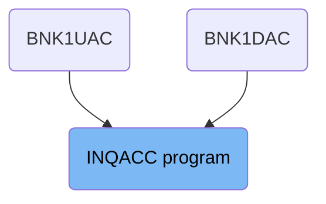
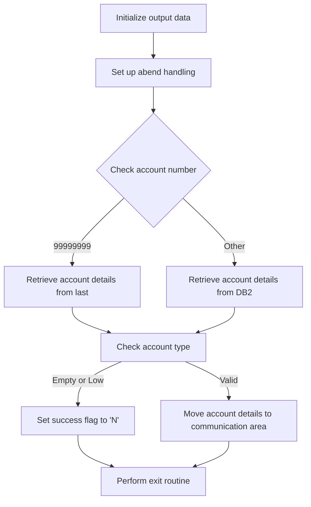
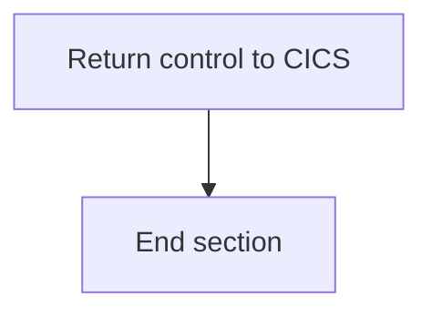

The INQACC program is responsible for retrieving account details based on the account number provided. It initializes output data, sets up abend handling, and retrieves account details either from the last record or the <SwmToken path="src/base/cobol_src/INQACC.cbl" pos="221:7:7" line-data="             PERFORM READ-ACCOUNT-DB2">`DB2`</SwmToken> datastore. The program then checks the account type and moves the account details to the communication area if valid, before performing an exit routine.

The INQACC program starts by initializing output data to ensure no previous data interferes with the current operation. It then sets up abend handling to manage any abnormal ends. The program checks the account number and retrieves account details accordingly. If the account type is valid, it moves the details to the communication area and performs an exit routine to conclude the operation.

# Where is this program used?

This program is used multiple times in the codebase as represented in the following diagram:



## PREMIERE

Lets' zoom into this section of the flow:



<SwmSnippet path="/src/base/cobol_src/INQACC.cbl" line="203">

---

First, the <SwmToken path="src/base/cobol_src/INQACC.cbl" pos="203:1:1" line-data="       PREMIERE SECTION.">`PREMIERE`</SwmToken> section initializes the output data to ensure that any previous data does not interfere with the current operation.

```cobol
       PREMIERE SECTION.
       A010.

           INITIALIZE OUTPUT-DATA.
```

---

</SwmSnippet>

<SwmSnippet path="/src/base/cobol_src/INQACC.cbl" line="210">

---

Next, it sets up abend handling by linking to the <SwmToken path="src/base/cobol_src/INQACC.cbl" pos="193:19:19" line-data="       01 WS-ABEND-PGM                 PIC X(8) VALUE &#39;ABNDPROC&#39;.">`ABNDPROC`</SwmToken> program, which ensures that any abnormal ends are properly managed.

```cobol
           EXEC CICS HANDLE
              ABEND LABEL(ABEND-HANDLING)
           END-EXEC.
```

---

</SwmSnippet>

<SwmSnippet path="/src/base/cobol_src/INQACC.cbl" line="218">

---

Moving to the account retrieval logic, the section checks if the account number is <SwmToken path="src/base/cobol_src/INQACC.cbl" pos="218:9:9" line-data="           IF INQACC-ACCNO = 99999999">`99999999`</SwmToken>. If it is, it retrieves the account details from the last record.

More about ABNDPROC: <SwmLink doc-title="Handling Abnormal Terminations (ABNDPROC)">[Handling Abnormal Terminations (ABNDPROC)](/.swm/handling-abnormal-terminations-abndproc.q6kxvboz.sw.md)</SwmLink>

```cobol
           IF INQACC-ACCNO = 99999999
             PERFORM READ-ACCOUNT-LAST
```

---

</SwmSnippet>

<SwmSnippet path="/src/base/cobol_src/INQACC.cbl" line="220">

---

If the account number is not <SwmToken path="src/base/cobol_src/INQACC.cbl" pos="218:9:9" line-data="           IF INQACC-ACCNO = 99999999">`99999999`</SwmToken>, it retrieves the account details from the <SwmToken path="src/base/cobol_src/INQACC.cbl" pos="221:7:7" line-data="             PERFORM READ-ACCOUNT-DB2">`DB2`</SwmToken> datastore.

```cobol
           ELSE
             PERFORM READ-ACCOUNT-DB2
```

---

</SwmSnippet>

<SwmSnippet path="/src/base/cobol_src/INQACC.cbl" line="229">

---

Then, the section checks if the <SwmToken path="src/base/cobol_src/INQACC.cbl" pos="229:3:5" line-data="           IF ACCOUNT-TYPE = SPACES OR LOW-VALUES">`ACCOUNT-TYPE`</SwmToken> is empty or contains low values. If it does, it sets the success flag to 'N'.

```cobol
           IF ACCOUNT-TYPE = SPACES OR LOW-VALUES
              MOVE 'N' TO INQACC-SUCCESS
```

---

</SwmSnippet>

<SwmSnippet path="/src/base/cobol_src/INQACC.cbl" line="232">

---

If the <SwmToken path="src/base/cobol_src/INQACC.cbl" pos="236:3:5" line-data="              MOVE ACCOUNT-TYPE              TO INQACC-ACC-TYPE">`ACCOUNT-TYPE`</SwmToken> is valid, it moves the account details to the communication area, ensuring that all relevant information is correctly formatted and stored.

```cobol
              MOVE ACCOUNT-EYE-CATCHER       TO INQACC-EYE
              MOVE ACCOUNT-CUST-NO           TO INQACC-CUSTNO
              MOVE ACCOUNT-SORT-CODE         TO INQACC-SCODE
              MOVE ACCOUNT-NUMBER            TO INQACC-ACCNO
              MOVE ACCOUNT-TYPE              TO INQACC-ACC-TYPE
              MOVE ACCOUNT-INTEREST-RATE     TO INQACC-INT-RATE
              MOVE ACCOUNT-OPENED            TO INQACC-OPENED
              MOVE ACCOUNT-OVERDRAFT-LIMIT   TO INQACC-OVERDRAFT
              MOVE ACCOUNT-LAST-STMT-DATE    TO INQACC-LAST-STMT-DT
              MOVE ACCOUNT-NEXT-STMT-DATE    TO INQACC-NEXT-STMT-DT
              MOVE ACCOUNT-AVAILABLE-BALANCE TO INQACC-AVAIL-BAL
              MOVE ACCOUNT-ACTUAL-BALANCE    TO INQACC-ACTUAL-BAL
              MOVE 'Y'                       TO INQACC-SUCCESS
```

---

</SwmSnippet>

<SwmSnippet path="/src/base/cobol_src/INQACC.cbl" line="247">

---

Finally, the section performs an exit routine to conclude the operation.

```cobol
           PERFORM GET-ME-OUT-OF-HERE.
```

---

</SwmSnippet>

## Interim Summary

So far, we saw how the <SwmToken path="src/base/cobol_src/INQACC.cbl" pos="203:1:1" line-data="       PREMIERE SECTION.">`PREMIERE`</SwmToken> section initializes output data, sets up abend handling, and retrieves account details based on the account number. Additionally, it checks the account type and moves the account details to the communication area if valid, before performing an exit routine. Now, we will focus on the <SwmToken path="src/base/cobol_src/INQACC.cbl" pos="247:3:11" line-data="           PERFORM GET-ME-OUT-OF-HERE.">`GET-ME-OUT-OF-HERE`</SwmToken> section, which returns control to CICS and ends the section.

## <SwmToken path="src/base/cobol_src/INQACC.cbl" pos="247:3:11" line-data="           PERFORM GET-ME-OUT-OF-HERE.">`GET-ME-OUT-OF-HERE`</SwmToken>

Lets' zoom into this section of the flow:



<SwmSnippet path="/src/base/cobol_src/INQACC.cbl" line="578">

---

### Returning control to CICS

First, the <SwmToken path="src/base/cobol_src/INQACC.cbl" pos="578:1:9" line-data="       GET-ME-OUT-OF-HERE SECTION.">`GET-ME-OUT-OF-HERE`</SwmToken> section is designed to return control back to CICS. This is achieved by executing the <SwmToken path="src/base/cobol_src/INQACC.cbl" pos="584:1:5" line-data="           EXEC CICS RETURN">`EXEC CICS RETURN`</SwmToken> command, which signals the end of the current task and returns control to the CICS region.

```cobol
       GET-ME-OUT-OF-HERE SECTION.
       GMOFH010.

      *
      *    Return control back to CICS
      *
           EXEC CICS RETURN
           END-EXEC.
```

---

</SwmSnippet>

<SwmSnippet path="/src/base/cobol_src/INQACC.cbl" line="587">

---

### Ending the section

Next, the <SwmToken path="src/base/cobol_src/INQACC.cbl" pos="587:1:1" line-data="           GOBACK.">`GOBACK`</SwmToken> statement is used to indicate the logical end of the program. This ensures that the program control is properly handed off.

```cobol
           GOBACK.
```

---

</SwmSnippet>

<SwmSnippet path="/src/base/cobol_src/INQACC.cbl" line="589">

---

### Exiting the section

Finally, the <SwmToken path="src/base/cobol_src/INQACC.cbl" pos="590:1:1" line-data="           EXIT.">`EXIT`</SwmToken> statement is used to exit the <SwmToken path="src/base/cobol_src/INQACC.cbl" pos="247:3:11" line-data="           PERFORM GET-ME-OUT-OF-HERE.">`GET-ME-OUT-OF-HERE`</SwmToken> section, ensuring that no further code in this section is executed.

```cobol
       GMOFH999.
           EXIT.
```

---

</SwmSnippet>

&nbsp;

*This is an auto-generated document by Swimm 🌊 and has not yet been verified by a human*

<SwmMeta version="3.0.0" repo-id="Z2l0aHViJTNBJTNBY2ljcy1iYW5raW5nLXNhbXBsZS1hcHBsaWNhdGlvbi1jYnNhLUlCTS1EZW1vJTNBJTNBU3dpbW0tRGVtbw==" repo-name="cics-banking-sample-application-cbsa-IBM-Demo"><sup>Powered by [Swimm](/)</sup></SwmMeta>
