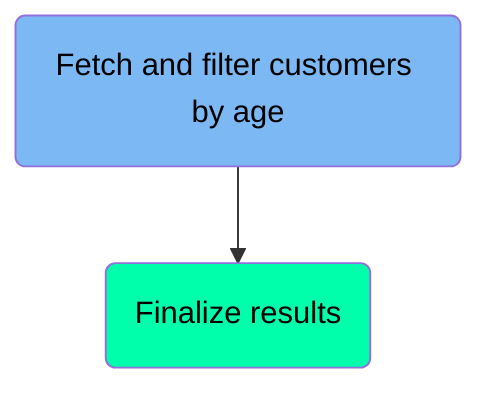
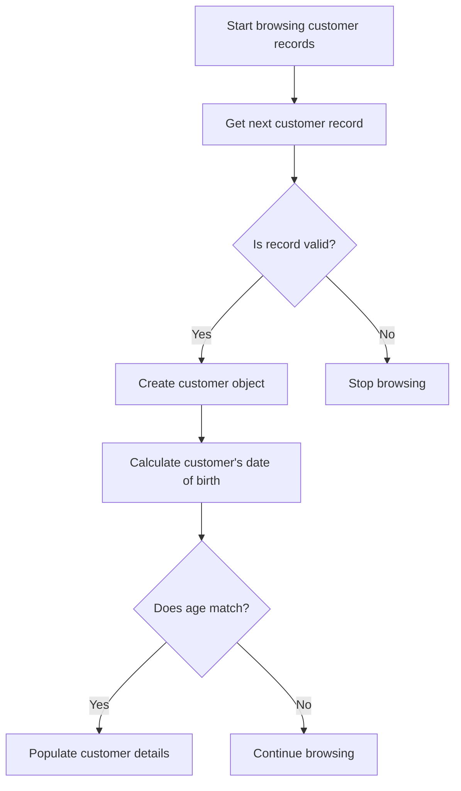
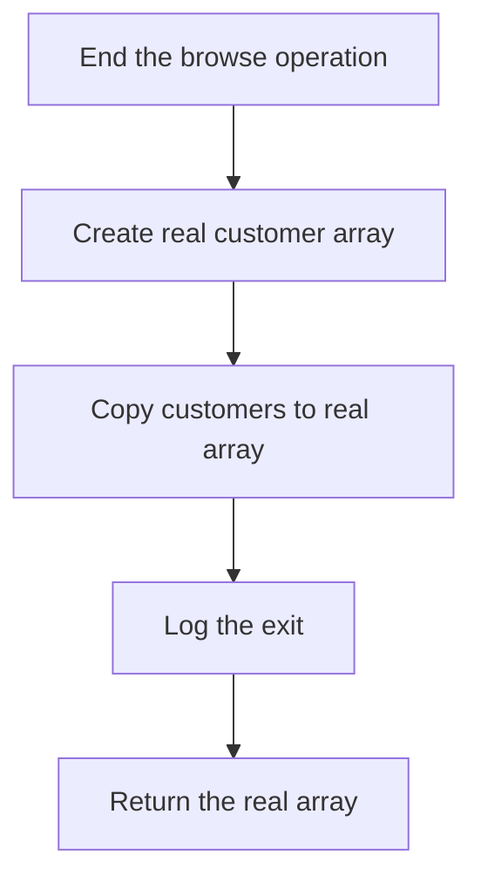

```mermaid
graph TD
  subgraph getCustomersAgeInternal
    getCustomersAgeInternal:A["Log method entry with age"] --> getCustomersAgeInternal:B["Initialize an empty JSON array and response object"]
    getCustomersAgeInternal:B --> getCustomersAgeInternal:C["Create a Customer instance and set sort code"]
    getCustomersAgeInternal:C --> getCustomersAgeInternal:D["Retrieve customers by age"]
    getCustomersAgeInternal:D --> getCustomersAgeInternal:E["Iterate over matched customers"]
    getCustomersAgeInternal:E --> getCustomersAgeInternal:F["Create JSON object for each customer"]
    getCustomersAgeInternal:F --> getCustomersAgeInternal:G["Format and add customer's date of birth to JSON" ]
    getCustomersAgeInternal:G --> getCustomersAgeInternal:H["Add customer details to the JSON array"]
    getCustomersAgeInternal:H --> getCustomersAgeInternal:I["Log method exit with response"]
    getCustomersAgeInternal:I --> getCustomersAgeInternal:J["Construct and return HTTP response"]
  end

%% Swimm:
%% graph TD
%%   subgraph <SwmToken path="src/webui/src/main/java/com/ibm/cics/cip/bankliberty/api/json/CustomerResource.java" pos="868:7:7" line-data="		Response myResponse = getCustomersAgeInternal(age);">`getCustomersAgeInternal`</SwmToken>
%%     <SwmToken path="src/webui/src/main/java/com/ibm/cics/cip/bankliberty/api/json/CustomerResource.java" pos="868:7:7" line-data="		Response myResponse = getCustomersAgeInternal(age);">`getCustomersAgeInternal`</SwmToken>:A["Log method entry with age"] --> <SwmToken path="src/webui/src/main/java/com/ibm/cics/cip/bankliberty/api/json/CustomerResource.java" pos="868:7:7" line-data="		Response myResponse = getCustomersAgeInternal(age);">`getCustomersAgeInternal`</SwmToken>:B["Initialize an empty JSON array and response object"]
%%     <SwmToken path="src/webui/src/main/java/com/ibm/cics/cip/bankliberty/api/json/CustomerResource.java" pos="868:7:7" line-data="		Response myResponse = getCustomersAgeInternal(age);">`getCustomersAgeInternal`</SwmToken>:B --> <SwmToken path="src/webui/src/main/java/com/ibm/cics/cip/bankliberty/api/json/CustomerResource.java" pos="868:7:7" line-data="		Response myResponse = getCustomersAgeInternal(age);">`getCustomersAgeInternal`</SwmToken>:C["Create a Customer instance and set sort code"]
%%     <SwmToken path="src/webui/src/main/java/com/ibm/cics/cip/bankliberty/api/json/CustomerResource.java" pos="868:7:7" line-data="		Response myResponse = getCustomersAgeInternal(age);">`getCustomersAgeInternal`</SwmToken>:C --> <SwmToken path="src/webui/src/main/java/com/ibm/cics/cip/bankliberty/api/json/CustomerResource.java" pos="868:7:7" line-data="		Response myResponse = getCustomersAgeInternal(age);">`getCustomersAgeInternal`</SwmToken>:D["Retrieve customers by age"]
%%     <SwmToken path="src/webui/src/main/java/com/ibm/cics/cip/bankliberty/api/json/CustomerResource.java" pos="868:7:7" line-data="		Response myResponse = getCustomersAgeInternal(age);">`getCustomersAgeInternal`</SwmToken>:D --> <SwmToken path="src/webui/src/main/java/com/ibm/cics/cip/bankliberty/api/json/CustomerResource.java" pos="868:7:7" line-data="		Response myResponse = getCustomersAgeInternal(age);">`getCustomersAgeInternal`</SwmToken>:E["Iterate over matched customers"]
%%     <SwmToken path="src/webui/src/main/java/com/ibm/cics/cip/bankliberty/api/json/CustomerResource.java" pos="868:7:7" line-data="		Response myResponse = getCustomersAgeInternal(age);">`getCustomersAgeInternal`</SwmToken>:E --> <SwmToken path="src/webui/src/main/java/com/ibm/cics/cip/bankliberty/api/json/CustomerResource.java" pos="868:7:7" line-data="		Response myResponse = getCustomersAgeInternal(age);">`getCustomersAgeInternal`</SwmToken>:F["Create JSON object for each customer"]
%%     <SwmToken path="src/webui/src/main/java/com/ibm/cics/cip/bankliberty/api/json/CustomerResource.java" pos="868:7:7" line-data="		Response myResponse = getCustomersAgeInternal(age);">`getCustomersAgeInternal`</SwmToken>:F --> <SwmToken path="src/webui/src/main/java/com/ibm/cics/cip/bankliberty/api/json/CustomerResource.java" pos="868:7:7" line-data="		Response myResponse = getCustomersAgeInternal(age);">`getCustomersAgeInternal`</SwmToken>:G["Format and add customer's date of birth to JSON" ]
%%     <SwmToken path="src/webui/src/main/java/com/ibm/cics/cip/bankliberty/api/json/CustomerResource.java" pos="868:7:7" line-data="		Response myResponse = getCustomersAgeInternal(age);">`getCustomersAgeInternal`</SwmToken>:G --> <SwmToken path="src/webui/src/main/java/com/ibm/cics/cip/bankliberty/api/json/CustomerResource.java" pos="868:7:7" line-data="		Response myResponse = getCustomersAgeInternal(age);">`getCustomersAgeInternal`</SwmToken>:H["Add customer details to the JSON array"]
%%     <SwmToken path="src/webui/src/main/java/com/ibm/cics/cip/bankliberty/api/json/CustomerResource.java" pos="868:7:7" line-data="		Response myResponse = getCustomersAgeInternal(age);">`getCustomersAgeInternal`</SwmToken>:H --> <SwmToken path="src/webui/src/main/java/com/ibm/cics/cip/bankliberty/api/json/CustomerResource.java" pos="868:7:7" line-data="		Response myResponse = getCustomersAgeInternal(age);">`getCustomersAgeInternal`</SwmToken>:I["Log method exit with response"]
%%     <SwmToken path="src/webui/src/main/java/com/ibm/cics/cip/bankliberty/api/json/CustomerResource.java" pos="868:7:7" line-data="		Response myResponse = getCustomersAgeInternal(age);">`getCustomersAgeInternal`</SwmToken>:I --> <SwmToken path="src/webui/src/main/java/com/ibm/cics/cip/bankliberty/api/json/CustomerResource.java" pos="868:7:7" line-data="		Response myResponse = getCustomersAgeInternal(age);">`getCustomersAgeInternal`</SwmToken>:J["Construct and return HTTP response"]
%%   end
```

In this document, we will explain the process of retrieving and processing customer data based on age. The process involves handling HTTP requests, logging, data access, and constructing JSON responses.

The flow starts with handling an HTTP GET request to retrieve customers of a specific age. The request is logged, and an internal method is called to perform the actual data retrieval. This involves querying the customer file, filtering customers by age, and constructing JSON objects for each matching customer. The data access resources are then terminated, and the response is logged and returned to the client.

Here is a high level diagram of the flow, showing only the most important functions:

```mermaid
graph TD;
      subgraph srcwebuisrcmainjavacomibmcicscipbankliberty[src/…/cip/bankliberty]
452ae6e9e08b31fd7e506e77188e55cee6d908fa1dd352dacb56cead3069e5e0(CustomerResource.getCustomersAgeExternal) --> 9e84bc4f5b60ef4cd6aab4956aff20440fe8286fb9d6d87b84e1324ca7ed194f(CustomerResource.getCustomersAgeInternal)
end

subgraph srcwebuisrcmainjavacomibmcicscipbankliberty[src/…/cip/bankliberty]
9e84bc4f5b60ef4cd6aab4956aff20440fe8286fb9d6d87b84e1324ca7ed194f(CustomerResource.getCustomersAgeInternal) --> fd70df573899f27480736410e8cb11d6b5c7303487b2f5a63096b42d3e7fa346(Customer.getCustomersByAge)
end


      classDef mainFlowStyle color:#000000,fill:#7CB9F4
classDef rootsStyle color:#000000,fill:#00FFF4
classDef Style1 color:#000000,fill:#00FFAA
classDef Style2 color:#000000,fill:#FFFF00
classDef Style3 color:#000000,fill:#AA7CB9

%% Swimm:
%% graph TD;
%%       subgraph srcwebuisrcmainjavacomibmcicscipbankliberty[<SwmPath>[src/…/cip/bankliberty/](src/webui/src/main/java/com/ibm/cics/cip/bankliberty/)</SwmPath>]
%% 452ae6e9e08b31fd7e506e77188e55cee6d908fa1dd352dacb56cead3069e5e0(CustomerResource.getCustomersAgeExternal) --> 9e84bc4f5b60ef4cd6aab4956aff20440fe8286fb9d6d87b84e1324ca7ed194f(CustomerResource.getCustomersAgeInternal)
%% end
%% 
%% subgraph srcwebuisrcmainjavacomibmcicscipbankliberty[<SwmPath>[src/…/cip/bankliberty/](src/webui/src/main/java/com/ibm/cics/cip/bankliberty/)</SwmPath>]
%% 9e84bc4f5b60ef4cd6aab4956aff20440fe8286fb9d6d87b84e1324ca7ed194f(CustomerResource.getCustomersAgeInternal) --> fd70df573899f27480736410e8cb11d6b5c7303487b2f5a63096b42d3e7fa346(Customer.getCustomersByAge)
%% end
%% 
%% 
%%       classDef mainFlowStyle color:#000000,fill:#7CB9F4
%% classDef rootsStyle color:#000000,fill:#00FFF4
%% classDef Style1 color:#000000,fill:#00FFAA
%% classDef Style2 color:#000000,fill:#FFFF00
%% classDef Style3 color:#000000,fill:#AA7CB9
```



# Flow drill down

```mermaid
graph TD
subgraph getCustomersAgeExternal
 getCustomersAgeExternal:A["Log entering function"] --> getCustomersAgeExternal:B["Call getCustomersAgeInternal with age"]
 getCustomersAgeExternal:B --> getCustomersAgeExternal:C["Initialize HBankDataAccess"]
 getCustomersAgeExternal:C --> getCustomersAgeExternal:D["Terminate HBankDataAccess"]
 getCustomersAgeExternal:D --> getCustomersAgeExternal:E["Log leaving function"]
 getCustomersAgeExternal:E --> getCustomersAgeExternal:F["Return JSON response"]
end

%% Swimm:
%% graph TD
%% subgraph <SwmToken path="src/webui/src/main/java/com/ibm/cics/cip/bankliberty/api/json/CustomerResource.java" pos="864:5:5" line-data="	public Response getCustomersAgeExternal(@PathParam(&quot;age&quot;) String age)">`getCustomersAgeExternal`</SwmToken>
%%  <SwmToken path="src/webui/src/main/java/com/ibm/cics/cip/bankliberty/api/json/CustomerResource.java" pos="864:5:5" line-data="	public Response getCustomersAgeExternal(@PathParam(&quot;age&quot;) String age)">`getCustomersAgeExternal`</SwmToken>:A["Log entering function"] --> <SwmToken path="src/webui/src/main/java/com/ibm/cics/cip/bankliberty/api/json/CustomerResource.java" pos="864:5:5" line-data="	public Response getCustomersAgeExternal(@PathParam(&quot;age&quot;) String age)">`getCustomersAgeExternal`</SwmToken>:B["Call <SwmToken path="src/webui/src/main/java/com/ibm/cics/cip/bankliberty/api/json/CustomerResource.java" pos="868:7:7" line-data="		Response myResponse = getCustomersAgeInternal(age);">`getCustomersAgeInternal`</SwmToken> with age"]
%%  <SwmToken path="src/webui/src/main/java/com/ibm/cics/cip/bankliberty/api/json/CustomerResource.java" pos="864:5:5" line-data="	public Response getCustomersAgeExternal(@PathParam(&quot;age&quot;) String age)">`getCustomersAgeExternal`</SwmToken>:B --> <SwmToken path="src/webui/src/main/java/com/ibm/cics/cip/bankliberty/api/json/CustomerResource.java" pos="864:5:5" line-data="	public Response getCustomersAgeExternal(@PathParam(&quot;age&quot;) String age)">`getCustomersAgeExternal`</SwmToken>:C["Initialize <SwmToken path="src/webui/src/main/java/com/ibm/cics/cip/bankliberty/api/json/CustomerResource.java" pos="869:1:1" line-data="		HBankDataAccess myHBankDataAccess = new HBankDataAccess();">`HBankDataAccess`</SwmToken>"]
%%  <SwmToken path="src/webui/src/main/java/com/ibm/cics/cip/bankliberty/api/json/CustomerResource.java" pos="864:5:5" line-data="	public Response getCustomersAgeExternal(@PathParam(&quot;age&quot;) String age)">`getCustomersAgeExternal`</SwmToken>:C --> <SwmToken path="src/webui/src/main/java/com/ibm/cics/cip/bankliberty/api/json/CustomerResource.java" pos="864:5:5" line-data="	public Response getCustomersAgeExternal(@PathParam(&quot;age&quot;) String age)">`getCustomersAgeExternal`</SwmToken>:D["Terminate <SwmToken path="src/webui/src/main/java/com/ibm/cics/cip/bankliberty/api/json/CustomerResource.java" pos="869:1:1" line-data="		HBankDataAccess myHBankDataAccess = new HBankDataAccess();">`HBankDataAccess`</SwmToken>"]
%%  <SwmToken path="src/webui/src/main/java/com/ibm/cics/cip/bankliberty/api/json/CustomerResource.java" pos="864:5:5" line-data="	public Response getCustomersAgeExternal(@PathParam(&quot;age&quot;) String age)">`getCustomersAgeExternal`</SwmToken>:D --> <SwmToken path="src/webui/src/main/java/com/ibm/cics/cip/bankliberty/api/json/CustomerResource.java" pos="864:5:5" line-data="	public Response getCustomersAgeExternal(@PathParam(&quot;age&quot;) String age)">`getCustomersAgeExternal`</SwmToken>:E["Log leaving function"]
%%  <SwmToken path="src/webui/src/main/java/com/ibm/cics/cip/bankliberty/api/json/CustomerResource.java" pos="864:5:5" line-data="	public Response getCustomersAgeExternal(@PathParam(&quot;age&quot;) String age)">`getCustomersAgeExternal`</SwmToken>:E --> <SwmToken path="src/webui/src/main/java/com/ibm/cics/cip/bankliberty/api/json/CustomerResource.java" pos="864:5:5" line-data="	public Response getCustomersAgeExternal(@PathParam(&quot;age&quot;) String age)">`getCustomersAgeExternal`</SwmToken>:F["Return JSON response"]
%% end
```

## Breaking down <SwmToken path="src/webui/src/main/java/com/ibm/cics/cip/bankliberty/api/json/CustomerResource.java" pos="864:5:5" line-data="	public Response getCustomersAgeExternal(@PathParam(&quot;age&quot;) String age)">`getCustomersAgeExternal`</SwmToken>



<SwmSnippet path="/src/webui/src/main/java/com/ibm/cics/cip/bankliberty/api/json/CustomerResource.java" line="861">

---

## Retrieving and processing customer data based on age

First, the <SwmToken path="src/webui/src/main/java/com/ibm/cics/cip/bankliberty/api/json/CustomerResource.java" pos="864:5:5" line-data="	public Response getCustomersAgeExternal(@PathParam(&quot;age&quot;) String age)">`getCustomersAgeExternal`</SwmToken> method is invoked to handle the request for retrieving customers of a specific age. This method is annotated with <SwmToken path="src/webui/src/main/java/com/ibm/cics/cip/bankliberty/api/json/CustomerResource.java" pos="861:1:2" line-data="	@GET">`@GET`</SwmToken> and <SwmToken path="src/webui/src/main/java/com/ibm/cics/cip/bankliberty/api/json/CustomerResource.java" pos="862:1:2" line-data="	@Path(&quot;/all/age/{age}&quot;)">`@Path`</SwmToken> to map HTTP GET requests to the specified path, ensuring that it produces a JSON response.

```java
	@GET
	@Path("/all/age/{age}")
	@Produces(MediaType.APPLICATION_JSON)
	public Response getCustomersAgeExternal(@PathParam("age") String age)
```

---

</SwmSnippet>

<SwmSnippet path="/src/webui/src/main/java/com/ibm/cics/cip/bankliberty/api/json/CustomerResource.java" line="866">

---

Next, the method logs the entry into <SwmToken path="src/webui/src/main/java/com/ibm/cics/cip/bankliberty/api/json/CustomerResource.java" pos="867:2:2" line-data="				&quot;getCustomersAgeExternal(String age) for age &quot; + age);">`getCustomersAgeExternal`</SwmToken> with the provided age parameter. This logging helps in tracking the flow of execution and debugging if necessary.

```java
		logger.entering(this.getClass().getName(),
				"getCustomersAgeExternal(String age) for age " + age);
```

---

</SwmSnippet>

<SwmSnippet path="/src/webui/src/main/java/com/ibm/cics/cip/bankliberty/api/json/CustomerResource.java" line="868">

---

Then, the method calls <SwmToken path="src/webui/src/main/java/com/ibm/cics/cip/bankliberty/api/json/CustomerResource.java" pos="868:7:7" line-data="		Response myResponse = getCustomersAgeInternal(age);">`getCustomersAgeInternal`</SwmToken> to perform the actual retrieval of customer data based on the age parameter. This internal method handles the logic of querying the customer file and constructing JSON objects for each matching customer.

```java
		Response myResponse = getCustomersAgeInternal(age);
```

---

</SwmSnippet>

<SwmSnippet path="/src/webui/src/main/java/com/ibm/cics/cip/bankliberty/api/json/CustomerResource.java" line="869">

---

After retrieving the customer data, an instance of <SwmToken path="src/webui/src/main/java/com/ibm/cics/cip/bankliberty/api/json/CustomerResource.java" pos="869:1:1" line-data="		HBankDataAccess myHBankDataAccess = new HBankDataAccess();">`HBankDataAccess`</SwmToken> is created and terminated. This step ensures that any resources or connections used during the data access are properly released.

```java
		HBankDataAccess myHBankDataAccess = new HBankDataAccess();
		myHBankDataAccess.terminate();
```

---

</SwmSnippet>

<SwmSnippet path="/src/webui/src/main/java/com/ibm/cics/cip/bankliberty/api/json/CustomerResource.java" line="871">

---

Finally, the method logs the exit from <SwmToken path="src/webui/src/main/java/com/ibm/cics/cip/bankliberty/api/json/CustomerResource.java" pos="872:2:2" line-data="				&quot;getCustomersAgeExternal(String age)&quot;, myResponse);">`getCustomersAgeExternal`</SwmToken> with the response obtained from <SwmToken path="src/webui/src/main/java/com/ibm/cics/cip/bankliberty/api/json/CustomerResource.java" pos="868:7:7" line-data="		Response myResponse = getCustomersAgeInternal(age);">`getCustomersAgeInternal`</SwmToken> and returns this response. This ensures that the client receives the JSON response containing the customers of the specified age.

```java
		logger.entering(this.getClass().getName(),
				"getCustomersAgeExternal(String age)", myResponse);
		return myResponse;
```

---

</SwmSnippet>

## Diving into the <SwmToken path="src/webui/src/main/java/com/ibm/cics/cip/bankliberty/api/json/CustomerResource.java" pos="889:2:2" line-data="				.getCustomersByAge(Integer.parseInt(age));">`getCustomersByAge`</SwmToken> function



## <SwmToken path="src/webui/src/main/java/com/ibm/cics/cip/bankliberty/api/json/CustomerResource.java" pos="889:2:2" line-data="				.getCustomersByAge(Integer.parseInt(age));">`getCustomersByAge`</SwmToken> function - Fetch and filter customers by age

Here is a diagram of this part:



<SwmSnippet path="/src/webui/src/main/java/com/ibm/cics/cip/bankliberty/web/vsam/Customer.java" line="1755">

---

### Start browsing customer records

The function begins by initializing the browsing process for customer records. It sets up a loop to iterate through a maximum of 250,000 records or until a stopping condition is met.

```java
			i = 0;
			boolean carryOn = true;

			for (int j = 0; j < 250000 && carryOn; j++)
```

---

</SwmSnippet>

<SwmSnippet path="/src/webui/src/main/java/com/ibm/cics/cip/bankliberty/web/vsam/Customer.java" line="1761">

---

### Get next customer record

Within the loop, the function retrieves the next customer record using <SwmToken path="src/webui/src/main/java/com/ibm/cics/cip/bankliberty/web/vsam/Customer.java" pos="1761:5:8" line-data="				customerFileBrowse = getNextRecord(customerFileBrowse);">`getNextRecord(customerFileBrowse)`</SwmToken>. If a valid record is found, it proceeds to create a <SwmToken path="src/webui/src/main/java/com/ibm/cics/cip/bankliberty/web/vsam/Customer.java" pos="1764:7:7" line-data="					myCustomer = new CUSTOMER(holder.getValue());">`CUSTOMER`</SwmToken> object from the record data.

```java
				customerFileBrowse = getNextRecord(customerFileBrowse);
				if (holder != null)
				{
					myCustomer = new CUSTOMER(holder.getValue());
```

---

</SwmSnippet>

<SwmSnippet path="/src/webui/src/main/java/com/ibm/cics/cip/bankliberty/web/vsam/Customer.java" line="1765">

---

### Calculate customer's date of birth

The function then calculates the customer's date of birth by setting the year, month, and day based on the customer's birth year, birth month, and birth day. This date is used to determine the customer's age.

```java
					Calendar dobCalendar = Calendar.getInstance();
					dobCalendar.set(Calendar.YEAR,
							myCustomer.getCustomerBirthYear());
					dobCalendar.set(Calendar.MONTH,
							myCustomer.getCustomerBirthMonth());
					dobCalendar.set(Calendar.DAY_OF_MONTH,
							myCustomer.getCustomerBirthDay());
					dob = new Date(dobCalendar.getTimeInMillis());
```

---

</SwmSnippet>

<SwmSnippet path="/src/webui/src/main/java/com/ibm/cics/cip/bankliberty/web/vsam/Customer.java" line="1773">

---

### Filter customers by age

The function checks if the calculated age of the customer matches the specified age. If it does, the function proceeds to populate the customer details into the <SwmToken path="src/webui/src/main/java/com/ibm/cics/cip/bankliberty/web/vsam/Customer.java" pos="1775:1:1" line-data="						temp[i] = new Customer();">`temp`</SwmToken> array.

```java
					if (customerAgeInYears(dob) == age)
					{
						temp[i] = new Customer();
```

---

</SwmSnippet>

<SwmSnippet path="/src/webui/src/main/java/com/ibm/cics/cip/bankliberty/web/vsam/Customer.java" line="1776">

---

### Populate customer details

If the customer's age matches the specified age, the function creates a new <SwmToken path="src/webui/src/main/java/com/ibm/cics/cip/bankliberty/api/json/CustomerResource.java" pos="886:15:15" line-data="		com.ibm.cics.cip.bankliberty.web.vsam.Customer myCustomer = new Customer();">`Customer`</SwmToken> object and populates it with the customer's address, customer number, name, sort code, date of birth, credit score, and credit score review date. This populated customer object is then added to the <SwmToken path="src/webui/src/main/java/com/ibm/cics/cip/bankliberty/web/vsam/Customer.java" pos="1776:1:1" line-data="						temp[i].setAddress(myCustomer.getCustomerAddress());">`temp`</SwmToken> array.

```java
						temp[i].setAddress(myCustomer.getCustomerAddress());
						temp[i].setCustomerNumber(
								Long.toString(myCustomer.getCustomerNumber()));
						temp[i].setName(myCustomer.getCustomerName());
						temp[i].setSortcode(Integer
								.toString(myCustomer.getCustomerSortcode()));
						temp[i].setDob(dob);
						temp[i].setCreditScore(Integer
								.toString(myCustomer.getCustomerCreditScore()));
						Calendar csReviewCalendar = Calendar.getInstance();
						csReviewCalendar.set(Calendar.YEAR,
								myCustomer.getCustomerCsReviewYear());
						csReviewCalendar.set(Calendar.MONTH,
								myCustomer.getCustomerCsReviewMonth());
						csReviewCalendar.set(Calendar.DAY_OF_MONTH,
								myCustomer.getCustomerCsReviewDay());
						Date csReviewDate = new Date(
								csReviewCalendar.getTimeInMillis());
						temp[i].setReviewDate(csReviewDate);
```

---

</SwmSnippet>

<SwmSnippet path="/src/webui/src/main/java/com/ibm/cics/cip/bankliberty/web/vsam/Customer.java" line="1797">

---

### Continue or stop browsing

If no valid record is found, the function sets the <SwmToken path="src/webui/src/main/java/com/ibm/cics/cip/bankliberty/web/vsam/Customer.java" pos="1800:1:1" line-data="					carryOn = false;">`carryOn`</SwmToken> flag to false, which stops the browsing process. Otherwise, it continues to the next iteration to fetch and process the next customer record.

```java
				}
				else
				{
					carryOn = false;
				}
```

---

</SwmSnippet>

## <SwmToken path="src/webui/src/main/java/com/ibm/cics/cip/bankliberty/api/json/CustomerResource.java" pos="889:2:2" line-data="				.getCustomersByAge(Integer.parseInt(age));">`getCustomersByAge`</SwmToken> function - Finalize results

Here is a diagram of this part:



<SwmSnippet path="/src/webui/src/main/java/com/ibm/cics/cip/bankliberty/web/vsam/Customer.java" line="1805">

---

### Finalizing the customer results

After processing the customer records, the browse operation on the customer file is ended to release any resources held during the browse.

```java
			customerFileBrowse.end();

```

---

</SwmSnippet>

<SwmSnippet path="/src/webui/src/main/java/com/ibm/cics/cip/bankliberty/web/vsam/Customer.java" line="1808">

---

Next, a new array <SwmToken path="src/webui/src/main/java/com/ibm/cics/cip/bankliberty/web/vsam/Customer.java" pos="1808:5:5" line-data="			Customer[] real = new Customer[i];">`real`</SwmToken> (which will hold the final customer results) is created with the exact size of the number of customers found.

```java
			Customer[] real = new Customer[i];
```

---

</SwmSnippet>

<SwmSnippet path="/src/webui/src/main/java/com/ibm/cics/cip/bankliberty/web/vsam/Customer.java" line="1809">

---

The <SwmToken path="src/webui/src/main/java/com/ibm/cics/cip/bankliberty/web/vsam/Customer.java" pos="1809:1:3" line-data="			System.arraycopy(temp, 0, real, 0, i);">`System.arraycopy`</SwmToken> method is then used to copy the relevant customer data from the temporary array <SwmToken path="src/webui/src/main/java/com/ibm/cics/cip/bankliberty/web/vsam/Customer.java" pos="1809:5:5" line-data="			System.arraycopy(temp, 0, real, 0, i);">`temp`</SwmToken> to the <SwmToken path="src/webui/src/main/java/com/ibm/cics/cip/bankliberty/web/vsam/Customer.java" pos="1809:11:11" line-data="			System.arraycopy(temp, 0, real, 0, i);">`real`</SwmToken> array.

```java
			System.arraycopy(temp, 0, real, 0, i);
```

---

</SwmSnippet>

<SwmSnippet path="/src/webui/src/main/java/com/ibm/cics/cip/bankliberty/web/vsam/Customer.java" line="1810">

---

Finally, the function logs the exit and returns the <SwmToken path="src/webui/src/main/java/com/ibm/cics/cip/bankliberty/web/vsam/Customer.java" pos="1811:1:1" line-data="					real);">`real`</SwmToken> array containing the customers that match the specified age.

```java
			logger.exiting(this.getClass().getName(), GET_CUSTOMERS_BY_AGE,
					real);
			return real;
```

---

</SwmSnippet>

## Exploring <SwmToken path="src/webui/src/main/java/com/ibm/cics/cip/bankliberty/api/json/CustomerResource.java" pos="868:7:7" line-data="		Response myResponse = getCustomersAgeInternal(age);">`getCustomersAgeInternal`</SwmToken>



<SwmSnippet path="/src/webui/src/main/java/com/ibm/cics/cip/bankliberty/api/json/CustomerResource.java" line="877">

---

## Retrieving and processing customer data

First, the method <SwmToken path="src/webui/src/main/java/com/ibm/cics/cip/bankliberty/api/json/CustomerResource.java" pos="877:5:5" line-data="	public Response getCustomersAgeInternal(String age)">`getCustomersAgeInternal`</SwmToken> logs the entry into the function with the provided age parameter.

```java
	public Response getCustomersAgeInternal(String age)
	{

		logger.entering(this.getClass().getName(),
				"getCustomersAgeInternalInternal(String age) for age " + age);
```

---

</SwmSnippet>

<SwmSnippet path="/src/webui/src/main/java/com/ibm/cics/cip/bankliberty/api/json/CustomerResource.java" line="883">

---

Next, it initializes a <SwmToken path="src/webui/src/main/java/com/ibm/cics/cip/bankliberty/api/json/CustomerResource.java" pos="883:1:1" line-data="		JSONArray allCustomers = new JSONArray();">`JSONArray`</SwmToken> to store all customer data and a <SwmToken path="src/webui/src/main/java/com/ibm/cics/cip/bankliberty/api/json/CustomerResource.java" pos="884:1:1" line-data="		JSONObject response = new JSONObject();">`JSONObject`</SwmToken> for the response.

```java
		JSONArray allCustomers = new JSONArray();
		JSONObject response = new JSONObject();
```

---

</SwmSnippet>

<SwmSnippet path="/src/webui/src/main/java/com/ibm/cics/cip/bankliberty/api/json/CustomerResource.java" line="886">

---

Then, it creates a <SwmToken path="src/webui/src/main/java/com/ibm/cics/cip/bankliberty/api/json/CustomerResource.java" pos="886:15:15" line-data="		com.ibm.cics.cip.bankliberty.web.vsam.Customer myCustomer = new Customer();">`Customer`</SwmToken> object and sets its sort code.

```java
		com.ibm.cics.cip.bankliberty.web.vsam.Customer myCustomer = new Customer();
		myCustomer.setSortcode(this.getSortCode().toString());
```

---

</SwmSnippet>

<SwmSnippet path="/src/webui/src/main/java/com/ibm/cics/cip/bankliberty/api/json/CustomerResource.java" line="888">

---

The method <SwmToken path="src/webui/src/main/java/com/ibm/cics/cip/bankliberty/api/json/CustomerResource.java" pos="889:2:2" line-data="				.getCustomersByAge(Integer.parseInt(age));">`getCustomersByAge`</SwmToken> is called to retrieve customers of the specified age, returning an array of <SwmToken path="src/webui/src/main/java/com/ibm/cics/cip/bankliberty/api/json/CustomerResource.java" pos="888:15:15" line-data="		com.ibm.cics.cip.bankliberty.web.vsam.Customer[] vsamCustomers = myCustomer">`Customer`</SwmToken> objects.

```java
		com.ibm.cics.cip.bankliberty.web.vsam.Customer[] vsamCustomers = myCustomer
				.getCustomersByAge(Integer.parseInt(age));
```

---

</SwmSnippet>

<SwmSnippet path="/src/webui/src/main/java/com/ibm/cics/cip/bankliberty/api/json/CustomerResource.java" line="891">

---

Moving to the loop, each customer object is processed to extract and format their details such as customer number, name, address, and date of birth.

```java
		for (int i = 0; i < vsamCustomers.length; i++)
		{
			JSONObject customer = new JSONObject();
			customer.put(JSON_ID, vsamCustomers[i].getCustomerNumber().trim());
			customer.put(JSON_CUSTOMER_NAME, vsamCustomers[i].getName().trim());
			customer.put(JSON_CUSTOMER_ADDRESS,
					vsamCustomers[i].getAddress().trim());

			Calendar myCalendar = Calendar.getInstance();
			myCalendar.setTime(vsamCustomers[i].getDob());
			Integer dobDD = myCalendar.get(Calendar.DAY_OF_MONTH);
			String dateOfBirth = dobDD.toString();
			dateOfBirth = dateOfBirth.concat("-");

			Integer dobMM = myCalendar.get(Calendar.MONTH) + 1;
			dateOfBirth = dateOfBirth.concat(dobMM.toString());
			dateOfBirth = dateOfBirth.concat("-");

			Integer dobYYYY = myCalendar.get(Calendar.YEAR);
			dateOfBirth = dateOfBirth.concat(dobYYYY.toString());

```

---

</SwmSnippet>

<SwmSnippet path="/src/webui/src/main/java/com/ibm/cics/cip/bankliberty/api/json/CustomerResource.java" line="916">

---

Finally, the method logs the exit from the function and constructs the response with the list of customers and the total number of customers, returning it with a status of 200.

```java
		logger.exiting(this.getClass().getName(),
				"getCustomersAgeInternal(String age)",
				Response.status(200).entity(allCustomers.toString()).build());
		response.put(JSON_CUSTOMERS, allCustomers);
		response.put(JSON_NUMBER_OF_CUSTOMERS, allCustomers.size());
		return Response.status(200).entity(response.toString()).build();
```

---

</SwmSnippet>

&nbsp;

*This is an auto-generated document by Swimm 🌊 and has not yet been verified by a human*

<SwmMeta version="3.0.0" repo-id="Z2l0aHViJTNBJTNBY2ljcy1iYW5raW5nLXNhbXBsZS1hcHBsaWNhdGlvbi1jYnNhLUlCTS1EZW1vJTNBJTNBU3dpbW0tRGVtbw==" repo-name="cics-banking-sample-application-cbsa-IBM-Demo"><sup>Powered by [Swimm](/)</sup></SwmMeta>
