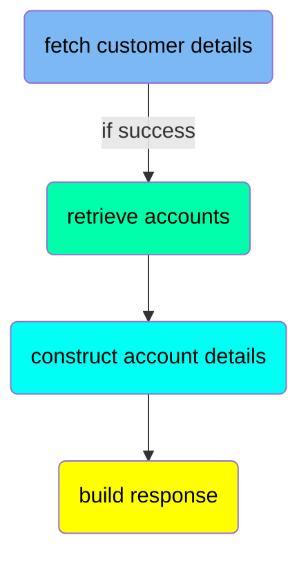
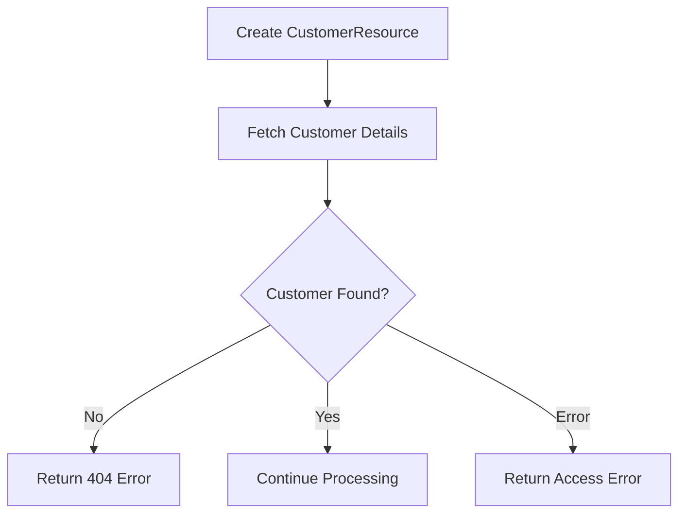
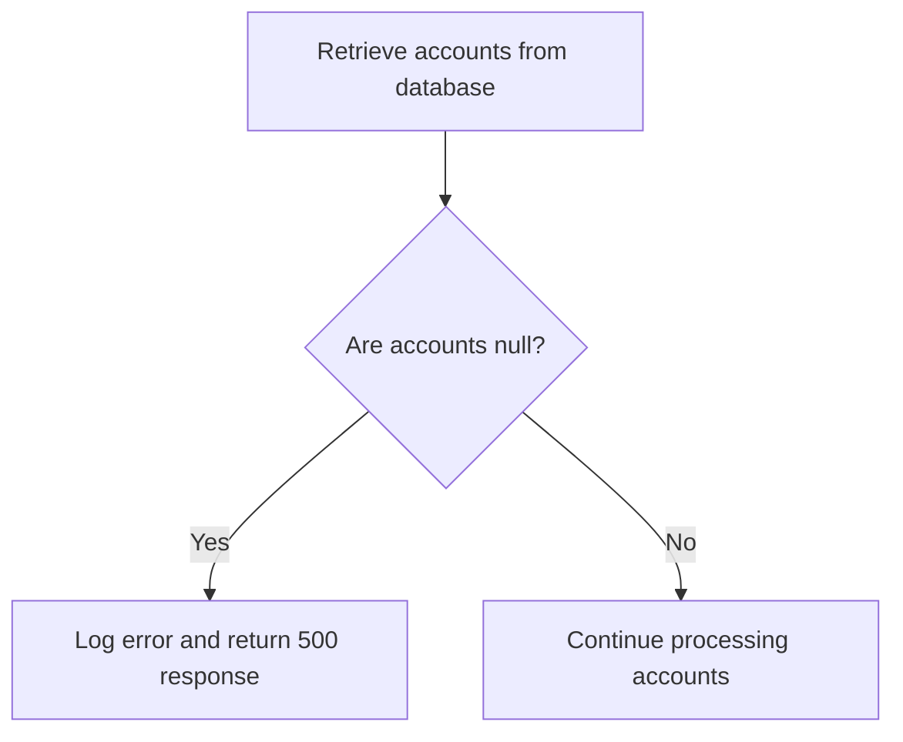
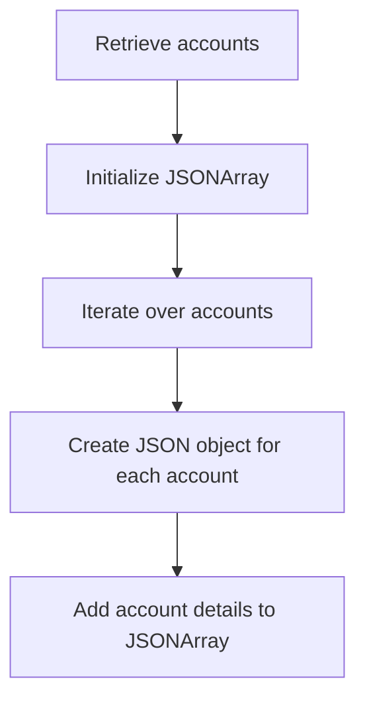
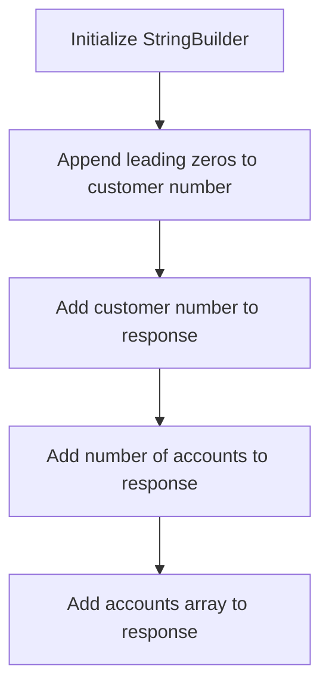

```mermaid
graph TD
  subgraph getAccounts
    getAccounts:A["Open database connection"] --> getAccounts:B["Prepare SQL statement"]
    getAccounts:B --> getAccounts:C["Set customer number"]
    getAccounts:C --> getAccounts:D["Set sort code"]
    getAccounts:D --> getAccounts:E["Execute query"]
    getAccounts:E --> getAccounts:F["Process each account from result set"]
    getAccounts:F --> getAccounts:G["Return account array"]
  end
  subgraph getCustomerInternal
    getCustomerInternal:A["Get sort code"] --> getCustomerInternal:B["Check if customer ID is negative"]
    getCustomerInternal:B -->|No| getCustomerInternal:C["Lookup customer in VSAM"]
    getCustomerInternal:C --> getCustomerInternal:D["Check if customer is found"]
    getCustomerInternal:D -->|Yes| getCustomerInternal:E["Build 200 response with customer data"]
    getCustomerInternal:D -->|No| getCustomerInternal:F["Build 404 response with error message"]
    getCustomerInternal:B -->|Yes| getCustomerInternal:G["Build 404 response for negative ID"]
    getCustomerInternal:G --> getCustomerInternal:H["Return response"]
    getCustomerInternal:E --> getCustomerInternal:H["Return response"]
    getCustomerInternal:F --> getCustomerInternal:H["Return response"]
  end

%% Swimm:
%% graph TD
%%   subgraph <SwmToken path="src/webui/src/main/java/com/ibm/cics/cip/bankliberty/api/json/AccountsResource.java" pos="545:11:11" line-data="		Account[] myAccounts = db2Account.getAccounts(customerNumber.intValue(),">`getAccounts`</SwmToken>
%%     <SwmToken path="src/webui/src/main/java/com/ibm/cics/cip/bankliberty/api/json/AccountsResource.java" pos="545:11:11" line-data="		Account[] myAccounts = db2Account.getAccounts(customerNumber.intValue(),">`getAccounts`</SwmToken>:A["Open database connection"] --> <SwmToken path="src/webui/src/main/java/com/ibm/cics/cip/bankliberty/api/json/AccountsResource.java" pos="545:11:11" line-data="		Account[] myAccounts = db2Account.getAccounts(customerNumber.intValue(),">`getAccounts`</SwmToken>:B["Prepare SQL statement"]
%%     <SwmToken path="src/webui/src/main/java/com/ibm/cics/cip/bankliberty/api/json/AccountsResource.java" pos="545:11:11" line-data="		Account[] myAccounts = db2Account.getAccounts(customerNumber.intValue(),">`getAccounts`</SwmToken>:B --> <SwmToken path="src/webui/src/main/java/com/ibm/cics/cip/bankliberty/api/json/AccountsResource.java" pos="545:11:11" line-data="		Account[] myAccounts = db2Account.getAccounts(customerNumber.intValue(),">`getAccounts`</SwmToken>:C["Set customer number"]
%%     <SwmToken path="src/webui/src/main/java/com/ibm/cics/cip/bankliberty/api/json/AccountsResource.java" pos="545:11:11" line-data="		Account[] myAccounts = db2Account.getAccounts(customerNumber.intValue(),">`getAccounts`</SwmToken>:C --> <SwmToken path="src/webui/src/main/java/com/ibm/cics/cip/bankliberty/api/json/AccountsResource.java" pos="545:11:11" line-data="		Account[] myAccounts = db2Account.getAccounts(customerNumber.intValue(),">`getAccounts`</SwmToken>:D["Set sort code"]
%%     <SwmToken path="src/webui/src/main/java/com/ibm/cics/cip/bankliberty/api/json/AccountsResource.java" pos="545:11:11" line-data="		Account[] myAccounts = db2Account.getAccounts(customerNumber.intValue(),">`getAccounts`</SwmToken>:D --> <SwmToken path="src/webui/src/main/java/com/ibm/cics/cip/bankliberty/api/json/AccountsResource.java" pos="545:11:11" line-data="		Account[] myAccounts = db2Account.getAccounts(customerNumber.intValue(),">`getAccounts`</SwmToken>:E["Execute query"]
%%     <SwmToken path="src/webui/src/main/java/com/ibm/cics/cip/bankliberty/api/json/AccountsResource.java" pos="545:11:11" line-data="		Account[] myAccounts = db2Account.getAccounts(customerNumber.intValue(),">`getAccounts`</SwmToken>:E --> <SwmToken path="src/webui/src/main/java/com/ibm/cics/cip/bankliberty/api/json/AccountsResource.java" pos="545:11:11" line-data="		Account[] myAccounts = db2Account.getAccounts(customerNumber.intValue(),">`getAccounts`</SwmToken>:F["Process each account from result set"]
%%     <SwmToken path="src/webui/src/main/java/com/ibm/cics/cip/bankliberty/api/json/AccountsResource.java" pos="545:11:11" line-data="		Account[] myAccounts = db2Account.getAccounts(customerNumber.intValue(),">`getAccounts`</SwmToken>:F --> <SwmToken path="src/webui/src/main/java/com/ibm/cics/cip/bankliberty/api/json/AccountsResource.java" pos="545:11:11" line-data="		Account[] myAccounts = db2Account.getAccounts(customerNumber.intValue(),">`getAccounts`</SwmToken>:G["Return account array"]
%%   end
%%   subgraph <SwmToken path="src/webui/src/main/java/com/ibm/cics/cip/bankliberty/api/json/AccountsResource.java" pos="507:2:2" line-data="				.getCustomerInternal(customerNumber);">`getCustomerInternal`</SwmToken>
%%     <SwmToken path="src/webui/src/main/java/com/ibm/cics/cip/bankliberty/api/json/AccountsResource.java" pos="507:2:2" line-data="				.getCustomerInternal(customerNumber);">`getCustomerInternal`</SwmToken>:A["Get sort code"] --> <SwmToken path="src/webui/src/main/java/com/ibm/cics/cip/bankliberty/api/json/AccountsResource.java" pos="507:2:2" line-data="				.getCustomerInternal(customerNumber);">`getCustomerInternal`</SwmToken>:B["Check if customer ID is negative"]
%%     <SwmToken path="src/webui/src/main/java/com/ibm/cics/cip/bankliberty/api/json/AccountsResource.java" pos="507:2:2" line-data="				.getCustomerInternal(customerNumber);">`getCustomerInternal`</SwmToken>:B -->|No| <SwmToken path="src/webui/src/main/java/com/ibm/cics/cip/bankliberty/api/json/AccountsResource.java" pos="507:2:2" line-data="				.getCustomerInternal(customerNumber);">`getCustomerInternal`</SwmToken>:C["Lookup customer in VSAM"]
%%     <SwmToken path="src/webui/src/main/java/com/ibm/cics/cip/bankliberty/api/json/AccountsResource.java" pos="507:2:2" line-data="				.getCustomerInternal(customerNumber);">`getCustomerInternal`</SwmToken>:C --> <SwmToken path="src/webui/src/main/java/com/ibm/cics/cip/bankliberty/api/json/AccountsResource.java" pos="507:2:2" line-data="				.getCustomerInternal(customerNumber);">`getCustomerInternal`</SwmToken>:D["Check if customer is found"]
%%     <SwmToken path="src/webui/src/main/java/com/ibm/cics/cip/bankliberty/api/json/AccountsResource.java" pos="507:2:2" line-data="				.getCustomerInternal(customerNumber);">`getCustomerInternal`</SwmToken>:D -->|Yes| <SwmToken path="src/webui/src/main/java/com/ibm/cics/cip/bankliberty/api/json/AccountsResource.java" pos="507:2:2" line-data="				.getCustomerInternal(customerNumber);">`getCustomerInternal`</SwmToken>:E["Build 200 response with customer data"]
%%     <SwmToken path="src/webui/src/main/java/com/ibm/cics/cip/bankliberty/api/json/AccountsResource.java" pos="507:2:2" line-data="				.getCustomerInternal(customerNumber);">`getCustomerInternal`</SwmToken>:D -->|No| <SwmToken path="src/webui/src/main/java/com/ibm/cics/cip/bankliberty/api/json/AccountsResource.java" pos="507:2:2" line-data="				.getCustomerInternal(customerNumber);">`getCustomerInternal`</SwmToken>:F["Build 404 response with error message"]
%%     <SwmToken path="src/webui/src/main/java/com/ibm/cics/cip/bankliberty/api/json/AccountsResource.java" pos="507:2:2" line-data="				.getCustomerInternal(customerNumber);">`getCustomerInternal`</SwmToken>:B -->|Yes| <SwmToken path="src/webui/src/main/java/com/ibm/cics/cip/bankliberty/api/json/AccountsResource.java" pos="507:2:2" line-data="				.getCustomerInternal(customerNumber);">`getCustomerInternal`</SwmToken>:G["Build 404 response for negative ID"]
%%     <SwmToken path="src/webui/src/main/java/com/ibm/cics/cip/bankliberty/api/json/AccountsResource.java" pos="507:2:2" line-data="				.getCustomerInternal(customerNumber);">`getCustomerInternal`</SwmToken>:G --> <SwmToken path="src/webui/src/main/java/com/ibm/cics/cip/bankliberty/api/json/AccountsResource.java" pos="507:2:2" line-data="				.getCustomerInternal(customerNumber);">`getCustomerInternal`</SwmToken>:H["Return response"]
%%     <SwmToken path="src/webui/src/main/java/com/ibm/cics/cip/bankliberty/api/json/AccountsResource.java" pos="507:2:2" line-data="				.getCustomerInternal(customerNumber);">`getCustomerInternal`</SwmToken>:E --> <SwmToken path="src/webui/src/main/java/com/ibm/cics/cip/bankliberty/api/json/AccountsResource.java" pos="507:2:2" line-data="				.getCustomerInternal(customerNumber);">`getCustomerInternal`</SwmToken>:H["Return response"]
%%     <SwmToken path="src/webui/src/main/java/com/ibm/cics/cip/bankliberty/api/json/AccountsResource.java" pos="507:2:2" line-data="				.getCustomerInternal(customerNumber);">`getCustomerInternal`</SwmToken>:F --> <SwmToken path="src/webui/src/main/java/com/ibm/cics/cip/bankliberty/api/json/AccountsResource.java" pos="507:2:2" line-data="				.getCustomerInternal(customerNumber);">`getCustomerInternal`</SwmToken>:H["Return response"]
%%   end
```

This document outlines the process of retrieving account details for a customer. The process involves fetching customer details, retrieving associated accounts, constructing detailed account information, and building a response.

The flow starts by fetching the customer details using the customer number. If the customer is found, the associated accounts are retrieved from the database. The function then constructs detailed information for each account and builds a response containing the customer number, number of accounts, and the account details.

# Where is this flow used?

This flow is used multiple times in the codebase as represented in the following diagram:

```mermaid
graph TD;
      subgraph srcwebuisrcmainjavacomibmcicscipbanklibertyapijson[src/…/api/json]
d49ebb1b315a9b620fa465764b00f97cdd9c107764a7b83ec90c6ed9d0cd2920(deleteCustomerInternal) --> 684eeaac8794ce5d410ff6628b5badf434d88acc2c317574d21ad654147bf93c(AccountsResource.getAccountsByCustomerInternal)
end

subgraph srcwebuisrcmainjavacomibmcicscipbanklibertyapijson[src/…/api/json]
c2d23d7e56810a46c767a5003f3368a0a6d0001b55376d5a3caaa02b285256d1(deleteCustomerExternal) --> d49ebb1b315a9b620fa465764b00f97cdd9c107764a7b83ec90c6ed9d0cd2920(deleteCustomerInternal)
end

subgraph srcwebuisrcmainjavacomibmcicscipbanklibertyapijson[src/…/api/json]
bbfb78b67e00621dae0654ad63f9ed1f51677a5602135e9fe3059639514361f6(deleteFromDB) --> c2d23d7e56810a46c767a5003f3368a0a6d0001b55376d5a3caaa02b285256d1(deleteCustomerExternal)
end

subgraph srcwebuisrcmainjavacomibmcicscipbanklibertyapijson[src/…/api/json]
20c353ec6b7847bf6dd50e9718f661cbd545c66fd77064ec4fcedda27e47686e(createAccountInternal) --> 684eeaac8794ce5d410ff6628b5badf434d88acc2c317574d21ad654147bf93c(AccountsResource.getAccountsByCustomerInternal)
end

subgraph srcwebuisrcmainjavacomibmcicscipbanklibertyapijson[src/…/api/json]
0fa4538a849f744050a3d3731eb523a0bb84ad09a9f07d05efa1ca97ebf53fc3(addToDB) --> 20c353ec6b7847bf6dd50e9718f661cbd545c66fd77064ec4fcedda27e47686e(createAccountInternal)
end

subgraph srcwebuisrcmainjavacomibmcicscipbanklibertyapijson[src/…/api/json]
004757944597cfaf6c17c0890739bb38e10417bbc1a28c09a102b0f6e10fec10(createAccountExternal) --> 20c353ec6b7847bf6dd50e9718f661cbd545c66fd77064ec4fcedda27e47686e(createAccountInternal)
end

subgraph srcwebuisrcmainjavacomibmcicscipbanklibertyapijson[src/…/api/json]
b873a64b2b973855c6b651c8e30ef00dc70f58c1cbbe7530076401f7544aa3fe(getAccountsByCustomerExternal) --> 684eeaac8794ce5d410ff6628b5badf434d88acc2c317574d21ad654147bf93c(AccountsResource.getAccountsByCustomerInternal)
end

subgraph srcwebuisrcmainjavacomibmcicscipbanklibertyapijson[src/…/api/json]
855e1ece538b26db35ebd6ecc417013a2befd8e521c6095ca64b30df9c069cc7(howMany) --> b873a64b2b973855c6b651c8e30ef00dc70f58c1cbbe7530076401f7544aa3fe(getAccountsByCustomerExternal)
end

subgraph srcwebuisrcmainjavacomibmcicscipbanklibertywebuidataaccess[src/…/webui/data_access]
35071798a14ed958216c3949a712bb2b2044873ef6e7e9f8b2e9daec9d9fc0f7(getCount) --> 855e1ece538b26db35ebd6ecc417013a2befd8e521c6095ca64b30df9c069cc7(howMany)
end

subgraph srcwebuisrcmainjavacomibmcicscipbanklibertywebuidataaccess[src/…/webui/data_access]
2600ac28dc000890254843bdccb24a3223e0a60b98ef28c3c748c3853fb68b8a(doGet) --> 855e1ece538b26db35ebd6ecc417013a2befd8e521c6095ca64b30df9c069cc7(howMany)
end

subgraph srcwebuisrcmainjavacomibmcicscipbanklibertyapijson[src/…/api/json]
2600ac28dc000890254843bdccb24a3223e0a60b98ef28c3c748c3853fb68b8a(doGet) --> b873a64b2b973855c6b651c8e30ef00dc70f58c1cbbe7530076401f7544aa3fe(getAccountsByCustomerExternal)
end


      classDef mainFlowStyle color:#000000,fill:#7CB9F4
classDef rootsStyle color:#000000,fill:#00FFF4
classDef Style1 color:#000000,fill:#00FFAA
classDef Style2 color:#000000,fill:#FFFF00
classDef Style3 color:#000000,fill:#AA7CB9

%% Swimm:
%% graph TD;
%%       subgraph srcwebuisrcmainjavacomibmcicscipbanklibertyapijson[<SwmPath>[src/…/api/json/](src/webui/src/main/java/com/ibm/cics/cip/bankliberty/api/json/)</SwmPath>]
%% d49ebb1b315a9b620fa465764b00f97cdd9c107764a7b83ec90c6ed9d0cd2920(<SwmToken path="src/webui/src/main/java/com/ibm/cics/cip/bankliberty/api/json/CustomerResource.java" pos="64:14:14" line-data="	private static final String DELETE_CUSTOMER_INTERNAL = &quot;deleteCustomerInternal()&quot;;">`deleteCustomerInternal`</SwmToken>) --> 684eeaac8794ce5d410ff6628b5badf434d88acc2c317574d21ad654147bf93c(AccountsResource.getAccountsByCustomerInternal)
%% end
%% 
%% subgraph srcwebuisrcmainjavacomibmcicscipbanklibertyapijson[<SwmPath>[src/…/api/json/](src/webui/src/main/java/com/ibm/cics/cip/bankliberty/api/json/)</SwmPath>]
%% c2d23d7e56810a46c767a5003f3368a0a6d0001b55376d5a3caaa02b285256d1(<SwmToken path="src/webui/src/main/java/com/ibm/cics/cip/bankliberty/api/json/CustomerResource.java" pos="550:5:5" line-data="	public Response deleteCustomerExternal(@PathParam(JSON_ID) Long id)">`deleteCustomerExternal`</SwmToken>) --> d49ebb1b315a9b620fa465764b00f97cdd9c107764a7b83ec90c6ed9d0cd2920(<SwmToken path="src/webui/src/main/java/com/ibm/cics/cip/bankliberty/api/json/CustomerResource.java" pos="64:14:14" line-data="	private static final String DELETE_CUSTOMER_INTERNAL = &quot;deleteCustomerInternal()&quot;;">`deleteCustomerInternal`</SwmToken>)
%% end
%% 
%% subgraph srcwebuisrcmainjavacomibmcicscipbanklibertyapijson[<SwmPath>[src/…/api/json/](src/webui/src/main/java/com/ibm/cics/cip/bankliberty/api/json/)</SwmPath>]
%% bbfb78b67e00621dae0654ad63f9ed1f51677a5602135e9fe3059639514361f6(deleteFromDB) --> c2d23d7e56810a46c767a5003f3368a0a6d0001b55376d5a3caaa02b285256d1(<SwmToken path="src/webui/src/main/java/com/ibm/cics/cip/bankliberty/api/json/CustomerResource.java" pos="550:5:5" line-data="	public Response deleteCustomerExternal(@PathParam(JSON_ID) Long id)">`deleteCustomerExternal`</SwmToken>)
%% end
%% 
%% subgraph srcwebuisrcmainjavacomibmcicscipbanklibertyapijson[<SwmPath>[src/…/api/json/](src/webui/src/main/java/com/ibm/cics/cip/bankliberty/api/json/)</SwmPath>]
%% 20c353ec6b7847bf6dd50e9718f661cbd545c66fd77064ec4fcedda27e47686e(<SwmToken path="src/webui/src/main/java/com/ibm/cics/cip/bankliberty/api/json/AccountsResource.java" pos="57:14:14" line-data="	private static final String CREATE_ACCOUNT_INTERNAL = &quot;createAccountInternal(AccountJSON account)&quot;;">`createAccountInternal`</SwmToken>) --> 684eeaac8794ce5d410ff6628b5badf434d88acc2c317574d21ad654147bf93c(AccountsResource.getAccountsByCustomerInternal)
%% end
%% 
%% subgraph srcwebuisrcmainjavacomibmcicscipbanklibertyapijson[<SwmPath>[src/…/api/json/](src/webui/src/main/java/com/ibm/cics/cip/bankliberty/api/json/)</SwmPath>]
%% 0fa4538a849f744050a3d3731eb523a0bb84ad09a9f07d05efa1ca97ebf53fc3(addToDB) --> 20c353ec6b7847bf6dd50e9718f661cbd545c66fd77064ec4fcedda27e47686e(<SwmToken path="src/webui/src/main/java/com/ibm/cics/cip/bankliberty/api/json/AccountsResource.java" pos="57:14:14" line-data="	private static final String CREATE_ACCOUNT_INTERNAL = &quot;createAccountInternal(AccountJSON account)&quot;;">`createAccountInternal`</SwmToken>)
%% end
%% 
%% subgraph srcwebuisrcmainjavacomibmcicscipbanklibertyapijson[<SwmPath>[src/…/api/json/](src/webui/src/main/java/com/ibm/cics/cip/bankliberty/api/json/)</SwmPath>]
%% 004757944597cfaf6c17c0890739bb38e10417bbc1a28c09a102b0f6e10fec10(<SwmToken path="src/webui/src/main/java/com/ibm/cics/cip/bankliberty/api/json/AccountsResource.java" pos="59:14:14" line-data="	private static final String CREATE_ACCOUNT_EXTERNAL = &quot;createAccountExternal(AccountJSON account)&quot;;">`createAccountExternal`</SwmToken>) --> 20c353ec6b7847bf6dd50e9718f661cbd545c66fd77064ec4fcedda27e47686e(<SwmToken path="src/webui/src/main/java/com/ibm/cics/cip/bankliberty/api/json/AccountsResource.java" pos="57:14:14" line-data="	private static final String CREATE_ACCOUNT_INTERNAL = &quot;createAccountInternal(AccountJSON account)&quot;;">`createAccountInternal`</SwmToken>)
%% end
%% 
%% subgraph srcwebuisrcmainjavacomibmcicscipbanklibertyapijson[<SwmPath>[src/…/api/json/](src/webui/src/main/java/com/ibm/cics/cip/bankliberty/api/json/)</SwmPath>]
%% b873a64b2b973855c6b651c8e30ef00dc70f58c1cbbe7530076401f7544aa3fe(<SwmToken path="src/webui/src/main/java/com/ibm/cics/cip/bankliberty/api/json/AccountsResource.java" pos="474:5:5" line-data="	public Response getAccountsByCustomerExternal(">`getAccountsByCustomerExternal`</SwmToken>) --> 684eeaac8794ce5d410ff6628b5badf434d88acc2c317574d21ad654147bf93c(AccountsResource.getAccountsByCustomerInternal)
%% end
%% 
%% subgraph srcwebuisrcmainjavacomibmcicscipbanklibertyapijson[<SwmPath>[src/…/api/json/](src/webui/src/main/java/com/ibm/cics/cip/bankliberty/api/json/)</SwmPath>]
%% 855e1ece538b26db35ebd6ecc417013a2befd8e521c6095ca64b30df9c069cc7(howMany) --> b873a64b2b973855c6b651c8e30ef00dc70f58c1cbbe7530076401f7544aa3fe(<SwmToken path="src/webui/src/main/java/com/ibm/cics/cip/bankliberty/api/json/AccountsResource.java" pos="474:5:5" line-data="	public Response getAccountsByCustomerExternal(">`getAccountsByCustomerExternal`</SwmToken>)
%% end
%% 
%% subgraph srcwebuisrcmainjavacomibmcicscipbanklibertywebuidataaccess[<SwmPath>[src/…/webui/data_access/](src/webui/src/main/java/com/ibm/cics/cip/bankliberty/webui/data_access/)</SwmPath>]
%% 35071798a14ed958216c3949a712bb2b2044873ef6e7e9f8b2e9daec9d9fc0f7(getCount) --> 855e1ece538b26db35ebd6ecc417013a2befd8e521c6095ca64b30df9c069cc7(howMany)
%% end
%% 
%% subgraph srcwebuisrcmainjavacomibmcicscipbanklibertywebuidataaccess[<SwmPath>[src/…/webui/data_access/](src/webui/src/main/java/com/ibm/cics/cip/bankliberty/webui/data_access/)</SwmPath>]
%% 2600ac28dc000890254843bdccb24a3223e0a60b98ef28c3c748c3853fb68b8a(doGet) --> 855e1ece538b26db35ebd6ecc417013a2befd8e521c6095ca64b30df9c069cc7(howMany)
%% end
%% 
%% subgraph srcwebuisrcmainjavacomibmcicscipbanklibertyapijson[<SwmPath>[src/…/api/json/](src/webui/src/main/java/com/ibm/cics/cip/bankliberty/api/json/)</SwmPath>]
%% 2600ac28dc000890254843bdccb24a3223e0a60b98ef28c3c748c3853fb68b8a(doGet) --> b873a64b2b973855c6b651c8e30ef00dc70f58c1cbbe7530076401f7544aa3fe(<SwmToken path="src/webui/src/main/java/com/ibm/cics/cip/bankliberty/api/json/AccountsResource.java" pos="474:5:5" line-data="	public Response getAccountsByCustomerExternal(">`getAccountsByCustomerExternal`</SwmToken>)
%% end
%% 
%% 
%%       classDef mainFlowStyle color:#000000,fill:#7CB9F4
%% classDef rootsStyle color:#000000,fill:#00FFF4
%% classDef Style1 color:#000000,fill:#00FFAA
%% classDef Style2 color:#000000,fill:#FFFF00
%% classDef Style3 color:#000000,fill:#AA7CB9
```



# Flow drill down

## Diving into the <SwmToken path="src/webui/src/main/java/com/ibm/cics/cip/bankliberty/api/json/AccountsResource.java" pos="63:14:14" line-data="	private static final String GET_ACCOUNTS_BY_CUSTOMER_INTERNAL = &quot;getAccountsByCustomerInternal(Long customerNumber, boolean countOnly)&quot;;">`getAccountsByCustomerInternal`</SwmToken> function



## <SwmToken path="src/webui/src/main/java/com/ibm/cics/cip/bankliberty/api/json/AccountsResource.java" pos="63:14:14" line-data="	private static final String GET_ACCOUNTS_BY_CUSTOMER_INTERNAL = &quot;getAccountsByCustomerInternal(Long customerNumber, boolean countOnly)&quot;;">`getAccountsByCustomerInternal`</SwmToken> function - fetch customer details

Here is a diagram of this part:



<SwmSnippet path="/src/webui/src/main/java/com/ibm/cics/cip/bankliberty/api/json/AccountsResource.java" line="504">

---

### Fetching customer details

The function begins by creating an instance of <SwmToken path="src/webui/src/main/java/com/ibm/cics/cip/bankliberty/api/json/AccountsResource.java" pos="505:1:1" line-data="		CustomerResource myCustomer = new CustomerResource();">`CustomerResource`</SwmToken> and fetching the customer details using the <SwmToken path="src/webui/src/main/java/com/ibm/cics/cip/bankliberty/api/json/AccountsResource.java" pos="507:2:2" line-data="				.getCustomerInternal(customerNumber);">`getCustomerInternal`</SwmToken> method with the provided <SwmToken path="src/webui/src/main/java/com/ibm/cics/cip/bankliberty/api/json/AccountsResource.java" pos="507:4:4" line-data="				.getCustomerInternal(customerNumber);">`customerNumber`</SwmToken>.

```java

		CustomerResource myCustomer = new CustomerResource();
		Response customerResponse = myCustomer
				.getCustomerInternal(customerNumber);
```

---

</SwmSnippet>

<SwmSnippet path="/src/webui/src/main/java/com/ibm/cics/cip/bankliberty/api/json/AccountsResource.java" line="509">

---

### Handling customer not found error

If the customer is not found (status 404), the function constructs a JSON error message indicating that the customer cannot be found and logs the error. It then returns a response with a 404 status code.

```java
		if (customerResponse.getStatus() != 200)
		{
			if (customerResponse.getStatus() == 404)
			{
				// If cannot find response "CustomerResponse" then error 404
				// returned
				JSONObject error = new JSONObject();
				error.put(JSON_ERROR_MSG, CUSTOMER_NUMBER_LITERAL
						+ customerNumber.longValue() + CANNOT_BE_FOUND);
				logger.log(Level.SEVERE, () -> CUSTOMER_NUMBER_LITERAL
						+ customerNumber.longValue() + CANNOT_BE_FOUND);
				myResponse = Response.status(404).entity(error.toString())
						.build();
				logger.exiting(this.getClass().getName(),
						GET_ACCOUNTS_BY_CUSTOMER_INTERNAL, myResponse);
				return myResponse;
```

---

</SwmSnippet>

<SwmSnippet path="/src/webui/src/main/java/com/ibm/cics/cip/bankliberty/api/json/AccountsResource.java" line="526">

---

### Handling customer access error

If the customer cannot be accessed for any other reason, the function constructs a JSON error message with the status code and logs the error. It then returns a response with the appropriate status code.

```java
			else
			{
				JSONObject error = new JSONObject();
				error.put(JSON_ERROR_MSG,
						CUSTOMER_NUMBER_LITERAL + customerNumber.longValue()
								+ " cannot be accessed. "
								+ customerResponse.toString());
				logger.log(Level.SEVERE, () -> CUSTOMER_NUMBER_LITERAL
						+ customerNumber.longValue() + " cannot be accessed. "
						+ customerResponse.toString());
				myResponse = Response.status(customerResponse.getStatus())
						.entity(error.toString()).build();
				logger.exiting(this.getClass().getName(),
						GET_ACCOUNTS_BY_CUSTOMER_INTERNAL, myResponse);
				return myResponse;
```

---

</SwmSnippet>

## <SwmToken path="src/webui/src/main/java/com/ibm/cics/cip/bankliberty/api/json/AccountsResource.java" pos="63:14:14" line-data="	private static final String GET_ACCOUNTS_BY_CUSTOMER_INTERNAL = &quot;getAccountsByCustomerInternal(Long customerNumber, boolean countOnly)&quot;;">`getAccountsByCustomerInternal`</SwmToken> function - retrieve accounts

Here is a diagram of this part:



<SwmSnippet path="/src/webui/src/main/java/com/ibm/cics/cip/bankliberty/api/json/AccountsResource.java" line="544">

---

### Retrieving accounts from the database

The function retrieves all accounts associated with a given customer number and sort code from the database. This is done by calling the <SwmToken path="src/webui/src/main/java/com/ibm/cics/cip/bankliberty/api/json/AccountsResource.java" pos="545:11:11" line-data="		Account[] myAccounts = db2Account.getAccounts(customerNumber.intValue(),">`getAccounts`</SwmToken> method on the <SwmToken path="src/webui/src/main/java/com/ibm/cics/cip/bankliberty/api/json/AccountsResource.java" pos="544:17:17" line-data="		com.ibm.cics.cip.bankliberty.web.db2.Account db2Account = new Account();">`db2Account`</SwmToken> object, which executes an SQL query and maps the result set to an array of <SwmToken path="src/webui/src/main/java/com/ibm/cics/cip/bankliberty/api/json/AccountsResource.java" pos="544:15:15" line-data="		com.ibm.cics.cip.bankliberty.web.db2.Account db2Account = new Account();">`Account`</SwmToken> objects.

```java
		com.ibm.cics.cip.bankliberty.web.db2.Account db2Account = new Account();
		Account[] myAccounts = db2Account.getAccounts(customerNumber.intValue(),
				sortCode);
```

---

</SwmSnippet>

<SwmSnippet path="/src/webui/src/main/java/com/ibm/cics/cip/bankliberty/api/json/AccountsResource.java" line="547">

---

### Handling null results

If the retrieved accounts are null, the function logs an error message indicating that the accounts cannot be accessed for the specified customer. It then constructs a JSON error response with a status code of 500 and returns this response.

```java
		if (myAccounts == null)
		{
			JSONObject error = new JSONObject();
			error.put(JSON_ERROR_MSG,
					"Accounts cannot be accessed for customer "
							+ customerNumber.longValue() + CLASS_NAME_MSG);
			logger.log(Level.SEVERE,
					() -> "Accounts cannot be accessed for customer "
							+ customerNumber.longValue() + CLASS_NAME_MSG);
			myResponse = Response.status(500).entity(error.toString()).build();
			logger.exiting(this.getClass().getName(),
					GET_ACCOUNTS_BY_CUSTOMER_INTERNAL, myResponse);
			return myResponse;
		}
```

---

</SwmSnippet>

## <SwmToken path="src/webui/src/main/java/com/ibm/cics/cip/bankliberty/api/json/AccountsResource.java" pos="63:14:14" line-data="	private static final String GET_ACCOUNTS_BY_CUSTOMER_INTERNAL = &quot;getAccountsByCustomerInternal(Long customerNumber, boolean countOnly)&quot;;">`getAccountsByCustomerInternal`</SwmToken> function - construct account details

Here is a diagram of this part:



### Constructing account details

The core logic of the <SwmToken path="src/webui/src/main/java/com/ibm/cics/cip/bankliberty/api/json/AccountsResource.java" pos="63:14:14" line-data="	private static final String GET_ACCOUNTS_BY_CUSTOMER_INTERNAL = &quot;getAccountsByCustomerInternal(Long customerNumber, boolean countOnly)&quot;;">`getAccountsByCustomerInternal`</SwmToken> function involves constructing detailed account information for each account associated with a customer. This is done by iterating over the array of accounts retrieved from the database.

<SwmSnippet path="/src/webui/src/main/java/com/ibm/cics/cip/bankliberty/api/json/AccountsResource.java" line="562">

---

First, the number of accounts is determined by getting the length of the <SwmToken path="src/webui/src/main/java/com/ibm/cics/cip/bankliberty/api/json/AccountsResource.java" pos="562:5:5" line-data="		numberOfAccounts = myAccounts.length;">`myAccounts`</SwmToken> array, and a new <SwmToken path="src/webui/src/main/java/com/ibm/cics/cip/bankliberty/api/json/AccountsResource.java" pos="563:7:7" line-data="		accounts = new JSONArray(numberOfAccounts);">`JSONArray`</SwmToken> is initialized with this length.

```java
		numberOfAccounts = myAccounts.length;
		accounts = new JSONArray(numberOfAccounts);
```

---

</SwmSnippet>

<SwmSnippet path="/src/webui/src/main/java/com/ibm/cics/cip/bankliberty/api/json/AccountsResource.java" line="564">

---

Next, the function iterates over each account in the <SwmToken path="src/webui/src/main/java/com/ibm/cics/cip/bankliberty/api/json/AccountsResource.java" pos="568:8:8" line-data="			account.put(JSON_SORT_CODE, myAccounts[i].getSortcode());">`myAccounts`</SwmToken> array. For each account, a new <SwmToken path="src/webui/src/main/java/com/ibm/cics/cip/bankliberty/api/json/AccountsResource.java" pos="567:1:1" line-data="			JSONObject account = new JSONObject();">`JSONObject`</SwmToken> is created and populated with various account details such as sort code, account number, customer number, account type, available balance, actual balance, interest rate, overdraft limit, last statement date, next statement date, and the date the account was opened.

```java
		for (int i = 0; i < numberOfAccounts; i++)
		{

			JSONObject account = new JSONObject();
			account.put(JSON_SORT_CODE, myAccounts[i].getSortcode());
			account.put("id", myAccounts[i].getAccountNumber());
			account.put(JSON_CUSTOMER_NUMBER,
					myAccounts[i].getCustomerNumber());
			account.put(JSON_ACCOUNT_TYPE, myAccounts[i].getType());
			account.put(JSON_AVAILABLE_BALANCE,
					BigDecimal.valueOf(myAccounts[i].getAvailableBalance()));
			account.put(JSON_ACTUAL_BALANCE,
					BigDecimal.valueOf(myAccounts[i].getActualBalance()));
			account.put(JSON_INTEREST_RATE,
					BigDecimal.valueOf(myAccounts[i].getInterestRate()));
			account.put(JSON_OVERDRAFT, myAccounts[i].getOverdraftLimit());
			account.put(JSON_LAST_STATEMENT_DATE,
					myAccounts[i].getLastStatement().toString());
			account.put(JSON_NEXT_STATEMENT_DATE,
					myAccounts[i].getNextStatement().toString());
			account.put(JSON_DATE_OPENED, myAccounts[i].getOpened().toString());
```

---

</SwmSnippet>

## <SwmToken path="src/webui/src/main/java/com/ibm/cics/cip/bankliberty/api/json/AccountsResource.java" pos="63:14:14" line-data="	private static final String GET_ACCOUNTS_BY_CUSTOMER_INTERNAL = &quot;getAccountsByCustomerInternal(Long customerNumber, boolean countOnly)&quot;;">`getAccountsByCustomerInternal`</SwmToken> function - build response

Here is a diagram of this part:



<SwmSnippet path="/src/webui/src/main/java/com/ibm/cics/cip/bankliberty/api/json/AccountsResource.java" line="588">

---

### Building the response JSON object

The function begins by initializing a <SwmToken path="src/webui/src/main/java/com/ibm/cics/cip/bankliberty/api/json/AccountsResource.java" pos="588:1:1" line-data="		StringBuilder myStringBuilder = new StringBuilder();">`StringBuilder`</SwmToken> to construct the customer number with leading zeros if necessary.

```java
		StringBuilder myStringBuilder = new StringBuilder();

```

---

</SwmSnippet>

<SwmSnippet path="/src/webui/src/main/java/com/ibm/cics/cip/bankliberty/api/json/AccountsResource.java" line="590">

---

It then appends leading zeros to the customer number until it reaches the required length (<SwmToken path="src/webui/src/main/java/com/ibm/cics/cip/bankliberty/api/json/AccountsResource.java" pos="590:25:25" line-data="		for (int i = customerNumber.toString().length(); i &lt; CUSTOMER_NUMBER_LENGTH; i++)">`CUSTOMER_NUMBER_LENGTH`</SwmToken>). This ensures that the customer number is formatted correctly.

```java
		for (int i = customerNumber.toString().length(); i < CUSTOMER_NUMBER_LENGTH; i++)
		{
			myStringBuilder.append('0');
		}
		myStringBuilder.append(customerNumber.toString());
```

---

</SwmSnippet>

<SwmSnippet path="/src/webui/src/main/java/com/ibm/cics/cip/bankliberty/api/json/AccountsResource.java" line="596">

---

Next, the formatted customer number is added to the <SwmToken path="src/webui/src/main/java/com/ibm/cics/cip/bankliberty/api/json/AccountsResource.java" pos="596:1:1" line-data="		response.put(JSON_CUSTOMER_NUMBER, myStringBuilder.toString());">`response`</SwmToken> JSON object.

```java
		response.put(JSON_CUSTOMER_NUMBER, myStringBuilder.toString());
```

---

</SwmSnippet>

<SwmSnippet path="/src/webui/src/main/java/com/ibm/cics/cip/bankliberty/api/json/AccountsResource.java" line="597">

---

The function also adds the total number of accounts to the <SwmToken path="src/webui/src/main/java/com/ibm/cics/cip/bankliberty/api/json/AccountsResource.java" pos="597:1:1" line-data="		response.put(JSON_NUMBER_OF_ACCOUNTS, numberOfAccounts);">`response`</SwmToken> JSON object.

```java
		response.put(JSON_NUMBER_OF_ACCOUNTS, numberOfAccounts);
```

---

</SwmSnippet>

<SwmSnippet path="/src/webui/src/main/java/com/ibm/cics/cip/bankliberty/api/json/AccountsResource.java" line="598">

---

Finally, the <SwmToken path="src/webui/src/main/java/com/ibm/cics/cip/bankliberty/api/json/AccountsResource.java" pos="598:8:8" line-data="		response.put(JSON_ACCOUNTS, accounts);">`accounts`</SwmToken> array, which contains details of each account, is added to the <SwmToken path="src/webui/src/main/java/com/ibm/cics/cip/bankliberty/api/json/AccountsResource.java" pos="598:1:1" line-data="		response.put(JSON_ACCOUNTS, accounts);">`response`</SwmToken> JSON object.

```java
		response.put(JSON_ACCOUNTS, accounts);
```

---

</SwmSnippet>



<SwmSnippet path="/src/webui/src/main/java/com/ibm/cics/cip/bankliberty/api/json/CustomerResource.java" line="491">

---

## Retrieving Customer Details

First, the <SwmToken path="src/webui/src/main/java/com/ibm/cics/cip/bankliberty/api/json/CustomerResource.java" pos="491:5:5" line-data="	public Response getCustomerInternal(@PathParam(JSON_ID) Long id)">`getCustomerInternal`</SwmToken> method is called to retrieve the details of a customer based on their ID. This method checks if the customer ID is valid and not negative. If the ID is negative, an error response is generated indicating that the customer number cannot be negative.

```java
	public Response getCustomerInternal(@PathParam(JSON_ID) Long id)
	{
		logger.entering(this.getClass().getName(),
				"getCustomerInternal for customerNumber " + id);
		Integer sortCode = this.getSortCode();

		JSONObject response = new JSONObject();

		if (id.longValue() < 0)
		{
			// Customer number cannot be negative
			response.put(JSON_ERROR_MSG, "Customer number cannot be negative");
			Response myResponse = Response.status(404)
					.entity(response.toString()).build();
			logger.log(Level.WARNING,
					() -> "Customer number supplied was negative in CustomerResource.getCustomerInternal");
			logger.exiting(this.getClass().getName(),
					GET_CUSTOMER_INTERNAL_EXIT, myResponse);
			return myResponse;
		}
```

---

</SwmSnippet>

<SwmSnippet path="/src/webui/src/main/java/com/ibm/cics/cip/bankliberty/api/json/CustomerResource.java" line="512">

---

### Fetching Customer Information

Next, the method fetches the customer information from the VSAM database using the <SwmToken path="src/webui/src/main/java/com/ibm/cics/cip/bankliberty/api/json/CustomerResource.java" pos="513:7:7" line-data="		vsamCustomer = vsamCustomer.getCustomer(id, sortCode.intValue());">`getCustomer`</SwmToken> method. If the customer is found, their details such as sort code, customer number, name, address, date of birth, credit score, and review date are added to the response JSON object.

```java
		com.ibm.cics.cip.bankliberty.web.vsam.Customer vsamCustomer = new com.ibm.cics.cip.bankliberty.web.vsam.Customer();
		vsamCustomer = vsamCustomer.getCustomer(id, sortCode.intValue());
		if (vsamCustomer != null)
		{
			response.put(JSON_SORT_CODE, vsamCustomer.getSortcode().trim());
			response.put(JSON_ID, vsamCustomer.getCustomerNumber().trim());
			response.put(JSON_CUSTOMER_NAME, vsamCustomer.getName().trim());
			response.put(JSON_CUSTOMER_ADDRESS,
					vsamCustomer.getAddress().trim());
			response.put(JSON_DATE_OF_BIRTH, vsamCustomer.getDob().toString());
			response.put(JSON_CUSTOMER_CREDIT_SCORE,
					vsamCustomer.getCreditScore().trim());
			response.put(JSON_CUSTOMER_REVIEW_DATE,
					vsamCustomer.getReviewDate().toString());
		}
```

---

</SwmSnippet>

<SwmSnippet path="/src/webui/src/main/java/com/ibm/cics/cip/bankliberty/api/json/CustomerResource.java" line="527">

---

### Handling Customer Not Found

If the customer is not found, an error message is added to the response indicating that the customer was not found. The method then returns a 404 status response.

```java
		else
		{

			response.put(JSON_ERROR_MSG, CUSTOMER_PREFIX + id + NOT_FOUND_MSG);
			Response myResponse = Response.status(404)
					.entity(response.toString()).build();
			logger.log(Level.INFO,
					() -> "Customer not found in in com.ibm.cics.cip.bankliberty.web.vsam.Customer");
			logger.exiting(this.getClass().getName(),
					GET_CUSTOMER_INTERNAL_EXIT, myResponse);
			return myResponse;
```

---

</SwmSnippet>

<SwmSnippet path="/src/webui/src/main/java/com/ibm/cics/cip/bankliberty/web/db2/Account.java" line="504">

---

## Fetching Accounts

Moving to the <SwmToken path="src/webui/src/main/java/com/ibm/cics/cip/bankliberty/web/db2/Account.java" pos="504:7:7" line-data="	public Account[] getAccounts(long l, int sortCode)">`getAccounts`</SwmToken> method, it is called to fetch the accounts associated with the customer. This method constructs an SQL query to select all accounts that match the given customer number and sort code. The results are then processed and stored in an array of <SwmToken path="src/webui/src/main/java/com/ibm/cics/cip/bankliberty/web/db2/Account.java" pos="504:3:3" line-data="	public Account[] getAccounts(long l, int sortCode)">`Account`</SwmToken> objects.

```java
	public Account[] getAccounts(long l, int sortCode)
	{
		logger.entering(this.getClass().getName(), GET_ACCOUNTS_CUSTNO + l);
		openConnection();
		Account[] temp = new Account[MAXIMUM_ACCOUNTS_PER_CUSTOMER];

		String customerNumberString = padCustomerNumber(Long.toString(l));

		String sortCodeString = padSortCode(sortCode);

		String sql = "SELECT * from ACCOUNT where ACCOUNT_EYECATCHER LIKE 'ACCT' AND ACCOUNT_CUSTOMER_NUMBER like ? and ACCOUNT_SORTCODE like ? ORDER BY ACCOUNT_NUMBER";
		logger.log(Level.FINE, () -> PRE_SELECT_MSG + sql + ">");
		int i = 0;
		try (PreparedStatement stmt = conn.prepareStatement(sql);)
		{
			stmt.setString(1, customerNumberString);
			stmt.setString(2, sortCodeString);

			ResultSet rs = stmt.executeQuery();

			while (rs.next())
```

---

</SwmSnippet>

&nbsp;

*This is an auto-generated document by Swimm 🌊 and has not yet been verified by a human*

<SwmMeta version="3.0.0" repo-id="Z2l0aHViJTNBJTNBY2ljcy1iYW5raW5nLXNhbXBsZS1hcHBsaWNhdGlvbi1jYnNhLUlCTS1EZW1vJTNBJTNBU3dpbW0tRGVtbw==" repo-name="cics-banking-sample-application-cbsa-IBM-Demo"><sup>Powered by [Swimm](/)</sup></SwmMeta>
