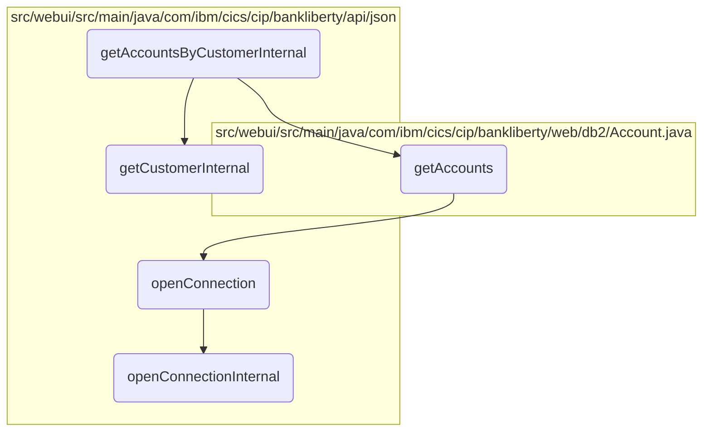
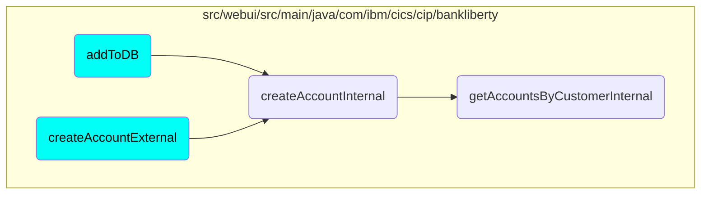

In this document, we will explain the process of retrieving account information for a customer. The process involves several steps including validating the customer, fetching account details, and formatting the response.

The flow starts by validating the customer to ensure they exist. If the customer is not found, an error is returned. If the customer is valid, the next step is to fetch all accounts associated with the customer. If no accounts are found, another error is returned. Finally, if accounts are found, they are formatted into a JSON response and sent back to the client.

# Flow drill down



<SwmSnippet path="/src/webui/src/main/java/com/ibm/cics/cip/bankliberty/api/json/AccountsResource.java" line="492">

---

## Retrieving Customer Information

First, the <SwmToken path="src/webui/src/main/java/com/ibm/cics/cip/bankliberty/api/json/AccountsResource.java" pos="492:5:5" line-data="	public Response getAccountsByCustomerInternal(">`getAccountsByCustomerInternal`</SwmToken> method retrieves customer information by calling the <SwmToken path="src/webui/src/main/java/com/ibm/cics/cip/bankliberty/api/json/AccountsResource.java" pos="507:2:2" line-data="				.getCustomerInternal(customerNumber);">`getCustomerInternal`</SwmToken> method. This step ensures that the customer exists and is valid before proceeding to fetch account details.

```java
	public Response getAccountsByCustomerInternal(
			@PathParam(JSON_CUSTOMER_NUMBER) Long customerNumber)
	{
		logger.entering(this.getClass().getName(),
				GET_ACCOUNTS_BY_CUSTOMER_INTERNAL);

		JSONArray accounts = null;
		Response myResponse = null;

		JSONObject response = new JSONObject();
		Integer sortCode = this.getSortCode();
		int numberOfAccounts = 0;

		CustomerResource myCustomer = new CustomerResource();
		Response customerResponse = myCustomer
				.getCustomerInternal(customerNumber);
```

---

</SwmSnippet>

<SwmSnippet path="/src/webui/src/main/java/com/ibm/cics/cip/bankliberty/api/json/AccountsResource.java" line="509">

---

## Handling Customer Not Found

Next, the method checks if the customer was found. If the customer is not found, it returns a 404 error response indicating that the customer number cannot be found.

```java
		if (customerResponse.getStatus() != 200)
		{
			if (customerResponse.getStatus() == 404)
			{
				// If cannot find response "CustomerResponse" then error 404
				// returned
				JSONObject error = new JSONObject();
				error.put(JSON_ERROR_MSG, CUSTOMER_NUMBER_LITERAL
						+ customerNumber.longValue() + CANNOT_BE_FOUND);
				logger.log(Level.SEVERE, () -> CUSTOMER_NUMBER_LITERAL
						+ customerNumber.longValue() + CANNOT_BE_FOUND);
				myResponse = Response.status(404).entity(error.toString())
						.build();
				logger.exiting(this.getClass().getName(),
						GET_ACCOUNTS_BY_CUSTOMER_INTERNAL, myResponse);
				return myResponse;
			}
```

---

</SwmSnippet>

<SwmSnippet path="/src/webui/src/main/java/com/ibm/cics/cip/bankliberty/api/json/AccountsResource.java" line="544">

---

## Retrieving Account Information

Then, the method retrieves account information for the customer by calling the <SwmToken path="src/webui/src/main/java/com/ibm/cics/cip/bankliberty/api/json/AccountsResource.java" pos="545:11:11" line-data="		Account[] myAccounts = db2Account.getAccounts(customerNumber.intValue(),">`getAccounts`</SwmToken> method. This step fetches all accounts associated with the customer number.

```java
		com.ibm.cics.cip.bankliberty.web.db2.Account db2Account = new Account();
		Account[] myAccounts = db2Account.getAccounts(customerNumber.intValue(),
				sortCode);
```

---

</SwmSnippet>

<SwmSnippet path="/src/webui/src/main/java/com/ibm/cics/cip/bankliberty/api/json/AccountsResource.java" line="547">

---

## Handling No Accounts Found

If no accounts are found for the customer, the method returns a 500 error response indicating that accounts cannot be accessed for the customer.

```java
		if (myAccounts == null)
		{
			JSONObject error = new JSONObject();
			error.put(JSON_ERROR_MSG,
					"Accounts cannot be accessed for customer "
							+ customerNumber.longValue() + CLASS_NAME_MSG);
			logger.log(Level.SEVERE,
					() -> "Accounts cannot be accessed for customer "
							+ customerNumber.longValue() + CLASS_NAME_MSG);
			myResponse = Response.status(500).entity(error.toString()).build();
			logger.exiting(this.getClass().getName(),
					GET_ACCOUNTS_BY_CUSTOMER_INTERNAL, myResponse);
			return myResponse;
		}
```

---

</SwmSnippet>

<SwmSnippet path="/src/webui/src/main/java/com/ibm/cics/cip/bankliberty/api/json/AccountsResource.java" line="562">

---

## Formatting Account Information

Finally, the method formats the retrieved account information into a JSON response and returns it with a 200 status code. This step ensures that the account details are properly structured and ready to be sent to the client.

```java
		numberOfAccounts = myAccounts.length;
		accounts = new JSONArray(numberOfAccounts);
		for (int i = 0; i < numberOfAccounts; i++)
		{

			JSONObject account = new JSONObject();
			account.put(JSON_SORT_CODE, myAccounts[i].getSortcode());
			account.put("id", myAccounts[i].getAccountNumber());
			account.put(JSON_CUSTOMER_NUMBER,
					myAccounts[i].getCustomerNumber());
			account.put(JSON_ACCOUNT_TYPE, myAccounts[i].getType());
			account.put(JSON_AVAILABLE_BALANCE,
					BigDecimal.valueOf(myAccounts[i].getAvailableBalance()));
			account.put(JSON_ACTUAL_BALANCE,
					BigDecimal.valueOf(myAccounts[i].getActualBalance()));
			account.put(JSON_INTEREST_RATE,
					BigDecimal.valueOf(myAccounts[i].getInterestRate()));
			account.put(JSON_OVERDRAFT, myAccounts[i].getOverdraftLimit());
			account.put(JSON_LAST_STATEMENT_DATE,
					myAccounts[i].getLastStatement().toString());
			account.put(JSON_NEXT_STATEMENT_DATE,
```

---

</SwmSnippet>

# Where is this flow used?

This flow is used multiple times in the codebase as represented in the following diagram:



&nbsp;

*This is an auto-generated document by Swimm 🌊 and has not yet been verified by a human*

<SwmMeta version="3.0.0" repo-id="Z2l0aHViJTNBJTNBY2ljcy1iYW5raW5nLXNhbXBsZS1hcHBsaWNhdGlvbi1jYnNhLUlCTS1EZW1vJTNBJTNBU3dpbW0tRGVtbw==" repo-name="cics-banking-sample-application-cbsa-IBM-Demo"><sup>Powered by [Swimm](/)</sup></SwmMeta>
