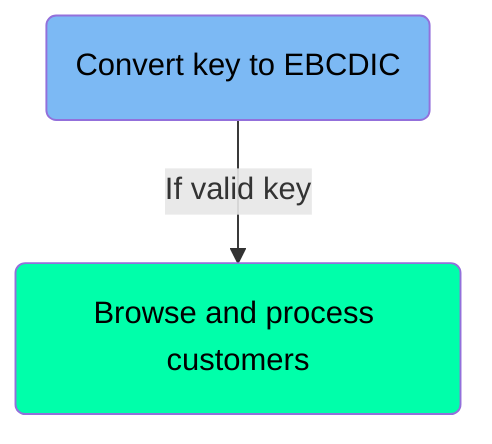
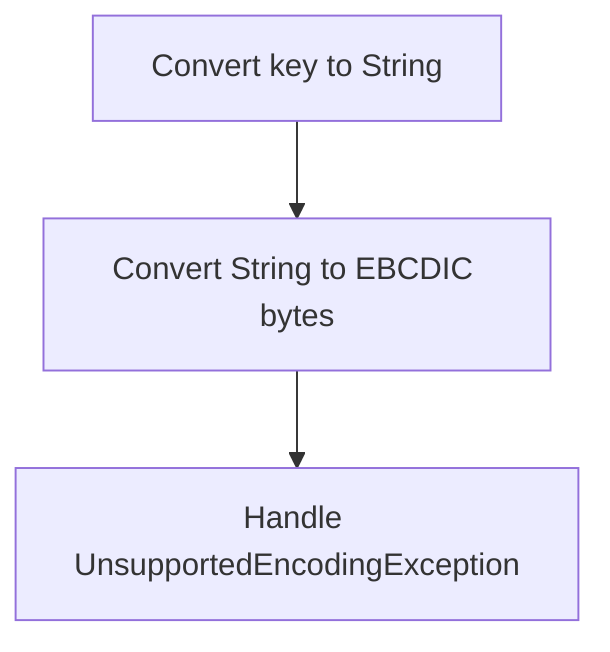
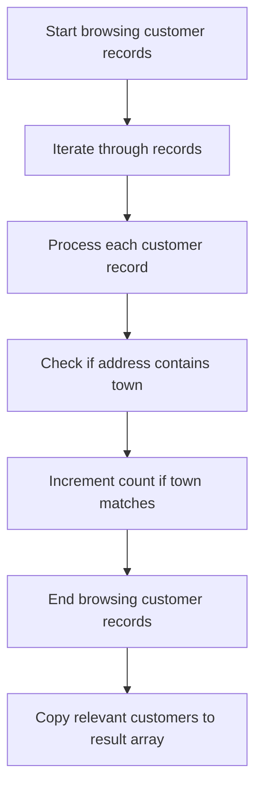

```mermaid
graph TD
  subgraph getCustomersTownInternal
    getCustomersTownInternal:A["Retrieve sort code"] --> getCustomersTownInternal:B["Set customer sort code"]
    getCustomersTownInternal:B --> getCustomersTownInternal:C["Get customers by town"]
    getCustomersTownInternal:C --> getCustomersTownInternal:D["Initialize response"]
    getCustomersTownInternal:D --> getCustomersTownInternal:E["Iterate over customers"]
    getCustomersTownInternal:E --> getCustomersTownInternal:F["Construct customer details"]
    getCustomersTownInternal:F --> getCustomersTownInternal:G["Add details to response"]
    getCustomersTownInternal:E --> getCustomersTownInternal:G
  end

%% Swimm:
%% graph TD
%%   subgraph <SwmToken path="src/webui/src/main/java/com/ibm/cics/cip/bankliberty/api/json/CustomerResource.java" pos="741:7:7" line-data="		Response myResponse = getCustomersTownInternal(town);">`getCustomersTownInternal`</SwmToken>
%%     <SwmToken path="src/webui/src/main/java/com/ibm/cics/cip/bankliberty/api/json/CustomerResource.java" pos="741:7:7" line-data="		Response myResponse = getCustomersTownInternal(town);">`getCustomersTownInternal`</SwmToken>:A["Retrieve sort code"] --> <SwmToken path="src/webui/src/main/java/com/ibm/cics/cip/bankliberty/api/json/CustomerResource.java" pos="741:7:7" line-data="		Response myResponse = getCustomersTownInternal(town);">`getCustomersTownInternal`</SwmToken>:B["Set customer sort code"]
%%     <SwmToken path="src/webui/src/main/java/com/ibm/cics/cip/bankliberty/api/json/CustomerResource.java" pos="741:7:7" line-data="		Response myResponse = getCustomersTownInternal(town);">`getCustomersTownInternal`</SwmToken>:B --> <SwmToken path="src/webui/src/main/java/com/ibm/cics/cip/bankliberty/api/json/CustomerResource.java" pos="741:7:7" line-data="		Response myResponse = getCustomersTownInternal(town);">`getCustomersTownInternal`</SwmToken>:C["Get customers by town"]
%%     <SwmToken path="src/webui/src/main/java/com/ibm/cics/cip/bankliberty/api/json/CustomerResource.java" pos="741:7:7" line-data="		Response myResponse = getCustomersTownInternal(town);">`getCustomersTownInternal`</SwmToken>:C --> <SwmToken path="src/webui/src/main/java/com/ibm/cics/cip/bankliberty/api/json/CustomerResource.java" pos="741:7:7" line-data="		Response myResponse = getCustomersTownInternal(town);">`getCustomersTownInternal`</SwmToken>:D["Initialize response"]
%%     <SwmToken path="src/webui/src/main/java/com/ibm/cics/cip/bankliberty/api/json/CustomerResource.java" pos="741:7:7" line-data="		Response myResponse = getCustomersTownInternal(town);">`getCustomersTownInternal`</SwmToken>:D --> <SwmToken path="src/webui/src/main/java/com/ibm/cics/cip/bankliberty/api/json/CustomerResource.java" pos="741:7:7" line-data="		Response myResponse = getCustomersTownInternal(town);">`getCustomersTownInternal`</SwmToken>:E["Iterate over customers"]
%%     <SwmToken path="src/webui/src/main/java/com/ibm/cics/cip/bankliberty/api/json/CustomerResource.java" pos="741:7:7" line-data="		Response myResponse = getCustomersTownInternal(town);">`getCustomersTownInternal`</SwmToken>:E --> <SwmToken path="src/webui/src/main/java/com/ibm/cics/cip/bankliberty/api/json/CustomerResource.java" pos="741:7:7" line-data="		Response myResponse = getCustomersTownInternal(town);">`getCustomersTownInternal`</SwmToken>:F["Construct customer details"]
%%     <SwmToken path="src/webui/src/main/java/com/ibm/cics/cip/bankliberty/api/json/CustomerResource.java" pos="741:7:7" line-data="		Response myResponse = getCustomersTownInternal(town);">`getCustomersTownInternal`</SwmToken>:F --> <SwmToken path="src/webui/src/main/java/com/ibm/cics/cip/bankliberty/api/json/CustomerResource.java" pos="741:7:7" line-data="		Response myResponse = getCustomersTownInternal(town);">`getCustomersTownInternal`</SwmToken>:G["Add details to response"]
%%     <SwmToken path="src/webui/src/main/java/com/ibm/cics/cip/bankliberty/api/json/CustomerResource.java" pos="741:7:7" line-data="		Response myResponse = getCustomersTownInternal(town);">`getCustomersTownInternal`</SwmToken>:E --> <SwmToken path="src/webui/src/main/java/com/ibm/cics/cip/bankliberty/api/json/CustomerResource.java" pos="741:7:7" line-data="		Response myResponse = getCustomersTownInternal(town);">`getCustomersTownInternal`</SwmToken>:G
%%   end
```

In this document, we will explain the process of retrieving customer data based on the town provided in a GET request. The process involves several steps, including logging the entry into the function, calling internal methods to handle the core logic, creating instances for data access, and finally logging the exit from the function and returning the response.

The flow starts when a GET request is made to the <SwmToken path="src/webui/src/main/java/com/ibm/cics/cip/bankliberty/api/json/CustomerResource.java" pos="734:5:12" line-data="	@Path(&quot;/all/town/{town}&quot;)">`/all/town/{town}`</SwmToken> endpoint. The method logs the entry into the function and calls an internal method to handle the core logic of searching through the customer file. After retrieving the customer data, it creates an instance for data access and terminates it to release resources. Finally, it logs the exit from the function and returns the response containing the customer data.

Here is a high level diagram of the flow, showing only the most important functions:

```mermaid
graph TD;
      subgraph srcwebuisrcmainjavacomibmcicscipbankliberty[src/…/cip/bankliberty]
e9e0db9523f6f30549de5395d9e4ee57fe6029fd10459af82e32bc2d1b87a0be(CustomerResource.getCustomersTownExternal) --> aed0139fb689d0ebc81f0289c1428d5734f5b1bdee577ae2e3b624528b5caa77(CustomerResource.getCustomersTownInternal)
end

subgraph srcwebuisrcmainjavacomibmcicscipbankliberty[src/…/cip/bankliberty]
aed0139fb689d0ebc81f0289c1428d5734f5b1bdee577ae2e3b624528b5caa77(CustomerResource.getCustomersTownInternal) --> fa4326f920b3c95786b653c3a313d2b594e358061b0072d1f72b14408f4abf19(Customer.getCustomersByTown)
end


      classDef mainFlowStyle color:#000000,fill:#7CB9F4
classDef rootsStyle color:#000000,fill:#00FFF4
classDef Style1 color:#000000,fill:#00FFAA
classDef Style2 color:#000000,fill:#FFFF00
classDef Style3 color:#000000,fill:#AA7CB9

%% Swimm:
%% graph TD;
%%       subgraph srcwebuisrcmainjavacomibmcicscipbankliberty[<SwmPath>[src/…/cip/bankliberty/](src/webui/src/main/java/com/ibm/cics/cip/bankliberty/)</SwmPath>]
%% e9e0db9523f6f30549de5395d9e4ee57fe6029fd10459af82e32bc2d1b87a0be(CustomerResource.getCustomersTownExternal) --> aed0139fb689d0ebc81f0289c1428d5734f5b1bdee577ae2e3b624528b5caa77(CustomerResource.getCustomersTownInternal)
%% end
%% 
%% subgraph srcwebuisrcmainjavacomibmcicscipbankliberty[<SwmPath>[src/…/cip/bankliberty/](src/webui/src/main/java/com/ibm/cics/cip/bankliberty/)</SwmPath>]
%% aed0139fb689d0ebc81f0289c1428d5734f5b1bdee577ae2e3b624528b5caa77(CustomerResource.getCustomersTownInternal) --> fa4326f920b3c95786b653c3a313d2b594e358061b0072d1f72b14408f4abf19(Customer.getCustomersByTown)
%% end
%% 
%% 
%%       classDef mainFlowStyle color:#000000,fill:#7CB9F4
%% classDef rootsStyle color:#000000,fill:#00FFF4
%% classDef Style1 color:#000000,fill:#00FFAA
%% classDef Style2 color:#000000,fill:#FFFF00
%% classDef Style3 color:#000000,fill:#AA7CB9
```



# Flow drill down

```mermaid
graph TD
  subgraph getCustomersTownExternal
    getCustomersTownExternal:A["Log entering function"] --> getCustomersTownExternal:B["Call getCustomersTownInternal with town parameter"]
    getCustomersTownExternal:B --> getCustomersTownExternal:C["Create HBankDataAccess instance"]
    getCustomersTownExternal:C --> getCustomersTownExternal:D["Terminate HBankDataAccess instance"]
    getCustomersTownExternal:D --> getCustomersTownExternal:E["Log exiting function"]
    getCustomersTownExternal:E --> getCustomersTownExternal:F["Return response"]
  end

%% Swimm:
%% graph TD
%%   subgraph <SwmToken path="src/webui/src/main/java/com/ibm/cics/cip/bankliberty/api/json/CustomerResource.java" pos="736:5:5" line-data="	public Response getCustomersTownExternal(@PathParam(&quot;town&quot;) String town)">`getCustomersTownExternal`</SwmToken>
%%     <SwmToken path="src/webui/src/main/java/com/ibm/cics/cip/bankliberty/api/json/CustomerResource.java" pos="736:5:5" line-data="	public Response getCustomersTownExternal(@PathParam(&quot;town&quot;) String town)">`getCustomersTownExternal`</SwmToken>:A["Log entering function"] --> <SwmToken path="src/webui/src/main/java/com/ibm/cics/cip/bankliberty/api/json/CustomerResource.java" pos="736:5:5" line-data="	public Response getCustomersTownExternal(@PathParam(&quot;town&quot;) String town)">`getCustomersTownExternal`</SwmToken>:B["Call <SwmToken path="src/webui/src/main/java/com/ibm/cics/cip/bankliberty/api/json/CustomerResource.java" pos="741:7:7" line-data="		Response myResponse = getCustomersTownInternal(town);">`getCustomersTownInternal`</SwmToken> with town parameter"]
%%     <SwmToken path="src/webui/src/main/java/com/ibm/cics/cip/bankliberty/api/json/CustomerResource.java" pos="736:5:5" line-data="	public Response getCustomersTownExternal(@PathParam(&quot;town&quot;) String town)">`getCustomersTownExternal`</SwmToken>:B --> <SwmToken path="src/webui/src/main/java/com/ibm/cics/cip/bankliberty/api/json/CustomerResource.java" pos="736:5:5" line-data="	public Response getCustomersTownExternal(@PathParam(&quot;town&quot;) String town)">`getCustomersTownExternal`</SwmToken>:C["Create <SwmToken path="src/webui/src/main/java/com/ibm/cics/cip/bankliberty/api/json/CustomerResource.java" pos="742:1:1" line-data="		HBankDataAccess myHBankDataAccess = new HBankDataAccess();">`HBankDataAccess`</SwmToken> instance"]
%%     <SwmToken path="src/webui/src/main/java/com/ibm/cics/cip/bankliberty/api/json/CustomerResource.java" pos="736:5:5" line-data="	public Response getCustomersTownExternal(@PathParam(&quot;town&quot;) String town)">`getCustomersTownExternal`</SwmToken>:C --> <SwmToken path="src/webui/src/main/java/com/ibm/cics/cip/bankliberty/api/json/CustomerResource.java" pos="736:5:5" line-data="	public Response getCustomersTownExternal(@PathParam(&quot;town&quot;) String town)">`getCustomersTownExternal`</SwmToken>:D["Terminate <SwmToken path="src/webui/src/main/java/com/ibm/cics/cip/bankliberty/api/json/CustomerResource.java" pos="742:1:1" line-data="		HBankDataAccess myHBankDataAccess = new HBankDataAccess();">`HBankDataAccess`</SwmToken> instance"]
%%     <SwmToken path="src/webui/src/main/java/com/ibm/cics/cip/bankliberty/api/json/CustomerResource.java" pos="736:5:5" line-data="	public Response getCustomersTownExternal(@PathParam(&quot;town&quot;) String town)">`getCustomersTownExternal`</SwmToken>:D --> <SwmToken path="src/webui/src/main/java/com/ibm/cics/cip/bankliberty/api/json/CustomerResource.java" pos="736:5:5" line-data="	public Response getCustomersTownExternal(@PathParam(&quot;town&quot;) String town)">`getCustomersTownExternal`</SwmToken>:E["Log exiting function"]
%%     <SwmToken path="src/webui/src/main/java/com/ibm/cics/cip/bankliberty/api/json/CustomerResource.java" pos="736:5:5" line-data="	public Response getCustomersTownExternal(@PathParam(&quot;town&quot;) String town)">`getCustomersTownExternal`</SwmToken>:E --> <SwmToken path="src/webui/src/main/java/com/ibm/cics/cip/bankliberty/api/json/CustomerResource.java" pos="736:5:5" line-data="	public Response getCustomersTownExternal(@PathParam(&quot;town&quot;) String town)">`getCustomersTownExternal`</SwmToken>:F["Return response"]
%%   end
```

## Going into <SwmToken path="src/webui/src/main/java/com/ibm/cics/cip/bankliberty/api/json/CustomerResource.java" pos="736:5:5" line-data="	public Response getCustomersTownExternal(@PathParam(&quot;town&quot;) String town)">`getCustomersTownExternal`</SwmToken>



<SwmSnippet path="/src/webui/src/main/java/com/ibm/cics/cip/bankliberty/api/json/CustomerResource.java" line="733">

---

## Retrieving customer data based on town

First, the <SwmToken path="src/webui/src/main/java/com/ibm/cics/cip/bankliberty/api/json/CustomerResource.java" pos="736:5:5" line-data="	public Response getCustomersTownExternal(@PathParam(&quot;town&quot;) String town)">`getCustomersTownExternal`</SwmToken> method is called when a GET request is made to the <SwmToken path="src/webui/src/main/java/com/ibm/cics/cip/bankliberty/api/json/CustomerResource.java" pos="734:5:12" line-data="	@Path(&quot;/all/town/{town}&quot;)">`/all/town/{town}`</SwmToken> endpoint. This method is responsible for initiating the process of retrieving customer data based on the town provided in the request.

```java
	@GET
	@Path("/all/town/{town}")
	@Produces(MediaType.APPLICATION_JSON)
	public Response getCustomersTownExternal(@PathParam("town") String town)
```

---

</SwmSnippet>

<SwmSnippet path="/src/webui/src/main/java/com/ibm/cics/cip/bankliberty/api/json/CustomerResource.java" line="739">

---

Next, the method logs the entry into the <SwmToken path="src/webui/src/main/java/com/ibm/cics/cip/bankliberty/api/json/CustomerResource.java" pos="740:2:2" line-data="				&quot;getCustomersTownExternal(String town) for town &quot; + town);">`getCustomersTownExternal`</SwmToken> method, including the town parameter, which helps in tracking and debugging the flow of the application.

```java
		logger.entering(this.getClass().getName(),
				"getCustomersTownExternal(String town) for town " + town);
```

---

</SwmSnippet>

<SwmSnippet path="/src/webui/src/main/java/com/ibm/cics/cip/bankliberty/api/json/CustomerResource.java" line="741">

---

Then, the method calls <SwmToken path="src/webui/src/main/java/com/ibm/cics/cip/bankliberty/api/json/CustomerResource.java" pos="741:7:7" line-data="		Response myResponse = getCustomersTownInternal(town);">`getCustomersTownInternal`</SwmToken> with the town parameter. This internal method handles the core logic of searching through the customer file in the VSAM datastore, matching addresses that contain the specified town name, and returning a JSON array of customer details.

```java
		Response myResponse = getCustomersTownInternal(town);
```

---

</SwmSnippet>

<SwmSnippet path="/src/webui/src/main/java/com/ibm/cics/cip/bankliberty/api/json/CustomerResource.java" line="742">

---

After retrieving the customer data, the method creates an instance of <SwmToken path="src/webui/src/main/java/com/ibm/cics/cip/bankliberty/api/json/CustomerResource.java" pos="742:1:1" line-data="		HBankDataAccess myHBankDataAccess = new HBankDataAccess();">`HBankDataAccess`</SwmToken> and calls its <SwmToken path="src/webui/src/main/java/com/ibm/cics/cip/bankliberty/api/json/CustomerResource.java" pos="743:3:3" line-data="		myHBankDataAccess.terminate();">`terminate`</SwmToken> method. This step ensures that any resources used during the data access are properly released.

```java
		HBankDataAccess myHBankDataAccess = new HBankDataAccess();
		myHBankDataAccess.terminate();
```

---

</SwmSnippet>

<SwmSnippet path="/src/webui/src/main/java/com/ibm/cics/cip/bankliberty/api/json/CustomerResource.java" line="744">

---

Finally, the method logs the exit from the <SwmToken path="src/webui/src/main/java/com/ibm/cics/cip/bankliberty/api/json/CustomerResource.java" pos="745:2:2" line-data="				&quot;getCustomersTownExternal(String town)&quot;, myResponse);">`getCustomersTownExternal`</SwmToken> method along with the response, and then returns the response containing the customer data.

```java
		logger.exiting(this.getClass().getName(),
				"getCustomersTownExternal(String town)", myResponse);
		return myResponse;
```

---

</SwmSnippet>

## Diving into the <SwmToken path="src/webui/src/main/java/com/ibm/cics/cip/bankliberty/api/json/CustomerResource.java" pos="763:2:2" line-data="				.getCustomersByTown(town);">`getCustomersByTown`</SwmToken> function



## <SwmToken path="src/webui/src/main/java/com/ibm/cics/cip/bankliberty/api/json/CustomerResource.java" pos="763:2:2" line-data="				.getCustomersByTown(town);">`getCustomersByTown`</SwmToken> function - Convert key to EBCDIC

Here is a diagram of this part:



<SwmSnippet path="/src/webui/src/main/java/com/ibm/cics/cip/bankliberty/web/vsam/Customer.java" line="1509">

---

### Converting the key to String

The function begins by converting the <SwmToken path="src/webui/src/main/java/com/ibm/cics/cip/bankliberty/web/vsam/Customer.java" pos="1509:13:13" line-data="		// We need to convert the key to EBCDIC">`key`</SwmToken> (a byte array) to a <SwmToken path="src/webui/src/main/java/com/ibm/cics/cip/bankliberty/web/vsam/Customer.java" pos="1510:1:1" line-data="		String keyString = new String(key);">`String`</SwmToken> using the default character encoding. This step is necessary to prepare the key for conversion to EBCDIC format.

```java
		// We need to convert the key to EBCDIC
		String keyString = new String(key);
```

---

</SwmSnippet>

<SwmSnippet path="/src/webui/src/main/java/com/ibm/cics/cip/bankliberty/web/vsam/Customer.java" line="1511">

---

### Converting String to EBCDIC bytes

Next, the function attempts to convert the <SwmToken path="src/webui/src/main/java/com/ibm/cics/cip/bankliberty/web/vsam/Customer.java" pos="1513:5:5" line-data="			key = keyString.getBytes(CODEPAGE);">`keyString`</SwmToken> (the String representation of the key) to a byte array using the EBCDIC encoding specified by <SwmToken path="src/webui/src/main/java/com/ibm/cics/cip/bankliberty/web/vsam/Customer.java" pos="1513:9:9" line-data="			key = keyString.getBytes(CODEPAGE);">`CODEPAGE`</SwmToken>. This conversion ensures that the key is in the correct format for further processing.

```java
		try
		{
			key = keyString.getBytes(CODEPAGE);
```

---

</SwmSnippet>

<SwmSnippet path="/src/webui/src/main/java/com/ibm/cics/cip/bankliberty/web/vsam/Customer.java" line="1514">

---

### Handling <SwmToken path="src/webui/src/main/java/com/ibm/cics/cip/bankliberty/web/vsam/Customer.java" pos="1515:4:4" line-data="		catch (UnsupportedEncodingException e2)">`UnsupportedEncodingException`</SwmToken>

If the specified EBCDIC encoding is not supported, an <SwmToken path="src/webui/src/main/java/com/ibm/cics/cip/bankliberty/web/vsam/Customer.java" pos="1515:4:4" line-data="		catch (UnsupportedEncodingException e2)">`UnsupportedEncodingException`</SwmToken> is caught. The function logs the error message and exits, returning <SwmToken path="src/webui/src/main/java/com/ibm/cics/cip/bankliberty/web/vsam/Customer.java" pos="1519:1:1" line-data="					null);">`null`</SwmToken> to indicate the failure of the operation.

```java
		}
		catch (UnsupportedEncodingException e2)
		{
			logger.severe(e2.getLocalizedMessage());
			logger.exiting(this.getClass().getName(), GET_CUSTOMERS_BY_TOWN,
					null);
			return null;
		}
```

---

</SwmSnippet>

## <SwmToken path="src/webui/src/main/java/com/ibm/cics/cip/bankliberty/api/json/CustomerResource.java" pos="763:2:2" line-data="				.getCustomersByTown(town);">`getCustomersByTown`</SwmToken> function - Browse and process customers

Here is a diagram of this part:



<SwmSnippet path="/src/webui/src/main/java/com/ibm/cics/cip/bankliberty/web/vsam/Customer.java" line="1528">

---

### Iterating through customer records

The function begins by initializing a loop to iterate through up to 250,000 customer records. It uses a boolean variable <SwmToken path="src/webui/src/main/java/com/ibm/cics/cip/bankliberty/web/vsam/Customer.java" pos="1529:3:3" line-data="			boolean carryOn = true;">`carryOn`</SwmToken> to control the loop, which continues until either the maximum number of records is reached or an <SwmToken path="src/webui/src/main/java/com/ibm/cics/cip/bankliberty/web/vsam/Customer.java" pos="1540:4:4" line-data="				catch (EndOfFileException e)">`EndOfFileException`</SwmToken> is encountered.

```java
			i = 0;
			boolean carryOn = true;
			for (int j = 0; j < 250000 && carryOn; j++)
```

---

</SwmSnippet>

<SwmSnippet path="/src/webui/src/main/java/com/ibm/cics/cip/bankliberty/web/vsam/Customer.java" line="1532">

---

### Processing each customer record

Within the loop, the function retrieves the next customer record using <SwmToken path="src/webui/src/main/java/com/ibm/cics/cip/bankliberty/web/vsam/Customer.java" pos="1534:1:9" line-data="					customerFileBrowse.next(holder, keyHolder);">`customerFileBrowse.next(holder, keyHolder)`</SwmToken>. It then creates a new <SwmToken path="src/webui/src/main/java/com/ibm/cics/cip/bankliberty/web/vsam/Customer.java" pos="1548:10:10" line-data="				temp[j] = new Customer();">`Customer`</SwmToken> object and populates its fields with data from the retrieved record, such as address, customer number, name, sort code, date of birth, credit score, and review date.

```java
				try
				{
					customerFileBrowse.next(holder, keyHolder);
				}
				catch (DuplicateKeyException e)
				{
					// we don't care about this one
				}
				catch (EndOfFileException e)
				{
					// This one we do care about but we expect it
					carryOn = false;

				}
				myCustomer = new CUSTOMER(holder.getValue());

				temp[j] = new Customer();
				temp[j].setAddress(myCustomer.getCustomerAddress());
				temp[j].setCustomerNumber(
						Long.toString(myCustomer.getCustomerNumber()));
				temp[j].setName(myCustomer.getCustomerName());
```

---

</SwmSnippet>

<SwmSnippet path="/src/webui/src/main/java/com/ibm/cics/cip/bankliberty/web/vsam/Customer.java" line="1576">

---

### Filtering customers by town

After processing each customer record, the function checks if the customer's address contains the specified town. If it does, the count of matching customers is incremented.

```java
				if (temp[j].getAddress().contains(town))
				{
					i++;
				}
```

---

</SwmSnippet>

<SwmSnippet path="/src/webui/src/main/java/com/ibm/cics/cip/bankliberty/web/vsam/Customer.java" line="1582">

---

### Finalizing the customer list

Once all records have been processed, the function ends the browsing session and copies the relevant customers to a new array, which is then returned as the result.

```java
			customerFileBrowse.end();

			Customer[] real = new Customer[i];
			System.arraycopy(temp, 0, real, 0, i);

			logger.exiting(this.getClass().getName(), GET_CUSTOMERS_BY_TOWN,
					real);
			return real;
```

---

</SwmSnippet>

## A closer look at <SwmToken path="src/webui/src/main/java/com/ibm/cics/cip/bankliberty/api/json/CustomerResource.java" pos="741:7:7" line-data="		Response myResponse = getCustomersTownInternal(town);">`getCustomersTownInternal`</SwmToken>



<SwmSnippet path="/src/webui/src/main/java/com/ibm/cics/cip/bankliberty/api/json/CustomerResource.java" line="753">

---

## Retrieving and formatting customer data based on town

First, the method <SwmToken path="src/webui/src/main/java/com/ibm/cics/cip/bankliberty/api/json/CustomerResource.java" pos="754:2:2" line-data="				&quot;getCustomersTownInternal(String town) for town &quot; + town);">`getCustomersTownInternal`</SwmToken> logs the entry into the function with the provided town name. This helps in tracking the function calls and debugging if necessary.

```java
		logger.entering(this.getClass().getName(),
				"getCustomersTownInternal(String town) for town " + town);
```

---

</SwmSnippet>

<SwmSnippet path="/src/webui/src/main/java/com/ibm/cics/cip/bankliberty/api/json/CustomerResource.java" line="756">

---

Next, an empty <SwmToken path="src/webui/src/main/java/com/ibm/cics/cip/bankliberty/api/json/CustomerResource.java" pos="756:1:1" line-data="		JSONArray allCustomers = new JSONArray();">`JSONArray`</SwmToken> named <SwmToken path="src/webui/src/main/java/com/ibm/cics/cip/bankliberty/api/json/CustomerResource.java" pos="756:3:3" line-data="		JSONArray allCustomers = new JSONArray();">`allCustomers`</SwmToken> and a <SwmToken path="src/webui/src/main/java/com/ibm/cics/cip/bankliberty/api/json/CustomerResource.java" pos="758:1:1" line-data="		JSONObject response = new JSONObject();">`JSONObject`</SwmToken> named <SwmToken path="src/webui/src/main/java/com/ibm/cics/cip/bankliberty/api/json/CustomerResource.java" pos="758:3:3" line-data="		JSONObject response = new JSONObject();">`response`</SwmToken> are initialized. These will be used to store the customer data retrieved and formatted for the response.

```java
		JSONArray allCustomers = new JSONArray();

		JSONObject response = new JSONObject();
```

---

</SwmSnippet>

<SwmSnippet path="/src/webui/src/main/java/com/ibm/cics/cip/bankliberty/api/json/CustomerResource.java" line="760">

---

Moving to the core logic, a <SwmToken path="src/webui/src/main/java/com/ibm/cics/cip/bankliberty/api/json/CustomerResource.java" pos="760:15:15" line-data="		com.ibm.cics.cip.bankliberty.web.vsam.Customer myCustomer = new Customer();">`Customer`</SwmToken> object is created and its sort code is set. This object is then used to call the <SwmToken path="src/webui/src/main/java/com/ibm/cics/cip/bankliberty/api/json/CustomerResource.java" pos="763:2:2" line-data="				.getCustomersByTown(town);">`getCustomersByTown`</SwmToken> method, which retrieves an array of customers that match the provided town name.

```java
		com.ibm.cics.cip.bankliberty.web.vsam.Customer myCustomer = new Customer();
		myCustomer.setSortcode(this.getSortCode().toString());
		com.ibm.cics.cip.bankliberty.web.vsam.Customer[] vsamCustomers = myCustomer
				.getCustomersByTown(town);
```

---

</SwmSnippet>

<SwmSnippet path="/src/webui/src/main/java/com/ibm/cics/cip/bankliberty/api/json/CustomerResource.java" line="765">

---

Then, the method iterates over the array of customers. For each customer, it extracts and trims their customer number, name, and address, and adds these details to the <SwmToken path="src/webui/src/main/java/com/ibm/cics/cip/bankliberty/api/json/CustomerResource.java" pos="767:1:1" line-data="			response.put(JSON_ID, vsamCustomers[i].getCustomerNumber().trim());">`response`</SwmToken> object.

```java
		for (int i = 0; i < vsamCustomers.length; i++)
		{
			response.put(JSON_ID, vsamCustomers[i].getCustomerNumber().trim());
			response.put(JSON_CUSTOMER_NAME, vsamCustomers[i].getName().trim());
			response.put(JSON_CUSTOMER_ADDRESS,
					vsamCustomers[i].getAddress().trim());
```

---

</SwmSnippet>

<SwmSnippet path="/src/webui/src/main/java/com/ibm/cics/cip/bankliberty/api/json/CustomerResource.java" line="772">

---

Additionally, the customer's date of birth is formatted into a readable string format (DD-MM-YYYY) and added to the <SwmToken path="src/webui/src/main/java/com/ibm/cics/cip/bankliberty/api/json/CustomerResource.java" pos="758:3:3" line-data="		JSONObject response = new JSONObject();">`response`</SwmToken> object. This ensures that the date of birth is presented in a user-friendly manner.

```java
			Calendar dobCalendar = Calendar.getInstance();
			dobCalendar.setTime(vsamCustomers[i].getDob());
			Integer dobDD = dobCalendar.get(Calendar.DAY_OF_MONTH);
			String dateOfBirth = dobDD.toString();
			dateOfBirth = dateOfBirth.concat("-");

			Integer dobMM = dobCalendar.get(Calendar.MONTH) + 1;
			dateOfBirth = dateOfBirth.concat(dobMM.toString());
			dateOfBirth = dateOfBirth.concat("-");

			Integer dobYYYY = dobCalendar.get(Calendar.YEAR);
			dateOfBirth = dateOfBirth.concat(dobYYYY.toString());
```

---

</SwmSnippet>

<SwmSnippet path="/src/webui/src/main/java/com/ibm/cics/cip/bankliberty/api/json/CustomerResource.java" line="785">

---

Finally, the <SwmToken path="src/webui/src/main/java/com/ibm/cics/cip/bankliberty/api/json/CustomerResource.java" pos="785:1:1" line-data="			response.put(JSON_DATE_OF_BIRTH, dateOfBirth);">`response`</SwmToken> object containing the customer details is added to the <SwmToken path="src/webui/src/main/java/com/ibm/cics/cip/bankliberty/api/json/CustomerResource.java" pos="786:1:1" line-data="			allCustomers.add(response);">`allCustomers`</SwmToken> array. The method then logs the exit from the function and returns a <SwmToken path="src/webui/src/main/java/com/ibm/cics/cip/bankliberty/api/json/CustomerResource.java" pos="791:1:1" line-data="				Response.status(200).entity(allCustomers.toString()).build());">`Response`</SwmToken> object with the status code 200 and the <SwmToken path="src/webui/src/main/java/com/ibm/cics/cip/bankliberty/api/json/CustomerResource.java" pos="786:1:1" line-data="			allCustomers.add(response);">`allCustomers`</SwmToken> array as the entity.

```java
			response.put(JSON_DATE_OF_BIRTH, dateOfBirth);
			allCustomers.add(response);
		}

		logger.exiting(this.getClass().getName(),
				"getCustomersTownInternal(String town)",
				Response.status(200).entity(allCustomers.toString()).build());
		return Response.status(200).entity(allCustomers.toString()).build();
	}
```

---

</SwmSnippet>

&nbsp;

*This is an auto-generated document by Swimm 🌊 and has not yet been verified by a human*

<SwmMeta version="3.0.0" repo-id="Z2l0aHViJTNBJTNBY2ljcy1iYW5raW5nLXNhbXBsZS1hcHBsaWNhdGlvbi1jYnNhLUlCTS1EZW1vJTNBJTNBU3dpbW0tRGVtbw==" repo-name="cics-banking-sample-application-cbsa-IBM-Demo"><sup>Powered by [Swimm](/)</sup></SwmMeta>
