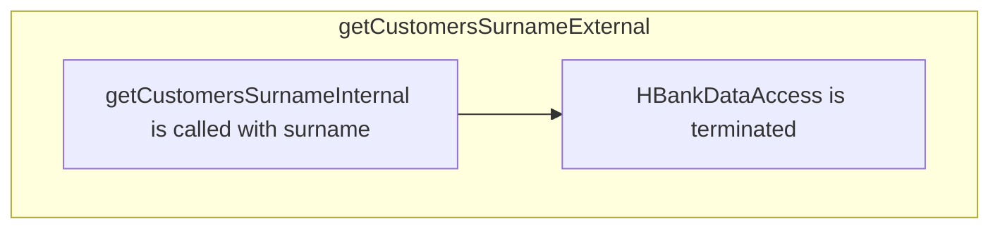
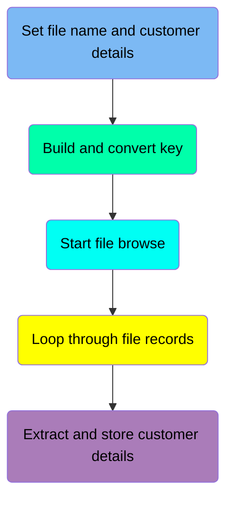
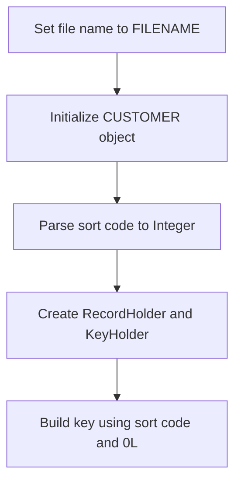
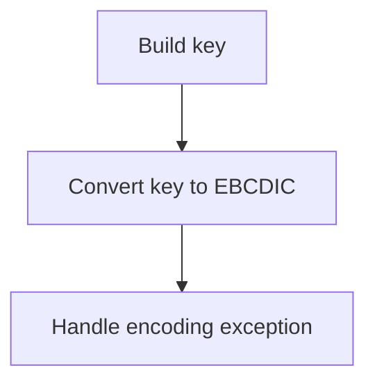
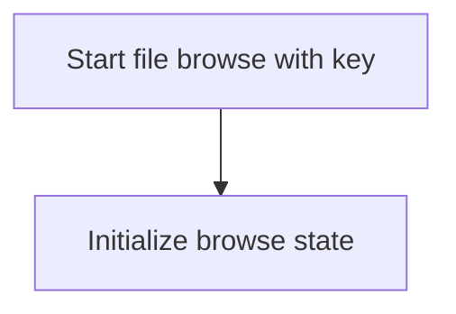
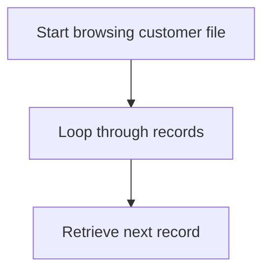
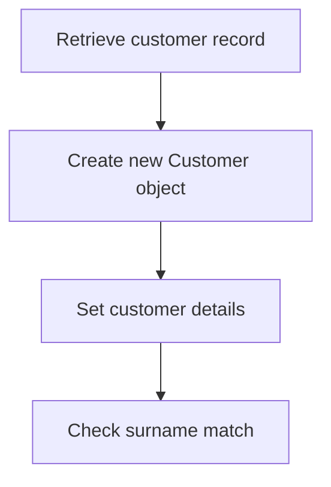

```mermaid
graph TD
  subgraph getCustomersSurnameInternal
    getCustomersSurnameInternal:A["Log entry of the function"] --> getCustomersSurnameInternal:B["Initialize JSONArray for all customers"]
    getCustomersSurnameInternal:B --> getCustomersSurnameInternal:C["Initialize JSONObject for response"]
    getCustomersSurnameInternal:C --> getCustomersSurnameInternal:D["Create Customer object"]
    getCustomersSurnameInternal:D --> getCustomersSurnameInternal:E["Set Customer Sort Code"]
    getCustomersSurnameInternal:E --> getCustomersSurnameInternal:F["Retrieve customers by surname"]
    getCustomersSurnameInternal:F --> getCustomersSurnameInternal:G["Iterate over customers"]
    getCustomersSurnameInternal:G --> getCustomersSurnameInternal:H["Put customer number in response"]
    getCustomersSurnameInternal:H --> getCustomersSurnameInternal:I["Put customer name in response"]
    getCustomersSurnameInternal:I --> getCustomersSurnameInternal:J["Put customer address in response"]
    getCustomersSurnameInternal:J --> getCustomersSurnameInternal:K["Set customer date of birth"]
    getCustomersSurnameInternal:K --> getCustomersSurnameInternal:L["Put date of birth in response"]
    getCustomersSurnameInternal:L --> getCustomersSurnameInternal:M["Add response to all customers"]
    getCustomersSurnameInternal:M --> getCustomersSurnameInternal:N["Log exit of the function"]
    getCustomersSurnameInternal:N --> getCustomersSurnameInternal:O["Return response with customers"]
  end

%% Swimm:
%% graph TD
%%   subgraph <SwmToken path="src/webui/src/main/java/com/ibm/cics/cip/bankliberty/api/json/CustomerResource.java" pos="805:7:7" line-data="		Response myResponse = getCustomersSurnameInternal(surname);">`getCustomersSurnameInternal`</SwmToken>
%%     <SwmToken path="src/webui/src/main/java/com/ibm/cics/cip/bankliberty/api/json/CustomerResource.java" pos="805:7:7" line-data="		Response myResponse = getCustomersSurnameInternal(surname);">`getCustomersSurnameInternal`</SwmToken>:A["Log entry of the function"] --> <SwmToken path="src/webui/src/main/java/com/ibm/cics/cip/bankliberty/api/json/CustomerResource.java" pos="805:7:7" line-data="		Response myResponse = getCustomersSurnameInternal(surname);">`getCustomersSurnameInternal`</SwmToken>:B["Initialize <SwmToken path="src/webui/src/main/java/com/ibm/cics/cip/bankliberty/api/json/CustomerResource.java" pos="821:1:1" line-data="		JSONArray allCustomers = new JSONArray();">`JSONArray`</SwmToken> for all customers"]
%%     <SwmToken path="src/webui/src/main/java/com/ibm/cics/cip/bankliberty/api/json/CustomerResource.java" pos="805:7:7" line-data="		Response myResponse = getCustomersSurnameInternal(surname);">`getCustomersSurnameInternal`</SwmToken>:B --> <SwmToken path="src/webui/src/main/java/com/ibm/cics/cip/bankliberty/api/json/CustomerResource.java" pos="805:7:7" line-data="		Response myResponse = getCustomersSurnameInternal(surname);">`getCustomersSurnameInternal`</SwmToken>:C["Initialize <SwmToken path="src/webui/src/main/java/com/ibm/cics/cip/bankliberty/api/json/CustomerResource.java" pos="823:1:1" line-data="		JSONObject response = new JSONObject();">`JSONObject`</SwmToken> for response"]
%%     <SwmToken path="src/webui/src/main/java/com/ibm/cics/cip/bankliberty/api/json/CustomerResource.java" pos="805:7:7" line-data="		Response myResponse = getCustomersSurnameInternal(surname);">`getCustomersSurnameInternal`</SwmToken>:C --> <SwmToken path="src/webui/src/main/java/com/ibm/cics/cip/bankliberty/api/json/CustomerResource.java" pos="805:7:7" line-data="		Response myResponse = getCustomersSurnameInternal(surname);">`getCustomersSurnameInternal`</SwmToken>:D["Create Customer object"]
%%     <SwmToken path="src/webui/src/main/java/com/ibm/cics/cip/bankliberty/api/json/CustomerResource.java" pos="805:7:7" line-data="		Response myResponse = getCustomersSurnameInternal(surname);">`getCustomersSurnameInternal`</SwmToken>:D --> <SwmToken path="src/webui/src/main/java/com/ibm/cics/cip/bankliberty/api/json/CustomerResource.java" pos="805:7:7" line-data="		Response myResponse = getCustomersSurnameInternal(surname);">`getCustomersSurnameInternal`</SwmToken>:E["Set Customer Sort Code"]
%%     <SwmToken path="src/webui/src/main/java/com/ibm/cics/cip/bankliberty/api/json/CustomerResource.java" pos="805:7:7" line-data="		Response myResponse = getCustomersSurnameInternal(surname);">`getCustomersSurnameInternal`</SwmToken>:E --> <SwmToken path="src/webui/src/main/java/com/ibm/cics/cip/bankliberty/api/json/CustomerResource.java" pos="805:7:7" line-data="		Response myResponse = getCustomersSurnameInternal(surname);">`getCustomersSurnameInternal`</SwmToken>:F["Retrieve customers by surname"]
%%     <SwmToken path="src/webui/src/main/java/com/ibm/cics/cip/bankliberty/api/json/CustomerResource.java" pos="805:7:7" line-data="		Response myResponse = getCustomersSurnameInternal(surname);">`getCustomersSurnameInternal`</SwmToken>:F --> <SwmToken path="src/webui/src/main/java/com/ibm/cics/cip/bankliberty/api/json/CustomerResource.java" pos="805:7:7" line-data="		Response myResponse = getCustomersSurnameInternal(surname);">`getCustomersSurnameInternal`</SwmToken>:G["Iterate over customers"]
%%     <SwmToken path="src/webui/src/main/java/com/ibm/cics/cip/bankliberty/api/json/CustomerResource.java" pos="805:7:7" line-data="		Response myResponse = getCustomersSurnameInternal(surname);">`getCustomersSurnameInternal`</SwmToken>:G --> <SwmToken path="src/webui/src/main/java/com/ibm/cics/cip/bankliberty/api/json/CustomerResource.java" pos="805:7:7" line-data="		Response myResponse = getCustomersSurnameInternal(surname);">`getCustomersSurnameInternal`</SwmToken>:H["Put customer number in response"]
%%     <SwmToken path="src/webui/src/main/java/com/ibm/cics/cip/bankliberty/api/json/CustomerResource.java" pos="805:7:7" line-data="		Response myResponse = getCustomersSurnameInternal(surname);">`getCustomersSurnameInternal`</SwmToken>:H --> <SwmToken path="src/webui/src/main/java/com/ibm/cics/cip/bankliberty/api/json/CustomerResource.java" pos="805:7:7" line-data="		Response myResponse = getCustomersSurnameInternal(surname);">`getCustomersSurnameInternal`</SwmToken>:I["Put customer name in response"]
%%     <SwmToken path="src/webui/src/main/java/com/ibm/cics/cip/bankliberty/api/json/CustomerResource.java" pos="805:7:7" line-data="		Response myResponse = getCustomersSurnameInternal(surname);">`getCustomersSurnameInternal`</SwmToken>:I --> <SwmToken path="src/webui/src/main/java/com/ibm/cics/cip/bankliberty/api/json/CustomerResource.java" pos="805:7:7" line-data="		Response myResponse = getCustomersSurnameInternal(surname);">`getCustomersSurnameInternal`</SwmToken>:J["Put customer address in response"]
%%     <SwmToken path="src/webui/src/main/java/com/ibm/cics/cip/bankliberty/api/json/CustomerResource.java" pos="805:7:7" line-data="		Response myResponse = getCustomersSurnameInternal(surname);">`getCustomersSurnameInternal`</SwmToken>:J --> <SwmToken path="src/webui/src/main/java/com/ibm/cics/cip/bankliberty/api/json/CustomerResource.java" pos="805:7:7" line-data="		Response myResponse = getCustomersSurnameInternal(surname);">`getCustomersSurnameInternal`</SwmToken>:K["Set customer date of birth"]
%%     <SwmToken path="src/webui/src/main/java/com/ibm/cics/cip/bankliberty/api/json/CustomerResource.java" pos="805:7:7" line-data="		Response myResponse = getCustomersSurnameInternal(surname);">`getCustomersSurnameInternal`</SwmToken>:K --> <SwmToken path="src/webui/src/main/java/com/ibm/cics/cip/bankliberty/api/json/CustomerResource.java" pos="805:7:7" line-data="		Response myResponse = getCustomersSurnameInternal(surname);">`getCustomersSurnameInternal`</SwmToken>:L["Put date of birth in response"]
%%     <SwmToken path="src/webui/src/main/java/com/ibm/cics/cip/bankliberty/api/json/CustomerResource.java" pos="805:7:7" line-data="		Response myResponse = getCustomersSurnameInternal(surname);">`getCustomersSurnameInternal`</SwmToken>:L --> <SwmToken path="src/webui/src/main/java/com/ibm/cics/cip/bankliberty/api/json/CustomerResource.java" pos="805:7:7" line-data="		Response myResponse = getCustomersSurnameInternal(surname);">`getCustomersSurnameInternal`</SwmToken>:M["Add response to all customers"]
%%     <SwmToken path="src/webui/src/main/java/com/ibm/cics/cip/bankliberty/api/json/CustomerResource.java" pos="805:7:7" line-data="		Response myResponse = getCustomersSurnameInternal(surname);">`getCustomersSurnameInternal`</SwmToken>:M --> <SwmToken path="src/webui/src/main/java/com/ibm/cics/cip/bankliberty/api/json/CustomerResource.java" pos="805:7:7" line-data="		Response myResponse = getCustomersSurnameInternal(surname);">`getCustomersSurnameInternal`</SwmToken>:N["Log exit of the function"]
%%     <SwmToken path="src/webui/src/main/java/com/ibm/cics/cip/bankliberty/api/json/CustomerResource.java" pos="805:7:7" line-data="		Response myResponse = getCustomersSurnameInternal(surname);">`getCustomersSurnameInternal`</SwmToken>:N --> <SwmToken path="src/webui/src/main/java/com/ibm/cics/cip/bankliberty/api/json/CustomerResource.java" pos="805:7:7" line-data="		Response myResponse = getCustomersSurnameInternal(surname);">`getCustomersSurnameInternal`</SwmToken>:O["Return response with customers"]
%%   end
```

In this document, we will explain the process of retrieving customer information based on the provided surname. The process involves handling an HTTP GET request, logging the entry, calling an internal method to retrieve customer data, and formatting the response.

The flow starts with handling an HTTP GET request to retrieve customer information based on the provided surname. The method logs the entry, calls an internal method to perform the actual retrieval of customer data, and then formats the response. The internal method retrieves customer data from a VSAM file, iterates over the records, and formats the customer details into a JSON response.

Here is a high level diagram of the flow, showing only the most important functions:

```mermaid
graph TD;
      subgraph srcwebuisrcmainjavacomibmcicscipbankliberty[src/…/cip/bankliberty]
eded33eb1fdab93dae9e674e276ebb620bc9a51b1339c16a73ea2dc8828488ed(CustomerResource.getCustomersSurnameExternal) --> 7a48100ebf805d95416e1a03323bb80d7ff6bbf7033a151e43d5ccd88c12b709(CustomerResource.getCustomersSurnameInternal)
end

subgraph srcwebuisrcmainjavacomibmcicscipbankliberty[src/…/cip/bankliberty]
7a48100ebf805d95416e1a03323bb80d7ff6bbf7033a151e43d5ccd88c12b709(CustomerResource.getCustomersSurnameInternal) --> ad604003f1112aaf669b08296d0e18f4dfab9aa01469a7bd51fac2e795d76225(Customer.getCustomersBySurname)
end


      classDef mainFlowStyle color:#000000,fill:#7CB9F4
classDef rootsStyle color:#000000,fill:#00FFF4
classDef Style1 color:#000000,fill:#00FFAA
classDef Style2 color:#000000,fill:#FFFF00
classDef Style3 color:#000000,fill:#AA7CB9

%% Swimm:
%% graph TD;
%%       subgraph srcwebuisrcmainjavacomibmcicscipbankliberty[<SwmPath>[src/…/cip/bankliberty/](src/webui/src/main/java/com/ibm/cics/cip/bankliberty/)</SwmPath>]
%% eded33eb1fdab93dae9e674e276ebb620bc9a51b1339c16a73ea2dc8828488ed(CustomerResource.getCustomersSurnameExternal) --> 7a48100ebf805d95416e1a03323bb80d7ff6bbf7033a151e43d5ccd88c12b709(CustomerResource.getCustomersSurnameInternal)
%% end
%% 
%% subgraph srcwebuisrcmainjavacomibmcicscipbankliberty[<SwmPath>[src/…/cip/bankliberty/](src/webui/src/main/java/com/ibm/cics/cip/bankliberty/)</SwmPath>]
%% 7a48100ebf805d95416e1a03323bb80d7ff6bbf7033a151e43d5ccd88c12b709(CustomerResource.getCustomersSurnameInternal) --> ad604003f1112aaf669b08296d0e18f4dfab9aa01469a7bd51fac2e795d76225(Customer.getCustomersBySurname)
%% end
%% 
%% 
%%       classDef mainFlowStyle color:#000000,fill:#7CB9F4
%% classDef rootsStyle color:#000000,fill:#00FFF4
%% classDef Style1 color:#000000,fill:#00FFAA
%% classDef Style2 color:#000000,fill:#FFFF00
%% classDef Style3 color:#000000,fill:#AA7CB9
```



# Flow drill down

## A closer look at <SwmToken path="src/webui/src/main/java/com/ibm/cics/cip/bankliberty/api/json/CustomerResource.java" pos="799:5:5" line-data="	public Response getCustomersSurnameExternal(">`getCustomersSurnameExternal`</SwmToken>



<SwmSnippet path="/src/webui/src/main/java/com/ibm/cics/cip/bankliberty/api/json/CustomerResource.java" line="796">

---

## Retrieving customer information based on surname

First, the <SwmToken path="src/webui/src/main/java/com/ibm/cics/cip/bankliberty/api/json/CustomerResource.java" pos="799:5:5" line-data="	public Response getCustomersSurnameExternal(">`getCustomersSurnameExternal`</SwmToken> method is called to handle the HTTP GET request for retrieving customer information based on the provided surname. This method is annotated with <SwmToken path="src/webui/src/main/java/com/ibm/cics/cip/bankliberty/api/json/CustomerResource.java" pos="796:1:2" line-data="	@GET">`@GET`</SwmToken> and <SwmToken path="src/webui/src/main/java/com/ibm/cics/cip/bankliberty/api/json/CustomerResource.java" pos="797:1:2" line-data="	@Path(&quot;/all/surname/{surname}&quot;)">`@Path`</SwmToken> to define the endpoint and the path parameter for the surname.

```java
	@GET
	@Path("/all/surname/{surname}")
	@Produces(MediaType.APPLICATION_JSON)
	public Response getCustomersSurnameExternal(
			@PathParam("surname") String surname)
```

---

</SwmSnippet>

<SwmSnippet path="/src/webui/src/main/java/com/ibm/cics/cip/bankliberty/api/json/CustomerResource.java" line="802">

---

Next, the method logs the entry into the function, including the surname parameter, to help with debugging and tracking the flow of execution.

```java
		logger.entering(this.getClass().getName(),
				"getCustomersSurnameExternal(String surname) for surname "
						+ surname);
```

---

</SwmSnippet>

<SwmSnippet path="/src/webui/src/main/java/com/ibm/cics/cip/bankliberty/api/json/CustomerResource.java" line="805">

---

Then, the method calls <SwmToken path="src/webui/src/main/java/com/ibm/cics/cip/bankliberty/api/json/CustomerResource.java" pos="805:7:7" line-data="		Response myResponse = getCustomersSurnameInternal(surname);">`getCustomersSurnameInternal`</SwmToken> to perform the actual retrieval of customer information from the VSAM file. This internal method handles the querying and processing of the data.

```java
		Response myResponse = getCustomersSurnameInternal(surname);
```

---

</SwmSnippet>

<SwmSnippet path="/src/webui/src/main/java/com/ibm/cics/cip/bankliberty/api/json/CustomerResource.java" line="806">

---

After retrieving the customer information, the method initializes an instance of <SwmToken path="src/webui/src/main/java/com/ibm/cics/cip/bankliberty/api/json/CustomerResource.java" pos="806:1:1" line-data="		HBankDataAccess myHBankDataAccess = new HBankDataAccess();">`HBankDataAccess`</SwmToken> and calls its <SwmToken path="src/webui/src/main/java/com/ibm/cics/cip/bankliberty/api/json/CustomerResource.java" pos="807:3:3" line-data="		myHBankDataAccess.terminate();">`terminate`</SwmToken> method to ensure that any resources used during the data access are properly released.

```java
		HBankDataAccess myHBankDataAccess = new HBankDataAccess();
		myHBankDataAccess.terminate();
```

---

</SwmSnippet>

<SwmSnippet path="/src/webui/src/main/java/com/ibm/cics/cip/bankliberty/api/json/CustomerResource.java" line="808">

---

Finally, the method logs the exit from the function, including the response, and returns the response containing the customer information in JSON format.

```java
		logger.exiting(this.getClass().getName(),
				"getCustomersSurnameExternal(String surname)", myResponse);
		return myResponse;
```

---

</SwmSnippet>

## Diving into the <SwmToken path="src/webui/src/main/java/com/ibm/cics/cip/bankliberty/api/json/CustomerResource.java" pos="828:2:2" line-data="				.getCustomersBySurname(surname);">`getCustomersBySurname`</SwmToken> function



## <SwmToken path="src/webui/src/main/java/com/ibm/cics/cip/bankliberty/api/json/CustomerResource.java" pos="828:2:2" line-data="				.getCustomersBySurname(surname);">`getCustomersBySurname`</SwmToken> function - Set file name and customer details

Here is a diagram of this part:



<SwmSnippet path="/src/webui/src/main/java/com/ibm/cics/cip/bankliberty/web/vsam/Customer.java" line="1613">

---

### Setting the file name

The first step in the function is to set the name of the customer file to <SwmToken path="src/webui/src/main/java/com/ibm/cics/cip/bankliberty/web/vsam/Customer.java" pos="1613:5:5" line-data="		customerFile.setName(FILENAME);">`FILENAME`</SwmToken>. This ensures that the subsequent operations are performed on the correct file.

```java
		customerFile.setName(FILENAME);
```

---

</SwmSnippet>

<SwmSnippet path="/src/webui/src/main/java/com/ibm/cics/cip/bankliberty/web/vsam/Customer.java" line="1615">

---

### Initializing customer details

Next, a new <SwmToken path="src/webui/src/main/java/com/ibm/cics/cip/bankliberty/web/vsam/Customer.java" pos="1615:7:7" line-data="		myCustomer = new CUSTOMER();">`CUSTOMER`</SwmToken> object is initialized. This object will be used to store and manipulate customer data retrieved from the file.

```java
		myCustomer = new CUSTOMER();
```

---

</SwmSnippet>

<SwmSnippet path="/src/webui/src/main/java/com/ibm/cics/cip/bankliberty/web/vsam/Customer.java" line="1617">

---

### Parsing sort code

The sort code, which is a string, is then parsed into an <SwmToken path="src/webui/src/main/java/com/ibm/cics/cip/bankliberty/web/vsam/Customer.java" pos="1617:1:1" line-data="		Integer sortCodeInteger = Integer.parseInt(this.getSortcode());">`Integer`</SwmToken>. This integer representation of the sort code is necessary for building the key used to access customer records.

```java
		Integer sortCodeInteger = Integer.parseInt(this.getSortcode());
```

---

</SwmSnippet>

<SwmSnippet path="/src/webui/src/main/java/com/ibm/cics/cip/bankliberty/web/vsam/Customer.java" line="1619">

---

### Creating holders

Two holder objects, <SwmToken path="src/webui/src/main/java/com/ibm/cics/cip/bankliberty/web/vsam/Customer.java" pos="1619:7:7" line-data="		holder = new RecordHolder();">`RecordHolder`</SwmToken> and <SwmToken path="src/webui/src/main/java/com/ibm/cics/cip/bankliberty/web/vsam/Customer.java" pos="1620:7:7" line-data="		keyHolder = new KeyHolder();">`KeyHolder`</SwmToken>, are created. These objects are used to manage the records and keys during the file operations.

```java
		holder = new RecordHolder();
		keyHolder = new KeyHolder();
```

---

</SwmSnippet>

<SwmSnippet path="/src/webui/src/main/java/com/ibm/cics/cip/bankliberty/web/vsam/Customer.java" line="1621">

---

### Building the key

Finally, a key is built using the parsed sort code and a long value <SwmToken path="src/webui/src/main/java/com/ibm/cics/cip/bankliberty/web/vsam/Customer.java" pos="1621:14:14" line-data="		byte[] key = buildKey(sortCodeInteger, 0L);">`0L`</SwmToken>. This key is essential for accessing the specific customer records in the file.

```java
		byte[] key = buildKey(sortCodeInteger, 0L);
```

---

</SwmSnippet>

## <SwmToken path="src/webui/src/main/java/com/ibm/cics/cip/bankliberty/api/json/CustomerResource.java" pos="828:2:2" line-data="				.getCustomersBySurname(surname);">`getCustomersBySurname`</SwmToken> function - Build and convert key

Here is a diagram of this part:



<SwmSnippet path="/src/webui/src/main/java/com/ibm/cics/cip/bankliberty/web/vsam/Customer.java" line="1622">

---

### Converting the key to EBCDIC

After building the key, it is necessary to convert it to EBCDIC (Extended Binary Coded Decimal Interchange Code) format. This is done by first converting the byte array <SwmToken path="src/webui/src/main/java/com/ibm/cics/cip/bankliberty/web/vsam/Customer.java" pos="1623:13:13" line-data="		// We need to convert the key to EBCDIC">`key`</SwmToken> to a <SwmToken path="src/webui/src/main/java/com/ibm/cics/cip/bankliberty/web/vsam/Customer.java" pos="1624:1:1" line-data="		String keyString = new String(key);">`String`</SwmToken> using the default character encoding.

```java

		// We need to convert the key to EBCDIC
		String keyString = new String(key);
```

---

</SwmSnippet>

<SwmSnippet path="/src/webui/src/main/java/com/ibm/cics/cip/bankliberty/web/vsam/Customer.java" line="1625">

---

Next, the <SwmToken path="src/webui/src/main/java/com/ibm/cics/cip/bankliberty/api/json/CustomerResource.java" pos="800:9:9" line-data="			@PathParam(&quot;surname&quot;) String surname)">`String`</SwmToken> representation of the key is converted back to a byte array using the specified <SwmToken path="src/webui/src/main/java/com/ibm/cics/cip/bankliberty/web/vsam/Customer.java" pos="1627:9:9" line-data="			key = keyString.getBytes(CODEPAGE);">`CODEPAGE`</SwmToken>. This ensures that the key is in the correct EBCDIC format required for further processing.

```java
		try
		{
			key = keyString.getBytes(CODEPAGE);
```

---

</SwmSnippet>

<SwmSnippet path="/src/webui/src/main/java/com/ibm/cics/cip/bankliberty/web/vsam/Customer.java" line="1628">

---

If the specified <SwmToken path="src/webui/src/main/java/com/ibm/cics/cip/bankliberty/web/vsam/Customer.java" pos="1627:9:9" line-data="			key = keyString.getBytes(CODEPAGE);">`CODEPAGE`</SwmToken> is not supported, an <SwmToken path="src/webui/src/main/java/com/ibm/cics/cip/bankliberty/web/vsam/Customer.java" pos="1629:4:4" line-data="		catch (UnsupportedEncodingException e2)">`UnsupportedEncodingException`</SwmToken> is caught, and an error message is logged. The function then exits and returns <SwmToken path="src/webui/src/main/java/com/ibm/cics/cip/bankliberty/web/vsam/Customer.java" pos="1633:1:1" line-data="					null);">`null`</SwmToken>, indicating that the operation could not be completed due to the encoding issue.

```java
		}
		catch (UnsupportedEncodingException e2)
		{
			logger.severe(e2.getLocalizedMessage());
			logger.exiting(this.getClass().getName(), GET_CUSTOMERS_BY_SURNAME,
					null);
			return null;
		}
```

---

</SwmSnippet>

## <SwmToken path="src/webui/src/main/java/com/ibm/cics/cip/bankliberty/api/json/CustomerResource.java" pos="828:2:2" line-data="				.getCustomersBySurname(surname);">`getCustomersBySurname`</SwmToken> function - Start file browse

Here is a diagram of this part:



<SwmSnippet path="/src/webui/src/main/java/com/ibm/cics/cip/bankliberty/web/vsam/Customer.java" line="1640">

---

### Starting the file browse operation

The <SwmToken path="src/webui/src/main/java/com/ibm/cics/cip/bankliberty/api/json/CustomerResource.java" pos="828:2:2" line-data="				.getCustomersBySurname(surname);">`getCustomersBySurname`</SwmToken> function begins by starting a browse operation on the customer file using a key. This is done by calling the <SwmToken path="src/webui/src/main/java/com/ibm/cics/cip/bankliberty/web/vsam/Customer.java" pos="1640:7:7" line-data="			customerFileBrowse = customerFile.startBrowse(key);">`startBrowse`</SwmToken> method on the <SwmToken path="src/webui/src/main/java/com/ibm/cics/cip/bankliberty/web/vsam/Customer.java" pos="1640:5:5" line-data="			customerFileBrowse = customerFile.startBrowse(key);">`customerFile`</SwmToken> object with the <SwmToken path="src/webui/src/main/java/com/ibm/cics/cip/bankliberty/web/vsam/Customer.java" pos="1640:9:9" line-data="			customerFileBrowse = customerFile.startBrowse(key);">`key`</SwmToken> as an argument. This step is crucial as it sets up the file browse operation, allowing subsequent retrieval of customer records based on the provided key.

```java
			customerFileBrowse = customerFile.startBrowse(key);
```

---

</SwmSnippet>

<SwmSnippet path="/src/webui/src/main/java/com/ibm/cics/cip/bankliberty/web/vsam/Customer.java" line="1642">

---

### Initializing the browse state

After starting the browse operation, the function initializes the browse state by setting the variable <SwmToken path="src/webui/src/main/java/com/ibm/cics/cip/bankliberty/web/vsam/Customer.java" pos="1642:1:1" line-data="			i = 0;">`i`</SwmToken> to 0 and the variable <SwmToken path="src/webui/src/main/java/com/ibm/cics/cip/bankliberty/web/vsam/Customer.java" pos="1643:3:3" line-data="			boolean carryOn = true;">`carryOn`</SwmToken> to `true`. The variable <SwmToken path="src/webui/src/main/java/com/ibm/cics/cip/bankliberty/web/vsam/Customer.java" pos="1642:1:1" line-data="			i = 0;">`i`</SwmToken> is used to keep track of the number of customer records retrieved, while <SwmToken path="src/webui/src/main/java/com/ibm/cics/cip/bankliberty/web/vsam/Customer.java" pos="1643:3:3" line-data="			boolean carryOn = true;">`carryOn`</SwmToken> is a flag that controls the continuation of the browse loop. This initialization is essential for managing the state of the browse operation and ensuring that the function can correctly iterate through the customer records.

```java
			i = 0;
			boolean carryOn = true;
```

---

</SwmSnippet>

## <SwmToken path="src/webui/src/main/java/com/ibm/cics/cip/bankliberty/api/json/CustomerResource.java" pos="828:2:2" line-data="				.getCustomersBySurname(surname);">`getCustomersBySurname`</SwmToken> function - Loop through file records

Here is a diagram of this part:



<SwmSnippet path="/src/webui/src/main/java/com/ibm/cics/cip/bankliberty/web/vsam/Customer.java" line="1644">

---

### Looping through file records

The function <SwmToken path="src/webui/src/main/java/com/ibm/cics/cip/bankliberty/api/json/CustomerResource.java" pos="828:2:2" line-data="				.getCustomersBySurname(surname);">`getCustomersBySurname`</SwmToken> loops through the file records to retrieve customer data based on the surname. This is achieved by iterating over the records in the customer file using a `for` loop.

```java
			for (int j = 0; j < 250000 && carryOn; j++)
			{
```

---

</SwmSnippet>

<SwmSnippet path="/src/webui/src/main/java/com/ibm/cics/cip/bankliberty/web/vsam/Customer.java" line="1646">

---

Within the loop, the function attempts to retrieve the next record using the <SwmToken path="src/webui/src/main/java/com/ibm/cics/cip/bankliberty/web/vsam/Customer.java" pos="1648:1:9" line-data="					customerFileBrowse.next(holder, keyHolder);">`customerFileBrowse.next(holder, keyHolder)`</SwmToken> method. This method call fetches the next record from the customer file and stores it in the <SwmToken path="src/webui/src/main/java/com/ibm/cics/cip/bankliberty/web/vsam/Customer.java" pos="1648:5:5" line-data="					customerFileBrowse.next(holder, keyHolder);">`holder`</SwmToken> and <SwmToken path="src/webui/src/main/java/com/ibm/cics/cip/bankliberty/web/vsam/Customer.java" pos="1648:8:8" line-data="					customerFileBrowse.next(holder, keyHolder);">`keyHolder`</SwmToken> objects.

```java
				try
				{
					customerFileBrowse.next(holder, keyHolder);
				}
```

---

</SwmSnippet>

## <SwmToken path="src/webui/src/main/java/com/ibm/cics/cip/bankliberty/api/json/CustomerResource.java" pos="828:2:2" line-data="				.getCustomersBySurname(surname);">`getCustomersBySurname`</SwmToken> function - Extract and store customer details

Here is a diagram of this part:



<SwmSnippet path="/src/webui/src/main/java/com/ibm/cics/cip/bankliberty/web/vsam/Customer.java" line="1661">

---

### Extracting and storing customer details

The core logic of the <SwmToken path="src/webui/src/main/java/com/ibm/cics/cip/bankliberty/api/json/CustomerResource.java" pos="828:2:2" line-data="				.getCustomersBySurname(surname);">`getCustomersBySurname`</SwmToken> function involves extracting and storing customer details from a record holder. The process begins by retrieving the customer record from the <SwmToken path="src/webui/src/main/java/com/ibm/cics/cip/bankliberty/web/vsam/Customer.java" pos="1661:9:9" line-data="				myCustomer = new CUSTOMER(holder.getValue());">`holder`</SwmToken> and initializing a new <SwmToken path="src/webui/src/main/java/com/ibm/cics/cip/bankliberty/web/vsam/Customer.java" pos="1661:7:7" line-data="				myCustomer = new CUSTOMER(holder.getValue());">`CUSTOMER`</SwmToken> object with this value.

```java
				myCustomer = new CUSTOMER(holder.getValue());

```

---

</SwmSnippet>

<SwmSnippet path="/src/webui/src/main/java/com/ibm/cics/cip/bankliberty/web/vsam/Customer.java" line="1663">

---

Next, a new <SwmToken path="src/webui/src/main/java/com/ibm/cics/cip/bankliberty/web/vsam/Customer.java" pos="1663:10:10" line-data="				temp[j] = new Customer();">`Customer`</SwmToken> object is created and various details such as address, customer number, name, sort code, date of birth, and credit score are set using the values from the <SwmToken path="src/webui/src/main/java/com/ibm/cics/cip/bankliberty/web/vsam/Customer.java" pos="1615:7:7" line-data="		myCustomer = new CUSTOMER();">`CUSTOMER`</SwmToken> object. This involves converting and setting multiple date fields like birth date and credit score review date.

```java
				temp[j] = new Customer();
				temp[j].setAddress(myCustomer.getCustomerAddress());
				temp[j].setCustomerNumber(
						Long.toString(myCustomer.getCustomerNumber()));
				temp[j].setName(myCustomer.getCustomerName());
				temp[j].setSortcode(
						Integer.toString(myCustomer.getCustomerSortcode()));
				Calendar dobCalendar = Calendar.getInstance();
				dobCalendar.set(Calendar.YEAR,
						myCustomer.getCustomerBirthYear());
				dobCalendar.set(Calendar.MONTH,
						myCustomer.getCustomerBirthMonth());
				dobCalendar.set(Calendar.DAY_OF_MONTH,
						myCustomer.getCustomerBirthDay());
				dob = new Date(dobCalendar.getTimeInMillis());
				temp[j].setDob(dob);
				temp[j].setCreditScore(
						Integer.toString(myCustomer.getCustomerCreditScore()));
				Calendar csReviewCalendar = Calendar.getInstance();
				csReviewCalendar.set(Calendar.YEAR,
						myCustomer.getCustomerCsReviewYear());
```

---

</SwmSnippet>

<SwmSnippet path="/src/webui/src/main/java/com/ibm/cics/cip/bankliberty/web/vsam/Customer.java" line="1691">

---

Finally, the function checks if the customer's name contains the specified surname. If a match is found, the counter <SwmToken path="src/webui/src/main/java/com/ibm/cics/cip/bankliberty/web/vsam/Customer.java" pos="1693:1:1" line-data="					i++;">`i`</SwmToken> is incremented to keep track of the number of matching customers.

```java
				if (temp[j].getName().contains(surname))
				{
					i++;
				}
```

---

</SwmSnippet>

## Diving into <SwmToken path="src/webui/src/main/java/com/ibm/cics/cip/bankliberty/api/json/CustomerResource.java" pos="805:7:7" line-data="		Response myResponse = getCustomersSurnameInternal(surname);">`getCustomersSurnameInternal`</SwmToken>



<SwmSnippet path="/src/webui/src/main/java/com/ibm/cics/cip/bankliberty/api/json/CustomerResource.java" line="814">

---

## Retrieving and formatting customer data

First, the method <SwmToken path="src/webui/src/main/java/com/ibm/cics/cip/bankliberty/api/json/CustomerResource.java" pos="814:5:5" line-data="	public Response getCustomersSurnameInternal(String surname)">`getCustomersSurnameInternal`</SwmToken> is called with a surname parameter to retrieve customer data.

```java
	public Response getCustomersSurnameInternal(String surname)
	{
```

---

</SwmSnippet>

<SwmSnippet path="/src/webui/src/main/java/com/ibm/cics/cip/bankliberty/api/json/CustomerResource.java" line="817">

---

Next, a logger is used to log the entry into the method, which helps in tracking the flow of execution.

```java
		logger.entering(this.getClass().getName(),
				"getCustomersSurnameInternal(String surname) for surname "
						+ surname);
```

---

</SwmSnippet>

<SwmSnippet path="/src/webui/src/main/java/com/ibm/cics/cip/bankliberty/api/json/CustomerResource.java" line="821">

---

Then, a new <SwmToken path="src/webui/src/main/java/com/ibm/cics/cip/bankliberty/api/json/CustomerResource.java" pos="821:1:1" line-data="		JSONArray allCustomers = new JSONArray();">`JSONArray`</SwmToken> and <SwmToken path="src/webui/src/main/java/com/ibm/cics/cip/bankliberty/api/json/CustomerResource.java" pos="823:1:1" line-data="		JSONObject response = new JSONObject();">`JSONObject`</SwmToken> are created to store the customer data that will be retrieved and formatted.

```java
		JSONArray allCustomers = new JSONArray();

		JSONObject response = new JSONObject();

```

---

</SwmSnippet>

<SwmSnippet path="/src/webui/src/main/java/com/ibm/cics/cip/bankliberty/api/json/CustomerResource.java" line="825">

---

Moving to the next step, a <SwmToken path="src/webui/src/main/java/com/ibm/cics/cip/bankliberty/api/json/CustomerResource.java" pos="825:15:15" line-data="		com.ibm.cics.cip.bankliberty.web.vsam.Customer myCustomer = new Customer();">`Customer`</SwmToken> object is instantiated and its sort code is set. This object is used to interact with the customer data source.

```java
		com.ibm.cics.cip.bankliberty.web.vsam.Customer myCustomer = new Customer();
		myCustomer.setSortcode(this.getSortCode().toString());
		com.ibm.cics.cip.bankliberty.web.vsam.Customer[] vsamCustomers = myCustomer
```

---

</SwmSnippet>

<SwmSnippet path="/src/webui/src/main/java/com/ibm/cics/cip/bankliberty/api/json/CustomerResource.java" line="828">

---

The method <SwmToken path="src/webui/src/main/java/com/ibm/cics/cip/bankliberty/api/json/CustomerResource.java" pos="828:2:2" line-data="				.getCustomersBySurname(surname);">`getCustomersBySurname`</SwmToken> is called on the <SwmToken path="src/webui/src/main/java/com/ibm/cics/cip/bankliberty/api/json/CustomerResource.java" pos="825:15:15" line-data="		com.ibm.cics.cip.bankliberty.web.vsam.Customer myCustomer = new Customer();">`Customer`</SwmToken> object to retrieve an array of customers that match the provided surname.

```java
				.getCustomersBySurname(surname);
```

---

</SwmSnippet>

<SwmSnippet path="/src/webui/src/main/java/com/ibm/cics/cip/bankliberty/api/json/CustomerResource.java" line="830">

---

Next, the method iterates over the array of retrieved customers. For each customer, it extracts and formats the customer number, name, address, and date of birth.

```java
		for (int i = 0; i < vsamCustomers.length; i++)
		{
			response.put(JSON_ID, vsamCustomers[i].getCustomerNumber().trim());
			response.put(JSON_CUSTOMER_NAME, vsamCustomers[i].getName().trim());
			response.put(JSON_CUSTOMER_ADDRESS,
					vsamCustomers[i].getAddress().trim());

			Calendar myCalendar = Calendar.getInstance();
			myCalendar.setTime(vsamCustomers[i].getDob());
			Integer dobDD = myCalendar.get(Calendar.DAY_OF_MONTH);
			String dateOfBirth = dobDD.toString();
			dateOfBirth = dateOfBirth.concat("-");

			Integer dobMM = myCalendar.get(Calendar.MONTH) + 1;
			dateOfBirth = dateOfBirth.concat(dobMM.toString());
			dateOfBirth = dateOfBirth.concat("-");

			Integer dobYYYY = myCalendar.get(Calendar.YEAR);
			dateOfBirth = dateOfBirth.concat(dobYYYY.toString());

			response.put(JSON_DATE_OF_BIRTH, dateOfBirth);
```

---

</SwmSnippet>

<SwmSnippet path="/src/webui/src/main/java/com/ibm/cics/cip/bankliberty/api/json/CustomerResource.java" line="851">

---

The formatted customer data is then added to the <SwmToken path="src/webui/src/main/java/com/ibm/cics/cip/bankliberty/api/json/CustomerResource.java" pos="821:1:1" line-data="		JSONArray allCustomers = new JSONArray();">`JSONArray`</SwmToken> created earlier.

```java
			allCustomers.add(response);
```

---

</SwmSnippet>

<SwmSnippet path="/src/webui/src/main/java/com/ibm/cics/cip/bankliberty/api/json/CustomerResource.java" line="854">

---

Finally, the method logs the exit and returns a <SwmToken path="src/webui/src/main/java/com/ibm/cics/cip/bankliberty/api/json/CustomerResource.java" pos="856:1:1" line-data="				Response.status(200).entity(allCustomers.toString()).build());">`Response`</SwmToken> object containing the formatted customer data with an HTTP status code of 200.

```java
		logger.exiting(this.getClass().getName(),
				"getCustomersSurnameInternal(String surname)",
				Response.status(200).entity(allCustomers.toString()).build());
		return Response.status(200).entity(allCustomers.toString()).build();
	}
```

---

</SwmSnippet>

&nbsp;

*This is an auto-generated document by Swimm 🌊 and has not yet been verified by a human*

<SwmMeta version="3.0.0" repo-id="Z2l0aHViJTNBJTNBY2ljcy1iYW5raW5nLXNhbXBsZS1hcHBsaWNhdGlvbi1jYnNhLUlCTS1EZW1vJTNBJTNBU3dpbW0tRGVtbw==" repo-name="cics-banking-sample-application-cbsa-IBM-Demo"><sup>Powered by [Swimm](/)</sup></SwmMeta>
