The INQCUST program is designed to handle customer inquiries within the banking application. It achieves this by validating customer numbers, retrieving customer information from the VSAM database, and returning the data in a structured format.

The flow starts with initializing abend handling to manage any abnormal ends. It then sets the inquiry success and failure codes, checks the validity of the customer number, and retrieves or generates a customer number if needed. The program reads customer information from the VSAM database and returns the data in the communication area. If the inquiry is successful, the customer data is populated and returned; otherwise, appropriate error handling is performed.

# Where is this program used?

This program is used multiple times in the codebase as represented in the following diagram:

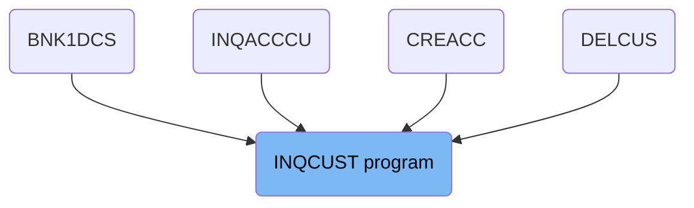

## PREMIERE

Lets' zoom into this section of the flow:

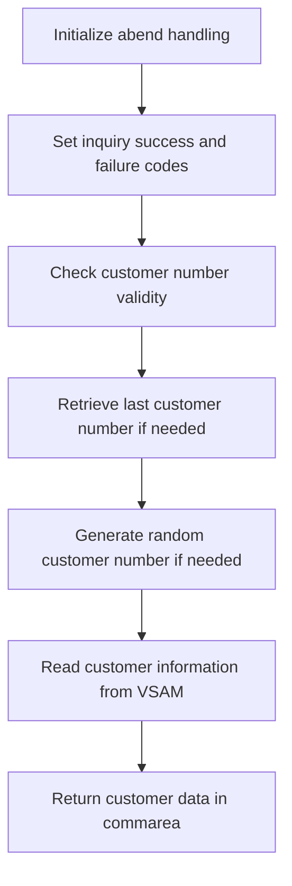

<SwmSnippet path="/src/base/cobol_src/INQCUST.cbl" line="171">

---

First, the abend handling is initialized to ensure that any abnormal ends are properly managed.

```cobol
           EXEC CICS HANDLE ABEND
              LABEL(ABEND-HANDLING)
           END-EXEC.
```

---

</SwmSnippet>

<SwmSnippet path="/src/base/cobol_src/INQCUST.cbl" line="175">

---

Moving to the next step, the inquiry success and failure codes are set to their initial values to prepare for the customer information retrieval process.

```cobol
           MOVE 'N' TO INQCUST-INQ-SUCCESS
           MOVE '0' TO INQCUST-INQ-FAIL-CD

```

---

</SwmSnippet>

<SwmSnippet path="/src/base/cobol_src/INQCUST.cbl" line="190">

---

Next, the code checks if the provided customer number is either all zeros or all nines, which indicates a need to retrieve the last customer number in use.

```cobol
           IF INQCUST-CUSTNO = 0000000000 OR INQCUST-CUSTNO = 9999999999
              PERFORM READ-CUSTOMER-NCS
      D       DISPLAY 'CUST NO RETURNED FROM NCS=' NCS-CUST-NO-VALUE
              IF INQCUST-INQ-SUCCESS = 'Y'
                MOVE NCS-CUST-NO-VALUE TO REQUIRED-CUST-NUMBER
              ELSE
                PERFORM GET-ME-OUT-OF-HERE
              END-IF
           END-IF.
```

---

</SwmSnippet>

<SwmSnippet path="/src/base/cobol_src/INQCUST.cbl" line="204">

---

If the customer number is all zeros, a random customer number is generated that is less than the highest customer number currently in use.

```cobol
           IF INQCUST-CUSTNO = 0000000000
              PERFORM GENERATE-RANDOM-CUSTOMER
              MOVE RANDOM-CUSTOMER TO REQUIRED-CUST-NUMBER
           END-IF.
```

---

</SwmSnippet>

<SwmSnippet path="/src/base/cobol_src/INQCUST.cbl" line="215">

---

Then, the customer information is read from the VSAM file until the read operation is successful.

```cobol
           PERFORM READ-CUSTOMER-VSAM
             UNTIL EXIT-VSAM-READ = 'Y'.
```

---

</SwmSnippet>

<SwmSnippet path="/src/base/cobol_src/INQCUST.cbl" line="220">

---

If the inquiry is successful, the customer data is returned in the communication area, including details such as the customer number, name, address, date of birth, credit score, and credit score review date.

```cobol
           IF INQCUST-INQ-SUCCESS = 'Y'
             MOVE '0' TO INQCUST-INQ-FAIL-CD
             MOVE CUSTOMER-EYECATCHER OF OUTPUT-DATA
                TO INQCUST-EYE
             MOVE CUSTOMER-SORTCODE OF OUTPUT-DATA
                TO INQCUST-SCODE
             MOVE CUSTOMER-NUMBER OF OUTPUT-DATA
                TO INQCUST-CUSTNO
             MOVE CUSTOMER-NAME OF OUTPUT-DATA
                TO INQCUST-NAME
             MOVE CUSTOMER-ADDRESS OF OUTPUT-DATA
                TO INQCUST-ADDR
             MOVE CUSTOMER-DATE-OF-BIRTH OF OUTPUT-DATA
                TO INQCUST-DOB
             MOVE CUSTOMER-CREDIT-SCORE OF OUTPUT-DATA
                TO INQCUST-CREDIT-SCORE
             MOVE CUSTOMER-CS-REVIEW-DATE OF OUTPUT-DATA
                TO INQCUST-CS-REVIEW-DT
```

---

</SwmSnippet>

<SwmSnippet path="/src/base/cobol_src/INQCUST.cbl" line="240">

---

Finally, the process concludes by performing the <SwmToken path="src/base/cobol_src/INQCUST.cbl" pos="240:3:11" line-data="           PERFORM GET-ME-OUT-OF-HERE.">`GET-ME-OUT-OF-HERE`</SwmToken> routine to finalize the operation.

```cobol
           PERFORM GET-ME-OUT-OF-HERE.
```

---

</SwmSnippet>

## <SwmToken path="src/base/cobol_src/INQCUST.cbl" pos="191:3:7" line-data="              PERFORM READ-CUSTOMER-NCS">`READ-CUSTOMER-NCS`</SwmToken>

Lets' zoom into this section of the flow:

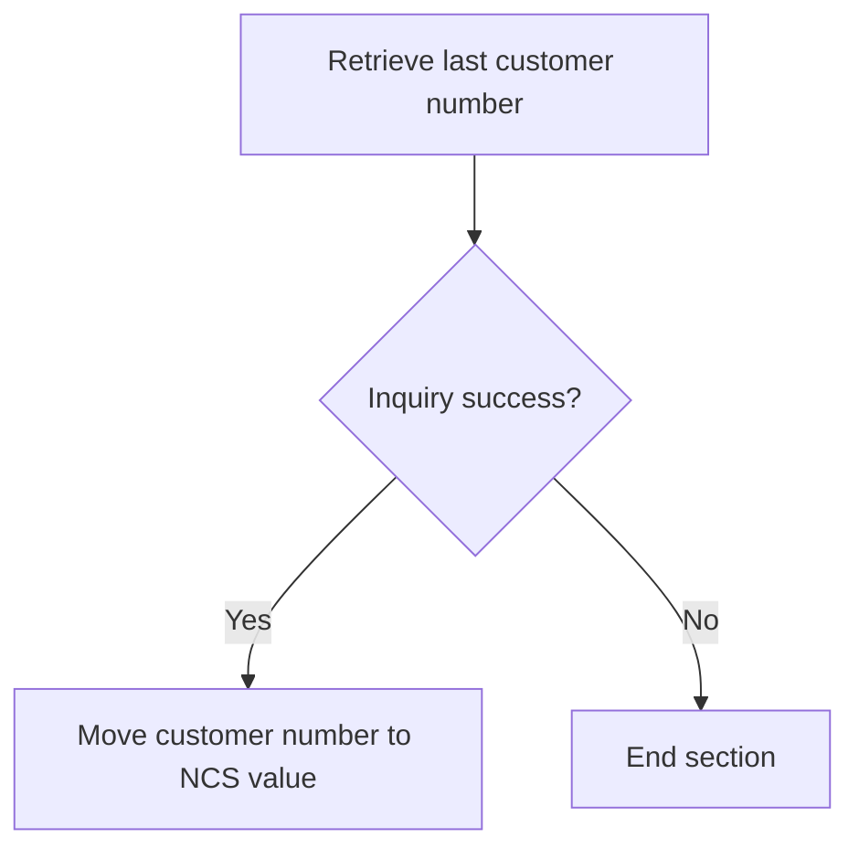

<SwmSnippet path="/src/base/cobol_src/INQCUST.cbl" line="251">

---

First, the section performs the operation to retrieve the last customer number in use by calling the <SwmToken path="src/base/cobol_src/INQCUST.cbl" pos="251:3:9" line-data="           PERFORM GET-LAST-CUSTOMER-VSAM">`GET-LAST-CUSTOMER-VSAM`</SwmToken> section.

```cobol
           PERFORM GET-LAST-CUSTOMER-VSAM
```

---

</SwmSnippet>

<SwmSnippet path="/src/base/cobol_src/INQCUST.cbl" line="252">

---

Next, it checks if the inquiry was successful by evaluating if <SwmToken path="src/base/cobol_src/INQCUST.cbl" pos="252:3:7" line-data="           IF INQCUST-INQ-SUCCESS = &#39;Y&#39;">`INQCUST-INQ-SUCCESS`</SwmToken> (the inquiry success flag) is set to 'Y'. If the inquiry is successful, it moves the <SwmToken path="src/base/cobol_src/INQCUST.cbl" pos="253:3:7" line-data="             MOVE REQUIRED-CUST-NUMBER2 TO NCS-CUST-NO-VALUE">`REQUIRED-CUST-NUMBER2`</SwmToken> (the retrieved customer number) to <SwmToken path="src/base/cobol_src/INQCUST.cbl" pos="253:11:17" line-data="             MOVE REQUIRED-CUST-NUMBER2 TO NCS-CUST-NO-VALUE">`NCS-CUST-NO-VALUE`</SwmToken> (the NCS customer number value).

```cobol
           IF INQCUST-INQ-SUCCESS = 'Y'
             MOVE REQUIRED-CUST-NUMBER2 TO NCS-CUST-NO-VALUE
           END-IF.
```

---

</SwmSnippet>

## <SwmToken path="src/base/cobol_src/INQCUST.cbl" pos="251:3:9" line-data="           PERFORM GET-LAST-CUSTOMER-VSAM">`GET-LAST-CUSTOMER-VSAM`</SwmToken>

Lets' zoom into this section of the flow:

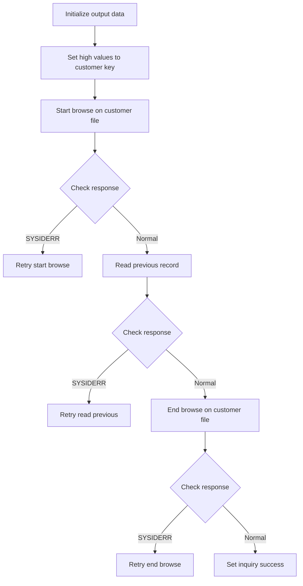

First, the output data is initialized to ensure that any previous data does not interfere with the current operation.

<SwmSnippet path="/src/base/cobol_src/INQCUST.cbl" line="572">

---

Next, high values are moved to the customer key to set up for retrieving the last customer number.

```cobol
           MOVE HIGH-VALUES TO CUSTOMER-KY2.
```

---

</SwmSnippet>

<SwmSnippet path="/src/base/cobol_src/INQCUST.cbl" line="574">

---

Then, a STARTBR command is issued to start browsing the customer file from the highest key value.

```cobol
           EXEC CICS STARTBR FILE('CUSTOMER')
                RIDFLD(CUSTOMER-KY2)
                RESP(WS-CICS-RESP)
                RESP2(WS-CICS-RESP2)
           END-EXEC.
```

---

</SwmSnippet>

<SwmSnippet path="/src/base/cobol_src/INQCUST.cbl" line="580">

---

If a SYSIDERR response is received, the system retries the STARTBR command up to 100 times, with a 3-second delay between each attempt.

```cobol
           IF WS-CICS-RESP = DFHRESP(SYSIDERR)
              PERFORM VARYING SYSIDERR-RETRY FROM 1 BY 1
              UNTIL SYSIDERR-RETRY > 100
              OR WS-CICS-RESP = DFHRESP(NORMAL)
              OR WS-CICS-RESP IS NOT EQUAL TO DFHRESP(SYSIDERR)

                 EXEC CICS DELAY FOR SECONDS(3)
                 END-EXEC

                 EXEC CICS STARTBR FILE('CUSTOMER')
                    RIDFLD(CUSTOMER-KY2)
                    RESP(WS-CICS-RESP)
                    RESP2(WS-CICS-RESP2)
                 END-EXEC

              END-PERFORM
```

---

</SwmSnippet>

<SwmSnippet path="/src/base/cobol_src/INQCUST.cbl" line="603">

---

If the response is not normal after the retries, the inquiry success flag is set to 'N' and the failure code is set to '9'.

```cobol
           IF WS-CICS-RESP IS NOT EQUAL TO DFHRESP(NORMAL)
               MOVE 'N' TO INQCUST-INQ-SUCCESS
               MOVE '9' TO INQCUST-INQ-FAIL-CD
               GO TO GLCVE999
           END-IF.
```

---

</SwmSnippet>

<SwmSnippet path="/src/base/cobol_src/INQCUST.cbl" line="609">

---

Moving forward, a READPREV command is issued to read the previous record in the customer file.

```cobol
           EXEC CICS READPREV FILE('CUSTOMER')
                RIDFLD(CUSTOMER-KY2)
                INTO(OUTPUT-DATA)
                RESP(WS-CICS-RESP)
                RESP2(WS-CICS-RESP2)
           END-EXEC.
```

---

</SwmSnippet>

<SwmSnippet path="/src/base/cobol_src/INQCUST.cbl" line="616">

---

If a SYSIDERR response is received during the READPREV command, the system retries the command up to 100 times, with a 3-second delay between each attempt.

```cobol
           IF WS-CICS-RESP = DFHRESP(SYSIDERR)
              PERFORM VARYING SYSIDERR-RETRY FROM 1 BY 1
              UNTIL SYSIDERR-RETRY > 100
              OR WS-CICS-RESP = DFHRESP(NORMAL)
              OR WS-CICS-RESP IS NOT EQUAL TO DFHRESP(SYSIDERR)

                 EXEC CICS DELAY FOR SECONDS(3)
                 END-EXEC

                 EXEC CICS READPREV FILE('CUSTOMER')
                      RIDFLD(CUSTOMER-KY2)
                      INTO(OUTPUT-DATA)
                      RESP(WS-CICS-RESP)
                      RESP2(WS-CICS-RESP2)
                 END-EXEC

              END-PERFORM
```

---

</SwmSnippet>

<SwmSnippet path="/src/base/cobol_src/INQCUST.cbl" line="636">

---

If the response is not normal after the retries, the inquiry success flag is set to 'N' and the failure code is set to '9'.

```cobol
           IF WS-CICS-RESP IS NOT EQUAL TO DFHRESP(NORMAL)
              MOVE 'N' TO INQCUST-INQ-SUCCESS
              MOVE '9' TO INQCUST-INQ-FAIL-CD
              GO TO GLCVE999
           END-IF.
```

---

</SwmSnippet>

<SwmSnippet path="/src/base/cobol_src/INQCUST.cbl" line="642">

---

Next, an ENDBR command is issued to end the browse operation on the customer file.

```cobol
           EXEC CICS ENDBR FILE('CUSTOMER')
                RESP(WS-CICS-RESP)
                RESP2(WS-CICS-RESP2)
           END-EXEC.
```

---

</SwmSnippet>

<SwmSnippet path="/src/base/cobol_src/INQCUST.cbl" line="647">

---

If a SYSIDERR response is received during the ENDBR command, the system retries the command up to 100 times, with a 3-second delay between each attempt.

```cobol
           IF WS-CICS-RESP = DFHRESP(SYSIDERR)
              PERFORM VARYING SYSIDERR-RETRY FROM 1 BY 1
              UNTIL SYSIDERR-RETRY > 100
              OR WS-CICS-RESP = DFHRESP(NORMAL)
              OR WS-CICS-RESP IS NOT EQUAL TO DFHRESP(SYSIDERR)

                 EXEC CICS DELAY FOR SECONDS(3)
                 END-EXEC

                 EXEC CICS ENDBR FILE('CUSTOMER')
                      RESP(WS-CICS-RESP)
                      RESP2(WS-CICS-RESP2)
                 END-EXEC

              END-PERFORM
```

---

</SwmSnippet>

<SwmSnippet path="/src/base/cobol_src/INQCUST.cbl" line="663">

---

If the response is not normal after the retries, the inquiry success flag is set to 'N' and the failure code is set to '9'.

```cobol
           IF WS-CICS-RESP IS NOT EQUAL TO DFHRESP(NORMAL)
              MOVE 'N' TO INQCUST-INQ-SUCCESS
              MOVE '9' TO INQCUST-INQ-FAIL-CD
              GO TO GLCVE999
           END-IF.
```

---

</SwmSnippet>

<SwmSnippet path="/src/base/cobol_src/INQCUST.cbl" line="669">

---

Finally, if all operations are successful, the inquiry success flag is set to 'Y'.

```cobol
           MOVE 'Y' TO INQCUST-INQ-SUCCESS.
```

---

</SwmSnippet>

## Interim Summary

So far, we saw the detailed steps involved in initializing abend handling, setting inquiry success and failure codes, checking customer number validity, retrieving the last customer number, generating a random customer number, reading customer information from VSAM, and returning customer data in the communication area. We also explored the process of retrieving the last customer number using the <SwmToken path="src/base/cobol_src/INQCUST.cbl" pos="191:3:7" line-data="              PERFORM READ-CUSTOMER-NCS">`READ-CUSTOMER-NCS`</SwmToken> section and the steps involved in the <SwmToken path="src/base/cobol_src/INQCUST.cbl" pos="251:3:9" line-data="           PERFORM GET-LAST-CUSTOMER-VSAM">`GET-LAST-CUSTOMER-VSAM`</SwmToken> section. Now, we will focus on the <SwmToken path="src/base/cobol_src/INQCUST.cbl" pos="196:3:11" line-data="                PERFORM GET-ME-OUT-OF-HERE">`GET-ME-OUT-OF-HERE`</SwmToken> section, which handles the process of finishing the current operation and returning control to the calling program.

## <SwmToken path="src/base/cobol_src/INQCUST.cbl" pos="196:3:11" line-data="                PERFORM GET-ME-OUT-OF-HERE">`GET-ME-OUT-OF-HERE`</SwmToken>

Lets' zoom into this section of the flow:

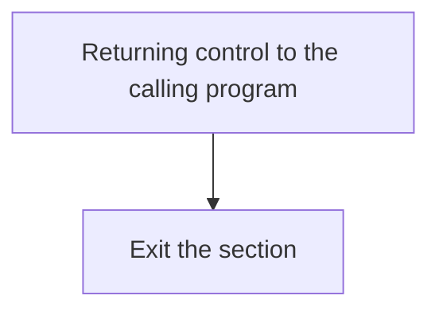

First, the <SwmToken path="src/base/cobol_src/INQCUST.cbl" pos="196:3:11" line-data="                PERFORM GET-ME-OUT-OF-HERE">`GET-ME-OUT-OF-HERE`</SwmToken> section is defined to handle the process of finishing the current operation and returning control to the calling program.

<SwmSnippet path="/src/base/cobol_src/INQCUST.cbl" line="433">

---

Next, the <SwmToken path="src/base/cobol_src/INQCUST.cbl" pos="433:1:5" line-data="           EXEC CICS RETURN">`EXEC CICS RETURN`</SwmToken> command is executed, which instructs CICS to return control to the calling program, effectively ending the current task.

```cobol
           EXEC CICS RETURN
           END-EXEC.
```

---

</SwmSnippet>

<SwmSnippet path="/src/base/cobol_src/INQCUST.cbl" line="436">

---

Finally, the section ends with the <SwmToken path="src/base/cobol_src/INQCUST.cbl" pos="437:1:1" line-data="           EXIT.">`EXIT`</SwmToken> statement, ensuring that the program exits the <SwmToken path="src/base/cobol_src/INQCUST.cbl" pos="196:3:11" line-data="                PERFORM GET-ME-OUT-OF-HERE">`GET-ME-OUT-OF-HERE`</SwmToken> section cleanly.

```cobol
       GMOFH999.
           EXIT.
```

---

</SwmSnippet>

# Reading VSAM data (<SwmToken path="src/base/cobol_src/INQCUST.cbl" pos="215:3:7" line-data="           PERFORM READ-CUSTOMER-VSAM">`READ-CUSTOMER-VSAM`</SwmToken>)

Let's split this section into smaller parts:

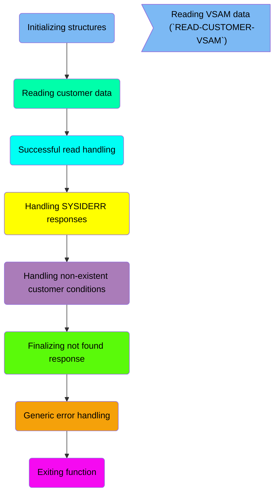

## Initializing structures

First, we'll zoom into this section of the flow:

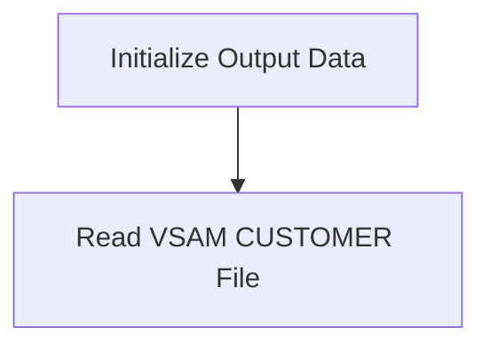

<SwmSnippet path="/src/base/cobol_src/INQCUST.cbl" line="258">

---

First, the <SwmToken path="src/base/cobol_src/INQCUST.cbl" pos="258:1:5" line-data="       READ-CUSTOMER-VSAM SECTION.">`READ-CUSTOMER-VSAM`</SwmToken> section begins by initializing the <SwmToken path="src/base/cobol_src/INQCUST.cbl" pos="263:3:5" line-data="           INITIALIZE OUTPUT-DATA.">`OUTPUT-DATA`</SwmToken>. This step ensures that any previous data is cleared and the structure is ready to store new customer information.

```cobol
       READ-CUSTOMER-VSAM SECTION.
       RCV010.
      *
      *    Read the VSAM CUSTOMER file
      *
           INITIALIZE OUTPUT-DATA.
```

---

</SwmSnippet>

## Reading customer data

This is the next section of the flow.

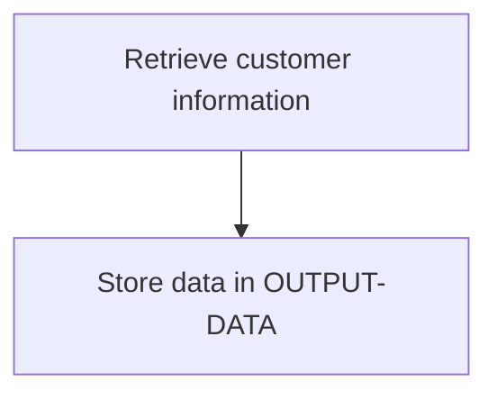

<SwmSnippet path="/src/base/cobol_src/INQCUST.cbl" line="265">

---

The <SwmToken path="src/base/cobol_src/INQCUST.cbl" pos="215:3:7" line-data="           PERFORM READ-CUSTOMER-VSAM">`READ-CUSTOMER-VSAM`</SwmToken> function retrieves customer information from the VSAM file named 'CUSTOMER'.

```cobol
           EXEC CICS READ FILE('CUSTOMER')
                RIDFLD(CUSTOMER-KY)
                INTO(OUTPUT-DATA)
                RESP(WS-CICS-RESP)
                RESP2(WS-CICS-RESP2)
           END-EXEC.
```

---

</SwmSnippet>

## Successful read handling

This is the next section of the flow.

```mermaid
graph TD
  A[Check if response is NORMAL] -->|Yes| B[Set EXIT-VSAM-READ to 'Y']
  B --> C[Set INQCUST-INQ-SUCCESS to 'Y']
  C --> D[Proceed to RCV999]

%% Swimm:
%% graph TD
%%   A[Check if response is NORMAL] -->|Yes| B[Set <SwmToken path="src/base/cobol_src/INQCUST.cbl" pos="216:3:7" line-data="             UNTIL EXIT-VSAM-READ = &#39;Y&#39;.">`EXIT-VSAM-READ`</SwmToken> to 'Y']
%%   B --> C[Set <SwmToken path="src/base/cobol_src/INQCUST.cbl" pos="175:9:13" line-data="           MOVE &#39;N&#39; TO INQCUST-INQ-SUCCESS">`INQCUST-INQ-SUCCESS`</SwmToken> to 'Y']
%%   C --> D[Proceed to <SwmToken path="src/base/cobol_src/INQCUST.cbl" pos="279:5:5" line-data="              GO TO RCV999">`RCV999`</SwmToken>]
```

<SwmSnippet path="/src/base/cobol_src/INQCUST.cbl" line="276">

---

The code checks if <SwmToken path="src/base/cobol_src/INQCUST.cbl" pos="276:3:7" line-data="           IF WS-CICS-RESP = DFHRESP(NORMAL)">`WS-CICS-RESP`</SwmToken> (the response code from the CICS operation) is equal to <SwmToken path="src/base/cobol_src/INQCUST.cbl" pos="276:11:14" line-data="           IF WS-CICS-RESP = DFHRESP(NORMAL)">`DFHRESP(NORMAL)`</SwmToken> (indicating a successful operation). If the response is normal, it sets <SwmToken path="src/base/cobol_src/INQCUST.cbl" pos="277:9:13" line-data="              MOVE &#39;Y&#39; TO EXIT-VSAM-READ">`EXIT-VSAM-READ`</SwmToken> to 'Y', signaling that the VSAM read operation should exit. Additionally, it sets <SwmToken path="src/base/cobol_src/INQCUST.cbl" pos="278:9:13" line-data="              MOVE &#39;Y&#39; TO INQCUST-INQ-SUCCESS">`INQCUST-INQ-SUCCESS`</SwmToken> to 'Y', indicating that the customer inquiry was successful. Finally, the flow proceeds to the <SwmToken path="src/base/cobol_src/INQCUST.cbl" pos="279:5:5" line-data="              GO TO RCV999">`RCV999`</SwmToken> section, which handles the next steps after a successful read.

```cobol
           IF WS-CICS-RESP = DFHRESP(NORMAL)
              MOVE 'Y' TO EXIT-VSAM-READ
              MOVE 'Y' TO INQCUST-INQ-SUCCESS
              GO TO RCV999
           END-IF.
```

---

</SwmSnippet>

## Handling SYSIDERR responses

Now, lets zoom into this section of the flow:

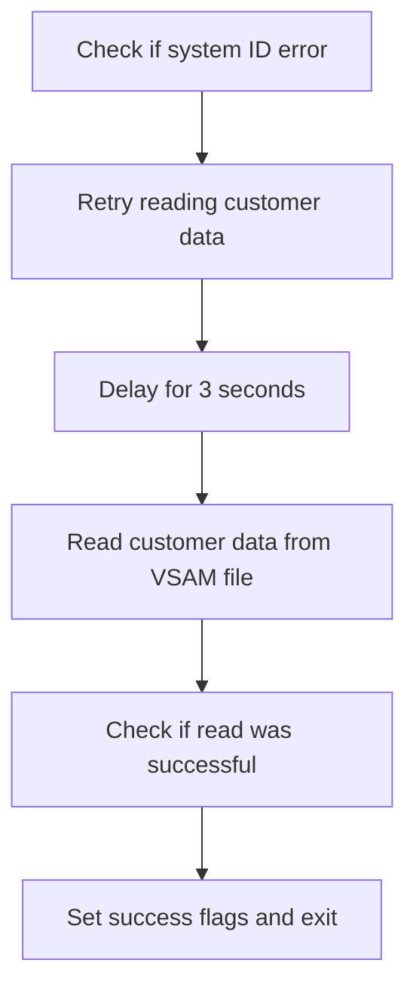

<SwmSnippet path="/src/base/cobol_src/INQCUST.cbl" line="282">

---

First, the code checks if <SwmToken path="src/base/cobol_src/INQCUST.cbl" pos="282:3:7" line-data="           IF WS-CICS-RESP = DFHRESP(SYSIDERR)">`WS-CICS-RESP`</SwmToken> (the response code) is equal to <SwmToken path="src/base/cobol_src/INQCUST.cbl" pos="282:11:14" line-data="           IF WS-CICS-RESP = DFHRESP(SYSIDERR)">`DFHRESP(SYSIDERR)`</SwmToken> (system ID error).

```cobol
           IF WS-CICS-RESP = DFHRESP(SYSIDERR)
```

---

</SwmSnippet>

<SwmSnippet path="/src/base/cobol_src/INQCUST.cbl" line="283">

---

Next, if a system ID error is detected, the code enters a loop to retry reading the customer data up to 100 times or until the error is resolved.

```cobol
              PERFORM VARYING SYSIDERR-RETRY FROM 1 BY 1
              UNTIL SYSIDERR-RETRY > 100
              OR WS-CICS-RESP IS NOT EQUAL TO DFHRESP(SYSIDERR)
```

---

</SwmSnippet>

<SwmSnippet path="/src/base/cobol_src/INQCUST.cbl" line="287">

---

Moving to the next step, the code introduces a delay of 3 seconds between each retry attempt to allow the system to recover.

```cobol
                 EXEC CICS DELAY FOR SECONDS(3)
                 END-EXEC
```

---

</SwmSnippet>

<SwmSnippet path="/src/base/cobol_src/INQCUST.cbl" line="290">

---

Then, the code attempts to read the customer data from the VSAM file using the <SwmToken path="src/base/cobol_src/INQCUST.cbl" pos="291:3:5" line-data="                    RIDFLD(CUSTOMER-KY)">`CUSTOMER-KY`</SwmToken> (customer key) and stores the result in <SwmToken path="src/base/cobol_src/INQCUST.cbl" pos="292:3:5" line-data="                    INTO(OUTPUT-DATA)">`OUTPUT-DATA`</SwmToken>.

```cobol
                 EXEC CICS READ FILE('CUSTOMER')
                    RIDFLD(CUSTOMER-KY)
                    INTO(OUTPUT-DATA)
                    RESP(WS-CICS-RESP)
                    RESP2(WS-CICS-RESP2)
                  END-EXEC
```

---

</SwmSnippet>

<SwmSnippet path="/src/base/cobol_src/INQCUST.cbl" line="297">

---

Finally, if the read operation is successful (<SwmToken path="src/base/cobol_src/INQCUST.cbl" pos="297:3:7" line-data="                  IF WS-CICS-RESP = DFHRESP(NORMAL)">`WS-CICS-RESP`</SwmToken> equals <SwmToken path="src/base/cobol_src/INQCUST.cbl" pos="297:11:14" line-data="                  IF WS-CICS-RESP = DFHRESP(NORMAL)">`DFHRESP(NORMAL)`</SwmToken>), the code sets the success flags <SwmToken path="src/base/cobol_src/INQCUST.cbl" pos="298:9:13" line-data="                     MOVE &#39;Y&#39; TO EXIT-VSAM-READ">`EXIT-VSAM-READ`</SwmToken> and <SwmToken path="src/base/cobol_src/INQCUST.cbl" pos="299:9:13" line-data="                     MOVE &#39;Y&#39; TO INQCUST-INQ-SUCCESS">`INQCUST-INQ-SUCCESS`</SwmToken> to 'Y' and exits the loop.

```cobol
                  IF WS-CICS-RESP = DFHRESP(NORMAL)
                     MOVE 'Y' TO EXIT-VSAM-READ
                     MOVE 'Y' TO INQCUST-INQ-SUCCESS
                     GO TO RCV999
                  END-IF
```

---

</SwmSnippet>

## Handling non-existent customer conditions

Now, lets zoom into this section of the flow:

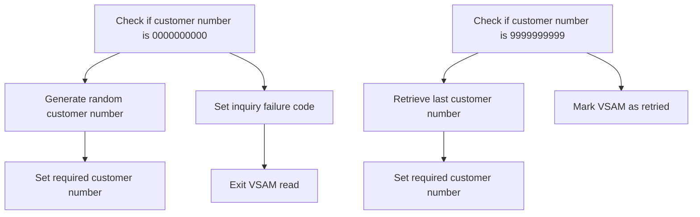

<SwmSnippet path="/src/base/cobol_src/INQCUST.cbl" line="310">

---

First, the code checks if the customer number is <SwmToken path="src/base/cobol_src/INQCUST.cbl" pos="311:7:7" line-data="              INQCUST-CUSTNO = 0000000000">`0000000000`</SwmToken> and if the retry count is less than 1000. If both conditions are met, it generates a random customer number and sets it as the required customer number.

```cobol
           IF WS-CICS-RESP = DFHRESP(NOTFND) AND
              INQCUST-CUSTNO = 0000000000
            IF INQCUST-RETRY < 1000
                PERFORM GENERATE-RANDOM-CUSTOMER-AGAIN
                MOVE RANDOM-CUSTOMER TO REQUIRED-CUST-NUMBER
                GO TO RCV999
```

---

</SwmSnippet>

<SwmSnippet path="/src/base/cobol_src/INQCUST.cbl" line="323">

---

Next, if the customer number is <SwmToken path="src/base/cobol_src/INQCUST.cbl" pos="324:7:7" line-data="           INQCUST-CUSTNO = 9999999999 AND">`9999999999`</SwmToken> and the VSAM has not been retried, the code retrieves the last customer number from the VSAM database and sets it as the required customer number. It also marks the VSAM as retried to avoid repeated attempts.

```cobol
           IF WS-CICS-RESP = DFHRESP(NOTFND) AND
           INQCUST-CUSTNO = 9999999999 AND
           WS-V-RETRIED = 'N'
              PERFORM GET-LAST-CUSTOMER-VSAM
      D       DISPLAY 'CUSTOMER NUMBER RETURNED FROM NCS IS='
      D           NCS-CUST-NO-VALUE
              MOVE NCS-CUST-NO-VALUE TO REQUIRED-CUST-NUMBER
              MOVE 'Y' TO WS-V-RETRIED
              GO TO RCV999
```

---

</SwmSnippet>

## Finalizing not found response

This is the next section of the flow.

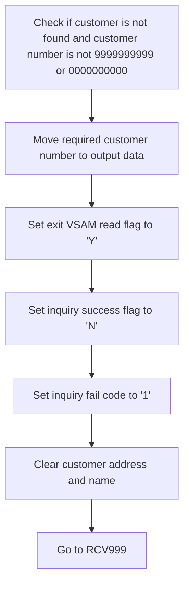

<SwmSnippet path="/src/base/cobol_src/INQCUST.cbl" line="339">

---

The code checks if the customer is not found in the VSAM database and the customer number is not <SwmToken path="src/base/cobol_src/INQCUST.cbl" pos="340:11:11" line-data="                AND INQCUST-CUSTNO NOT = 9999999999)">`9999999999`</SwmToken> or <SwmToken path="src/base/cobol_src/INQCUST.cbl" pos="342:11:11" line-data="                AND INQCUST-CUSTNO NOT = 0000000000)">`0000000000`</SwmToken>. If these conditions are met, it moves the required customer number to the <SwmToken path="src/base/cobol_src/INQCUST.cbl" pos="343:11:13" line-data="              MOVE REQUIRED-CUST-NUMBER TO CUSTOMER-NUMBER">`CUSTOMER-NUMBER`</SwmToken> field of the output data. This ensures that the output data contains the customer number that was being inquired about. Next, it sets the <SwmToken path="src/base/cobol_src/INQCUST.cbl" pos="345:9:13" line-data="              MOVE &#39;Y&#39; TO EXIT-VSAM-READ">`EXIT-VSAM-READ`</SwmToken> flag to 'Y', indicating that the VSAM read operation should be exited. It also sets the <SwmToken path="src/base/cobol_src/INQCUST.cbl" pos="346:9:13" line-data="              MOVE &#39;N&#39; TO INQCUST-INQ-SUCCESS">`INQCUST-INQ-SUCCESS`</SwmToken> flag to 'N', indicating that the inquiry was not successful. Additionally, it sets the <SwmToken path="src/base/cobol_src/INQCUST.cbl" pos="347:9:15" line-data="              MOVE &#39;1&#39; TO INQCUST-INQ-FAIL-CD">`INQCUST-INQ-FAIL-CD`</SwmToken> to '1', representing a failure code for the inquiry. Finally, it clears the <SwmToken path="src/base/cobol_src/INQCUST.cbl" pos="348:7:9" line-data="              MOVE SPACES TO INQCUST-ADDR">`INQCUST-ADDR`</SwmToken> and <SwmToken path="src/base/cobol_src/INQCUST.cbl" pos="349:7:9" line-data="              MOVE SPACES TO INQCUST-NAME">`INQCUST-NAME`</SwmToken> fields to ensure that no incorrect data is returned, and then it goes to the <SwmToken path="src/base/cobol_src/INQCUST.cbl" pos="350:5:5" line-data="              GO TO RCV999">`RCV999`</SwmToken> label to handle the next steps in the process.

```cobol
           IF (WS-CICS-RESP = DFHRESP(NOTFND)
                AND INQCUST-CUSTNO NOT = 9999999999)
                AND (WS-CICS-RESP = DFHRESP(NOTFND)
                AND INQCUST-CUSTNO NOT = 0000000000)
              MOVE REQUIRED-CUST-NUMBER TO CUSTOMER-NUMBER
                                           OF OUTPUT-DATA
              MOVE 'Y' TO EXIT-VSAM-READ
              MOVE 'N' TO INQCUST-INQ-SUCCESS
              MOVE '1' TO INQCUST-INQ-FAIL-CD
              MOVE SPACES TO INQCUST-ADDR
              MOVE SPACES TO INQCUST-NAME
              GO TO RCV999
```

---

</SwmSnippet>

## Generic error handling

Now, lets zoom into this section of the flow:

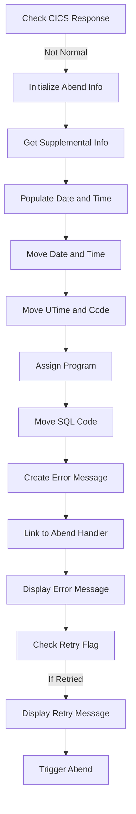

First, the code checks if the CICS response code (<SwmToken path="src/base/cobol_src/INQCUST.cbl" pos="268:3:7" line-data="                RESP(WS-CICS-RESP)">`WS-CICS-RESP`</SwmToken>) is not equal to <SwmToken path="src/base/cobol_src/INQCUST.cbl" pos="276:11:14" line-data="           IF WS-CICS-RESP = DFHRESP(NORMAL)">`DFHRESP(NORMAL)`</SwmToken>, indicating an error in retrieving the customer data.

<SwmSnippet path="/src/base/cobol_src/INQCUST.cbl" line="364">

---

Moving to the next step, the program initializes the <SwmToken path="src/base/cobol_src/INQCUST.cbl" pos="364:3:5" line-data="              INITIALIZE ABNDINFO-REC">`ABNDINFO-REC`</SwmToken> structure to prepare for capturing abend (abnormal end) information.

```cobol
              INITIALIZE ABNDINFO-REC
```

---

</SwmSnippet>

<SwmSnippet path="/src/base/cobol_src/INQCUST.cbl" line="365">

---

Next, the response codes <SwmToken path="src/base/cobol_src/INQCUST.cbl" pos="365:3:3" line-data="              MOVE EIBRESP    TO ABND-RESPCODE">`EIBRESP`</SwmToken> and <SwmToken path="src/base/cobol_src/INQCUST.cbl" pos="366:3:3" line-data="              MOVE EIBRESP2   TO ABND-RESP2CODE">`EIBRESP2`</SwmToken> are moved to <SwmToken path="src/base/cobol_src/INQCUST.cbl" pos="365:7:9" line-data="              MOVE EIBRESP    TO ABND-RESPCODE">`ABND-RESPCODE`</SwmToken> and <SwmToken path="src/base/cobol_src/INQCUST.cbl" pos="366:7:9" line-data="              MOVE EIBRESP2   TO ABND-RESP2CODE">`ABND-RESP2CODE`</SwmToken> respectively, preserving the error details.

```cobol
              MOVE EIBRESP    TO ABND-RESPCODE
              MOVE EIBRESP2   TO ABND-RESP2CODE
```

---

</SwmSnippet>

<SwmSnippet path="/src/base/cobol_src/INQCUST.cbl" line="370">

---

Then, the program retrieves supplemental information such as the application ID (<SwmToken path="src/base/cobol_src/INQCUST.cbl" pos="370:7:7" line-data="              EXEC CICS ASSIGN APPLID(ABND-APPLID)">`APPLID`</SwmToken>), task number (<SwmToken path="src/base/cobol_src/INQCUST.cbl" pos="373:3:3" line-data="              MOVE EIBTASKN   TO ABND-TASKNO-KEY">`EIBTASKN`</SwmToken>), and transaction ID (<SwmToken path="src/base/cobol_src/INQCUST.cbl" pos="374:3:3" line-data="              MOVE EIBTRNID   TO ABND-TRANID">`EIBTRNID`</SwmToken>) to provide context for the error.

```cobol
              EXEC CICS ASSIGN APPLID(ABND-APPLID)
              END-EXEC

              MOVE EIBTASKN   TO ABND-TASKNO-KEY
              MOVE EIBTRNID   TO ABND-TRANID

```

---

</SwmSnippet>

<SwmSnippet path="/src/base/cobol_src/INQCUST.cbl" line="376">

---

Diving into the next step, the program performs the <SwmToken path="src/base/cobol_src/INQCUST.cbl" pos="376:3:7" line-data="              PERFORM POPULATE-TIME-DATE">`POPULATE-TIME-DATE`</SwmToken> routine to get the current date and time.

```cobol
              PERFORM POPULATE-TIME-DATE
```

---

</SwmSnippet>

<SwmSnippet path="/src/base/cobol_src/INQCUST.cbl" line="378">

---

The current date and time are then moved to <SwmToken path="src/base/cobol_src/INQCUST.cbl" pos="378:11:13" line-data="              MOVE WS-ORIG-DATE TO ABND-DATE">`ABND-DATE`</SwmToken> and <SwmToken path="src/base/cobol_src/INQCUST.cbl" pos="384:3:5" line-data="                     INTO ABND-TIME">`ABND-TIME`</SwmToken> respectively, ensuring the error log is timestamped.

```cobol
              MOVE WS-ORIG-DATE TO ABND-DATE
              STRING WS-TIME-NOW-GRP-HH DELIMITED BY SIZE,
                    ':' DELIMITED BY SIZE,
                     WS-TIME-NOW-GRP-MM DELIMITED BY SIZE,
                     ':' DELIMITED BY SIZE,
                     WS-TIME-NOW-GRP-MM DELIMITED BY SIZE
                     INTO ABND-TIME
```

---

</SwmSnippet>

<SwmSnippet path="/src/base/cobol_src/INQCUST.cbl" line="387">

---

Moving forward, the program sets the <SwmToken path="src/base/cobol_src/INQCUST.cbl" pos="387:11:15" line-data="              MOVE WS-U-TIME   TO ABND-UTIME-KEY">`ABND-UTIME-KEY`</SwmToken> and <SwmToken path="src/base/cobol_src/INQCUST.cbl" pos="388:9:11" line-data="              MOVE &#39;CVR1&#39;      TO ABND-CODE">`ABND-CODE`</SwmToken> fields to capture the unique time and error code.

```cobol
              MOVE WS-U-TIME   TO ABND-UTIME-KEY
              MOVE 'CVR1'      TO ABND-CODE
```

---

</SwmSnippet>

<SwmSnippet path="/src/base/cobol_src/INQCUST.cbl" line="390">

---

The program name is assigned to <SwmToken path="src/base/cobol_src/INQCUST.cbl" pos="390:9:11" line-data="              EXEC CICS ASSIGN PROGRAM(ABND-PROGRAM)">`ABND-PROGRAM`</SwmToken> to identify which program encountered the error.

```cobol
              EXEC CICS ASSIGN PROGRAM(ABND-PROGRAM)
              END-EXEC
```

---

</SwmSnippet>

<SwmSnippet path="/src/base/cobol_src/INQCUST.cbl" line="393">

---

Next, the SQL code is set to zero in <SwmToken path="src/base/cobol_src/INQCUST.cbl" pos="393:7:9" line-data="              MOVE ZEROS      TO ABND-SQLCODE">`ABND-SQLCODE`</SwmToken> to indicate no SQL error occurred.

```cobol
              MOVE ZEROS      TO ABND-SQLCODE
```

---

</SwmSnippet>

<SwmSnippet path="/src/base/cobol_src/INQCUST.cbl" line="395">

---

The program constructs a detailed error message string and stores it in <SwmToken path="src/base/cobol_src/INQCUST.cbl" pos="403:3:5" line-data="                    INTO ABND-FREEFORM">`ABND-FREEFORM`</SwmToken> for logging purposes.

```cobol
              STRING 'RCV010 - CUSTOMER VSAM RECORD KEY='
                    DELIMITED BY SIZE,
                    CUSTOMER-KY DELIMITED SIZE,
                    ' GAVE VSAM RC=' DELIMITED BY SIZE,
                    ' EIBRESP=' DELIMITED BY SIZE,
                    ABND-RESPCODE DELIMITED BY SIZE,
                    ' RESP2=' DELIMITED BY SIZE,
                    ABND-RESP2CODE DELIMITED BY SIZE
                    INTO ABND-FREEFORM
```

---

</SwmSnippet>

<SwmSnippet path="/src/base/cobol_src/INQCUST.cbl" line="406">

---

Finally, the program links to the abend handler program (<SwmToken path="src/base/cobol_src/INQCUST.cbl" pos="406:9:13" line-data="              EXEC CICS LINK PROGRAM(WS-ABEND-PGM)">`WS-ABEND-PGM`</SwmToken>) with the abend information and triggers an abend with the code <SwmToken path="src/base/cobol_src/INQCUST.cbl" pos="418:10:10" line-data="              EXEC CICS ABEND ABCODE(&#39;CVR1&#39;)">`CVR1`</SwmToken>.

```cobol
              EXEC CICS LINK PROGRAM(WS-ABEND-PGM)
                        COMMAREA(ABNDINFO-REC)
              END-EXEC

              DISPLAY 'CUSTOMER VSAM RECORD KEY='
                  CUSTOMER-KY ' GAVE VSAM RC='
                  WS-CICS-RESP

              IF WS-V-RETRIED = 'Y'
                 DISPLAY 'ON A RETRY'
              END-IF

              EXEC CICS ABEND ABCODE('CVR1')
                 CANCEL
              END-EXEC
```

---

</SwmSnippet>

## Exiting function

This is the next section of the flow.

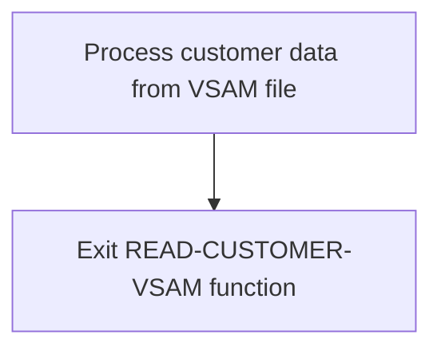

<SwmSnippet path="/src/base/cobol_src/INQCUST.cbl" line="424">

---

The <SwmToken path="src/base/cobol_src/INQCUST.cbl" pos="425:1:1" line-data="           EXIT.">`EXIT`</SwmToken> statement in the <SwmToken path="src/base/cobol_src/INQCUST.cbl" pos="215:3:7" line-data="           PERFORM READ-CUSTOMER-VSAM">`READ-CUSTOMER-VSAM`</SwmToken> function signifies the end of the function's execution. This step ensures that the function terminates properly after processing the customer data from the VSAM file.

```cobol
       RCV999.
           EXIT.
```

---

</SwmSnippet>

## <SwmToken path="src/base/cobol_src/INQCUST.cbl" pos="376:3:7" line-data="              PERFORM POPULATE-TIME-DATE">`POPULATE-TIME-DATE`</SwmToken>

Lets' zoom into this section of the flow:

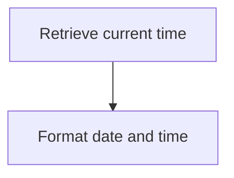

<SwmSnippet path="/src/base/cobol_src/INQCUST.cbl" line="678">

---

### Retrieving current time

First, the system retrieves the current time using the <SwmToken path="src/base/cobol_src/INQCUST.cbl" pos="678:1:5" line-data="           EXEC CICS ASKTIME">`EXEC CICS ASKTIME`</SwmToken> command, which stores the absolute time in <SwmToken path="src/base/cobol_src/INQCUST.cbl" pos="679:3:7" line-data="              ABSTIME(WS-U-TIME)">`WS-U-TIME`</SwmToken>.

```cobol
           EXEC CICS ASKTIME
              ABSTIME(WS-U-TIME)
           END-EXEC.
```

---

</SwmSnippet>

<SwmSnippet path="/src/base/cobol_src/INQCUST.cbl" line="682">

---

### Formatting date and time

Next, the system formats the retrieved time into a human-readable date and time using the <SwmToken path="src/base/cobol_src/INQCUST.cbl" pos="682:1:5" line-data="           EXEC CICS FORMATTIME">`EXEC CICS FORMATTIME`</SwmToken> command. This command converts <SwmToken path="src/base/cobol_src/INQCUST.cbl" pos="683:3:7" line-data="                     ABSTIME(WS-U-TIME)">`WS-U-TIME`</SwmToken> into <SwmToken path="src/base/cobol_src/INQCUST.cbl" pos="684:3:7" line-data="                     DDMMYYYY(WS-ORIG-DATE)">`WS-ORIG-DATE`</SwmToken> for the date and <SwmToken path="src/base/cobol_src/INQCUST.cbl" pos="685:3:7" line-data="                     TIME(WS-TIME-NOW)">`WS-TIME-NOW`</SwmToken> for the time.

```cobol
           EXEC CICS FORMATTIME
                     ABSTIME(WS-U-TIME)
                     DDMMYYYY(WS-ORIG-DATE)
                     TIME(WS-TIME-NOW)
                     DATESEP
           END-EXEC.
```

---

</SwmSnippet>

&nbsp;

*This is an auto-generated document by Swimm 🌊 and has not yet been verified by a human*

<SwmMeta version="3.0.0" repo-id="Z2l0aHViJTNBJTNBY2ljcy1iYW5raW5nLXNhbXBsZS1hcHBsaWNhdGlvbi1jYnNhLUlCTS1EZW1vJTNBJTNBU3dpbW0tRGVtbw==" repo-name="cics-banking-sample-application-cbsa-IBM-Demo"><sup>Powered by [Swimm](/)</sup></SwmMeta>
