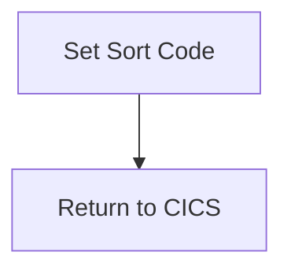

The GETSCODE program is responsible for setting the sort code in the DFHCOMMAREA and then returning control to CICS. This is achieved by moving the value from <SwmToken path="src/base/cobol_src/GETSCODE.cbl" pos="39:3:5" line-data="           MOVE LITERAL-SORTCODE">`LITERAL-SORTCODE`</SwmToken> to SORTCODE and then executing a RETURN command to indicate the completion of the current task.

The flow involves setting the sort code and then returning control to CICS. First, the sort code is set by moving a literal value to the SORTCODE field in the DFHCOMMAREA. After this, a RETURN command is executed to signal that the task is complete and control should be returned to CICS.

## PREMIERE

Lets' zoom into this section of the flow:



<SwmSnippet path="/src/base/cobol_src/GETSCODE.cbl" line="37">

---

### Setting the Sort Code

First, the <SwmToken path="src/base/cobol_src/GETSCODE.cbl" pos="37:1:1" line-data="       PREMIERE SECTION.">`PREMIERE`</SwmToken> section sets the <SwmToken path="src/base/cobol_src/GETSCODE.cbl" pos="39:5:5" line-data="           MOVE LITERAL-SORTCODE">`SORTCODE`</SwmToken> in the <SwmToken path="src/base/cobol_src/GETSCODE.cbl" pos="40:7:7" line-data="           TO SORTCODE OF DFHCOMMAREA.">`DFHCOMMAREA`</SwmToken> by moving the value from <SwmToken path="src/base/cobol_src/GETSCODE.cbl" pos="39:3:5" line-data="           MOVE LITERAL-SORTCODE">`LITERAL-SORTCODE`</SwmToken> to <SwmToken path="src/base/cobol_src/GETSCODE.cbl" pos="39:5:5" line-data="           MOVE LITERAL-SORTCODE">`SORTCODE`</SwmToken>.

```cobol
       PREMIERE SECTION.
       A010.
           MOVE LITERAL-SORTCODE
           TO SORTCODE OF DFHCOMMAREA.
```

---

</SwmSnippet>

<SwmSnippet path="/src/base/cobol_src/GETSCODE.cbl" line="43">

---

### Returning to CICS

Next, the program executes a `RETURN` command to CICS, indicating that the current task is complete and control should be returned to CICS.

```cobol
           EXEC CICS RETURN
           END-EXEC.
```

---

</SwmSnippet>

&nbsp;

*This is an auto-generated document by Swimm 🌊 and has not yet been verified by a human*

<SwmMeta version="3.0.0" repo-id="Z2l0aHViJTNBJTNBY2ljcy1iYW5raW5nLXNhbXBsZS1hcHBsaWNhdGlvbi1jYnNhLUlCTS1EZW1vJTNBJTNBU3dpbW0tRGVtbw==" repo-name="cics-banking-sample-application-cbsa-IBM-Demo"><sup>Powered by [Swimm](/)</sup></SwmMeta>
