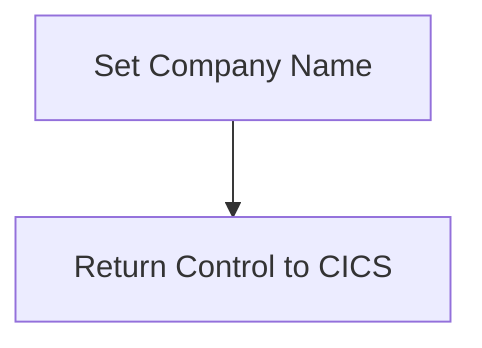

The GETCOMPY program is responsible for setting the company name in the system. This is achieved by moving the string 'CICS Bank Sample Application' to the variable <SwmToken path="src/base/cobol_src/GETCOMPY.cbl" pos="38:15:17" line-data="           move &#39;CICS Bank Sample Application&#39; to COMPANY-NAME.">`COMPANY-NAME`</SwmToken> and then returning control to CICS.

The flow involves setting the company name by assigning the string 'CICS Bank Sample Application' to the <SwmToken path="src/base/cobol_src/GETCOMPY.cbl" pos="38:15:17" line-data="           move &#39;CICS Bank Sample Application&#39; to COMPANY-NAME.">`COMPANY-NAME`</SwmToken> variable and then using the <SwmToken path="src/base/cobol_src/GETCOMPY.cbl" pos="40:1:5" line-data="           EXEC CICS RETURN">`EXEC CICS RETURN`</SwmToken> command to return control to CICS.

## PREMIERE

Lets' zoom into this section of the flow:



<SwmSnippet path="/src/base/cobol_src/GETCOMPY.cbl" line="36">

---

First, the <SwmToken path="src/base/cobol_src/GETCOMPY.cbl" pos="36:1:1" line-data="       PREMIERE SECTION.">`PREMIERE`</SwmToken> section sets the company name by moving the string 'CICS Bank Sample Application' to the variable <SwmToken path="src/base/cobol_src/GETCOMPY.cbl" pos="38:15:17" line-data="           move &#39;CICS Bank Sample Application&#39; to COMPANY-NAME.">`COMPANY-NAME`</SwmToken>.

```cobol
       PREMIERE SECTION.
       A010.
           move 'CICS Bank Sample Application' to COMPANY-NAME.
```

---

</SwmSnippet>

<SwmSnippet path="/src/base/cobol_src/GETCOMPY.cbl" line="40">

---

Next, the control is returned to CICS using the <SwmToken path="src/base/cobol_src/GETCOMPY.cbl" pos="40:1:5" line-data="           EXEC CICS RETURN">`EXEC CICS RETURN`</SwmToken> command, which signifies the end of the <SwmToken path="src/base/cobol_src/GETCOMPY.cbl" pos="36:1:1" line-data="       PREMIERE SECTION.">`PREMIERE`</SwmToken> section's execution.

```cobol
           EXEC CICS RETURN
           END-EXEC.
```

---

</SwmSnippet>

&nbsp;

*This is an auto-generated document by Swimm 🌊 and has not yet been verified by a human*

<SwmMeta version="3.0.0" repo-id="Z2l0aHViJTNBJTNBY2ljcy1iYW5raW5nLXNhbXBsZS1hcHBsaWNhdGlvbi1jYnNhLUlCTS1EZW1vJTNBJTNBU3dpbW0tRGVtbw==" repo-name="cics-banking-sample-application-cbsa-IBM-Demo"><sup>Powered by [Swimm](/)</sup></SwmMeta>
