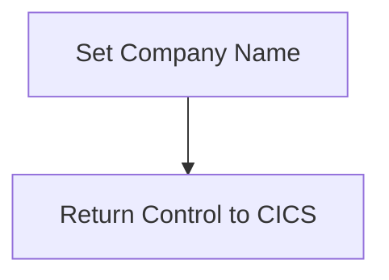

The GETCOMPY program is responsible for setting the company name to 'CICS Bank Sample Application' and then returning control to CICS. This is achieved by assigning the company name to a variable and using the <SwmToken path="src/base/cobol_src/GETCOMPY.cbl" pos="40:1:5" line-data="           EXEC CICS RETURN">`EXEC CICS RETURN`</SwmToken> command to indicate the end of the operation.

The flow involves two main steps: first, the company name 'CICS Bank Sample Application' is assigned to the variable <SwmToken path="src/base/cobol_src/GETCOMPY.cbl" pos="38:15:17" line-data="           move &#39;CICS Bank Sample Application&#39; to COMPANY-NAME.">`COMPANY-NAME`</SwmToken>. Next, control is returned to CICS using the <SwmToken path="src/base/cobol_src/GETCOMPY.cbl" pos="40:1:5" line-data="           EXEC CICS RETURN">`EXEC CICS RETURN`</SwmToken> command, indicating the end of the section's operations.

## PREMIERE

Lets' zoom into this section of the flow:



<SwmSnippet path="/src/base/cobol_src/GETCOMPY.cbl" line="38">

---

First, the company name 'CICS Bank Sample Application' is assigned to the variable <SwmToken path="src/base/cobol_src/GETCOMPY.cbl" pos="38:15:17" line-data="           move &#39;CICS Bank Sample Application&#39; to COMPANY-NAME.">`COMPANY-NAME`</SwmToken>.

```cobol
           move 'CICS Bank Sample Application' to COMPANY-NAME.
```

---

</SwmSnippet>

<SwmSnippet path="/src/base/cobol_src/GETCOMPY.cbl" line="40">

---

Next, control is returned to CICS using the <SwmToken path="src/base/cobol_src/GETCOMPY.cbl" pos="40:1:5" line-data="           EXEC CICS RETURN">`EXEC CICS RETURN`</SwmToken> command, indicating the end of the section's operations.

```cobol
           EXEC CICS RETURN
           END-EXEC.
```

---

</SwmSnippet>

&nbsp;

*This is an auto-generated document by Swimm 🌊 and has not yet been verified by a human*

<SwmMeta version="3.0.0" repo-id="Z2l0aHViJTNBJTNBY2ljcy1iYW5raW5nLXNhbXBsZS1hcHBsaWNhdGlvbi1jYnNhLUlCTS1EZW1vJTNBJTNBU3dpbW0tRGVtbw==" repo-name="cics-banking-sample-application-cbsa-IBM-Demo"><sup>Powered by [Swimm](/)</sup></SwmMeta>
