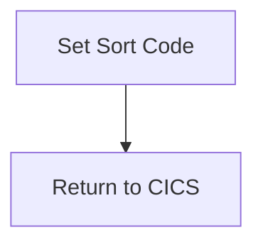

The GETSCODE program is responsible for setting the sort code in the communication area and returning control to the CICS region. This is achieved by moving the sort code literal to the <SwmToken path="src/base/cobol_src/GETSCODE.cbl" pos="39:5:5" line-data="           MOVE LITERAL-SORTCODE">`SORTCODE`</SwmToken> field of the <SwmToken path="src/base/cobol_src/GETSCODE.cbl" pos="40:7:7" line-data="           TO SORTCODE OF DFHCOMMAREA.">`DFHCOMMAREA`</SwmToken> structure and then executing a `RETURN` command to CICS.

The flow involves setting the sort code in the communication area and then returning control to the CICS region. First, the sort code literal is moved to the <SwmToken path="src/base/cobol_src/GETSCODE.cbl" pos="39:5:5" line-data="           MOVE LITERAL-SORTCODE">`SORTCODE`</SwmToken> field of the <SwmToken path="src/base/cobol_src/GETSCODE.cbl" pos="40:7:7" line-data="           TO SORTCODE OF DFHCOMMAREA.">`DFHCOMMAREA`</SwmToken> structure. This ensures that the sort code is correctly set for subsequent processing. Next, the program executes a `RETURN` command to CICS, indicating that the current task is complete and control should be returned to the CICS region.

## PREMIERE

Lets' zoom into this section of the flow:



First, the sort code literal is moved to the <SwmToken path="src/base/cobol_src/GETSCODE.cbl" pos="39:5:5" line-data="           MOVE LITERAL-SORTCODE">`SORTCODE`</SwmToken> field of the <SwmToken path="src/base/cobol_src/GETSCODE.cbl" pos="40:7:7" line-data="           TO SORTCODE OF DFHCOMMAREA.">`DFHCOMMAREA`</SwmToken> structure. This step ensures that the sort code is correctly set in the communication area for subsequent processing.

<SwmSnippet path="/src/base/cobol_src/GETSCODE.cbl" line="37">

---

Next, the program executes a `RETURN` command to CICS, indicating that the current task is complete and control should be returned to the CICS region. This step finalizes the setting of the sort code and prepares the program for the next operation.

```cobol
       PREMIERE SECTION.
       A010.
           MOVE LITERAL-SORTCODE
           TO SORTCODE OF DFHCOMMAREA.


           EXEC CICS RETURN
           END-EXEC.

           GOBACK.
```

---

</SwmSnippet>

&nbsp;

*This is an auto-generated document by Swimm 🌊 and has not yet been verified by a human*

<SwmMeta version="3.0.0" repo-id="Z2l0aHViJTNBJTNBY2ljcy1iYW5raW5nLXNhbXBsZS1hcHBsaWNhdGlvbi1jYnNhLUlCTS1EZW1vJTNBJTNBU3dpbW0tRGVtbw==" repo-name="cics-banking-sample-application-cbsa-IBM-Demo"><sup>Powered by [Swimm](/)</sup></SwmMeta>
