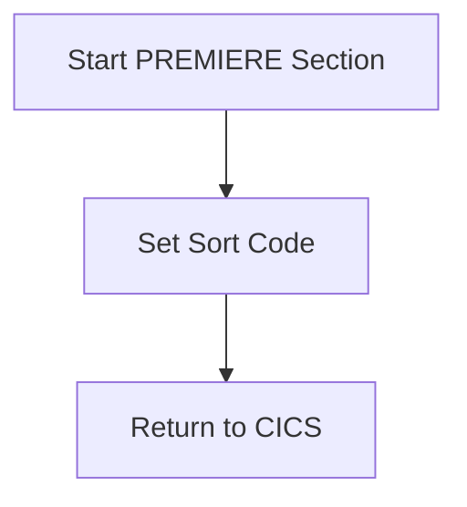

The GETSCODE program is responsible for setting a sort code in the DFHCOMMAREA and then returning control to CICS. This is achieved by initiating the PREMIERE section, moving the literal sort code to the SORTCODE field, and executing the EXEC CICS RETURN command.

The flow starts by initiating the PREMIERE section, which marks the beginning of the logic. Then, the literal sort code is moved to the SORTCODE field of the DFHCOMMAREA. Finally, the EXEC CICS RETURN command is executed to return control back to CICS, indicating that the task is complete.

Lets' zoom into the flow:



<SwmSnippet path="/src/base/cobol_src/GETSCODE.cbl" line="37">

---

## Start PREMIERE Section

First, the <SwmToken path="src/base/cobol_src/GETSCODE.cbl" pos="37:1:1" line-data="       PREMIERE SECTION.">`PREMIERE`</SwmToken> section is initiated. This marks the beginning of the section's logic.

```cobol
       PREMIERE SECTION.
       A010.
```

---

</SwmSnippet>

<SwmSnippet path="/src/base/cobol_src/GETSCODE.cbl" line="39">

---

## Set Sort Code

Next, the literal sort code is moved to the <SwmToken path="src/base/cobol_src/GETSCODE.cbl" pos="39:5:5" line-data="           MOVE LITERAL-SORTCODE">`SORTCODE`</SwmToken> field of the <SwmToken path="src/base/cobol_src/GETSCODE.cbl" pos="40:7:7" line-data="           TO SORTCODE OF DFHCOMMAREA.">`DFHCOMMAREA`</SwmToken>. This step is crucial as it sets the sort code that will be used in subsequent operations.

```cobol
           MOVE LITERAL-SORTCODE
           TO SORTCODE OF DFHCOMMAREA.
```

---

</SwmSnippet>

<SwmSnippet path="/src/base/cobol_src/GETSCODE.cbl" line="43">

---

## Return to CICS

Then, the <SwmToken path="src/base/cobol_src/GETSCODE.cbl" pos="43:1:5" line-data="           EXEC CICS RETURN">`EXEC CICS RETURN`</SwmToken> command is executed. This returns control back to CICS, indicating that the current task is complete.

```cobol
           EXEC CICS RETURN
           END-EXEC.
```

---

</SwmSnippet>

&nbsp;

*This is an auto-generated document by Swimm 🌊 and has not yet been verified by a human*

<SwmMeta version="3.0.0" repo-id="Z2l0aHViJTNBJTNBY2ljcy1iYW5raW5nLXNhbXBsZS1hcHBsaWNhdGlvbi1jYnNhLUlCTS1EZW1vJTNBJTNBU3dpbW0tRGVtbw==" repo-name="cics-banking-sample-application-cbsa-IBM-Demo"><sup>Powered by [Swimm](/)</sup></SwmMeta>
