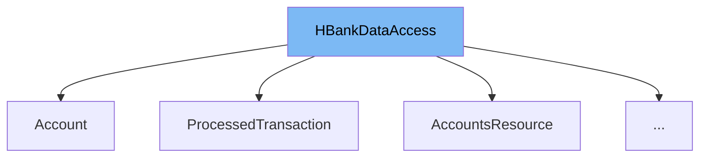

This document will cover the class <SwmToken path="src/webui/src/main/java/com/ibm/cics/cip/bankliberty/api/json/AccountsResource.java" pos="150:3:3" line-data="	public AccountsResource()">`AccountsResource`</SwmToken> in detail. We will cover:

1. What <SwmToken path="src/webui/src/main/java/com/ibm/cics/cip/bankliberty/api/json/AccountsResource.java" pos="174:1:1" line-data="		HBankDataAccess myHBankDataAccess = new HBankDataAccess();">`HBankDataAccess`</SwmToken> is and what it is used for.
2. What <SwmToken path="src/webui/src/main/java/com/ibm/cics/cip/bankliberty/api/json/AccountsResource.java" pos="150:3:3" line-data="	public AccountsResource()">`AccountsResource`</SwmToken> is and what it is used for.
3. Variables and functions defined in <SwmToken path="src/webui/src/main/java/com/ibm/cics/cip/bankliberty/api/json/AccountsResource.java" pos="150:3:3" line-data="	public AccountsResource()">`AccountsResource`</SwmToken>.



# What is <SwmToken path="src/webui/src/main/java/com/ibm/cics/cip/bankliberty/api/json/AccountsResource.java" pos="174:1:1" line-data="		HBankDataAccess myHBankDataAccess = new HBankDataAccess();">`HBankDataAccess`</SwmToken>

<SwmToken path="src/webui/src/main/java/com/ibm/cics/cip/bankliberty/api/json/AccountsResource.java" pos="174:1:1" line-data="		HBankDataAccess myHBankDataAccess = new HBankDataAccess();">`HBankDataAccess`</SwmToken> is a class used to manage <SwmToken path="src/webui/src/main/java/com/ibm/cics/cip/bankliberty/api/json/AccountsResource.java" pos="105:20:20" line-data="	private static final String DB2_READ_FAILURE = &quot;Unable to access Db2 account store&quot;;">`Db2`</SwmToken> connections. It holds a HashTable that stores these connections and provides methods to open and close connections. This class ensures that the database connections are properly managed and reused when necessary.

# What is <SwmToken path="src/webui/src/main/java/com/ibm/cics/cip/bankliberty/api/json/AccountsResource.java" pos="150:3:3" line-data="	public AccountsResource()">`AccountsResource`</SwmToken>

<SwmToken path="src/webui/src/main/java/com/ibm/cics/cip/bankliberty/api/json/AccountsResource.java" pos="150:3:3" line-data="	public AccountsResource()">`AccountsResource`</SwmToken> is a class that extends <SwmToken path="src/webui/src/main/java/com/ibm/cics/cip/bankliberty/api/json/AccountsResource.java" pos="174:1:1" line-data="		HBankDataAccess myHBankDataAccess = new HBankDataAccess();">`HBankDataAccess`</SwmToken> and provides various methods to manage bank accounts. It includes methods for creating, updating, retrieving, and deleting accounts. This class acts as a RESTful API endpoint for account-related operations.

<SwmSnippet path="/src/webui/src/main/java/com/ibm/cics/cip/bankliberty/api/json/AccountsResource.java" line="150">

---

# Variables and functions

The constructor <SwmToken path="src/webui/src/main/java/com/ibm/cics/cip/bankliberty/api/json/AccountsResource.java" pos="150:3:3" line-data="	public AccountsResource()">`AccountsResource`</SwmToken> initializes the class and sets up logging.

```java
	public AccountsResource()
	{
		/**
		 * Constructor
		 */
		sortOutLogging();
	}
```

---

</SwmSnippet>

<SwmSnippet path="/src/webui/src/main/java/com/ibm/cics/cip/bankliberty/api/json/AccountsResource.java" line="159">

---

The function <SwmToken path="src/webui/src/main/java/com/ibm/cics/cip/bankliberty/api/json/AccountsResource.java" pos="163:5:5" line-data="	public Response createAccountExternal(AccountJSON account)">`createAccountExternal`</SwmToken> is used to create a new account from an external source. It calls <SwmToken path="src/webui/src/main/java/com/ibm/cics/cip/bankliberty/api/json/AccountsResource.java" pos="172:7:7" line-data="		Response myResponse = createAccountInternal(account);">`createAccountInternal`</SwmToken> to perform the actual creation and then terminates the database connection.

```java
	@POST
	@Consumes(MediaType.APPLICATION_JSON)
	@Produces(MediaType.APPLICATION_JSON)

	public Response createAccountExternal(AccountJSON account)
	{
		/**
		 * This method is called from OUTSIDE Liberty. We need to know in order
		 * to keep track of DB2 connections
		 */
		logger.entering(this.getClass().getName(),
				CREATE_ACCOUNT_EXTERNAL + " for account " + account.toString());

		Response myResponse = createAccountInternal(account);

		HBankDataAccess myHBankDataAccess = new HBankDataAccess();
		myHBankDataAccess.terminate();
		logger.exiting(this.getClass().getName(), CREATE_ACCOUNT_EXTERNAL,
				myResponse);
		return myResponse;

```

---

</SwmSnippet>

<SwmSnippet path="/src/webui/src/main/java/com/ibm/cics/cip/bankliberty/api/json/AccountsResource.java" line="183">

---

The function <SwmToken path="src/webui/src/main/java/com/ibm/cics/cip/bankliberty/api/json/AccountsResource.java" pos="183:5:5" line-data="	public Response createAccountInternal(">`createAccountInternal`</SwmToken> is used to create a new account internally. It validates the account details, checks if the customer can have more accounts, and then creates the account in the database.

```java
	public Response createAccountInternal(
			/**
			 * Internal methods can be called by either the external methods, or
			 * another part of Liberty
			 */
			AccountJSON account)
	{
		logger.entering(this.getClass().getName(),
				CREATE_ACCOUNT_INTERNAL + " for account " + account.toString());
		Response myResponse = null;

		JSONObject error = validateNewAccount(account);
		if (error != null)
		{
			myResponse = Response.status(400).entity(error.toString()).build();
			logger.exiting(this.getClass().getName(), CREATE_ACCOUNT_INTERNAL,
					myResponse);
			return myResponse;

		}

```

---

</SwmSnippet>

<SwmSnippet path="/src/webui/src/main/java/com/ibm/cics/cip/bankliberty/api/json/AccountsResource.java" line="362">

---

The function <SwmToken path="src/webui/src/main/java/com/ibm/cics/cip/bankliberty/api/json/AccountsResource.java" pos="365:5:5" line-data="	public Response getAccountExternal(">`getAccountExternal`</SwmToken> retrieves an account from an external source. It calls <SwmToken path="src/webui/src/main/java/com/ibm/cics/cip/bankliberty/api/json/AccountsResource.java" pos="371:7:7" line-data="		Response myResponse = getAccountInternal(accountNumber);">`getAccountInternal`</SwmToken> to perform the actual retrieval and then terminates the database connection.

```java
	@GET
	@Path("/{accountNumber}")
	@Produces("application/json")
	public Response getAccountExternal(
			@PathParam("accountNumber") Long accountNumber)
	{
		/** This will list one single account of the specified number. */
		logger.entering(this.getClass().getName(),
				"getAccountExternal(Long accountNumber)");
		Response myResponse = getAccountInternal(accountNumber);
		HBankDataAccess myHBankDataAccess = new HBankDataAccess();
		myHBankDataAccess.terminate();
		logger.exiting(this.getClass().getName(),
				"getAccountExternal(Long accountNumber)", myResponse);
		return myResponse;
	}
```

---

</SwmSnippet>

<SwmSnippet path="/src/webui/src/main/java/com/ibm/cics/cip/bankliberty/api/json/AccountsResource.java" line="380">

---

The function <SwmToken path="src/webui/src/main/java/com/ibm/cics/cip/bankliberty/api/json/AccountsResource.java" pos="380:5:5" line-data="	public Response getAccountInternal(Long accountNumber)">`getAccountInternal`</SwmToken> retrieves an account internally. It fetches the account details from the database and returns them.

```java
	public Response getAccountInternal(Long accountNumber)
	{
		/** This will list one single account of the specified number. */
		logger.entering(this.getClass().getName(), GET_ACCOUNT_INTERNAL);
		Response myResponse = null;
		JSONObject response = new JSONObject();

		Integer sortCode = this.getSortCode();
		Long idSafe = accountNumber;

		com.ibm.cics.cip.bankliberty.web.db2.Account db2Account = new Account();

		db2Account = db2Account.getAccount(accountNumber.intValue(), sortCode);
		if (db2Account != null)
		{

			response.put(JSON_SORT_CODE, db2Account.getSortcode().trim());
			response.put("id", db2Account.getAccountNumber());
			response.put(JSON_CUSTOMER_NUMBER, db2Account.getCustomerNumber());
			response.put(JSON_ACCOUNT_TYPE, db2Account.getType().trim());
			response.put(JSON_AVAILABLE_BALANCE,
```

---

</SwmSnippet>

<SwmSnippet path="/src/webui/src/main/java/com/ibm/cics/cip/bankliberty/api/json/AccountsResource.java" line="471">

---

The function <SwmToken path="src/webui/src/main/java/com/ibm/cics/cip/bankliberty/api/json/AccountsResource.java" pos="474:5:5" line-data="	public Response getAccountsByCustomerExternal(">`getAccountsByCustomerExternal`</SwmToken> retrieves accounts by customer number from an external source. It calls <SwmToken path="src/webui/src/main/java/com/ibm/cics/cip/bankliberty/api/json/AccountsResource.java" pos="482:7:7" line-data="		Response myResponse = getAccountsByCustomerInternal(customerNumber);">`getAccountsByCustomerInternal`</SwmToken> to perform the actual retrieval and then terminates the database connection.

```java
	@GET
	@Path("/retrieveByCustomerNumber/{customerNumber}")
	@Produces("application/json")
	public Response getAccountsByCustomerExternal(
			@PathParam(JSON_CUSTOMER_NUMBER) Long customerNumber,
			@QueryParam("countOnly") Boolean countOnly)
	{
		/** This will list accounts owned by a specified customer */
		logger.entering(this.getClass().getName(),
				"getAccountsByCustomerExternal(Long customerNumber, Boolean countOnly)");

		Response myResponse = getAccountsByCustomerInternal(customerNumber);
		HBankDataAccess myHBankDataAccess = new HBankDataAccess();
		myHBankDataAccess.terminate();
		logger.exiting(this.getClass().getName(),
				"getAccountsByCustomerExternal(Long customerNumber, Boolean countOnly)",
				myResponse);
		return myResponse;
	}
```

---

</SwmSnippet>

<SwmSnippet path="/src/webui/src/main/java/com/ibm/cics/cip/bankliberty/api/json/AccountsResource.java" line="492">

---

The function <SwmToken path="src/webui/src/main/java/com/ibm/cics/cip/bankliberty/api/json/AccountsResource.java" pos="492:5:5" line-data="	public Response getAccountsByCustomerInternal(">`getAccountsByCustomerInternal`</SwmToken> retrieves accounts by customer number internally. It fetches the accounts from the database and returns them.

```java
	public Response getAccountsByCustomerInternal(
			@PathParam(JSON_CUSTOMER_NUMBER) Long customerNumber)
	{
		logger.entering(this.getClass().getName(),
				GET_ACCOUNTS_BY_CUSTOMER_INTERNAL);

		JSONArray accounts = null;
		Response myResponse = null;

		JSONObject response = new JSONObject();
		Integer sortCode = this.getSortCode();
		int numberOfAccounts = 0;

		CustomerResource myCustomer = new CustomerResource();
		Response customerResponse = myCustomer
				.getCustomerInternal(customerNumber);

		if (customerResponse.getStatus() != 200)
		{
			if (customerResponse.getStatus() == 404)
			{
```

---

</SwmSnippet>

<SwmSnippet path="/src/webui/src/main/java/com/ibm/cics/cip/bankliberty/api/json/AccountsResource.java" line="608">

---

The function <SwmToken path="src/webui/src/main/java/com/ibm/cics/cip/bankliberty/api/json/AccountsResource.java" pos="608:5:5" line-data="	private Integer getSortCode()">`getSortCode`</SwmToken> retrieves the sort code from the <SwmToken path="src/webui/src/main/java/com/ibm/cics/cip/bankliberty/api/json/AccountsResource.java" pos="610:19:19" line-data="		/** This will get the Sort Code from the SortCode Resource */">`SortCode`</SwmToken> Resource.

```java
	private Integer getSortCode()
	{
		/** This will get the Sort Code from the SortCode Resource */
		SortCodeResource mySortCodeResource = new SortCodeResource();
		Response mySortCodeJSON = mySortCodeResource.getSortCode();
		String mySortCode = ((String) mySortCodeJSON.getEntity()).substring(13,
				19);
		return Integer.parseInt(mySortCode);
	}
```

---

</SwmSnippet>

<SwmSnippet path="/src/webui/src/main/java/com/ibm/cics/cip/bankliberty/api/json/AccountsResource.java" line="619">

---

The function <SwmToken path="src/webui/src/main/java/com/ibm/cics/cip/bankliberty/api/json/AccountsResource.java" pos="623:5:5" line-data="	public Response updateAccountExternal(@PathParam(&quot;id&quot;) Long id,">`updateAccountExternal`</SwmToken> updates an account from an external source. It calls <SwmToken path="src/webui/src/main/java/com/ibm/cics/cip/bankliberty/api/json/AccountsResource.java" pos="632:7:7" line-data="		Response myResponse = updateAccountInternal(id, account);">`updateAccountInternal`</SwmToken> to perform the actual update and then terminates the database connection.

```java
	@PUT
	@Path("/{id}")
	@Consumes(MediaType.APPLICATION_JSON)
	@Produces(MediaType.APPLICATION_JSON)
	public Response updateAccountExternal(@PathParam("id") Long id,
			AccountJSON account)
	{
		/**
		 * Update the account specified by "id" with the JSON in AccountJSON.
		 * This is for interest rates, types and overdraft limits, not balances
		 */
		logger.entering(this.getClass().getName(),
				"updateAccountExternal(Long id, AccountJSON account)");
		Response myResponse = updateAccountInternal(id, account);
		HBankDataAccess myHBankDataAccess = new HBankDataAccess();
		myHBankDataAccess.terminate();
		logger.exiting(this.getClass().getName(),
				"updateAccountExternal(Long id, AccountJSON account)",
				myResponse);
		return myResponse;
	}
```

---

</SwmSnippet>

<SwmSnippet path="/src/webui/src/main/java/com/ibm/cics/cip/bankliberty/api/json/AccountsResource.java" line="642">

---

The function <SwmToken path="src/webui/src/main/java/com/ibm/cics/cip/bankliberty/api/json/AccountsResource.java" pos="642:5:5" line-data="	public Response updateAccountInternal(Long id, AccountJSON account)">`updateAccountInternal`</SwmToken> updates an account internally. It validates the account details and updates the account in the database.

```java
	public Response updateAccountInternal(Long id, AccountJSON account)
	{
		/**
		 * Update the account specified by "id" with the JSON in AccountJSON.
		 * This is for interest rates, types and overdraft limits, not balances
		 */
		logger.entering(this.getClass().getName(), UPDATE_ACCOUNT_INTERNAL);
		JSONObject response = new JSONObject();
		Response myResponse = null;

		if (!(account.validateType(account.getAccountType().trim())))
		// If account type invalid
		{
			JSONObject error = new JSONObject();
			error.put(JSON_ERROR_MSG,
					ACC_TYPE_STRING + account.getAccountType() + NOT_SUPPORTED);
			logger.log(Level.WARNING, () -> (ACC_TYPE_STRING
					+ account.getAccountType() + NOT_SUPPORTED));
			myResponse = Response.status(400).entity(error.toString()).build();
			logger.exiting(this.getClass().getName(), UPDATE_ACCOUNT_INTERNAL,
					myResponse);
```

---

</SwmSnippet>

<SwmSnippet path="/src/webui/src/main/java/com/ibm/cics/cip/bankliberty/api/json/AccountsResource.java" line="789">

---

The function <SwmToken path="src/webui/src/main/java/com/ibm/cics/cip/bankliberty/api/json/AccountsResource.java" pos="793:5:5" line-data="	public Response debitAccountExternal(@PathParam(&quot;id&quot;) String accountNumber,">`debitAccountExternal`</SwmToken> debits an account from an external source. It calls <SwmToken path="src/webui/src/main/java/com/ibm/cics/cip/bankliberty/api/json/AccountsResource.java" pos="799:7:7" line-data="		Response myResponse = debitAccountInternal(accountNumber, dbcr);">`debitAccountInternal`</SwmToken> to perform the actual debit and then terminates the database connection.

```java
	@PUT
	@Path("/debit/{id}")
	@Consumes(MediaType.APPLICATION_JSON)
	@Produces(MediaType.APPLICATION_JSON)
	public Response debitAccountExternal(@PathParam("id") String accountNumber,
			DebitCreditAccountJSON dbcr)
	{
		// we use this to subtract money from an account
		logger.entering(this.getClass().getName(),
				"debitAccountExternal(String accountNumber, DebitCreditAccountJSON dbcr)");
		Response myResponse = debitAccountInternal(accountNumber, dbcr);
		HBankDataAccess myHBankDataAccess = new HBankDataAccess();
		myHBankDataAccess.terminate();
		logger.exiting(this.getClass().getName(),
				"debitAccountExternal(String accountNumber, DebitCreditAccountJSON dbcr)",
				myResponse);
		return myResponse;
	}
```

---

</SwmSnippet>

<SwmSnippet path="/src/webui/src/main/java/com/ibm/cics/cip/bankliberty/api/json/AccountsResource.java" line="809">

---

The function <SwmToken path="src/webui/src/main/java/com/ibm/cics/cip/bankliberty/api/json/AccountsResource.java" pos="809:5:5" line-data="	public Response debitAccountInternal(String accountNumber,">`debitAccountInternal`</SwmToken> debits an account internally. It checks if the account exists and then debits the specified amount.

```java
	public Response debitAccountInternal(String accountNumber,
			DebitCreditAccountJSON dbcr)
	{
		// we use this to subtract money from an account
		logger.entering(this.getClass().getName(), DEBIT_ACCOUNT_INTERNAL);
		Response myResponse = null;

		AccountsResource checkAccount = new AccountsResource();
		Response checkAccountResponse = checkAccount
				.getAccountInternal(Long.parseLong(accountNumber));

		if (checkAccountResponse.getStatus() != 200)
		{
			if (checkAccountResponse.getStatus() == 404)
			{
				JSONObject error = new JSONObject();
				error.put(JSON_ERROR_MSG, FAILED_TO_READ + accountNumber
						+ IN_DEBIT_ACCOUNT + this.getClass().toString());
				logger.log(Level.WARNING, () -> (FAILED_TO_READ + accountNumber
						+ IN_DEBIT_ACCOUNT + this.getClass().toString()));
				myResponse = Response.status(404).entity(error.toString())
```

---

</SwmSnippet>

<SwmSnippet path="/src/webui/src/main/java/com/ibm/cics/cip/bankliberty/api/json/AccountsResource.java" line="855">

---

The function <SwmToken path="src/webui/src/main/java/com/ibm/cics/cip/bankliberty/api/json/AccountsResource.java" pos="859:5:5" line-data="	public Response creditAccountExternal(@PathParam(&quot;id&quot;) String accountNumber,">`creditAccountExternal`</SwmToken> credits an account from an external source. It calls <SwmToken path="src/webui/src/main/java/com/ibm/cics/cip/bankliberty/api/json/AccountsResource.java" pos="865:7:7" line-data="		Response myResponse = creditAccountInternal(accountNumber, dbcr);">`creditAccountInternal`</SwmToken> to perform the actual credit and then terminates the database connection.

```java
	@PUT
	@Path("/credit/{id}")
	@Consumes(MediaType.APPLICATION_JSON)
	@Produces(MediaType.APPLICATION_JSON)
	public Response creditAccountExternal(@PathParam("id") String accountNumber,
			DebitCreditAccountJSON dbcr)
	{
		// we use this to add money to an account
		logger.entering(this.getClass().getName(),
				"creditAccountExternal(String accountNumber, DebitCreditAccountJSON dbcr)");
		Response myResponse = creditAccountInternal(accountNumber, dbcr);
		HBankDataAccess myHBankDataAccess = new HBankDataAccess();
		myHBankDataAccess.terminate();
		logger.exiting(this.getClass().getName(),
				"creditAccountExternal(String accountNumber, DebitCreditAccountJSON dbcr)",
				myResponse);
		return myResponse;
	}
```

---

</SwmSnippet>

<SwmSnippet path="/src/webui/src/main/java/com/ibm/cics/cip/bankliberty/api/json/AccountsResource.java" line="875">

---

The function <SwmToken path="src/webui/src/main/java/com/ibm/cics/cip/bankliberty/api/json/AccountsResource.java" pos="875:5:5" line-data="	public Response creditAccountInternal(@PathParam(&quot;id&quot;) String accountNumber,">`creditAccountInternal`</SwmToken> credits an account internally. It checks if the account exists and then credits the specified amount.

```java
	public Response creditAccountInternal(@PathParam("id") String accountNumber,
			DebitCreditAccountJSON dbcr)
	{
		// we use this to add money to an account
		logger.entering(this.getClass().getName(), CREDIT_ACCOUNT_INTERNAL);
		Response myResponse = null;

		AccountsResource checkAccount = new AccountsResource();
		Response checkAccountResponse = checkAccount
				.getAccountInternal(Long.parseLong(accountNumber));

		if (checkAccountResponse.getStatus() != 200)
		{
			if (checkAccountResponse.getStatus() == 404)
			{
				JSONObject error = new JSONObject();
				error.put(JSON_ERROR_MSG, FAILED_TO_READ + accountNumber
						+ IN_CREDIT_ACCOUNT + this.getClass().toString());
				logger.log(Level.WARNING, () -> (FAILED_TO_READ + accountNumber
						+ IN_CREDIT_ACCOUNT + this.getClass().toString()));
				myResponse = Response.status(404).entity(error.toString())
```

---

</SwmSnippet>

<SwmSnippet path="/src/webui/src/main/java/com/ibm/cics/cip/bankliberty/api/json/AccountsResource.java" line="922">

---

The function <SwmToken path="src/webui/src/main/java/com/ibm/cics/cip/bankliberty/api/json/AccountsResource.java" pos="926:5:5" line-data="	public Response transferLocalExternal(@PathParam(&quot;id&quot;) String accountNumber,">`transferLocalExternal`</SwmToken> transfers money between two accounts at the same bank from an external source. It calls <SwmToken path="src/webui/src/main/java/com/ibm/cics/cip/bankliberty/api/json/AccountsResource.java" pos="977:5:5" line-data="	public Response transferLocalInternal(@PathParam(&quot;id&quot;) String accountNumber,">`transferLocalInternal`</SwmToken> to perform the actual transfer and then terminates the database connection.

```java
	@PUT
	@Path("/transfer/{id}")
	@Consumes(MediaType.APPLICATION_JSON)
	@Produces(MediaType.APPLICATION_JSON)
	public Response transferLocalExternal(@PathParam("id") String accountNumber,
			TransferLocalJSON transferLocal)
	{
		// we use this to move money between two accounts at the same bank
		logger.entering(this.getClass().getName(),
				"transferLocalExternal(String accountNumber, TransferLocalJSON transferLocal)");
		Integer accountNumberInteger;
		try
		{
			accountNumberInteger = Integer.parseInt(accountNumber);
			if (accountNumberInteger.intValue() < 1
					|| accountNumberInteger.intValue() == 99999999)
			{
				return null;
			}
		}
		catch (NumberFormatException e)
```

---

</SwmSnippet>

<SwmSnippet path="/src/webui/src/main/java/com/ibm/cics/cip/bankliberty/api/json/AccountsResource.java" line="977">

---

The function <SwmToken path="src/webui/src/main/java/com/ibm/cics/cip/bankliberty/api/json/AccountsResource.java" pos="977:5:5" line-data="	public Response transferLocalInternal(@PathParam(&quot;id&quot;) String accountNumber,">`transferLocalInternal`</SwmToken> transfers money between two accounts at the same bank internally. It checks if both accounts exist and then performs the transfer.

```java
	public Response transferLocalInternal(@PathParam("id") String accountNumber,
			TransferLocalJSON transferLocal)
	{
		// we use this to move money between two accounts at the same bank
		logger.entering(this.getClass().getName(), TRANSFER_LOCAL_INTERNAL);
		Response myResponse = null;

		// * We are transferring money from account "id" at this bank, to
		// another account at this bank
		// * The amount MUST be positive
		JSONObject response = new JSONObject();

		if (Integer.parseInt(accountNumber) == transferLocal.getTargetAccount())
		{
			JSONObject error = new JSONObject();
			error.put(JSON_ERROR_MSG, NEED_DIFFERENT_ACCOUNTS);
			logger.log(Level.WARNING, () -> (NEED_DIFFERENT_ACCOUNTS));
			myResponse = Response.status(400).entity(error.toString()).build();
			logger.exiting(this.getClass().getName(), TRANSFER_LOCAL_INTERNAL,
					myResponse);
			return myResponse;
```

---

</SwmSnippet>

<SwmSnippet path="/src/webui/src/main/java/com/ibm/cics/cip/bankliberty/api/json/AccountsResource.java" line="1136">

---

The function <SwmToken path="src/webui/src/main/java/com/ibm/cics/cip/bankliberty/api/json/AccountsResource.java" pos="1136:5:5" line-data="	private Response debitCreditAccount(Long sortCode, String accountNumber,">`debitCreditAccount`</SwmToken> performs both debit and credit operations based on the boolean flag <SwmToken path="src/webui/src/main/java/com/ibm/cics/cip/bankliberty/api/json/AccountsResource.java" pos="1137:8:8" line-data="			BigDecimal apiAmount, boolean debitAccount)">`debitAccount`</SwmToken>. It updates the account balance accordingly.

```java
	private Response debitCreditAccount(Long sortCode, String accountNumber,
			BigDecimal apiAmount, boolean debitAccount)
	{
		// This method does both debit AND credit, controlled by the boolean
		logger.entering(this.getClass().getName(), DEBIT_CREDIT_ACCOUNT);
		Response myResponse = null;
		JSONObject response = new JSONObject();

		if (debitAccount)
			apiAmount = apiAmount.multiply(BigDecimal.valueOf(-1));

		com.ibm.cics.cip.bankliberty.web.db2.Account db2Account = new com.ibm.cics.cip.bankliberty.web.db2.Account();
		db2Account.setAccountNumber(accountNumber);
		db2Account.setSortcode(sortCode.toString());
		if (!db2Account.debitCredit(apiAmount))
		{
			JSONObject error = new JSONObject();
			if (apiAmount.doubleValue() < 0)
			{
				error.put(JSON_ERROR_MSG, "Failed to debit account "
						+ accountNumber + CLASS_NAME_MSG);
```

---

</SwmSnippet>

<SwmSnippet path="/src/webui/src/main/java/com/ibm/cics/cip/bankliberty/api/json/AccountsResource.java" line="1224">

---

The function <SwmToken path="src/webui/src/main/java/com/ibm/cics/cip/bankliberty/api/json/AccountsResource.java" pos="1227:5:5" line-data="	public Response deleteAccountExternal(">`deleteAccountExternal`</SwmToken> deletes an account from an external source. It calls <SwmToken path="src/webui/src/main/java/com/ibm/cics/cip/bankliberty/api/json/AccountsResource.java" pos="1232:7:7" line-data="		Response myResponse = deleteAccountInternal(accountNumber);">`deleteAccountInternal`</SwmToken> to perform the actual deletion and then terminates the database connection.

```java
	@DELETE
	@Path("/{accountNumber}")
	@Produces("application/json")
	public Response deleteAccountExternal(
			@PathParam("accountNumber") Long accountNumber)
	{
		logger.entering(this.getClass().getName(),
				"deleteAccountExternal(Long accountNumber)");
		Response myResponse = deleteAccountInternal(accountNumber);
		HBankDataAccess myHBankDataAccess = new HBankDataAccess();
		myHBankDataAccess.terminate();
		logger.exiting(this.getClass().getName(),
				"deleteAccountExternal(Long accountNumber)", myResponse);
		return myResponse;
	}
```

---

</SwmSnippet>

<SwmSnippet path="/src/webui/src/main/java/com/ibm/cics/cip/bankliberty/api/json/AccountsResource.java" line="1241">

---

The function <SwmToken path="src/webui/src/main/java/com/ibm/cics/cip/bankliberty/api/json/AccountsResource.java" pos="1241:5:5" line-data="	public Response deleteAccountInternal(Long accountNumber)">`deleteAccountInternal`</SwmToken> deletes an account internally. It checks if the account exists and then deletes it from the database.

```java
	public Response deleteAccountInternal(Long accountNumber)
	{
		logger.entering(this.getClass().getName(), DELETE_ACCOUNT);
		Response myResponse = null;

		JSONObject response = new JSONObject();

		Integer sortCode = this.getSortCode();

		com.ibm.cics.cip.bankliberty.web.db2.Account db2Account = new Account();

		db2Account = db2Account.deleteAccount(accountNumber.intValue(),
				sortCode.intValue());
		if (db2Account != null)
		{
			response.put(JSON_SORT_CODE, db2Account.getSortcode().trim());
			response.put("id", db2Account.getAccountNumber());
			response.put(JSON_CUSTOMER_NUMBER, db2Account.getCustomerNumber());
			response.put(JSON_ACCOUNT_TYPE, db2Account.getType().trim());
			response.put(JSON_AVAILABLE_BALANCE,
					BigDecimal.valueOf(db2Account.getAvailableBalance()));
```

---

</SwmSnippet>

<SwmSnippet path="/src/webui/src/main/java/com/ibm/cics/cip/bankliberty/api/json/AccountsResource.java" line="1342">

---

The function <SwmToken path="src/webui/src/main/java/com/ibm/cics/cip/bankliberty/api/json/AccountsResource.java" pos="1344:5:5" line-data="	public Response getAccountsExternal(@QueryParam(&quot;limit&quot;) Integer limit,">`getAccountsExternal`</SwmToken> retrieves a list of accounts from an external source. It calls <SwmToken path="src/webui/src/main/java/com/ibm/cics/cip/bankliberty/api/json/AccountsResource.java" pos="1357:7:7" line-data="		Response myResponse = getAccountsInternal(limit, offset, countOnlyReal);">`getAccountsInternal`</SwmToken> to perform the actual retrieval and then terminates the database connection.

```java
	@GET
	@Produces("application/json")
	public Response getAccountsExternal(@QueryParam("limit") Integer limit,
			@QueryParam("offset") Integer offset,
			@QueryParam("countOnly") Boolean countOnly)
	{
		// This method returns a fixed number of accounts, up to limit "limit",
		// starting at offset "offset"
		logger.entering(this.getClass().getName(),
				"getAccountsExternal(Integer limit, Integer offset,Boolean countOnly)");
		boolean countOnlyReal = false;
		if (countOnly != null)
		{
			countOnlyReal = countOnly.booleanValue();
		}
		Response myResponse = getAccountsInternal(limit, offset, countOnlyReal);
		HBankDataAccess myHBankDataAccess = new HBankDataAccess();
		myHBankDataAccess.terminate();
		logger.exiting(this.getClass().getName(),
				"getAccountsExternal(Integer limit, Integer offset,Boolean countOnly)",
				myResponse);
```

---

</SwmSnippet>

&nbsp;

*This is an auto-generated document by Swimm 🌊 and has not yet been verified by a human*

<SwmMeta version="3.0.0" repo-id="Z2l0aHViJTNBJTNBY2ljcy1iYW5raW5nLXNhbXBsZS1hcHBsaWNhdGlvbi1jYnNhLUlCTS1EZW1vJTNBJTNBU3dpbW0tRGVtbw==" repo-name="cics-banking-sample-application-cbsa-IBM-Demo"><sup>Powered by [Swimm](/)</sup></SwmMeta>
