In this document, we will explain the process of retrieving and processing transactions. The process involves the following steps: initiating the transaction retrieval, calling internal methods to fetch and process transactions, and finally returning the processed data.

The flow starts with initiating the transaction retrieval process. Then, internal methods are called to fetch transactions from the database and process each transaction into a JSON object. Finally, the processed data is returned as a response.

Here is a high level diagram of the flow, showing only the most important functions:

```mermaid
graph TD;
      subgraph srcwebuisrcmainjavacomibmcicscipbankliberty[src/…/cip/bankliberty]
94b6bae4ba16b1bc9eb5eec13ebad5abd7b7e780b2edd37b0c8f17dd94ae50c8(ProcessedTransactionResource.getProcessedTransactionExternal) --> b6cf3c967b92403e0505c1c20d6f29eff067d64070e9b925a0f0b008b02e64d3(ProcessedTransactionResource.getProcessedTransactionInternal)
end

subgraph srcwebuisrcmainjavacomibmcicscipbankliberty[src/…/cip/bankliberty]
b6cf3c967b92403e0505c1c20d6f29eff067d64070e9b925a0f0b008b02e64d3(ProcessedTransactionResource.getProcessedTransactionInternal) --> 40122e655fd3f0a8f55d883d0c4fb3eeb9cc3b3518c8b9c59ad6b1dfb9e0b71a(ProcessedTransaction.getProcessedTransactions)
end


      classDef mainFlowStyle color:#000000,fill:#7CB9F4
classDef rootsStyle color:#000000,fill:#00FFF4
classDef Style1 color:#000000,fill:#00FFAA
classDef Style2 color:#000000,fill:#FFFF00
classDef Style3 color:#000000,fill:#AA7CB9

%% Swimm:
%% graph TD;
%%       subgraph srcwebuisrcmainjavacomibmcicscipbankliberty[<SwmPath>[src/…/cip/bankliberty/](src/webui/src/main/java/com/ibm/cics/cip/bankliberty/)</SwmPath>]
%% 94b6bae4ba16b1bc9eb5eec13ebad5abd7b7e780b2edd37b0c8f17dd94ae50c8(ProcessedTransactionResource.getProcessedTransactionExternal) --> b6cf3c967b92403e0505c1c20d6f29eff067d64070e9b925a0f0b008b02e64d3(ProcessedTransactionResource.getProcessedTransactionInternal)
%% end
%% 
%% subgraph srcwebuisrcmainjavacomibmcicscipbankliberty[<SwmPath>[src/…/cip/bankliberty/](src/webui/src/main/java/com/ibm/cics/cip/bankliberty/)</SwmPath>]
%% b6cf3c967b92403e0505c1c20d6f29eff067d64070e9b925a0f0b008b02e64d3(ProcessedTransactionResource.getProcessedTransactionInternal) --> 40122e655fd3f0a8f55d883d0c4fb3eeb9cc3b3518c8b9c59ad6b1dfb9e0b71a(ProcessedTransaction.getProcessedTransactions)
%% end
%% 
%% 
%%       classDef mainFlowStyle color:#000000,fill:#7CB9F4
%% classDef rootsStyle color:#000000,fill:#00FFF4
%% classDef Style1 color:#000000,fill:#00FFAA
%% classDef Style2 color:#000000,fill:#FFFF00
%% classDef Style3 color:#000000,fill:#AA7CB9
```



# Flow drill down

```mermaid
graph TD
  subgraph getProcessedTransactionExternal
    getProcessedTransactionExternal:A["Call getProcessedTransactionInternal"] --> getProcessedTransactionExternal:B["Initialize HBankDataAccess"]
    getProcessedTransactionExternal:B --> getProcessedTransactionExternal:C["Terminate HBankDataAccess"]
    getProcessedTransactionExternal:C --> getProcessedTransactionExternal:D["Return response from getProcessedTransactionInternal"]
  end
  
  subgraph getProcessedTransactionInternal
    getProcessedTransactionInternal:A["Retrieve processed transactions from database"] --> getProcessedTransactionInternal:B["Process each transaction into JSON object"]
    getProcessedTransactionInternal:B --> getProcessedTransactionInternal:C["Construct response with number of transactions and details"]
  end

%% Swimm:
%% graph TD
%%   subgraph <SwmToken path="src/webui/src/main/java/com/ibm/cics/cip/bankliberty/api/json/ProcessedTransactionResource.java" pos="96:5:5" line-data="	public Response getProcessedTransactionExternal(">`getProcessedTransactionExternal`</SwmToken>
%%     <SwmToken path="src/webui/src/main/java/com/ibm/cics/cip/bankliberty/api/json/ProcessedTransactionResource.java" pos="96:5:5" line-data="	public Response getProcessedTransactionExternal(">`getProcessedTransactionExternal`</SwmToken>:A["Call <SwmToken path="src/webui/src/main/java/com/ibm/cics/cip/bankliberty/api/json/ProcessedTransactionResource.java" pos="100:7:7" line-data="		Response myResponse = getProcessedTransactionInternal(limit, offset);">`getProcessedTransactionInternal`</SwmToken>"] --> <SwmToken path="src/webui/src/main/java/com/ibm/cics/cip/bankliberty/api/json/ProcessedTransactionResource.java" pos="96:5:5" line-data="	public Response getProcessedTransactionExternal(">`getProcessedTransactionExternal`</SwmToken>:B["Initialize <SwmToken path="src/webui/src/main/java/com/ibm/cics/cip/bankliberty/api/json/ProcessedTransactionResource.java" pos="101:1:1" line-data="		HBankDataAccess myHBankDataAccess = new HBankDataAccess();">`HBankDataAccess`</SwmToken>"]
%%     <SwmToken path="src/webui/src/main/java/com/ibm/cics/cip/bankliberty/api/json/ProcessedTransactionResource.java" pos="96:5:5" line-data="	public Response getProcessedTransactionExternal(">`getProcessedTransactionExternal`</SwmToken>:B --> <SwmToken path="src/webui/src/main/java/com/ibm/cics/cip/bankliberty/api/json/ProcessedTransactionResource.java" pos="96:5:5" line-data="	public Response getProcessedTransactionExternal(">`getProcessedTransactionExternal`</SwmToken>:C["Terminate <SwmToken path="src/webui/src/main/java/com/ibm/cics/cip/bankliberty/api/json/ProcessedTransactionResource.java" pos="101:1:1" line-data="		HBankDataAccess myHBankDataAccess = new HBankDataAccess();">`HBankDataAccess`</SwmToken>"]
%%     <SwmToken path="src/webui/src/main/java/com/ibm/cics/cip/bankliberty/api/json/ProcessedTransactionResource.java" pos="96:5:5" line-data="	public Response getProcessedTransactionExternal(">`getProcessedTransactionExternal`</SwmToken>:C --> <SwmToken path="src/webui/src/main/java/com/ibm/cics/cip/bankliberty/api/json/ProcessedTransactionResource.java" pos="96:5:5" line-data="	public Response getProcessedTransactionExternal(">`getProcessedTransactionExternal`</SwmToken>:D["Return response from <SwmToken path="src/webui/src/main/java/com/ibm/cics/cip/bankliberty/api/json/ProcessedTransactionResource.java" pos="100:7:7" line-data="		Response myResponse = getProcessedTransactionInternal(limit, offset);">`getProcessedTransactionInternal`</SwmToken>"]
%%   end
%%   
%%   subgraph <SwmToken path="src/webui/src/main/java/com/ibm/cics/cip/bankliberty/api/json/ProcessedTransactionResource.java" pos="100:7:7" line-data="		Response myResponse = getProcessedTransactionInternal(limit, offset);">`getProcessedTransactionInternal`</SwmToken>
%%     <SwmToken path="src/webui/src/main/java/com/ibm/cics/cip/bankliberty/api/json/ProcessedTransactionResource.java" pos="100:7:7" line-data="		Response myResponse = getProcessedTransactionInternal(limit, offset);">`getProcessedTransactionInternal`</SwmToken>:A["Retrieve processed transactions from database"] --> <SwmToken path="src/webui/src/main/java/com/ibm/cics/cip/bankliberty/api/json/ProcessedTransactionResource.java" pos="100:7:7" line-data="		Response myResponse = getProcessedTransactionInternal(limit, offset);">`getProcessedTransactionInternal`</SwmToken>:B["Process each transaction into JSON object"]
%%     <SwmToken path="src/webui/src/main/java/com/ibm/cics/cip/bankliberty/api/json/ProcessedTransactionResource.java" pos="100:7:7" line-data="		Response myResponse = getProcessedTransactionInternal(limit, offset);">`getProcessedTransactionInternal`</SwmToken>:B --> <SwmToken path="src/webui/src/main/java/com/ibm/cics/cip/bankliberty/api/json/ProcessedTransactionResource.java" pos="100:7:7" line-data="		Response myResponse = getProcessedTransactionInternal(limit, offset);">`getProcessedTransactionInternal`</SwmToken>:C["Construct response with number of transactions and details"]
%%   end
```

## Inside <SwmToken path="src/webui/src/main/java/com/ibm/cics/cip/bankliberty/api/json/ProcessedTransactionResource.java" pos="96:5:5" line-data="	public Response getProcessedTransactionExternal(">`getProcessedTransactionExternal`</SwmToken>



<SwmSnippet path="/src/webui/src/main/java/com/ibm/cics/cip/bankliberty/api/json/ProcessedTransactionResource.java" line="96">

---

## Retrieving processed transactions

First, the <SwmToken path="src/webui/src/main/java/com/ibm/cics/cip/bankliberty/api/json/ProcessedTransactionResource.java" pos="96:5:5" line-data="	public Response getProcessedTransactionExternal(">`getProcessedTransactionExternal`</SwmToken> method is called to retrieve processed transactions based on the provided limit and offset values. This method is responsible for initiating the transaction retrieval process.

```java
	public Response getProcessedTransactionExternal(
			@QueryParam(LIMIT) Integer limit,
			@QueryParam(OFFSET) Integer offset)
	{
```

---

</SwmSnippet>

<SwmSnippet path="/src/webui/src/main/java/com/ibm/cics/cip/bankliberty/api/json/ProcessedTransactionResource.java" line="100">

---

## Calling internal transaction retrieval

Next, the method calls <SwmToken path="src/webui/src/main/java/com/ibm/cics/cip/bankliberty/api/json/ProcessedTransactionResource.java" pos="100:7:7" line-data="		Response myResponse = getProcessedTransactionInternal(limit, offset);">`getProcessedTransactionInternal`</SwmToken> with the provided limit and offset values. This internal method fetches the transactions from the database, processes each transaction into a JSON object, and constructs a response with the transaction details.

```java
		Response myResponse = getProcessedTransactionInternal(limit, offset);
```

---

</SwmSnippet>

<SwmSnippet path="/src/webui/src/main/java/com/ibm/cics/cip/bankliberty/api/json/ProcessedTransactionResource.java" line="101">

---

## Terminating data access

Then, an instance of <SwmToken path="src/webui/src/main/java/com/ibm/cics/cip/bankliberty/api/json/ProcessedTransactionResource.java" pos="101:1:1" line-data="		HBankDataAccess myHBankDataAccess = new HBankDataAccess();">`HBankDataAccess`</SwmToken> is created and its <SwmToken path="src/webui/src/main/java/com/ibm/cics/cip/bankliberty/api/json/ProcessedTransactionResource.java" pos="102:3:3" line-data="		myHBankDataAccess.terminate();">`terminate`</SwmToken> method is called. This step ensures that any resources or connections used during the transaction retrieval process are properly closed and cleaned up.

```java
		HBankDataAccess myHBankDataAccess = new HBankDataAccess();
		myHBankDataAccess.terminate();
```

---

</SwmSnippet>

<SwmSnippet path="/src/webui/src/main/java/com/ibm/cics/cip/bankliberty/api/json/ProcessedTransactionResource.java" line="103">

---

## Returning the response

Finally, the method returns the response generated by <SwmToken path="src/webui/src/main/java/com/ibm/cics/cip/bankliberty/api/json/ProcessedTransactionResource.java" pos="100:7:7" line-data="		Response myResponse = getProcessedTransactionInternal(limit, offset);">`getProcessedTransactionInternal`</SwmToken>, which contains the number of processed transactions, transaction details, and a success message.

```java
		return myResponse;
	}
```

---

</SwmSnippet>

## Breaking down <SwmToken path="src/webui/src/main/java/com/ibm/cics/cip/bankliberty/api/json/ProcessedTransactionResource.java" pos="100:7:7" line-data="		Response myResponse = getProcessedTransactionInternal(limit, offset);">`getProcessedTransactionInternal`</SwmToken> & <SwmToken path="src/webui/src/main/java/com/ibm/cics/cip/bankliberty/api/json/ProcessedTransactionResource.java" pos="129:2:2" line-data="				.getProcessedTransactions(sortCode.intValue(), limit, offset);">`getProcessedTransactions`</SwmToken>

```mermaid
graph TD
  subgraph getProcessedTransactionInternal
    getProcessedTransactionInternal:A["Set default values for limit and offset"] --> getProcessedTransactionInternal:B["Create ProcessedTransaction instance"]
    getProcessedTransactionInternal:B --> getProcessedTransactionInternal:C["Call getProcessedTransactions with sortCode, limit, and offset"]
    getProcessedTransactionInternal:C --> getProcessedTransactionInternal:D["Check if processedTransactions is null"]
    getProcessedTransactionInternal:D -->|Yes| getProcessedTransactionInternal:E["Return error response"]
    getProcessedTransactionInternal:D -->|No| getProcessedTransactionInternal:F["Convert processedTransactions to JSON"]
    getProcessedTransactionInternal:F --> getProcessedTransactionInternal:G["Process each transaction through processDeleteCreateAccount"]
    getProcessedTransactionInternal:G --> getProcessedTransactionInternal:H["Process each transaction through processDeleteCreateCustomer"]
    getProcessedTransactionInternal:H --> getProcessedTransactionInternal:I["Process each transaction through processTransfer"]
    getProcessedTransactionInternal:I --> getProcessedTransactionInternal:J["Add each transaction to processedTransactionsJSON"]
    getProcessedTransactionInternal:J --> getProcessedTransactionInternal:K["Create response JSON with numberOfProcessedTransactions and processedTransactionsJSON"]
    getProcessedTransactionInternal:K --> getProcessedTransactionInternal:L["Return success response with JSON"]
  end
  subgraph getProcessedTransactions
    getProcessedTransactions:A["Initialize temp array"] --> getProcessedTransactions:B["Set offset and limit"]
    getProcessedTransactions:B --> getProcessedTransactions:C["Format sortCode"]
    getProcessedTransactions:C --> getProcessedTransactions:D["Open database connection"]
    getProcessedTransactions:D --> getProcessedTransactions:E["Prepare and execute SQL query"]
    getProcessedTransactions:E --> getProcessedTransactions:F["Iterate over result set"]
    getProcessedTransactions:F --> getProcessedTransactions:G["Create ProcessedTransaction instance for each row"]
    getProcessedTransactions:G --> getProcessedTransactions:H["Process special record types: transfer, delete/create account, delete/create customer"]
    getProcessedTransactions:H --> getProcessedTransactions:I["Set transaction date and time"]
    getProcessedTransactions:I --> getProcessedTransactions:J["Store instance in temp array"]
    getProcessedTransactions:J --> getProcessedTransactions:K["Return array of ProcessedTransaction"]
  end
  getProcessedTransactionInternal:C --> getProcessedTransactions

%% Swimm:
%% graph TD
%%   subgraph <SwmToken path="src/webui/src/main/java/com/ibm/cics/cip/bankliberty/api/json/ProcessedTransactionResource.java" pos="100:7:7" line-data="		Response myResponse = getProcessedTransactionInternal(limit, offset);">`getProcessedTransactionInternal`</SwmToken>
%%     <SwmToken path="src/webui/src/main/java/com/ibm/cics/cip/bankliberty/api/json/ProcessedTransactionResource.java" pos="100:7:7" line-data="		Response myResponse = getProcessedTransactionInternal(limit, offset);">`getProcessedTransactionInternal`</SwmToken>:A["Set default values for limit and offset"] --> <SwmToken path="src/webui/src/main/java/com/ibm/cics/cip/bankliberty/api/json/ProcessedTransactionResource.java" pos="100:7:7" line-data="		Response myResponse = getProcessedTransactionInternal(limit, offset);">`getProcessedTransactionInternal`</SwmToken>:B["Create <SwmToken path="src/webui/src/main/java/com/ibm/cics/cip/bankliberty/api/json/ProcessedTransactionResource.java" pos="29:16:16" line-data="import com.ibm.cics.cip.bankliberty.web.db2.ProcessedTransaction;">`ProcessedTransaction`</SwmToken> instance"]
%%     <SwmToken path="src/webui/src/main/java/com/ibm/cics/cip/bankliberty/api/json/ProcessedTransactionResource.java" pos="100:7:7" line-data="		Response myResponse = getProcessedTransactionInternal(limit, offset);">`getProcessedTransactionInternal`</SwmToken>:B --> <SwmToken path="src/webui/src/main/java/com/ibm/cics/cip/bankliberty/api/json/ProcessedTransactionResource.java" pos="100:7:7" line-data="		Response myResponse = getProcessedTransactionInternal(limit, offset);">`getProcessedTransactionInternal`</SwmToken>:C["Call <SwmToken path="src/webui/src/main/java/com/ibm/cics/cip/bankliberty/api/json/ProcessedTransactionResource.java" pos="129:2:2" line-data="				.getProcessedTransactions(sortCode.intValue(), limit, offset);">`getProcessedTransactions`</SwmToken> with <SwmToken path="src/webui/src/main/java/com/ibm/cics/cip/bankliberty/api/json/ProcessedTransactionResource.java" pos="129:4:4" line-data="				.getProcessedTransactions(sortCode.intValue(), limit, offset);">`sortCode`</SwmToken>, limit, and offset"]
%%     <SwmToken path="src/webui/src/main/java/com/ibm/cics/cip/bankliberty/api/json/ProcessedTransactionResource.java" pos="100:7:7" line-data="		Response myResponse = getProcessedTransactionInternal(limit, offset);">`getProcessedTransactionInternal`</SwmToken>:C --> <SwmToken path="src/webui/src/main/java/com/ibm/cics/cip/bankliberty/api/json/ProcessedTransactionResource.java" pos="100:7:7" line-data="		Response myResponse = getProcessedTransactionInternal(limit, offset);">`getProcessedTransactionInternal`</SwmToken>:D["Check if <SwmToken path="src/webui/src/main/java/com/ibm/cics/cip/bankliberty/api/json/ProcessedTransactionResource.java" pos="128:1:1" line-data="		processedTransactions = myProcessedTransaction">`processedTransactions`</SwmToken> is null"]
%%     <SwmToken path="src/webui/src/main/java/com/ibm/cics/cip/bankliberty/api/json/ProcessedTransactionResource.java" pos="100:7:7" line-data="		Response myResponse = getProcessedTransactionInternal(limit, offset);">`getProcessedTransactionInternal`</SwmToken>:D -->|Yes| <SwmToken path="src/webui/src/main/java/com/ibm/cics/cip/bankliberty/api/json/ProcessedTransactionResource.java" pos="100:7:7" line-data="		Response myResponse = getProcessedTransactionInternal(limit, offset);">`getProcessedTransactionInternal`</SwmToken>:E["Return error response"]
%%     <SwmToken path="src/webui/src/main/java/com/ibm/cics/cip/bankliberty/api/json/ProcessedTransactionResource.java" pos="100:7:7" line-data="		Response myResponse = getProcessedTransactionInternal(limit, offset);">`getProcessedTransactionInternal`</SwmToken>:D -->|No| <SwmToken path="src/webui/src/main/java/com/ibm/cics/cip/bankliberty/api/json/ProcessedTransactionResource.java" pos="100:7:7" line-data="		Response myResponse = getProcessedTransactionInternal(limit, offset);">`getProcessedTransactionInternal`</SwmToken>:F["Convert <SwmToken path="src/webui/src/main/java/com/ibm/cics/cip/bankliberty/api/json/ProcessedTransactionResource.java" pos="128:1:1" line-data="		processedTransactions = myProcessedTransaction">`processedTransactions`</SwmToken> to JSON"]
%%     <SwmToken path="src/webui/src/main/java/com/ibm/cics/cip/bankliberty/api/json/ProcessedTransactionResource.java" pos="100:7:7" line-data="		Response myResponse = getProcessedTransactionInternal(limit, offset);">`getProcessedTransactionInternal`</SwmToken>:F --> <SwmToken path="src/webui/src/main/java/com/ibm/cics/cip/bankliberty/api/json/ProcessedTransactionResource.java" pos="100:7:7" line-data="		Response myResponse = getProcessedTransactionInternal(limit, offset);">`getProcessedTransactionInternal`</SwmToken>:G["Process each transaction through <SwmToken path="src/webui/src/main/java/com/ibm/cics/cip/bankliberty/api/json/ProcessedTransactionResource.java" pos="161:5:5" line-data="			proctran = processDeleteCreateAccount(proctran,">`processDeleteCreateAccount`</SwmToken>"]
%%     <SwmToken path="src/webui/src/main/java/com/ibm/cics/cip/bankliberty/api/json/ProcessedTransactionResource.java" pos="100:7:7" line-data="		Response myResponse = getProcessedTransactionInternal(limit, offset);">`getProcessedTransactionInternal`</SwmToken>:G --> <SwmToken path="src/webui/src/main/java/com/ibm/cics/cip/bankliberty/api/json/ProcessedTransactionResource.java" pos="100:7:7" line-data="		Response myResponse = getProcessedTransactionInternal(limit, offset);">`getProcessedTransactionInternal`</SwmToken>:H["Process each transaction through <SwmToken path="src/webui/src/main/java/com/ibm/cics/cip/bankliberty/api/json/ProcessedTransactionResource.java" pos="163:5:5" line-data="			proctran = processDeleteCreateCustomer(proctran,">`processDeleteCreateCustomer`</SwmToken>"]
%%     <SwmToken path="src/webui/src/main/java/com/ibm/cics/cip/bankliberty/api/json/ProcessedTransactionResource.java" pos="100:7:7" line-data="		Response myResponse = getProcessedTransactionInternal(limit, offset);">`getProcessedTransactionInternal`</SwmToken>:H --> <SwmToken path="src/webui/src/main/java/com/ibm/cics/cip/bankliberty/api/json/ProcessedTransactionResource.java" pos="100:7:7" line-data="		Response myResponse = getProcessedTransactionInternal(limit, offset);">`getProcessedTransactionInternal`</SwmToken>:I["Process each transaction through <SwmToken path="src/webui/src/main/java/com/ibm/cics/cip/bankliberty/api/json/ProcessedTransactionResource.java" pos="165:5:5" line-data="			proctran = processTransfer(proctran, processedTransactions[i]);">`processTransfer`</SwmToken>"]
%%     <SwmToken path="src/webui/src/main/java/com/ibm/cics/cip/bankliberty/api/json/ProcessedTransactionResource.java" pos="100:7:7" line-data="		Response myResponse = getProcessedTransactionInternal(limit, offset);">`getProcessedTransactionInternal`</SwmToken>:I --> <SwmToken path="src/webui/src/main/java/com/ibm/cics/cip/bankliberty/api/json/ProcessedTransactionResource.java" pos="100:7:7" line-data="		Response myResponse = getProcessedTransactionInternal(limit, offset);">`getProcessedTransactionInternal`</SwmToken>:J["Add each transaction to <SwmToken path="src/webui/src/main/java/com/ibm/cics/cip/bankliberty/api/json/ProcessedTransactionResource.java" pos="176:8:8" line-data="		response.put(JSON_PROCESSED_TRANSACTIONS, processedTransactionsJSON);">`processedTransactionsJSON`</SwmToken>"]
%%     <SwmToken path="src/webui/src/main/java/com/ibm/cics/cip/bankliberty/api/json/ProcessedTransactionResource.java" pos="100:7:7" line-data="		Response myResponse = getProcessedTransactionInternal(limit, offset);">`getProcessedTransactionInternal`</SwmToken>:J --> <SwmToken path="src/webui/src/main/java/com/ibm/cics/cip/bankliberty/api/json/ProcessedTransactionResource.java" pos="100:7:7" line-data="		Response myResponse = getProcessedTransactionInternal(limit, offset);">`getProcessedTransactionInternal`</SwmToken>:K["Create response JSON with <SwmToken path="src/webui/src/main/java/com/ibm/cics/cip/bankliberty/api/json/ProcessedTransactionResource.java" pos="175:8:8" line-data="		response.put(JSON_NUMBER_OF_RECORDS, numberOfProcessedTransactions);">`numberOfProcessedTransactions`</SwmToken> and <SwmToken path="src/webui/src/main/java/com/ibm/cics/cip/bankliberty/api/json/ProcessedTransactionResource.java" pos="176:8:8" line-data="		response.put(JSON_PROCESSED_TRANSACTIONS, processedTransactionsJSON);">`processedTransactionsJSON`</SwmToken>"]
%%     <SwmToken path="src/webui/src/main/java/com/ibm/cics/cip/bankliberty/api/json/ProcessedTransactionResource.java" pos="100:7:7" line-data="		Response myResponse = getProcessedTransactionInternal(limit, offset);">`getProcessedTransactionInternal`</SwmToken>:K --> <SwmToken path="src/webui/src/main/java/com/ibm/cics/cip/bankliberty/api/json/ProcessedTransactionResource.java" pos="100:7:7" line-data="		Response myResponse = getProcessedTransactionInternal(limit, offset);">`getProcessedTransactionInternal`</SwmToken>:L["Return success response with JSON"]
%%   end
%%   subgraph <SwmToken path="src/webui/src/main/java/com/ibm/cics/cip/bankliberty/api/json/ProcessedTransactionResource.java" pos="129:2:2" line-data="				.getProcessedTransactions(sortCode.intValue(), limit, offset);">`getProcessedTransactions`</SwmToken>
%%     <SwmToken path="src/webui/src/main/java/com/ibm/cics/cip/bankliberty/api/json/ProcessedTransactionResource.java" pos="129:2:2" line-data="				.getProcessedTransactions(sortCode.intValue(), limit, offset);">`getProcessedTransactions`</SwmToken>:A["Initialize temp array"] --> <SwmToken path="src/webui/src/main/java/com/ibm/cics/cip/bankliberty/api/json/ProcessedTransactionResource.java" pos="129:2:2" line-data="				.getProcessedTransactions(sortCode.intValue(), limit, offset);">`getProcessedTransactions`</SwmToken>:B["Set offset and limit"]
%%     <SwmToken path="src/webui/src/main/java/com/ibm/cics/cip/bankliberty/api/json/ProcessedTransactionResource.java" pos="129:2:2" line-data="				.getProcessedTransactions(sortCode.intValue(), limit, offset);">`getProcessedTransactions`</SwmToken>:B --> <SwmToken path="src/webui/src/main/java/com/ibm/cics/cip/bankliberty/api/json/ProcessedTransactionResource.java" pos="129:2:2" line-data="				.getProcessedTransactions(sortCode.intValue(), limit, offset);">`getProcessedTransactions`</SwmToken>:C["Format <SwmToken path="src/webui/src/main/java/com/ibm/cics/cip/bankliberty/api/json/ProcessedTransactionResource.java" pos="129:4:4" line-data="				.getProcessedTransactions(sortCode.intValue(), limit, offset);">`sortCode`</SwmToken>"]
%%     <SwmToken path="src/webui/src/main/java/com/ibm/cics/cip/bankliberty/api/json/ProcessedTransactionResource.java" pos="129:2:2" line-data="				.getProcessedTransactions(sortCode.intValue(), limit, offset);">`getProcessedTransactions`</SwmToken>:C --> <SwmToken path="src/webui/src/main/java/com/ibm/cics/cip/bankliberty/api/json/ProcessedTransactionResource.java" pos="129:2:2" line-data="				.getProcessedTransactions(sortCode.intValue(), limit, offset);">`getProcessedTransactions`</SwmToken>:D["Open database connection"]
%%     <SwmToken path="src/webui/src/main/java/com/ibm/cics/cip/bankliberty/api/json/ProcessedTransactionResource.java" pos="129:2:2" line-data="				.getProcessedTransactions(sortCode.intValue(), limit, offset);">`getProcessedTransactions`</SwmToken>:D --> <SwmToken path="src/webui/src/main/java/com/ibm/cics/cip/bankliberty/api/json/ProcessedTransactionResource.java" pos="129:2:2" line-data="				.getProcessedTransactions(sortCode.intValue(), limit, offset);">`getProcessedTransactions`</SwmToken>:E["Prepare and execute SQL query"]
%%     <SwmToken path="src/webui/src/main/java/com/ibm/cics/cip/bankliberty/api/json/ProcessedTransactionResource.java" pos="129:2:2" line-data="				.getProcessedTransactions(sortCode.intValue(), limit, offset);">`getProcessedTransactions`</SwmToken>:E --> <SwmToken path="src/webui/src/main/java/com/ibm/cics/cip/bankliberty/api/json/ProcessedTransactionResource.java" pos="129:2:2" line-data="				.getProcessedTransactions(sortCode.intValue(), limit, offset);">`getProcessedTransactions`</SwmToken>:F["Iterate over result set"]
%%     <SwmToken path="src/webui/src/main/java/com/ibm/cics/cip/bankliberty/api/json/ProcessedTransactionResource.java" pos="129:2:2" line-data="				.getProcessedTransactions(sortCode.intValue(), limit, offset);">`getProcessedTransactions`</SwmToken>:F --> <SwmToken path="src/webui/src/main/java/com/ibm/cics/cip/bankliberty/api/json/ProcessedTransactionResource.java" pos="129:2:2" line-data="				.getProcessedTransactions(sortCode.intValue(), limit, offset);">`getProcessedTransactions`</SwmToken>:G["Create <SwmToken path="src/webui/src/main/java/com/ibm/cics/cip/bankliberty/api/json/ProcessedTransactionResource.java" pos="29:16:16" line-data="import com.ibm.cics.cip.bankliberty.web.db2.ProcessedTransaction;">`ProcessedTransaction`</SwmToken> instance for each row"]
%%     <SwmToken path="src/webui/src/main/java/com/ibm/cics/cip/bankliberty/api/json/ProcessedTransactionResource.java" pos="129:2:2" line-data="				.getProcessedTransactions(sortCode.intValue(), limit, offset);">`getProcessedTransactions`</SwmToken>:G --> <SwmToken path="src/webui/src/main/java/com/ibm/cics/cip/bankliberty/api/json/ProcessedTransactionResource.java" pos="129:2:2" line-data="				.getProcessedTransactions(sortCode.intValue(), limit, offset);">`getProcessedTransactions`</SwmToken>:H["Process special record types: transfer, delete/create account, delete/create customer"]
%%     <SwmToken path="src/webui/src/main/java/com/ibm/cics/cip/bankliberty/api/json/ProcessedTransactionResource.java" pos="129:2:2" line-data="				.getProcessedTransactions(sortCode.intValue(), limit, offset);">`getProcessedTransactions`</SwmToken>:H --> <SwmToken path="src/webui/src/main/java/com/ibm/cics/cip/bankliberty/api/json/ProcessedTransactionResource.java" pos="129:2:2" line-data="				.getProcessedTransactions(sortCode.intValue(), limit, offset);">`getProcessedTransactions`</SwmToken>:I["Set transaction date and time"]
%%     <SwmToken path="src/webui/src/main/java/com/ibm/cics/cip/bankliberty/api/json/ProcessedTransactionResource.java" pos="129:2:2" line-data="				.getProcessedTransactions(sortCode.intValue(), limit, offset);">`getProcessedTransactions`</SwmToken>:I --> <SwmToken path="src/webui/src/main/java/com/ibm/cics/cip/bankliberty/api/json/ProcessedTransactionResource.java" pos="129:2:2" line-data="				.getProcessedTransactions(sortCode.intValue(), limit, offset);">`getProcessedTransactions`</SwmToken>:J["Store instance in temp array"]
%%     <SwmToken path="src/webui/src/main/java/com/ibm/cics/cip/bankliberty/api/json/ProcessedTransactionResource.java" pos="129:2:2" line-data="				.getProcessedTransactions(sortCode.intValue(), limit, offset);">`getProcessedTransactions`</SwmToken>:J --> <SwmToken path="src/webui/src/main/java/com/ibm/cics/cip/bankliberty/api/json/ProcessedTransactionResource.java" pos="129:2:2" line-data="				.getProcessedTransactions(sortCode.intValue(), limit, offset);">`getProcessedTransactions`</SwmToken>:K["Return array of <SwmToken path="src/webui/src/main/java/com/ibm/cics/cip/bankliberty/api/json/ProcessedTransactionResource.java" pos="29:16:16" line-data="import com.ibm.cics.cip.bankliberty.web.db2.ProcessedTransaction;">`ProcessedTransaction`</SwmToken>"]
%%   end
%%   <SwmToken path="src/webui/src/main/java/com/ibm/cics/cip/bankliberty/api/json/ProcessedTransactionResource.java" pos="100:7:7" line-data="		Response myResponse = getProcessedTransactionInternal(limit, offset);">`getProcessedTransactionInternal`</SwmToken>:C --> <SwmToken path="src/webui/src/main/java/com/ibm/cics/cip/bankliberty/api/json/ProcessedTransactionResource.java" pos="129:2:2" line-data="				.getProcessedTransactions(sortCode.intValue(), limit, offset);">`getProcessedTransactions`</SwmToken>
```

<SwmSnippet path="/src/webui/src/main/java/com/ibm/cics/cip/bankliberty/api/json/ProcessedTransactionResource.java" line="128">

---

## Retrieving Transactions

First, the <SwmToken path="src/webui/src/main/java/com/ibm/cics/cip/bankliberty/api/json/ProcessedTransactionResource.java" pos="100:7:7" line-data="		Response myResponse = getProcessedTransactionInternal(limit, offset);">`getProcessedTransactionInternal`</SwmToken> method retrieves processed transactions by calling the <SwmToken path="src/webui/src/main/java/com/ibm/cics/cip/bankliberty/api/json/ProcessedTransactionResource.java" pos="129:2:2" line-data="				.getProcessedTransactions(sortCode.intValue(), limit, offset);">`getProcessedTransactions`</SwmToken> method. This method fetches transactions from the database based on the provided sort code, limit, and offset.

```java
		processedTransactions = myProcessedTransaction
				.getProcessedTransactions(sortCode.intValue(), limit, offset);
```

---

</SwmSnippet>

<SwmSnippet path="/src/webui/src/main/java/com/ibm/cics/cip/bankliberty/api/json/ProcessedTransactionResource.java" line="130">

---

## Handling Null Transactions

Next, the method checks if the retrieved transactions are null. If they are, it returns an error response indicating that the database table is not accessible.

```java
		if (processedTransactions == null)
		{
			JSONObject error = new JSONObject();
			error.put(JSON_ERROR_MSG,
					"Proctran DB2 table not accessible. Please contact your system administrator.");
			return Response.status(500).entity(error.toString()).build();
		}
```

---

</SwmSnippet>

<SwmSnippet path="/src/webui/src/main/java/com/ibm/cics/cip/bankliberty/api/json/ProcessedTransactionResource.java" line="141">

---

## Processing Each Transaction

Then, the method processes each transaction by converting it into a JSON object and adding additional details such as sort code, account number, amount, timestamp, description, type, and reference. It also processes specific types of transactions like account creation, deletion, and transfers.

```java
		for (int i = 0; i < processedTransactions.length; i++)
		{
			JSONObject proctran = new JSONObject();
			proctran.put(JSON_SORT_CODE,
					processedTransactions[i].getSortcode());
			proctran.put(JSON_ACCOUNT_NUMBER,
					processedTransactions[i].getAccountNumber());
			proctran.put(JSON_AMOUNT,
					BigDecimal.valueOf(processedTransactions[i].getAmount())
							.setScale(2, RoundingMode.HALF_UP));
			DateFormat myDateFormat = DateFormat.getDateInstance();
			DateFormat myDateTimeFormat = DateFormat.getDateTimeInstance();
			proctran.put(JSON_TIMESTAMP, myDateTimeFormat
					.format(processedTransactions[i].getTransactionDate()));
			proctran.put(JSON_DESCRIPTION,
					processedTransactions[i].getDescription().trim());
			proctran.put(JSON_TYPE, processedTransactions[i].getType());
			proctran.put(JSON_REFERENCE,
					processedTransactions[i].getReference());

			proctran = processDeleteCreateAccount(proctran,
```

---

</SwmSnippet>

<SwmSnippet path="/src/webui/src/main/java/com/ibm/cics/cip/bankliberty/api/json/ProcessedTransactionResource.java" line="175">

---

## Building the Response

Finally, the method builds a response containing the number of processed transactions and the transactions themselves, and returns it with a success status.

```java
		response.put(JSON_NUMBER_OF_RECORDS, numberOfProcessedTransactions);
		response.put(JSON_PROCESSED_TRANSACTIONS, processedTransactionsJSON);
		response.put(JSON_SUCCESS, "Y");

		return Response.status(200).entity(response.toString()).build();
```

---

</SwmSnippet>

&nbsp;

*This is an auto-generated document by Swimm 🌊 and has not yet been verified by a human*

<SwmMeta version="3.0.0" repo-id="Z2l0aHViJTNBJTNBY2ljcy1iYW5raW5nLXNhbXBsZS1hcHBsaWNhdGlvbi1jYnNhLUlCTS1EZW1vJTNBJTNBU3dpbW0tRGVtbw==" repo-name="cics-banking-sample-application-cbsa-IBM-Demo"><sup>Powered by [Swimm](/)</sup></SwmMeta>
