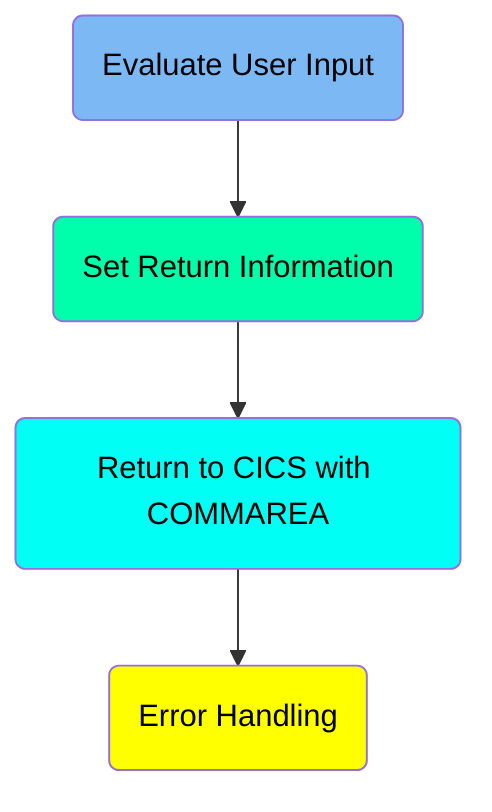
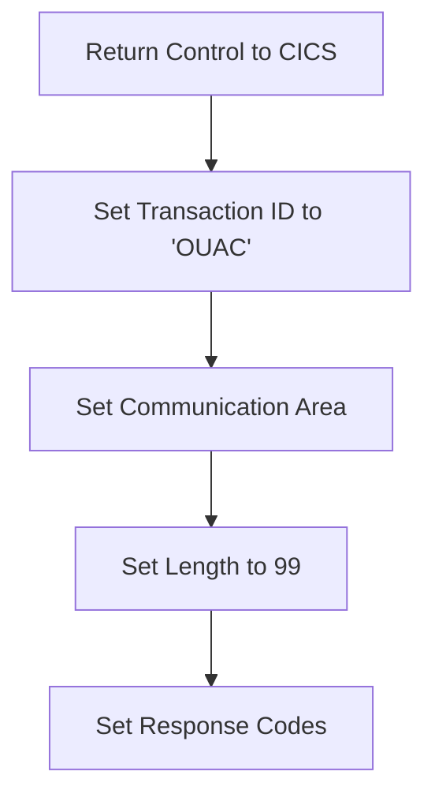

```mermaid
graph TD
  A[Check if EIBCALEN is not zero] --> B[Move COMM-EYE to WS-COMM-EYE]
  B --> C[Move COMM-CUSTNO to WS-COMM-CUSTNO]
  C --> D[Move COMM-SCODE to WS-COMM-SCODE]
  D --> E[Move COMM-ACCNO to WS-COMM-ACCNO]
  E --> F[Move COMM-ACC-TYPE to WS-COMM-ACC-TYPE]
  F --> G[Move COMM-INT-RATE to WS-COMM-INT-RATE]
  G --> H[Move COMM-OPENED to WS-COMM-OPENED]
  H --> I[Move COMM-OVERDRAFT to WS-COMM-OVERDRAFT]
  I --> J[Move COMM-LAST-STMT-DT to WS-COMM-LAST-STMT-DT]
  J --> K[Move COMM-NEXT-STMT-DT to WS-COMM-NEXT-STMT-DT]
  K --> L[Move COMM-AVAIL-BAL to WS-COMM-AVAIL-BAL]
  L --> M[Move COMM-ACTUAL-BAL to WS-COMM-ACTUAL-BAL]

%% Swimm:
%% graph TD
%%   A[Check if EIBCALEN is not zero] --> B[Move <SwmToken path="src/base/cobol_src/BNK1UAC.cbl" pos="281:3:5" line-data="              MOVE COMM-EYE            TO WS-COMM-EYE">`COMM-EYE`</SwmToken> to WS-COMM-EYE]
%%   B --> C[Move <SwmToken path="src/base/cobol_src/BNK1UAC.cbl" pos="282:3:5" line-data="              MOVE COMM-CUSTNO         TO WS-COMM-CUSTNO">`COMM-CUSTNO`</SwmToken> to WS-COMM-CUSTNO]
%%   C --> D[Move <SwmToken path="src/base/cobol_src/BNK1UAC.cbl" pos="283:3:5" line-data="              MOVE COMM-SCODE          TO WS-COMM-SCODE">`COMM-SCODE`</SwmToken> to WS-COMM-SCODE]
%%   D --> E[Move <SwmToken path="src/base/cobol_src/BNK1UAC.cbl" pos="284:3:5" line-data="              MOVE COMM-ACCNO          TO WS-COMM-ACCNO">`COMM-ACCNO`</SwmToken> to WS-COMM-ACCNO]
%%   E --> F[Move <SwmToken path="src/base/cobol_src/BNK1UAC.cbl" pos="285:3:7" line-data="              MOVE COMM-ACC-TYPE       TO WS-COMM-ACC-TYPE">`COMM-ACC-TYPE`</SwmToken> to WS-COMM-ACC-TYPE]
%%   F --> G[Move <SwmToken path="src/base/cobol_src/BNK1UAC.cbl" pos="286:3:7" line-data="              MOVE COMM-INT-RATE       TO WS-COMM-INT-RATE">`COMM-INT-RATE`</SwmToken> to WS-COMM-INT-RATE]
%%   G --> H[Move <SwmToken path="src/base/cobol_src/BNK1UAC.cbl" pos="287:3:5" line-data="              MOVE COMM-OPENED         TO WS-COMM-OPENED">`COMM-OPENED`</SwmToken> to WS-COMM-OPENED]
%%   H --> I[Move <SwmToken path="src/base/cobol_src/BNK1UAC.cbl" pos="288:3:5" line-data="              MOVE COMM-OVERDRAFT      TO WS-COMM-OVERDRAFT">`COMM-OVERDRAFT`</SwmToken> to WS-COMM-OVERDRAFT]
%%   I --> J[Move <SwmToken path="src/base/cobol_src/BNK1UAC.cbl" pos="289:3:9" line-data="              MOVE COMM-LAST-STMT-DT   TO WS-COMM-LAST-STMT-DT">`COMM-LAST-STMT-DT`</SwmToken> to WS-COMM-LAST-STMT-DT]
%%   J --> K[Move <SwmToken path="src/base/cobol_src/BNK1UAC.cbl" pos="290:3:9" line-data="              MOVE COMM-NEXT-STMT-DT   TO WS-COMM-NEXT-STMT-DT">`COMM-NEXT-STMT-DT`</SwmToken> to WS-COMM-NEXT-STMT-DT]
%%   K --> L[Move <SwmToken path="src/base/cobol_src/BNK1UAC.cbl" pos="291:3:7" line-data="              MOVE COMM-AVAIL-BAL      TO WS-COMM-AVAIL-BAL">`COMM-AVAIL-BAL`</SwmToken> to WS-COMM-AVAIL-BAL]
%%   L --> M[Move <SwmToken path="src/base/cobol_src/BNK1UAC.cbl" pos="292:3:7" line-data="              MOVE COMM-ACTUAL-BAL     TO WS-COMM-ACTUAL-BAL">`COMM-ACTUAL-BAL`</SwmToken> to WS-COMM-ACTUAL-BAL]
```

The <SwmToken path="src/base/cobol_src/BNK1UAC.cbl" pos="355:4:4" line-data="              MOVE &#39;BNK1UAC - A010 - RETURN TRANSID(OUAC) FAIL&#39; TO">`BNK1UAC`</SwmToken> program is responsible for evaluating user input and handling various key presses in a banking application. It ensures that user interactions are processed correctly by checking the input and performing the appropriate actions based on the key pressed. The program achieves this by using a series of conditional statements to determine the action to take for each key press, such as sending a map, returning to the main menu, or processing the map content.

The <SwmToken path="src/base/cobol_src/BNK1UAC.cbl" pos="355:4:4" line-data="              MOVE &#39;BNK1UAC - A010 - RETURN TRANSID(OUAC) FAIL&#39; TO">`BNK1UAC`</SwmToken> program evaluates user input and handles key presses in a banking application. It checks which key is pressed and performs actions like sending a map, returning to the main menu, or processing the map content. This ensures that user interactions are processed correctly.

Here is a high level diagram of the program:



# Evaluate User Input

```mermaid
graph TD
  A[Start] --> B{Is it the first time through?}
  B -- Yes --> C[Send map with erased data fields]
  B -- No --> D{Which key is pressed?}
  D -- PA Key --> E[Continue]
  D -- PF3 --> F[Return to main menu]
  D -- AID or PF12 --> G[Send termination message]
  D -- CLEAR --> H[Clear screen]
  D -- ENTER or PF5 --> I[Process map]
  D -- Other --> J[Send invalid key message]

%% Swimm:
%% graph TD
%%   A[Start] --> B{Is it the first time through?}
%%   B -- Yes --> C[Send map with erased data fields]
%%   B -- No --> D{Which key is pressed?}
%%   D -- PA Key --> E[Continue]
%%   D -- PF3 --> F[Return to main menu]
%%   D -- AID or PF12 --> G[Send termination message]
%%   D -- CLEAR --> H[Clear screen]
%%   D -- ENTER or <SwmToken path="src/base/cobol_src/BNK1UAC.cbl" pos="520:8:8" line-data="                 &#39;. Then press PF5.&#39; DELIMITED BY SIZE">`PF5`</SwmToken> --> I[Process map]
%%   D -- Other --> J[Send invalid key message]
```



<SwmSnippet path="/src/base/cobol_src/BNK1UAC.cbl" line="200">

---

## Handling First Time Through

First, the code checks if it is the first time through by evaluating if <SwmToken path="src/base/cobol_src/BNK1UAC.cbl" pos="205:3:3" line-data="              WHEN EIBCALEN = ZERO">`EIBCALEN`</SwmToken> is zero. If it is, it moves low values to <SwmToken path="src/base/cobol_src/BNK1UAC.cbl" pos="206:9:9" line-data="                 MOVE LOW-VALUE TO BNK1UAO">`BNK1UAO`</SwmToken>, sets <SwmToken path="src/base/cobol_src/BNK1UAC.cbl" pos="207:8:8" line-data="                 MOVE -1 TO ACCNOL">`ACCNOL`</SwmToken> to -1, sets <SwmToken path="src/base/cobol_src/BNK1UAC.cbl" pos="208:3:5" line-data="                 SET SEND-ERASE TO TRUE">`SEND-ERASE`</SwmToken> to true, initializes <SwmToken path="src/base/cobol_src/BNK1UAC.cbl" pos="209:3:7" line-data="                 INITIALIZE WS-COMM-AREA">`WS-COMM-AREA`</SwmToken>, and performs <SwmToken path="src/base/cobol_src/BNK1UAC.cbl" pos="210:3:5" line-data="                 PERFORM SEND-MAP">`SEND-MAP`</SwmToken> to send the map with erased data fields.

```cobol
           EVALUATE TRUE
      *
      *       Is it the first time through? If so, send the map
      *       with erased (empty) data fields.
      *
              WHEN EIBCALEN = ZERO
                 MOVE LOW-VALUE TO BNK1UAO
                 MOVE -1 TO ACCNOL
                 SET SEND-ERASE TO TRUE
                 INITIALIZE WS-COMM-AREA
                 PERFORM SEND-MAP
```

---

</SwmSnippet>

<SwmSnippet path="/src/base/cobol_src/BNK1UAC.cbl" line="213">

---

## Handling PA Key Presses

Moving to the next condition, if a PA key is pressed (<SwmToken path="src/base/cobol_src/BNK1UAC.cbl" pos="215:3:3" line-data="              WHEN EIBAID = DFHPA1 OR DFHPA2 OR DFHPA3">`EIBAID`</SwmToken> equals <SwmToken path="src/base/cobol_src/BNK1UAC.cbl" pos="215:7:7" line-data="              WHEN EIBAID = DFHPA1 OR DFHPA2 OR DFHPA3">`DFHPA1`</SwmToken>, <SwmToken path="src/base/cobol_src/BNK1UAC.cbl" pos="215:11:11" line-data="              WHEN EIBAID = DFHPA1 OR DFHPA2 OR DFHPA3">`DFHPA2`</SwmToken>, or <SwmToken path="src/base/cobol_src/BNK1UAC.cbl" pos="215:15:15" line-data="              WHEN EIBAID = DFHPA1 OR DFHPA2 OR DFHPA3">`DFHPA3`</SwmToken>), the code simply continues without any specific action.

```cobol
      *       If a PA key is pressed, just carry on
      *
              WHEN EIBAID = DFHPA1 OR DFHPA2 OR DFHPA3
                 CONTINUE
```

---

</SwmSnippet>

<SwmSnippet path="/src/base/cobol_src/BNK1UAC.cbl" line="218">

---

## Handling PF3 Key Press

Next, if the PF3 key is pressed (<SwmToken path="src/base/cobol_src/BNK1UAC.cbl" pos="221:3:3" line-data="              WHEN EIBAID = DFHPF3">`EIBAID`</SwmToken> equals <SwmToken path="src/base/cobol_src/BNK1UAC.cbl" pos="221:7:7" line-data="              WHEN EIBAID = DFHPF3">`DFHPF3`</SwmToken>), the code returns to the main menu by executing a CICS RETURN command with the transaction ID 'OMEN'.

```cobol
      *
      *       When Pf3 is pressed, return to the main menu
      *
              WHEN EIBAID = DFHPF3
                 EXEC CICS RETURN
                    TRANSID('OMEN')
                    IMMEDIATE
                    RESP(WS-CICS-RESP)
                    RESP2(WS-CICS-RESP2)
                 END-EXEC
```

---

</SwmSnippet>

<SwmSnippet path="/src/base/cobol_src/BNK1UAC.cbl" line="230">

---

## Handling AID or PF12 Key Presses

Then, if the AID or PF12 key is pressed (<SwmToken path="src/base/cobol_src/BNK1UAC.cbl" pos="233:3:3" line-data="              WHEN EIBAID = DFHAID OR DFHPF12">`EIBAID`</SwmToken> equals <SwmToken path="src/base/cobol_src/BNK1UAC.cbl" pos="233:7:7" line-data="              WHEN EIBAID = DFHAID OR DFHPF12">`DFHAID`</SwmToken> or <SwmToken path="src/base/cobol_src/BNK1UAC.cbl" pos="233:11:11" line-data="              WHEN EIBAID = DFHAID OR DFHPF12">`DFHPF12`</SwmToken>), the code performs <SwmToken path="src/base/cobol_src/BNK1UAC.cbl" pos="234:3:7" line-data="                 PERFORM SEND-TERMINATION-MSG">`SEND-TERMINATION-MSG`</SwmToken> and executes a CICS RETURN command.

```cobol
      *       If the aid or Pf12 is pressed, then send a termination
      *       message.
      *
              WHEN EIBAID = DFHAID OR DFHPF12
                 PERFORM SEND-TERMINATION-MSG
                 EXEC CICS
                    RETURN
                 END-EXEC
```

---

</SwmSnippet>

<SwmSnippet path="/src/base/cobol_src/BNK1UAC.cbl" line="240">

---

## Handling CLEAR Key Press

When the CLEAR key is pressed (<SwmToken path="src/base/cobol_src/BNK1UAC.cbl" pos="242:3:3" line-data="              WHEN EIBAID = DFHCLEAR">`EIBAID`</SwmToken> equals <SwmToken path="src/base/cobol_src/BNK1UAC.cbl" pos="242:7:7" line-data="              WHEN EIBAID = DFHCLEAR">`DFHCLEAR`</SwmToken>), the code sends a control command to erase the screen and free the keyboard, then returns.

```cobol
      *       When CLEAR is pressed
      *
              WHEN EIBAID = DFHCLEAR
                EXEC CICS SEND CONTROL
                   ERASE
                   FREEKB
                END-EXEC

                EXEC CICS RETURN
                END-EXEC
```

---

</SwmSnippet>

<SwmSnippet path="/src/base/cobol_src/BNK1UAC.cbl" line="252">

---

## Handling ENTER or <SwmToken path="src/base/cobol_src/BNK1UAC.cbl" pos="520:8:8" line-data="                 &#39;. Then press PF5.&#39; DELIMITED BY SIZE">`PF5`</SwmToken> Key Presses

When the ENTER or <SwmToken path="src/base/cobol_src/BNK1UAC.cbl" pos="520:8:8" line-data="                 &#39;. Then press PF5.&#39; DELIMITED BY SIZE">`PF5`</SwmToken> key is pressed (<SwmToken path="src/base/cobol_src/BNK1UAC.cbl" pos="254:3:3" line-data="              WHEN EIBAID = DFHENTER">`EIBAID`</SwmToken> equals <SwmToken path="src/base/cobol_src/BNK1UAC.cbl" pos="254:7:7" line-data="              WHEN EIBAID = DFHENTER">`DFHENTER`</SwmToken> or <SwmToken path="src/base/cobol_src/BNK1UAC.cbl" pos="260:7:7" line-data="              WHEN EIBAID = DFHPF5">`DFHPF5`</SwmToken>), the code performs <SwmToken path="src/base/cobol_src/BNK1UAC.cbl" pos="255:3:5" line-data="                 PERFORM PROCESS-MAP">`PROCESS-MAP`</SwmToken> to process the content.

```cobol
      *       When enter is pressed then process the content
      *
              WHEN EIBAID = DFHENTER
                 PERFORM PROCESS-MAP

      *
      *       When Pf5 is pressed then process the content
      *
              WHEN EIBAID = DFHPF5
                 PERFORM PROCESS-MAP

```

---

</SwmSnippet>

<SwmSnippet path="/src/base/cobol_src/BNK1UAC.cbl" line="264">

---

## Handling Other Key Presses

Finally, for any other key presses, the code moves low values to <SwmToken path="src/base/cobol_src/BNK1UAC.cbl" pos="267:9:9" line-data="                 MOVE LOW-VALUES TO BNK1UAO">`BNK1UAO`</SwmToken>, sets the message to 'Invalid key pressed.', sets <SwmToken path="src/base/cobol_src/BNK1UAC.cbl" pos="269:8:8" line-data="                 MOVE -1 TO ACCNOL">`ACCNOL`</SwmToken> to -1, sets <SwmToken path="src/base/cobol_src/BNK1UAC.cbl" pos="270:3:7" line-data="                 SET SEND-DATAONLY-ALARM TO TRUE">`SEND-DATAONLY-ALARM`</SwmToken> to true, and performs <SwmToken path="src/base/cobol_src/BNK1UAC.cbl" pos="271:3:5" line-data="                 PERFORM SEND-MAP">`SEND-MAP`</SwmToken> to send the invalid key message.

```cobol
      *       When anything else happens, send the invalid key message
      *
              WHEN OTHER
                 MOVE LOW-VALUES TO BNK1UAO
                 MOVE 'Invalid key pressed.' TO MESSAGEO
                 MOVE -1 TO ACCNOL
                 SET SEND-DATAONLY-ALARM TO TRUE
                 PERFORM SEND-MAP

           END-EVALUATE.
```

---

</SwmSnippet>

# Set Return Information

This is the next section of the flow.



<SwmSnippet path="/src/base/cobol_src/BNK1UAC.cbl" line="280">

---

## Checking if EIBCALEN is not zero

First, we check if <SwmToken path="src/base/cobol_src/BNK1UAC.cbl" pos="280:3:3" line-data="           IF EIBCALEN NOT = ZERO">`EIBCALEN`</SwmToken> (which indicates the length of the communication area) is not zero. This condition ensures that the communication area has been initialized and contains data from a previous transaction.

```cobol
           IF EIBCALEN NOT = ZERO
```

---

</SwmSnippet>

<SwmSnippet path="/src/base/cobol_src/BNK1UAC.cbl" line="281">

---

## Moving <SwmToken path="src/base/cobol_src/BNK1UAC.cbl" pos="281:3:5" line-data="              MOVE COMM-EYE            TO WS-COMM-EYE">`COMM-EYE`</SwmToken> to <SwmToken path="src/base/cobol_src/BNK1UAC.cbl" pos="281:9:13" line-data="              MOVE COMM-EYE            TO WS-COMM-EYE">`WS-COMM-EYE`</SwmToken>

Next, we move the value of <SwmToken path="src/base/cobol_src/BNK1UAC.cbl" pos="281:3:5" line-data="              MOVE COMM-EYE            TO WS-COMM-EYE">`COMM-EYE`</SwmToken> (which holds a specific piece of customer data) to <SwmToken path="src/base/cobol_src/BNK1UAC.cbl" pos="281:9:13" line-data="              MOVE COMM-EYE            TO WS-COMM-EYE">`WS-COMM-EYE`</SwmToken> (a working storage variable). This step is part of the process of transferring data from the communication area to working storage for further processing.

```cobol
              MOVE COMM-EYE            TO WS-COMM-EYE
```

---

</SwmSnippet>

<SwmSnippet path="/src/base/cobol_src/BNK1UAC.cbl" line="282">

---

## Moving <SwmToken path="src/base/cobol_src/BNK1UAC.cbl" pos="282:3:5" line-data="              MOVE COMM-CUSTNO         TO WS-COMM-CUSTNO">`COMM-CUSTNO`</SwmToken> to <SwmToken path="src/base/cobol_src/BNK1UAC.cbl" pos="282:9:13" line-data="              MOVE COMM-CUSTNO         TO WS-COMM-CUSTNO">`WS-COMM-CUSTNO`</SwmToken>

Moving to the next step, we transfer the customer number from <SwmToken path="src/base/cobol_src/BNK1UAC.cbl" pos="282:3:5" line-data="              MOVE COMM-CUSTNO         TO WS-COMM-CUSTNO">`COMM-CUSTNO`</SwmToken> to <SwmToken path="src/base/cobol_src/BNK1UAC.cbl" pos="282:9:13" line-data="              MOVE COMM-CUSTNO         TO WS-COMM-CUSTNO">`WS-COMM-CUSTNO`</SwmToken>. This ensures that the customer number is available in working storage for any subsequent operations.

```cobol
              MOVE COMM-CUSTNO         TO WS-COMM-CUSTNO
```

---

</SwmSnippet>

<SwmSnippet path="/src/base/cobol_src/BNK1UAC.cbl" line="283">

---

## Moving <SwmToken path="src/base/cobol_src/BNK1UAC.cbl" pos="283:3:5" line-data="              MOVE COMM-SCODE          TO WS-COMM-SCODE">`COMM-SCODE`</SwmToken> to <SwmToken path="src/base/cobol_src/BNK1UAC.cbl" pos="283:9:13" line-data="              MOVE COMM-SCODE          TO WS-COMM-SCODE">`WS-COMM-SCODE`</SwmToken>

Then, we move the service code from <SwmToken path="src/base/cobol_src/BNK1UAC.cbl" pos="283:3:5" line-data="              MOVE COMM-SCODE          TO WS-COMM-SCODE">`COMM-SCODE`</SwmToken> to <SwmToken path="src/base/cobol_src/BNK1UAC.cbl" pos="283:9:13" line-data="              MOVE COMM-SCODE          TO WS-COMM-SCODE">`WS-COMM-SCODE`</SwmToken>. The service code is used to identify the type of service or transaction being processed.

```cobol
              MOVE COMM-SCODE          TO WS-COMM-SCODE
```

---

</SwmSnippet>

<SwmSnippet path="/src/base/cobol_src/BNK1UAC.cbl" line="284">

---

## Moving <SwmToken path="src/base/cobol_src/BNK1UAC.cbl" pos="284:3:5" line-data="              MOVE COMM-ACCNO          TO WS-COMM-ACCNO">`COMM-ACCNO`</SwmToken> to <SwmToken path="src/base/cobol_src/BNK1UAC.cbl" pos="284:9:13" line-data="              MOVE COMM-ACCNO          TO WS-COMM-ACCNO">`WS-COMM-ACCNO`</SwmToken>

Next, we transfer the account number from <SwmToken path="src/base/cobol_src/BNK1UAC.cbl" pos="284:3:5" line-data="              MOVE COMM-ACCNO          TO WS-COMM-ACCNO">`COMM-ACCNO`</SwmToken> to <SwmToken path="src/base/cobol_src/BNK1UAC.cbl" pos="284:9:13" line-data="              MOVE COMM-ACCNO          TO WS-COMM-ACCNO">`WS-COMM-ACCNO`</SwmToken>. This step is crucial for identifying the specific account involved in the transaction.

```cobol
              MOVE COMM-ACCNO          TO WS-COMM-ACCNO
```

---

</SwmSnippet>

<SwmSnippet path="/src/base/cobol_src/BNK1UAC.cbl" line="285">

---

## Moving <SwmToken path="src/base/cobol_src/BNK1UAC.cbl" pos="285:3:7" line-data="              MOVE COMM-ACC-TYPE       TO WS-COMM-ACC-TYPE">`COMM-ACC-TYPE`</SwmToken> to <SwmToken path="src/base/cobol_src/BNK1UAC.cbl" pos="285:11:17" line-data="              MOVE COMM-ACC-TYPE       TO WS-COMM-ACC-TYPE">`WS-COMM-ACC-TYPE`</SwmToken>

We then move the account type from <SwmToken path="src/base/cobol_src/BNK1UAC.cbl" pos="285:3:7" line-data="              MOVE COMM-ACC-TYPE       TO WS-COMM-ACC-TYPE">`COMM-ACC-TYPE`</SwmToken> to <SwmToken path="src/base/cobol_src/BNK1UAC.cbl" pos="285:11:17" line-data="              MOVE COMM-ACC-TYPE       TO WS-COMM-ACC-TYPE">`WS-COMM-ACC-TYPE`</SwmToken>. The account type indicates whether the account is a savings, checking, or another type of account.

```cobol
              MOVE COMM-ACC-TYPE       TO WS-COMM-ACC-TYPE
```

---

</SwmSnippet>

<SwmSnippet path="/src/base/cobol_src/BNK1UAC.cbl" line="286">

---

## Moving <SwmToken path="src/base/cobol_src/BNK1UAC.cbl" pos="286:3:7" line-data="              MOVE COMM-INT-RATE       TO WS-COMM-INT-RATE">`COMM-INT-RATE`</SwmToken> to <SwmToken path="src/base/cobol_src/BNK1UAC.cbl" pos="286:11:17" line-data="              MOVE COMM-INT-RATE       TO WS-COMM-INT-RATE">`WS-COMM-INT-RATE`</SwmToken>

Moving forward, we transfer the interest rate from <SwmToken path="src/base/cobol_src/BNK1UAC.cbl" pos="286:3:7" line-data="              MOVE COMM-INT-RATE       TO WS-COMM-INT-RATE">`COMM-INT-RATE`</SwmToken> to <SwmToken path="src/base/cobol_src/BNK1UAC.cbl" pos="286:11:17" line-data="              MOVE COMM-INT-RATE       TO WS-COMM-INT-RATE">`WS-COMM-INT-RATE`</SwmToken>. The interest rate is important for calculating interest on the account balance.

```cobol
              MOVE COMM-INT-RATE       TO WS-COMM-INT-RATE
```

---

</SwmSnippet>

<SwmSnippet path="/src/base/cobol_src/BNK1UAC.cbl" line="287">

---

## Moving <SwmToken path="src/base/cobol_src/BNK1UAC.cbl" pos="287:3:5" line-data="              MOVE COMM-OPENED         TO WS-COMM-OPENED">`COMM-OPENED`</SwmToken> to <SwmToken path="src/base/cobol_src/BNK1UAC.cbl" pos="287:9:13" line-data="              MOVE COMM-OPENED         TO WS-COMM-OPENED">`WS-COMM-OPENED`</SwmToken>

Next, we move the account opening date from <SwmToken path="src/base/cobol_src/BNK1UAC.cbl" pos="287:3:5" line-data="              MOVE COMM-OPENED         TO WS-COMM-OPENED">`COMM-OPENED`</SwmToken> to <SwmToken path="src/base/cobol_src/BNK1UAC.cbl" pos="287:9:13" line-data="              MOVE COMM-OPENED         TO WS-COMM-OPENED">`WS-COMM-OPENED`</SwmToken>. This date is used to track how long the account has been active.

```cobol
              MOVE COMM-OPENED         TO WS-COMM-OPENED
```

---

</SwmSnippet>

<SwmSnippet path="/src/base/cobol_src/BNK1UAC.cbl" line="288">

---

## Moving <SwmToken path="src/base/cobol_src/BNK1UAC.cbl" pos="288:3:5" line-data="              MOVE COMM-OVERDRAFT      TO WS-COMM-OVERDRAFT">`COMM-OVERDRAFT`</SwmToken> to <SwmToken path="src/base/cobol_src/BNK1UAC.cbl" pos="288:9:13" line-data="              MOVE COMM-OVERDRAFT      TO WS-COMM-OVERDRAFT">`WS-COMM-OVERDRAFT`</SwmToken>

We then transfer the overdraft limit from <SwmToken path="src/base/cobol_src/BNK1UAC.cbl" pos="288:3:5" line-data="              MOVE COMM-OVERDRAFT      TO WS-COMM-OVERDRAFT">`COMM-OVERDRAFT`</SwmToken> to <SwmToken path="src/base/cobol_src/BNK1UAC.cbl" pos="288:9:13" line-data="              MOVE COMM-OVERDRAFT      TO WS-COMM-OVERDRAFT">`WS-COMM-OVERDRAFT`</SwmToken>. The overdraft limit indicates the maximum amount the account can be overdrawn.

```cobol
              MOVE COMM-OVERDRAFT      TO WS-COMM-OVERDRAFT
```

---

</SwmSnippet>

<SwmSnippet path="/src/base/cobol_src/BNK1UAC.cbl" line="289">

---

## Moving <SwmToken path="src/base/cobol_src/BNK1UAC.cbl" pos="289:3:9" line-data="              MOVE COMM-LAST-STMT-DT   TO WS-COMM-LAST-STMT-DT">`COMM-LAST-STMT-DT`</SwmToken> to <SwmToken path="src/base/cobol_src/BNK1UAC.cbl" pos="289:13:21" line-data="              MOVE COMM-LAST-STMT-DT   TO WS-COMM-LAST-STMT-DT">`WS-COMM-LAST-STMT-DT`</SwmToken>

Next, we move the last statement date from <SwmToken path="src/base/cobol_src/BNK1UAC.cbl" pos="289:3:9" line-data="              MOVE COMM-LAST-STMT-DT   TO WS-COMM-LAST-STMT-DT">`COMM-LAST-STMT-DT`</SwmToken> to <SwmToken path="src/base/cobol_src/BNK1UAC.cbl" pos="289:13:21" line-data="              MOVE COMM-LAST-STMT-DT   TO WS-COMM-LAST-STMT-DT">`WS-COMM-LAST-STMT-DT`</SwmToken>. This date is used to determine when the last account statement was generated.

```cobol
              MOVE COMM-LAST-STMT-DT   TO WS-COMM-LAST-STMT-DT
```

---

</SwmSnippet>

<SwmSnippet path="/src/base/cobol_src/BNK1UAC.cbl" line="290">

---

## Moving <SwmToken path="src/base/cobol_src/BNK1UAC.cbl" pos="290:3:9" line-data="              MOVE COMM-NEXT-STMT-DT   TO WS-COMM-NEXT-STMT-DT">`COMM-NEXT-STMT-DT`</SwmToken> to <SwmToken path="src/base/cobol_src/BNK1UAC.cbl" pos="290:13:21" line-data="              MOVE COMM-NEXT-STMT-DT   TO WS-COMM-NEXT-STMT-DT">`WS-COMM-NEXT-STMT-DT`</SwmToken>

We then transfer the next statement date from <SwmToken path="src/base/cobol_src/BNK1UAC.cbl" pos="290:3:9" line-data="              MOVE COMM-NEXT-STMT-DT   TO WS-COMM-NEXT-STMT-DT">`COMM-NEXT-STMT-DT`</SwmToken> to <SwmToken path="src/base/cobol_src/BNK1UAC.cbl" pos="290:13:21" line-data="              MOVE COMM-NEXT-STMT-DT   TO WS-COMM-NEXT-STMT-DT">`WS-COMM-NEXT-STMT-DT`</SwmToken>. This date indicates when the next account statement will be generated.

```cobol
              MOVE COMM-NEXT-STMT-DT   TO WS-COMM-NEXT-STMT-DT
```

---

</SwmSnippet>

<SwmSnippet path="/src/base/cobol_src/BNK1UAC.cbl" line="291">

---

## Moving <SwmToken path="src/base/cobol_src/BNK1UAC.cbl" pos="291:3:7" line-data="              MOVE COMM-AVAIL-BAL      TO WS-COMM-AVAIL-BAL">`COMM-AVAIL-BAL`</SwmToken> to <SwmToken path="src/base/cobol_src/BNK1UAC.cbl" pos="291:11:17" line-data="              MOVE COMM-AVAIL-BAL      TO WS-COMM-AVAIL-BAL">`WS-COMM-AVAIL-BAL`</SwmToken>

Next, we move the available balance from <SwmToken path="src/base/cobol_src/BNK1UAC.cbl" pos="291:3:7" line-data="              MOVE COMM-AVAIL-BAL      TO WS-COMM-AVAIL-BAL">`COMM-AVAIL-BAL`</SwmToken> to <SwmToken path="src/base/cobol_src/BNK1UAC.cbl" pos="291:11:17" line-data="              MOVE COMM-AVAIL-BAL      TO WS-COMM-AVAIL-BAL">`WS-COMM-AVAIL-BAL`</SwmToken>. The available balance is the amount of money that is currently available for withdrawal.

```cobol
              MOVE COMM-AVAIL-BAL      TO WS-COMM-AVAIL-BAL
```

---

</SwmSnippet>

<SwmSnippet path="/src/base/cobol_src/BNK1UAC.cbl" line="292">

---

## Moving <SwmToken path="src/base/cobol_src/BNK1UAC.cbl" pos="292:3:7" line-data="              MOVE COMM-ACTUAL-BAL     TO WS-COMM-ACTUAL-BAL">`COMM-ACTUAL-BAL`</SwmToken> to <SwmToken path="src/base/cobol_src/BNK1UAC.cbl" pos="292:11:17" line-data="              MOVE COMM-ACTUAL-BAL     TO WS-COMM-ACTUAL-BAL">`WS-COMM-ACTUAL-BAL`</SwmToken>

Finally, we transfer the actual balance from <SwmToken path="src/base/cobol_src/BNK1UAC.cbl" pos="292:3:7" line-data="              MOVE COMM-ACTUAL-BAL     TO WS-COMM-ACTUAL-BAL">`COMM-ACTUAL-BAL`</SwmToken> to <SwmToken path="src/base/cobol_src/BNK1UAC.cbl" pos="292:11:17" line-data="              MOVE COMM-ACTUAL-BAL     TO WS-COMM-ACTUAL-BAL">`WS-COMM-ACTUAL-BAL`</SwmToken>. The actual balance is the total amount of money in the account, including any pending transactions.

```cobol
              MOVE COMM-ACTUAL-BAL     TO WS-COMM-ACTUAL-BAL
```

---

</SwmSnippet>

# Return to CICS with COMMAREA

This is the next section of the flow.



<SwmSnippet path="/src/base/cobol_src/BNK1UAC.cbl" line="295">

---

## Returning Control to CICS

First, the <SwmToken path="src/base/cobol_src/BNK1UAC.cbl" pos="222:1:5" line-data="                 EXEC CICS RETURN">`EXEC CICS RETURN`</SwmToken> command is used to return control to the CICS system. This is essential for ending the current transaction and allowing CICS to manage the next steps in the workflow.

```cobol
           EXEC CICS
              RETURN TRANSID('OUAC')
              COMMAREA(WS-COMM-AREA)
              LENGTH(99)
              RESP(WS-CICS-RESP)
              RESP2(WS-CICS-RESP2)
           END-EXEC.

```

---

</SwmSnippet>

<SwmSnippet path="/src/base/cobol_src/BNK1UAC.cbl" line="296">

---

### Setting Transaction ID

Next, the transaction ID is set to 'OUAC'. This ID is used by CICS to determine the next transaction to be executed.

```cobol
              RETURN TRANSID('OUAC')
```

---

</SwmSnippet>

<SwmSnippet path="/src/base/cobol_src/BNK1UAC.cbl" line="297">

---

### Setting Communication Area

Then, the communication area (<SwmToken path="src/base/cobol_src/BNK1UAC.cbl" pos="297:1:1" line-data="              COMMAREA(WS-COMM-AREA)">`COMMAREA`</SwmToken>) is set to <SwmToken path="src/base/cobol_src/BNK1UAC.cbl" pos="297:3:7" line-data="              COMMAREA(WS-COMM-AREA)">`WS-COMM-AREA`</SwmToken>. This area is used to pass data between transactions.

```cobol
              COMMAREA(WS-COMM-AREA)
```

---

</SwmSnippet>

<SwmSnippet path="/src/base/cobol_src/BNK1UAC.cbl" line="298">

---

### Setting Length

The length of the communication area is set to 99. This specifies the size of the data being passed.

```cobol
              LENGTH(99)
```

---

</SwmSnippet>

<SwmSnippet path="/src/base/cobol_src/BNK1UAC.cbl" line="299">

---

### Setting Response Codes

Finally, the response codes (<SwmToken path="src/base/cobol_src/BNK1UAC.cbl" pos="299:1:1" line-data="              RESP(WS-CICS-RESP)">`RESP`</SwmToken> and <SwmToken path="src/base/cobol_src/BNK1UAC.cbl" pos="300:1:1" line-data="              RESP2(WS-CICS-RESP2)">`RESP2`</SwmToken>) are set to <SwmToken path="src/base/cobol_src/BNK1UAC.cbl" pos="299:3:7" line-data="              RESP(WS-CICS-RESP)">`WS-CICS-RESP`</SwmToken> and <SwmToken path="src/base/cobol_src/BNK1UAC.cbl" pos="300:3:7" line-data="              RESP2(WS-CICS-RESP2)">`WS-CICS-RESP2`</SwmToken> respectively. These codes are used to capture the status of the `RETURN` command execution.

```cobol
              RESP(WS-CICS-RESP)
              RESP2(WS-CICS-RESP2)
```

---

</SwmSnippet>

## Interim Summary

So far, we saw how the program evaluates user input and handles various key presses such as PA, PF3, AID, PF12, CLEAR, ENTER, and <SwmToken path="src/base/cobol_src/BNK1UAC.cbl" pos="520:8:8" line-data="                 &#39;. Then press PF5.&#39; DELIMITED BY SIZE">`PF5`</SwmToken>. We also covered how the program processes invalid key presses. Now, we will focus on setting return information and returning control to CICS with the communication area.

# Error Handling

```mermaid
graph TD
  A[Check CICS Response] -->|Not Normal| B[Initialize ABNDINFO-REC]
  B --> C[Move EIBRESP to ABND-RESPCODE]
  C --> D[Move EIBRESP2 to ABND-RESP2CODE]
  D --> E[Assign APPLID to ABND-APPLID]
  E --> F[Move EIBTASKN to ABND-TASKNO-KEY]
  F --> G[Move EIBTRNID to ABND-TRANID]
  G --> H[Perform POPULATE-TIME-DATE]
  H --> I[Move WS-ORIG-DATE to ABND-DATE]
  I --> J[Format Time into ABND-TIME]
  J --> K[Move WS-U-TIME to ABND-UTIME-KEY]
  K --> L[Move 'HBNK' to ABND-CODE]
  L --> M[Assign PROGRAM to ABND-PROGRAM]
  M --> N[Move ZEROS to ABND-SQLCODE]
  N --> O[Format Error Message into ABND-FREEFORM]
  O --> P[Link to WS-ABEND-PGM]
  P --> Q[Initialize WS-FAIL-INFO]
  Q --> R[Move Error Message to WS-CICS-FAIL-MSG]
  R --> S[Move Response Codes to Display Fields]
  S --> T[Perform ABEND-THIS-TASK]

%% Swimm:
%% graph TD
%%   A[Check CICS Response] -->|Not Normal| B[Initialize ABNDINFO-REC]
%%   B --> C[Move EIBRESP to ABND-RESPCODE]
%%   C --> D[Move <SwmToken path="src/base/cobol_src/BNK1UAC.cbl" pos="312:3:3" line-data="              MOVE EIBRESP2   TO ABND-RESP2CODE">`EIBRESP2`</SwmToken> to ABND-RESP2CODE]
%%   D --> E[Assign APPLID to ABND-APPLID]
%%   E --> F[Move EIBTASKN to ABND-TASKNO-KEY]
%%   F --> G[Move EIBTRNID to ABND-TRANID]
%%   G --> H[Perform POPULATE-TIME-DATE]
%%   H --> I[Move <SwmToken path="src/base/cobol_src/BNK1UAC.cbl" pos="324:3:7" line-data="              MOVE WS-ORIG-DATE TO ABND-DATE">`WS-ORIG-DATE`</SwmToken> to ABND-DATE]
%%   I --> J[Format Time into ABND-TIME]
%%   J --> K[Move <SwmToken path="src/base/cobol_src/BNK1UAC.cbl" pos="333:3:7" line-data="              MOVE WS-U-TIME   TO ABND-UTIME-KEY">`WS-U-TIME`</SwmToken> to ABND-UTIME-KEY]
%%   K --> L[Move 'HBNK' to ABND-CODE]
%%   L --> M[Assign PROGRAM to ABND-PROGRAM]
%%   M --> N[Move ZEROS to ABND-SQLCODE]
%%   N --> O[Format Error Message into ABND-FREEFORM]
%%   O --> P[Link to WS-ABEND-PGM]
%%   P --> Q[Initialize WS-FAIL-INFO]
%%   Q --> R[Move Error Message to WS-CICS-FAIL-MSG]
%%   R --> S[Move Response Codes to Display Fields]
%%   S --> T[Perform ABEND-THIS-TASK]
```



<SwmSnippet path="/src/base/cobol_src/BNK1UAC.cbl" line="303">

---

## Check CICS Response

First, we check if the CICS response code <SwmToken path="src/base/cobol_src/BNK1UAC.cbl" pos="303:3:7" line-data="           IF WS-CICS-RESP NOT = DFHRESP(NORMAL)">`WS-CICS-RESP`</SwmToken> is not equal to <SwmToken path="src/base/cobol_src/BNK1UAC.cbl" pos="303:13:16" line-data="           IF WS-CICS-RESP NOT = DFHRESP(NORMAL)">`DFHRESP(NORMAL)`</SwmToken>. This indicates an abnormal response that requires error handling.

```cobol
           IF WS-CICS-RESP NOT = DFHRESP(NORMAL)
```

---

</SwmSnippet>

<SwmSnippet path="/src/base/cobol_src/BNK1UAC.cbl" line="310">

---

## Initialize <SwmToken path="src/base/cobol_src/BNK1UAC.cbl" pos="310:3:5" line-data="              INITIALIZE ABNDINFO-REC">`ABNDINFO-REC`</SwmToken>

Moving to the next step, we initialize the <SwmToken path="src/base/cobol_src/BNK1UAC.cbl" pos="310:3:5" line-data="              INITIALIZE ABNDINFO-REC">`ABNDINFO-REC`</SwmToken> record and move the response codes <SwmToken path="src/base/cobol_src/BNK1UAC.cbl" pos="311:3:3" line-data="              MOVE EIBRESP    TO ABND-RESPCODE">`EIBRESP`</SwmToken> and <SwmToken path="src/base/cobol_src/BNK1UAC.cbl" pos="312:3:3" line-data="              MOVE EIBRESP2   TO ABND-RESP2CODE">`EIBRESP2`</SwmToken> to <SwmToken path="src/base/cobol_src/BNK1UAC.cbl" pos="311:7:9" line-data="              MOVE EIBRESP    TO ABND-RESPCODE">`ABND-RESPCODE`</SwmToken> and <SwmToken path="src/base/cobol_src/BNK1UAC.cbl" pos="312:7:9" line-data="              MOVE EIBRESP2   TO ABND-RESP2CODE">`ABND-RESP2CODE`</SwmToken> respectively. This preserves the original response codes for logging.

```cobol
              INITIALIZE ABNDINFO-REC
              MOVE EIBRESP    TO ABND-RESPCODE
              MOVE EIBRESP2   TO ABND-RESP2CODE
```

---

</SwmSnippet>

<SwmSnippet path="/src/base/cobol_src/BNK1UAC.cbl" line="316">

---

## Assign APPLID and Task Information

Then, we assign the application ID to <SwmToken path="src/base/cobol_src/BNK1UAC.cbl" pos="316:9:11" line-data="              EXEC CICS ASSIGN APPLID(ABND-APPLID)">`ABND-APPLID`</SwmToken> and move the task number <SwmToken path="src/base/cobol_src/BNK1UAC.cbl" pos="319:3:3" line-data="              MOVE EIBTASKN   TO ABND-TASKNO-KEY">`EIBTASKN`</SwmToken> and transaction ID <SwmToken path="src/base/cobol_src/BNK1UAC.cbl" pos="320:3:3" line-data="              MOVE EIBTRNID   TO ABND-TRANID">`EIBTRNID`</SwmToken> to <SwmToken path="src/base/cobol_src/BNK1UAC.cbl" pos="319:7:11" line-data="              MOVE EIBTASKN   TO ABND-TASKNO-KEY">`ABND-TASKNO-KEY`</SwmToken> and <SwmToken path="src/base/cobol_src/BNK1UAC.cbl" pos="320:7:9" line-data="              MOVE EIBTRNID   TO ABND-TRANID">`ABND-TRANID`</SwmToken> respectively. This gathers additional context for the error.

```cobol
              EXEC CICS ASSIGN APPLID(ABND-APPLID)
              END-EXEC

              MOVE EIBTASKN   TO ABND-TASKNO-KEY
              MOVE EIBTRNID   TO ABND-TRANID
```

---

</SwmSnippet>

<SwmSnippet path="/src/base/cobol_src/BNK1UAC.cbl" line="322">

---

## Perform <SwmToken path="src/base/cobol_src/BNK1UAC.cbl" pos="322:3:7" line-data="              PERFORM POPULATE-TIME-DATE">`POPULATE-TIME-DATE`</SwmToken>

Next, we perform the <SwmToken path="src/base/cobol_src/BNK1UAC.cbl" pos="322:3:7" line-data="              PERFORM POPULATE-TIME-DATE">`POPULATE-TIME-DATE`</SwmToken> section to get the current date and time.

```cobol
              PERFORM POPULATE-TIME-DATE
```

---

</SwmSnippet>

<SwmSnippet path="/src/base/cobol_src/BNK1UAC.cbl" line="1390">

---

### <SwmToken path="src/base/cobol_src/BNK1UAC.cbl" pos="1390:1:5" line-data="       POPULATE-TIME-DATE SECTION.">`POPULATE-TIME-DATE`</SwmToken>

The <SwmToken path="src/base/cobol_src/BNK1UAC.cbl" pos="1390:1:5" line-data="       POPULATE-TIME-DATE SECTION.">`POPULATE-TIME-DATE`</SwmToken> section uses CICS commands to get the current time and format it into <SwmToken path="src/base/cobol_src/BNK1UAC.cbl" pos="1399:3:7" line-data="                     DDMMYYYY(WS-ORIG-DATE)">`WS-ORIG-DATE`</SwmToken> and <SwmToken path="src/base/cobol_src/BNK1UAC.cbl" pos="1400:3:7" line-data="                     TIME(WS-TIME-NOW)">`WS-TIME-NOW`</SwmToken>. This information is used for timestamping the error.

```cobol
       POPULATE-TIME-DATE SECTION.
       PTD010.

           EXEC CICS ASKTIME
              ABSTIME(WS-U-TIME)
           END-EXEC.

           EXEC CICS FORMATTIME
                     ABSTIME(WS-U-TIME)
                     DDMMYYYY(WS-ORIG-DATE)
                     TIME(WS-TIME-NOW)
                     DATESEP
           END-EXEC.

       PTD999.
           EXIT.
```

---

</SwmSnippet>

<SwmSnippet path="/src/base/cobol_src/BNK1UAC.cbl" line="324">

---

## Format Date and Time

Then, we move the original date <SwmToken path="src/base/cobol_src/BNK1UAC.cbl" pos="324:3:7" line-data="              MOVE WS-ORIG-DATE TO ABND-DATE">`WS-ORIG-DATE`</SwmToken> to <SwmToken path="src/base/cobol_src/BNK1UAC.cbl" pos="324:11:13" line-data="              MOVE WS-ORIG-DATE TO ABND-DATE">`ABND-DATE`</SwmToken> and format the current time into <SwmToken path="src/base/cobol_src/BNK1UAC.cbl" pos="330:3:5" line-data="                     INTO ABND-TIME">`ABND-TIME`</SwmToken>. This provides a timestamp for the error log.

```cobol
              MOVE WS-ORIG-DATE TO ABND-DATE
              STRING WS-TIME-NOW-GRP-HH DELIMITED BY SIZE,
                    ':' DELIMITED BY SIZE,
                     WS-TIME-NOW-GRP-MM DELIMITED BY SIZE,
                     ':' DELIMITED BY SIZE,
                     WS-TIME-NOW-GRP-MM DELIMITED BY SIZE
                     INTO ABND-TIME
              END-STRING
```

---

</SwmSnippet>

<SwmSnippet path="/src/base/cobol_src/BNK1UAC.cbl" line="333">

---

## Assign Additional Information

We then move the universal time <SwmToken path="src/base/cobol_src/BNK1UAC.cbl" pos="333:3:7" line-data="              MOVE WS-U-TIME   TO ABND-UTIME-KEY">`WS-U-TIME`</SwmToken> to <SwmToken path="src/base/cobol_src/BNK1UAC.cbl" pos="333:11:15" line-data="              MOVE WS-U-TIME   TO ABND-UTIME-KEY">`ABND-UTIME-KEY`</SwmToken> and assign the code 'HBNK' to <SwmToken path="src/base/cobol_src/BNK1UAC.cbl" pos="334:9:11" line-data="              MOVE &#39;HBNK&#39;      TO ABND-CODE">`ABND-CODE`</SwmToken>. We also assign the current program name to <SwmToken path="src/base/cobol_src/BNK1UAC.cbl" pos="336:9:11" line-data="              EXEC CICS ASSIGN PROGRAM(ABND-PROGRAM)">`ABND-PROGRAM`</SwmToken>. This adds more context to the error log.

```cobol
              MOVE WS-U-TIME   TO ABND-UTIME-KEY
              MOVE 'HBNK'      TO ABND-CODE

              EXEC CICS ASSIGN PROGRAM(ABND-PROGRAM)
              END-EXEC
```

---

</SwmSnippet>

<SwmSnippet path="/src/base/cobol_src/BNK1UAC.cbl" line="339">

---

## Format Error Message

Next, we move zeros to <SwmToken path="src/base/cobol_src/BNK1UAC.cbl" pos="339:7:9" line-data="              MOVE ZEROS      TO ABND-SQLCODE">`ABND-SQLCODE`</SwmToken> and format a detailed error message into <SwmToken path="src/base/cobol_src/BNK1UAC.cbl" pos="347:3:5" line-data="                    INTO ABND-FREEFORM">`ABND-FREEFORM`</SwmToken>. This message includes the response codes and a description of the error.

```cobol
              MOVE ZEROS      TO ABND-SQLCODE

              STRING 'A010 - RETURN TRANSID(OUAC) FAIL.'
                    DELIMITED BY SIZE,
                    ' EIBRESP=' DELIMITED BY SIZE,
                    ABND-RESPCODE DELIMITED BY SIZE,
                    ' RESP2=' DELIMITED BY SIZE,
                    ABND-RESP2CODE DELIMITED BY SIZE
                    INTO ABND-FREEFORM
```

---

</SwmSnippet>

<SwmSnippet path="/src/base/cobol_src/BNK1UAC.cbl" line="350">

---

## Link to Abend Handler

We then link to the abend handler program <SwmToken path="src/base/cobol_src/BNK1UAC.cbl" pos="350:9:13" line-data="              EXEC CICS LINK PROGRAM(WS-ABEND-PGM)">`WS-ABEND-PGM`</SwmToken> with the <SwmToken path="src/base/cobol_src/BNK1UAC.cbl" pos="351:3:5" line-data="                        COMMAREA(ABNDINFO-REC)">`ABNDINFO-REC`</SwmToken> as the communication area. This triggers the abend handling process.

```cobol
              EXEC CICS LINK PROGRAM(WS-ABEND-PGM)
                        COMMAREA(ABNDINFO-REC)
              END-EXEC
```

---

</SwmSnippet>

<SwmSnippet path="/src/base/cobol_src/BNK1UAC.cbl" line="354">

---

## Initialize Failure Information

Finally, we initialize the <SwmToken path="src/base/cobol_src/BNK1UAC.cbl" pos="354:3:7" line-data="              INITIALIZE WS-FAIL-INFO">`WS-FAIL-INFO`</SwmToken> record and move the error message and response codes to display fields. We then perform the <SwmToken path="src/base/cobol_src/BNK1UAC.cbl" pos="359:3:7" line-data="              PERFORM ABEND-THIS-TASK">`ABEND-THIS-TASK`</SwmToken> section to abend the current task.

```cobol
              INITIALIZE WS-FAIL-INFO
              MOVE 'BNK1UAC - A010 - RETURN TRANSID(OUAC) FAIL' TO
                 WS-CICS-FAIL-MSG
              MOVE WS-CICS-RESP  TO WS-CICS-RESP-DISP
              MOVE WS-CICS-RESP2 TO WS-CICS-RESP2-DISP
              PERFORM ABEND-THIS-TASK
```

---

</SwmSnippet>

&nbsp;

*This is an auto-generated document by Swimm 🌊 and has not yet been verified by a human*

<SwmMeta version="3.0.0" repo-id="Z2l0aHViJTNBJTNBY2ljcy1iYW5raW5nLXNhbXBsZS1hcHBsaWNhdGlvbi1jYnNhLUlCTS1EZW1vJTNBJTNBU3dpbW0tRGVtbw==" repo-name="cics-banking-sample-application-cbsa-IBM-Demo"><sup>Powered by [Swimm](/)</sup></SwmMeta>
