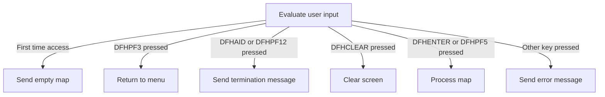
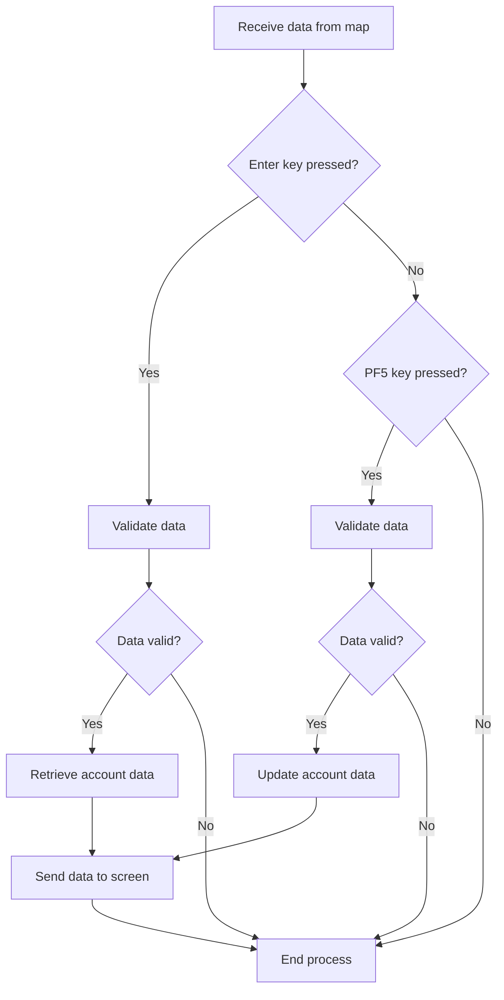
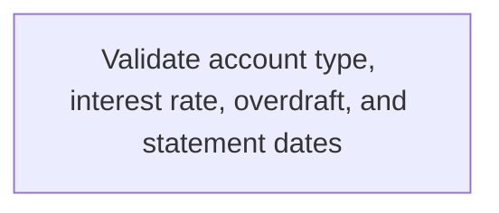
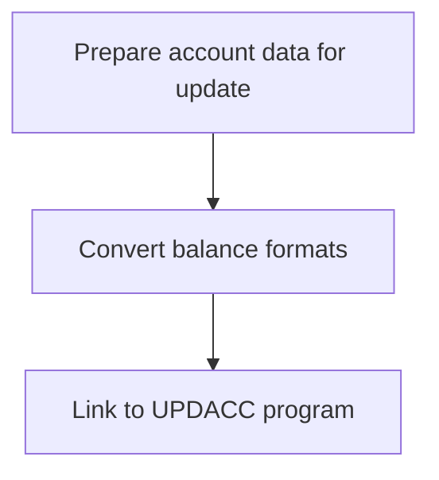

The Update Account program (<SwmToken path="src/base/cobol_src/BNK1UAC.cbl" pos="16:6:6" line-data="       PROGRAM-ID. BNK1UAC.">`BNK1UAC`</SwmToken>) in the BANKING application BMS suite is responsible for managing initial user actions within the application. This process ensures that user inputs are correctly evaluated and appropriate actions are taken based on the input received. The program handles various user interactions, such as first-time access, key presses, and data processing, to maintain a seamless user experience. The flow involves evaluating user input, determining the appropriate response based on specific key presses, and processing or terminating the session as needed. The main steps include:

- Evaluating user input to determine the action required.
- Sending an empty map for first-time access.
- Returning to the menu if the <SwmToken path="src/base/cobol_src/BNK1UAC.cbl" pos="221:7:7" line-data="              WHEN EIBAID = DFHPF3">`DFHPF3`</SwmToken> key is pressed.
- Sending a termination message for DFHAID or <SwmToken path="src/base/cobol_src/BNK1UAC.cbl" pos="233:11:11" line-data="              WHEN EIBAID = DFHAID OR DFHPF12">`DFHPF12`</SwmToken> key presses.
- Clearing the screen if the DFHCLEAR key is pressed.
- Processing the map for DFHENTER or <SwmToken path="src/base/cobol_src/BNK1UAC.cbl" pos="260:7:7" line-data="              WHEN EIBAID = DFHPF5">`DFHPF5`</SwmToken> key presses.
- Sending an error message for any other key presses.

For instance, if a user presses the DFHENTER key, the program will proceed to validate and process the data entered by the user, ensuring that the input is correct before retrieving or updating account information.

# Handling Initial User Actions



<SwmSnippet path="/src/base/cobol_src/BNK1UAC.cbl" line="198">

---

Here, we check if it's the first time through and prepare the user interface by sending an empty map to initialize it for user input.

```cobol
       A010.

           EVALUATE TRUE
      *
      *       Is it the first time through? If so, send the map
      *       with erased (empty) data fields.
      *
              WHEN EIBCALEN = ZERO
                 MOVE LOW-VALUE TO BNK1UAO
                 MOVE -1 TO ACCNOL
                 SET SEND-ERASE TO TRUE
                 INITIALIZE WS-COMM-AREA
                 PERFORM SEND-MAP
```

---

</SwmSnippet>

<SwmSnippet path="/src/base/cobol_src/BNK1UAC.cbl" line="215">

---

Next, we handle specific user actions by checking the EIBAID value to determine if further action is needed based on user input, and continue if it matches certain keys.

```cobol
              WHEN EIBAID = DFHPA1 OR DFHPA2 OR DFHPA3
                 CONTINUE
```

---

</SwmSnippet>

<SwmSnippet path="/src/base/cobol_src/BNK1UAC.cbl" line="221">

---

Next, we handle the PF3 key press by executing a CICS RETURN to exit the current transaction and transition to a different one based on user input.

```cobol
              WHEN EIBAID = DFHPF3
                 EXEC CICS RETURN
                    TRANSID('OMEN')
                    IMMEDIATE
                    RESP(WS-CICS-RESP)
                    RESP2(WS-CICS-RESP2)
                 END-EXEC
```

---

</SwmSnippet>

<SwmSnippet path="/src/base/cobol_src/BNK1UAC.cbl" line="233">

---

Next, we handle the AID or PF12 key press by performing a <SwmToken path="src/base/cobol_src/BNK1UAC.cbl" pos="234:3:7" line-data="                 PERFORM SEND-TERMINATION-MSG">`SEND-TERMINATION-MSG`</SwmToken> to gracefully terminate the session and then executing a CICS RETURN to return control to CICS.

```cobol
              WHEN EIBAID = DFHAID OR DFHPF12
                 PERFORM SEND-TERMINATION-MSG
                 EXEC CICS
                    RETURN
                 END-EXEC
```

---

</SwmSnippet>

<SwmSnippet path="/src/base/cobol_src/BNK1UAC.cbl" line="242">

---

Next, we handle the CLEAR key press by erasing the screen and freeing the keyboard to reset the user interface, followed by executing a CICS RETURN to return control to CICS.

```cobol
              WHEN EIBAID = DFHCLEAR
                EXEC CICS SEND CONTROL
                   ERASE
                   FREEKB
                END-EXEC

                EXEC CICS RETURN
                END-EXEC
```

---

</SwmSnippet>

<SwmSnippet path="/src/base/cobol_src/BNK1UAC.cbl" line="254">

---

Next, we handle the ENTER key press by performing <SwmToken path="src/base/cobol_src/BNK1UAC.cbl" pos="255:3:5" line-data="                 PERFORM PROCESS-MAP">`PROCESS-MAP`</SwmToken> to validate and process the data entered by the user.

```cobol
              WHEN EIBAID = DFHENTER
                 PERFORM PROCESS-MAP
```

---

</SwmSnippet>

<SwmSnippet path="/src/base/cobol_src/BNK1UAC.cbl" line="260">

---

Next, we handle the <SwmToken path="src/base/cobol_src/BNK1UAC.cbl" pos="520:8:8" line-data="                 &#39;. Then press PF5.&#39; DELIMITED BY SIZE">`PF5`</SwmToken> key press by performing <SwmToken path="src/base/cobol_src/BNK1UAC.cbl" pos="261:3:5" line-data="                 PERFORM PROCESS-MAP">`PROCESS-MAP`</SwmToken> to validate and process the data entered by the user.

```cobol
              WHEN EIBAID = DFHPF5
                 PERFORM PROCESS-MAP
```

---

</SwmSnippet>

<SwmSnippet path="/src/base/cobol_src/BNK1UAC.cbl" line="266">

---

Finally, we handle other key presses by resetting fields, setting an error message, and calling <SwmToken path="src/base/cobol_src/BNK1UAC.cbl" pos="271:3:5" line-data="                 PERFORM SEND-MAP">`SEND-MAP`</SwmToken> to inform the user of invalid actions by updating the user interface.

```cobol
              WHEN OTHER
                 MOVE LOW-VALUES TO BNK1UAO
                 MOVE 'Invalid key pressed.' TO MESSAGEO
                 MOVE -1 TO ACCNOL
                 SET SEND-DATAONLY-ALARM TO TRUE
                 PERFORM SEND-MAP

           END-EVALUATE.
```

---

</SwmSnippet>

<SwmSnippet path="/src/base/cobol_src/BNK1UAC.cbl" line="280">

---

Next, we check if EIBCALEN is not zero and move data to working storage to prepare it for subsequent operations.

```cobol
           IF EIBCALEN NOT = ZERO
              MOVE COMM-EYE            TO WS-COMM-EYE
              MOVE COMM-CUSTNO         TO WS-COMM-CUSTNO
              MOVE COMM-SCODE          TO WS-COMM-SCODE
              MOVE COMM-ACCNO          TO WS-COMM-ACCNO
              MOVE COMM-ACC-TYPE       TO WS-COMM-ACC-TYPE
              MOVE COMM-INT-RATE       TO WS-COMM-INT-RATE
              MOVE COMM-OPENED         TO WS-COMM-OPENED
              MOVE COMM-OVERDRAFT      TO WS-COMM-OVERDRAFT
              MOVE COMM-LAST-STMT-DT   TO WS-COMM-LAST-STMT-DT
              MOVE COMM-NEXT-STMT-DT   TO WS-COMM-NEXT-STMT-DT
              MOVE COMM-AVAIL-BAL      TO WS-COMM-AVAIL-BAL
              MOVE COMM-ACTUAL-BAL     TO WS-COMM-ACTUAL-BAL
           END-IF.
```

---

</SwmSnippet>

<SwmSnippet path="/src/base/cobol_src/BNK1UAC.cbl" line="295">

---

Finally, we execute a CICS RETURN with a transaction ID and communication area to pass control back to CICS and conclude the transaction properly.

```cobol
           EXEC CICS
              RETURN TRANSID('OUAC')
              COMMAREA(WS-COMM-AREA)
              LENGTH(99)
              RESP(WS-CICS-RESP)
              RESP2(WS-CICS-RESP2)
           END-EXEC.
```

---

</SwmSnippet>

# Processing User Input



<SwmSnippet path="/src/base/cobol_src/BNK1UAC.cbl" line="367">

---

Here, we initiate data retrieval from the UI and call <SwmToken path="src/base/cobol_src/BNK1UAC.cbl" pos="371:3:5" line-data="           PERFORM RECEIVE-MAP.">`RECEIVE-MAP`</SwmToken> to capture user input, ensuring we have the necessary data for validation and processing in subsequent operations.

```cobol
       PM010.
      *
      *    Retrieve the data from the map
      *
           PERFORM RECEIVE-MAP.
```

---

</SwmSnippet>

<SwmSnippet path="/src/base/cobol_src/BNK1UAC.cbl" line="372">

---

Next, we set a valid data flag, check for ENTER key press, validate data to ensure user input is correct, and retrieve account info if valid.

```cobol
           MOVE 'Y' TO VALID-DATA-SW
      *
      *    If enter was pressed, validate the received data
      *
           IF EIBAID = DFHENTER
              PERFORM EDIT-DATA
      *
      *       If the data passes validation go on to
      *       get the account
      *
              IF VALID-DATA-SW = 'Y'
                 PERFORM INQ-ACC-DATA
              END-IF

           END-IF.
```

---

</SwmSnippet>

<SwmSnippet path="/src/base/cobol_src/BNK1UAC.cbl" line="391">

---

Finally, we check for <SwmToken path="src/base/cobol_src/BNK1UAC.cbl" pos="520:8:8" line-data="                 &#39;. Then press PF5.&#39; DELIMITED BY SIZE">`PF5`</SwmToken> key press, validate data, update account info if valid, set alarm flag, and call <SwmToken path="src/base/cobol_src/BNK1UAC.cbl" pos="408:3:5" line-data="           PERFORM SEND-MAP.">`SEND-MAP`</SwmToken> to inform the user of the results by outputting data to the screen.

```cobol
           IF EIBAID = DFHPF5
              PERFORM VALIDATE-DATA

      *
      *       If the data passes validation go on to
      *       update the account
      *
              IF VALID-DATA-SW = 'Y'
                 PERFORM UPD-ACC-DATA
              END-IF

           END-IF.

           SET SEND-DATAONLY-ALARM TO TRUE.
      *
      *    Output the data to the screen
      *
           PERFORM SEND-MAP.
```

---

</SwmSnippet>

# Validating Account Data



<SwmSnippet path="/src/base/cobol_src/BNK1UAC.cbl" line="507">

---

Here, we begin additional validation by checking account type to ensure only valid types are processed further, and setting an error message if invalid.

```cobol
       VD010.
      *
      *    Perform more validation
      *
           IF ACTYPEI NOT = 'CURRENT ' AND
           ACTYPEI NOT = 'SAVING  ' AND
           ACTYPEI NOT = 'LOAN    ' AND
           ACTYPEI NOT = 'MORTGAGE' AND
           ACTYPEI NOT = 'ISA     '

              MOVE SPACES TO MESSAGEO
              STRING 'Account Type must be CURRENT, SAVING, LOAN, '
                 'MORTGAGE or ISA' DELIMITED BY SIZE,
                 '. Then press PF5.' DELIMITED BY SIZE
              INTO MESSAGEO
              MOVE -1 to ACTYPEL
              MOVE 'N' TO VALID-DATA-SW
           END-IF.
```

---

</SwmSnippet>

<SwmSnippet path="/src/base/cobol_src/BNK1UAC.cbl" line="526">

---

Next, we check if interest rate length is zero to ensure an interest rate is always supplied for processing, set an error message, and flag data as invalid if no rate is provided.

```cobol
           IF INTRTL = ZERO
              MOVE SPACES TO MESSAGEO
              STRING 'Please supply a numeric interest rate '
                 'then press PF5.' DELIMITED BY SIZE
                 INTO MESSAGEO
              MOVE 'N' TO VALID-DATA-SW
              MOVE -1 TO INTRTL
              GO TO VD999
           END-IF.
```

---

</SwmSnippet>

<SwmSnippet path="/src/base/cobol_src/BNK1UAC.cbl" line="536">

---

Next, we inspect the interest rate input to validate its format, tally numeric characters, and set an error message if it is not fully numeric.

```cobol
           IF INTRTI(1:INTRTL) IS NOT NUMERIC
              MOVE ZERO TO WS-NUM-COUNT-TOTAL
              INSPECT INTRTI(1:INTRTL) TALLYING
                 WS-NUM-COUNT-TOTAL for ALL '0'
                 WS-NUM-COUNT-TOTAL for ALL '1'
                 WS-NUM-COUNT-TOTAL for ALL '2'
                 WS-NUM-COUNT-TOTAL for ALL '3'
                 WS-NUM-COUNT-TOTAL for ALL '4'
                 WS-NUM-COUNT-TOTAL for ALL '5'
                 WS-NUM-COUNT-TOTAL for ALL '6'
                 WS-NUM-COUNT-TOTAL for ALL '7'
                 WS-NUM-COUNT-TOTAL for ALL '8'
                 WS-NUM-COUNT-TOTAL for ALL '9'
                 WS-NUM-COUNT-TOTAL for ALL '.'
                 WS-NUM-COUNT-TOTAL for ALL '-'
                 WS-NUM-COUNT-TOTAL for ALL '+'
                 WS-NUM-COUNT-TOTAL for ALL ' '
```

---

</SwmSnippet>

<SwmSnippet path="/src/base/cobol_src/BNK1UAC.cbl" line="563">

---

Next, we check numeric character count to ensure the interest rate input is purely numeric, set an error message, and flag data as invalid if non-numeric characters are present.

```cobol
              IF WS-NUM-COUNT-TOTAL < INTRTL
                 MOVE SPACES TO MESSAGEO
                 STRING 'Please supply a numeric interest rate'
                      DELIMITED BY SIZE,
                 INTO MESSAGEO
                 MOVE 'N' TO VALID-DATA-SW
                 MOVE -1 TO INTRTL
                 GO TO VD999
              END-IF
```

---

</SwmSnippet>

<SwmSnippet path="/src/base/cobol_src/BNK1UAC.cbl" line="576">

---

Next, we inspect for multiple decimal points to ensure the interest rate input has a valid numeric format, set an error message, and flag data as invalid if more than one is found.

```cobol
              MOVE ZERO TO WS-NUM-COUNT-POINT
              INSPECT INTRTI(1:INTRTL) TALLYING
                 WS-NUM-COUNT-POINT FOR ALL '.'

              IF WS-NUM-COUNT-POINT > 1
                 STRING 'Use one decimal point for interest rate '
                    DELIMITED BY SIZE,
                    'only' DELIMITED BY SIZE,
                 INTO MESSAGEO
                 MOVE 'N' TO VALID-DATA-SW
                 MOVE -1 TO INTRTL
                 GO TO VD999
              END-If
```

---

</SwmSnippet>

<SwmSnippet path="/src/base/cobol_src/BNK1UAC.cbl" line="593">

---

Next, we check for exactly one decimal point to ensure the interest rate input has a valid precision, tally characters after it, and set an error message if more than two are present.

```cobol
              IF WS-NUM-COUNT-POINT = 1
                 MOVE ZERO TO WS-NUM-COUNT-TOTAL
                 INSPECT INTRTI(1:INTRTL) TALLYING
                    WS-NUM-COUNT-TOTAL FOR CHARACTERS AFTER '.'
```

---

</SwmSnippet>

<SwmSnippet path="/src/base/cobol_src/BNK1UAC.cbl" line="598">

---

Next, we check numeric characters after the decimal to ensure the interest rate input does not exceed the allowed precision, set an error message, and flag data as invalid if more than two are present.

```cobol
                 IF WS-NUM-COUNT-TOTAL > 2
      *
      *             There are more than 2 characters after the point
      *
                    MOVE ZERO TO WS-NUM-COUNT-TOTAL
                       WS-NUM-COUNT-POINT
                    INSPECT INTRTI(1:INTRTL) TALLYING
                       WS-NUM-COUNT-POINT FOR CHARACTERS BEFORE '.'

                    ADD 2 TO WS-NUM-COUNT-POINT
                       GIVING WS-NUM-COUNT-POINT

                    INSPECT INTRTI(WS-NUM-COUNT-POINT:INTRTL) TALLYING
                       WS-NUM-COUNT-TOTAL for ALL '0'
                       WS-NUM-COUNT-TOTAL for ALL '1'
                       WS-NUM-COUNT-TOTAL for ALL '2'
                       WS-NUM-COUNT-TOTAL for ALL '3'
                       WS-NUM-COUNT-TOTAL for ALL '4'
                       WS-NUM-COUNT-TOTAL for ALL '5'
                       WS-NUM-COUNT-TOTAL for ALL '6'
                       WS-NUM-COUNT-TOTAL for ALL '7'
                       WS-NUM-COUNT-TOTAL for ALL '8'
                       WS-NUM-COUNT-TOTAL for ALL '9'
                       WS-NUM-COUNT-TOTAL for ALL '-'
                       WS-NUM-COUNT-TOTAL for ALL '+'
                       AFTER '.'

                    IF WS-NUM-COUNT-TOTAL > 2
      *
      *                More than two of them are numeric
      *
                       MOVE SPACES TO MESSAGEO
                       STRING
                          'Only up to two decimal places '
                           DELIMITED BY SIZE,
                          'are supported' DELIMITED BY SIZE,
                       INTO MESSAGEO

                       MOVE 'N' TO VALID-DATA-SW
                       MOVE -1 TO INTRTL
                       GO TO VD999
                    END-IF
                 END-IF
```

---

</SwmSnippet>

<SwmSnippet path="/src/base/cobol_src/BNK1UAC.cbl" line="644">

---

Next, we compute the numeric value of the interest rate to ensure it is non-negative, check if negative, set an error message, and flag data as invalid if less than zero.

```cobol
           COMPUTE INTRTI-COMP-1 = FUNCTION NUMVAL(INTRTI).

           IF INTRTI-COMP-1 < 0
              MOVE SPACES TO MESSAGEO
              STRING 'Please supply a zero or positive interest rate'
                 DELIMITED BY SIZE,
                 INTO MESSAGEO
              MOVE 'N' TO VALID-DATA-SW
              MOVE -1 TO INTRTL
              GO TO VD999
           END-IF.
```

---

</SwmSnippet>

<SwmSnippet path="/src/base/cobol_src/BNK1UAC.cbl" line="656">

---

Next, we check if the interest rate exceeds <SwmToken path="src/base/cobol_src/BNK1UAC.cbl" pos="656:11:13" line-data="           IF INTRTI-COMP-1 &gt; 9999.99">`9999.99`</SwmToken> to ensure it does not exceed the maximum allowed value, set an error message, and flag data as invalid if too high.

```cobol
           IF INTRTI-COMP-1 > 9999.99
              MOVE SPACES TO MESSAGEO
              STRING 'Please supply an interest rate less than '
                     DELIMITED BY SIZE,
                     '9999.99%' DELIMITED BY SIZE
              INTO MESSAGEO
              MOVE 'N' TO VALID-DATA-SW
              MOVE -1 TO INTRTL
              GO TO VD999
           END-IF.
```

---

</SwmSnippet>

<SwmSnippet path="/src/base/cobol_src/BNK1UAC.cbl" line="667">

---

Next, we check if the interest rate is zero for LOAN or MORTGAGE to ensure these account types have a non-zero interest rate, set an error message, and flag data as invalid if zero.

```cobol
           IF (ACTYPEI = 'LOAN    ' AND INTRTI = '0000.00') OR
           (ACTYPEI = 'MORTGAGE' AND INTRTI = '0000.00')
              MOVE SPACES TO MESSAGEO
              STRING
              'Interest rate cannot be 0 with this account type.'
              ' Correct and press PF5.' delimited by size into
                 MESSAGEO
              MOVE 'N' TO VALID-DATA-SW
              MOVE -1  TO INTRTL
              GO TO VD999
           END-IF.
```

---

</SwmSnippet>

<SwmSnippet path="/src/base/cobol_src/BNK1UAC.cbl" line="679">

---

Next, we check if the overdraft is zero or non-numeric to ensure the input is valid and numeric, set an error message, and flag data as invalid if not numeric.

```cobol
           IF(OVERDRL = ZERO OR OVERDRI(1:OVERDRL) IS NOT NUMERIC)
               MOVE 'Overdraft must be numeric. Correct and press PF5.'
                  TO MESSAGEO
              MOVE 'N' TO VALID-DATA-SW
              MOVE -1  TO OVERDRL
              GO TO VD999
           END-IF.
```

---

</SwmSnippet>

<SwmSnippet path="/src/base/cobol_src/BNK1UAC.cbl" line="687">

---

Next, we check if the last statement date components are numeric to ensure the date is valid and numeric, set an error message, and flag data as invalid if not numeric.

```cobol
           IF LSTMTDDI NOT NUMERIC OR
           LSTMTMMI NOT NUMERIC OR
           LSTMTYYI NOT NUMERIC
              MOVE 'Last statement date must be numeric      ' TO
                 MESSAGEO
              MOVE 'N' TO VALID-DATA-SW
              GO TO VD999
           END-IF.
```

---

</SwmSnippet>

<SwmSnippet path="/src/base/cobol_src/BNK1UAC.cbl" line="696">

---

Next, we check if the next statement date components are numeric to ensure the date is valid and numeric, set an error message, and flag data as invalid if not numeric.

```cobol
           IF NSTMTDDI NOT NUMERIC OR
           NSTMTMMI NOT NUMERIC OR
           NSTMTYYI NOT NUMERIC
              MOVE 'Next statement date must be numeric      ' TO
                 MESSAGEO
              MOVE 'N' TO VALID-DATA-SW
              GO TO VD999
           END-IF.
```

---

</SwmSnippet>

<SwmSnippet path="/src/base/cobol_src/BNK1UAC.cbl" line="705">

---

Next, we move the last statement date to working storage to ensure it is valid and within acceptable ranges, check for valid day and month values, set an error message, and flag data as invalid if incorrect.

```cobol
           MOVE LSTMTDDI TO WS-LSTMTDDI.
           MOVE LSTMTMMI TO WS-LSTMTMMI.
           MOVE LSTMTYYI TO WS-LSTMTYYI.

           IF WS-LSTMTDDI > 31 OR
           WS-LSTMTDDI = 0 OR
           WS-LSTMTMMI > 12 OR
           WS-LSTMTMMI = 0

              MOVE 'Incorrect date for LAST STATEMENT.      '
                 TO MESSAGEO
              MOVE 'N' TO VALID-DATA-SW
           END-IF.
```

---

</SwmSnippet>

<SwmSnippet path="/src/base/cobol_src/BNK1UAC.cbl" line="719">

---

Next, we check for invalid day and month combinations to ensure the last statement date does not contain impossible dates, set an error message, and flag data as invalid if incorrect.

```cobol
           IF (WS-LSTMTDDI = 31 AND WS-LSTMTMMI = 9) OR
           (WS-LSTMTDDI = 31 AND WS-LSTMTMMI = 4) OR
           (WS-LSTMTDDI = 31 AND WS-LSTMTMMI = 6) OR
           (WS-LSTMTDDI = 31 AND WS-LSTMTMMI = 11) OR
           (WS-LSTMTDDI > 29 AND WS-LSTMTMMI = 2)
               MOVE 'Incorrect date for LAST STATEMENT.      '
                  TO MESSAGEO
              MOVE 'N' TO VALID-DATA-SW
           END-IF.
```

---

</SwmSnippet>

<SwmSnippet path="/src/base/cobol_src/BNK1UAC.cbl" line="729">

---

Next, we move the next statement date to working storage to ensure it does not contain impossible dates, check for invalid day and month combinations, set an error message, and flag data as invalid if incorrect.

```cobol
           MOVE NSTMTDDI TO WS-NSTMTDDI.
           MOVE NSTMTMMI TO WS-NSTMTMMI.
           MOVE NSTMTYYI TO WS-NSTMTYYI.

           IF (WS-NSTMTDDI = 31 AND WS-NSTMTMMI = 9) OR
           (WS-NSTMTDDI = 31 AND WS-NSTMTMMI = 4) OR
           (WS-NSTMTDDI = 31 AND WS-NSTMTMMI = 6) OR
           (WS-NSTMTDDI = 31 AND WS-NSTMTMMI = 11) OR
           (WS-NSTMTDDI > 29 AND WS-NSTMTMMI = 2)
              MOVE 'Incorrect date for NEXT STATEMENT.      '
                 TO MESSAGEO
              MOVE 'N' TO VALID-DATA-SW
           END-IF.
```

---

</SwmSnippet>

<SwmSnippet path="/src/base/cobol_src/BNK1UAC.cbl" line="743">

---

Finally, we check for invalid day and month combinations to ensure the next statement date does not contain impossible dates, set an error message, and flag data as invalid if incorrect.

```cobol
           IF (WS-NSTMTDDI = 31 AND WS-NSTMTMMI = 9) OR
           (WS-NSTMTDDI = 31 AND WS-NSTMTMMI = 4) OR
           (WS-NSTMTDDI = 31 AND WS-NSTMTMMI = 6) OR
           (WS-NSTMTDDI = 31 AND WS-NSTMTMMI = 11) OR
           (WS-NSTMTDDI > 29 AND WS-NSTMTMMI = 2)
               MOVE 'Incorrect date for NEXT STATEMENT.      '
                  TO MESSAGEO
              MOVE 'N' TO VALID-DATA-SW
           END-IF.
```

---

</SwmSnippet>

# Updating Account Details



<SwmSnippet path="/src/base/cobol_src/BNK1UAC.cbl" line="886">

---

Here, we set up fields for updating account details by initializing the communication area and moving input data to prepare the data for the update operation, ensuring all necessary fields are set up correctly.

```cobol
       UAD010.
      *
      *    Set up the fields required by UPDACC then link to it
      *
           INITIALIZE DFHCOMMAREA.

           MOVE ACCNOI        TO COMM-ACCNO.
           IF ACCNOI = 99999999
             MOVE ACCNO2I        TO COMM-ACCNO
           END-IF
```

---

</SwmSnippet>

<SwmSnippet path="/src/base/cobol_src/BNK1UAC.cbl" line="896">

---

Next, we continue setting up the communication area by moving additional input data and computing numeric values to finalize the data setup, ensuring all necessary fields are correctly populated before the update operation.

```cobol
           MOVE CUSTNOI       TO COMM-CUSTNO.
           MOVE SORTCI        TO COMM-SCODE.
           MOVE ACTYPEI       TO COMM-ACC-TYPE.
           COMPUTE INTRTI-COMP-1 = FUNCTION NUMVAL(INTRTI).
           MOVE INTRTI-COMP-1 TO INT-RT-9.
           MOVE INT-RT-9      TO COMM-INT-RATE.
           MOVE OPENDDI       TO WS-DATE-SPLIT-DD.
           MOVE OPENMMI       TO  WS-DATE-SPLIT-MM.
           MOVE OPENYYI       TO WS-DATE-SPLIT-YY.
           MOVE WS-DATE-SPLIT TO COMM-OPENED.
           COMPUTE COMM-OVERDRAFT = FUNCTION NUMVAL(OVERDRI(1:OVERDRL)).
           MOVE LSTMTDDI      TO WS-DATE-SPLIT-DD.
           MOVE LSTMTMMI      TO WS-DATE-SPLIT-MM.
           MOVE LSTMTYYI      TO WS-DATE-SPLIT-YY.
           MOVE WS-DATE-SPLIT TO COMM-LAST-STMT-DT.
           MOVE NSTMTDDI      TO WS-DATE-SPLIT-DD.
           MOVE NSTMTMMI      TO WS-DATE-SPLIT-MM.
           MOVE NSTMTYYI      TO WS-DATE-SPLIT-YY.
           MOVE WS-DATE-SPLIT TO COMM-NEXT-STMT-DT.

      *
      *    Convert the screen formats for ACTBAL and AVBAL into proper
      *    numeric format (handling the decimal point and sign).
      *
           MOVE 0 TO WS-CONVERTED-VAL1.
           MOVE 0 TO WS-CONVERTED-VAL2.
           MOVE 0 TO WS-CONVERTED-VAL3.
           MOVE 0 TO WS-CONVERTED-VAL4.

           MOVE AVBALI        TO WS-CONVERT-PICX.
           COMPUTE WS-CONVERTED-VAL1 = WS-CONVERT-REMAIN / 100.
           COMPUTE WS-CONVERTED-VAL2 = WS-CONVERT-DEC.
           COMPUTE WS-CONVERTED-VAL3 = WS-CONVERTED-VAL1 +
                                           WS-CONVERTED-VAL2.
```

---

</SwmSnippet>

<SwmSnippet path="/src/base/cobol_src/BNK1UAC.cbl" line="931">

---

Next, we check the sign of the converted value and adjust it to ensure numeric values are accurately represented, making sure the available balance is correct before the update operation.

```cobol
           IF WS-CONVERT-SIGN = '-'
              COMPUTE WS-CONVERTED-VAL4 = 0 - WS-CONVERTED-VAL3
           ELSE
              COMPUTE WS-CONVERTED-VAL4 = 0 + WS-CONVERTED-VAL3
           END-IF.
```

---

</SwmSnippet>

<SwmSnippet path="/src/base/cobol_src/BNK1UAC.cbl" line="937">

---

Next, we move the adjusted available balance and repeat conversion for the actual balance to prepare all necessary financial data, ensuring both balances are accurate before the update operation.

```cobol
           MOVE WS-CONVERTED-VAL4 TO COMM-AVAIL-BAL.

           MOVE ACTBALI        TO WS-CONVERT-PICX.
           COMPUTE WS-CONVERTED-VAL1 = WS-CONVERT-REMAIN / 100.
           COMPUTE WS-CONVERTED-VAL2 = WS-CONVERT-DEC.
           COMPUTE WS-CONVERTED-VAL3 = WS-CONVERTED-VAL1 +
                                           WS-CONVERTED-VAL2.

           IF WS-CONVERT-SIGN = '-'
              COMPUTE WS-CONVERTED-VAL4 = 0 - WS-CONVERTED-VAL3
           ELSE
              COMPUTE WS-CONVERTED-VAL4 = 0 + WS-CONVERTED-VAL3
           END-IF.
```

---

</SwmSnippet>

<SwmSnippet path="/src/base/cobol_src/BNK1UAC.cbl" line="951">

---

Finally, we link to the UPDACC program using the communication area to execute the update operation with the prepared data.

```cobol
           MOVE WS-CONVERTED-VAL4 TO COMM-ACTUAL-BAL.
           MOVE ' '           TO COMM-SUCCESS.

           EXEC CICS LINK
              PROGRAM('UPDACC')
              COMMAREA(DFHCOMMAREA)
              RESP(WS-CICS-RESP)
              RESP2(WS-CICS-RESP2)
              SYNCONRETURN
           END-EXEC.
```

---

</SwmSnippet>

<SwmSnippet path="/src/base/cobol_src/BNK1UAC.cbl" line="1030">

---

Finally, we handle the response from UPDACC, set a success message to inform the user of the successful update, and move updated fields to output to ensure updated data is displayed correctly.

```cobol
           ELSE
              MOVE SPACES TO MESSAGEO
              MOVE 'Account update successfully applied.     '
                 TO MESSAGEO
      *
      *       Move fields to the associated output fields
      *
              MOVE COMM-ACCNO       TO ACCNO2O
              MOVE COMM-CUSTNO      TO CUSTNOO
              MOVE COMM-SCODE       TO SORTCO
              MOVE COMM-ACC-TYPE    TO ACTYPEO
              MOVE COMM-INT-RATE    TO INTRT-PIC9
              MOVE INTRT-PIC9       TO INTRTO
              MOVE COMM-OPENED      TO WS-DATE-SPLIT
              MOVE WS-DATE-SPLIT-DD TO OPENDDO
              MOVE WS-DATE-SPLIT-MM TO OPENMMO
              MOVE WS-DATE-SPLIT-YY TO OPENYYO
              MOVE COMM-LAST-STMT-DT TO WS-DATE-SPLIT
              MOVE WS-DATE-SPLIT-DD TO LSTMTDDO
              MOVE WS-DATE-SPLIT-MM TO LSTMTMMO
              MOVE WS-DATE-SPLIT-YY TO LSTMTYYO
              MOVE COMM-NEXT-STMT-DT TO WS-DATE-SPLIT
              MOVE WS-DATE-SPLIT-DD TO NSTMTDDO
              MOVE WS-DATE-SPLIT-MM TO NSTMTMMO
              MOVE WS-DATE-SPLIT-YY TO NSTMTYYO
              MOVE COMM-OVERDRAFT   TO OVERDRO
              MOVE COMM-AVAIL-BAL   TO AVAILABLE-BALANCE-DISPLAY
              MOVE COMM-ACTUAL-BAL  TO ACTUAL-BALANCE-DISPLAY
              MOVE AVAILABLE-BALANCE-DISPLAY TO AVBALO
              MOVE ACTUAL-BALANCE-DISPLAY TO ACTBALO

           END-IF.
```

---

</SwmSnippet>

&nbsp;

*This is an auto-generated document by Swimm 🌊 and has not yet been verified by a human*

<SwmMeta version="3.0.0" repo-id="Z2l0aHViJTNBJTNBY2ljcy1iYW5raW5nLXNhbXBsZS1hcHBsaWNhdGlvbi1jYnNhLUlCTS1EZW1vJTNBJTNBU3dpbW0tRGVtbw==" repo-name="cics-banking-sample-application-cbsa-IBM-Demo"><sup>Powered by [Swimm](/)</sup></SwmMeta>
