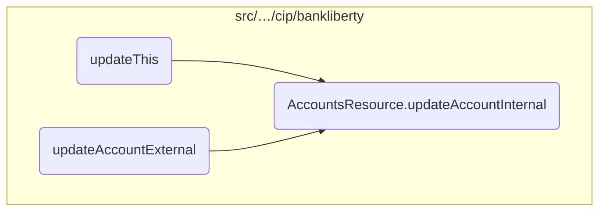
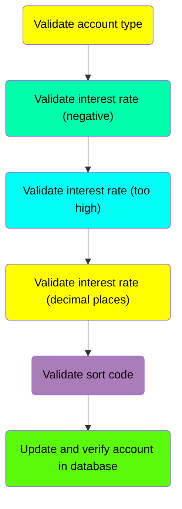
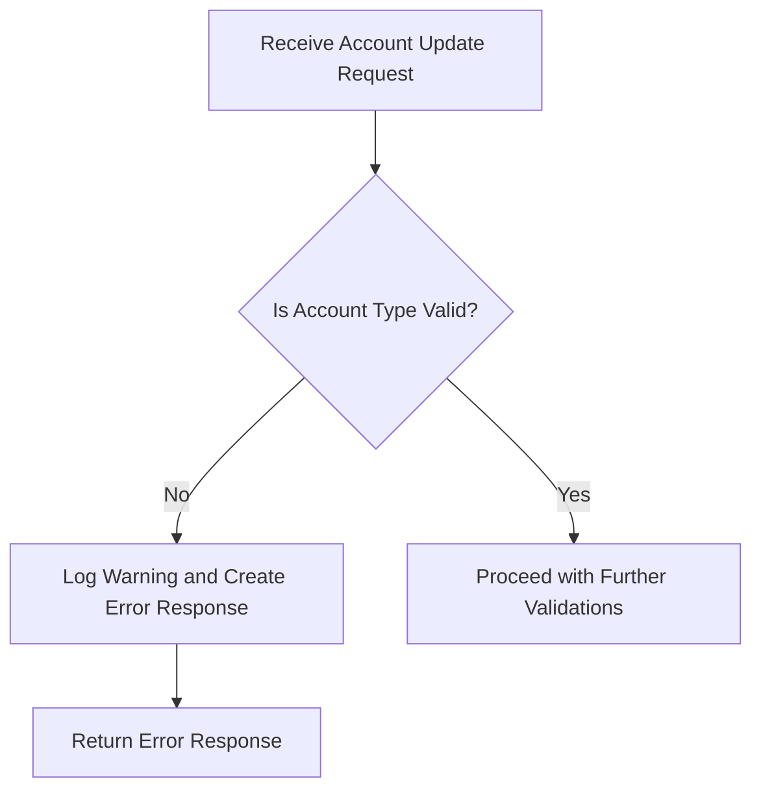
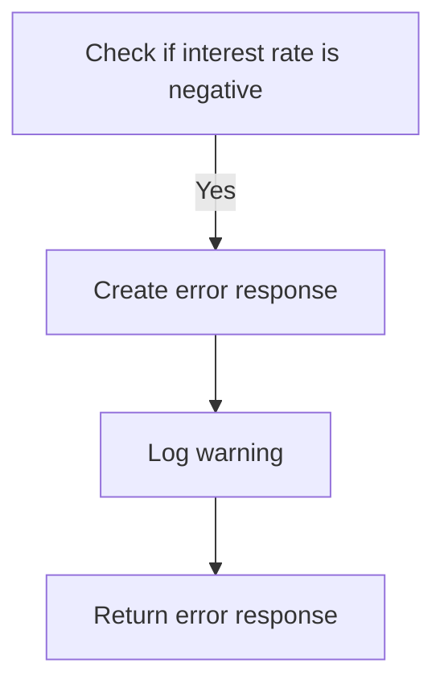
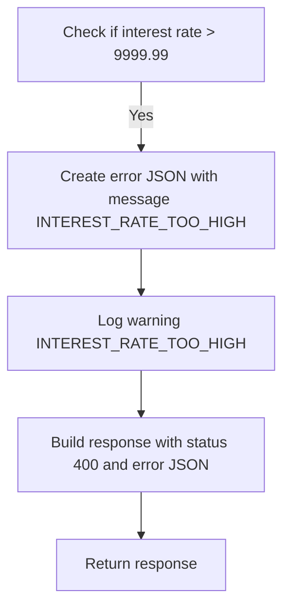
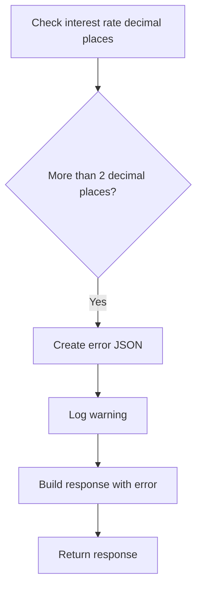
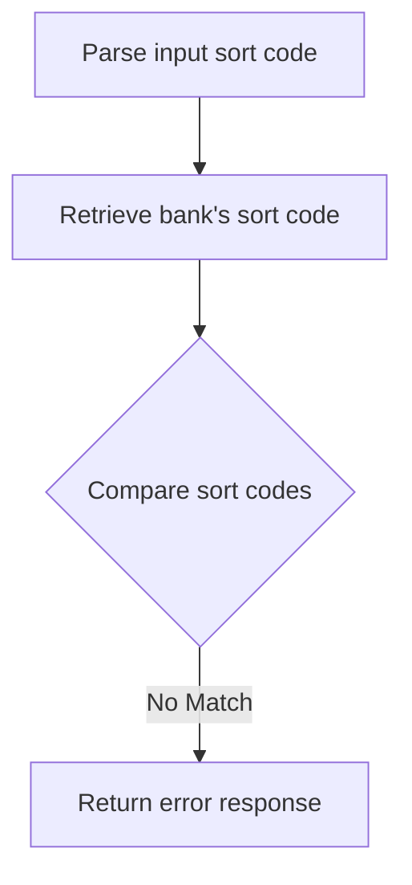
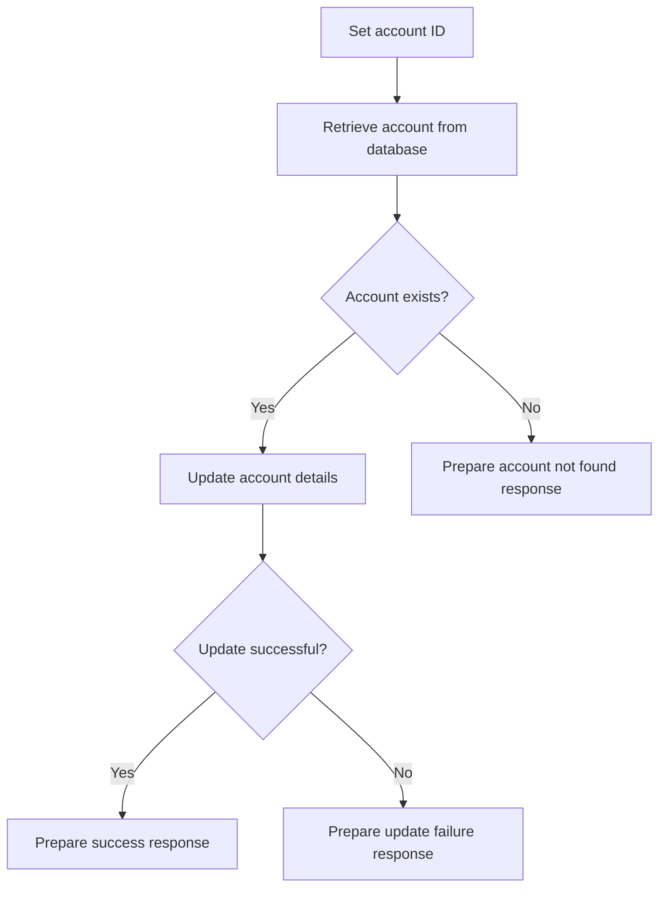

```mermaid
graph TD
  subgraph updateAccount
    updateAccount:A["Call getAccount"] --> updateAccount:B["Check if DB2 account is null"]
    updateAccount:B -->|Not null| updateAccount:C["Open connection"]
    updateAccount:C --> updateAccount:D["Pad account number"]
    updateAccount:D --> updateAccount:E["Pad sort code"]
    updateAccount:E --> updateAccount:F["Perform SQL query"]
    updateAccount:F --> updateAccount:G["Update Account with new data"]
  end
  subgraph getAccount
    getAccount:A["Open connection"] --> getAccount:B["Pad sort code"]
    getAccount:B --> getAccount:C["Check if account number is 99999999"]
    getAccount:C -->|Yes| getAccount:D["Perform SQL query for account 99999999"]
    getAccount:C -->|No| getAccount:E["Pad account number"]
    getAccount:E --> getAccount:F["Perform SQL query for account"]
  end
  updateAccount:A --> getAccount

%% Swimm:
%% graph TD
%%   subgraph <SwmToken path="src/webui/src/main/java/com/ibm/cics/cip/bankliberty/api/json/AccountsResource.java" pos="732:7:7" line-data="			db2Account = db2Account.updateAccount(account);">`updateAccount`</SwmToken>
%%     <SwmToken path="src/webui/src/main/java/com/ibm/cics/cip/bankliberty/api/json/AccountsResource.java" pos="732:7:7" line-data="			db2Account = db2Account.updateAccount(account);">`updateAccount`</SwmToken>:A["Call <SwmToken path="src/webui/src/main/java/com/ibm/cics/cip/bankliberty/api/json/AccountsResource.java" pos="727:7:7" line-data="		db2Account = db2Account.getAccount(Integer.parseInt(account.getId()),">`getAccount`</SwmToken>"] --> <SwmToken path="src/webui/src/main/java/com/ibm/cics/cip/bankliberty/api/json/AccountsResource.java" pos="732:7:7" line-data="			db2Account = db2Account.updateAccount(account);">`updateAccount`</SwmToken>:B["Check if <SwmToken path="src/webui/src/main/java/com/ibm/cics/cip/bankliberty/api/json/AccountsResource.java" pos="167:11:11" line-data="		 * to keep track of DB2 connections">`DB2`</SwmToken> account is null"]
%%     <SwmToken path="src/webui/src/main/java/com/ibm/cics/cip/bankliberty/api/json/AccountsResource.java" pos="732:7:7" line-data="			db2Account = db2Account.updateAccount(account);">`updateAccount`</SwmToken>:B -->|Not null| <SwmToken path="src/webui/src/main/java/com/ibm/cics/cip/bankliberty/api/json/AccountsResource.java" pos="732:7:7" line-data="			db2Account = db2Account.updateAccount(account);">`updateAccount`</SwmToken>:C["Open connection"]
%%     <SwmToken path="src/webui/src/main/java/com/ibm/cics/cip/bankliberty/api/json/AccountsResource.java" pos="732:7:7" line-data="			db2Account = db2Account.updateAccount(account);">`updateAccount`</SwmToken>:C --> <SwmToken path="src/webui/src/main/java/com/ibm/cics/cip/bankliberty/api/json/AccountsResource.java" pos="732:7:7" line-data="			db2Account = db2Account.updateAccount(account);">`updateAccount`</SwmToken>:D["Pad account number"]
%%     <SwmToken path="src/webui/src/main/java/com/ibm/cics/cip/bankliberty/api/json/AccountsResource.java" pos="732:7:7" line-data="			db2Account = db2Account.updateAccount(account);">`updateAccount`</SwmToken>:D --> <SwmToken path="src/webui/src/main/java/com/ibm/cics/cip/bankliberty/api/json/AccountsResource.java" pos="732:7:7" line-data="			db2Account = db2Account.updateAccount(account);">`updateAccount`</SwmToken>:E["Pad sort code"]
%%     <SwmToken path="src/webui/src/main/java/com/ibm/cics/cip/bankliberty/api/json/AccountsResource.java" pos="732:7:7" line-data="			db2Account = db2Account.updateAccount(account);">`updateAccount`</SwmToken>:E --> <SwmToken path="src/webui/src/main/java/com/ibm/cics/cip/bankliberty/api/json/AccountsResource.java" pos="732:7:7" line-data="			db2Account = db2Account.updateAccount(account);">`updateAccount`</SwmToken>:F["Perform SQL query"]
%%     <SwmToken path="src/webui/src/main/java/com/ibm/cics/cip/bankliberty/api/json/AccountsResource.java" pos="732:7:7" line-data="			db2Account = db2Account.updateAccount(account);">`updateAccount`</SwmToken>:F --> <SwmToken path="src/webui/src/main/java/com/ibm/cics/cip/bankliberty/api/json/AccountsResource.java" pos="732:7:7" line-data="			db2Account = db2Account.updateAccount(account);">`updateAccount`</SwmToken>:G["Update Account with new data"]
%%   end
%%   subgraph <SwmToken path="src/webui/src/main/java/com/ibm/cics/cip/bankliberty/api/json/AccountsResource.java" pos="727:7:7" line-data="		db2Account = db2Account.getAccount(Integer.parseInt(account.getId()),">`getAccount`</SwmToken>
%%     <SwmToken path="src/webui/src/main/java/com/ibm/cics/cip/bankliberty/api/json/AccountsResource.java" pos="727:7:7" line-data="		db2Account = db2Account.getAccount(Integer.parseInt(account.getId()),">`getAccount`</SwmToken>:A["Open connection"] --> <SwmToken path="src/webui/src/main/java/com/ibm/cics/cip/bankliberty/api/json/AccountsResource.java" pos="727:7:7" line-data="		db2Account = db2Account.getAccount(Integer.parseInt(account.getId()),">`getAccount`</SwmToken>:B["Pad sort code"]
%%     <SwmToken path="src/webui/src/main/java/com/ibm/cics/cip/bankliberty/api/json/AccountsResource.java" pos="727:7:7" line-data="		db2Account = db2Account.getAccount(Integer.parseInt(account.getId()),">`getAccount`</SwmToken>:B --> <SwmToken path="src/webui/src/main/java/com/ibm/cics/cip/bankliberty/api/json/AccountsResource.java" pos="727:7:7" line-data="		db2Account = db2Account.getAccount(Integer.parseInt(account.getId()),">`getAccount`</SwmToken>:C["Check if account number is 99999999"]
%%     <SwmToken path="src/webui/src/main/java/com/ibm/cics/cip/bankliberty/api/json/AccountsResource.java" pos="727:7:7" line-data="		db2Account = db2Account.getAccount(Integer.parseInt(account.getId()),">`getAccount`</SwmToken>:C -->|Yes| <SwmToken path="src/webui/src/main/java/com/ibm/cics/cip/bankliberty/api/json/AccountsResource.java" pos="727:7:7" line-data="		db2Account = db2Account.getAccount(Integer.parseInt(account.getId()),">`getAccount`</SwmToken>:D["Perform SQL query for account 99999999"]
%%     <SwmToken path="src/webui/src/main/java/com/ibm/cics/cip/bankliberty/api/json/AccountsResource.java" pos="727:7:7" line-data="		db2Account = db2Account.getAccount(Integer.parseInt(account.getId()),">`getAccount`</SwmToken>:C -->|No| <SwmToken path="src/webui/src/main/java/com/ibm/cics/cip/bankliberty/api/json/AccountsResource.java" pos="727:7:7" line-data="		db2Account = db2Account.getAccount(Integer.parseInt(account.getId()),">`getAccount`</SwmToken>:E["Pad account number"]
%%     <SwmToken path="src/webui/src/main/java/com/ibm/cics/cip/bankliberty/api/json/AccountsResource.java" pos="727:7:7" line-data="		db2Account = db2Account.getAccount(Integer.parseInt(account.getId()),">`getAccount`</SwmToken>:E --> <SwmToken path="src/webui/src/main/java/com/ibm/cics/cip/bankliberty/api/json/AccountsResource.java" pos="727:7:7" line-data="		db2Account = db2Account.getAccount(Integer.parseInt(account.getId()),">`getAccount`</SwmToken>:F["Perform SQL query for account"]
%%   end
%%   <SwmToken path="src/webui/src/main/java/com/ibm/cics/cip/bankliberty/api/json/AccountsResource.java" pos="732:7:7" line-data="			db2Account = db2Account.updateAccount(account);">`updateAccount`</SwmToken>:A --> <SwmToken path="src/webui/src/main/java/com/ibm/cics/cip/bankliberty/api/json/AccountsResource.java" pos="727:7:7" line-data="		db2Account = db2Account.getAccount(Integer.parseInt(account.getId()),">`getAccount`</SwmToken>
```

This document explains the process of updating an account's details through the <SwmToken path="src/webui/src/main/java/com/ibm/cics/cip/bankliberty/api/json/AccountsResource.java" pos="65:14:14" line-data="	private static final String UPDATE_ACCOUNT_INTERNAL = &quot;updateAccountInternal(Long id, AccountJSON account)&quot;;">`updateAccountInternal`</SwmToken> function. The function performs several validation checks to ensure the integrity and correctness of the account data before updating the account in the database.

The flow begins by validating the account type to ensure it is supported. If the account type is invalid, an error response is generated. Next, the function checks if the interest rate is negative, too high, or has more than two decimal places, and handles any errors accordingly. The sort code is then validated to ensure it matches the bank's sort code. If all validations pass, the function proceeds to update the account details in the database. If the update is successful, a success response is prepared with the updated account details. If the update fails or the account is not found, appropriate error responses are generated.

# Where is this flow used?

This flow is used multiple times in the codebase as represented in the following diagram:



Here is a high level diagram of the flow, showing only the most important functions:

```mermaid
graph TD;
      subgraph srcwebuisrcmainjavacomibmcicscipbankliberty[src/…/cip/bankliberty]
41d1a32aa8587a932e7e240b63b5bebc9c580a0e9e756de16d5d8106cacecc2c(AccountsResource.updateAccountInternal) --> 0d9ce479c07585b4f5d8ca06577bbf1fd5dbbac6cbee5ce0c4e8894228cbfc4b(Account.updateAccount)
end

subgraph srcwebuisrcmainjavacomibmcicscipbankliberty[src/…/cip/bankliberty]
0d9ce479c07585b4f5d8ca06577bbf1fd5dbbac6cbee5ce0c4e8894228cbfc4b(Account.updateAccount) --> 1eab8b7c3852bcbc5a3632cd4490f056cd96c1dbf48f74d39c5e626e18f47fcc(Account.getAccount)
end


      classDef mainFlowStyle color:#000000,fill:#7CB9F4
classDef rootsStyle color:#000000,fill:#00FFF4
classDef Style1 color:#000000,fill:#00FFAA
classDef Style2 color:#000000,fill:#FFFF00
classDef Style3 color:#000000,fill:#AA7CB9

%% Swimm:
%% graph TD;
%%       subgraph srcwebuisrcmainjavacomibmcicscipbankliberty[<SwmPath>[src/…/cip/bankliberty/](src/webui/src/main/java/com/ibm/cics/cip/bankliberty/)</SwmPath>]
%% 41d1a32aa8587a932e7e240b63b5bebc9c580a0e9e756de16d5d8106cacecc2c(AccountsResource.updateAccountInternal) --> 0d9ce479c07585b4f5d8ca06577bbf1fd5dbbac6cbee5ce0c4e8894228cbfc4b(Account.updateAccount)
%% end
%% 
%% subgraph srcwebuisrcmainjavacomibmcicscipbankliberty[<SwmPath>[src/…/cip/bankliberty/](src/webui/src/main/java/com/ibm/cics/cip/bankliberty/)</SwmPath>]
%% 0d9ce479c07585b4f5d8ca06577bbf1fd5dbbac6cbee5ce0c4e8894228cbfc4b(Account.updateAccount) --> 1eab8b7c3852bcbc5a3632cd4490f056cd96c1dbf48f74d39c5e626e18f47fcc(Account.getAccount)
%% end
%% 
%% 
%%       classDef mainFlowStyle color:#000000,fill:#7CB9F4
%% classDef rootsStyle color:#000000,fill:#00FFF4
%% classDef Style1 color:#000000,fill:#00FFAA
%% classDef Style2 color:#000000,fill:#FFFF00
%% classDef Style3 color:#000000,fill:#AA7CB9
```



# Flow drill down

## Diving into the <SwmToken path="src/webui/src/main/java/com/ibm/cics/cip/bankliberty/api/json/AccountsResource.java" pos="65:14:14" line-data="	private static final String UPDATE_ACCOUNT_INTERNAL = &quot;updateAccountInternal(Long id, AccountJSON account)&quot;;">`updateAccountInternal`</SwmToken> function



## <SwmToken path="src/webui/src/main/java/com/ibm/cics/cip/bankliberty/api/json/AccountsResource.java" pos="65:14:14" line-data="	private static final String UPDATE_ACCOUNT_INTERNAL = &quot;updateAccountInternal(Long id, AccountJSON account)&quot;;">`updateAccountInternal`</SwmToken> function - Validate account type

Here is a diagram of this part:



### Validating the account type

The function <SwmToken path="src/webui/src/main/java/com/ibm/cics/cip/bankliberty/api/json/AccountsResource.java" pos="65:14:14" line-data="	private static final String UPDATE_ACCOUNT_INTERNAL = &quot;updateAccountInternal(Long id, AccountJSON account)&quot;;">`updateAccountInternal`</SwmToken> begins by validating the account type provided in the <SwmToken path="src/webui/src/main/java/com/ibm/cics/cip/bankliberty/api/json/AccountsResource.java" pos="57:16:16" line-data="	private static final String CREATE_ACCOUNT_INTERNAL = &quot;createAccountInternal(AccountJSON account)&quot;;">`AccountJSON`</SwmToken> object. This is done by calling the <SwmToken path="src/webui/src/main/java/com/ibm/cics/cip/bankliberty/api/json/AccountsResource.java" pos="652:8:8" line-data="		if (!(account.validateType(account.getAccountType().trim())))">`validateType`</SwmToken> method on the <SwmToken path="src/webui/src/main/java/com/ibm/cics/cip/bankliberty/api/json/AccountsResource.java" pos="652:6:6" line-data="		if (!(account.validateType(account.getAccountType().trim())))">`account`</SwmToken> object, passing the trimmed account type as an argument. If the account type is invalid, the function proceeds to handle this error.

When the account type is invalid, a new <SwmToken path="src/webui/src/main/java/com/ibm/cics/cip/bankliberty/api/json/AccountsResource.java" pos="655:1:1" line-data="			JSONObject error = new JSONObject();">`JSONObject`</SwmToken> named <SwmToken path="src/webui/src/main/java/com/ibm/cics/cip/bankliberty/api/json/AccountsResource.java" pos="655:3:3" line-data="			JSONObject error = new JSONObject();">`error`</SwmToken> is created. This object is used to store the error message, which includes the unsupported account type. The error message is then logged with a warning level to help with debugging and tracking issues.

<SwmSnippet path="/src/webui/src/main/java/com/ibm/cics/cip/bankliberty/api/json/AccountsResource.java" line="652">

---

Finally, the function constructs an HTTP response with a status code of 400 (Bad Request) and includes the error message in the response body. This response is then returned to the client, indicating that the account update request could not be processed due to an invalid account type.

```java
		if (!(account.validateType(account.getAccountType().trim())))
		// If account type invalid
		{
			JSONObject error = new JSONObject();
			error.put(JSON_ERROR_MSG,
					ACC_TYPE_STRING + account.getAccountType() + NOT_SUPPORTED);
			logger.log(Level.WARNING, () -> (ACC_TYPE_STRING
					+ account.getAccountType() + NOT_SUPPORTED));
			myResponse = Response.status(400).entity(error.toString()).build();
			logger.exiting(this.getClass().getName(), UPDATE_ACCOUNT_INTERNAL,
```

---

</SwmSnippet>

## <SwmToken path="src/webui/src/main/java/com/ibm/cics/cip/bankliberty/api/json/AccountsResource.java" pos="65:14:14" line-data="	private static final String UPDATE_ACCOUNT_INTERNAL = &quot;updateAccountInternal(Long id, AccountJSON account)&quot;;">`updateAccountInternal`</SwmToken> function - Validate interest rate (negative)

Here is a diagram of this part:



### Validating the interest rate

The function checks if the interest rate provided in the <SwmToken path="src/webui/src/main/java/com/ibm/cics/cip/bankliberty/api/json/AccountsResource.java" pos="57:16:16" line-data="	private static final String CREATE_ACCOUNT_INTERNAL = &quot;createAccountInternal(AccountJSON account)&quot;;">`AccountJSON`</SwmToken> object is negative. This is done by comparing the interest rate value to <SwmToken path="src/webui/src/main/java/com/ibm/cics/cip/bankliberty/api/json/AccountsResource.java" pos="666:16:18" line-data="		if (account.getInterestRate().doubleValue() &lt; 0.00)">`0.00`</SwmToken>. If the interest rate is less than <SwmToken path="src/webui/src/main/java/com/ibm/cics/cip/bankliberty/api/json/AccountsResource.java" pos="666:16:18" line-data="		if (account.getInterestRate().doubleValue() &lt; 0.00)">`0.00`</SwmToken>, it indicates an invalid interest rate.

<SwmSnippet path="/src/webui/src/main/java/com/ibm/cics/cip/bankliberty/api/json/AccountsResource.java" line="669">

---

When an invalid interest rate is detected, an error message is created. This error message is stored in a <SwmToken path="src/webui/src/main/java/com/ibm/cics/cip/bankliberty/api/json/AccountsResource.java" pos="669:1:1" line-data="			JSONObject error = new JSONObject();">`JSONObject`</SwmToken> and includes a predefined message indicating that the interest rate cannot be less than zero.

```java
			JSONObject error = new JSONObject();
			error.put(JSON_ERROR_MSG, INTEREST_RATE_LESS_THAN_ZERO);
```

---

</SwmSnippet>

<SwmSnippet path="/src/webui/src/main/java/com/ibm/cics/cip/bankliberty/api/json/AccountsResource.java" line="671">

---

The function then logs a warning message to indicate that an invalid interest rate was provided. This helps in tracking and debugging issues related to invalid interest rates.

```java
			logger.log(Level.WARNING, () -> (INTEREST_RATE_LESS_THAN_ZERO));
```

---

</SwmSnippet>

<SwmSnippet path="/src/webui/src/main/java/com/ibm/cics/cip/bankliberty/api/json/AccountsResource.java" line="672">

---

Finally, the function constructs an HTTP response with a status code of 400 (Bad Request) and includes the error message in the response body. This response is then returned to the client, indicating that the account update request was unsuccessful due to the invalid interest rate.

```java
			myResponse = Response.status(400).entity(error.toString()).build();
			logger.exiting(this.getClass().getName(), UPDATE_ACCOUNT_INTERNAL,
					myResponse);
			return myResponse;
```

---

</SwmSnippet>

## <SwmToken path="src/webui/src/main/java/com/ibm/cics/cip/bankliberty/api/json/AccountsResource.java" pos="65:14:14" line-data="	private static final String UPDATE_ACCOUNT_INTERNAL = &quot;updateAccountInternal(Long id, AccountJSON account)&quot;;">`updateAccountInternal`</SwmToken> function - Validate interest rate (too high)

Here is a diagram of this part:



### Validating the interest rate

The function checks if the interest rate provided in the <SwmToken path="src/webui/src/main/java/com/ibm/cics/cip/bankliberty/api/json/AccountsResource.java" pos="652:6:6" line-data="		if (!(account.validateType(account.getAccountType().trim())))">`account`</SwmToken> object is greater than <SwmToken path="src/webui/src/main/java/com/ibm/cics/cip/bankliberty/api/json/AccountsResource.java" pos="81:26:28" line-data="	private static final String INTEREST_RATE_LESS_THAN_ZERO = &quot;Interest rate cannot be greater than 9999.99%.&quot;;">`9999.99`</SwmToken>. This is done to ensure that the interest rate is within a reasonable range and to prevent any unrealistic values from being set.

<SwmSnippet path="/src/webui/src/main/java/com/ibm/cics/cip/bankliberty/api/json/AccountsResource.java" line="681">

---

If the interest rate exceeds <SwmToken path="src/webui/src/main/java/com/ibm/cics/cip/bankliberty/api/json/AccountsResource.java" pos="81:26:28" line-data="	private static final String INTEREST_RATE_LESS_THAN_ZERO = &quot;Interest rate cannot be greater than 9999.99%.&quot;;">`9999.99`</SwmToken>, an error JSON object is created with the message <SwmToken path="src/webui/src/main/java/com/ibm/cics/cip/bankliberty/api/json/AccountsResource.java" pos="682:8:8" line-data="			error.put(JSON_ERROR_MSG, INTEREST_RATE_TOO_HIGH);">`INTEREST_RATE_TOO_HIGH`</SwmToken>. This message indicates that the provided interest rate is too high and cannot be accepted.

```java
			JSONObject error = new JSONObject();
			error.put(JSON_ERROR_MSG, INTEREST_RATE_TOO_HIGH);
```

---

</SwmSnippet>

<SwmSnippet path="/src/webui/src/main/java/com/ibm/cics/cip/bankliberty/api/json/AccountsResource.java" line="683">

---

A warning log is then generated with the message <SwmToken path="src/webui/src/main/java/com/ibm/cics/cip/bankliberty/api/json/AccountsResource.java" pos="683:16:16" line-data="			logger.log(Level.WARNING, () -&gt; (INTEREST_RATE_TOO_HIGH));">`INTEREST_RATE_TOO_HIGH`</SwmToken> to record this event for future reference and debugging purposes.

```java
			logger.log(Level.WARNING, () -> (INTEREST_RATE_TOO_HIGH));
```

---

</SwmSnippet>

<SwmSnippet path="/src/webui/src/main/java/com/ibm/cics/cip/bankliberty/api/json/AccountsResource.java" line="684">

---

Finally, a response is built with a status code of 400 (Bad Request) and the error JSON object. This response is then returned to the client, indicating that the update request has failed due to the excessively high interest rate.

```java
			myResponse = Response.status(400).entity(error.toString()).build();
			logger.exiting(this.getClass().getName(), UPDATE_ACCOUNT_INTERNAL,
					myResponse);
			return myResponse;
```

---

</SwmSnippet>

## <SwmToken path="src/webui/src/main/java/com/ibm/cics/cip/bankliberty/api/json/AccountsResource.java" pos="65:14:14" line-data="	private static final String UPDATE_ACCOUNT_INTERNAL = &quot;updateAccountInternal(Long id, AccountJSON account)&quot;;">`updateAccountInternal`</SwmToken> function - Validate interest rate (decimal places)

Here is a diagram of this part:



<SwmSnippet path="/src/webui/src/main/java/com/ibm/cics/cip/bankliberty/api/json/AccountsResource.java" line="688">

---

### Validating the interest rate's decimal places

The function <SwmToken path="src/webui/src/main/java/com/ibm/cics/cip/bankliberty/api/json/AccountsResource.java" pos="65:14:14" line-data="	private static final String UPDATE_ACCOUNT_INTERNAL = &quot;updateAccountInternal(Long id, AccountJSON account)&quot;;">`updateAccountInternal`</SwmToken> includes a crucial step where it validates the interest rate's decimal places. This is done to ensure that the interest rate does not exceed two decimal places, which is a common requirement in financial applications to maintain precision and avoid rounding errors.

```java

		}

		BigDecimal myInterestRate = account.getInterestRate();
		if (myInterestRate.scale() > 2)
		// Interest rate more than 2dp
		{
			JSONObject error = new JSONObject();
			error.put(JSON_ERROR_MSG,
					"Interest rate cannot have more than 2 decimal places. "
							+ myInterestRate.toPlainString());
			logger.log(Level.WARNING,
					() -> ("Interest rate cannot have more than 2 decimal places."
							+ myInterestRate.toPlainString()));
			myResponse = Response.status(400).entity(error.toString()).build();
			logger.exiting(this.getClass().getName(), UPDATE_ACCOUNT_INTERNAL,
					myResponse);
			return myResponse;
```

---

</SwmSnippet>

## <SwmToken path="src/webui/src/main/java/com/ibm/cics/cip/bankliberty/api/json/AccountsResource.java" pos="65:14:14" line-data="	private static final String UPDATE_ACCOUNT_INTERNAL = &quot;updateAccountInternal(Long id, AccountJSON account)&quot;;">`updateAccountInternal`</SwmToken> function - Validate sort code

Here is a diagram of this part:



<SwmSnippet path="/src/webui/src/main/java/com/ibm/cics/cip/bankliberty/api/json/AccountsResource.java" line="706">

---

### Validating the sort code

The function <SwmToken path="src/webui/src/main/java/com/ibm/cics/cip/bankliberty/api/json/AccountsResource.java" pos="65:14:14" line-data="	private static final String UPDATE_ACCOUNT_INTERNAL = &quot;updateAccountInternal(Long id, AccountJSON account)&quot;;">`updateAccountInternal`</SwmToken> begins by parsing the input sort code from the <SwmToken path="src/webui/src/main/java/com/ibm/cics/cip/bankliberty/api/json/AccountsResource.java" pos="708:11:11" line-data="		Integer inputSortCode = Integer.parseInt(account.getSortCode());">`account`</SwmToken> object. This is done using <SwmToken path="src/webui/src/main/java/com/ibm/cics/cip/bankliberty/api/json/AccountsResource.java" pos="708:7:16" line-data="		Integer inputSortCode = Integer.parseInt(account.getSortCode());">`Integer.parseInt(account.getSortCode())`</SwmToken> to convert the sort code from a string to an integer.

```java
		}

		Integer inputSortCode = Integer.parseInt(account.getSortCode());
```

---

</SwmSnippet>

<SwmSnippet path="/src/webui/src/main/java/com/ibm/cics/cip/bankliberty/api/json/AccountsResource.java" line="709">

---

Next, the function retrieves the bank's sort code using <SwmToken path="src/webui/src/main/java/com/ibm/cics/cip/bankliberty/api/json/AccountsResource.java" pos="709:7:11" line-data="		Integer thisSortCode = this.getSortCode();">`this.getSortCode()`</SwmToken>. This value is then compared with the input sort code to ensure they match.

```java
		Integer thisSortCode = this.getSortCode();

```

---

</SwmSnippet>

<SwmSnippet path="/src/webui/src/main/java/com/ibm/cics/cip/bankliberty/api/json/AccountsResource.java" line="711">

---

If the input sort code does not match the bank's sort code, an error response is generated. The error message indicates that the provided sort code is not valid for the bank, and the function returns a <SwmToken path="src/webui/src/main/java/com/ibm/cics/cip/bankliberty/api/json/AccountsResource.java" pos="719:9:9" line-data="			myResponse = Response.status(400).entity(error.toString()).build();">`400`</SwmToken> status code with the error details.

```java
		if (inputSortCode.intValue() != thisSortCode.intValue())
		// Invalid sortcode
		{
			JSONObject error = new JSONObject();
			error.put(JSON_ERROR_MSG, SORT_CODE_LITERAL + inputSortCode
					+ NOT_VALID_FOR_THIS_BANK + thisSortCode + ")");
			logger.log(Level.WARNING, () -> SORT_CODE_LITERAL + inputSortCode
					+ NOT_VALID_FOR_THIS_BANK + thisSortCode + ")");
			myResponse = Response.status(400).entity(error.toString()).build();
			logger.exiting(this.getClass().getName(), UPDATE_ACCOUNT_INTERNAL,
					myResponse);
			return myResponse;
```

---

</SwmSnippet>

## <SwmToken path="src/webui/src/main/java/com/ibm/cics/cip/bankliberty/api/json/AccountsResource.java" pos="65:14:14" line-data="	private static final String UPDATE_ACCOUNT_INTERNAL = &quot;updateAccountInternal(Long id, AccountJSON account)&quot;;">`updateAccountInternal`</SwmToken> function - Update and verify account in database

Here is a diagram of this part:



<SwmSnippet path="/src/webui/src/main/java/com/ibm/cics/cip/bankliberty/api/json/AccountsResource.java" line="725">

---

### Setting the Account ID

The <SwmToken path="src/webui/src/main/java/com/ibm/cics/cip/bankliberty/api/json/AccountsResource.java" pos="65:14:14" line-data="	private static final String UPDATE_ACCOUNT_INTERNAL = &quot;updateAccountInternal(Long id, AccountJSON account)&quot;;">`updateAccountInternal`</SwmToken> function begins by setting the account ID using the provided <SwmToken path="src/webui/src/main/java/com/ibm/cics/cip/bankliberty/api/json/AccountsResource.java" pos="726:5:5" line-data="		account.setId(id.toString());">`id`</SwmToken> parameter. This is done to ensure that the account object has the correct identifier for the subsequent database operations.

```java
		com.ibm.cics.cip.bankliberty.web.db2.Account db2Account = new com.ibm.cics.cip.bankliberty.web.db2.Account();
		account.setId(id.toString());
```

---

</SwmSnippet>

<SwmSnippet path="/src/webui/src/main/java/com/ibm/cics/cip/bankliberty/api/json/AccountsResource.java" line="727">

---

### Retrieving the Account from the Database

Next, the function retrieves the account details from the database using the <SwmToken path="src/webui/src/main/java/com/ibm/cics/cip/bankliberty/api/json/AccountsResource.java" pos="727:7:7" line-data="		db2Account = db2Account.getAccount(Integer.parseInt(account.getId()),">`getAccount`</SwmToken> method. This method takes the account ID and sort code as parameters and returns the corresponding account object if it exists.

```java
		db2Account = db2Account.getAccount(Integer.parseInt(account.getId()),
				this.getSortCode().intValue());
```

---

</SwmSnippet>

<SwmSnippet path="/src/webui/src/main/java/com/ibm/cics/cip/bankliberty/api/json/AccountsResource.java" line="730">

---

### Updating the Account Details

If the account exists in the database, the function proceeds to update the account details using the <SwmToken path="src/webui/src/main/java/com/ibm/cics/cip/bankliberty/api/json/AccountsResource.java" pos="732:7:7" line-data="			db2Account = db2Account.updateAccount(account);">`updateAccount`</SwmToken> method. This method takes the <SwmToken path="src/webui/src/main/java/com/ibm/cics/cip/bankliberty/api/json/AccountsResource.java" pos="57:16:16" line-data="	private static final String CREATE_ACCOUNT_INTERNAL = &quot;createAccountInternal(AccountJSON account)&quot;;">`AccountJSON`</SwmToken> object (which contains the new account details) as input and returns the updated account object if the update is successful.

```java
		if (db2Account != null)
		{
			db2Account = db2Account.updateAccount(account);
```

---

</SwmSnippet>

<SwmSnippet path="/src/webui/src/main/java/com/ibm/cics/cip/bankliberty/api/json/AccountsResource.java" line="733">

---

### Preparing the Response

If the account update is successful, the function prepares a success response by populating a JSON object with the updated account details. This includes the sort code, account number, customer number, account type, available balance, actual balance, interest rate, overdraft limit, last statement date, next statement date, and the date the account was opened.

```java
			if (db2Account != null)
			{
				response.put(JSON_SORT_CODE, db2Account.getSortcode().trim());
				response.put("id", db2Account.getAccountNumber());
				response.put(JSON_CUSTOMER_NUMBER,
						db2Account.getCustomerNumber());
				response.put(JSON_ACCOUNT_TYPE, db2Account.getType().trim());
				response.put(JSON_AVAILABLE_BALANCE,
						BigDecimal.valueOf(db2Account.getAvailableBalance()));
				response.put(JSON_ACTUAL_BALANCE,
						BigDecimal.valueOf(db2Account.getActualBalance()));
				response.put(JSON_INTEREST_RATE,
						BigDecimal.valueOf(db2Account.getInterestRate()));
				response.put(JSON_OVERDRAFT, db2Account.getOverdraftLimit());
				response.put(JSON_LAST_STATEMENT_DATE,
						db2Account.getLastStatement().toString());
				response.put(JSON_NEXT_STATEMENT_DATE,
						db2Account.getNextStatement().toString());
				response.put(JSON_DATE_OPENED,
						db2Account.getOpened().toString().trim());
```

---

</SwmSnippet>

<SwmSnippet path="/src/webui/src/main/java/com/ibm/cics/cip/bankliberty/api/json/AccountsResource.java" line="754">

---

### Handling Update Failures

If the account update fails, the function prepares an error response indicating that the update operation was unsuccessful. This is done by creating a JSON object with an appropriate error message and logging the error.

```java
			else
			{
				JSONObject error = new JSONObject();
				error.put(JSON_ERROR_MSG,
						"Failed to update account in com.ibm.cics.cip.bankliberty.web.db2.Account");
				logger.log(Level.SEVERE,
						() -> "Failed to update account in com.ibm.cics.cip.bankliberty.web.db2.Account");
				myResponse = Response.status(500).entity(error.toString())
						.build();
				logger.exiting(this.getClass().getName(),
						UPDATE_ACCOUNT_INTERNAL, myResponse);
				return myResponse;
			}
```

---

</SwmSnippet>

<SwmSnippet path="/src/webui/src/main/java/com/ibm/cics/cip/bankliberty/api/json/AccountsResource.java" line="768">

---

### Handling Account Not Found

If the account does not exist in the database, the function prepares an error response indicating that the account could not be found. This is done by creating a JSON object with an appropriate error message and logging the error.

```java
		else
		{
			JSONObject error = new JSONObject();
			error.put(JSON_ERROR_MSG, FAILED_TO_READ + account.getId() + " in "
					+ this.getClass().toString());

			logger.log(Level.WARNING,
					() -> (FAILED_TO_READ + account.getId() + CLASS_NAME_MSG));
			myResponse = Response.status(404).entity(error.toString()).build();
			logger.exiting(this.getClass().getName(), UPDATE_ACCOUNT_INTERNAL,
					myResponse);
			return myResponse;
		}
```

---

</SwmSnippet>

<SwmSnippet path="/src/webui/src/main/java/com/ibm/cics/cip/bankliberty/api/json/AccountsResource.java" line="781">

---

### Finalizing the Response

Finally, the function returns the prepared response, which could either be a success response with the updated account details or an error response indicating the failure reason.

```java
		myResponse = Response.status(200).entity(response.toString()).build();
		logger.exiting(this.getClass().getName(), UPDATE_ACCOUNT_INTERNAL,
				myResponse);

		return myResponse;
```

---

</SwmSnippet>

## Diving into <SwmToken path="src/webui/src/main/java/com/ibm/cics/cip/bankliberty/api/json/AccountsResource.java" pos="732:7:7" line-data="			db2Account = db2Account.updateAccount(account);">`updateAccount`</SwmToken> & <SwmToken path="src/webui/src/main/java/com/ibm/cics/cip/bankliberty/api/json/AccountsResource.java" pos="727:7:7" line-data="		db2Account = db2Account.getAccount(Integer.parseInt(account.getId()),">`getAccount`</SwmToken>



<SwmSnippet path="/src/webui/src/main/java/com/ibm/cics/cip/bankliberty/web/db2/Account.java" line="935">

---

## Retrieving Account Details

First, the <SwmToken path="src/webui/src/main/java/com/ibm/cics/cip/bankliberty/api/json/AccountsResource.java" pos="732:7:7" line-data="			db2Account = db2Account.updateAccount(account);">`updateAccount`</SwmToken> method retrieves the account details using the <SwmToken path="src/webui/src/main/java/com/ibm/cics/cip/bankliberty/web/db2/Account.java" pos="935:9:9" line-data="		Account db2Account = this.getAccount(Integer.parseInt(account.getId()),">`getAccount`</SwmToken> method. This is crucial as it ensures that the account exists before attempting to update it.

```java
		Account db2Account = this.getAccount(Integer.parseInt(account.getId()),
				Integer.parseInt(sortcode));
```

---

</SwmSnippet>

<SwmSnippet path="/src/webui/src/main/java/com/ibm/cics/cip/bankliberty/web/db2/Account.java" line="402">

---

The <SwmToken path="src/webui/src/main/java/com/ibm/cics/cip/bankliberty/web/db2/Account.java" pos="402:5:5" line-data="	public Account getAccount(int accountNumber, int sortCode)">`getAccount`</SwmToken> method fetches the account details based on the provided account number and sort code. If the account is found, it returns the account details; otherwise, it returns null.

```java
	public Account getAccount(int accountNumber, int sortCode)
	{
		logger.entering(this.getClass().getName(), GET_ACCOUNT + accountNumber);
		openConnection();
		Account temp = null;

		String sortCodeString = padSortCode(sortCode);
		String sql9999 = "SELECT * from ACCOUNT where ACCOUNT_EYECATCHER LIKE 'ACCT' AND ACCOUNT_SORTCODE like ? order by ACCOUNT_NUMBER DESC";
		String sql = SQL_SELECT;
		try (PreparedStatement stmt9999 = conn.prepareStatement(sql9999);
				PreparedStatement stmt = conn.prepareStatement(sql);)
		{
			if (accountNumber == 99999999)
			{

				logger.log(Level.FINE, () -> PRE_SELECT_MSG + sql9999 + ">");

				stmt9999.setString(1, sortCodeString);
				ResultSet rs = stmt9999.executeQuery();
				if (rs.next())
				{
```

---

</SwmSnippet>

<SwmSnippet path="/src/webui/src/main/java/com/ibm/cics/cip/bankliberty/web/db2/Account.java" line="953">

---

## Updating Account Details

Next, if the account is found, the <SwmToken path="src/webui/src/main/java/com/ibm/cics/cip/bankliberty/api/json/AccountsResource.java" pos="732:7:7" line-data="			db2Account = db2Account.updateAccount(account);">`updateAccount`</SwmToken> method proceeds to update the account details. It prepares an SQL update statement to modify the account type, interest rate, and overdraft limit based on the new values provided.

```java
		String sqlUpdateSafe = "UPDATE ACCOUNT SET ACCOUNT_TYPE = ?,ACCOUNT_INTEREST_RATE = ? ,ACCOUNT_OVERDRAFT_LIMIT = ? WHERE ACCOUNT_NUMBER like ? AND ACCOUNT_SORTCODE like ?";
		try (PreparedStatement stmt = conn.prepareStatement(sql1);
				PreparedStatement myPreparedStatement = conn
						.prepareStatement(sqlUpdateSafe);)
		{
			stmt.setString(1, accountNumberString);
			stmt.setString(2, sortCodeString);
			ResultSet rs = stmt.executeQuery();
			while (rs.next())
			{
				temp = new Account(rs.getString(ACCOUNT_CUSTOMER_NUMBER),
						rs.getString(ACCOUNT_SORTCODE),
						rs.getString(ACCOUNT_NUMBER),
						rs.getString(ACCOUNT_TYPE),
						rs.getDouble(ACCOUNT_INTEREST_RATE),
						rs.getDate(ACCOUNT_OPENED),
						rs.getInt(ACCOUNT_OVERDRAFT_LIMIT),
						rs.getDate(ACCOUNT_LAST_STATEMENT),
						rs.getDate(ACCOUNT_NEXT_STATEMENT),
						rs.getDouble(ACCOUNT_AVAILABLE_BALANCE),
						rs.getDouble(ACCOUNT_ACTUAL_BALANCE));
```

---

</SwmSnippet>

<SwmSnippet path="/src/webui/src/main/java/com/ibm/cics/cip/bankliberty/web/db2/Account.java" line="989">

---

Finally, the method executes the update statement and returns the updated account details. If any SQL exceptions occur during the process, they are logged, and the method returns null.

```java
		catch (SQLException e)
		{
			logger.severe(e.toString());
			logger.exiting(this.getClass().getName(), UPDATE_ACCOUNT, null);
			return null;
		}
		logger.exiting(this.getClass().getName(), UPDATE_ACCOUNT, temp);
		return temp;
```

---

</SwmSnippet>

&nbsp;

*This is an auto-generated document by Swimm 🌊 and has not yet been verified by a human*

<SwmMeta version="3.0.0" repo-id="Z2l0aHViJTNBJTNBY2ljcy1iYW5raW5nLXNhbXBsZS1hcHBsaWNhdGlvbi1jYnNhLUlCTS1EZW1vJTNBJTNBU3dpbW0tRGVtbw==" repo-name="cics-banking-sample-application-cbsa-IBM-Demo"><sup>Powered by [Swimm](/)</sup></SwmMeta>
