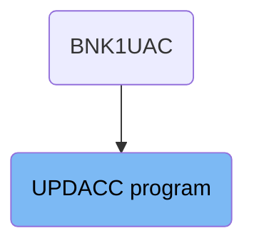
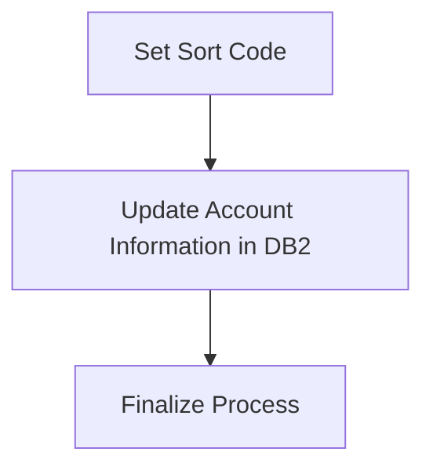
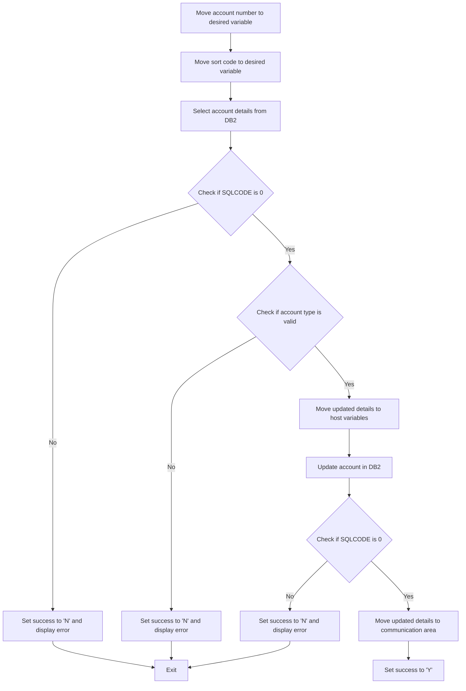
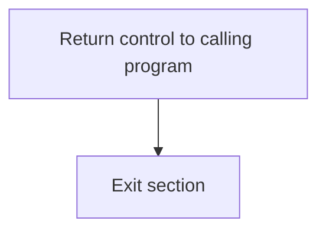

The UPDACC program is responsible for updating account information in the <SwmToken path="src/base/cobol_src/UPDACC.cbl" pos="167:7:7" line-data="           PERFORM UPDATE-ACCOUNT-DB2">`DB2`</SwmToken> database. This process involves setting the sort code, updating the account details, and finalizing the process. The program ensures that the account information is accurately updated and that all necessary values are set in the communication area before completing the transaction.

The UPDACC program starts by setting the sort code, then updates the account information in the <SwmToken path="src/base/cobol_src/UPDACC.cbl" pos="167:7:7" line-data="           PERFORM UPDATE-ACCOUNT-DB2">`DB2`</SwmToken> database, and finally finalizes the process by ensuring all necessary values are set in the communication area. This ensures that the account details are correctly updated and the transaction is completed successfully.

# Where is this program used?

This program is used once, in a flow starting from `BNK1UAC` as represented in the following diagram:



## PREMIERE

Lets' zoom into this section of the flow:



<SwmSnippet path="/src/base/cobol_src/UPDACC.cbl" line="161">

---

### Setting Sort Code

First, the sort code is set by moving the value from <SwmToken path="src/base/cobol_src/UPDACC.cbl" pos="161:3:3" line-data="           MOVE SORTCODE TO COMM-SCODE.">`SORTCODE`</SwmToken> to <SwmToken path="src/base/cobol_src/UPDACC.cbl" pos="161:7:9" line-data="           MOVE SORTCODE TO COMM-SCODE.">`COMM-SCODE`</SwmToken> and <SwmToken path="src/base/cobol_src/UPDACC.cbl" pos="162:7:11" line-data="           MOVE SORTCODE TO DESIRED-SORT-CODE.">`DESIRED-SORT-CODE`</SwmToken>.

```cobol
           MOVE SORTCODE TO COMM-SCODE.
           MOVE SORTCODE TO DESIRED-SORT-CODE.
```

---

</SwmSnippet>

<SwmSnippet path="/src/base/cobol_src/UPDACC.cbl" line="167">

---

### Updating Account Information

Next, the account information is updated by performing the <SwmToken path="src/base/cobol_src/UPDACC.cbl" pos="167:3:7" line-data="           PERFORM UPDATE-ACCOUNT-DB2">`UPDATE-ACCOUNT-DB2`</SwmToken> operation, which interacts with the Db2 database to update the account details.

```cobol
           PERFORM UPDATE-ACCOUNT-DB2
```

---

</SwmSnippet>

<SwmSnippet path="/src/base/cobol_src/UPDACC.cbl" line="174">

---

### Finalizing the Process

Then, the process is finalized by performing the <SwmToken path="src/base/cobol_src/UPDACC.cbl" pos="174:3:11" line-data="           PERFORM GET-ME-OUT-OF-HERE.">`GET-ME-OUT-OF-HERE`</SwmToken> operation, which ensures that all necessary values in the communication area are set and the process can be completed.

```cobol
           PERFORM GET-ME-OUT-OF-HERE.
```

---

</SwmSnippet>

## <SwmToken path="src/base/cobol_src/UPDACC.cbl" pos="167:3:7" line-data="           PERFORM UPDATE-ACCOUNT-DB2">`UPDATE-ACCOUNT-DB2`</SwmToken>

Lets' zoom into this section of the flow:



<SwmSnippet path="/src/base/cobol_src/UPDACC.cbl" line="187">

---

First, the account number is moved to the <SwmToken path="src/base/cobol_src/UPDACC.cbl" pos="187:9:13" line-data="           MOVE COMM-ACCNO TO DESIRED-ACC-NO.">`DESIRED-ACC-NO`</SwmToken> variable, and the sort code is moved to the <SwmToken path="src/base/cobol_src/UPDACC.cbl" pos="188:11:15" line-data="           MOVE DESIRED-SORT-CODE TO HV-ACCOUNT-SORTCODE.">`HV-ACCOUNT-SORTCODE`</SwmToken> variable.

```cobol
           MOVE COMM-ACCNO TO DESIRED-ACC-NO.
           MOVE DESIRED-SORT-CODE TO HV-ACCOUNT-SORTCODE.
           MOVE DESIRED-ACC-NO TO HV-ACCOUNT-ACC-NO.
```

---

</SwmSnippet>

<SwmSnippet path="/src/base/cobol_src/UPDACC.cbl" line="191">

---

Next, the account details are selected from the <SwmToken path="src/base/cobol_src/UPDACC.cbl" pos="167:7:7" line-data="           PERFORM UPDATE-ACCOUNT-DB2">`DB2`</SwmToken> database using the provided sort code and account number.

```cobol
           EXEC SQL
              SELECT ACCOUNT_EYECATCHER,
                     ACCOUNT_CUSTOMER_NUMBER,
                     ACCOUNT_SORTCODE,
                     ACCOUNT_NUMBER,
                     ACCOUNT_TYPE,
                     ACCOUNT_INTEREST_RATE,
                     ACCOUNT_OPENED,
                     ACCOUNT_OVERDRAFT_LIMIT,
                     ACCOUNT_LAST_STATEMENT,
                     ACCOUNT_NEXT_STATEMENT,
                     ACCOUNT_AVAILABLE_BALANCE,
                     ACCOUNT_ACTUAL_BALANCE
              INTO  :HV-ACCOUNT-EYECATCHER,
                    :HV-ACCOUNT-CUST-NO,
                    :HV-ACCOUNT-SORTCODE,
                    :HV-ACCOUNT-ACC-NO,
                    :HV-ACCOUNT-ACC-TYPE,
                    :HV-ACCOUNT-INT-RATE,
                    :HV-ACCOUNT-OPENED,
                    :HV-ACCOUNT-OVERDRAFT-LIM,
```

---

</SwmSnippet>

<SwmSnippet path="/src/base/cobol_src/UPDACC.cbl" line="225">

---

Then, we check if the SQLCODE is not equal to 0 to determine if the SELECT operation was successful. If it was not successful, the success flag is set to 'N', and an error message is displayed.

```cobol
           IF SQLCODE NOT = 0

              MOVE 'N' TO COMM-SUCCESS
              MOVE SQLCODE TO SQLCODE-DISPLAY
              DISPLAY 'ERROR: UPDACC returned ' SQLCODE-DISPLAY
              ' on SELECT'
              GO TO UAD999
```

---

</SwmSnippet>

<SwmSnippet path="/src/base/cobol_src/UPDACC.cbl" line="267">

---

Moving to the next step, we check if the account type is valid by ensuring it is not empty or starting with a space. If the account type is invalid, the success flag is set to 'N', and an error message is displayed.

```cobol
           IF (COMM-ACC-TYPE = SPACES OR COMM-ACC-TYPE(1:1) = ' ')
              MOVE 'N' TO COMM-SUCCESS
              DISPLAY 'ERROR: UPDACC has invalid account-type'
              GO TO UAD999
```

---

</SwmSnippet>

<SwmSnippet path="/src/base/cobol_src/UPDACC.cbl" line="274">

---

Next, the updated account type, overdraft limit, and interest rate are moved to the corresponding host variables.

```cobol
           MOVE COMM-ACC-TYPE  TO HV-ACCOUNT-ACC-TYPE.
           MOVE COMM-OVERDRAFT TO HV-ACCOUNT-OVERDRAFT-LIM.
           MOVE COMM-INT-RATE  TO HV-ACCOUNT-INT-RATE.
```

---

</SwmSnippet>

<SwmSnippet path="/src/base/cobol_src/UPDACC.cbl" line="278">

---

Then, the account details are updated in the <SwmToken path="src/base/cobol_src/UPDACC.cbl" pos="167:7:7" line-data="           PERFORM UPDATE-ACCOUNT-DB2">`DB2`</SwmToken> database using the provided sort code and account number.

```cobol
           EXEC SQL
              UPDATE ACCOUNT
              SET ACCOUNT_TYPE = :HV-ACCOUNT-ACC-TYPE,
                  ACCOUNT_INTEREST_RATE = :HV-ACCOUNT-INT-RATE,
                  ACCOUNT_OVERDRAFT_LIMIT = :HV-ACCOUNT-OVERDRAFT-LIM
              WHERE (ACCOUNT_SORTCODE = :HV-ACCOUNT-SORTCODE AND
                     ACCOUNT_NUMBER = :HV-ACCOUNT-ACC-NO)
           END-EXEC.
```

---

</SwmSnippet>

<SwmSnippet path="/src/base/cobol_src/UPDACC.cbl" line="290">

---

After that, we check if the SQLCODE is not equal to 0 to determine if the UPDATE operation was successful. If it was not successful, the success flag is set to 'N', and an error message is displayed.

```cobol
           IF SQLCODE NOT = 0
              MOVE 'N' TO COMM-SUCCESS
              MOVE SQLCODE TO SQLCODE-DISPLAY
              DISPLAY 'ERROR: UPDACC returned ' SQLCODE-DISPLAY
              ' on UPDATE'
              GO TO UAD999
```

---

</SwmSnippet>

<SwmSnippet path="/src/base/cobol_src/UPDACC.cbl" line="302">

---

Finally, if the SQLCODE was normal, the updated account details are moved to the communication area, and the success flag is set to 'Y'.

```cobol
           MOVE HV-ACCOUNT-EYECATCHER TO COMM-EYE.
           MOVE HV-ACCOUNT-CUST-NO    TO COMM-CUSTNO.
           MOVE HV-ACCOUNT-SORTCODE   TO COMM-SCODE.
           MOVE HV-ACCOUNT-ACC-NO     TO COMM-ACCNO.
           MOVE HV-ACCOUNT-ACC-TYPE   TO COMM-ACC-TYPE.
           MOVE HV-ACCOUNT-INT-RATE   TO COMM-INT-RATE.
           INITIALIZE DB2-DATE-REFORMAT.
           MOVE HV-ACCOUNT-OPENED     TO DB2-DATE-REFORMAT.
           MOVE DB2-DATE-REF-YR       TO COMM-OPENED-YEAR.
           MOVE DB2-DATE-REF-MNTH     TO COMM-OPENED-MONTH.
           MOVE DB2-DATE-REF-DAY      TO COMM-OPENED-DAY.
           MOVE HV-ACCOUNT-OVERDRAFT-LIM TO COMM-OVERDRAFT.
           INITIALIZE DB2-DATE-REFORMAT.
           MOVE HV-ACCOUNT-LAST-STMT  TO DB2-DATE-REFORMAT.
           MOVE DB2-DATE-REF-YR       TO COMM-LASTST-YEAR.
           MOVE DB2-DATE-REF-MNTH     TO COMM-LASTST-MONTH.
           MOVE DB2-DATE-REF-DAY      TO COMM-LASTST-DAY.
           INITIALIZE DB2-DATE-REFORMAT.
           MOVE HV-ACCOUNT-NEXT-STMT  TO DB2-DATE-REFORMAT.
           MOVE DB2-DATE-REF-YR       TO COMM-NEXTST-YEAR.
           MOVE DB2-DATE-REF-MNTH     TO COMM-NEXTST-MONTH.
```

---

</SwmSnippet>

## <SwmToken path="src/base/cobol_src/UPDACC.cbl" pos="174:3:11" line-data="           PERFORM GET-ME-OUT-OF-HERE.">`GET-ME-OUT-OF-HERE`</SwmToken>

Lets' zoom into this section of the flow:



<SwmSnippet path="/src/base/cobol_src/UPDACC.cbl" line="384">

---

First, the <SwmToken path="src/base/cobol_src/UPDACC.cbl" pos="384:1:5" line-data="           EXEC CICS RETURN">`EXEC CICS RETURN`</SwmToken> command is executed to return control to the calling program. This is essential for ending the current transaction and passing control back to the previous program or transaction.

```cobol
           EXEC CICS RETURN
           END-EXEC.
```

---

</SwmSnippet>

<SwmSnippet path="/src/base/cobol_src/UPDACC.cbl" line="387">

---

Next, the <SwmToken path="src/base/cobol_src/UPDACC.cbl" pos="388:1:1" line-data="           EXIT.">`EXIT`</SwmToken> statement is used to exit the <SwmToken path="src/base/cobol_src/UPDACC.cbl" pos="174:3:11" line-data="           PERFORM GET-ME-OUT-OF-HERE.">`GET-ME-OUT-OF-HERE`</SwmToken> section, ensuring that no further code in this section is executed.

```cobol
       GMOOH999.
           EXIT.
```

---

</SwmSnippet>

&nbsp;

*This is an auto-generated document by Swimm 🌊 and has not yet been verified by a human*

<SwmMeta version="3.0.0" repo-id="Z2l0aHViJTNBJTNBY2ljcy1iYW5raW5nLXNhbXBsZS1hcHBsaWNhdGlvbi1jYnNhLUlCTS1EZW1vJTNBJTNBU3dpbW0tRGVtbw==" repo-name="cics-banking-sample-application-cbsa-IBM-Demo"><sup>Powered by [Swimm](/)</sup></SwmMeta>
