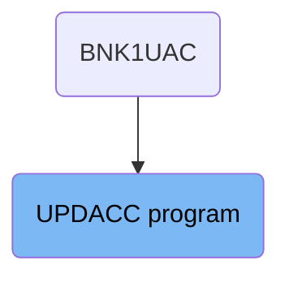
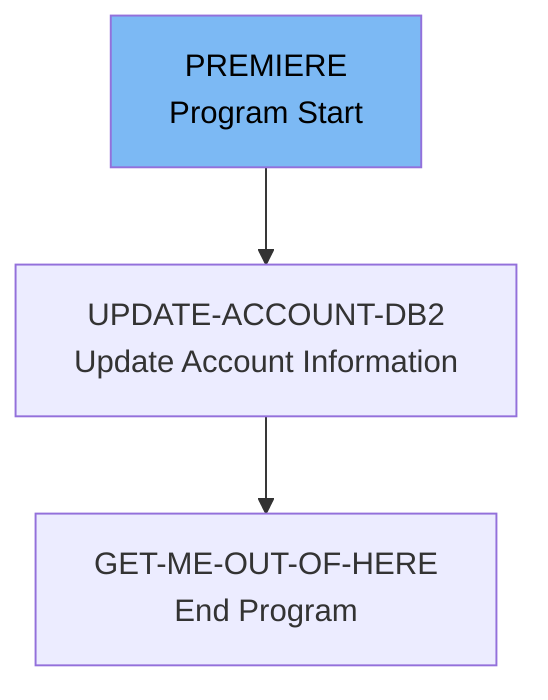

The UPDACC program is responsible for updating account information in the database. It is initiated by the BNK1UAC program and follows a specific flow to ensure the account details are correctly updated. The process starts with identifying the account using the SORTCODE, updating the necessary fields, and then ending the program.

The flow starts with the BNK1UAC program calling the UPDACC program. The UPDACC program begins by identifying the account to be updated using the SORTCODE. It then updates the account information in the database, ensuring all fields are valid. Finally, the program ends and returns control to the calling program.

# Where is this program used?

This program is used once, in a flow starting from `BNK1UAC` as represented in the following diagram:



Lets' zoom into the flow:



<SwmSnippet path="/src/base/cobol_src/UPDACC.cbl" line="158">

---

## PREMIERE Section

The <SwmToken path="src/base/cobol_src/UPDACC.cbl" pos="158:1:1" line-data="       PREMIERE SECTION.">`PREMIERE`</SwmToken> section is responsible for initiating the process of updating account information. It starts by moving the <SwmToken path="src/base/cobol_src/UPDACC.cbl" pos="161:3:3" line-data="           MOVE SORTCODE TO COMM-SCODE.">`SORTCODE`</SwmToken> to <SwmToken path="src/base/cobol_src/UPDACC.cbl" pos="161:7:9" line-data="           MOVE SORTCODE TO COMM-SCODE.">`COMM-SCODE`</SwmToken> and <SwmToken path="src/base/cobol_src/UPDACC.cbl" pos="162:7:11" line-data="           MOVE SORTCODE TO DESIRED-SORT-CODE.">`DESIRED-SORT-CODE`</SwmToken>, which are used for identifying the account to be updated. Then, it performs the <SwmToken path="src/base/cobol_src/UPDACC.cbl" pos="167:3:7" line-data="           PERFORM UPDATE-ACCOUNT-DB2">`UPDATE-ACCOUNT-DB2`</SwmToken> section to update the account information in the database. Finally, it performs the <SwmToken path="src/base/cobol_src/UPDACC.cbl" pos="174:3:11" line-data="           PERFORM GET-ME-OUT-OF-HERE.">`GET-ME-OUT-OF-HERE`</SwmToken> section to end the program.

```cobol
       PREMIERE SECTION.
       A010.

           MOVE SORTCODE TO COMM-SCODE.
           MOVE SORTCODE TO DESIRED-SORT-CODE.

      *
      *           Update the account information
      *
           PERFORM UPDATE-ACCOUNT-DB2

      *
      *    The COMMAREA values have now been set so all we need to do
      *    is finish
      *

           PERFORM GET-ME-OUT-OF-HERE.

       A999.
           EXIT.
```

---

</SwmSnippet>

<SwmSnippet path="/src/base/cobol_src/UPDACC.cbl" line="180">

---

## <SwmToken path="src/base/cobol_src/UPDACC.cbl" pos="180:1:5" line-data="       UPDATE-ACCOUNT-DB2 SECTION.">`UPDATE-ACCOUNT-DB2`</SwmToken> Section

The <SwmToken path="src/base/cobol_src/UPDACC.cbl" pos="180:1:5" line-data="       UPDATE-ACCOUNT-DB2 SECTION.">`UPDATE-ACCOUNT-DB2`</SwmToken> section handles the actual update of the account information in the database. It starts by positioning itself at the matching account record using the <SwmToken path="src/base/cobol_src/UPDACC.cbl" pos="188:15:15" line-data="           MOVE DESIRED-SORT-CODE TO HV-ACCOUNT-SORTCODE.">`SORTCODE`</SwmToken> and <SwmToken path="src/base/cobol_src/UPDACC.cbl" pos="195:1:1" line-data="                     ACCOUNT_NUMBER,">`ACCOUNT_NUMBER`</SwmToken>. It then checks if the read was successful. If not, it marks the return field as not successful and exits. If the read was successful, it updates the account record with the new information provided. It also ensures that the account type, interest rate, and overdraft limit are valid before updating. Finally, it sets the success code if the update was successful.

```cobol
       UPDATE-ACCOUNT-DB2 SECTION.
       UAD010.

      *
      *    Position ourself at the matching account record
      *

           MOVE COMM-ACCNO TO DESIRED-ACC-NO.
           MOVE DESIRED-SORT-CODE TO HV-ACCOUNT-SORTCODE.
           MOVE DESIRED-ACC-NO TO HV-ACCOUNT-ACC-NO.

           EXEC SQL
              SELECT ACCOUNT_EYECATCHER,
                     ACCOUNT_CUSTOMER_NUMBER,
                     ACCOUNT_SORTCODE,
                     ACCOUNT_NUMBER,
                     ACCOUNT_TYPE,
                     ACCOUNT_INTEREST_RATE,
                     ACCOUNT_OPENED,
                     ACCOUNT_OVERDRAFT_LIMIT,
                     ACCOUNT_LAST_STATEMENT,
```

---

</SwmSnippet>

<SwmSnippet path="/src/base/cobol_src/UPDACC.cbl" line="381">

---

## <SwmToken path="src/base/cobol_src/UPDACC.cbl" pos="381:1:9" line-data="       GET-ME-OUT-OF-HERE SECTION.">`GET-ME-OUT-OF-HERE`</SwmToken> Section

The <SwmToken path="src/base/cobol_src/UPDACC.cbl" pos="381:1:9" line-data="       GET-ME-OUT-OF-HERE SECTION.">`GET-ME-OUT-OF-HERE`</SwmToken> section is responsible for ending the program. It executes the CICS RETURN command to return control to the calling program.

```cobol
       GET-ME-OUT-OF-HERE SECTION.
       GMOOH010.

           EXEC CICS RETURN
           END-EXEC.

       GMOOH999.
           EXIT.
```

---

</SwmSnippet>

&nbsp;

*This is an auto-generated document by Swimm 🌊 and has not yet been verified by a human*

<SwmMeta version="3.0.0" repo-id="Z2l0aHViJTNBJTNBY2ljcy1iYW5raW5nLXNhbXBsZS1hcHBsaWNhdGlvbi1jYnNhLUlCTS1EZW1vJTNBJTNBU3dpbW0tRGVtbw==" repo-name="cics-banking-sample-application-cbsa-IBM-Demo"><sup>Powered by [Swimm](/)</sup></SwmMeta>
