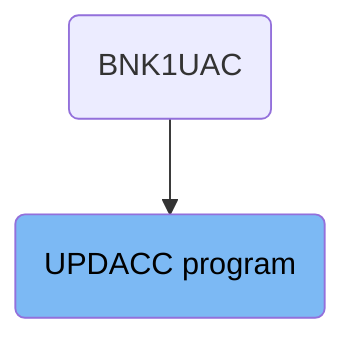
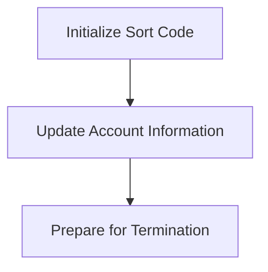
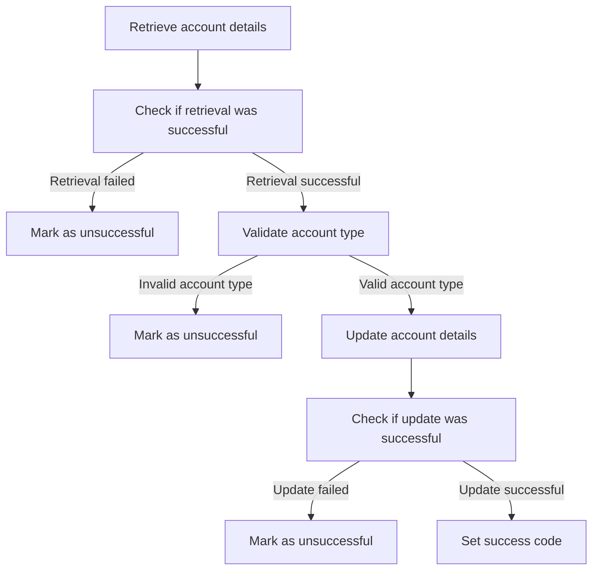
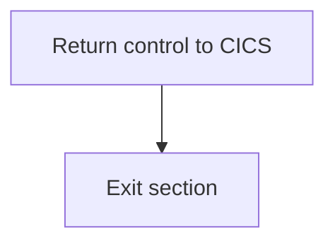

The UPDACC program is responsible for updating account information in the banking system. This process involves initializing the sort code, updating the account details in the database, and preparing for termination. The program ensures that the account information is accurately updated and that all necessary cleanup tasks are completed.

The flow starts with initializing the sort code, followed by updating the account details in the database. After the update, the program checks if the update was successful. If successful, it sets the success code and updates the communication area with the new account details. Finally, the program prepares for termination by performing necessary cleanup tasks and returning control to the CICS region.

# Where is this program used?

This program is used once, in a flow starting from `BNK1UAC` as represented in the following diagram:



## PREMIERE

Lets' zoom into this section of the flow:



<SwmSnippet path="/src/base/cobol_src/UPDACC.cbl" line="161">

---

### Initializing Sort Code

First, the sort code is initialized by moving the value from <SwmToken path="src/base/cobol_src/UPDACC.cbl" pos="161:3:3" line-data="           MOVE SORTCODE TO COMM-SCODE.">`SORTCODE`</SwmToken> to <SwmToken path="src/base/cobol_src/UPDACC.cbl" pos="161:7:9" line-data="           MOVE SORTCODE TO COMM-SCODE.">`COMM-SCODE`</SwmToken> and <SwmToken path="src/base/cobol_src/UPDACC.cbl" pos="162:7:11" line-data="           MOVE SORTCODE TO DESIRED-SORT-CODE.">`DESIRED-SORT-CODE`</SwmToken>. This step ensures that the sort code is correctly set for the subsequent operations.

```cobol
           MOVE SORTCODE TO COMM-SCODE.
           MOVE SORTCODE TO DESIRED-SORT-CODE.
```

---

</SwmSnippet>

<SwmSnippet path="/src/base/cobol_src/UPDACC.cbl" line="167">

---

### Updating Account Information

Next, the account information is updated in the database by performing the <SwmToken path="src/base/cobol_src/UPDACC.cbl" pos="167:3:7" line-data="           PERFORM UPDATE-ACCOUNT-DB2">`UPDATE-ACCOUNT-DB2`</SwmToken> operation. This step ensures that any changes to the account details are saved in the database.

```cobol
           PERFORM UPDATE-ACCOUNT-DB2
```

---

</SwmSnippet>

<SwmSnippet path="/src/base/cobol_src/UPDACC.cbl" line="174">

---

### Preparing for Termination

Then, the process prepares for termination by performing the <SwmToken path="src/base/cobol_src/UPDACC.cbl" pos="174:3:11" line-data="           PERFORM GET-ME-OUT-OF-HERE.">`GET-ME-OUT-OF-HERE`</SwmToken> operation. This step ensures that all necessary cleanup and finalization tasks are completed before the process ends.

```cobol
           PERFORM GET-ME-OUT-OF-HERE.
```

---

</SwmSnippet>

## <SwmToken path="src/base/cobol_src/UPDACC.cbl" pos="167:3:7" line-data="           PERFORM UPDATE-ACCOUNT-DB2">`UPDATE-ACCOUNT-DB2`</SwmToken>

Lets' zoom into this section of the flow:



First, the function retrieves the account details from the database using the provided account number and sort code.

<SwmSnippet path="/src/base/cobol_src/UPDACC.cbl" line="221">

---

Next, it checks if the retrieval was successful by examining the <SwmToken path="src/base/cobol_src/UPDACC.cbl" pos="225:3:3" line-data="           IF SQLCODE NOT = 0">`SQLCODE`</SwmToken>. If the retrieval failed, it marks the operation as unsuccessful and logs the error.

```cobol
      *
      *    Check that the READ was successful. If not mark the return
      *    field as not successful
      *
           IF SQLCODE NOT = 0

              MOVE 'N' TO COMM-SUCCESS
              MOVE SQLCODE TO SQLCODE-DISPLAY
              DISPLAY 'ERROR: UPDACC returned ' SQLCODE-DISPLAY
              ' on SELECT'
              GO TO UAD999

           END-IF.
```

---

</SwmSnippet>

<SwmSnippet path="/src/base/cobol_src/UPDACC.cbl" line="267">

---

If the retrieval was successful, the function then validates the account type to ensure it is not empty or starts with a space. If the account type is invalid, it marks the operation as unsuccessful and logs the error.

```cobol
           IF (COMM-ACC-TYPE = SPACES OR COMM-ACC-TYPE(1:1) = ' ')
              MOVE 'N' TO COMM-SUCCESS
              DISPLAY 'ERROR: UPDACC has invalid account-type'
              GO TO UAD999

```

---

</SwmSnippet>

<SwmSnippet path="/src/base/cobol_src/UPDACC.cbl" line="278">

---

If the account type is valid, the function proceeds to update the account details in the database with the new account type, interest rate, and overdraft limit.

```cobol
           EXEC SQL
              UPDATE ACCOUNT
              SET ACCOUNT_TYPE = :HV-ACCOUNT-ACC-TYPE,
                  ACCOUNT_INTEREST_RATE = :HV-ACCOUNT-INT-RATE,
                  ACCOUNT_OVERDRAFT_LIMIT = :HV-ACCOUNT-OVERDRAFT-LIM
              WHERE (ACCOUNT_SORTCODE = :HV-ACCOUNT-SORTCODE AND
                     ACCOUNT_NUMBER = :HV-ACCOUNT-ACC-NO)
           END-EXEC.
```

---

</SwmSnippet>

<SwmSnippet path="/src/base/cobol_src/UPDACC.cbl" line="290">

---

After updating the account details, it checks if the update was successful by examining the <SwmToken path="src/base/cobol_src/UPDACC.cbl" pos="290:3:3" line-data="           IF SQLCODE NOT = 0">`SQLCODE`</SwmToken>. If the update failed, it marks the operation as unsuccessful and logs the error.

```cobol
           IF SQLCODE NOT = 0
              MOVE 'N' TO COMM-SUCCESS
              MOVE SQLCODE TO SQLCODE-DISPLAY
              DISPLAY 'ERROR: UPDACC returned ' SQLCODE-DISPLAY
              ' on UPDATE'
              GO TO UAD999
           END-IF.
```

---

</SwmSnippet>

<SwmSnippet path="/src/base/cobol_src/UPDACC.cbl" line="302">

---

If the update was successful, the function sets the success code and updates the communication area with the new account details.

```cobol
           MOVE HV-ACCOUNT-EYECATCHER TO COMM-EYE.
           MOVE HV-ACCOUNT-CUST-NO    TO COMM-CUSTNO.
           MOVE HV-ACCOUNT-SORTCODE   TO COMM-SCODE.
           MOVE HV-ACCOUNT-ACC-NO     TO COMM-ACCNO.
           MOVE HV-ACCOUNT-ACC-TYPE   TO COMM-ACC-TYPE.
           MOVE HV-ACCOUNT-INT-RATE   TO COMM-INT-RATE.
           INITIALIZE DB2-DATE-REFORMAT.
           MOVE HV-ACCOUNT-OPENED     TO DB2-DATE-REFORMAT.
           MOVE DB2-DATE-REF-YR       TO COMM-OPENED-YEAR.
           MOVE DB2-DATE-REF-MNTH     TO COMM-OPENED-MONTH.
           MOVE DB2-DATE-REF-DAY      TO COMM-OPENED-DAY.
           MOVE HV-ACCOUNT-OVERDRAFT-LIM TO COMM-OVERDRAFT.
           INITIALIZE DB2-DATE-REFORMAT.
           MOVE HV-ACCOUNT-LAST-STMT  TO DB2-DATE-REFORMAT.
           MOVE DB2-DATE-REF-YR       TO COMM-LASTST-YEAR.
           MOVE DB2-DATE-REF-MNTH     TO COMM-LASTST-MONTH.
           MOVE DB2-DATE-REF-DAY      TO COMM-LASTST-DAY.
           INITIALIZE DB2-DATE-REFORMAT.
           MOVE HV-ACCOUNT-NEXT-STMT  TO DB2-DATE-REFORMAT.
           MOVE DB2-DATE-REF-YR       TO COMM-NEXTST-YEAR.
           MOVE DB2-DATE-REF-MNTH     TO COMM-NEXTST-MONTH.
```

---

</SwmSnippet>

## <SwmToken path="src/base/cobol_src/UPDACC.cbl" pos="174:3:11" line-data="           PERFORM GET-ME-OUT-OF-HERE.">`GET-ME-OUT-OF-HERE`</SwmToken>

Lets' zoom into this section of the flow:



<SwmSnippet path="/src/base/cobol_src/UPDACC.cbl" line="384">

---

First, the <SwmToken path="src/base/cobol_src/UPDACC.cbl" pos="384:1:5" line-data="           EXEC CICS RETURN">`EXEC CICS RETURN`</SwmToken> command is executed to return control to the CICS region after the account update process is completed. This ensures that the CICS transaction is properly terminated and control is handed back to the CICS environment.

```cobol
           EXEC CICS RETURN
           END-EXEC.
```

---

</SwmSnippet>

<SwmSnippet path="/src/base/cobol_src/UPDACC.cbl" line="387">

---

Next, the <SwmToken path="src/base/cobol_src/UPDACC.cbl" pos="388:1:1" line-data="           EXIT.">`EXIT`</SwmToken> statement is executed to exit the <SwmToken path="src/base/cobol_src/UPDACC.cbl" pos="174:3:11" line-data="           PERFORM GET-ME-OUT-OF-HERE.">`GET-ME-OUT-OF-HERE`</SwmToken> section, ensuring that the program flow is properly terminated and no further instructions in this section are executed.

```cobol
       GMOOH999.
           EXIT.
```

---

</SwmSnippet>

&nbsp;

*This is an auto-generated document by Swimm 🌊 and has not yet been verified by a human*

<SwmMeta version="3.0.0" repo-id="Z2l0aHViJTNBJTNBY2ljcy1iYW5raW5nLXNhbXBsZS1hcHBsaWNhdGlvbi1jYnNhLUlCTS1EZW1vJTNBJTNBU3dpbW0tRGVtbw==" repo-name="cics-banking-sample-application-cbsa-IBM-Demo"><sup>Powered by [Swimm](/)</sup></SwmMeta>
