The DBCRFUN program is responsible for updating account records within a banking system. This program ensures that account details are accurately updated by handling various steps such as initializing communication indicators, setting up ABEND handling, moving sort codes, determining account types, and updating account records. The program also manages transaction completion and error handling to maintain data integrity.

The DBCRFUN program starts by initializing communication indicators and setting up ABEND handling to manage errors. It then moves the sort code to the communication area and determines the type of account to access. The program updates the account record and handles transaction completion. If any errors occur, it manages them appropriately to ensure data integrity.

# Where is this program used?

This program is used once, in a flow starting from `BNK1CRA` as represented in the following diagram:

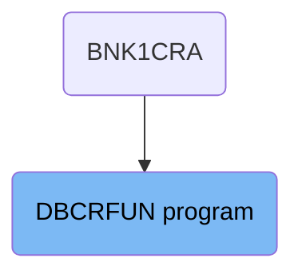

## PREMIERE

Lets' zoom into this section of the flow:

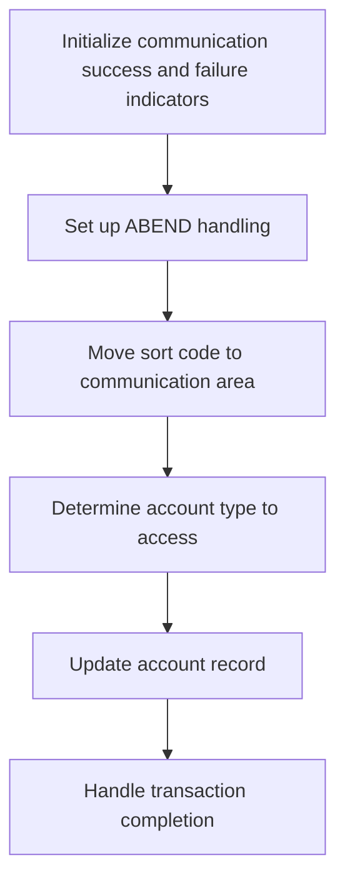

<SwmSnippet path="/src/base/cobol_src/DBCRFUN.cbl" line="200">

---

### Initializing communication success and failure indicators

First, the communication success and failure indicators are initialized to ensure that the transaction status is correctly tracked.

```cobol
       A010.
           MOVE 'N' TO COMM-SUCCESS
           MOVE '0' TO COMM-FAIL-CODE
```

---

</SwmSnippet>

<SwmSnippet path="/src/base/cobol_src/DBCRFUN.cbl" line="207">

---

### Setting up ABEND handling

Moving to the next step, ABEND handling is set up to manage any abnormal terminations during the transaction process. This ensures that any unexpected errors are properly handled.

```cobol
           EXEC CICS HANDLE ABEND
              LABEL(ABEND-HANDLING)
           END-EXEC.
```

---

</SwmSnippet>

<SwmSnippet path="/src/base/cobol_src/DBCRFUN.cbl" line="211">

---

### Moving sort code to communication area

Next, the sort code is moved to the communication area, which is essential for identifying the specific account to be accessed and updated.

```cobol
           MOVE SORTCODE TO COMM-SORTC.
           MOVE SORTCODE TO DESIRED-SORT-CODE.
```

---

</SwmSnippet>

<SwmSnippet path="/src/base/cobol_src/DBCRFUN.cbl" line="215">

---

### Determining account type to access

Then, the type of account datastore to be accessed is determined. This step is crucial for ensuring that the correct account information is retrieved and updated.

```cobol
      *    Determine what kind of ACCOUNT datastore we should
      *    be accessing
      *

```

---

</SwmSnippet>

<SwmSnippet path="/src/base/cobol_src/DBCRFUN.cbl" line="223">

---

### Updating account record

Next, the account record is updated by performing the <SwmToken path="src/base/cobol_src/DBCRFUN.cbl" pos="223:3:7" line-data="            PERFORM UPDATE-ACCOUNT-DB2.">`UPDATE-ACCOUNT-DB2`</SwmToken> operation. This step ensures that the account details are current and accurate.

```cobol
            PERFORM UPDATE-ACCOUNT-DB2.
```

---

</SwmSnippet>

<SwmSnippet path="/src/base/cobol_src/DBCRFUN.cbl" line="229">

---

### Handling transaction completion

Finally, the transaction is completed by performing the <SwmToken path="src/base/cobol_src/DBCRFUN.cbl" pos="229:3:11" line-data="           PERFORM GET-ME-OUT-OF-HERE.">`GET-ME-OUT-OF-HERE`</SwmToken> operation, which finalizes the transaction and ensures that all necessary updates have been made.

```cobol
           PERFORM GET-ME-OUT-OF-HERE.
```

---

</SwmSnippet>

# Update account (<SwmToken path="src/base/cobol_src/DBCRFUN.cbl" pos="223:3:7" line-data="            PERFORM UPDATE-ACCOUNT-DB2.">`UPDATE-ACCOUNT-DB2`</SwmToken>)

Let's split this section into smaller parts:

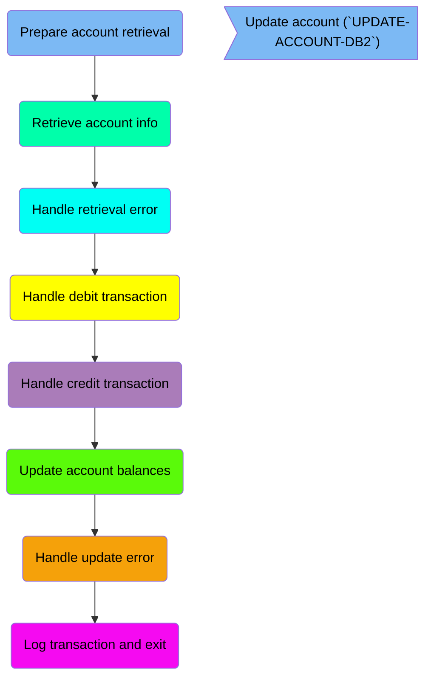

## Prepare account retrieval

First, we'll zoom into this section of the flow:

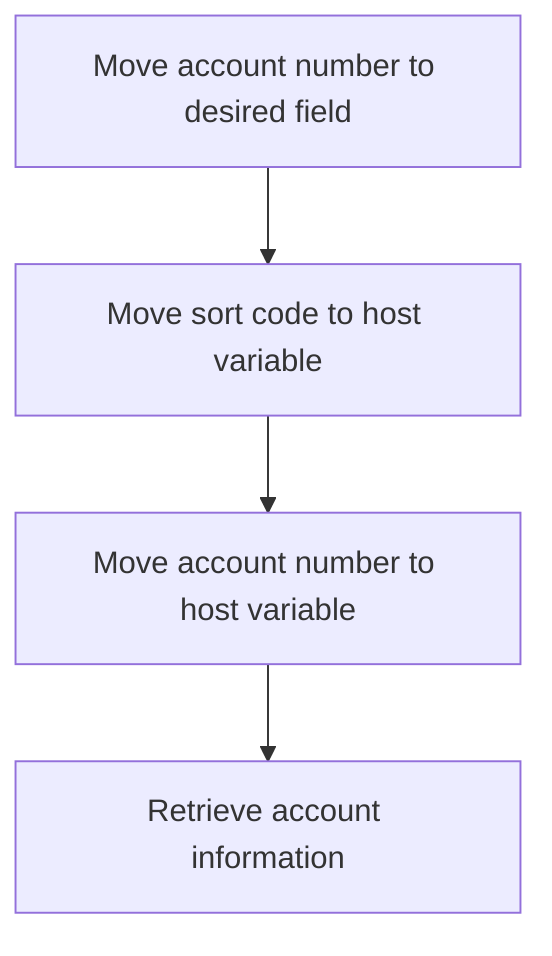

<SwmSnippet path="/src/base/cobol_src/DBCRFUN.cbl" line="238">

---

First, the account number from <SwmToken path="src/base/cobol_src/DBCRFUN.cbl" pos="238:3:5" line-data="           MOVE COMM-ACCNO TO DESIRED-ACC-NO.">`COMM-ACCNO`</SwmToken> is moved to <SwmToken path="src/base/cobol_src/DBCRFUN.cbl" pos="238:9:13" line-data="           MOVE COMM-ACCNO TO DESIRED-ACC-NO.">`DESIRED-ACC-NO`</SwmToken>, setting up the desired account number for the update operation.

```cobol
           MOVE COMM-ACCNO TO DESIRED-ACC-NO.
```

---

</SwmSnippet>

<SwmSnippet path="/src/base/cobol_src/DBCRFUN.cbl" line="239">

---

Next, the sort code and account number are moved to their respective host variables, <SwmToken path="src/base/cobol_src/DBCRFUN.cbl" pos="239:11:15" line-data="           MOVE DESIRED-SORT-CODE TO HV-ACCOUNT-SORTCODE.">`HV-ACCOUNT-SORTCODE`</SwmToken> and <SwmToken path="src/base/cobol_src/DBCRFUN.cbl" pos="240:11:17" line-data="           MOVE DESIRED-ACC-NO TO HV-ACCOUNT-ACC-NO.">`HV-ACCOUNT-ACC-NO`</SwmToken>, preparing the necessary data for the database operation.

```cobol
           MOVE DESIRED-SORT-CODE TO HV-ACCOUNT-SORTCODE.
           MOVE DESIRED-ACC-NO TO HV-ACCOUNT-ACC-NO.
```

---

</SwmSnippet>

## Retrieve account info

This is the next section of the flow.

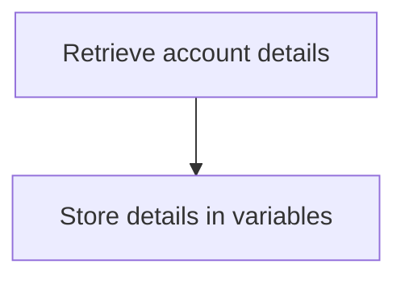

<SwmSnippet path="/src/base/cobol_src/DBCRFUN.cbl" line="245">

---

The <SwmToken path="src/base/cobol_src/DBCRFUN.cbl" pos="223:3:7" line-data="            PERFORM UPDATE-ACCOUNT-DB2.">`UPDATE-ACCOUNT-DB2`</SwmToken> function retrieves account details from the database by executing an SQL <SwmToken path="src/base/cobol_src/DBCRFUN.cbl" pos="246:1:1" line-data="              SELECT ACCOUNT_EYECATCHER,">`SELECT`</SwmToken> statement. This statement fetches various account attributes such as the account eyecatcher, customer number, sort code, account number, account type, interest rate, account opened date, overdraft limit, last statement date, next statement date, available balance, and actual balance. These details are then stored into corresponding host variables for further processing.

```cobol
           EXEC SQL
              SELECT ACCOUNT_EYECATCHER,
                     ACCOUNT_CUSTOMER_NUMBER,
                     ACCOUNT_SORTCODE,
                     ACCOUNT_NUMBER,
                     ACCOUNT_TYPE,
                     ACCOUNT_INTEREST_RATE,
                     ACCOUNT_OPENED,
                     ACCOUNT_OVERDRAFT_LIMIT,
                     ACCOUNT_LAST_STATEMENT,
                     ACCOUNT_NEXT_STATEMENT,
                     ACCOUNT_AVAILABLE_BALANCE,
                     ACCOUNT_ACTUAL_BALANCE
              INTO  :HV-ACCOUNT-EYECATCHER,
                    :HV-ACCOUNT-CUST-NO,
                    :HV-ACCOUNT-SORTCODE,
                    :HV-ACCOUNT-ACC-NO,
                    :HV-ACCOUNT-ACC-TYPE,
                    :HV-ACCOUNT-INT-RATE,
                    :HV-ACCOUNT-OPENED,
                    :HV-ACCOUNT-OVERDRAFT-LIM,
```

---

</SwmSnippet>

## Handle retrieval error

Now, lets zoom into this section of the flow:

```mermaid
graph TD
  A[Check SQLCODE] -->|SQLCODE != 0| B[Set COMM-SUCCESS to 'N']
  B --> C{SQLCODE == 100?}
  C -->|Yes| D[Set COMM-FAIL-CODE to '1']
  C -->|No| E[Set COMM-FAIL-CODE to '2']
  D --> F[Check for Storm Drain Processing]
  E --> F[Check for Storm Drain Processing]
  F --> G[Exit]

%% Swimm:
%% graph TD
%%   A[Check SQLCODE] -->|SQLCODE != 0| B[Set <SwmToken path="src/base/cobol_src/DBCRFUN.cbl" pos="201:9:11" line-data="           MOVE &#39;N&#39; TO COMM-SUCCESS">`COMM-SUCCESS`</SwmToken> to 'N']
%%   B --> C{SQLCODE == 100?}
%%   C -->|Yes| D[Set <SwmToken path="src/base/cobol_src/DBCRFUN.cbl" pos="202:9:13" line-data="           MOVE &#39;0&#39; TO COMM-FAIL-CODE">`COMM-FAIL-CODE`</SwmToken> to '1']
%%   C -->|No| E[Set <SwmToken path="src/base/cobol_src/DBCRFUN.cbl" pos="202:9:13" line-data="           MOVE &#39;0&#39; TO COMM-FAIL-CODE">`COMM-FAIL-CODE`</SwmToken> to '2']
%%   D --> F[Check for Storm Drain Processing]
%%   E --> F[Check for Storm Drain Processing]
%%   F --> G[Exit]
```

<SwmSnippet path="/src/base/cobol_src/DBCRFUN.cbl" line="279">

---

First, the function checks if the <SwmToken path="src/base/cobol_src/DBCRFUN.cbl" pos="279:3:3" line-data="           IF SQLCODE NOT = 0">`SQLCODE`</SwmToken> (which indicates the result of the SQL operation) is not equal to 0, meaning the SQL operation was unsuccessful.

```cobol
           IF SQLCODE NOT = 0
```

---

</SwmSnippet>

<SwmSnippet path="/src/base/cobol_src/DBCRFUN.cbl" line="281">

---

Moving to the next step, if the SQL operation was unsuccessful, the function sets <SwmToken path="src/base/cobol_src/DBCRFUN.cbl" pos="281:9:11" line-data="              MOVE &#39;N&#39; TO COMM-SUCCESS">`COMM-SUCCESS`</SwmToken> to 'N' (indicating the operation did not succeed).

```cobol
              MOVE 'N' TO COMM-SUCCESS
```

---

</SwmSnippet>

<SwmSnippet path="/src/base/cobol_src/DBCRFUN.cbl" line="283">

---

Next, the function checks if the <SwmToken path="src/base/cobol_src/DBCRFUN.cbl" pos="283:3:3" line-data="              IF SQLCODE = +100">`SQLCODE`</SwmToken> is equal to +100, which typically indicates that no rows were found. If this is the case, it sets <SwmToken path="src/base/cobol_src/DBCRFUN.cbl" pos="284:9:13" line-data="                 MOVE &#39;1&#39; TO COMM-FAIL-CODE">`COMM-FAIL-CODE`</SwmToken> to '1'. Otherwise, it sets <SwmToken path="src/base/cobol_src/DBCRFUN.cbl" pos="284:9:13" line-data="                 MOVE &#39;1&#39; TO COMM-FAIL-CODE">`COMM-FAIL-CODE`</SwmToken> to '2', indicating a different type of failure.

```cobol
              IF SQLCODE = +100
                 MOVE '1' TO COMM-FAIL-CODE
              ELSE
                 MOVE '2' TO COMM-FAIL-CODE
              END-IF
```

---

</SwmSnippet>

<SwmSnippet path="/src/base/cobol_src/DBCRFUN.cbl" line="293">

---

Then, the function performs a check for Storm Drain processing by calling <SwmToken path="src/base/cobol_src/DBCRFUN.cbl" pos="293:3:11" line-data="              PERFORM CHECK-FOR-STORM-DRAIN-DB2">`CHECK-FOR-STORM-DRAIN-DB2`</SwmToken>, which handles specific workload processing if activated, and finally exits the function.

```cobol
              PERFORM CHECK-FOR-STORM-DRAIN-DB2

              GO TO UAD999
```

---

</SwmSnippet>

## Handle debit transaction

Now, lets zoom into this section of the flow:

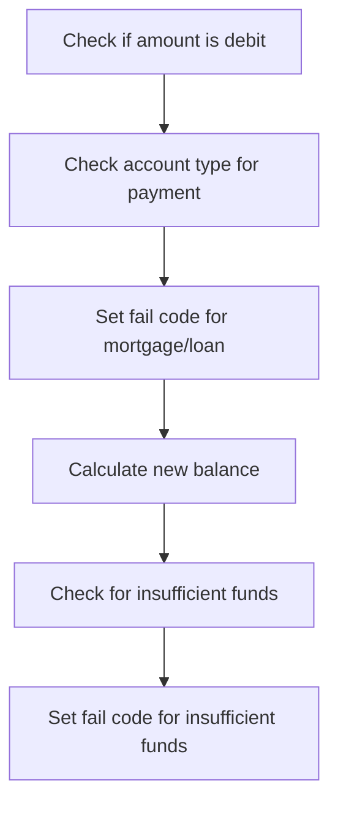

<SwmSnippet path="/src/base/cobol_src/DBCRFUN.cbl" line="307">

---

First, the function checks if the transaction amount (<SwmToken path="src/base/cobol_src/DBCRFUN.cbl" pos="307:3:5" line-data="           IF COMM-AMT &lt; 0">`COMM-AMT`</SwmToken>) is a debit (negative value). This is important because debit transactions require sufficient funds in the account.

```cobol
           IF COMM-AMT < 0
```

---

</SwmSnippet>

<SwmSnippet path="/src/base/cobol_src/DBCRFUN.cbl" line="330">

---

Next, if the transaction is a debit, the function checks if the account type is either 'MORTGAGE' or 'LOAN' and if the transaction is a payment (<SwmToken path="src/base/cobol_src/DBCRFUN.cbl" pos="331:3:5" line-data="              AND COMM-FACILTYPE = 496)">`COMM-FACILTYPE`</SwmToken> equals 496). This ensures that payments from these account types are handled differently.

```cobol
              IF (HV-ACCOUNT-ACC-TYPE = 'MORTGAGE'
              AND COMM-FACILTYPE = 496)
              OR (HV-ACCOUNT-ACC-TYPE = 'LOAN    '
              AND COMM-FACILTYPE = 496)
```

---

</SwmSnippet>

<SwmSnippet path="/src/base/cobol_src/DBCRFUN.cbl" line="334">

---

If the account type is 'MORTGAGE' or 'LOAN' and the transaction is a payment, the function sets the fail code to '4' and marks the transaction as unsuccessful. This prevents payments from these account types.

```cobol
                 MOVE 'N' TO COMM-SUCCESS
                 MOVE '4' TO COMM-FAIL-CODE

                 GO TO UAD999
              END-IF
```

---

</SwmSnippet>

<SwmSnippet path="/src/base/cobol_src/DBCRFUN.cbl" line="340">

---

Moving to the next step, the function calculates the new balance (<SwmToken path="src/base/cobol_src/DBCRFUN.cbl" pos="340:7:9" line-data="              MOVE 0 TO WS-DIFFERENCE">`WS-DIFFERENCE`</SwmToken>) by adding the transaction amount to the available balance (<SwmToken path="src/base/cobol_src/DBCRFUN.cbl" pos="341:9:15" line-data="              COMPUTE WS-DIFFERENCE = HV-ACCOUNT-AVAIL-BAL">`HV-ACCOUNT-AVAIL-BAL`</SwmToken>). This helps determine if there are sufficient funds for the transaction.

```cobol
              MOVE 0 TO WS-DIFFERENCE
              COMPUTE WS-DIFFERENCE = HV-ACCOUNT-AVAIL-BAL
                 + COMM-AMT
```

---

</SwmSnippet>

<SwmSnippet path="/src/base/cobol_src/DBCRFUN.cbl" line="344">

---

Then, the function checks if the new balance is less than zero and if the transaction is a payment. If both conditions are met, it indicates insufficient funds for the transaction.

```cobol
              IF WS-DIFFERENCE < 0 AND COMM-FACILTYPE = 496
```

---

</SwmSnippet>

<SwmSnippet path="/src/base/cobol_src/DBCRFUN.cbl" line="346">

---

Finally, if there are insufficient funds, the function sets the fail code to '3' and marks the transaction as unsuccessful. This ensures that transactions with insufficient funds are not processed.

```cobol
                 MOVE 'N' TO COMM-SUCCESS
                 MOVE '3' TO COMM-FAIL-CODE

                 GO TO UAD999
              END-IF
```

---

</SwmSnippet>

## Handle credit transaction

This is the next section of the flow.

```mermaid
graph TD
  A[Check if account type is MORTGAGE or LOAN] --> B{Is COMM-FACILTYPE 496?}
  B -- Yes --> C[Set COMM-SUCCESS to 'N']
  C --> D[Set COMM-FAIL-CODE to '4']
  D --> E[Remove record lock and finish]

%% Swimm:
%% graph TD
%%   A[Check if account type is MORTGAGE or LOAN] --> B{Is <SwmToken path="src/base/cobol_src/DBCRFUN.cbl" pos="331:3:5" line-data="              AND COMM-FACILTYPE = 496)">`COMM-FACILTYPE`</SwmToken> 496?}
%%   B -- Yes --> C[Set <SwmToken path="src/base/cobol_src/DBCRFUN.cbl" pos="201:9:11" line-data="           MOVE &#39;N&#39; TO COMM-SUCCESS">`COMM-SUCCESS`</SwmToken> to 'N']
%%   C --> D[Set <SwmToken path="src/base/cobol_src/DBCRFUN.cbl" pos="202:9:13" line-data="           MOVE &#39;0&#39; TO COMM-FAIL-CODE">`COMM-FAIL-CODE`</SwmToken> to '4']
%%   D --> E[Remove record lock and finish]
```

<SwmSnippet path="/src/base/cobol_src/DBCRFUN.cbl" line="368">

---

First, the function checks if the account type is either 'MORTGAGE' or 'LOAN' and if the <SwmToken path="src/base/cobol_src/DBCRFUN.cbl" pos="369:1:3" line-data="           COMM-FACILTYPE = 496)">`COMM-FACILTYPE`</SwmToken> is 496 (indicating a payment request).

```cobol
           IF (HV-ACCOUNT-ACC-TYPE = 'MORTGAGE' AND
           COMM-FACILTYPE = 496)
           OR (HV-ACCOUNT-ACC-TYPE = 'LOAN    '
           AND COMM-FACILTYPE = 496)
```

---

</SwmSnippet>

<SwmSnippet path="/src/base/cobol_src/DBCRFUN.cbl" line="372">

---

Next, if the conditions are met, it sets <SwmToken path="src/base/cobol_src/DBCRFUN.cbl" pos="372:9:11" line-data="              MOVE &#39;N&#39; TO COMM-SUCCESS">`COMM-SUCCESS`</SwmToken> to 'N' (indicating failure) and <SwmToken path="src/base/cobol_src/DBCRFUN.cbl" pos="373:9:13" line-data="              MOVE &#39;4&#39; TO COMM-FAIL-CODE">`COMM-FAIL-CODE`</SwmToken> to '4', then removes the record lock and finishes the process.

```cobol
              MOVE 'N' TO COMM-SUCCESS
              MOVE '4' TO COMM-FAIL-CODE

              GO TO UAD999
           END-IF.
```

---

</SwmSnippet>

## Update account balances

This is the next section of the flow.

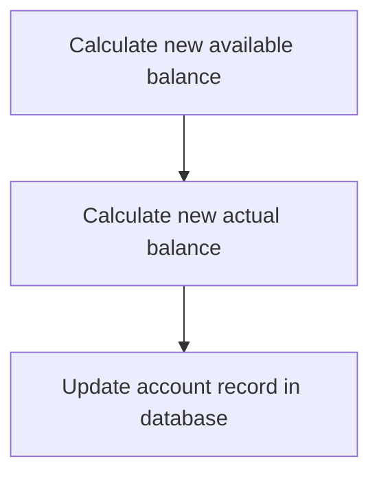

<SwmSnippet path="/src/base/cobol_src/DBCRFUN.cbl" line="384">

---

First, the available balance of the account is updated by adding the transaction amount to <SwmToken path="src/base/cobol_src/DBCRFUN.cbl" pos="384:3:9" line-data="           COMPUTE HV-ACCOUNT-AVAIL-BAL =">`HV-ACCOUNT-AVAIL-BAL`</SwmToken> (the current available balance).

```cobol
           COMPUTE HV-ACCOUNT-AVAIL-BAL =
              HV-ACCOUNT-AVAIL-BAL + COMM-AMT.
```

---

</SwmSnippet>

<SwmSnippet path="/src/base/cobol_src/DBCRFUN.cbl" line="386">

---

Next, the actual balance of the account is updated by adding the transaction amount to <SwmToken path="src/base/cobol_src/DBCRFUN.cbl" pos="386:3:9" line-data="           COMPUTE HV-ACCOUNT-ACTUAL-BAL =">`HV-ACCOUNT-ACTUAL-BAL`</SwmToken> (the current actual balance).

```cobol
           COMPUTE HV-ACCOUNT-ACTUAL-BAL =
              HV-ACCOUNT-ACTUAL-BAL + COMM-AMT.
```

---

</SwmSnippet>

## Handle update error

Now, lets zoom into this section of the flow:

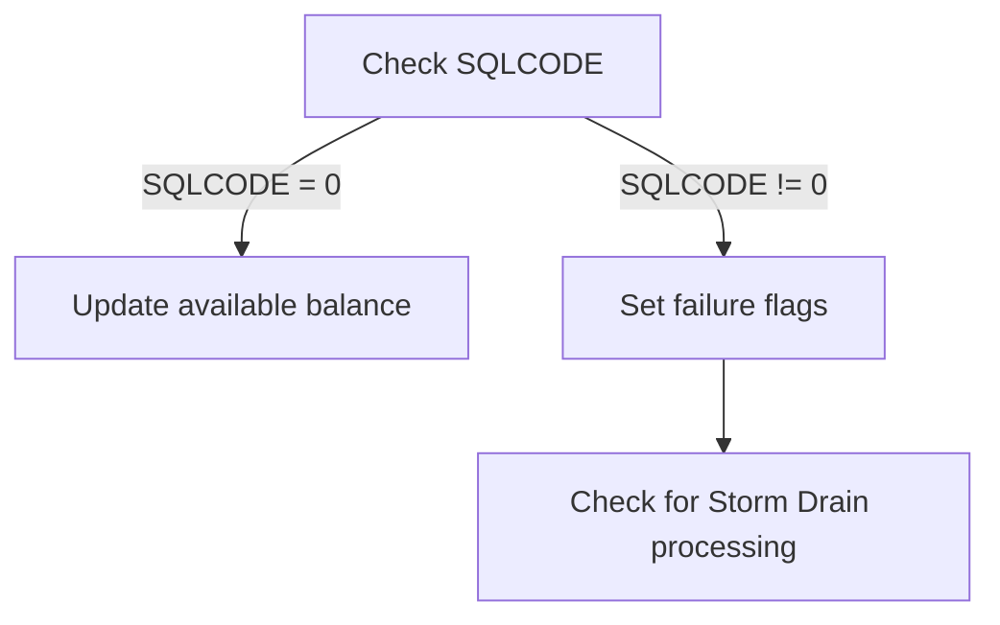

<SwmSnippet path="/src/base/cobol_src/DBCRFUN.cbl" line="414">

---

### Check SQLCODE

First, the code checks the <SwmToken path="src/base/cobol_src/DBCRFUN.cbl" pos="414:3:3" line-data="           MOVE SQLCODE TO SQLCODE-DISPLAY.">`SQLCODE`</SwmToken> to determine if the database update operation was successful. The <SwmToken path="src/base/cobol_src/DBCRFUN.cbl" pos="414:3:3" line-data="           MOVE SQLCODE TO SQLCODE-DISPLAY.">`SQLCODE`</SwmToken> is moved to <SwmToken path="src/base/cobol_src/DBCRFUN.cbl" pos="414:7:9" line-data="           MOVE SQLCODE TO SQLCODE-DISPLAY.">`SQLCODE-DISPLAY`</SwmToken> for further evaluation.

```cobol
           MOVE SQLCODE TO SQLCODE-DISPLAY.

```

---

</SwmSnippet>

<SwmSnippet path="/src/base/cobol_src/DBCRFUN.cbl" line="416">

---

### Update available balance

Moving to the next step, if the <SwmToken path="src/base/cobol_src/DBCRFUN.cbl" pos="279:3:3" line-data="           IF SQLCODE NOT = 0">`SQLCODE`</SwmToken> indicates success (i.e., <SwmToken path="src/base/cobol_src/DBCRFUN.cbl" pos="279:3:3" line-data="           IF SQLCODE NOT = 0">`SQLCODE`</SwmToken>` = 0`), the amended available balance (<SwmToken path="src/base/cobol_src/DBCRFUN.cbl" pos="416:3:9" line-data="           MOVE HV-ACCOUNT-AVAIL-BAL TO">`HV-ACCOUNT-AVAIL-BAL`</SwmToken>) and actual balance (<SwmToken path="src/base/cobol_src/DBCRFUN.cbl" pos="418:3:9" line-data="           MOVE HV-ACCOUNT-ACTUAL-BAL TO">`HV-ACCOUNT-ACTUAL-BAL`</SwmToken>) are passed back to the communication area by moving them to <SwmToken path="src/base/cobol_src/DBCRFUN.cbl" pos="417:1:5" line-data="              COMM-AV-BAL.">`COMM-AV-BAL`</SwmToken> and <SwmToken path="src/base/cobol_src/DBCRFUN.cbl" pos="419:1:5" line-data="              COMM-ACT-BAL.">`COMM-ACT-BAL`</SwmToken> respectively.

```cobol
           MOVE HV-ACCOUNT-AVAIL-BAL TO
              COMM-AV-BAL.
           MOVE HV-ACCOUNT-ACTUAL-BAL TO
              COMM-ACT-BAL.
```

---

</SwmSnippet>

<SwmSnippet path="/src/base/cobol_src/DBCRFUN.cbl" line="425">

---

### Set failure flags

Then, if the <SwmToken path="src/base/cobol_src/DBCRFUN.cbl" pos="425:3:3" line-data="           IF SQLCODE NOT = 0">`SQLCODE`</SwmToken> is not equal to 0, indicating a failure in the database update operation, the code sets the <SwmToken path="src/base/cobol_src/DBCRFUN.cbl" pos="426:9:11" line-data="              MOVE &#39;N&#39; TO COMM-SUCCESS">`COMM-SUCCESS`</SwmToken> flag to 'N' and the <SwmToken path="src/base/cobol_src/DBCRFUN.cbl" pos="427:9:13" line-data="              MOVE &#39;2&#39; TO COMM-FAIL-CODE">`COMM-FAIL-CODE`</SwmToken> to '2' to indicate the failure.

```cobol
           IF SQLCODE NOT = 0
              MOVE 'N' TO COMM-SUCCESS
              MOVE '2' TO COMM-FAIL-CODE
```

---

</SwmSnippet>

<SwmSnippet path="/src/base/cobol_src/DBCRFUN.cbl" line="429">

---

### Check for Storm Drain processing

Finally, the code checks if the <SwmToken path="src/base/cobol_src/DBCRFUN.cbl" pos="429:7:7" line-data="      *       Check if SQLCODE indicates that Storm Drain processing">`SQLCODE`</SwmToken> indicates that Storm Drain processing is applicable in the workload if activated. This is done by performing the <SwmToken path="src/base/cobol_src/DBCRFUN.cbl" pos="432:3:11" line-data="              PERFORM CHECK-FOR-STORM-DRAIN-DB2">`CHECK-FOR-STORM-DRAIN-DB2`</SwmToken> routine.

```cobol
      *       Check if SQLCODE indicates that Storm Drain processing
      *       is applicable in a workload if activated
      *
              PERFORM CHECK-FOR-STORM-DRAIN-DB2
```

---

</SwmSnippet>

## Log transaction and exit

Now, lets zoom into this section of the flow:

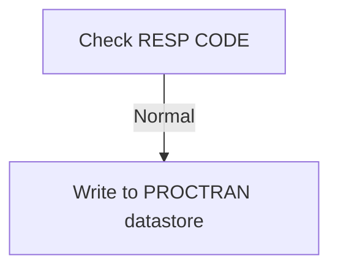

First, the code checks if the response code (<SwmToken path="src/base/cobol_src/DBCRFUN.cbl" pos="438:7:9" line-data="      *    If the RESP CODE was normal then we need to write to the">`RESP CODE`</SwmToken>) from the previous operation was normal. This ensures that the previous database operation was successful and there were no errors.

<SwmSnippet path="/src/base/cobol_src/DBCRFUN.cbl" line="435">

---

Next, if the response code is normal, the program proceeds to write the transaction details to the <SwmToken path="src/base/cobol_src/DBCRFUN.cbl" pos="439:3:3" line-data="      *    PROCTRAN (processed transaction) datastore.">`PROCTRAN`</SwmToken> datastore. This step is crucial for maintaining a record of processed transactions, which is essential for auditing and tracking purposes.

```cobol
           END-IF.

      *
      *    If the RESP CODE was normal then we need to write to the
      *    PROCTRAN (processed transaction) datastore.
      *
           PERFORM WRITE-TO-PROCTRAN.
```

---

</SwmSnippet>

<SwmSnippet path="/src/base/cobol_src/DBCRFUN.cbl" line="443">

---

Finally, the program exits the <SwmToken path="src/base/cobol_src/DBCRFUN.cbl" pos="223:3:7" line-data="            PERFORM UPDATE-ACCOUNT-DB2.">`UPDATE-ACCOUNT-DB2`</SwmToken> function, indicating the end of the account update process.

```cobol
       UAD999.
           EXIT.
```

---

</SwmSnippet>

## <SwmToken path="src/base/cobol_src/DBCRFUN.cbl" pos="293:3:11" line-data="              PERFORM CHECK-FOR-STORM-DRAIN-DB2">`CHECK-FOR-STORM-DRAIN-DB2`</SwmToken>

Lets' zoom into this section of the flow:

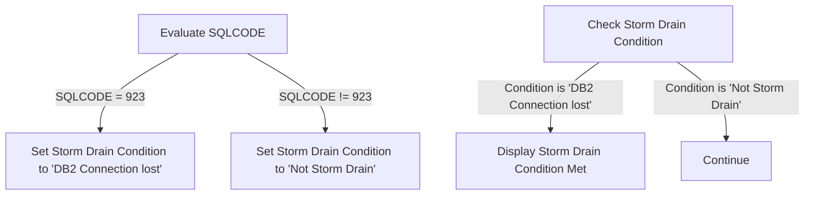

<SwmSnippet path="/src/base/cobol_src/DBCRFUN.cbl" line="675">

---

First, the function evaluates the <SwmToken path="src/base/cobol_src/DBCRFUN.cbl" pos="675:3:3" line-data="           EVALUATE SQLCODE">`SQLCODE`</SwmToken> to determine the status of the <SwmToken path="src/base/cobol_src/DBCRFUN.cbl" pos="223:7:7" line-data="            PERFORM UPDATE-ACCOUNT-DB2.">`DB2`</SwmToken> connection.

```cobol
           EVALUATE SQLCODE
```

---

</SwmSnippet>

<SwmSnippet path="/src/base/cobol_src/DBCRFUN.cbl" line="677">

---

If the <SwmToken path="src/base/cobol_src/DBCRFUN.cbl" pos="279:3:3" line-data="           IF SQLCODE NOT = 0">`SQLCODE`</SwmToken> is 923, it indicates that the <SwmToken path="src/base/cobol_src/DBCRFUN.cbl" pos="678:4:4" line-data="                 MOVE &#39;DB2 Connection lost &#39; TO STORM-DRAIN-CONDITION">`DB2`</SwmToken> connection is lost, and the <SwmToken path="src/base/cobol_src/DBCRFUN.cbl" pos="678:14:18" line-data="                 MOVE &#39;DB2 Connection lost &#39; TO STORM-DRAIN-CONDITION">`STORM-DRAIN-CONDITION`</SwmToken> is set to '<SwmToken path="src/base/cobol_src/DBCRFUN.cbl" pos="678:4:4" line-data="                 MOVE &#39;DB2 Connection lost &#39; TO STORM-DRAIN-CONDITION">`DB2`</SwmToken> Connection lost'.

```cobol
              WHEN 923
                 MOVE 'DB2 Connection lost ' TO STORM-DRAIN-CONDITION
```

---

</SwmSnippet>

<SwmSnippet path="/src/base/cobol_src/DBCRFUN.cbl" line="680">

---

If the <SwmToken path="src/base/cobol_src/DBCRFUN.cbl" pos="279:3:3" line-data="           IF SQLCODE NOT = 0">`SQLCODE`</SwmToken> is anything other than 923, the <SwmToken path="src/base/cobol_src/DBCRFUN.cbl" pos="681:14:18" line-data="                 MOVE &#39;Not Storm Drain     &#39; TO STORM-DRAIN-CONDITION">`STORM-DRAIN-CONDITION`</SwmToken> is set to 'Not Storm Drain'.

```cobol
              WHEN OTHER
                 MOVE 'Not Storm Drain     ' TO STORM-DRAIN-CONDITION
```

---

</SwmSnippet>

<SwmSnippet path="/src/base/cobol_src/DBCRFUN.cbl" line="685">

---

Next, the function checks if the <SwmToken path="src/base/cobol_src/DBCRFUN.cbl" pos="685:3:7" line-data="           IF STORM-DRAIN-CONDITION NOT EQUAL &#39;Not Storm Drain     &#39;">`STORM-DRAIN-CONDITION`</SwmToken> is not equal to 'Not Storm Drain'.

```cobol
           IF STORM-DRAIN-CONDITION NOT EQUAL 'Not Storm Drain     '
```

---

</SwmSnippet>

<SwmSnippet path="/src/base/cobol_src/DBCRFUN.cbl" line="686">

---

If the condition is met, it displays a message indicating that the storm drain condition has been met, along with the <SwmToken path="src/base/cobol_src/DBCRFUN.cbl" pos="688:11:11" line-data="                      &#39;has been met (&#39; SQLCODE-DISPLAY &#39;).&#39;">`SQLCODE`</SwmToken>.

```cobol
              DISPLAY 'DBCRFUN: Check-For-Storm-Drain-DB2: Storm '
                      'Drain condition (' STORM-DRAIN-CONDITION ') '
                      'has been met (' SQLCODE-DISPLAY ').'
```

---

</SwmSnippet>

<SwmSnippet path="/src/base/cobol_src/DBCRFUN.cbl" line="689">

---

If the condition is not met, the function simply continues without any further action.

```cobol
           ELSE

              CONTINUE
           END-IF.
```

---

</SwmSnippet>

## <SwmToken path="src/base/cobol_src/DBCRFUN.cbl" pos="441:3:7" line-data="           PERFORM WRITE-TO-PROCTRAN.">`WRITE-TO-PROCTRAN`</SwmToken>

Lets' zoom into this section of the flow:

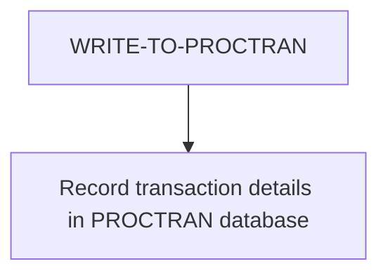

<SwmSnippet path="/src/base/cobol_src/DBCRFUN.cbl" line="447">

---

First, the <SwmToken path="src/base/cobol_src/DBCRFUN.cbl" pos="447:1:5" line-data="       WRITE-TO-PROCTRAN SECTION.">`WRITE-TO-PROCTRAN`</SwmToken> section is initiated to handle the recording of transaction details.

```cobol
       WRITE-TO-PROCTRAN SECTION.
       WTP010.
```

---

</SwmSnippet>

<SwmSnippet path="/src/base/cobol_src/DBCRFUN.cbl" line="454">

---

Moving to the main logic, the <SwmToken path="src/base/cobol_src/DBCRFUN.cbl" pos="454:3:9" line-data="            PERFORM WRITE-TO-PROCTRAN-DB2.">`WRITE-TO-PROCTRAN-DB2`</SwmToken> section is performed to record the transaction details into the PROCTRAN database. This involves capturing the current time and date, determining whether the transaction is a debit or credit, and handling exceptions to ensure transaction consistency.

```cobol
            PERFORM WRITE-TO-PROCTRAN-DB2.
```

---

</SwmSnippet>

<SwmSnippet path="/src/base/cobol_src/DBCRFUN.cbl" line="456">

---

Finally, the section concludes with an exit statement, marking the end of the <SwmToken path="src/base/cobol_src/DBCRFUN.cbl" pos="441:3:7" line-data="           PERFORM WRITE-TO-PROCTRAN.">`WRITE-TO-PROCTRAN`</SwmToken> section.

```cobol
       WTP999.
           EXIT.
```

---

</SwmSnippet>

## <SwmToken path="src/base/cobol_src/DBCRFUN.cbl" pos="454:3:9" line-data="            PERFORM WRITE-TO-PROCTRAN-DB2.">`WRITE-TO-PROCTRAN-DB2`</SwmToken>

Lets' zoom into this section of the flow:

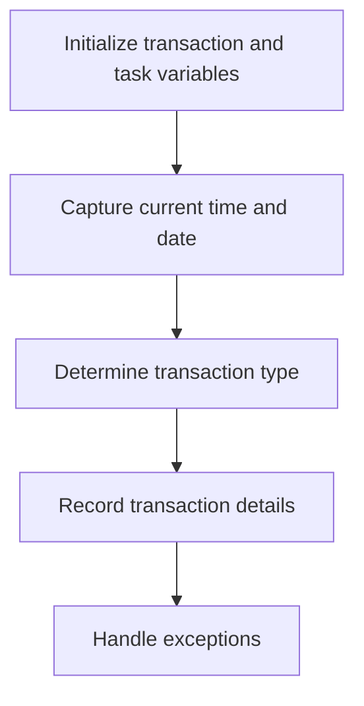

<SwmSnippet path="/src/base/cobol_src/DBCRFUN.cbl" line="460">

---

First, the section initializes the transaction and task-related variables to prepare for recording the transaction details.

```cobol
       WRITE-TO-PROCTRAN-DB2 SECTION.
       WTPD010.

           INITIALIZE HOST-PROCTRAN-ROW.
           INITIALIZE WS-EIBTASKN12.

```

---

</SwmSnippet>

<SwmSnippet path="/src/base/cobol_src/DBCRFUN.cbl" line="475">

---

Moving to capturing the current time and date, the code uses CICS commands to get the current time and format it appropriately.

```cobol
           EXEC CICS ASKTIME
              ABSTIME(WS-U-TIME)
           END-EXEC.

           EXEC CICS FORMATTIME
                     ABSTIME(WS-U-TIME)
                     DDMMYYYY(WS-ORIG-DATE)
                     TIME(HV-PROCTRAN-TIME)
                     DATESEP('.')
           END-EXEC.
```

---

</SwmSnippet>

<SwmSnippet path="/src/base/cobol_src/DBCRFUN.cbl" line="491">

---

Next, the section determines whether the transaction is a debit or credit by checking the value of <SwmToken path="src/base/cobol_src/DBCRFUN.cbl" pos="491:3:5" line-data="           IF COMM-AMT &lt; 0">`COMM-AMT`</SwmToken> (the transaction amount).

```cobol
           IF COMM-AMT < 0
              MOVE 'DEB' TO HV-PROCTRAN-TYPE
              MOVE 'COUNTER WTHDRW' TO HV-PROCTRAN-DESC

      *
      *       If it is a debit from a PAYMENT
      *
              IF COMM-FACILTYPE = 496
                 MOVE 'PDR' TO HV-PROCTRAN-TYPE
                 MOVE COMM-ORIGIN(1:14) TO
                    HV-PROCTRAN-DESC
              END-IF

           ELSE
              MOVE 'CRE' TO HV-PROCTRAN-TYPE
              MOVE 'COUNTER RECVED' TO HV-PROCTRAN-DESC

```

---

</SwmSnippet>

<SwmSnippet path="/src/base/cobol_src/DBCRFUN.cbl" line="497">

---

Then, it further checks if the transaction is related to a payment by evaluating <SwmToken path="src/base/cobol_src/DBCRFUN.cbl" pos="498:3:5" line-data="              IF COMM-FACILTYPE = 496">`COMM-FACILTYPE`</SwmToken>.

```cobol
      *
              IF COMM-FACILTYPE = 496
                 MOVE 'PDR' TO HV-PROCTRAN-TYPE
                 MOVE COMM-ORIGIN(1:14) TO
                    HV-PROCTRAN-DESC
              END-IF

           ELSE
              MOVE 'CRE' TO HV-PROCTRAN-TYPE
              MOVE 'COUNTER RECVED' TO HV-PROCTRAN-DESC

      *
      *       If it is a credit from a PAYMENT
      *
              IF COMM-FACILTYPE = 496
                 MOVE 'PCR' TO HV-PROCTRAN-TYPE
                 MOVE COMM-ORIGIN(1:14) TO
                    HV-PROCTRAN-DESC
              END-IF
```

---

</SwmSnippet>

<SwmSnippet path="/src/base/cobol_src/DBCRFUN.cbl" line="524">

---

After determining the transaction type, the section records the transaction details into the <SwmToken path="src/base/cobol_src/DBCRFUN.cbl" pos="525:5:5" line-data="              INSERT INTO PROCTRAN">`PROCTRAN`</SwmToken> database.

```cobol
           EXEC SQL
              INSERT INTO PROCTRAN
                     (
                      PROCTRAN_EYECATCHER,
                      PROCTRAN_SORTCODE,
                      PROCTRAN_NUMBER,
                      PROCTRAN_DATE,
                      PROCTRAN_TIME,
                      PROCTRAN_REF,
                      PROCTRAN_TYPE,
                      PROCTRAN_DESC,
                      PROCTRAN_AMOUNT
                     )
              VALUES
                     (
                      :HV-PROCTRAN-EYECATCHER,
                      :HV-PROCTRAN-SORT-CODE,
                      :HV-PROCTRAN-ACC-NUMBER,
                      :HV-PROCTRAN-DATE,
                      :HV-PROCTRAN-TIME,
                      :HV-PROCTRAN-REF,
```

---

</SwmSnippet>

<SwmSnippet path="/src/base/cobol_src/DBCRFUN.cbl" line="553">

---

If there is an error during the database write operation, the section handles exceptions by checking the <SwmToken path="src/base/cobol_src/DBCRFUN.cbl" pos="554:3:3" line-data="           IF SQLCODE NOT = 0">`SQLCODE`</SwmToken> and performing a rollback if necessary.

```cobol
      *
           IF SQLCODE NOT = 0
              MOVE SQLCODE TO SQLCODE-DISPLAY

              DISPLAY 'UNABLE TO WRITE TO PROCTRAN DB2 DATASTORE'
              ' SQLCODE=' SQLCODE-DISPLAY
              'WITH THE FOLLOWING DATA:' HOST-PROCTRAN-ROW
      *
      *       You need to issue a ROLLBACK to get rid of the updated
      *       ACCOUNT record
      *
              EXEC CICS SYNCPOINT ROLLBACK
                 RESP(WS-CICS-RESP)
                 RESP2(WS-CICS-RESP2)
              END-EXEC
```

---

</SwmSnippet>

<SwmSnippet path="/src/base/cobol_src/DBCRFUN.cbl" line="576">

---

In case of a rollback failure, the section captures additional information and links to the <SwmToken path="src/base/cobol_src/DBCRFUN.cbl" pos="185:19:19" line-data="       01 WS-ABEND-PGM                  PIC X(8)      VALUE &#39;ABNDPROC&#39;.">`ABNDPROC`</SwmToken> program for abnormal termination processing.

```cobol
                 INITIALIZE ABNDINFO-REC
                 MOVE EIBRESP    TO ABND-RESPCODE
                 MOVE EIBRESP2   TO ABND-RESP2CODE
      *
      *          Get supplemental information
      *
                 EXEC CICS ASSIGN APPLID(ABND-APPLID)
                 END-EXEC

                 MOVE EIBTASKN   TO ABND-TASKNO-KEY
                 MOVE EIBTRNID   TO ABND-TRANID

                 PERFORM POPULATE-TIME-DATE

                 MOVE WS-ORIG-DATE TO ABND-DATE
                 STRING WS-TIME-NOW-GRP-HH DELIMITED BY SIZE,
                       ':' DELIMITED BY SIZE,
                        WS-TIME-NOW-GRP-MM DELIMITED BY SIZE,
                        ':' DELIMITED BY SIZE,
                        WS-TIME-NOW-GRP-MM DELIMITED BY SIZE
                        INTO ABND-TIME
```

---

</SwmSnippet>

<SwmSnippet path="/src/base/cobol_src/DBCRFUN.cbl" line="636">

---

Finally, the section updates the success or failure status of the transaction based on the outcome of the database write operation.

More about ABNDPROC: <SwmLink doc-title="Writing Abend Records (ABNDPROC)">[Writing Abend Records (ABNDPROC)](/.swm/writing-abend-records-abndproc.svfj4jn5.sw.md)</SwmLink>

```cobol
              MOVE 'N' TO COMM-SUCCESS
              MOVE '02' TO COMM-FAIL-CODE
      *
      *       Check if SQLCODE indicates that Storm Drain processing
      *       is applicable in a workload if activated
      *
              PERFORM CHECK-FOR-STORM-DRAIN-DB2

           ELSE

      *
      *       If the WRITE to PROCTRAN worked then it was a success
      *
              MOVE 'Y' TO COMM-SUCCESS
              MOVE '0' TO COMM-FAIL-CODE

           END-IF.
```

---

</SwmSnippet>

## <SwmToken path="src/base/cobol_src/DBCRFUN.cbl" pos="588:3:7" line-data="                 PERFORM POPULATE-TIME-DATE">`POPULATE-TIME-DATE`</SwmToken>

Lets' zoom into this section of the flow:

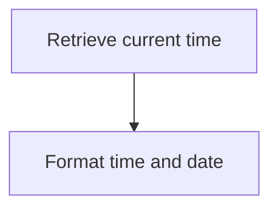

<SwmSnippet path="/src/base/cobol_src/DBCRFUN.cbl" line="849">

---

### Retrieving current time

First, the <SwmToken path="src/base/cobol_src/DBCRFUN.cbl" pos="588:3:7" line-data="                 PERFORM POPULATE-TIME-DATE">`POPULATE-TIME-DATE`</SwmToken> function retrieves the current time using the <SwmToken path="src/base/cobol_src/DBCRFUN.cbl" pos="849:1:5" line-data="           EXEC CICS ASKTIME">`EXEC CICS ASKTIME`</SwmToken> command, which stores the absolute time in <SwmToken path="src/base/cobol_src/DBCRFUN.cbl" pos="850:3:7" line-data="              ABSTIME(WS-U-TIME)">`WS-U-TIME`</SwmToken>.

```cobol
           EXEC CICS ASKTIME
              ABSTIME(WS-U-TIME)
           END-EXEC.
```

---

</SwmSnippet>

<SwmSnippet path="/src/base/cobol_src/DBCRFUN.cbl" line="853">

---

### Formatting time and date

Next, the function formats the retrieved time and date using the <SwmToken path="src/base/cobol_src/DBCRFUN.cbl" pos="853:1:5" line-data="           EXEC CICS FORMATTIME">`EXEC CICS FORMATTIME`</SwmToken> command. This command converts the absolute time in <SwmToken path="src/base/cobol_src/DBCRFUN.cbl" pos="854:3:7" line-data="                     ABSTIME(WS-U-TIME)">`WS-U-TIME`</SwmToken> into a more readable format, storing the date in <SwmToken path="src/base/cobol_src/DBCRFUN.cbl" pos="855:3:7" line-data="                     DDMMYYYY(WS-ORIG-DATE)">`WS-ORIG-DATE`</SwmToken> and the time in <SwmToken path="src/base/cobol_src/DBCRFUN.cbl" pos="856:3:7" line-data="                     TIME(WS-TIME-NOW)">`WS-TIME-NOW`</SwmToken>.

```cobol
           EXEC CICS FORMATTIME
                     ABSTIME(WS-U-TIME)
                     DDMMYYYY(WS-ORIG-DATE)
                     TIME(WS-TIME-NOW)
                     DATESEP
           END-EXEC.
```

---

</SwmSnippet>

## <SwmToken path="src/base/cobol_src/DBCRFUN.cbl" pos="229:3:11" line-data="           PERFORM GET-ME-OUT-OF-HERE.">`GET-ME-OUT-OF-HERE`</SwmToken>

Lets' zoom into this section of the flow:

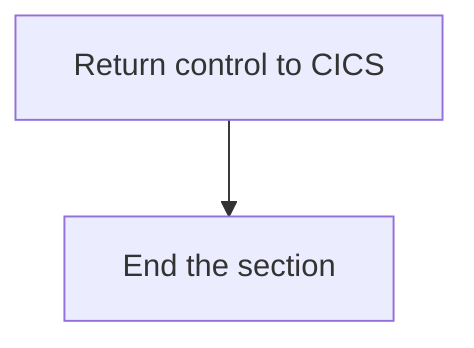

<SwmSnippet path="/src/base/cobol_src/DBCRFUN.cbl" line="658">

---

### Returning control to CICS

First, the <SwmToken path="src/base/cobol_src/DBCRFUN.cbl" pos="658:1:9" line-data="       GET-ME-OUT-OF-HERE SECTION.">`GET-ME-OUT-OF-HERE`</SwmToken> function returns control to CICS using the <SwmToken path="src/base/cobol_src/DBCRFUN.cbl" pos="660:1:5" line-data="           EXEC CICS RETURN">`EXEC CICS RETURN`</SwmToken> command. This ensures that the program hands back control to the CICS environment, allowing it to manage the next steps in the transaction processing.

```cobol
       GET-ME-OUT-OF-HERE SECTION.
       GMOOH010.
           EXEC CICS RETURN
           END-EXEC.
```

---

</SwmSnippet>

<SwmSnippet path="/src/base/cobol_src/DBCRFUN.cbl" line="662">

---

### Ending the section

Next, the function executes the <SwmToken path="src/base/cobol_src/DBCRFUN.cbl" pos="662:1:1" line-data="           GOBACK.">`GOBACK`</SwmToken> statement, which signifies the end of the section and ensures that the program exits cleanly. This is followed by the <SwmToken path="src/base/cobol_src/DBCRFUN.cbl" pos="665:1:1" line-data="           EXIT.">`EXIT`</SwmToken> statement in the <SwmToken path="src/base/cobol_src/DBCRFUN.cbl" pos="664:1:1" line-data="       GMOOH999.">`GMOOH999`</SwmToken> paragraph, which provides a final exit point for the section.

```cobol
           GOBACK.

       GMOOH999.
           EXIT.
```

---

</SwmSnippet>

&nbsp;

*This is an auto-generated document by Swimm 🌊 and has not yet been verified by a human*

<SwmMeta version="3.0.0" repo-id="Z2l0aHViJTNBJTNBY2ljcy1iYW5raW5nLXNhbXBsZS1hcHBsaWNhdGlvbi1jYnNhLUlCTS1EZW1vJTNBJTNBU3dpbW0tRGVtbw==" repo-name="cics-banking-sample-application-cbsa-IBM-Demo"><sup>Powered by [Swimm](/)</sup></SwmMeta>
