The DBCRFUN program is used to update account records in a banking application. This program is initiated from the BNK1CRA program and involves several steps to ensure the account update process is completed successfully. The process includes initializing communication indicators, setting up abend handling, updating the account record, and finalizing the transaction.

The flow starts with initializing communication indicators to track the transaction status. Next, abend handling is set up to manage unexpected errors. The program then sets sort codes to target the correct account for the update. The account record is updated, and the transaction is finalized to ensure all necessary values are set in the communication area.

# Where is this program used?

This program is used once, in a flow starting from `BNK1CRA` as represented in the following diagram:

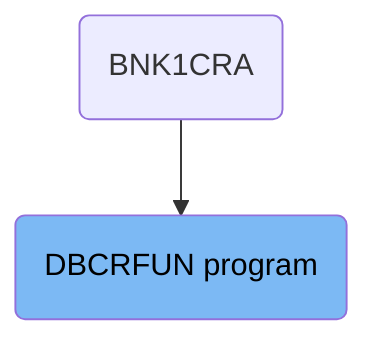

## PREMIERE

Lets' zoom into this section of the flow:

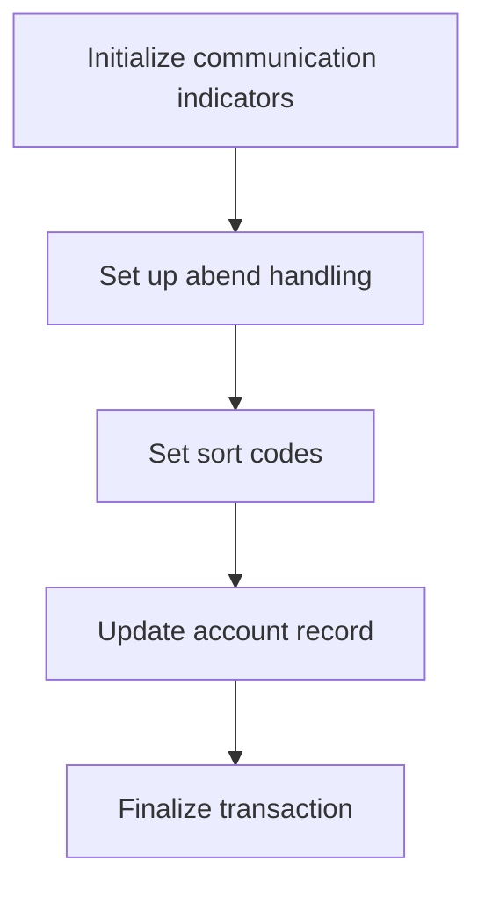

<SwmSnippet path="/src/base/cobol_src/DBCRFUN.cbl" line="200">

---

First, the communication success and failure indicators are initialized to ensure proper tracking of the transaction status.

```cobol
       A010.
           MOVE 'N' TO COMM-SUCCESS
           MOVE '0' TO COMM-FAIL-CODE
```

---

</SwmSnippet>

<SwmSnippet path="/src/base/cobol_src/DBCRFUN.cbl" line="207">

---

Moving to the next step, abend (abnormal end) handling is set up to manage any unexpected errors during the transaction process.

```cobol
           EXEC CICS HANDLE ABEND
              LABEL(ABEND-HANDLING)
           END-EXEC.
```

---

</SwmSnippet>

<SwmSnippet path="/src/base/cobol_src/DBCRFUN.cbl" line="211">

---

Next, the sort codes are set to prepare for the account update operation. This ensures that the correct account is targeted for the update.

```cobol
           MOVE SORTCODE TO COMM-SORTC.
           MOVE SORTCODE TO DESIRED-SORT-CODE.
```

---

</SwmSnippet>

<SwmSnippet path="/src/base/cobol_src/DBCRFUN.cbl" line="223">

---

Then, the account record is updated by performing the <SwmToken path="src/base/cobol_src/DBCRFUN.cbl" pos="223:3:7" line-data="            PERFORM UPDATE-ACCOUNT-DB2.">`UPDATE-ACCOUNT-DB2`</SwmToken> operation, which handles the actual modification of the account details in the database.

```cobol
            PERFORM UPDATE-ACCOUNT-DB2.
```

---

</SwmSnippet>

<SwmSnippet path="/src/base/cobol_src/DBCRFUN.cbl" line="229">

---

Finally, the transaction is finalized by performing the <SwmToken path="src/base/cobol_src/DBCRFUN.cbl" pos="229:3:11" line-data="           PERFORM GET-ME-OUT-OF-HERE.">`GET-ME-OUT-OF-HERE`</SwmToken> operation, which completes the process and ensures all necessary values are set in the communication area.

```cobol
           PERFORM GET-ME-OUT-OF-HERE.
```

---

</SwmSnippet>

# Update account (<SwmToken path="src/base/cobol_src/DBCRFUN.cbl" pos="223:3:7" line-data="            PERFORM UPDATE-ACCOUNT-DB2.">`UPDATE-ACCOUNT-DB2`</SwmToken>)

Let's split this section into smaller parts:

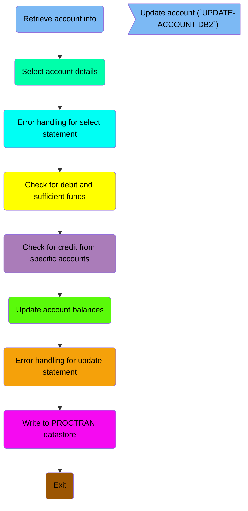

## Retrieve account info

First, we'll zoom into this section of the flow:

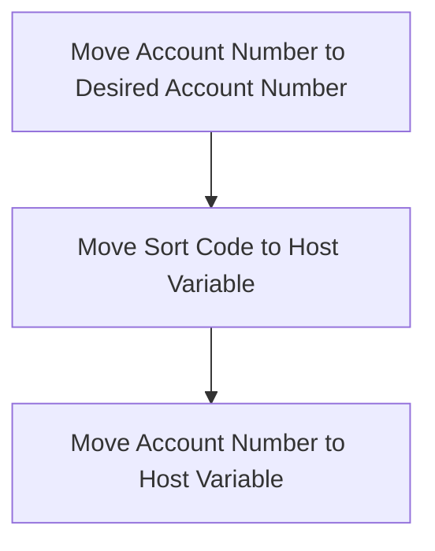

<SwmSnippet path="/src/base/cobol_src/DBCRFUN.cbl" line="238">

---

First, the account number from the communication area is moved to the <SwmToken path="src/base/cobol_src/DBCRFUN.cbl" pos="238:9:13" line-data="           MOVE COMM-ACCNO TO DESIRED-ACC-NO.">`DESIRED-ACC-NO`</SwmToken> variable. This step ensures that the correct account number is targeted for the update operation.

```cobol
           MOVE COMM-ACCNO TO DESIRED-ACC-NO.
```

---

</SwmSnippet>

<SwmSnippet path="/src/base/cobol_src/DBCRFUN.cbl" line="239">

---

Next, the desired sort code and account number are moved to their respective host variables (<SwmToken path="src/base/cobol_src/DBCRFUN.cbl" pos="239:11:15" line-data="           MOVE DESIRED-SORT-CODE TO HV-ACCOUNT-SORTCODE.">`HV-ACCOUNT-SORTCODE`</SwmToken> and <SwmToken path="src/base/cobol_src/DBCRFUN.cbl" pos="240:11:17" line-data="           MOVE DESIRED-ACC-NO TO HV-ACCOUNT-ACC-NO.">`HV-ACCOUNT-ACC-NO`</SwmToken>). These host variables are used in subsequent database operations to identify and update the correct account record.

```cobol
           MOVE DESIRED-SORT-CODE TO HV-ACCOUNT-SORTCODE.
           MOVE DESIRED-ACC-NO TO HV-ACCOUNT-ACC-NO.
```

---

</SwmSnippet>

## Select account details

This is the next section of the flow.

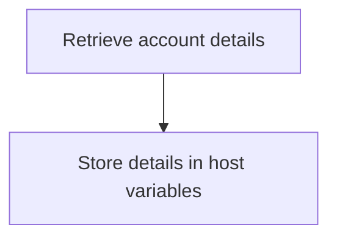

<SwmSnippet path="/src/base/cobol_src/DBCRFUN.cbl" line="245">

---

The <SwmToken path="src/base/cobol_src/DBCRFUN.cbl" pos="223:3:7" line-data="            PERFORM UPDATE-ACCOUNT-DB2.">`UPDATE-ACCOUNT-DB2`</SwmToken> function retrieves account details from the database based on the provided sort code and account number. It executes an SQL <SwmToken path="src/base/cobol_src/DBCRFUN.cbl" pos="246:1:1" line-data="              SELECT ACCOUNT_EYECATCHER,">`SELECT`</SwmToken> statement to fetch various account attributes such as the account eyecatcher, customer number, sort code, account number, account type, interest rate, account opened date, overdraft limit, last statement date, next statement date, available balance, and actual balance. These details are then stored in corresponding host variables for further processing.

```cobol
           EXEC SQL
              SELECT ACCOUNT_EYECATCHER,
                     ACCOUNT_CUSTOMER_NUMBER,
                     ACCOUNT_SORTCODE,
                     ACCOUNT_NUMBER,
                     ACCOUNT_TYPE,
                     ACCOUNT_INTEREST_RATE,
                     ACCOUNT_OPENED,
                     ACCOUNT_OVERDRAFT_LIMIT,
                     ACCOUNT_LAST_STATEMENT,
                     ACCOUNT_NEXT_STATEMENT,
                     ACCOUNT_AVAILABLE_BALANCE,
                     ACCOUNT_ACTUAL_BALANCE
              INTO  :HV-ACCOUNT-EYECATCHER,
                    :HV-ACCOUNT-CUST-NO,
                    :HV-ACCOUNT-SORTCODE,
                    :HV-ACCOUNT-ACC-NO,
                    :HV-ACCOUNT-ACC-TYPE,
                    :HV-ACCOUNT-INT-RATE,
                    :HV-ACCOUNT-OPENED,
                    :HV-ACCOUNT-OVERDRAFT-LIM,
```

---

</SwmSnippet>

## Error handling for select statement

Now, lets zoom into this section of the flow:

```mermaid
graph TD
  A[Check SQLCODE] -->|SQLCODE != 0| B[Set COMM-SUCCESS to 'N']
  B --> C{SQLCODE = 100?}
  C -->|Yes| D[Set COMM-FAIL-CODE to '1']
  C -->|No| E[Set COMM-FAIL-CODE to '2']
  D --> F[Check for Storm Drain Processing]
  E --> F[Check for Storm Drain Processing]
  F --> G[Go to UAD999]

%% Swimm:
%% graph TD
%%   A[Check SQLCODE] -->|SQLCODE != 0| B[Set <SwmToken path="src/base/cobol_src/DBCRFUN.cbl" pos="201:9:11" line-data="           MOVE &#39;N&#39; TO COMM-SUCCESS">`COMM-SUCCESS`</SwmToken> to 'N']
%%   B --> C{SQLCODE = 100?}
%%   C -->|Yes| D[Set <SwmToken path="src/base/cobol_src/DBCRFUN.cbl" pos="202:9:13" line-data="           MOVE &#39;0&#39; TO COMM-FAIL-CODE">`COMM-FAIL-CODE`</SwmToken> to '1']
%%   C -->|No| E[Set <SwmToken path="src/base/cobol_src/DBCRFUN.cbl" pos="202:9:13" line-data="           MOVE &#39;0&#39; TO COMM-FAIL-CODE">`COMM-FAIL-CODE`</SwmToken> to '2']
%%   D --> F[Check for Storm Drain Processing]
%%   E --> F[Check for Storm Drain Processing]
%%   F --> G[Go to <SwmToken path="src/base/cobol_src/DBCRFUN.cbl" pos="295:5:5" line-data="              GO TO UAD999">`UAD999`</SwmToken>]
```

<SwmSnippet path="/src/base/cobol_src/DBCRFUN.cbl" line="279">

---

First, the function checks if the <SwmToken path="src/base/cobol_src/DBCRFUN.cbl" pos="279:3:3" line-data="           IF SQLCODE NOT = 0">`SQLCODE`</SwmToken> (which indicates the result of the SQL operation) is not equal to 0, meaning the SQL operation was not successful.

```cobol
           IF SQLCODE NOT = 0

```

---

</SwmSnippet>

<SwmSnippet path="/src/base/cobol_src/DBCRFUN.cbl" line="281">

---

Moving to the next step, if the <SwmToken path="src/base/cobol_src/DBCRFUN.cbl" pos="279:3:3" line-data="           IF SQLCODE NOT = 0">`SQLCODE`</SwmToken> is not 0, the function sets <SwmToken path="src/base/cobol_src/DBCRFUN.cbl" pos="281:9:11" line-data="              MOVE &#39;N&#39; TO COMM-SUCCESS">`COMM-SUCCESS`</SwmToken> to 'N' (indicating the operation was not successful).

```cobol
              MOVE 'N' TO COMM-SUCCESS

```

---

</SwmSnippet>

<SwmSnippet path="/src/base/cobol_src/DBCRFUN.cbl" line="283">

---

Next, the function checks if the <SwmToken path="src/base/cobol_src/DBCRFUN.cbl" pos="283:3:3" line-data="              IF SQLCODE = +100">`SQLCODE`</SwmToken> is 100, which indicates that no rows were found. If true, it sets <SwmToken path="src/base/cobol_src/DBCRFUN.cbl" pos="284:9:13" line-data="                 MOVE &#39;1&#39; TO COMM-FAIL-CODE">`COMM-FAIL-CODE`</SwmToken> to '1'. Otherwise, it sets <SwmToken path="src/base/cobol_src/DBCRFUN.cbl" pos="284:9:13" line-data="                 MOVE &#39;1&#39; TO COMM-FAIL-CODE">`COMM-FAIL-CODE`</SwmToken> to '2', indicating a different type of failure.

```cobol
              IF SQLCODE = +100
                 MOVE '1' TO COMM-FAIL-CODE
              ELSE
                 MOVE '2' TO COMM-FAIL-CODE
              END-IF
```

---

</SwmSnippet>

<SwmSnippet path="/src/base/cobol_src/DBCRFUN.cbl" line="293">

---

Then, the function performs a check for Storm Drain processing by calling <SwmToken path="src/base/cobol_src/DBCRFUN.cbl" pos="293:3:11" line-data="              PERFORM CHECK-FOR-STORM-DRAIN-DB2">`CHECK-FOR-STORM-DRAIN-DB2`</SwmToken>, which handles specific workload processing if activated. Finally, it directs the flow to <SwmToken path="src/base/cobol_src/DBCRFUN.cbl" pos="295:5:5" line-data="              GO TO UAD999">`UAD999`</SwmToken> for further handling.

```cobol
              PERFORM CHECK-FOR-STORM-DRAIN-DB2

              GO TO UAD999
```

---

</SwmSnippet>

## Check for debit and sufficient funds

Now, lets zoom into this section of the flow:

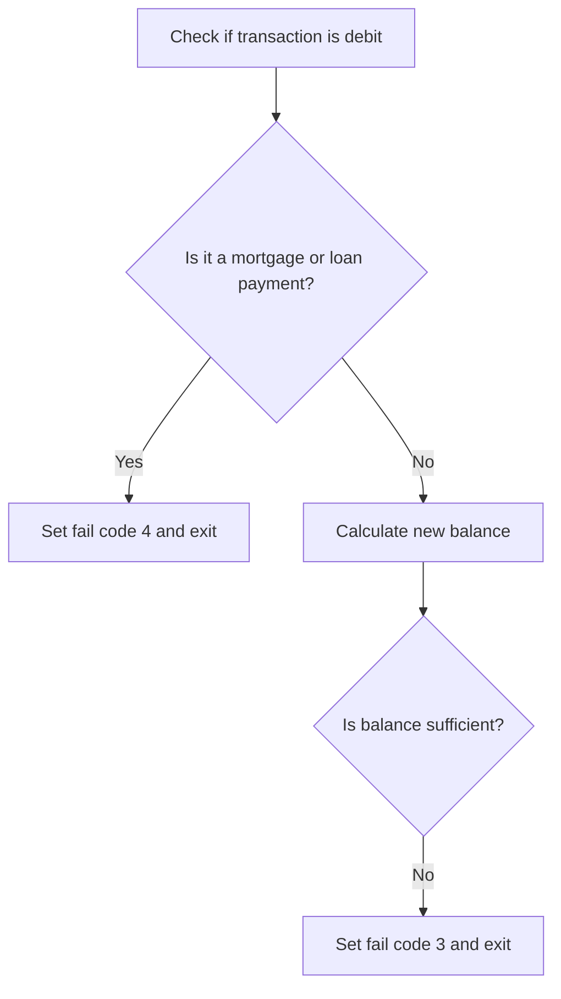

<SwmSnippet path="/src/base/cobol_src/DBCRFUN.cbl" line="307">

---

First, the function checks if the transaction amount (<SwmToken path="src/base/cobol_src/DBCRFUN.cbl" pos="307:3:5" line-data="           IF COMM-AMT &lt; 0">`COMM-AMT`</SwmToken>) is negative, indicating a debit or payment request.

```cobol
           IF COMM-AMT < 0
```

---

</SwmSnippet>

<SwmSnippet path="/src/base/cobol_src/DBCRFUN.cbl" line="330">

---

Next, it verifies if the payment is being requested from a mortgage or loan account by checking the account type (<SwmToken path="src/base/cobol_src/DBCRFUN.cbl" pos="330:4:10" line-data="              IF (HV-ACCOUNT-ACC-TYPE = &#39;MORTGAGE&#39;">`HV-ACCOUNT-ACC-TYPE`</SwmToken>) and the facility type (<SwmToken path="src/base/cobol_src/DBCRFUN.cbl" pos="331:3:5" line-data="              AND COMM-FACILTYPE = 496)">`COMM-FACILTYPE`</SwmToken>).

```cobol
              IF (HV-ACCOUNT-ACC-TYPE = 'MORTGAGE'
              AND COMM-FACILTYPE = 496)
              OR (HV-ACCOUNT-ACC-TYPE = 'LOAN    '
              AND COMM-FACILTYPE = 496)
```

---

</SwmSnippet>

<SwmSnippet path="/src/base/cobol_src/DBCRFUN.cbl" line="334">

---

If the payment is from a mortgage or loan account, it sets the success flag (<SwmToken path="src/base/cobol_src/DBCRFUN.cbl" pos="334:9:11" line-data="                 MOVE &#39;N&#39; TO COMM-SUCCESS">`COMM-SUCCESS`</SwmToken>) to 'N' and the fail code (<SwmToken path="src/base/cobol_src/DBCRFUN.cbl" pos="335:9:13" line-data="                 MOVE &#39;4&#39; TO COMM-FAIL-CODE">`COMM-FAIL-CODE`</SwmToken>) to 4, then exits the function.

```cobol
                 MOVE 'N' TO COMM-SUCCESS
                 MOVE '4' TO COMM-FAIL-CODE

                 GO TO UAD999
              END-IF
```

---

</SwmSnippet>

<SwmSnippet path="/src/base/cobol_src/DBCRFUN.cbl" line="340">

---

Moving to the next step, the function calculates the new balance by adding the transaction amount (<SwmToken path="src/base/cobol_src/DBCRFUN.cbl" pos="342:3:5" line-data="                 + COMM-AMT">`COMM-AMT`</SwmToken>) to the available balance (<SwmToken path="src/base/cobol_src/DBCRFUN.cbl" pos="341:9:15" line-data="              COMPUTE WS-DIFFERENCE = HV-ACCOUNT-AVAIL-BAL">`HV-ACCOUNT-AVAIL-BAL`</SwmToken>) and stores the result in <SwmToken path="src/base/cobol_src/DBCRFUN.cbl" pos="340:7:9" line-data="              MOVE 0 TO WS-DIFFERENCE">`WS-DIFFERENCE`</SwmToken>.

```cobol
              MOVE 0 TO WS-DIFFERENCE
              COMPUTE WS-DIFFERENCE = HV-ACCOUNT-AVAIL-BAL
                 + COMM-AMT
```

---

</SwmSnippet>

<SwmSnippet path="/src/base/cobol_src/DBCRFUN.cbl" line="344">

---

Then, it checks if the new balance (<SwmToken path="src/base/cobol_src/DBCRFUN.cbl" pos="344:3:5" line-data="              IF WS-DIFFERENCE &lt; 0 AND COMM-FACILTYPE = 496">`WS-DIFFERENCE`</SwmToken>) is less than zero and if the facility type (<SwmToken path="src/base/cobol_src/DBCRFUN.cbl" pos="344:13:15" line-data="              IF WS-DIFFERENCE &lt; 0 AND COMM-FACILTYPE = 496">`COMM-FACILTYPE`</SwmToken>) is 496, indicating insufficient funds.

```cobol
              IF WS-DIFFERENCE < 0 AND COMM-FACILTYPE = 496
```

---

</SwmSnippet>

<SwmSnippet path="/src/base/cobol_src/DBCRFUN.cbl" line="346">

---

If there are insufficient funds, it sets the success flag (<SwmToken path="src/base/cobol_src/DBCRFUN.cbl" pos="346:9:11" line-data="                 MOVE &#39;N&#39; TO COMM-SUCCESS">`COMM-SUCCESS`</SwmToken>) to 'N' and the fail code (<SwmToken path="src/base/cobol_src/DBCRFUN.cbl" pos="347:9:13" line-data="                 MOVE &#39;3&#39; TO COMM-FAIL-CODE">`COMM-FAIL-CODE`</SwmToken>) to 3, then exits the function.

```cobol
                 MOVE 'N' TO COMM-SUCCESS
                 MOVE '3' TO COMM-FAIL-CODE

                 GO TO UAD999
              END-IF
```

---

</SwmSnippet>

## Check for credit from specific accounts

This is the next section of the flow.

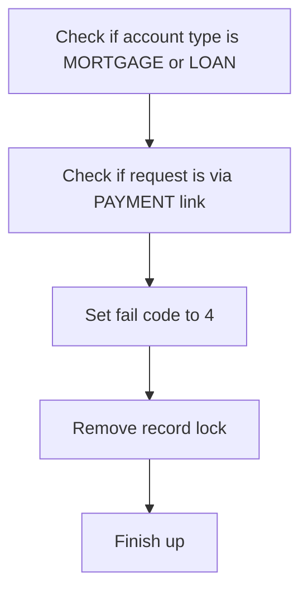

<SwmSnippet path="/src/base/cobol_src/DBCRFUN.cbl" line="368">

---

First, the function checks if the account type is either <SwmToken path="src/base/cobol_src/DBCRFUN.cbl" pos="368:15:15" line-data="           IF (HV-ACCOUNT-ACC-TYPE = &#39;MORTGAGE&#39; AND">`MORTGAGE`</SwmToken> or <SwmToken path="src/base/cobol_src/DBCRFUN.cbl" pos="370:15:15" line-data="           OR (HV-ACCOUNT-ACC-TYPE = &#39;LOAN    &#39;">`LOAN`</SwmToken> and if the request is coming via the <SwmToken path="src/base/cobol_src/DBCRFUN.cbl" pos="496:17:17" line-data="      *       If it is a debit from a PAYMENT">`PAYMENT`</SwmToken> link. This is determined by checking if <SwmToken path="src/base/cobol_src/DBCRFUN.cbl" pos="369:1:3" line-data="           COMM-FACILTYPE = 496)">`COMM-FACILTYPE`</SwmToken> is 496.

```cobol
           IF (HV-ACCOUNT-ACC-TYPE = 'MORTGAGE' AND
           COMM-FACILTYPE = 496)
           OR (HV-ACCOUNT-ACC-TYPE = 'LOAN    '
           AND COMM-FACILTYPE = 496)
```

---

</SwmSnippet>

<SwmSnippet path="/src/base/cobol_src/DBCRFUN.cbl" line="372">

---

Next, if the conditions are met, the function sets the <SwmToken path="src/base/cobol_src/DBCRFUN.cbl" pos="372:9:11" line-data="              MOVE &#39;N&#39; TO COMM-SUCCESS">`COMM-SUCCESS`</SwmToken> to 'N' and the <SwmToken path="src/base/cobol_src/DBCRFUN.cbl" pos="373:9:13" line-data="              MOVE &#39;4&#39; TO COMM-FAIL-CODE">`COMM-FAIL-CODE`</SwmToken> to 4, indicating a failure. It then removes the record lock and finishes the process.

```cobol
              MOVE 'N' TO COMM-SUCCESS
              MOVE '4' TO COMM-FAIL-CODE

              GO TO UAD999
           END-IF.
```

---

</SwmSnippet>

## Update account balances

This is the next section of the flow.

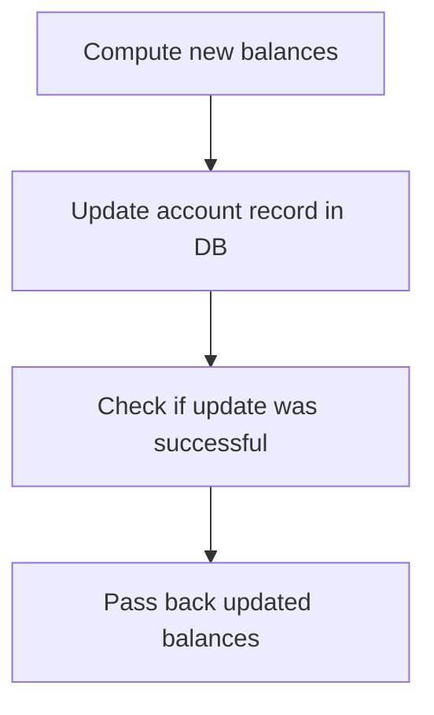

<SwmSnippet path="/src/base/cobol_src/DBCRFUN.cbl" line="384">

---

First, the available and actual balances of the account are updated by adding the transaction amount to the current balances.

```cobol
           COMPUTE HV-ACCOUNT-AVAIL-BAL =
              HV-ACCOUNT-AVAIL-BAL + COMM-AMT.
           COMPUTE HV-ACCOUNT-ACTUAL-BAL =
              HV-ACCOUNT-ACTUAL-BAL + COMM-AMT.
```

---

</SwmSnippet>

<SwmSnippet path="/src/base/cobol_src/DBCRFUN.cbl" line="392">

---

Next, the account record in the database is updated with the new balances and other account details.

```cobol
           EXEC SQL
              UPDATE ACCOUNT
              SET ACCOUNT_EYECATCHER = :HV-ACCOUNT-EYECATCHER,
                  ACCOUNT_CUSTOMER_NUMBER = :HV-ACCOUNT-CUST-NO,
                  ACCOUNT_SORTCODE = :HV-ACCOUNT-SORTCODE,
                  ACCOUNT_NUMBER = :HV-ACCOUNT-ACC-NO,
                  ACCOUNT_TYPE = :HV-ACCOUNT-ACC-TYPE,
                  ACCOUNT_INTEREST_RATE = :HV-ACCOUNT-INT-RATE,
                  ACCOUNT_OPENED = :HV-ACCOUNT-OPENED,
                  ACCOUNT_OVERDRAFT_LIMIT = :HV-ACCOUNT-OVERDRAFT-LIM,
                  ACCOUNT_LAST_STATEMENT = :HV-ACCOUNT-LAST-STMT,
                  ACCOUNT_NEXT_STATEMENT = :HV-ACCOUNT-NEXT-STMT,
                  ACCOUNT_AVAILABLE_BALANCE = :HV-ACCOUNT-AVAIL-BAL,
                  ACCOUNT_ACTUAL_BALANCE = :HV-ACCOUNT-ACTUAL-BAL
              WHERE (ACCOUNT_SORTCODE = :HV-ACCOUNT-SORTCODE AND
                     ACCOUNT_NUMBER = :HV-ACCOUNT-ACC-NO)
           END-EXEC.
```

---

</SwmSnippet>

<SwmSnippet path="/src/base/cobol_src/DBCRFUN.cbl" line="414">

---

Then, the SQL code is moved to a display variable to check if the update was successful.

```cobol
           MOVE SQLCODE TO SQLCODE-DISPLAY.
```

---

</SwmSnippet>

<SwmSnippet path="/src/base/cobol_src/DBCRFUN.cbl" line="416">

---

Finally, the updated available and actual balances are passed back to the calling program.

```cobol
           MOVE HV-ACCOUNT-AVAIL-BAL TO
              COMM-AV-BAL.
           MOVE HV-ACCOUNT-ACTUAL-BAL TO
              COMM-ACT-BAL.
```

---

</SwmSnippet>

## Error handling for update statement

Now, lets zoom into this section of the flow:

```mermaid
graph TD
  A[Check SQLCODE] -->|SQLCODE NOT = 0| B[Set COMM-SUCCESS to 'N']
  B --> C[Set COMM-FAIL-CODE to '2']
  C --> D[Check for Storm Drain Processing]
  D --> E[Exit to UAD999]

%% Swimm:
%% graph TD
%%   A[Check SQLCODE] -->|SQLCODE NOT = 0| B[Set <SwmToken path="src/base/cobol_src/DBCRFUN.cbl" pos="201:9:11" line-data="           MOVE &#39;N&#39; TO COMM-SUCCESS">`COMM-SUCCESS`</SwmToken> to 'N']
%%   B --> C[Set <SwmToken path="src/base/cobol_src/DBCRFUN.cbl" pos="202:9:13" line-data="           MOVE &#39;0&#39; TO COMM-FAIL-CODE">`COMM-FAIL-CODE`</SwmToken> to '2']
%%   C --> D[Check for Storm Drain Processing]
%%   D --> E[Exit to <SwmToken path="src/base/cobol_src/DBCRFUN.cbl" pos="295:5:5" line-data="              GO TO UAD999">`UAD999`</SwmToken>]
```

<SwmSnippet path="/src/base/cobol_src/DBCRFUN.cbl" line="425">

---

First, the function checks if <SwmToken path="src/base/cobol_src/DBCRFUN.cbl" pos="425:3:3" line-data="           IF SQLCODE NOT = 0">`SQLCODE`</SwmToken> (which indicates the result of the SQL operation) is not equal to 0. This condition signifies that the database update operation has failed.

```cobol
           IF SQLCODE NOT = 0
```

---

</SwmSnippet>

<SwmSnippet path="/src/base/cobol_src/DBCRFUN.cbl" line="426">

---

Next, if the <SwmToken path="src/base/cobol_src/DBCRFUN.cbl" pos="429:7:7" line-data="      *       Check if SQLCODE indicates that Storm Drain processing">`SQLCODE`</SwmToken> is not zero, the function sets <SwmToken path="src/base/cobol_src/DBCRFUN.cbl" pos="426:9:11" line-data="              MOVE &#39;N&#39; TO COMM-SUCCESS">`COMM-SUCCESS`</SwmToken> to 'N' (indicating the communication was not successful) and <SwmToken path="src/base/cobol_src/DBCRFUN.cbl" pos="427:9:13" line-data="              MOVE &#39;2&#39; TO COMM-FAIL-CODE">`COMM-FAIL-CODE`</SwmToken> to '2' (a specific failure code). It then performs a check for Storm Drain processing, which is applicable in certain workloads, and finally exits to the label <SwmToken path="src/base/cobol_src/DBCRFUN.cbl" pos="433:5:5" line-data="              GO TO UAD999">`UAD999`</SwmToken>.

```cobol
              MOVE 'N' TO COMM-SUCCESS
              MOVE '2' TO COMM-FAIL-CODE
      *
      *       Check if SQLCODE indicates that Storm Drain processing
      *       is applicable in a workload if activated
      *
              PERFORM CHECK-FOR-STORM-DRAIN-DB2
              GO TO UAD999
```

---

</SwmSnippet>

## Write to PROCTRAN datastore

Now, lets zoom into this section of the flow:

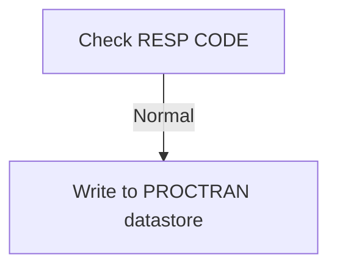

<SwmSnippet path="/src/base/cobol_src/DBCRFUN.cbl" line="437">

---

If the response code (<SwmToken path="src/base/cobol_src/DBCRFUN.cbl" pos="438:7:9" line-data="      *    If the RESP CODE was normal then we need to write to the">`RESP CODE`</SwmToken>) is normal, the next step is to write the transaction details to the <SwmToken path="src/base/cobol_src/DBCRFUN.cbl" pos="439:3:3" line-data="      *    PROCTRAN (processed transaction) datastore.">`PROCTRAN`</SwmToken> datastore. This ensures that all processed transactions are logged correctly in the database for future reference and auditing purposes.

```cobol
      *
      *    If the RESP CODE was normal then we need to write to the
      *    PROCTRAN (processed transaction) datastore.
      *
           PERFORM WRITE-TO-PROCTRAN.
```

---

</SwmSnippet>

## Exit

This is the next section of the flow.

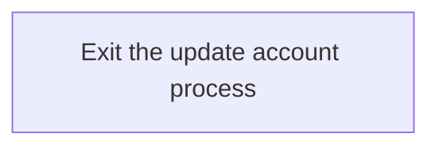

<SwmSnippet path="/src/base/cobol_src/DBCRFUN.cbl" line="443">

---

The <SwmToken path="src/base/cobol_src/DBCRFUN.cbl" pos="223:3:7" line-data="            PERFORM UPDATE-ACCOUNT-DB2.">`UPDATE-ACCOUNT-DB2`</SwmToken> function concludes the update account process by reaching the <SwmToken path="src/base/cobol_src/DBCRFUN.cbl" pos="443:1:1" line-data="       UAD999.">`UAD999`</SwmToken> label, which signifies the end of the function. This step ensures that the program exits the update account routine cleanly, allowing for any necessary cleanup or finalization tasks to be performed before control is returned to the calling program.

```cobol
       UAD999.
           EXIT.
```

---

</SwmSnippet>

## <SwmToken path="src/base/cobol_src/DBCRFUN.cbl" pos="293:3:11" line-data="              PERFORM CHECK-FOR-STORM-DRAIN-DB2">`CHECK-FOR-STORM-DRAIN-DB2`</SwmToken>

Lets' zoom into this section of the flow:

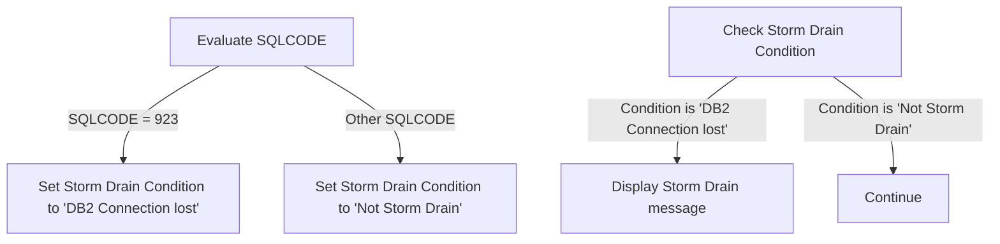

<SwmSnippet path="/src/base/cobol_src/DBCRFUN.cbl" line="675">

---

First, the function evaluates the <SwmToken path="src/base/cobol_src/DBCRFUN.cbl" pos="675:3:3" line-data="           EVALUATE SQLCODE">`SQLCODE`</SwmToken> to determine the status of the <SwmToken path="src/base/cobol_src/DBCRFUN.cbl" pos="223:7:7" line-data="            PERFORM UPDATE-ACCOUNT-DB2.">`DB2`</SwmToken> connection.

```cobol
           EVALUATE SQLCODE
```

---

</SwmSnippet>

<SwmSnippet path="/src/base/cobol_src/DBCRFUN.cbl" line="677">

---

When the <SwmToken path="src/base/cobol_src/DBCRFUN.cbl" pos="279:3:3" line-data="           IF SQLCODE NOT = 0">`SQLCODE`</SwmToken> is 923, it indicates that the <SwmToken path="src/base/cobol_src/DBCRFUN.cbl" pos="678:4:4" line-data="                 MOVE &#39;DB2 Connection lost &#39; TO STORM-DRAIN-CONDITION">`DB2`</SwmToken> connection is lost, and the function sets the <SwmToken path="src/base/cobol_src/DBCRFUN.cbl" pos="678:14:18" line-data="                 MOVE &#39;DB2 Connection lost &#39; TO STORM-DRAIN-CONDITION">`STORM-DRAIN-CONDITION`</SwmToken> to '<SwmToken path="src/base/cobol_src/DBCRFUN.cbl" pos="678:4:4" line-data="                 MOVE &#39;DB2 Connection lost &#39; TO STORM-DRAIN-CONDITION">`DB2`</SwmToken> Connection lost'.

```cobol
              WHEN 923
                 MOVE 'DB2 Connection lost ' TO STORM-DRAIN-CONDITION
```

---

</SwmSnippet>

<SwmSnippet path="/src/base/cobol_src/DBCRFUN.cbl" line="680">

---

Next, for any other <SwmToken path="src/base/cobol_src/DBCRFUN.cbl" pos="279:3:3" line-data="           IF SQLCODE NOT = 0">`SQLCODE`</SwmToken>, the function sets the <SwmToken path="src/base/cobol_src/DBCRFUN.cbl" pos="681:14:18" line-data="                 MOVE &#39;Not Storm Drain     &#39; TO STORM-DRAIN-CONDITION">`STORM-DRAIN-CONDITION`</SwmToken> to 'Not Storm Drain'.

```cobol
              WHEN OTHER
                 MOVE 'Not Storm Drain     ' TO STORM-DRAIN-CONDITION
```

---

</SwmSnippet>

<SwmSnippet path="/src/base/cobol_src/DBCRFUN.cbl" line="685">

---

Then, the function checks if the <SwmToken path="src/base/cobol_src/DBCRFUN.cbl" pos="685:3:7" line-data="           IF STORM-DRAIN-CONDITION NOT EQUAL &#39;Not Storm Drain     &#39;">`STORM-DRAIN-CONDITION`</SwmToken> is not equal to 'Not Storm Drain'.

```cobol
           IF STORM-DRAIN-CONDITION NOT EQUAL 'Not Storm Drain     '
```

---

</SwmSnippet>

<SwmSnippet path="/src/base/cobol_src/DBCRFUN.cbl" line="686">

---

If the condition is met, it displays a message indicating that a Storm Drain condition has been met, along with the <SwmToken path="src/base/cobol_src/DBCRFUN.cbl" pos="688:11:11" line-data="                      &#39;has been met (&#39; SQLCODE-DISPLAY &#39;).&#39;">`SQLCODE`</SwmToken>.

```cobol
              DISPLAY 'DBCRFUN: Check-For-Storm-Drain-DB2: Storm '
                      'Drain condition (' STORM-DRAIN-CONDITION ') '
                      'has been met (' SQLCODE-DISPLAY ').'
```

---

</SwmSnippet>

<SwmSnippet path="/src/base/cobol_src/DBCRFUN.cbl" line="689">

---

Otherwise, the function continues without any further action.

```cobol
           ELSE

              CONTINUE
           END-IF.
```

---

</SwmSnippet>

## <SwmToken path="src/base/cobol_src/DBCRFUN.cbl" pos="441:3:7" line-data="           PERFORM WRITE-TO-PROCTRAN.">`WRITE-TO-PROCTRAN`</SwmToken>

Lets' zoom into this section of the flow:

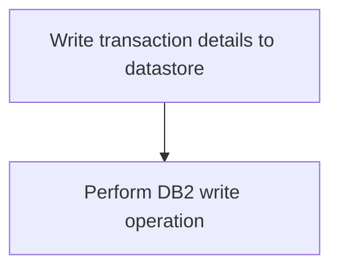

First, the <SwmToken path="src/base/cobol_src/DBCRFUN.cbl" pos="441:3:7" line-data="           PERFORM WRITE-TO-PROCTRAN.">`WRITE-TO-PROCTRAN`</SwmToken> section is responsible for writing transaction details to the PROCTRAN datastore after a transaction has been successfully applied.

<SwmSnippet path="/src/base/cobol_src/DBCRFUN.cbl" line="454">

---

Next, the <SwmToken path="src/base/cobol_src/DBCRFUN.cbl" pos="454:3:7" line-data="            PERFORM WRITE-TO-PROCTRAN-DB2.">`WRITE-TO-PROCTRAN`</SwmToken> section performs the <SwmToken path="src/base/cobol_src/DBCRFUN.cbl" pos="454:3:9" line-data="            PERFORM WRITE-TO-PROCTRAN-DB2.">`WRITE-TO-PROCTRAN-DB2`</SwmToken> operation, which handles the initialization and writing of a transaction record to the PROCTRAN <SwmToken path="src/base/cobol_src/DBCRFUN.cbl" pos="454:9:9" line-data="            PERFORM WRITE-TO-PROCTRAN-DB2.">`DB2`</SwmToken> datastore.

```cobol
            PERFORM WRITE-TO-PROCTRAN-DB2.
```

---

</SwmSnippet>

<SwmSnippet path="/src/base/cobol_src/DBCRFUN.cbl" line="457">

---

Then, the section concludes with an exit statement, marking the end of the <SwmToken path="src/base/cobol_src/DBCRFUN.cbl" pos="441:3:7" line-data="           PERFORM WRITE-TO-PROCTRAN.">`WRITE-TO-PROCTRAN`</SwmToken> section.

```cobol
           EXIT.
```

---

</SwmSnippet>

## <SwmToken path="src/base/cobol_src/DBCRFUN.cbl" pos="454:3:9" line-data="            PERFORM WRITE-TO-PROCTRAN-DB2.">`WRITE-TO-PROCTRAN-DB2`</SwmToken>

Lets' zoom into this section of the flow:

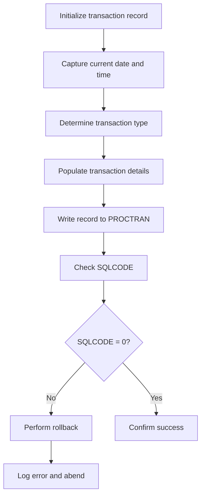

<SwmSnippet path="/src/base/cobol_src/DBCRFUN.cbl" line="460">

---

First, the <SwmToken path="src/base/cobol_src/DBCRFUN.cbl" pos="460:1:7" line-data="       WRITE-TO-PROCTRAN-DB2 SECTION.">`WRITE-TO-PROCTRAN-DB2`</SwmToken> section initializes the transaction record by setting up the required fields and capturing the current date and time.

```cobol
       WRITE-TO-PROCTRAN-DB2 SECTION.
       WTPD010.

           INITIALIZE HOST-PROCTRAN-ROW.
           INITIALIZE WS-EIBTASKN12.

           MOVE 'PRTR' TO HV-PROCTRAN-EYECATCHER.
           MOVE COMM-SORTC TO HV-PROCTRAN-SORT-CODE.
           MOVE COMM-ACCNO TO HV-PROCTRAN-ACC-NUMBER.
           MOVE EIBTASKN TO WS-EIBTASKN12.
           MOVE WS-EIBTASKN12 TO HV-PROCTRAN-REF.

      *
      *    Populate the current time and date
      *
           EXEC CICS ASKTIME
              ABSTIME(WS-U-TIME)
           END-EXEC.

           EXEC CICS FORMATTIME
                     ABSTIME(WS-U-TIME)
```

---

</SwmSnippet>

<SwmSnippet path="/src/base/cobol_src/DBCRFUN.cbl" line="489">

---

Next, it determines the transaction type based on the value of <SwmToken path="src/base/cobol_src/DBCRFUN.cbl" pos="491:3:5" line-data="           IF COMM-AMT &lt; 0">`COMM-AMT`</SwmToken> (the transaction amount) and <SwmToken path="src/base/cobol_src/DBCRFUN.cbl" pos="498:3:5" line-data="              IF COMM-FACILTYPE = 496">`COMM-FACILTYPE`</SwmToken> (the facility type). If the amount is negative, it is classified as a debit; otherwise, it is a credit.

```cobol
           MOVE SPACES TO HV-PROCTRAN-DESC.

           IF COMM-AMT < 0
              MOVE 'DEB' TO HV-PROCTRAN-TYPE
              MOVE 'COUNTER WTHDRW' TO HV-PROCTRAN-DESC

      *
      *       If it is a debit from a PAYMENT
      *
              IF COMM-FACILTYPE = 496
                 MOVE 'PDR' TO HV-PROCTRAN-TYPE
                 MOVE COMM-ORIGIN(1:14) TO
                    HV-PROCTRAN-DESC
              END-IF

           ELSE
              MOVE 'CRE' TO HV-PROCTRAN-TYPE
              MOVE 'COUNTER RECVED' TO HV-PROCTRAN-DESC

      *
      *       If it is a credit from a PAYMENT
```

---

</SwmSnippet>

<SwmSnippet path="/src/base/cobol_src/DBCRFUN.cbl" line="518">

---

Then, the transaction details are populated, including the transaction type and description, which are set based on the transaction amount and facility type.

```cobol

           MOVE COMM-AMT TO HV-PROCTRAN-AMOUNT.
```

---

</SwmSnippet>

<SwmSnippet path="/src/base/cobol_src/DBCRFUN.cbl" line="520">

---

Moving to the next step, the transaction record is written to the PROCTRAN <SwmToken path="src/base/cobol_src/DBCRFUN.cbl" pos="223:7:7" line-data="            PERFORM UPDATE-ACCOUNT-DB2.">`DB2`</SwmToken> datastore using an SQL <SwmToken path="src/base/cobol_src/DBCRFUN.cbl" pos="525:1:1" line-data="              INSERT INTO PROCTRAN">`INSERT`</SwmToken> statement.

```cobol

      *
      *    Write a record to PROCTRAN
      *
           EXEC SQL
              INSERT INTO PROCTRAN
                     (
                      PROCTRAN_EYECATCHER,
                      PROCTRAN_SORTCODE,
                      PROCTRAN_NUMBER,
                      PROCTRAN_DATE,
                      PROCTRAN_TIME,
                      PROCTRAN_REF,
                      PROCTRAN_TYPE,
                      PROCTRAN_DESC,
                      PROCTRAN_AMOUNT
                     )
              VALUES
                     (
                      :HV-PROCTRAN-EYECATCHER,
                      :HV-PROCTRAN-SORT-CODE,
```

---

</SwmSnippet>

<SwmSnippet path="/src/base/cobol_src/DBCRFUN.cbl" line="550">

---

After attempting to write the record, the SQLCODE is checked to determine if the operation was successful. If the SQLCODE is not zero, indicating an error, a rollback is performed to undo any changes made to the database.

```cobol

      *
      *    Check the SQLCODE
      *
           IF SQLCODE NOT = 0
              MOVE SQLCODE TO SQLCODE-DISPLAY

              DISPLAY 'UNABLE TO WRITE TO PROCTRAN DB2 DATASTORE'
              ' SQLCODE=' SQLCODE-DISPLAY
              'WITH THE FOLLOWING DATA:' HOST-PROCTRAN-ROW
      *
      *       You need to issue a ROLLBACK to get rid of the updated
      *       ACCOUNT record
      *
              EXEC CICS SYNCPOINT ROLLBACK
                 RESP(WS-CICS-RESP)
                 RESP2(WS-CICS-RESP2)
              END-EXEC
```

---

</SwmSnippet>

<SwmSnippet path="/src/base/cobol_src/DBCRFUN.cbl" line="568">

---

If the rollback operation fails, additional error handling is performed, including logging the error details and invoking the abend handler program to manage the abnormal termination.

More about ABNDPROC: <SwmLink doc-title="Handling Abnormal Terminations (ABNDPROC)">[Handling Abnormal Terminations (ABNDPROC)](/.swm/handling-abnormal-terminations-abndproc.q6kxvboz.sw.md)</SwmLink>

```cobol

              IF WS-CICS-RESP NOT = DFHRESP(NORMAL)
      *
      *          Preserve the RESP and RESP2, then set up the
      *          standard ABEND info before getting the applid,
      *          date/time etc. and linking to the Abend Handler
      *          program.
      *
                 INITIALIZE ABNDINFO-REC
                 MOVE EIBRESP    TO ABND-RESPCODE
                 MOVE EIBRESP2   TO ABND-RESP2CODE
      *
      *          Get supplemental information
      *
                 EXEC CICS ASSIGN APPLID(ABND-APPLID)
                 END-EXEC

                 MOVE EIBTASKN   TO ABND-TASKNO-KEY
                 MOVE EIBTRNID   TO ABND-TRANID

                 PERFORM POPULATE-TIME-DATE
```

---

</SwmSnippet>

<SwmSnippet path="/src/base/cobol_src/DBCRFUN.cbl" line="634">

---

Finally, if the write operation to PROCTRAN is successful, the transaction is confirmed as successful, and the appropriate success codes are set.

```cobol
              END-IF

              MOVE 'N' TO COMM-SUCCESS
              MOVE '02' TO COMM-FAIL-CODE
      *
      *       Check if SQLCODE indicates that Storm Drain processing
      *       is applicable in a workload if activated
      *
              PERFORM CHECK-FOR-STORM-DRAIN-DB2

           ELSE

      *
      *       If the WRITE to PROCTRAN worked then it was a success
      *
              MOVE 'Y' TO COMM-SUCCESS
              MOVE '0' TO COMM-FAIL-CODE

           END-IF.
```

---

</SwmSnippet>

## <SwmToken path="src/base/cobol_src/DBCRFUN.cbl" pos="588:3:7" line-data="                 PERFORM POPULATE-TIME-DATE">`POPULATE-TIME-DATE`</SwmToken>

Lets' zoom into this section of the flow:

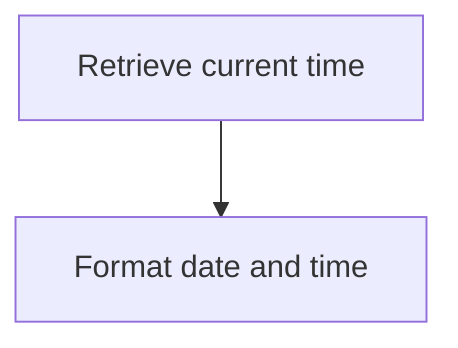

<SwmSnippet path="/src/base/cobol_src/DBCRFUN.cbl" line="846">

---

First, the <SwmToken path="src/base/cobol_src/DBCRFUN.cbl" pos="846:1:5" line-data="       POPULATE-TIME-DATE SECTION.">`POPULATE-TIME-DATE`</SwmToken> section begins by retrieving the current time using the <SwmToken path="src/base/cobol_src/DBCRFUN.cbl" pos="849:1:5" line-data="           EXEC CICS ASKTIME">`EXEC CICS ASKTIME`</SwmToken> command. This command stores the current time in the <SwmToken path="src/base/cobol_src/DBCRFUN.cbl" pos="850:3:7" line-data="              ABSTIME(WS-U-TIME)">`WS-U-TIME`</SwmToken> variable.

```cobol
       POPULATE-TIME-DATE SECTION.
       PTD10.

           EXEC CICS ASKTIME
              ABSTIME(WS-U-TIME)
           END-EXEC.
```

---

</SwmSnippet>

<SwmSnippet path="/src/base/cobol_src/DBCRFUN.cbl" line="853">

---

Next, the <SwmToken path="src/base/cobol_src/DBCRFUN.cbl" pos="853:1:5" line-data="           EXEC CICS FORMATTIME">`EXEC CICS FORMATTIME`</SwmToken> command is used to format the retrieved time. The <SwmToken path="src/base/cobol_src/DBCRFUN.cbl" pos="854:1:1" line-data="                     ABSTIME(WS-U-TIME)">`ABSTIME`</SwmToken> parameter is set to <SwmToken path="src/base/cobol_src/DBCRFUN.cbl" pos="854:3:7" line-data="                     ABSTIME(WS-U-TIME)">`WS-U-TIME`</SwmToken>, and the formatted date is stored in <SwmToken path="src/base/cobol_src/DBCRFUN.cbl" pos="855:3:7" line-data="                     DDMMYYYY(WS-ORIG-DATE)">`WS-ORIG-DATE`</SwmToken> while the formatted time is stored in <SwmToken path="src/base/cobol_src/DBCRFUN.cbl" pos="856:3:7" line-data="                     TIME(WS-TIME-NOW)">`WS-TIME-NOW`</SwmToken>.

```cobol
           EXEC CICS FORMATTIME
                     ABSTIME(WS-U-TIME)
                     DDMMYYYY(WS-ORIG-DATE)
                     TIME(WS-TIME-NOW)
                     DATESEP
           END-EXEC.
```

---

</SwmSnippet>

<SwmSnippet path="/src/base/cobol_src/DBCRFUN.cbl" line="860">

---

Finally, the section ends with the <SwmToken path="src/base/cobol_src/DBCRFUN.cbl" pos="860:1:1" line-data="       PTD999.">`PTD999`</SwmToken> label and an <SwmToken path="src/base/cobol_src/DBCRFUN.cbl" pos="861:1:1" line-data="           EXIT.">`EXIT`</SwmToken> statement, indicating the end of the <SwmToken path="src/base/cobol_src/DBCRFUN.cbl" pos="588:3:7" line-data="                 PERFORM POPULATE-TIME-DATE">`POPULATE-TIME-DATE`</SwmToken> section.

```cobol
       PTD999.
           EXIT.
```

---

</SwmSnippet>

## <SwmToken path="src/base/cobol_src/DBCRFUN.cbl" pos="229:3:11" line-data="           PERFORM GET-ME-OUT-OF-HERE.">`GET-ME-OUT-OF-HERE`</SwmToken>

Lets' zoom into this section of the flow:

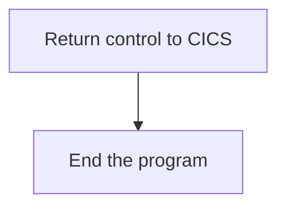

<SwmSnippet path="/src/base/cobol_src/DBCRFUN.cbl" line="660">

---

First, the <SwmToken path="src/base/cobol_src/DBCRFUN.cbl" pos="229:3:11" line-data="           PERFORM GET-ME-OUT-OF-HERE.">`GET-ME-OUT-OF-HERE`</SwmToken> function executes the <SwmToken path="src/base/cobol_src/DBCRFUN.cbl" pos="660:1:5" line-data="           EXEC CICS RETURN">`EXEC CICS RETURN`</SwmToken> command. This command returns control to the CICS region, indicating that the current task is complete and allowing CICS to manage the next steps in the transaction processing.

```cobol
           EXEC CICS RETURN
           END-EXEC.
```

---

</SwmSnippet>

<SwmSnippet path="/src/base/cobol_src/DBCRFUN.cbl" line="662">

---

Next, the <SwmToken path="src/base/cobol_src/DBCRFUN.cbl" pos="662:1:1" line-data="           GOBACK.">`GOBACK`</SwmToken> statement is used to return control to the calling program or to end the program if there is no calling program. This ensures that the program exits cleanly after returning control to CICS.

```cobol
           GOBACK.
```

---

</SwmSnippet>

&nbsp;

*This is an auto-generated document by Swimm 🌊 and has not yet been verified by a human*

<SwmMeta version="3.0.0" repo-id="Z2l0aHViJTNBJTNBY2ljcy1iYW5raW5nLXNhbXBsZS1hcHBsaWNhdGlvbi1jYnNhLUlCTS1EZW1vJTNBJTNBU3dpbW0tRGVtbw==" repo-name="cics-banking-sample-application-cbsa-IBM-Demo"><sup>Powered by [Swimm](/)</sup></SwmMeta>
