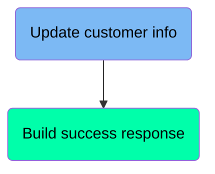
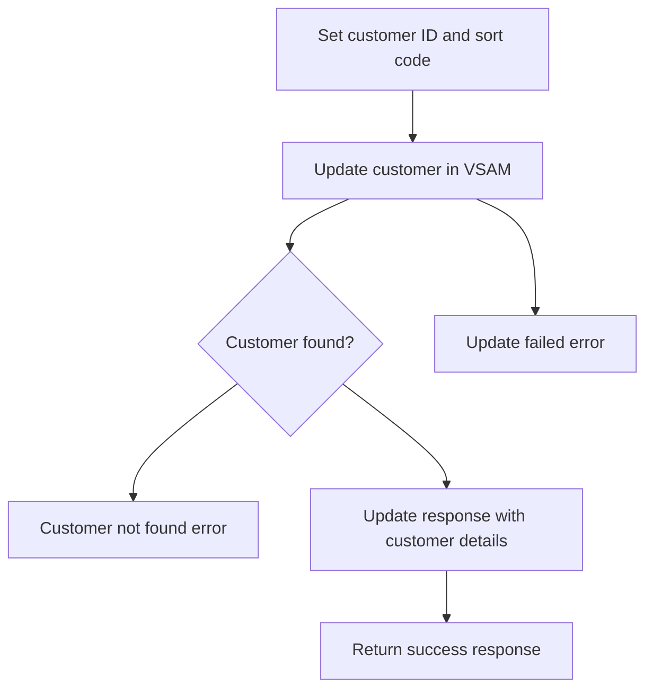
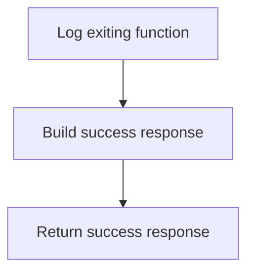

```mermaid
graph TD
  subgraph updateCustomerExternal
    updateCustomerExternal:A["Log entering updateCustomerExternal"] --> updateCustomerExternal:B["Call updateCustomerInternal"]
    updateCustomerExternal:B --> updateCustomerExternal:C["Initialize HBankDataAccess"]
    updateCustomerExternal:C --> updateCustomerExternal:D["Terminate HBankDataAccess"]
    updateCustomerExternal:D --> updateCustomerExternal:E["Log exiting updateCustomerExternal"]
    updateCustomerExternal:E --> updateCustomerExternal:F["Return response"]
  end
  
  subgraph updateCustomerInternal
    updateCustomerInternal:A["Validate customer information"] --> updateCustomerInternal:B["Check validation result"]
    updateCustomerInternal:B -->|Valid| updateCustomerInternal:C["Update customer data"]
    updateCustomerInternal:B -->|Invalid| updateCustomerInternal:D["Return error response"]
    updateCustomerInternal:C --> updateCustomerInternal:E["Return success response"]
    updateCustomerInternal:D --> updateCustomerInternal:F["Log validation failure"]
  end

%% Swimm:
%% graph TD
%%   subgraph <SwmToken path="src/webui/src/main/java/com/ibm/cics/cip/bankliberty/webui/data_access/Customer.java" pos="185:9:9" line-data="		Response myCustomerResponse = myCustomerResource.updateCustomerExternal(">`updateCustomerExternal`</SwmToken>
%%     <SwmToken path="src/webui/src/main/java/com/ibm/cics/cip/bankliberty/webui/data_access/Customer.java" pos="185:9:9" line-data="		Response myCustomerResponse = myCustomerResource.updateCustomerExternal(">`updateCustomerExternal`</SwmToken>:A["Log entering <SwmToken path="src/webui/src/main/java/com/ibm/cics/cip/bankliberty/webui/data_access/Customer.java" pos="185:9:9" line-data="		Response myCustomerResponse = myCustomerResource.updateCustomerExternal(">`updateCustomerExternal`</SwmToken>"] --> <SwmToken path="src/webui/src/main/java/com/ibm/cics/cip/bankliberty/webui/data_access/Customer.java" pos="185:9:9" line-data="		Response myCustomerResponse = myCustomerResource.updateCustomerExternal(">`updateCustomerExternal`</SwmToken>:B["Call <SwmToken path="src/webui/src/main/java/com/ibm/cics/cip/bankliberty/api/json/CustomerResource.java" pos="318:7:7" line-data="		Response myResponse = updateCustomerInternal(id, customer);">`updateCustomerInternal`</SwmToken>"]
%%     <SwmToken path="src/webui/src/main/java/com/ibm/cics/cip/bankliberty/webui/data_access/Customer.java" pos="185:9:9" line-data="		Response myCustomerResponse = myCustomerResource.updateCustomerExternal(">`updateCustomerExternal`</SwmToken>:B --> <SwmToken path="src/webui/src/main/java/com/ibm/cics/cip/bankliberty/webui/data_access/Customer.java" pos="185:9:9" line-data="		Response myCustomerResponse = myCustomerResource.updateCustomerExternal(">`updateCustomerExternal`</SwmToken>:C["Initialize <SwmToken path="src/webui/src/main/java/com/ibm/cics/cip/bankliberty/api/json/CustomerResource.java" pos="319:1:1" line-data="		HBankDataAccess myHBankDataAccess = new HBankDataAccess();">`HBankDataAccess`</SwmToken>"]
%%     <SwmToken path="src/webui/src/main/java/com/ibm/cics/cip/bankliberty/webui/data_access/Customer.java" pos="185:9:9" line-data="		Response myCustomerResponse = myCustomerResource.updateCustomerExternal(">`updateCustomerExternal`</SwmToken>:C --> <SwmToken path="src/webui/src/main/java/com/ibm/cics/cip/bankliberty/webui/data_access/Customer.java" pos="185:9:9" line-data="		Response myCustomerResponse = myCustomerResource.updateCustomerExternal(">`updateCustomerExternal`</SwmToken>:D["Terminate <SwmToken path="src/webui/src/main/java/com/ibm/cics/cip/bankliberty/api/json/CustomerResource.java" pos="319:1:1" line-data="		HBankDataAccess myHBankDataAccess = new HBankDataAccess();">`HBankDataAccess`</SwmToken>"]
%%     <SwmToken path="src/webui/src/main/java/com/ibm/cics/cip/bankliberty/webui/data_access/Customer.java" pos="185:9:9" line-data="		Response myCustomerResponse = myCustomerResource.updateCustomerExternal(">`updateCustomerExternal`</SwmToken>:D --> <SwmToken path="src/webui/src/main/java/com/ibm/cics/cip/bankliberty/webui/data_access/Customer.java" pos="185:9:9" line-data="		Response myCustomerResponse = myCustomerResource.updateCustomerExternal(">`updateCustomerExternal`</SwmToken>:E["Log exiting <SwmToken path="src/webui/src/main/java/com/ibm/cics/cip/bankliberty/webui/data_access/Customer.java" pos="185:9:9" line-data="		Response myCustomerResponse = myCustomerResource.updateCustomerExternal(">`updateCustomerExternal`</SwmToken>"]
%%     <SwmToken path="src/webui/src/main/java/com/ibm/cics/cip/bankliberty/webui/data_access/Customer.java" pos="185:9:9" line-data="		Response myCustomerResponse = myCustomerResource.updateCustomerExternal(">`updateCustomerExternal`</SwmToken>:E --> <SwmToken path="src/webui/src/main/java/com/ibm/cics/cip/bankliberty/webui/data_access/Customer.java" pos="185:9:9" line-data="		Response myCustomerResponse = myCustomerResource.updateCustomerExternal(">`updateCustomerExternal`</SwmToken>:F["Return response"]
%%   end
%%   
%%   subgraph <SwmToken path="src/webui/src/main/java/com/ibm/cics/cip/bankliberty/api/json/CustomerResource.java" pos="318:7:7" line-data="		Response myResponse = updateCustomerInternal(id, customer);">`updateCustomerInternal`</SwmToken>
%%     <SwmToken path="src/webui/src/main/java/com/ibm/cics/cip/bankliberty/api/json/CustomerResource.java" pos="318:7:7" line-data="		Response myResponse = updateCustomerInternal(id, customer);">`updateCustomerInternal`</SwmToken>:A["Validate customer information"] --> <SwmToken path="src/webui/src/main/java/com/ibm/cics/cip/bankliberty/api/json/CustomerResource.java" pos="318:7:7" line-data="		Response myResponse = updateCustomerInternal(id, customer);">`updateCustomerInternal`</SwmToken>:B["Check validation result"]
%%     <SwmToken path="src/webui/src/main/java/com/ibm/cics/cip/bankliberty/api/json/CustomerResource.java" pos="318:7:7" line-data="		Response myResponse = updateCustomerInternal(id, customer);">`updateCustomerInternal`</SwmToken>:B -->|Valid| <SwmToken path="src/webui/src/main/java/com/ibm/cics/cip/bankliberty/api/json/CustomerResource.java" pos="318:7:7" line-data="		Response myResponse = updateCustomerInternal(id, customer);">`updateCustomerInternal`</SwmToken>:C["Update customer data"]
%%     <SwmToken path="src/webui/src/main/java/com/ibm/cics/cip/bankliberty/api/json/CustomerResource.java" pos="318:7:7" line-data="		Response myResponse = updateCustomerInternal(id, customer);">`updateCustomerInternal`</SwmToken>:B -->|Invalid| <SwmToken path="src/webui/src/main/java/com/ibm/cics/cip/bankliberty/api/json/CustomerResource.java" pos="318:7:7" line-data="		Response myResponse = updateCustomerInternal(id, customer);">`updateCustomerInternal`</SwmToken>:D["Return error response"]
%%     <SwmToken path="src/webui/src/main/java/com/ibm/cics/cip/bankliberty/api/json/CustomerResource.java" pos="318:7:7" line-data="		Response myResponse = updateCustomerInternal(id, customer);">`updateCustomerInternal`</SwmToken>:C --> <SwmToken path="src/webui/src/main/java/com/ibm/cics/cip/bankliberty/api/json/CustomerResource.java" pos="318:7:7" line-data="		Response myResponse = updateCustomerInternal(id, customer);">`updateCustomerInternal`</SwmToken>:E["Return success response"]
%%     <SwmToken path="src/webui/src/main/java/com/ibm/cics/cip/bankliberty/api/json/CustomerResource.java" pos="318:7:7" line-data="		Response myResponse = updateCustomerInternal(id, customer);">`updateCustomerInternal`</SwmToken>:D --> <SwmToken path="src/webui/src/main/java/com/ibm/cics/cip/bankliberty/api/json/CustomerResource.java" pos="318:7:7" line-data="		Response myResponse = updateCustomerInternal(id, customer);">`updateCustomerInternal`</SwmToken>:F["Log validation failure"]
%%   end
```

```mermaid
graph TD
  subgraph updateCustomer
    updateCustomer:A["Set filename"] --> updateCustomer:B["Parse customer ID"] --> updateCustomer:C["Pad customer number"] --> updateCustomer:D["Build key"] --> updateCustomer:E["Read customer record for update"]
    updateCustomer:E --> updateCustomer:F["Update customer fields"] --> updateCustomer:G["Rewrite customer record"] --> updateCustomer:H["Fetch updated customer"] --> updateCustomer:I["Prepare birth date"] --> updateCustomer:J["Prepare review date"] --> updateCustomer:K["Create updated Customer"]
    updateCustomer:E -->|Record not found| updateCustomer:L["Return not found customer"]
    updateCustomer:E -->|Error| updateCustomer:M["Log and return null"]
  end

%% Swimm:
%% graph TD
%%   subgraph <SwmToken path="src/webui/src/main/java/com/ibm/cics/cip/bankliberty/api/json/CustomerResource.java" pos="416:7:7" line-data="		vsamCustomer = vsamCustomer.updateCustomer(customer);">`updateCustomer`</SwmToken>
%%     <SwmToken path="src/webui/src/main/java/com/ibm/cics/cip/bankliberty/api/json/CustomerResource.java" pos="416:7:7" line-data="		vsamCustomer = vsamCustomer.updateCustomer(customer);">`updateCustomer`</SwmToken>:A["Set filename"] --> <SwmToken path="src/webui/src/main/java/com/ibm/cics/cip/bankliberty/api/json/CustomerResource.java" pos="416:7:7" line-data="		vsamCustomer = vsamCustomer.updateCustomer(customer);">`updateCustomer`</SwmToken>:B["Parse customer ID"] --> <SwmToken path="src/webui/src/main/java/com/ibm/cics/cip/bankliberty/api/json/CustomerResource.java" pos="416:7:7" line-data="		vsamCustomer = vsamCustomer.updateCustomer(customer);">`updateCustomer`</SwmToken>:C["Pad customer number"] --> <SwmToken path="src/webui/src/main/java/com/ibm/cics/cip/bankliberty/api/json/CustomerResource.java" pos="416:7:7" line-data="		vsamCustomer = vsamCustomer.updateCustomer(customer);">`updateCustomer`</SwmToken>:D["Build key"] --> <SwmToken path="src/webui/src/main/java/com/ibm/cics/cip/bankliberty/api/json/CustomerResource.java" pos="416:7:7" line-data="		vsamCustomer = vsamCustomer.updateCustomer(customer);">`updateCustomer`</SwmToken>:E["Read customer record for update"]
%%     <SwmToken path="src/webui/src/main/java/com/ibm/cics/cip/bankliberty/api/json/CustomerResource.java" pos="416:7:7" line-data="		vsamCustomer = vsamCustomer.updateCustomer(customer);">`updateCustomer`</SwmToken>:E --> <SwmToken path="src/webui/src/main/java/com/ibm/cics/cip/bankliberty/api/json/CustomerResource.java" pos="416:7:7" line-data="		vsamCustomer = vsamCustomer.updateCustomer(customer);">`updateCustomer`</SwmToken>:F["Update customer fields"] --> <SwmToken path="src/webui/src/main/java/com/ibm/cics/cip/bankliberty/api/json/CustomerResource.java" pos="416:7:7" line-data="		vsamCustomer = vsamCustomer.updateCustomer(customer);">`updateCustomer`</SwmToken>:G["Rewrite customer record"] --> <SwmToken path="src/webui/src/main/java/com/ibm/cics/cip/bankliberty/api/json/CustomerResource.java" pos="416:7:7" line-data="		vsamCustomer = vsamCustomer.updateCustomer(customer);">`updateCustomer`</SwmToken>:H["Fetch updated customer"] --> <SwmToken path="src/webui/src/main/java/com/ibm/cics/cip/bankliberty/api/json/CustomerResource.java" pos="416:7:7" line-data="		vsamCustomer = vsamCustomer.updateCustomer(customer);">`updateCustomer`</SwmToken>:I["Prepare birth date"] --> <SwmToken path="src/webui/src/main/java/com/ibm/cics/cip/bankliberty/api/json/CustomerResource.java" pos="416:7:7" line-data="		vsamCustomer = vsamCustomer.updateCustomer(customer);">`updateCustomer`</SwmToken>:J["Prepare review date"] --> <SwmToken path="src/webui/src/main/java/com/ibm/cics/cip/bankliberty/api/json/CustomerResource.java" pos="416:7:7" line-data="		vsamCustomer = vsamCustomer.updateCustomer(customer);">`updateCustomer`</SwmToken>:K["Create updated Customer"]
%%     <SwmToken path="src/webui/src/main/java/com/ibm/cics/cip/bankliberty/api/json/CustomerResource.java" pos="416:7:7" line-data="		vsamCustomer = vsamCustomer.updateCustomer(customer);">`updateCustomer`</SwmToken>:E -->|Record not found| <SwmToken path="src/webui/src/main/java/com/ibm/cics/cip/bankliberty/api/json/CustomerResource.java" pos="416:7:7" line-data="		vsamCustomer = vsamCustomer.updateCustomer(customer);">`updateCustomer`</SwmToken>:L["Return not found customer"]
%%     <SwmToken path="src/webui/src/main/java/com/ibm/cics/cip/bankliberty/api/json/CustomerResource.java" pos="416:7:7" line-data="		vsamCustomer = vsamCustomer.updateCustomer(customer);">`updateCustomer`</SwmToken>:E -->|Error| <SwmToken path="src/webui/src/main/java/com/ibm/cics/cip/bankliberty/api/json/CustomerResource.java" pos="416:7:7" line-data="		vsamCustomer = vsamCustomer.updateCustomer(customer);">`updateCustomer`</SwmToken>:M["Log and return null"]
%%   end
```

In this document, we will explain the process of updating customer information. The process involves initializing necessary objects, updating customer details via an API, handling the response, and ensuring the update is successful.

The flow starts with creating instances of <SwmToken path="src/webui/src/main/java/com/ibm/cics/cip/bankliberty/webui/data_access/Customer.java" pos="176:1:1" line-data="		CustomerResource myCustomerResource = new CustomerResource();">`CustomerResource`</SwmToken> and <SwmToken path="src/webui/src/main/java/com/ibm/cics/cip/bankliberty/webui/data_access/Customer.java" pos="178:1:1" line-data="		CustomerJSON myCustomerJSON = new CustomerJSON();">`CustomerJSON`</SwmToken> objects. The <SwmToken path="src/webui/src/main/java/com/ibm/cics/cip/bankliberty/webui/data_access/Customer.java" pos="178:1:1" line-data="		CustomerJSON myCustomerJSON = new CustomerJSON();">`CustomerJSON`</SwmToken> object is populated with the customer's current details such as address, name, and sort code. Then, the <SwmToken path="src/webui/src/main/java/com/ibm/cics/cip/bankliberty/webui/data_access/Customer.java" pos="185:9:9" line-data="		Response myCustomerResponse = myCustomerResource.updateCustomerExternal(">`updateCustomerExternal`</SwmToken> method is called to update the customer information through a RESTful API. The response is checked for success, and if successful, the customer's details are updated accordingly. If the update fails, an appropriate response is returned.

Here is a high level diagram of the flow, showing only the most important functions:

```mermaid
graph TD;
      subgraph srcwebuisrcmainjavacomibmcicscipbankliberty[src/…/cip/bankliberty]
c7dbe1ab6ed5d43dbddcc6e77733227c5ab2dbc4aa8fdd2988df3f90e66e8731(Customer.updateThis) --> aaa01355eb401c510c97cc760d5b82117d42e7d2e58df5c85d7cc11a2de230bb(CustomerResource.updateCustomerExternal)
end

subgraph srcwebuisrcmainjavacomibmcicscipbankliberty[src/…/cip/bankliberty]
aaa01355eb401c510c97cc760d5b82117d42e7d2e58df5c85d7cc11a2de230bb(CustomerResource.updateCustomerExternal) --> c6a8d40df518c67fc7c9d7a9edd08025d662fb5627929c081e079617550bbc21(CustomerResource.updateCustomerInternal)
end

subgraph srcwebuisrcmainjavacomibmcicscipbankliberty[src/…/cip/bankliberty]
c6a8d40df518c67fc7c9d7a9edd08025d662fb5627929c081e079617550bbc21(CustomerResource.updateCustomerInternal) --> 9d60b8b5c289a8255ab82550088368e37b6e3e69ec0f3e5085560dfb4c138f3f(Customer.updateCustomer)
end


      classDef mainFlowStyle color:#000000,fill:#7CB9F4
classDef rootsStyle color:#000000,fill:#00FFF4
classDef Style1 color:#000000,fill:#00FFAA
classDef Style2 color:#000000,fill:#FFFF00
classDef Style3 color:#000000,fill:#AA7CB9

%% Swimm:
%% graph TD;
%%       subgraph srcwebuisrcmainjavacomibmcicscipbankliberty[<SwmPath>[src/…/cip/bankliberty/](src/webui/src/main/java/com/ibm/cics/cip/bankliberty/)</SwmPath>]
%% c7dbe1ab6ed5d43dbddcc6e77733227c5ab2dbc4aa8fdd2988df3f90e66e8731(Customer.updateThis) --> aaa01355eb401c510c97cc760d5b82117d42e7d2e58df5c85d7cc11a2de230bb(CustomerResource.updateCustomerExternal)
%% end
%% 
%% subgraph srcwebuisrcmainjavacomibmcicscipbankliberty[<SwmPath>[src/…/cip/bankliberty/](src/webui/src/main/java/com/ibm/cics/cip/bankliberty/)</SwmPath>]
%% aaa01355eb401c510c97cc760d5b82117d42e7d2e58df5c85d7cc11a2de230bb(CustomerResource.updateCustomerExternal) --> c6a8d40df518c67fc7c9d7a9edd08025d662fb5627929c081e079617550bbc21(<SwmToken path="src/webui/src/main/java/com/ibm/cics/cip/bankliberty/api/json/CustomerResource.java" pos="342:17:19" line-data="					() -&gt; &quot;Customer name is null in CustomerResource.updateCustomerInternal(), &quot;">`CustomerResource.updateCustomerInternal`</SwmToken>)
%% end
%% 
%% subgraph srcwebuisrcmainjavacomibmcicscipbankliberty[<SwmPath>[src/…/cip/bankliberty/](src/webui/src/main/java/com/ibm/cics/cip/bankliberty/)</SwmPath>]
%% c6a8d40df518c67fc7c9d7a9edd08025d662fb5627929c081e079617550bbc21(<SwmToken path="src/webui/src/main/java/com/ibm/cics/cip/bankliberty/api/json/CustomerResource.java" pos="342:17:19" line-data="					() -&gt; &quot;Customer name is null in CustomerResource.updateCustomerInternal(), &quot;">`CustomerResource.updateCustomerInternal`</SwmToken>) --> 9d60b8b5c289a8255ab82550088368e37b6e3e69ec0f3e5085560dfb4c138f3f(Customer.updateCustomer)
%% end
%% 
%% 
%%       classDef mainFlowStyle color:#000000,fill:#7CB9F4
%% classDef rootsStyle color:#000000,fill:#00FFF4
%% classDef Style1 color:#000000,fill:#00FFAA
%% classDef Style2 color:#000000,fill:#FFFF00
%% classDef Style3 color:#000000,fill:#AA7CB9
```



# Flow drill down

```mermaid
graph TD
  subgraph updateThis
    updateThis:A["Create CustomerResource instance"] --> updateThis:B["Create CustomerJSON instance"]
    updateThis:B --> updateThis:C["Set customer address"]
    updateThis:C --> updateThis:D["Set customer name"]
    updateThis:D --> updateThis:E["Set sort code"]
    updateThis:E --> updateThis:F["Update customer details via API"]
    updateThis:F --> updateThis:G["Check if update was successful"]
    updateThis:G -->|Status 200| updateThis:H["Parse response JSON"]
    updateThis:H --> updateThis:I["Sort out and set date of birth"]
    updateThis:I --> updateThis:J["Set customer address"]
    updateThis:J --> updateThis:K["Set customer name"]
    updateThis:K --> updateThis:L["Set sort code"]
    updateThis:L --> updateThis:M["Set customer number"]
  end

%% Swimm:
%% graph TD
%%   subgraph <SwmToken path="src/webui/src/main/java/com/ibm/cics/cip/bankliberty/webui/data_access/Customer.java" pos="174:5:5" line-data="	public boolean updateThis()">`updateThis`</SwmToken>
%%     <SwmToken path="src/webui/src/main/java/com/ibm/cics/cip/bankliberty/webui/data_access/Customer.java" pos="174:5:5" line-data="	public boolean updateThis()">`updateThis`</SwmToken>:A["Create <SwmToken path="src/webui/src/main/java/com/ibm/cics/cip/bankliberty/webui/data_access/Customer.java" pos="176:1:1" line-data="		CustomerResource myCustomerResource = new CustomerResource();">`CustomerResource`</SwmToken> instance"] --> <SwmToken path="src/webui/src/main/java/com/ibm/cics/cip/bankliberty/webui/data_access/Customer.java" pos="174:5:5" line-data="	public boolean updateThis()">`updateThis`</SwmToken>:B["Create <SwmToken path="src/webui/src/main/java/com/ibm/cics/cip/bankliberty/webui/data_access/Customer.java" pos="178:1:1" line-data="		CustomerJSON myCustomerJSON = new CustomerJSON();">`CustomerJSON`</SwmToken> instance"]
%%     <SwmToken path="src/webui/src/main/java/com/ibm/cics/cip/bankliberty/webui/data_access/Customer.java" pos="174:5:5" line-data="	public boolean updateThis()">`updateThis`</SwmToken>:B --> <SwmToken path="src/webui/src/main/java/com/ibm/cics/cip/bankliberty/webui/data_access/Customer.java" pos="174:5:5" line-data="	public boolean updateThis()">`updateThis`</SwmToken>:C["Set customer address"]
%%     <SwmToken path="src/webui/src/main/java/com/ibm/cics/cip/bankliberty/webui/data_access/Customer.java" pos="174:5:5" line-data="	public boolean updateThis()">`updateThis`</SwmToken>:C --> <SwmToken path="src/webui/src/main/java/com/ibm/cics/cip/bankliberty/webui/data_access/Customer.java" pos="174:5:5" line-data="	public boolean updateThis()">`updateThis`</SwmToken>:D["Set customer name"]
%%     <SwmToken path="src/webui/src/main/java/com/ibm/cics/cip/bankliberty/webui/data_access/Customer.java" pos="174:5:5" line-data="	public boolean updateThis()">`updateThis`</SwmToken>:D --> <SwmToken path="src/webui/src/main/java/com/ibm/cics/cip/bankliberty/webui/data_access/Customer.java" pos="174:5:5" line-data="	public boolean updateThis()">`updateThis`</SwmToken>:E["Set sort code"]
%%     <SwmToken path="src/webui/src/main/java/com/ibm/cics/cip/bankliberty/webui/data_access/Customer.java" pos="174:5:5" line-data="	public boolean updateThis()">`updateThis`</SwmToken>:E --> <SwmToken path="src/webui/src/main/java/com/ibm/cics/cip/bankliberty/webui/data_access/Customer.java" pos="174:5:5" line-data="	public boolean updateThis()">`updateThis`</SwmToken>:F["Update customer details via API"]
%%     <SwmToken path="src/webui/src/main/java/com/ibm/cics/cip/bankliberty/webui/data_access/Customer.java" pos="174:5:5" line-data="	public boolean updateThis()">`updateThis`</SwmToken>:F --> <SwmToken path="src/webui/src/main/java/com/ibm/cics/cip/bankliberty/webui/data_access/Customer.java" pos="174:5:5" line-data="	public boolean updateThis()">`updateThis`</SwmToken>:G["Check if update was successful"]
%%     <SwmToken path="src/webui/src/main/java/com/ibm/cics/cip/bankliberty/webui/data_access/Customer.java" pos="174:5:5" line-data="	public boolean updateThis()">`updateThis`</SwmToken>:G -->|Status 200| <SwmToken path="src/webui/src/main/java/com/ibm/cics/cip/bankliberty/webui/data_access/Customer.java" pos="174:5:5" line-data="	public boolean updateThis()">`updateThis`</SwmToken>:H["Parse response JSON"]
%%     <SwmToken path="src/webui/src/main/java/com/ibm/cics/cip/bankliberty/webui/data_access/Customer.java" pos="174:5:5" line-data="	public boolean updateThis()">`updateThis`</SwmToken>:H --> <SwmToken path="src/webui/src/main/java/com/ibm/cics/cip/bankliberty/webui/data_access/Customer.java" pos="174:5:5" line-data="	public boolean updateThis()">`updateThis`</SwmToken>:I["Sort out and set date of birth"]
%%     <SwmToken path="src/webui/src/main/java/com/ibm/cics/cip/bankliberty/webui/data_access/Customer.java" pos="174:5:5" line-data="	public boolean updateThis()">`updateThis`</SwmToken>:I --> <SwmToken path="src/webui/src/main/java/com/ibm/cics/cip/bankliberty/webui/data_access/Customer.java" pos="174:5:5" line-data="	public boolean updateThis()">`updateThis`</SwmToken>:J["Set customer address"]
%%     <SwmToken path="src/webui/src/main/java/com/ibm/cics/cip/bankliberty/webui/data_access/Customer.java" pos="174:5:5" line-data="	public boolean updateThis()">`updateThis`</SwmToken>:J --> <SwmToken path="src/webui/src/main/java/com/ibm/cics/cip/bankliberty/webui/data_access/Customer.java" pos="174:5:5" line-data="	public boolean updateThis()">`updateThis`</SwmToken>:K["Set customer name"]
%%     <SwmToken path="src/webui/src/main/java/com/ibm/cics/cip/bankliberty/webui/data_access/Customer.java" pos="174:5:5" line-data="	public boolean updateThis()">`updateThis`</SwmToken>:K --> <SwmToken path="src/webui/src/main/java/com/ibm/cics/cip/bankliberty/webui/data_access/Customer.java" pos="174:5:5" line-data="	public boolean updateThis()">`updateThis`</SwmToken>:L["Set sort code"]
%%     <SwmToken path="src/webui/src/main/java/com/ibm/cics/cip/bankliberty/webui/data_access/Customer.java" pos="174:5:5" line-data="	public boolean updateThis()">`updateThis`</SwmToken>:L --> <SwmToken path="src/webui/src/main/java/com/ibm/cics/cip/bankliberty/webui/data_access/Customer.java" pos="174:5:5" line-data="	public boolean updateThis()">`updateThis`</SwmToken>:M["Set customer number"]
%%   end
```

## Zooming into <SwmToken path="src/webui/src/main/java/com/ibm/cics/cip/bankliberty/webui/data_access/Customer.java" pos="174:5:5" line-data="	public boolean updateThis()">`updateThis`</SwmToken>



## Updating customer information

First, the <SwmToken path="src/webui/src/main/java/com/ibm/cics/cip/bankliberty/webui/data_access/Customer.java" pos="174:5:5" line-data="	public boolean updateThis()">`updateThis`</SwmToken> method initializes a <SwmToken path="src/webui/src/main/java/com/ibm/cics/cip/bankliberty/webui/data_access/Customer.java" pos="176:1:1" line-data="		CustomerResource myCustomerResource = new CustomerResource();">`CustomerResource`</SwmToken> object and a <SwmToken path="src/webui/src/main/java/com/ibm/cics/cip/bankliberty/webui/data_access/Customer.java" pos="178:1:1" line-data="		CustomerJSON myCustomerJSON = new CustomerJSON();">`CustomerJSON`</SwmToken> object. The <SwmToken path="src/webui/src/main/java/com/ibm/cics/cip/bankliberty/webui/data_access/Customer.java" pos="178:1:1" line-data="		CustomerJSON myCustomerJSON = new CustomerJSON();">`CustomerJSON`</SwmToken> object is populated with the current customer's address, name, and sort code.

## Handling the response

Next, the method calls <SwmToken path="src/webui/src/main/java/com/ibm/cics/cip/bankliberty/webui/data_access/Customer.java" pos="185:9:9" line-data="		Response myCustomerResponse = myCustomerResource.updateCustomerExternal(">`updateCustomerExternal`</SwmToken> on the <SwmToken path="src/webui/src/main/java/com/ibm/cics/cip/bankliberty/webui/data_access/Customer.java" pos="176:1:1" line-data="		CustomerResource myCustomerResource = new CustomerResource();">`CustomerResource`</SwmToken> object, passing the customer number and the populated <SwmToken path="src/webui/src/main/java/com/ibm/cics/cip/bankliberty/webui/data_access/Customer.java" pos="178:1:1" line-data="		CustomerJSON myCustomerJSON = new CustomerJSON();">`CustomerJSON`</SwmToken> object. This call updates the customer information through a RESTful API.

Then, the method checks the response status. If the status is 200, indicating success, it parses the response entity into a JSON object. The method then updates the customer's date of birth, address, name, sort code, and customer number with the values from the JSON object.

<SwmSnippet path="/src/webui/src/main/java/com/ibm/cics/cip/bankliberty/webui/data_access/Customer.java" line="174">

---

If the response status is not 200, the method returns false, indicating that the update was unsuccessful. Finally, if all updates are successful, the method returns true.

```java
	public boolean updateThis()
	{
		CustomerResource myCustomerResource = new CustomerResource();

		CustomerJSON myCustomerJSON = new CustomerJSON();

		myCustomerJSON.setCustomerAddress(this.getAddress());
		myCustomerJSON.setCustomerName(this.getName());
		myCustomerJSON.setSortCode(this.getSortcode());
		myCustomerJSON.setSortCode(this.getSortcode());

		Response myCustomerResponse = myCustomerResource.updateCustomerExternal(
				Long.parseLong(this.getCustomerNumber()), myCustomerJSON);

		String myCustomerString = null;
		JSONObject myCustomer = null;

		if (myCustomerResponse.getStatus() == 200)
		{
			myCustomerString = myCustomerResponse.getEntity().toString();
			try
```

---

</SwmSnippet>

## Exploring <SwmToken path="src/webui/src/main/java/com/ibm/cics/cip/bankliberty/webui/data_access/Customer.java" pos="185:9:9" line-data="		Response myCustomerResponse = myCustomerResource.updateCustomerExternal(">`updateCustomerExternal`</SwmToken>



<SwmSnippet path="/src/webui/src/main/java/com/ibm/cics/cip/bankliberty/api/json/CustomerResource.java" line="309">

---

## <SwmToken path="src/webui/src/main/java/com/ibm/cics/cip/bankliberty/webui/data_access/Customer.java" pos="185:9:9" line-data="		Response myCustomerResponse = myCustomerResource.updateCustomerExternal(">`updateCustomerExternal`</SwmToken>

First, the <SwmToken path="src/webui/src/main/java/com/ibm/cics/cip/bankliberty/webui/data_access/Customer.java" pos="185:9:9" line-data="		Response myCustomerResponse = myCustomerResource.updateCustomerExternal(">`updateCustomerExternal`</SwmToken> method is responsible for handling the external request to update customer information. It is annotated with <SwmToken path="src/webui/src/main/java/com/ibm/cics/cip/bankliberty/api/json/CustomerResource.java" pos="309:1:2" line-data="	@PUT">`@PUT`</SwmToken> to indicate that it handles HTTP PUT requests and specifies the path and media types it consumes and produces.

```java
	@PUT
	@Path("/{id}")
	@Consumes(MediaType.APPLICATION_JSON)
	@Produces(MediaType.APPLICATION_JSON)
```

---

</SwmSnippet>

<SwmSnippet path="/src/webui/src/main/java/com/ibm/cics/cip/bankliberty/api/json/CustomerResource.java" line="316">

---

Next, the method logs the entry into the <SwmToken path="src/webui/src/main/java/com/ibm/cics/cip/bankliberty/webui/data_access/Customer.java" pos="185:9:9" line-data="		Response myCustomerResponse = myCustomerResource.updateCustomerExternal(">`updateCustomerExternal`</SwmToken> process, which helps in tracking and debugging the flow of the update operation.

```java
		logger.entering(this.getClass().getName(),
				UPDATE_CUSTOMER_EXTERNAL + id);
```

---

</SwmSnippet>

<SwmSnippet path="/src/webui/src/main/java/com/ibm/cics/cip/bankliberty/api/json/CustomerResource.java" line="318">

---

Then, it calls the <SwmToken path="src/webui/src/main/java/com/ibm/cics/cip/bankliberty/api/json/CustomerResource.java" pos="318:7:7" line-data="		Response myResponse = updateCustomerInternal(id, customer);">`updateCustomerInternal`</SwmToken> method, passing the customer ID and the customer data to handle the actual update logic. This method is responsible for validating and updating the customer data in the system.

```java
		Response myResponse = updateCustomerInternal(id, customer);
```

---

</SwmSnippet>

<SwmSnippet path="/src/webui/src/main/java/com/ibm/cics/cip/bankliberty/api/json/CustomerResource.java" line="319">

---

After the internal update process, the method initializes an instance of <SwmToken path="src/webui/src/main/java/com/ibm/cics/cip/bankliberty/api/json/CustomerResource.java" pos="319:1:1" line-data="		HBankDataAccess myHBankDataAccess = new HBankDataAccess();">`HBankDataAccess`</SwmToken> to manage the data access layer and then terminates it to ensure that resources are properly released.

```java
		HBankDataAccess myHBankDataAccess = new HBankDataAccess();
		myHBankDataAccess.terminate();
```

---

</SwmSnippet>

<SwmSnippet path="/src/webui/src/main/java/com/ibm/cics/cip/bankliberty/api/json/CustomerResource.java" line="321">

---

Finally, the method logs the exit from the <SwmToken path="src/webui/src/main/java/com/ibm/cics/cip/bankliberty/webui/data_access/Customer.java" pos="185:9:9" line-data="		Response myCustomerResponse = myCustomerResource.updateCustomerExternal(">`updateCustomerExternal`</SwmToken> process and returns the response generated by the <SwmToken path="src/webui/src/main/java/com/ibm/cics/cip/bankliberty/api/json/CustomerResource.java" pos="318:7:7" line-data="		Response myResponse = updateCustomerInternal(id, customer);">`updateCustomerInternal`</SwmToken> method, which indicates the success or failure of the update operation.

```java
		logger.exiting(this.getClass().getName(), UPDATE_CUSTOMER_EXTERNAL + id,
				myResponse);
		return myResponse;
```

---

</SwmSnippet>

## Diving into the <SwmToken path="src/webui/src/main/java/com/ibm/cics/cip/bankliberty/api/json/CustomerResource.java" pos="318:7:7" line-data="		Response myResponse = updateCustomerInternal(id, customer);">`updateCustomerInternal`</SwmToken> function



## <SwmToken path="src/webui/src/main/java/com/ibm/cics/cip/bankliberty/api/json/CustomerResource.java" pos="318:7:7" line-data="		Response myResponse = updateCustomerInternal(id, customer);">`updateCustomerInternal`</SwmToken> function - Update customer info

Here is a diagram of this part:



<SwmSnippet path="/src/webui/src/main/java/com/ibm/cics/cip/bankliberty/api/json/CustomerResource.java" line="414">

---

### Setting customer ID and sort code

The function begins by setting the customer ID and sort code for the <SwmToken path="src/webui/src/main/java/com/ibm/cics/cip/bankliberty/api/json/CustomerResource.java" pos="414:1:1" line-data="		customer.setId(id.toString());">`customer`</SwmToken> object. This ensures that the customer data being updated is correctly identified and associated with the appropriate bank sort code.

```java
		customer.setId(id.toString());
		customer.setSortCode(this.getSortCode().toString());
```

---

</SwmSnippet>

<SwmSnippet path="/src/webui/src/main/java/com/ibm/cics/cip/bankliberty/api/json/CustomerResource.java" line="416">

---

### Updating customer in VSAM

Next, the function attempts to update the customer information in the VSAM (Virtual Storage Access Method) system by calling the <SwmToken path="src/webui/src/main/java/com/ibm/cics/cip/bankliberty/api/json/CustomerResource.java" pos="416:7:7" line-data="		vsamCustomer = vsamCustomer.updateCustomer(customer);">`updateCustomer`</SwmToken> method. This method handles the actual update process, including reading the current customer data, applying the updates, and writing the modified data back to the file.

```java
		vsamCustomer = vsamCustomer.updateCustomer(customer);
```

---

</SwmSnippet>

<SwmSnippet path="/src/webui/src/main/java/com/ibm/cics/cip/bankliberty/api/json/CustomerResource.java" line="419">

---

### Handling customer not found error

If the customer is not found in the VSAM system, the function constructs an error response indicating that the customer with the specified ID was not found. This is crucial for informing the client that the update operation could not be completed because the customer does not exist in the system.

```java
			if (vsamCustomer.isNotFound())
			{
				JSONObject error = new JSONObject();
				error.put(JSON_ERROR_MSG,
						CUSTOMER_PREFIX + id.toString() + " not found.");
				Response myResponse = Response.status(404)
						.entity(error.toString()).build();
				logger.log(Level.WARNING,
						() -> "Failed to find customer in com.ibm.cics.cip.bankliberty.web.vsam.Customer");
				logger.exiting(this.getClass().getName(),
						"updateCustomerInternal() exiting", myResponse);
				return myResponse;
```

---

</SwmSnippet>

<SwmSnippet path="/src/webui/src/main/java/com/ibm/cics/cip/bankliberty/api/json/CustomerResource.java" line="432">

---

### Updating response with customer details

If the customer is successfully updated, the function populates the response object with the updated customer details, including customer number, sort code, name, address, and date of birth. This ensures that the client receives the most current information about the customer.

```java
			response.put(JSON_ID, vsamCustomer.getCustomerNumber());
			response.put(JSON_SORT_CODE, vsamCustomer.getSortcode().trim());
			response.put(JSON_CUSTOMER_NAME, vsamCustomer.getName().trim());
			response.put(JSON_CUSTOMER_ADDRESS,
					vsamCustomer.getAddress().trim());
			response.put(JSON_DATE_OF_BIRTH,
					vsamCustomer.getDob().toString().trim());
```

---

</SwmSnippet>

<SwmSnippet path="/src/webui/src/main/java/com/ibm/cics/cip/bankliberty/api/json/CustomerResource.java" line="441">

---

### Handling update failure

If the update operation fails for any reason, the function constructs an error response indicating that the update operation could not be completed. This is important for informing the client about the failure and allowing them to take appropriate action.

```java
		{
			JSONObject error = new JSONObject();
			error.put(JSON_ERROR_MSG,
					"Failed to update customer in com.ibm.cics.cip.bankliberty.web.vsam.Customer");
			Response myResponse = Response.status(500).entity(error.toString())
					.build();
			logger.log(Level.WARNING,
					() -> "Failed to update customer in com.ibm.cics.cip.bankliberty.web.vsam.Customer");
			logger.exiting(this.getClass().getName(),
					"updateCustomerInternal() exiting", myResponse);
			return myResponse;
```

---

</SwmSnippet>

## <SwmToken path="src/webui/src/main/java/com/ibm/cics/cip/bankliberty/api/json/CustomerResource.java" pos="318:7:7" line-data="		Response myResponse = updateCustomerInternal(id, customer);">`updateCustomerInternal`</SwmToken> function - Build success response

Here is a diagram of this part:



<SwmSnippet path="/src/webui/src/main/java/com/ibm/cics/cip/bankliberty/api/json/CustomerResource.java" line="453">

---

### Building the success response

After successfully updating the customer details, the function logs the exit from the <SwmToken path="src/webui/src/main/java/com/ibm/cics/cip/bankliberty/api/json/CustomerResource.java" pos="318:7:7" line-data="		Response myResponse = updateCustomerInternal(id, customer);">`updateCustomerInternal`</SwmToken> method with the customer ID and the response object.

```java

		logger.exiting(this.getClass().getName(), UPDATE_CUSTOMER_INTERNAL + id,
				Response.status(200).entity(response.toString()).build());
```

---

</SwmSnippet>

<SwmSnippet path="/src/webui/src/main/java/com/ibm/cics/cip/bankliberty/api/json/CustomerResource.java" line="456">

---

Finally, the function returns a success response with a status code of 200, including the updated customer details in the response body.

```java
		return Response.status(200).entity(response.toString()).build();
	}
```

---

</SwmSnippet>

## Exploring <SwmToken path="src/webui/src/main/java/com/ibm/cics/cip/bankliberty/api/json/CustomerResource.java" pos="416:7:7" line-data="		vsamCustomer = vsamCustomer.updateCustomer(customer);">`updateCustomer`</SwmToken>



<SwmSnippet path="/src/webui/src/main/java/com/ibm/cics/cip/bankliberty/web/vsam/Customer.java" line="513">

---

## Updating customer details

First, the method sets the name of the customer file and initializes a <SwmToken path="src/webui/src/main/java/com/ibm/cics/cip/bankliberty/web/vsam/Customer.java" pos="515:7:7" line-data="		holder = new RecordHolder();">`RecordHolder`</SwmToken> to hold the customer record. It then parses the customer ID and pads it to ensure it meets the required format.

```java
		customerFile.setName(FILENAME);
		Customer temp;
		holder = new RecordHolder();

		Long customerNumberLong = Long.parseLong(customer.getId());

		customer.setId(padCustomerNumber(customer.getId()));
```

---

</SwmSnippet>

<SwmSnippet path="/src/webui/src/main/java/com/ibm/cics/cip/bankliberty/web/vsam/Customer.java" line="521">

---

## Building the key and reading the record

Next, the method builds a key using the customer's sort code and ID, and attempts to read the customer record for update. If the record is found, it updates the customer's address and name, and rewrites the record in the file.

```java
		byte[] key = buildKey(Integer.valueOf(customer.getSortCode()),
				Long.valueOf(customer.getId()));

		try
		{
			customerFile.readForUpdate(key, holder);
			myCustomer = new CUSTOMER(holder.getValue());
			myCustomer.setCustomerAddress(customer.getCustomerAddress());
			myCustomer.setCustomerName(customer.getCustomerName());
			customerFile.rewrite(myCustomer.getByteBuffer());
```

---

</SwmSnippet>

<SwmSnippet path="/src/webui/src/main/java/com/ibm/cics/cip/bankliberty/web/vsam/Customer.java" line="533">

---

## Handling exceptions

Then, the method handles various exceptions that might occur during the update process, such as <SwmToken path="src/webui/src/main/java/com/ibm/cics/cip/bankliberty/web/vsam/Customer.java" pos="533:4:4" line-data="		catch (InvalidSystemIdException | LogicException">`InvalidSystemIdException`</SwmToken>, <SwmToken path="src/webui/src/main/java/com/ibm/cics/cip/bankliberty/web/vsam/Customer.java" pos="533:8:8" line-data="		catch (InvalidSystemIdException | LogicException">`LogicException`</SwmToken>, and <SwmToken path="src/webui/src/main/java/com/ibm/cics/cip/bankliberty/web/vsam/Customer.java" pos="547:4:4" line-data="		catch (RecordNotFoundException e2)">`RecordNotFoundException`</SwmToken>. If an exception occurs, it logs the error and returns an appropriate response.

```java
		catch (InvalidSystemIdException | LogicException
				| InvalidRequestException | IOErrorException | ChangedException
				| LockedException | LoadingException | RecordBusyException
				| FileDisabledException | DuplicateKeyException
				| FileNotFoundException | ISCInvalidRequestException
				| NotAuthorisedException | NotOpenException
				| LengthErrorException | DuplicateRecordException
				| NoSpaceException e)
		{
			logger.severe("Error updating customer " + customerNumberLong + " "
					+ e.getLocalizedMessage());
			logger.exiting(this.getClass().getName(), UPDATE_CUSTOMER, null);
			return null;
		}
		catch (RecordNotFoundException e2)
		{
			Customer customer404 = new Customer();
			customer404.setNotFound(true);
			logger.exiting(this.getClass().getName(), UPDATE_CUSTOMER,
					customer404);
			return customer404;
```

---

</SwmSnippet>

<SwmSnippet path="/src/webui/src/main/java/com/ibm/cics/cip/bankliberty/web/vsam/Customer.java" line="556">

---

## Finalizing the update

Finally, the method sets the customer's birth date and review date, pads the customer number, and creates a new <SwmToken path="src/webui/src/main/java/com/ibm/cics/cip/bankliberty/web/vsam/Customer.java" pos="572:7:7" line-data="		temp = new Customer(myCustomerNumber,">`Customer`</SwmToken> object with the updated details. It then logs the successful update and returns the updated customer object.

```java
		Calendar myCalendar = Calendar.getInstance();
		myCalendar.set(Calendar.YEAR, myCustomer.getCustomerBirthYear());
		myCalendar.set(Calendar.MONTH, myCustomer.getCustomerBirthMonth());
		myCalendar.set(Calendar.DAY_OF_MONTH, myCustomer.getCustomerBirthDay());
		Date myCustomerBirthDate = new Date(
				myCalendar.toInstant().toEpochMilli());
		myCalendar.set(Calendar.YEAR, myCustomer.getCustomerCsReviewYear());
		myCalendar.set(Calendar.MONTH, myCustomer.getCustomerCsReviewMonth());
		myCalendar.set(Calendar.DAY_OF_MONTH,
				myCustomer.getCustomerCsReviewDay());
		Date myCustomerReviewDate = new Date(
				myCalendar.toInstant().toEpochMilli());
		myCustomer.getCustomerNumber();
		String myCustomerNumber = padCustomerNumber(
				Long.toString(myCustomer.getCustomerNumber()));

		temp = new Customer(myCustomerNumber,
				Integer.toString(myCustomer.getCustomerSortcode()),
				myCustomer.getCustomerName(), myCustomer.getCustomerAddress(),
				myCustomerBirthDate,
				Integer.toString(myCustomer.getCustomerCreditScore()),
```

---

</SwmSnippet>

&nbsp;

*This is an auto-generated document by Swimm 🌊 and has not yet been verified by a human*

<SwmMeta version="3.0.0" repo-id="Z2l0aHViJTNBJTNBY2ljcy1iYW5raW5nLXNhbXBsZS1hcHBsaWNhdGlvbi1jYnNhLUlCTS1EZW1vJTNBJTNBU3dpbW0tRGVtbw==" repo-name="cics-banking-sample-application-cbsa-IBM-Demo"><sup>Powered by [Swimm](/)</sup></SwmMeta>
