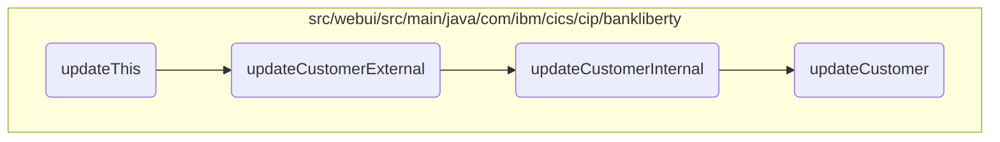

In this document, we will explain the process of updating customer information. The process involves initializing customer data, updating the information externally, handling internal update logic, and finally updating the customer information in the VSAM database.

The flow starts with initializing customer data and setting the necessary fields like address, name, and sort code. Then, the information is updated externally through a method that consumes and produces JSON data. This method calls another method to handle the internal update logic, which includes validating the customer data and updating it in the VSAM database. If the customer is found, the details are updated and returned; otherwise, a not-found flag is set.

# Flow drill down



<SwmSnippet path="/src/webui/src/main/java/com/ibm/cics/cip/bankliberty/webui/data_access/Customer.java" line="174">

---

## Parsing the customer response and updating customer details

First, the <SwmToken path="src/webui/src/main/java/com/ibm/cics/cip/bankliberty/webui/data_access/Customer.java" pos="174:5:5" line-data="	public boolean updateThis()">`updateThis`</SwmToken> method initializes a <SwmToken path="src/webui/src/main/java/com/ibm/cics/cip/bankliberty/webui/data_access/Customer.java" pos="176:1:1" line-data="		CustomerResource myCustomerResource = new CustomerResource();">`CustomerResource`</SwmToken> and a <SwmToken path="src/webui/src/main/java/com/ibm/cics/cip/bankliberty/webui/data_access/Customer.java" pos="178:1:1" line-data="		CustomerJSON myCustomerJSON = new CustomerJSON();">`CustomerJSON`</SwmToken> object. It sets the customer's address, name, and sort code in the <SwmToken path="src/webui/src/main/java/com/ibm/cics/cip/bankliberty/webui/data_access/Customer.java" pos="178:1:1" line-data="		CustomerJSON myCustomerJSON = new CustomerJSON();">`CustomerJSON`</SwmToken> object. Then, it calls the <SwmToken path="src/webui/src/main/java/com/ibm/cics/cip/bankliberty/webui/data_access/Customer.java" pos="185:9:9" line-data="		Response myCustomerResponse = myCustomerResource.updateCustomerExternal(">`updateCustomerExternal`</SwmToken> method to update the customer information externally. If the response status is 200, it parses the response to update the customer's date of birth, address, name, sort code, and customer number.

```java
	public boolean updateThis()
	{
		CustomerResource myCustomerResource = new CustomerResource();

		CustomerJSON myCustomerJSON = new CustomerJSON();

		myCustomerJSON.setCustomerAddress(this.getAddress());
		myCustomerJSON.setCustomerName(this.getName());
		myCustomerJSON.setSortCode(this.getSortcode());
		myCustomerJSON.setSortCode(this.getSortcode());

		Response myCustomerResponse = myCustomerResource.updateCustomerExternal(
				Long.parseLong(this.getCustomerNumber()), myCustomerJSON);

		String myCustomerString = null;
		JSONObject myCustomer = null;

		if (myCustomerResponse.getStatus() == 200)
		{
			myCustomerString = myCustomerResponse.getEntity().toString();
			try
```

---

</SwmSnippet>

<SwmSnippet path="/src/webui/src/main/java/com/ibm/cics/cip/bankliberty/api/json/CustomerResource.java" line="309">

---

## Updating customer information externally

Next, the <SwmToken path="src/webui/src/main/java/com/ibm/cics/cip/bankliberty/api/json/CustomerResource.java" pos="313:5:5" line-data="	public Response updateCustomerExternal(@PathParam(JSON_ID) Long id,">`updateCustomerExternal`</SwmToken> method is called. This method consumes and produces JSON data. It calls the <SwmToken path="src/webui/src/main/java/com/ibm/cics/cip/bankliberty/api/json/CustomerResource.java" pos="318:7:7" line-data="		Response myResponse = updateCustomerInternal(id, customer);">`updateCustomerInternal`</SwmToken> method to handle the internal update logic and then terminates the <SwmToken path="src/webui/src/main/java/com/ibm/cics/cip/bankliberty/api/json/CustomerResource.java" pos="319:1:1" line-data="		HBankDataAccess myHBankDataAccess = new HBankDataAccess();">`HBankDataAccess`</SwmToken> session before returning the response.

```java
	@PUT
	@Path("/{id}")
	@Consumes(MediaType.APPLICATION_JSON)
	@Produces(MediaType.APPLICATION_JSON)
	public Response updateCustomerExternal(@PathParam(JSON_ID) Long id,
			CustomerJSON customer)
	{
		logger.entering(this.getClass().getName(),
				UPDATE_CUSTOMER_EXTERNAL + id);
		Response myResponse = updateCustomerInternal(id, customer);
		HBankDataAccess myHBankDataAccess = new HBankDataAccess();
		myHBankDataAccess.terminate();
		logger.exiting(this.getClass().getName(), UPDATE_CUSTOMER_EXTERNAL + id,
				myResponse);
		return myResponse;

```

---

</SwmSnippet>

<SwmSnippet path="/src/webui/src/main/java/com/ibm/cics/cip/bankliberty/api/json/CustomerResource.java" line="328">

---

## Handling internal customer update logic

Then, the <SwmToken path="src/webui/src/main/java/com/ibm/cics/cip/bankliberty/api/json/CustomerResource.java" pos="328:5:5" line-data="	public Response updateCustomerInternal(@PathParam(JSON_ID) Long id,">`updateCustomerInternal`</SwmToken> method performs several checks on the customer data, such as validating the customer name, title, sort code, and address. If any of these checks fail, it returns an appropriate error response. If all checks pass, it updates the customer information in the VSAM database and constructs a JSON response with the updated customer details.

```java
	public Response updateCustomerInternal(@PathParam(JSON_ID) Long id,
			CustomerJSON customer)
	{
		logger.entering(this.getClass().getName(),
				UPDATE_CUSTOMER_INTERNAL + id);
		
		if(customer.getCustomerName() == null)
		{
			JSONObject error = new JSONObject();
			error.put(JSON_ERROR_MSG,
					"Customer name is null");
			Response myResponse = Response.status(400).entity(error.toString())
					.build();
			logger.log(Level.WARNING,
					() -> "Customer name is null in CustomerResource.updateCustomerInternal(), "
							+ customer.toString());
			logger.exiting(this.getClass().getName(),
					UPDATE_CUSTOMER_INTERNAL_EXIT, myResponse);
			return myResponse;
		}
		
```

---

</SwmSnippet>

<SwmSnippet path="/src/webui/src/main/java/com/ibm/cics/cip/bankliberty/web/vsam/Customer.java" line="509">

---

## Updating customer information in the VSAM database

Finally, the <SwmToken path="src/webui/src/main/java/com/ibm/cics/cip/bankliberty/web/vsam/Customer.java" pos="509:5:5" line-data="	public Customer updateCustomer(CustomerJSON customer)">`updateCustomer`</SwmToken> method in the VSAM database is called. This method reads the customer record for update, modifies the customer details, and rewrites the record. If the customer is not found, it returns a <SwmToken path="src/webui/src/main/java/com/ibm/cics/cip/bankliberty/web/vsam/Customer.java" pos="509:3:3" line-data="	public Customer updateCustomer(CustomerJSON customer)">`Customer`</SwmToken> object with a <SwmToken path="src/webui/src/main/java/com/ibm/cics/cip/bankliberty/web/vsam/Customer.java" pos="119:5:5" line-data="	private boolean notFound;">`notFound`</SwmToken> flag set to true. Otherwise, it returns the updated <SwmToken path="src/webui/src/main/java/com/ibm/cics/cip/bankliberty/web/vsam/Customer.java" pos="509:3:3" line-data="	public Customer updateCustomer(CustomerJSON customer)">`Customer`</SwmToken> object with the new details.

```java
	public Customer updateCustomer(CustomerJSON customer)
	{
		logger.entering(this.getClass().getName(), UPDATE_CUSTOMER, null);

		customerFile.setName(FILENAME);
		Customer temp;
		holder = new RecordHolder();

		Long customerNumberLong = Long.parseLong(customer.getId());

		customer.setId(padCustomerNumber(customer.getId()));

		byte[] key = buildKey(Integer.valueOf(customer.getSortCode()),
				Long.valueOf(customer.getId()));

		try
		{
			customerFile.readForUpdate(key, holder);
			myCustomer = new CUSTOMER(holder.getValue());
			myCustomer.setCustomerAddress(customer.getCustomerAddress());
			myCustomer.setCustomerName(customer.getCustomerName());
```

---

</SwmSnippet>

&nbsp;

*This is an auto-generated document by Swimm 🌊 and has not yet been verified by a human*

<SwmMeta version="3.0.0" repo-id="Z2l0aHViJTNBJTNBY2ljcy1iYW5raW5nLXNhbXBsZS1hcHBsaWNhdGlvbi1jYnNhLUlCTS1EZW1vJTNBJTNBU3dpbW0tRGVtbw==" repo-name="cics-banking-sample-application-cbsa-IBM-Demo"><sup>Powered by [Swimm](/)</sup></SwmMeta>
