The UPDCUST program is responsible for updating customer information in the system. This process involves several steps including initializing sort codes, validating customer titles, and performing the actual update in the datastore. The program ensures data integrity by validating inputs and handling errors appropriately.

The flow starts with initializing the sort code, followed by validating the customer's title. If the title is valid, the program proceeds to update the customer's information in the datastore. The process is finalized by ensuring all operations are completed successfully before exiting the program.

# Where is this program used?

This program is used once, in a flow starting from `BNK1DCS` as represented in the following diagram:

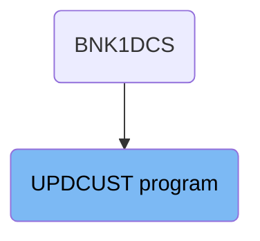

Here is a high level diagram of the program:

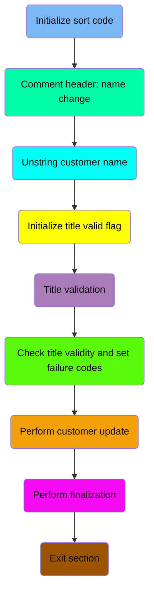

## Initialize sort code

First, we'll zoom into this section of the flow:

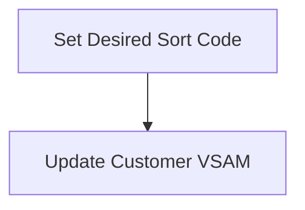

<SwmSnippet path="/src/base/cobol_src/UPDCUST.cbl" line="137">

---

The <SwmToken path="src/base/cobol_src/UPDCUST.cbl" pos="137:1:1" line-data="       PREMIERE SECTION.">`PREMIERE`</SwmToken> section is responsible for setting the desired sort code for customer updates. This is done by moving the value from <SwmToken path="src/base/cobol_src/UPDCUST.cbl" pos="140:3:3" line-data="           MOVE SORTCODE TO COMM-SCODE">`SORTCODE`</SwmToken> to <SwmToken path="src/base/cobol_src/UPDCUST.cbl" pos="140:7:9" line-data="           MOVE SORTCODE TO COMM-SCODE">`COMM-SCODE`</SwmToken>, which is then used in the customer update process.

```cobol
       PREMIERE SECTION.
       A010.

           MOVE SORTCODE TO COMM-SCODE
                            DESIRED-SORT-CODE.

```

---

</SwmSnippet>

## Comment header: name change

This is the next section of the flow.

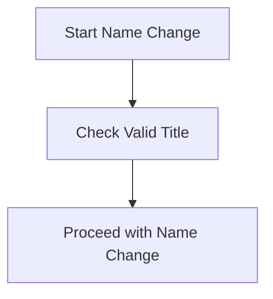

<SwmSnippet path="/src/base/cobol_src/UPDCUST.cbl" line="143">

---

When changing a customer's name, it is essential to ensure that the title provided is valid. This step involves checking the validity of the title before proceeding with the name change process. If the title is not valid, the name change cannot be completed, ensuring data integrity and consistency in customer records.

```cobol
      *
      *    You can change the customer's name, but the title must
      *    be a valid one. Check that here
```

---

</SwmSnippet>

## Unstring customer name

This is the next section of the flow.

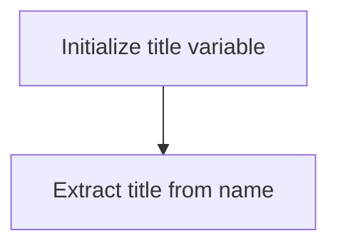

<SwmSnippet path="/src/base/cobol_src/UPDCUST.cbl" line="147">

---

The <SwmToken path="src/base/cobol_src/UPDCUST.cbl" pos="137:1:1" line-data="       PREMIERE SECTION.">`PREMIERE`</SwmToken> function is responsible for formatting the customer's name by extracting the title from the full name. The first step is to initialize the <SwmToken path="src/base/cobol_src/UPDCUST.cbl" pos="147:7:11" line-data="           MOVE SPACES TO WS-UNSTR-TITLE.">`WS-UNSTR-TITLE`</SwmToken> variable to spaces, ensuring it is empty before processing.

```cobol
           MOVE SPACES TO WS-UNSTR-TITLE.
```

---

</SwmSnippet>

<SwmSnippet path="/src/base/cobol_src/UPDCUST.cbl" line="148">

---

Next, the <SwmToken path="src/base/cobol_src/UPDCUST.cbl" pos="148:1:1" line-data="           UNSTRING COMM-NAME DELIMITED BY SPACE">`UNSTRING`</SwmToken> statement is used to parse the <SwmToken path="src/base/cobol_src/UPDCUST.cbl" pos="148:3:5" line-data="           UNSTRING COMM-NAME DELIMITED BY SPACE">`COMM-NAME`</SwmToken> variable, which contains the full name of the customer. The name is split by spaces, and the extracted title is stored in the <SwmToken path="src/base/cobol_src/UPDCUST.cbl" pos="149:3:7" line-data="              INTO WS-UNSTR-TITLE.">`WS-UNSTR-TITLE`</SwmToken> variable.

```cobol
           UNSTRING COMM-NAME DELIMITED BY SPACE
              INTO WS-UNSTR-TITLE.
```

---

</SwmSnippet>

## Initialize title valid flag

This is the next section of the flow.

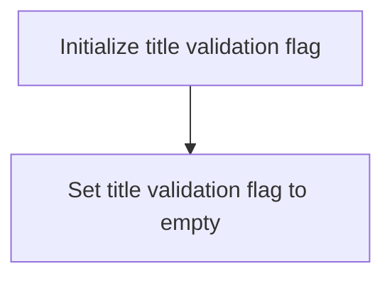

<SwmSnippet path="/src/base/cobol_src/UPDCUST.cbl" line="150">

---

The <SwmToken path="src/base/cobol_src/UPDCUST.cbl" pos="137:1:1" line-data="       PREMIERE SECTION.">`PREMIERE`</SwmToken> function is responsible for initializing the title validation flag during a customer update process. This step ensures that the title validation flag is set to an empty state, indicating that no validation errors have been detected for the title field at the start of the update process.

```cobol

           MOVE ' ' TO WS-TITLE-VALID.
```

---

</SwmSnippet>

## Title validation

Now, lets zoom into this section of the flow:

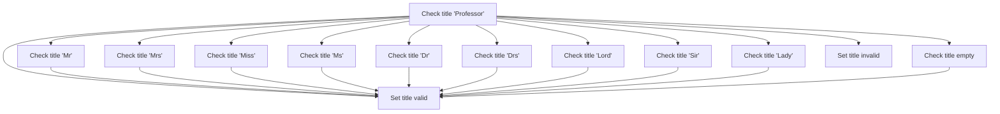

<SwmSnippet path="/src/base/cobol_src/UPDCUST.cbl" line="153">

---

First, the function evaluates the value of <SwmToken path="src/base/cobol_src/UPDCUST.cbl" pos="153:3:7" line-data="           EVALUATE WS-UNSTR-TITLE">`WS-UNSTR-TITLE`</SwmToken> to determine the customer's title.

```cobol
           EVALUATE WS-UNSTR-TITLE
```

---

</SwmSnippet>

<SwmSnippet path="/src/base/cobol_src/UPDCUST.cbl" line="154">

---

Next, if the title is 'Professor', it sets <SwmToken path="src/base/cobol_src/UPDCUST.cbl" pos="155:9:13" line-data="                 MOVE &#39;Y&#39; TO WS-TITLE-VALID">`WS-TITLE-VALID`</SwmToken> to 'Y' indicating the title is valid.

```cobol
              WHEN 'Professor'
                 MOVE 'Y' TO WS-TITLE-VALID
```

---

</SwmSnippet>

<SwmSnippet path="/src/base/cobol_src/UPDCUST.cbl" line="157">

---

Moving to other titles, if the title is 'Mr', 'Mrs', 'Miss', 'Ms', 'Dr', 'Drs', 'Lord', 'Sir', or 'Lady', it also sets <SwmToken path="src/base/cobol_src/UPDCUST.cbl" pos="158:9:13" line-data="                 MOVE &#39;Y&#39; TO WS-TITLE-VALID">`WS-TITLE-VALID`</SwmToken> to 'Y'.

```cobol
              WHEN 'Mr       '
                 MOVE 'Y' TO WS-TITLE-VALID

              WHEN 'Mrs      '
                 MOVE 'Y' TO WS-TITLE-VALID

              WHEN 'Miss     '
                 MOVE 'Y' TO WS-TITLE-VALID

              WHEN 'Ms       '
                 MOVE 'Y' TO WS-TITLE-VALID

              WHEN 'Dr       '
                 MOVE 'Y' TO WS-TITLE-VALID

              WHEN 'Drs      '
                 MOVE 'Y' TO WS-TITLE-VALID

              WHEN 'Lord     '
                 MOVE 'Y' TO WS-TITLE-VALID

```

---

</SwmSnippet>

<SwmSnippet path="/src/base/cobol_src/UPDCUST.cbl" line="184">

---

Additionally, if the title is an empty string, it sets <SwmToken path="src/base/cobol_src/UPDCUST.cbl" pos="185:9:13" line-data="                 MOVE &#39;Y&#39; TO WS-TITLE-VALID">`WS-TITLE-VALID`</SwmToken> to 'Y'.

```cobol
              WHEN '         '
                 MOVE 'Y' TO WS-TITLE-VALID
```

---

</SwmSnippet>

<SwmSnippet path="/src/base/cobol_src/UPDCUST.cbl" line="187">

---

Finally, if the title does not match any of the specified valid titles, it sets <SwmToken path="src/base/cobol_src/UPDCUST.cbl" pos="188:9:13" line-data="                 MOVE &#39;N&#39; TO WS-TITLE-VALID">`WS-TITLE-VALID`</SwmToken> to 'N' indicating the title is invalid.

```cobol
              WHEN OTHER
                 MOVE 'N' TO WS-TITLE-VALID
```

---

</SwmSnippet>

## Check title validity and set failure codes

This is the next section of the flow.

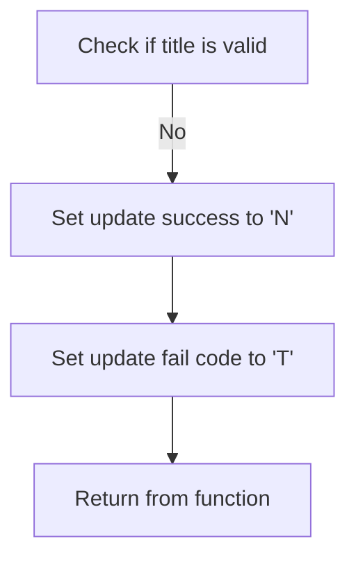

<SwmSnippet path="/src/base/cobol_src/UPDCUST.cbl" line="191">

---

The code checks if <SwmToken path="src/base/cobol_src/UPDCUST.cbl" pos="191:3:7" line-data="           IF WS-TITLE-VALID = &#39;N&#39;">`WS-TITLE-VALID`</SwmToken> (which indicates if the title field is valid) is equal to 'N'. If the title is not valid, it sets <SwmToken path="src/base/cobol_src/UPDCUST.cbl" pos="192:9:13" line-data="             MOVE &#39;N&#39; TO COMM-UPD-SUCCESS">`COMM-UPD-SUCCESS`</SwmToken> to 'N' (indicating the update was not successful) and <SwmToken path="src/base/cobol_src/UPDCUST.cbl" pos="193:9:15" line-data="             MOVE &#39;T&#39; TO COMM-UPD-FAIL-CD">`COMM-UPD-FAIL-CD`</SwmToken> to 'T' (indicating the failure code for title validation). Finally, it returns from the function, effectively halting any further processing for this update.

```cobol
           IF WS-TITLE-VALID = 'N'
             MOVE 'N' TO COMM-UPD-SUCCESS
             MOVE 'T' TO COMM-UPD-FAIL-CD
             GOBACK
           END-IF
```

---

</SwmSnippet>

## Perform customer update

Now, lets zoom into this section of the flow:

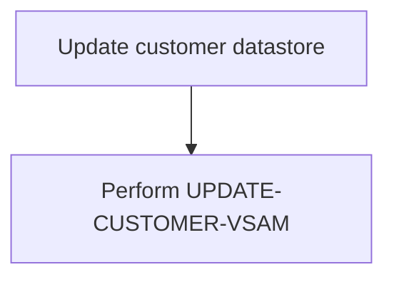

<SwmSnippet path="/src/base/cobol_src/UPDCUST.cbl" line="200">

---

The <SwmToken path="src/base/cobol_src/UPDCUST.cbl" pos="200:1:7" line-data="           PERFORM UPDATE-CUSTOMER-VSAM">`PERFORM UPDATE-CUSTOMER-VSAM`</SwmToken> step is responsible for updating the customer information in the datastore. This involves positioning at the matching customer record and locking it to ensure data integrity during the update process.

```cobol
           PERFORM UPDATE-CUSTOMER-VSAM
      *
```

---

</SwmSnippet>

## Perform finalization

Now, lets zoom into this section of the flow:

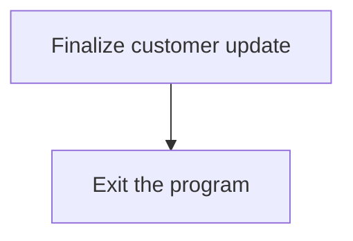

<SwmSnippet path="/src/base/cobol_src/UPDCUST.cbl" line="202">

---

The <SwmToken path="src/base/cobol_src/UPDCUST.cbl" pos="205:1:11" line-data="           PERFORM GET-ME-OUT-OF-HERE.">`PERFORM GET-ME-OUT-OF-HERE`</SwmToken> statement is used to finalize the customer update process. This step ensures that all necessary operations have been completed and the program can safely exit. It is the final step in the process, indicating that the customer update has been successfully handled and no further actions are required.

```cobol
      *    The COMMAREA values have now been set so all we need to do
      *    is finish
      *
           PERFORM GET-ME-OUT-OF-HERE.
```

---

</SwmSnippet>

## Exit section

This is the next section of the flow.

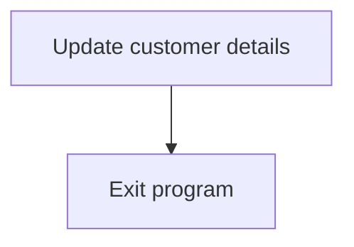

<SwmSnippet path="/src/base/cobol_src/UPDCUST.cbl" line="207">

---

### Exiting the program

After updating the customer details, the program reaches the <SwmToken path="src/base/cobol_src/UPDCUST.cbl" pos="207:1:1" line-data="       A999.">`A999`</SwmToken> section which is responsible for exiting the program. This ensures that once the necessary updates are made, the program terminates gracefully.

```cobol
       A999.
           EXIT.
```

---

</SwmSnippet>

## <SwmToken path="src/base/cobol_src/UPDCUST.cbl" pos="200:3:7" line-data="           PERFORM UPDATE-CUSTOMER-VSAM">`UPDATE-CUSTOMER-VSAM`</SwmToken>

Lets' zoom into this section of the flow:

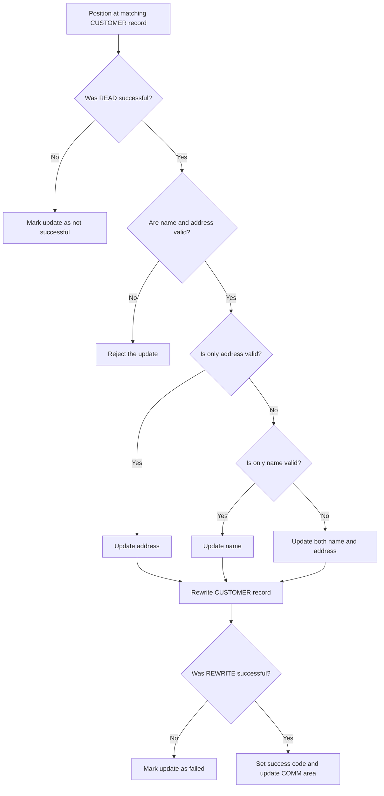

First, the function positions at the matching CUSTOMER record and locks it by moving <SwmToken path="src/base/cobol_src/UPDCUST.cbl" pos="218:3:5" line-data="           MOVE COMM-CUSTNO TO DESIRED-CUSTNO.">`COMM-CUSTNO`</SwmToken> (the customer number) to <SwmToken path="src/base/cobol_src/UPDCUST.cbl" pos="75:3:5" line-data="          03 DESIRED-CUSTNO            PIC 9(10).">`DESIRED-CUSTNO`</SwmToken> and executing a CICS READ command.

Next, it checks if the READ was successful by evaluating <SwmToken path="src/base/cobol_src/UPDCUST.cbl" pos="51:3:7" line-data="          03 WS-CICS-RESP              PIC S9(8) COMP.">`WS-CICS-RESP`</SwmToken>. If the response is not normal, it marks the update as not successful and sets the appropriate failure code in <SwmToken path="src/base/cobol_src/UPDCUST.cbl" pos="193:9:15" line-data="             MOVE &#39;T&#39; TO COMM-UPD-FAIL-CD">`COMM-UPD-FAIL-CD`</SwmToken>.

Moving to the next step, if the READ response code was normal, the function checks if the supplied name and address are valid. If both fields are empty or start with a space, it rejects the update and sets the failure code to '4'.

Then, if only the address is valid (not empty or starting with a space), it updates the address in the customer record.

Similarly, if only the name is valid, it updates the name in the customer record.

If both the name and address are valid, it updates both fields in the customer record.

Next, the function calculates the length of the customer data record and executes a CICS REWRITE command to update the CUSTOMER record in the VSAM datastore.

Then, it checks if the REWRITE was successful. If not, it marks the update as failed and sets the failure code to '3'.

## <SwmToken path="src/base/cobol_src/UPDCUST.cbl" pos="205:3:11" line-data="           PERFORM GET-ME-OUT-OF-HERE.">`GET-ME-OUT-OF-HERE`</SwmToken>

Lets' zoom into this section of the flow:

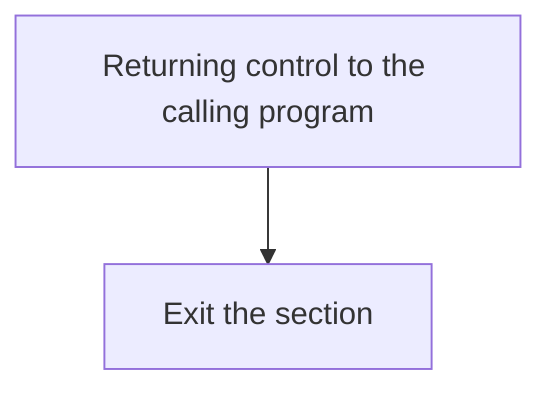

<SwmSnippet path="/src/base/cobol_src/UPDCUST.cbl" line="342">

---

First, the <SwmToken path="src/base/cobol_src/UPDCUST.cbl" pos="342:1:5" line-data="           EXEC CICS RETURN">`EXEC CICS RETURN`</SwmToken> command is executed, which returns control to the calling program or transaction.

```cobol
           EXEC CICS RETURN
           END-EXEC.
```

---

</SwmSnippet>

<SwmSnippet path="/src/base/cobol_src/UPDCUST.cbl" line="345">

---

Next, the <SwmToken path="src/base/cobol_src/UPDCUST.cbl" pos="346:1:1" line-data="           EXIT.">`EXIT`</SwmToken> statement is executed to exit the section, ensuring that the program flow is properly terminated.

```cobol
       GMOOH999.
           EXIT.
```

---

</SwmSnippet>

&nbsp;

*This is an auto-generated document by Swimm 🌊 and has not yet been verified by a human*

<SwmMeta version="3.0.0" repo-id="Z2l0aHViJTNBJTNBY2ljcy1iYW5raW5nLXNhbXBsZS1hcHBsaWNhdGlvbi1jYnNhLUlCTS1EZW1vJTNBJTNBU3dpbW0tRGVtbw==" repo-name="cics-banking-sample-application-cbsa-IBM-Demo"><sup>Powered by [Swimm](/)</sup></SwmMeta>
