The UPDCUST program is responsible for updating customer records in the system. This program ensures that customer data is validated and updated correctly in the VSAM datastore. The process involves setting the sort code, initializing validation, validating the title, handling invalid titles, updating the customer record, and finalizing the operation.

The flow starts with setting the sort code, followed by initializing the validation process. The title is then validated, and if invalid, the process handles the invalid title accordingly. The customer record is updated in the VSAM datastore, and the operation is finalized. The program then exits gracefully.

# Where is this program used?

This program is used once, in a flow starting from `BNK1DCS` as represented in the following diagram:

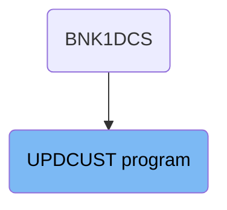

Here is a high level diagram of the program:

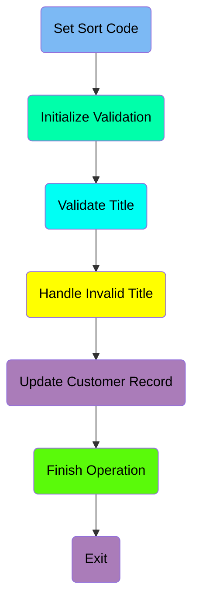

## Set Sort Code

First, we'll zoom into this section of the flow:

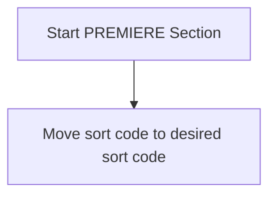

<SwmSnippet path="/src/base/cobol_src/UPDCUST.cbl" line="137">

---

The PREMIERE section is responsible for transferring the sort code to the desired sort code field. This is done by moving the value from <SwmToken path="src/base/cobol_src/UPDCUST.cbl" pos="140:3:3" line-data="           MOVE SORTCODE TO COMM-SCODE">`SORTCODE`</SwmToken> to <SwmToken path="src/base/cobol_src/UPDCUST.cbl" pos="141:1:5" line-data="                            DESIRED-SORT-CODE.">`DESIRED-SORT-CODE`</SwmToken>, ensuring that the sort code is correctly set for subsequent operations.

```cobol
       PREMIERE SECTION.
       A010.

           MOVE SORTCODE TO COMM-SCODE
                            DESIRED-SORT-CODE.
```

---

</SwmSnippet>

## Initialize Validation

This is the next section of the flow.

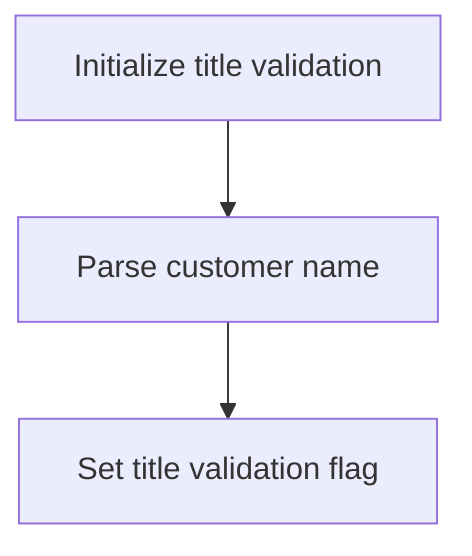

First, the code initializes the title validation process by setting <SwmToken path="src/base/cobol_src/UPDCUST.cbl" pos="147:7:11" line-data="           MOVE SPACES TO WS-UNSTR-TITLE.">`WS-UNSTR-TITLE`</SwmToken> (which holds the unstructured title) to spaces. This ensures that any previous data in the variable is cleared before processing the new customer name.

<SwmSnippet path="/src/base/cobol_src/UPDCUST.cbl" line="147">

---

Next, the code parses the customer's name by unstringing <SwmToken path="src/base/cobol_src/UPDCUST.cbl" pos="148:3:5" line-data="           UNSTRING COMM-NAME DELIMITED BY SPACE">`COMM-NAME`</SwmToken> (which holds the full customer name) and extracting the title part into <SwmToken path="src/base/cobol_src/UPDCUST.cbl" pos="147:7:11" line-data="           MOVE SPACES TO WS-UNSTR-TITLE.">`WS-UNSTR-TITLE`</SwmToken>. This step is crucial as it isolates the title from the full name for further validation.

```cobol
           MOVE SPACES TO WS-UNSTR-TITLE.
           UNSTRING COMM-NAME DELIMITED BY SPACE
              INTO WS-UNSTR-TITLE.
```

---

</SwmSnippet>

## Validate Title

Now, lets zoom into this section of the flow:

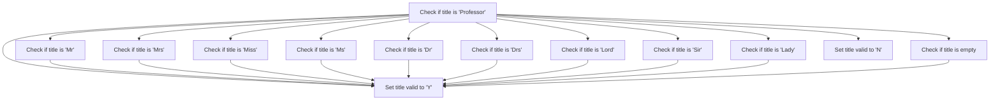

<SwmSnippet path="/src/base/cobol_src/UPDCUST.cbl" line="153">

---

First, the function evaluates the user title stored in <SwmToken path="src/base/cobol_src/UPDCUST.cbl" pos="153:3:7" line-data="           EVALUATE WS-UNSTR-TITLE">`WS-UNSTR-TITLE`</SwmToken> to determine its validity.

```cobol
           EVALUATE WS-UNSTR-TITLE
```

---

</SwmSnippet>

<SwmSnippet path="/src/base/cobol_src/UPDCUST.cbl" line="154">

---

If the title is 'Professor', the function sets <SwmToken path="src/base/cobol_src/UPDCUST.cbl" pos="155:9:13" line-data="                 MOVE &#39;Y&#39; TO WS-TITLE-VALID">`WS-TITLE-VALID`</SwmToken> to 'Y' indicating the title is valid.

```cobol
              WHEN 'Professor'
                 MOVE 'Y' TO WS-TITLE-VALID
```

---

</SwmSnippet>

<SwmSnippet path="/src/base/cobol_src/UPDCUST.cbl" line="157">

---

Moving to other titles, if the title is 'Mr', 'Mrs', 'Miss', 'Ms', 'Dr', 'Drs', 'Lord', 'Sir', 'Lady', or an empty string, the function also sets <SwmToken path="src/base/cobol_src/UPDCUST.cbl" pos="158:9:13" line-data="                 MOVE &#39;Y&#39; TO WS-TITLE-VALID">`WS-TITLE-VALID`</SwmToken> to 'Y'.

```cobol
              WHEN 'Mr       '
                 MOVE 'Y' TO WS-TITLE-VALID

              WHEN 'Mrs      '
                 MOVE 'Y' TO WS-TITLE-VALID

              WHEN 'Miss     '
                 MOVE 'Y' TO WS-TITLE-VALID

              WHEN 'Ms       '
                 MOVE 'Y' TO WS-TITLE-VALID

              WHEN 'Dr       '
                 MOVE 'Y' TO WS-TITLE-VALID

              WHEN 'Drs      '
                 MOVE 'Y' TO WS-TITLE-VALID

              WHEN 'Lord     '
                 MOVE 'Y' TO WS-TITLE-VALID

```

---

</SwmSnippet>

<SwmSnippet path="/src/base/cobol_src/UPDCUST.cbl" line="187">

---

For any other title not listed, the function sets <SwmToken path="src/base/cobol_src/UPDCUST.cbl" pos="188:9:13" line-data="                 MOVE &#39;N&#39; TO WS-TITLE-VALID">`WS-TITLE-VALID`</SwmToken> to 'N', indicating the title is invalid.

```cobol
              WHEN OTHER
                 MOVE 'N' TO WS-TITLE-VALID
```

---

</SwmSnippet>

## Handle Invalid Title

This is the next section of the flow.

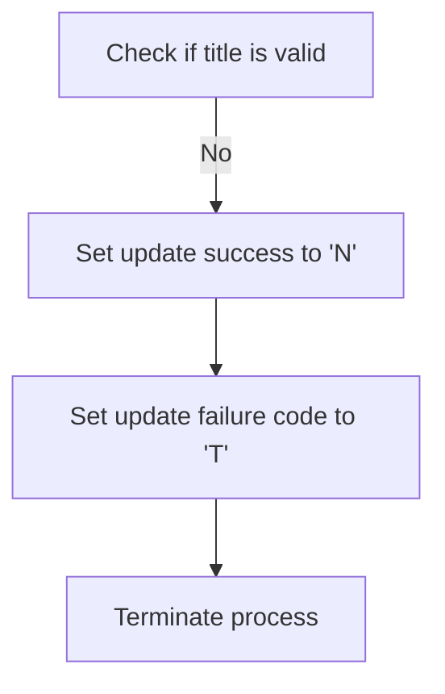

## Update Customer Record

Now, lets zoom into this section of the flow:

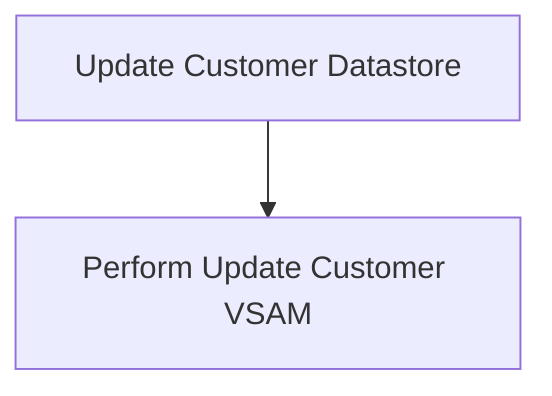

<SwmSnippet path="/src/base/cobol_src/UPDCUST.cbl" line="200">

---

The <SwmToken path="src/base/cobol_src/UPDCUST.cbl" pos="200:1:7" line-data="           PERFORM UPDATE-CUSTOMER-VSAM">`PERFORM UPDATE-CUSTOMER-VSAM`</SwmToken> statement is responsible for updating the customer information in the VSAM datastore. This step ensures that any changes made to the customer data are saved and reflected in the datastore.

```cobol
           PERFORM UPDATE-CUSTOMER-VSAM
```

---

</SwmSnippet>

## Finish Operation

Now, lets zoom into this section of the flow:

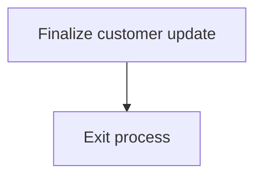

<SwmSnippet path="/src/base/cobol_src/UPDCUST.cbl" line="205">

---

The <SwmToken path="src/base/cobol_src/UPDCUST.cbl" pos="205:1:11" line-data="           PERFORM GET-ME-OUT-OF-HERE.">`PERFORM GET-ME-OUT-OF-HERE`</SwmToken> statement is used to finalize the customer update process. This step ensures that all necessary actions have been completed and the process can safely exit. It is a crucial part of the flow as it signifies the end of the customer update operation, ensuring that the system is ready for the next transaction or operation.

```cobol
           PERFORM GET-ME-OUT-OF-HERE.
```

---

</SwmSnippet>

## Exit

This is the next section of the flow.

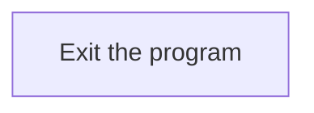

<SwmSnippet path="/src/base/cobol_src/UPDCUST.cbl" line="207">

---

The <SwmToken path="src/base/cobol_src/UPDCUST.cbl" pos="208:1:1" line-data="           EXIT.">`EXIT`</SwmToken> statement in the <SwmToken path="src/base/cobol_src/UPDCUST.cbl" pos="137:1:1" line-data="       PREMIERE SECTION.">`PREMIERE`</SwmToken> function is used to terminate the program. This ensures that once the program has completed its operations, it exits gracefully, releasing any resources it may have used during its execution.

```cobol
       A999.
           EXIT.
```

---

</SwmSnippet>

## <SwmToken path="src/base/cobol_src/UPDCUST.cbl" pos="200:3:7" line-data="           PERFORM UPDATE-CUSTOMER-VSAM">`UPDATE-CUSTOMER-VSAM`</SwmToken>

Lets' zoom into this section of the flow:

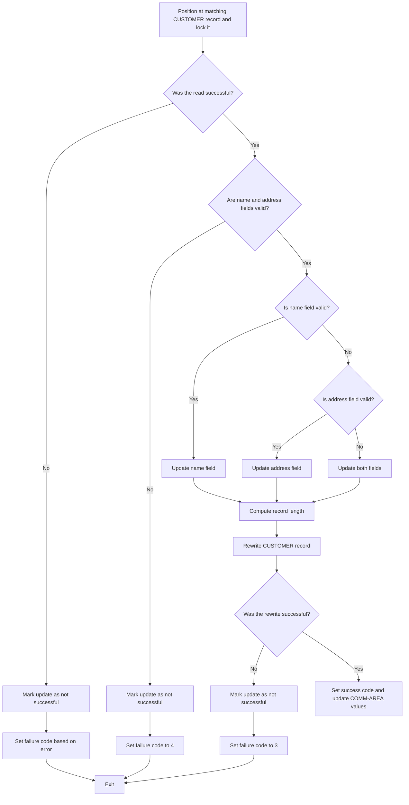

First, the function positions at the matching CUSTOMER record and locks it by moving the customer number to the desired customer number and executing a CICS READ command.

Next, it checks if the read was successful. If not, it marks the update as not successful and sets the failure code based on the specific error encountered.

If the read was successful, it then checks if the name and address fields are valid. If both fields are empty or start with a space, it marks the update as not successful and sets the failure code to 4.

If the name field is valid but the address field is not, it updates only the address field. Conversely, if the address field is valid but the name field is not, it updates only the name field. If both fields are valid, it updates both fields.

After updating the necessary fields, it computes the record length and rewrites the CUSTOMER record in the VSAM datastore.

It then checks if the rewrite was successful. If not, it marks the update as not successful and sets the failure code to 3.

## <SwmToken path="src/base/cobol_src/UPDCUST.cbl" pos="205:3:11" line-data="           PERFORM GET-ME-OUT-OF-HERE.">`GET-ME-OUT-OF-HERE`</SwmToken>

Lets' zoom into this section of the flow:

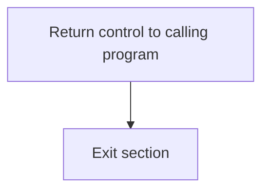

<SwmSnippet path="/src/base/cobol_src/UPDCUST.cbl" line="342">

---

First, the <SwmToken path="src/base/cobol_src/UPDCUST.cbl" pos="342:1:5" line-data="           EXEC CICS RETURN">`EXEC CICS RETURN`</SwmToken> command is executed to return control to the calling program. This is essential in CICS programs to indicate that the current task is complete and the control should be handed back.

```cobol
           EXEC CICS RETURN
           END-EXEC.
```

---

</SwmSnippet>

<SwmSnippet path="/src/base/cobol_src/UPDCUST.cbl" line="345">

---

Next, the <SwmToken path="src/base/cobol_src/UPDCUST.cbl" pos="346:1:1" line-data="           EXIT.">`EXIT`</SwmToken> statement is used to exit the section. This ensures that the program flow is properly terminated and no further instructions in this section are executed.

```cobol
       GMOOH999.
           EXIT.
```

---

</SwmSnippet>

&nbsp;

*This is an auto-generated document by Swimm 🌊 and has not yet been verified by a human*

<SwmMeta version="3.0.0" repo-id="Z2l0aHViJTNBJTNBY2ljcy1iYW5raW5nLXNhbXBsZS1hcHBsaWNhdGlvbi1jYnNhLUlCTS1EZW1vJTNBJTNBU3dpbW0tRGVtbw==" repo-name="cics-banking-sample-application-cbsa-IBM-Demo"><sup>Powered by [Swimm](/)</sup></SwmMeta>
