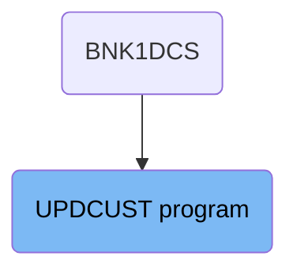
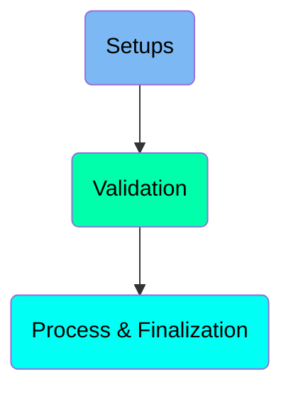
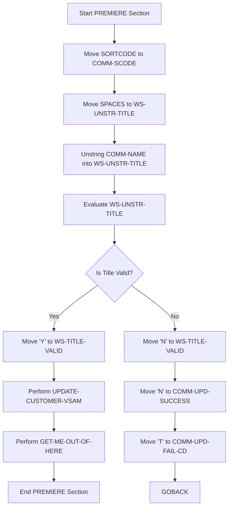
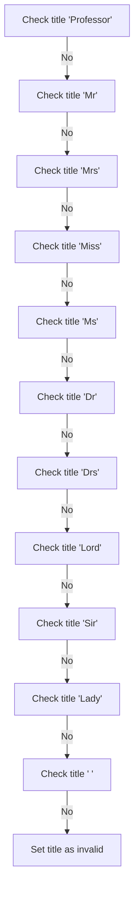
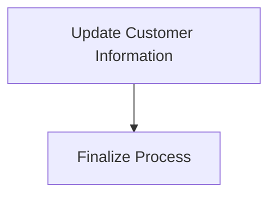

The UPDCUST program is responsible for updating customer information in the banking system. It is used once in a flow starting from the BNK1DCS program. The program achieves its role by performing a series of steps including setting up data, validating customer titles, processing the update, and finalizing the transaction.

The UPDCUST program starts by setting up necessary data and clearing previous values. It then validates the customer's title against a list of acceptable titles. If the title is valid, it proceeds to update the customer information in the datastore. Finally, it completes the process by finalizing the transaction and returning control to CICS.

# Where is this program used?

This program is used once, in a flow starting from `BNK1DCS` as represented in the following diagram:



Here is a high level diagram of the program:



# Setups



<SwmSnippet path="/src/base/cobol_src/UPDCUST.cbl" line="140">

---

## Moving SORTCODE to <SwmToken path="src/base/cobol_src/UPDCUST.cbl" pos="140:7:9" line-data="           MOVE SORTCODE TO COMM-SCODE">`COMM-SCODE`</SwmToken>

First, the <SwmToken path="src/base/cobol_src/UPDCUST.cbl" pos="140:3:3" line-data="           MOVE SORTCODE TO COMM-SCODE">`SORTCODE`</SwmToken> is moved to <SwmToken path="src/base/cobol_src/UPDCUST.cbl" pos="140:7:9" line-data="           MOVE SORTCODE TO COMM-SCODE">`COMM-SCODE`</SwmToken> to ensure that the communication sort code is set to the desired sort code.

```cobol
           MOVE SORTCODE TO COMM-SCODE
                            DESIRED-SORT-CODE.
```

---

</SwmSnippet>

<SwmSnippet path="/src/base/cobol_src/UPDCUST.cbl" line="147">

---

## Clearing <SwmToken path="src/base/cobol_src/UPDCUST.cbl" pos="147:7:11" line-data="           MOVE SPACES TO WS-UNSTR-TITLE.">`WS-UNSTR-TITLE`</SwmToken>

Next, spaces are moved to <SwmToken path="src/base/cobol_src/UPDCUST.cbl" pos="147:7:11" line-data="           MOVE SPACES TO WS-UNSTR-TITLE.">`WS-UNSTR-TITLE`</SwmToken> to clear any previous values and prepare it for the new title.

```cobol
           MOVE SPACES TO WS-UNSTR-TITLE.
```

---

</SwmSnippet>

<SwmSnippet path="/src/base/cobol_src/UPDCUST.cbl" line="148">

---

## Unstringing <SwmToken path="src/base/cobol_src/UPDCUST.cbl" pos="148:3:5" line-data="           UNSTRING COMM-NAME DELIMITED BY SPACE">`COMM-NAME`</SwmToken>

Then, the <SwmToken path="src/base/cobol_src/UPDCUST.cbl" pos="148:3:5" line-data="           UNSTRING COMM-NAME DELIMITED BY SPACE">`COMM-NAME`</SwmToken> is unstrung into <SwmToken path="src/base/cobol_src/UPDCUST.cbl" pos="149:3:7" line-data="              INTO WS-UNSTR-TITLE.">`WS-UNSTR-TITLE`</SwmToken> to extract the title from the customer's name.

```cobol
           UNSTRING COMM-NAME DELIMITED BY SPACE
              INTO WS-UNSTR-TITLE.
```

---

</SwmSnippet>

<SwmSnippet path="/src/base/cobol_src/UPDCUST.cbl" line="153">

---

## Evaluating <SwmToken path="src/base/cobol_src/UPDCUST.cbl" pos="153:3:7" line-data="           EVALUATE WS-UNSTR-TITLE">`WS-UNSTR-TITLE`</SwmToken>

Moving to the evaluation of <SwmToken path="src/base/cobol_src/UPDCUST.cbl" pos="153:3:7" line-data="           EVALUATE WS-UNSTR-TITLE">`WS-UNSTR-TITLE`</SwmToken>, the code checks if the title is valid by comparing it against a list of acceptable titles. If the title matches any of the valid titles, <SwmToken path="src/base/cobol_src/UPDCUST.cbl" pos="155:9:13" line-data="                 MOVE &#39;Y&#39; TO WS-TITLE-VALID">`WS-TITLE-VALID`</SwmToken> is set to 'Y'. Otherwise, it is set to 'N'.

```cobol
           EVALUATE WS-UNSTR-TITLE
              WHEN 'Professor'
                 MOVE 'Y' TO WS-TITLE-VALID

              WHEN 'Mr       '
                 MOVE 'Y' TO WS-TITLE-VALID

              WHEN 'Mrs      '
                 MOVE 'Y' TO WS-TITLE-VALID

              WHEN 'Miss     '
                 MOVE 'Y' TO WS-TITLE-VALID

              WHEN 'Ms       '
                 MOVE 'Y' TO WS-TITLE-VALID

              WHEN 'Dr       '
                 MOVE 'Y' TO WS-TITLE-VALID

              WHEN 'Drs      '
                 MOVE 'Y' TO WS-TITLE-VALID
```

---

</SwmSnippet>

<SwmSnippet path="/src/base/cobol_src/UPDCUST.cbl" line="191">

---

## Handling Invalid Titles

If the title is not valid (<SwmToken path="src/base/cobol_src/UPDCUST.cbl" pos="191:3:7" line-data="           IF WS-TITLE-VALID = &#39;N&#39;">`WS-TITLE-VALID`</SwmToken> is 'N'), the code sets <SwmToken path="src/base/cobol_src/UPDCUST.cbl" pos="192:9:13" line-data="             MOVE &#39;N&#39; TO COMM-UPD-SUCCESS">`COMM-UPD-SUCCESS`</SwmToken> to 'N' and <SwmToken path="src/base/cobol_src/UPDCUST.cbl" pos="193:9:15" line-data="             MOVE &#39;T&#39; TO COMM-UPD-FAIL-CD">`COMM-UPD-FAIL-CD`</SwmToken> to 'T', then exits the section.

```cobol
           IF WS-TITLE-VALID = 'N'
             MOVE 'N' TO COMM-UPD-SUCCESS
             MOVE 'T' TO COMM-UPD-FAIL-CD
             GOBACK
           END-IF
```

---

</SwmSnippet>

<SwmSnippet path="/src/base/cobol_src/UPDCUST.cbl" line="200">

---

## Updating Customer Data

If the title is valid, the code performs the <SwmToken path="src/base/cobol_src/UPDCUST.cbl" pos="200:3:7" line-data="           PERFORM UPDATE-CUSTOMER-VSAM">`UPDATE-CUSTOMER-VSAM`</SwmToken> section to update the customer data in the datastore.

```cobol
           PERFORM UPDATE-CUSTOMER-VSAM
      *
```

---

</SwmSnippet>

<SwmSnippet path="/src/base/cobol_src/UPDCUST.cbl" line="205">

---

## Finalizing the Update

Finally, the code performs the <SwmToken path="src/base/cobol_src/UPDCUST.cbl" pos="205:3:11" line-data="           PERFORM GET-ME-OUT-OF-HERE.">`GET-ME-OUT-OF-HERE`</SwmToken> section to complete the update process and exit the section.

```cobol
           PERFORM GET-ME-OUT-OF-HERE.
```

---

</SwmSnippet>

# Validation



<SwmSnippet path="/src/base/cobol_src/UPDCUST.cbl" line="151">

---

## Validating Customer Titles

First, the code initializes the variable <SwmToken path="src/base/cobol_src/UPDCUST.cbl" pos="151:9:13" line-data="           MOVE &#39; &#39; TO WS-TITLE-VALID.">`WS-TITLE-VALID`</SwmToken> to a blank space. Then, it evaluates the variable <SwmToken path="src/base/cobol_src/UPDCUST.cbl" pos="153:3:7" line-data="           EVALUATE WS-UNSTR-TITLE">`WS-UNSTR-TITLE`</SwmToken> against a list of valid titles such as 'Professor', 'Mr', 'Mrs', 'Miss', 'Ms', 'Dr', 'Drs', 'Lord', 'Sir', 'Lady', and a blank space. If the title matches any of these, <SwmToken path="src/base/cobol_src/UPDCUST.cbl" pos="151:9:13" line-data="           MOVE &#39; &#39; TO WS-TITLE-VALID.">`WS-TITLE-VALID`</SwmToken> is set to 'Y'. If none of these titles match, <SwmToken path="src/base/cobol_src/UPDCUST.cbl" pos="151:9:13" line-data="           MOVE &#39; &#39; TO WS-TITLE-VALID.">`WS-TITLE-VALID`</SwmToken> is set to 'N'.

```cobol
           MOVE ' ' TO WS-TITLE-VALID.

           EVALUATE WS-UNSTR-TITLE
              WHEN 'Professor'
                 MOVE 'Y' TO WS-TITLE-VALID

              WHEN 'Mr       '
                 MOVE 'Y' TO WS-TITLE-VALID

              WHEN 'Mrs      '
                 MOVE 'Y' TO WS-TITLE-VALID

              WHEN 'Miss     '
                 MOVE 'Y' TO WS-TITLE-VALID

              WHEN 'Ms       '
                 MOVE 'Y' TO WS-TITLE-VALID

              WHEN 'Dr       '
                 MOVE 'Y' TO WS-TITLE-VALID

```

---

</SwmSnippet>

<SwmSnippet path="/src/base/cobol_src/UPDCUST.cbl" line="191">

---

## Handling Invalid Titles

Next, the code checks if <SwmToken path="src/base/cobol_src/UPDCUST.cbl" pos="191:3:7" line-data="           IF WS-TITLE-VALID = &#39;N&#39;">`WS-TITLE-VALID`</SwmToken> is 'N'. If it is, it sets <SwmToken path="src/base/cobol_src/UPDCUST.cbl" pos="192:9:13" line-data="             MOVE &#39;N&#39; TO COMM-UPD-SUCCESS">`COMM-UPD-SUCCESS`</SwmToken> to 'N' and <SwmToken path="src/base/cobol_src/UPDCUST.cbl" pos="193:9:15" line-data="             MOVE &#39;T&#39; TO COMM-UPD-FAIL-CD">`COMM-UPD-FAIL-CD`</SwmToken> to 'T', indicating that the update has failed due to an invalid title. The program then terminates the current operation with a <SwmToken path="src/base/cobol_src/UPDCUST.cbl" pos="194:1:1" line-data="             GOBACK">`GOBACK`</SwmToken> statement.

```cobol
           IF WS-TITLE-VALID = 'N'
             MOVE 'N' TO COMM-UPD-SUCCESS
             MOVE 'T' TO COMM-UPD-FAIL-CD
             GOBACK
```

---

</SwmSnippet>

## Interim Summary

So far, we saw how the program handles the setup and validation of customer titles, including moving and unstringing data, and evaluating the validity of titles. Now, we will focus on the process and finalization steps, where the program updates the customer information and finalizes the transaction.

# Process & Finalization



<SwmSnippet path="/src/base/cobol_src/UPDCUST.cbl" line="198">

---

## Update Customer Information

First, we perform the <SwmToken path="src/base/cobol_src/UPDCUST.cbl" pos="200:3:7" line-data="           PERFORM UPDATE-CUSTOMER-VSAM">`UPDATE-CUSTOMER-VSAM`</SwmToken> operation. This step updates the customer information in the VSAM datastore, ensuring that all the necessary customer details are correctly stored.

```cobol
      *          Update the CUSTOMER datastore
      *
           PERFORM UPDATE-CUSTOMER-VSAM
```

---

</SwmSnippet>

<SwmSnippet path="/src/base/cobol_src/UPDCUST.cbl" line="202">

---

## Finalize Process

Next, we perform the <SwmToken path="src/base/cobol_src/UPDCUST.cbl" pos="205:3:11" line-data="           PERFORM GET-ME-OUT-OF-HERE.">`GET-ME-OUT-OF-HERE`</SwmToken> operation. This step finalizes the process by executing a CICS RETURN command, which indicates the end of the transaction and returns control to CICS.

```cobol
      *    The COMMAREA values have now been set so all we need to do
      *    is finish
      *
           PERFORM GET-ME-OUT-OF-HERE.
```

---

</SwmSnippet>

<SwmSnippet path="/src/base/cobol_src/UPDCUST.cbl" line="339">

---

### <SwmToken path="src/base/cobol_src/UPDCUST.cbl" pos="339:1:9" line-data="       GET-ME-OUT-OF-HERE SECTION.">`GET-ME-OUT-OF-HERE`</SwmToken>

The <SwmToken path="src/base/cobol_src/UPDCUST.cbl" pos="339:1:9" line-data="       GET-ME-OUT-OF-HERE SECTION.">`GET-ME-OUT-OF-HERE`</SwmToken> function executes a CICS RETURN command, which ends the current transaction and returns control to CICS. This is the final step in the process, ensuring that all operations are completed and the transaction is properly closed.

```cobol
       GET-ME-OUT-OF-HERE SECTION.
       GMOOH010.

           EXEC CICS RETURN
           END-EXEC.

       GMOOH999.
           EXIT.
```

---

</SwmSnippet>

&nbsp;

*This is an auto-generated document by Swimm 🌊 and has not yet been verified by a human*

<SwmMeta version="3.0.0" repo-id="Z2l0aHViJTNBJTNBY2ljcy1iYW5raW5nLXNhbXBsZS1hcHBsaWNhdGlvbi1jYnNhLUlCTS1EZW1vJTNBJTNBU3dpbW0tRGVtbw==" repo-name="cics-banking-sample-application-cbsa-IBM-Demo"><sup>Powered by [Swimm](/)</sup></SwmMeta>
