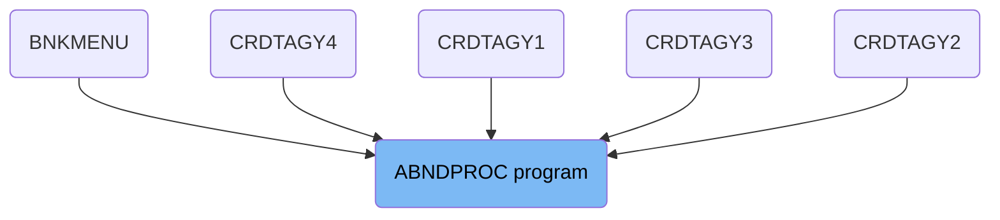
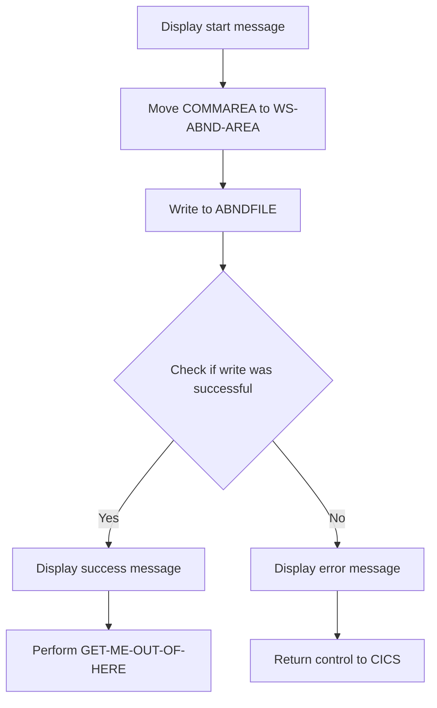
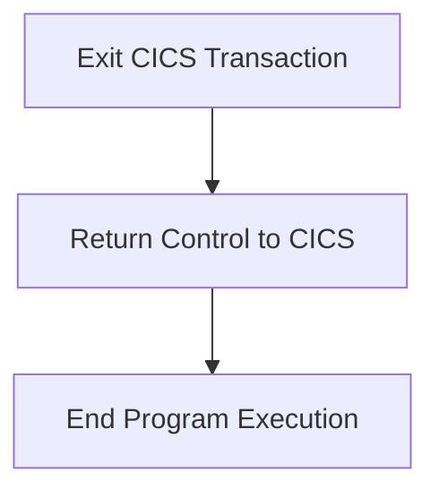

The ABNDPROC program handles the process of writing abend records to a file and managing the success or failure of this operation. The program ID for this process is ABNDPROC. It achieves its role by displaying start messages, moving data to working storage, writing to a file, and handling the success or failure of the write operation.

The flow involves displaying start messages, moving data to working storage, writing to a file, and handling the success or failure of the write operation.

# Where is this program used?

This program is used multiple times in the codebase as represented in the following diagram:

(Note - these are only some of the usages of this program)



## PREMIERE

Lets' zoom into this section of the flow:



<SwmSnippet path="/src/base/cobol_src/ABNDPROC.cbl" line="135">

---

First, the function displays a message indicating the start of the ABNDPROC process and the COMMAREA passed.

```cobol
      D    DISPLAY 'Started ABNDPROC:'.
      D    DISPLAY 'COMMAREA passed=' DFHCOMMAREA.
```

---

</SwmSnippet>

<SwmSnippet path="/src/base/cobol_src/ABNDPROC.cbl" line="139">

---

Next, the function moves the contents of <SwmToken path="src/base/cobol_src/ABNDPROC.cbl" pos="139:3:3" line-data="           MOVE DFHCOMMAREA TO WS-ABND-AREA.">`DFHCOMMAREA`</SwmToken> to <SwmToken path="src/base/cobol_src/ABNDPROC.cbl" pos="139:7:11" line-data="           MOVE DFHCOMMAREA TO WS-ABND-AREA.">`WS-ABND-AREA`</SwmToken>.

```cobol
           MOVE DFHCOMMAREA TO WS-ABND-AREA.
```

---

</SwmSnippet>

<SwmSnippet path="/src/base/cobol_src/ABNDPROC.cbl" line="141">

---

Then, it attempts to write the contents of <SwmToken path="src/base/cobol_src/ABNDPROC.cbl" pos="143:3:7" line-data="              FROM(WS-ABND-AREA)">`WS-ABND-AREA`</SwmToken> to the file <SwmToken path="src/base/cobol_src/ABNDPROC.cbl" pos="142:4:4" line-data="              FILE(&#39;ABNDFILE&#39;)">`ABNDFILE`</SwmToken> using the CICS WRITE command.

```cobol
           EXEC CICS WRITE
              FILE('ABNDFILE')
              FROM(WS-ABND-AREA)
              RIDFLD(ABND-VSAM-KEY)
              RESP(WS-CICS-RESP)
              RESP2(WS-CICS-RESP2)
           END-EXEC.
```

---

</SwmSnippet>

<SwmSnippet path="/src/base/cobol_src/ABNDPROC.cbl" line="149">

---

The function checks if the write operation was successful by evaluating the response codes <SwmToken path="src/base/cobol_src/ABNDPROC.cbl" pos="149:3:7" line-data="           IF WS-CICS-RESP NOT= DFHRESP(NORMAL)">`WS-CICS-RESP`</SwmToken> and <SwmToken path="src/base/cobol_src/ABNDPROC.cbl" pos="146:3:7" line-data="              RESP2(WS-CICS-RESP2)">`WS-CICS-RESP2`</SwmToken>.

```cobol
           IF WS-CICS-RESP NOT= DFHRESP(NORMAL)
```

---

</SwmSnippet>

<SwmSnippet path="/src/base/cobol_src/ABNDPROC.cbl" line="150">

---

If the write operation was not successful, it displays an error message indicating the failure to write to the file <SwmToken path="src/base/cobol_src/ABNDPROC.cbl" pos="151:18:18" line-data="              DISPLAY &#39;**** Unable to write to the file ABNDFILE !!!&#39;">`ABNDFILE`</SwmToken> along with the response codes.

```cobol
              DISPLAY '*********************************************'
              DISPLAY '**** Unable to write to the file ABNDFILE !!!'
              DISPLAY 'RESP=' WS-CICS-RESP ' RESP2=' WS-CICS-RESP2
              DISPLAY '*********************************************'
```

---

</SwmSnippet>

<SwmSnippet path="/src/base/cobol_src/ABNDPROC.cbl" line="155">

---

In case of a write failure, the function returns control to CICS.

```cobol
              EXEC CICS RETURN
              END-EXEC
```

---

</SwmSnippet>

<SwmSnippet path="/src/base/cobol_src/ABNDPROC.cbl" line="160">

---

If the write operation was successful, it displays a success message indicating that the ABEND record was successfully written to <SwmToken path="src/base/cobol_src/ABNDPROC.cbl" pos="160:16:16" line-data="      D    DISPLAY &#39;ABEND record successfully written to ABNDFILE&#39;.">`ABNDFILE`</SwmToken>.

```cobol
      D    DISPLAY 'ABEND record successfully written to ABNDFILE'.
      D    DISPLAY WS-ABND-AREA.
```

---

</SwmSnippet>

<SwmSnippet path="/src/base/cobol_src/ABNDPROC.cbl" line="163">

---

Finally, the function performs the <SwmToken path="src/base/cobol_src/ABNDPROC.cbl" pos="163:3:11" line-data="           PERFORM GET-ME-OUT-OF-HERE.">`GET-ME-OUT-OF-HERE`</SwmToken> routine.

```cobol
           PERFORM GET-ME-OUT-OF-HERE.
```

---

</SwmSnippet>

## Interim Summary

So far, we saw the detailed steps involved in the ABNDPROC process, including displaying start messages, moving data to working storage, writing to a file, and handling success or failure of the write operation. Now, we will focus on the <SwmToken path="src/base/cobol_src/ABNDPROC.cbl" pos="163:3:11" line-data="           PERFORM GET-ME-OUT-OF-HERE.">`GET-ME-OUT-OF-HERE`</SwmToken> routine, which handles the exit process of the CICS transaction and returns control to the CICS region.

## <SwmToken path="src/base/cobol_src/ABNDPROC.cbl" pos="163:3:11" line-data="           PERFORM GET-ME-OUT-OF-HERE.">`GET-ME-OUT-OF-HERE`</SwmToken>

Lets' zoom into this section of the flow:



<SwmSnippet path="/src/base/cobol_src/ABNDPROC.cbl" line="171">

---

First, the function initiates the process to exit the current CICS transaction by executing the <SwmToken path="src/base/cobol_src/ABNDPROC.cbl" pos="171:1:5" line-data="           EXEC CICS RETURN">`EXEC CICS RETURN`</SwmToken> command. This command returns control to the CICS region, indicating that the current task is complete.

```cobol
           EXEC CICS RETURN
           END-EXEC.
```

---

</SwmSnippet>

<SwmSnippet path="/src/base/cobol_src/ABNDPROC.cbl" line="173">

---

Next, the <SwmToken path="src/base/cobol_src/ABNDPROC.cbl" pos="173:1:1" line-data="           GOBACK.">`GOBACK`</SwmToken> statement is used to return control to the calling program or the operating system, effectively ending the execution of the current program.

```cobol
           GOBACK.
```

---

</SwmSnippet>

&nbsp;

*This is an auto-generated document by Swimm 🌊 and has not yet been verified by a human*

<SwmMeta version="3.0.0" repo-id="Z2l0aHViJTNBJTNBY2ljcy1iYW5raW5nLXNhbXBsZS1hcHBsaWNhdGlvbi1jYnNhLUlCTS1EZW1vJTNBJTNBU3dpbW0tRGVtbw==" repo-name="cics-banking-sample-application-cbsa-IBM-Demo"><sup>Powered by [Swimm](/)</sup></SwmMeta>
