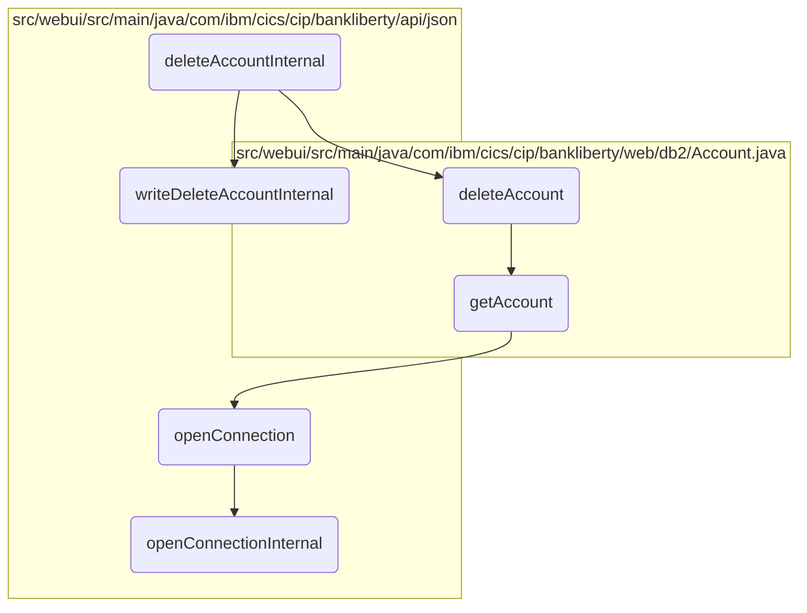
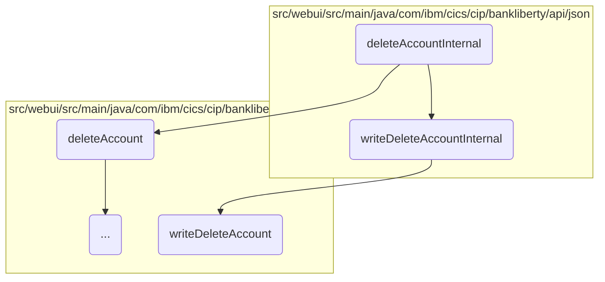
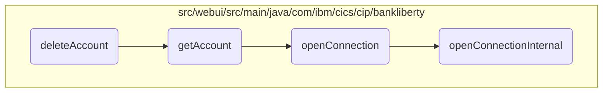
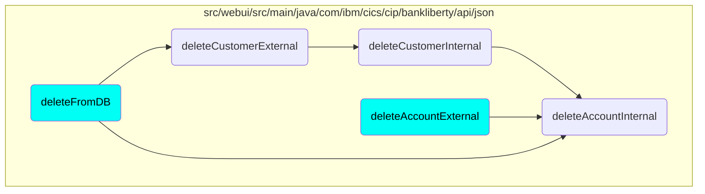

# Account Deletion Process

In this document, we will explain the process of deleting a bank account. The process involves several steps including retrieving the account details, deleting the account from the database, and logging the deletion as a transaction.

The flow starts with retrieving the account details to ensure the account exists. If the account is found, it proceeds to delete the account from the database. After successfully deleting the account, the system logs the deletion as a transaction for record-keeping purposes. If any step fails, appropriate error responses are generated.

Here is a high level diagram of the flow, showing only the most important functions:



## Flow drill down

First, we'll zoom into this section of the flow:



<SwmSnippet path="/src/webui/src/main/java/com/ibm/cics/cip/bankliberty/api/json/AccountsResource.java" line="1241">

---

### Handling Account Deletion

First, the <SwmToken path="src/webui/src/main/java/com/ibm/cics/cip/bankliberty/api/json/AccountsResource.java" pos="1241:5:5" line-data="	public Response deleteAccountInternal(Long accountNumber)">`deleteAccountInternal`</SwmToken> method is responsible for initiating the account deletion process. It retrieves the account details and attempts to delete the account from the database. If the account is successfully deleted, it prepares a JSON response with the account details. If the account is not found, it returns a 404 error response.

```java
	public Response deleteAccountInternal(Long accountNumber)
	{
		logger.entering(this.getClass().getName(), DELETE_ACCOUNT);
		Response myResponse = null;

		JSONObject response = new JSONObject();

		Integer sortCode = this.getSortCode();

		com.ibm.cics.cip.bankliberty.web.db2.Account db2Account = new Account();

		db2Account = db2Account.deleteAccount(accountNumber.intValue(),
				sortCode.intValue());
		if (db2Account != null)
		{
			response.put(JSON_SORT_CODE, db2Account.getSortcode().trim());
			response.put("id", db2Account.getAccountNumber());
			response.put(JSON_CUSTOMER_NUMBER, db2Account.getCustomerNumber());
			response.put(JSON_ACCOUNT_TYPE, db2Account.getType().trim());
			response.put(JSON_AVAILABLE_BALANCE,
					BigDecimal.valueOf(db2Account.getAvailableBalance()));
```

---

</SwmSnippet>

<SwmSnippet path="/src/webui/src/main/java/com/ibm/cics/cip/bankliberty/api/json/ProcessedTransactionResource.java" line="426">

---

### Writing Deleted Account Transaction

Next, the <SwmToken path="src/webui/src/main/java/com/ibm/cics/cip/bankliberty/api/json/ProcessedTransactionResource.java" pos="426:5:5" line-data="	public Response writeDeleteAccountInternal(">`writeDeleteAccountInternal`</SwmToken> method is called to log the deletion of the account as a transaction. It creates a <SwmToken path="src/webui/src/main/java/com/ibm/cics/cip/bankliberty/api/json/ProcessedTransactionResource.java" pos="427:1:1" line-data="			ProcessedTransactionAccountJSON myDeletedAccount)">`ProcessedTransactionAccountJSON`</SwmToken> object with the account details and calls the <SwmToken path="src/webui/src/main/java/com/ibm/cics/cip/bankliberty/api/json/ProcessedTransactionResource.java" pos="430:6:6" line-data="		if (myProcessedTransactionDB2.writeDeleteAccount(">`writeDeleteAccount`</SwmToken> method to write the transaction to the database. If the transaction is successfully written, it returns a 200 OK response; otherwise, it returns a server error response.

```java
	public Response writeDeleteAccountInternal(
			ProcessedTransactionAccountJSON myDeletedAccount)
	{
		com.ibm.cics.cip.bankliberty.web.db2.ProcessedTransaction myProcessedTransactionDB2 = new com.ibm.cics.cip.bankliberty.web.db2.ProcessedTransaction();
		if (myProcessedTransactionDB2.writeDeleteAccount(
				myDeletedAccount.getSortCode(),
				myDeletedAccount.getAccountNumber(),
				myDeletedAccount.getActualBalance(),
				myDeletedAccount.getLastStatement(),
				myDeletedAccount.getNextStatement(),
				myDeletedAccount.getCustomerNumber(),
				myDeletedAccount.getType()))
		{
			return Response.ok().build();
		}
		else
		{
			return Response.serverError().build();
		}

	}
```

---

</SwmSnippet>

<SwmSnippet path="/src/webui/src/main/java/com/ibm/cics/cip/bankliberty/web/db2/ProcessedTransaction.java" line="752">

---

### Writing Transaction to Database

Finally, the <SwmToken path="src/webui/src/main/java/com/ibm/cics/cip/bankliberty/web/db2/ProcessedTransaction.java" pos="752:5:5" line-data="	public boolean writeDeleteAccount(String sortCode2, String accountNumber,">`writeDeleteAccount`</SwmToken> method in the <SwmToken path="src/webui/src/main/java/com/ibm/cics/cip/bankliberty/api/json/ProcessedTransactionResource.java" pos="429:15:15" line-data="		com.ibm.cics.cip.bankliberty.web.db2.ProcessedTransaction myProcessedTransactionDB2 = new com.ibm.cics.cip.bankliberty.web.db2.ProcessedTransaction();">`ProcessedTransaction`</SwmToken> class handles the actual writing of the transaction to the database. It prepares the SQL statement with the account details and executes the update. If the update is successful, it returns true; otherwise, it logs the error and returns false.

```java
	public boolean writeDeleteAccount(String sortCode2, String accountNumber,
			BigDecimal actualBalance, Date lastStatement, Date nextStatement,
			String customerNumber, String accountType)
	{
		logger.entering(this.getClass().getName(), WRITE_DELETE_ACCOUNT);

		PROCTRAN myPROCTRAN = new PROCTRAN();

		Calendar myCalendar = Calendar.getInstance();
		myCalendar.setTime(lastStatement);

		myPROCTRAN.setProcDescDelaccLastDd(myCalendar.get(Calendar.DATE));
		myPROCTRAN.setProcDescDelaccLastMm(myCalendar.get(Calendar.MONTH) + 1);
		myPROCTRAN.setProcDescDelaccLastYyyy(myCalendar.get(Calendar.YEAR));

		myCalendar.setTime(nextStatement);
		myPROCTRAN.setProcDescDelaccNextDd(myCalendar.get(Calendar.DATE));
		myPROCTRAN.setProcDescDelaccNextMm(myCalendar.get(Calendar.MONTH) + 1);
		myPROCTRAN.setProcDescDelaccNextYyyy(myCalendar.get(Calendar.YEAR));
		myPROCTRAN.setProcDescDelaccAcctype(accountType);
		myPROCTRAN.setProcDescDelaccCustomer(Integer.parseInt(customerNumber));
```

---

</SwmSnippet>

Now, lets zoom into this section of the flow:



<SwmSnippet path="/src/webui/src/main/java/com/ibm/cics/cip/bankliberty/web/db2/Account.java" line="647">

---

### Retrieving the Account

First, the <SwmToken path="src/webui/src/main/java/com/ibm/cics/cip/bankliberty/web/db2/Account.java" pos="647:5:5" line-data="	public Account deleteAccount(int account, int sortcode)">`deleteAccount`</SwmToken> function retrieves the account details using the <SwmToken path="src/webui/src/main/java/com/ibm/cics/cip/bankliberty/web/db2/Account.java" pos="650:9:9" line-data="		Account db2Account = this.getAccount(account, sortcode);">`getAccount`</SwmToken> method. If the account does not exist, the function exits early, ensuring that only existing accounts are processed for deletion.

```java
	public Account deleteAccount(int account, int sortcode)
	{
		logger.entering(this.getClass().getName(), DELETE_ACCOUNT);
		Account db2Account = this.getAccount(account, sortcode);
		if (db2Account == null)
		{
			logger.exiting(this.getClass().getName(), DELETE_ACCOUNT, null);
			return null;
		}
```

---

</SwmSnippet>

<SwmSnippet path="/src/webui/src/main/java/com/ibm/cics/cip/bankliberty/web/db2/Account.java" line="657">

---

### Opening the Database Connection

Next, the function opens a connection to the database using the <SwmToken path="src/webui/src/main/java/com/ibm/cics/cip/bankliberty/web/db2/Account.java" pos="657:1:1" line-data="		openConnection();">`openConnection`</SwmToken> method. This step is crucial for executing the SQL commands required to delete the account.

```java
		openConnection();
```

---

</SwmSnippet>

<SwmSnippet path="/src/webui/src/main/java/com/ibm/cics/cip/bankliberty/web/db2/Account.java" line="668">

---

### Preparing SQL Statements

Then, the function prepares the SQL statements needed to select and delete the account. It formats the account number and sort code to match the database schema.

```java
		myStringBuilder = new StringBuilder();
		for (int i = Integer.toString(sortcode)
				.length(); i < SORT_CODE_LENGTH; i++)
		{
			myStringBuilder.append('0');
		}
		myStringBuilder.append(Integer.toString(sortcode));
		String sortCodeString = myStringBuilder.toString();
```

---

</SwmSnippet>

<SwmSnippet path="/src/webui/src/main/java/com/ibm/cics/cip/bankliberty/web/db2/Account.java" line="679">

---

### Executing SQL Statements

Finally, the function executes the SQL statements to retrieve the account details and then delete the account from the database. If the account is successfully deleted, the function returns the account details; otherwise, it logs an error and returns null.

```java
		try (PreparedStatement stmt = conn.prepareStatement(sql1);
				PreparedStatement stmt2 = conn.prepareStatement(sql2);)
		{
			logger.log(Level.FINE, () -> PRE_SELECT_MSG + sql1 + ">");

			stmt.setString(1, accountNumberString);
			stmt.setString(2, sortCodeString);
			
			
			ResultSet rs = stmt.executeQuery();
			while (rs.next())
			{
				temp = new Account(rs.getString(ACCOUNT_CUSTOMER_NUMBER),
						rs.getString(ACCOUNT_SORTCODE),
						rs.getString(ACCOUNT_NUMBER),
						rs.getString(ACCOUNT_TYPE),
						rs.getDouble(ACCOUNT_INTEREST_RATE),
						rs.getDate(ACCOUNT_OPENED),
						rs.getInt(ACCOUNT_OVERDRAFT_LIMIT),
						rs.getDate(ACCOUNT_LAST_STATEMENT),
						rs.getDate(ACCOUNT_NEXT_STATEMENT),
```

---

</SwmSnippet>

## Where is this flow used?

This flow is used multiple times in the codebase as represented in the following diagram:



&nbsp;

*This is an auto-generated document by Swimm 🌊 and has not yet been verified by a human*

<SwmMeta version="3.0.0" repo-id="Z2l0aHViJTNBJTNBY2ljcy1iYW5raW5nLXNhbXBsZS1hcHBsaWNhdGlvbi1jYnNhLUlCTS1EZW1vJTNBJTNBU3dpbW0tRGVtbw==" repo-name="cics-banking-sample-application-cbsa-IBM-Demo"></SwmMeta>
