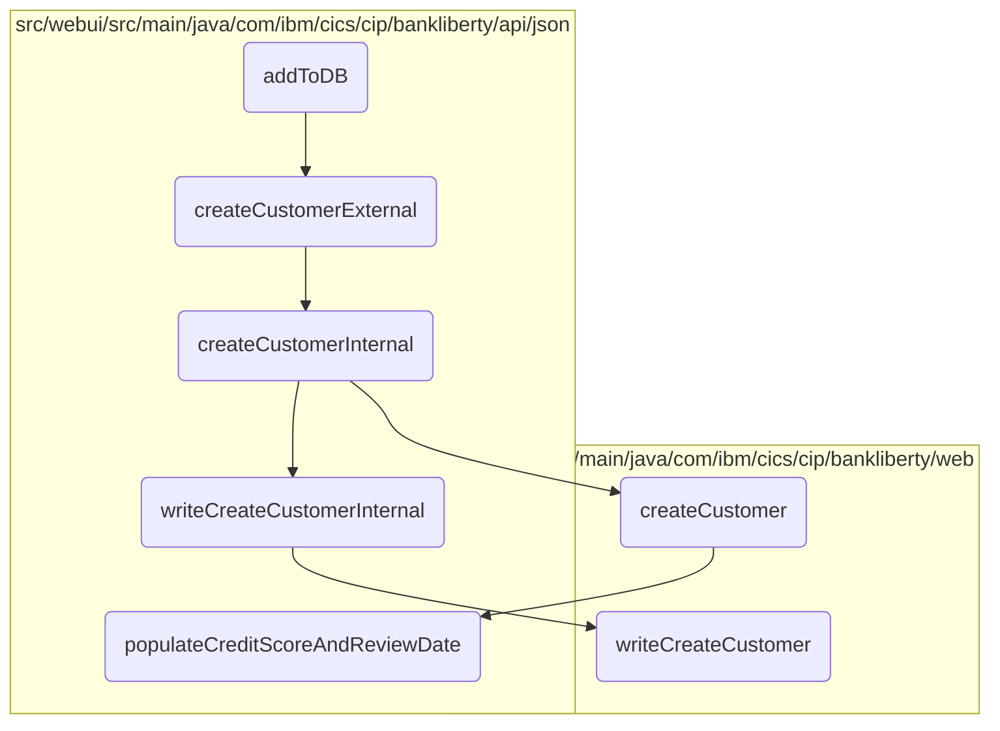

# Adding a Customer to the Database

In this document, we will explain the process of adding a customer to the database. The process involves creating a customer resource, setting customer details, and writing the customer data to the database.

The flow starts by creating a customer resource and setting the customer's details such as address, name, date of birth, and sort code. These details are then passed to the method that initiates the customer creation process. The process includes several validations, writing the customer data to the VSAM database, and finally writing the customer details to the <SwmToken path="src/webui/src/main/java/com/ibm/cics/cip/bankliberty/api/json/ProcessedTransactionResource.java" pos="134:4:4" line-data="					&quot;Proctran DB2 table not accessible. Please contact your system administrator.&quot;);">`DB2`</SwmToken> database. If all operations are successful, the customer is added to the database.

## Flow drill down



<SwmSnippet path="/src/webui/src/main/java/com/ibm/cics/cip/bankliberty/webui/data_access/Customer.java" line="265">

---

### <SwmToken path="src/webui/src/main/java/com/ibm/cics/cip/bankliberty/webui/data_access/Customer.java" pos="265:5:5" line-data="	public String addToDB()">`addToDB`</SwmToken> Function

Diving into the <SwmToken path="src/webui/src/main/java/com/ibm/cics/cip/bankliberty/webui/data_access/Customer.java" pos="265:5:5" line-data="	public String addToDB()">`addToDB`</SwmToken> function, we start by creating a <SwmToken path="src/webui/src/main/java/com/ibm/cics/cip/bankliberty/webui/data_access/Customer.java" pos="267:1:1" line-data="		CustomerResource myCustomerResource = new CustomerResource();">`CustomerResource`</SwmToken> and a <SwmToken path="src/webui/src/main/java/com/ibm/cics/cip/bankliberty/webui/data_access/Customer.java" pos="269:1:1" line-data="		CustomerJSON myCustomerJSON = new CustomerJSON();">`CustomerJSON`</SwmToken> object. The customer's details are set into the <SwmToken path="src/webui/src/main/java/com/ibm/cics/cip/bankliberty/webui/data_access/Customer.java" pos="269:1:1" line-data="		CustomerJSON myCustomerJSON = new CustomerJSON();">`CustomerJSON`</SwmToken> object, which is then passed to the <SwmToken path="src/webui/src/main/java/com/ibm/cics/cip/bankliberty/webui/data_access/Customer.java" pos="276:2:2" line-data="				.createCustomerExternal(myCustomerJSON);">`createCustomerExternal`</SwmToken> method. This method initiates the customer creation process.

```java
	public String addToDB()
	{
		CustomerResource myCustomerResource = new CustomerResource();

		CustomerJSON myCustomerJSON = new CustomerJSON();

		myCustomerJSON.setCustomerAddress(this.getAddress());
		myCustomerJSON.setCustomerName(this.getName());
		myCustomerJSON.setDateOfBirth(this.getDob());
		myCustomerJSON.setSortCode(this.getSortcode());
		Response myCustomerResponse = myCustomerResource
				.createCustomerExternal(myCustomerJSON);

		String myCustomerString = null;
		JSONObject myCustomer = null;

		if (myCustomerResponse.getStatus() == 201)
		{
			myCustomerString = myCustomerResponse.getEntity().toString();
			try
			{
```

---

</SwmSnippet>

<SwmSnippet path="/src/webui/src/main/java/com/ibm/cics/cip/bankliberty/api/json/CustomerResource.java" line="108">

---

### <SwmToken path="src/webui/src/main/java/com/ibm/cics/cip/bankliberty/api/json/CustomerResource.java" pos="110:5:5" line-data="	public Response createCustomerExternal(CustomerJSON customer)">`createCustomerExternal`</SwmToken> Function

Moving to the <SwmToken path="src/webui/src/main/java/com/ibm/cics/cip/bankliberty/api/json/CustomerResource.java" pos="110:5:5" line-data="	public Response createCustomerExternal(CustomerJSON customer)">`createCustomerExternal`</SwmToken> function, it logs the entry and calls the <SwmToken path="src/webui/src/main/java/com/ibm/cics/cip/bankliberty/api/json/CustomerResource.java" pos="114:7:7" line-data="		Response myResponse = createCustomerInternal(customer);">`createCustomerInternal`</SwmToken> function. After the internal creation process, it terminates the <SwmToken path="src/webui/src/main/java/com/ibm/cics/cip/bankliberty/api/json/CustomerResource.java" pos="115:1:1" line-data="		HBankDataAccess myHBankDataAccess = new HBankDataAccess();">`HBankDataAccess`</SwmToken> and logs the exit.

```java
	@POST
	@Produces(MediaType.APPLICATION_JSON)
	public Response createCustomerExternal(CustomerJSON customer)
	{
		logger.entering(this.getClass().getName(),
				CREATE_CUSTOMER_EXTERNAL + customer.toString());
		Response myResponse = createCustomerInternal(customer);
		HBankDataAccess myHBankDataAccess = new HBankDataAccess();
		myHBankDataAccess.terminate();
		logger.exiting(this.getClass().getName(), CREATE_CUSTOMER_EXTERNAL_EXIT,
				myResponse);
		return myResponse;
	}
```

---

</SwmSnippet>

<SwmSnippet path="/src/webui/src/main/java/com/ibm/cics/cip/bankliberty/api/json/CustomerResource.java" line="123">

---

### <SwmToken path="src/webui/src/main/java/com/ibm/cics/cip/bankliberty/api/json/CustomerResource.java" pos="123:5:5" line-data="	public Response createCustomerInternal(CustomerJSON customer)">`createCustomerInternal`</SwmToken> Function

Next, the <SwmToken path="src/webui/src/main/java/com/ibm/cics/cip/bankliberty/api/json/CustomerResource.java" pos="123:5:5" line-data="	public Response createCustomerInternal(CustomerJSON customer)">`createCustomerInternal`</SwmToken> function performs several validations on the customer data, such as checking if the customer name, sort code, address, and date of birth are not null. It then creates a <SwmToken path="src/webui/src/main/java/com/ibm/cics/cip/bankliberty/api/json/CustomerResource.java" pos="134:2:2" line-data="					&quot;Customer name is null&quot;);">`Customer`</SwmToken> object and sets the sort code. The customer is created in the VSAM database, and if successful, the customer details are written to the PROCTRAN data store.

```java
	public Response createCustomerInternal(CustomerJSON customer)
	{
		logger.entering(this.getClass().getName(),
				CREATE_CUSTOMER_INTERNAL + customer.toString());
		JSONObject response = new JSONObject();

		
		if(customer.getCustomerName() == null)
		{
			JSONObject error = new JSONObject();
			error.put(JSON_ERROR_MSG,
					"Customer name is null");
			Response myResponse = Response.status(400).entity(error.toString())
					.build();
			logger.log(Level.WARNING,
					() -> "Customer name is null in CustomerResource.createCustomerInternal(), "
							+ customer.toString());
			logger.exiting(this.getClass().getName(),
					CREATE_CUSTOMER_INTERNAL_EXIT, myResponse);
			return myResponse;
		}
```

---

</SwmSnippet>

<SwmSnippet path="/src/webui/src/main/java/com/ibm/cics/cip/bankliberty/api/json/ProcessedTransactionResource.java" line="389">

---

### <SwmToken path="src/webui/src/main/java/com/ibm/cics/cip/bankliberty/api/json/ProcessedTransactionResource.java" pos="389:5:5" line-data="	public Response writeCreateCustomerInternal(">`writeCreateCustomerInternal`</SwmToken> Function

Then, the <SwmToken path="src/webui/src/main/java/com/ibm/cics/cip/bankliberty/api/json/ProcessedTransactionResource.java" pos="389:5:5" line-data="	public Response writeCreateCustomerInternal(">`writeCreateCustomerInternal`</SwmToken> function writes the created customer details to the <SwmToken path="src/webui/src/main/java/com/ibm/cics/cip/bankliberty/api/json/ProcessedTransactionResource.java" pos="134:4:4" line-data="					&quot;Proctran DB2 table not accessible. Please contact your system administrator.&quot;);">`DB2`</SwmToken> database. If the write operation is successful, it returns an OK response; otherwise, it returns a server error.

```java
	public Response writeCreateCustomerInternal(
			ProcessedTransactionCreateCustomerJSON myCreatedCustomer)
	{
		com.ibm.cics.cip.bankliberty.web.db2.ProcessedTransaction myProcessedTransactionDB2 = new com.ibm.cics.cip.bankliberty.web.db2.ProcessedTransaction();
		

		if (myProcessedTransactionDB2.writeCreateCustomer(
				myCreatedCustomer.getSortCode(),
				myCreatedCustomer.getAccountNumber(), 0.00,
				myCreatedCustomer.getCustomerDOB(),
				myCreatedCustomer.getCustomerName(),
				myCreatedCustomer.getCustomerNumber()))
		{
			return Response.ok().build();
		}
		else
		{
			return Response.serverError().build();
		}

	}
```

---

</SwmSnippet>

<SwmSnippet path="/src/webui/src/main/java/com/ibm/cics/cip/bankliberty/web/vsam/Customer.java" line="740">

---

### <SwmToken path="src/webui/src/main/java/com/ibm/cics/cip/bankliberty/web/vsam/Customer.java" pos="740:5:5" line-data="	public Customer createCustomer(CustomerJSON customer,">`createCustomer`</SwmToken> Function

Going into the <SwmToken path="src/webui/src/main/java/com/ibm/cics/cip/bankliberty/web/vsam/Customer.java" pos="740:5:5" line-data="	public Customer createCustomer(CustomerJSON customer,">`createCustomer`</SwmToken> function, it initializes a <SwmToken path="src/webui/src/main/java/com/ibm/cics/cip/bankliberty/web/vsam/Customer.java" pos="740:3:3" line-data="	public Customer createCustomer(CustomerJSON customer,">`Customer`</SwmToken> object and sets various customer details, including the address, name, date of birth, and sort code. It also populates the credit score and review date for the customer. The customer data is then written to the VSAM file.

```java
	public Customer createCustomer(CustomerJSON customer,
			Integer sortCodeInteger)
	{
		logger.entering(this.getClass().getName(), CREATE_CUSTOMER);

		Customer temp = null;

		customerFile.setName(FILENAME);
		myCustomer = new CUSTOMER();

		String sortCodeString = sortCodeInteger.toString();
		long customerNumberAsPrimitive = getNextCustomerNumber(sortCodeString);

		Long customerNumberLong = Long.valueOf(customerNumberAsPrimitive);
		if (customerNumberLong == -1)
		{
			return null;
		}

		byte[] key = buildKey(sortCodeInteger, customerNumberLong);

```

---

</SwmSnippet>

<SwmSnippet path="/src/webui/src/main/java/com/ibm/cics/cip/bankliberty/api/json/CreditScoreCICS540.java" line="56">

---

### <SwmToken path="src/webui/src/main/java/com/ibm/cics/cip/bankliberty/api/json/CreditScoreCICS540.java" pos="56:7:7" line-data="	public static CustomerJSON populateCreditScoreAndReviewDate(">`populateCreditScoreAndReviewDate`</SwmToken> Function

Finally, the <SwmToken path="src/webui/src/main/java/com/ibm/cics/cip/bankliberty/api/json/CreditScoreCICS540.java" pos="56:7:7" line-data="	public static CustomerJSON populateCreditScoreAndReviewDate(">`populateCreditScoreAndReviewDate`</SwmToken> function sets a random credit score review date within the next 21 days and calculates the average credit score from multiple credit agencies. This information is then set into the customer object.

```java
	public static CustomerJSON populateCreditScoreAndReviewDate(
			CustomerJSON customer)
	{
		sortOutLogging();

		int creditAgencyCount = 5;

		/* Set up a random CS review date within the next 21 days */

		Calendar calendar = Calendar.getInstance();
		long nowMs = calendar.getTimeInMillis();
		int next21Days = new Random(calendar.getTimeInMillis()).nextInt(20);
		next21Days++;
		nowMs = nowMs + (1000L * 60L * 60L * 24L * next21Days);
		customer.setReviewDate(new Date(nowMs));
		Channel myCreditScoreChannel = null;

		AsyncService asService = new AsyncServiceImpl();
		List<Future<ChildResponse>> children = new ArrayList<>();
		String[] containerID = new String[creditAgencyCount];
		int creditScoreTotal = 0;
```

---

</SwmSnippet>

&nbsp;

*This is an auto-generated document by Swimm 🌊 and has not yet been verified by a human*

<SwmMeta version="3.0.0" repo-id="Z2l0aHViJTNBJTNBY2ljcy1iYW5raW5nLXNhbXBsZS1hcHBsaWNhdGlvbi1jYnNhLUlCTS1EZW1vJTNBJTNBU3dpbW0tRGVtbw==" repo-name="cics-banking-sample-application-cbsa-IBM-Demo"></SwmMeta>
