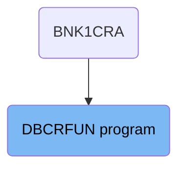
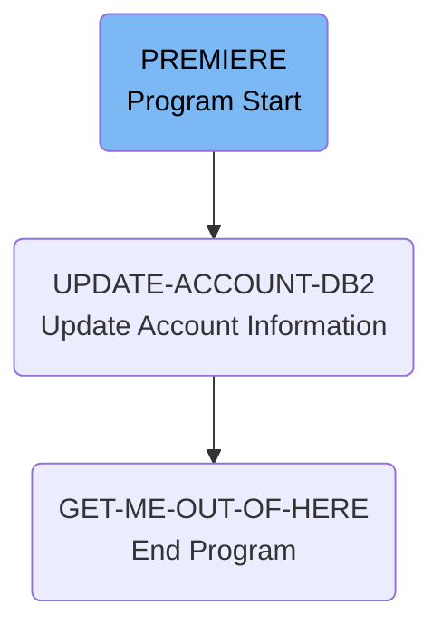

# Cash Transactions (DBCRFUN)

The DBCRFUN program is responsible for updating account information in the database. It is used in a flow starting from the BNK1CRA program. The process involves initializing communication codes, updating account records in the database, and handling any errors or abnormal terminations.

The flow starts with the BNK1CRA program, which calls the DBCRFUN program. The DBCRFUN program first initializes communication codes and sets up error handling. It then updates the account information in the database by moving the account number and sort code to host variables, retrieving account information, and updating balances based on debit or credit transactions. Finally, it logs the processed transaction and exits the program.

## Where is this program used?

This program is used once, in a flow starting from `BNK1CRA` as represented in the following diagram:



Lets' zoom into the flow:



<SwmSnippet path="/src/base/cobol_src/DBCRFUN.cbl" line="199">

---

### PREMIERE Section

First, the <SwmToken path="src/base/cobol_src/DBCRFUN.cbl" pos="199:1:1" line-data="       PREMIERE SECTION.">`PREMIERE`</SwmToken> section initializes the communication success and failure codes. It sets up Abend handling to manage any abnormal terminations. Then, it moves the <SwmToken path="src/base/cobol_src/DBCRFUN.cbl" pos="211:3:3" line-data="           MOVE SORTCODE TO COMM-SORTC.">`SORTCODE`</SwmToken> to <SwmToken path="src/base/cobol_src/DBCRFUN.cbl" pos="211:7:9" line-data="           MOVE SORTCODE TO COMM-SORTC.">`COMM-SORTC`</SwmToken> and <SwmToken path="src/base/cobol_src/DBCRFUN.cbl" pos="212:7:11" line-data="           MOVE SORTCODE TO DESIRED-SORT-CODE.">`DESIRED-SORT-CODE`</SwmToken>. This prepares the necessary data for the account update process. The section then performs the <SwmToken path="src/base/cobol_src/DBCRFUN.cbl" pos="235:1:5" line-data="       UPDATE-ACCOUNT-DB2 SECTION.">`UPDATE-ACCOUNT-DB2`</SwmToken> paragraph to update the account record in the database. Finally, it performs the <SwmToken path="src/base/cobol_src/DBCRFUN.cbl" pos="658:1:9" line-data="       GET-ME-OUT-OF-HERE SECTION.">`GET-ME-OUT-OF-HERE`</SwmToken> paragraph to complete the process and exit.

```cobol
       PREMIERE SECTION.
       A010.
           MOVE 'N' TO COMM-SUCCESS
           MOVE '0' TO COMM-FAIL-CODE

      *
      *    Set up some Abend handling
      *
           EXEC CICS HANDLE ABEND
              LABEL(ABEND-HANDLING)
           END-EXEC.

           MOVE SORTCODE TO COMM-SORTC.
           MOVE SORTCODE TO DESIRED-SORT-CODE.

      *
      *    Determine what kind of ACCOUNT datastore we should
      *    be accessing
      *


```

---

</SwmSnippet>

<SwmSnippet path="/src/base/cobol_src/DBCRFUN.cbl" line="235">

---

### <SwmToken path="src/base/cobol_src/DBCRFUN.cbl" pos="235:1:5" line-data="       UPDATE-ACCOUNT-DB2 SECTION.">`UPDATE-ACCOUNT-DB2`</SwmToken> Section

Moving to the <SwmToken path="src/base/cobol_src/DBCRFUN.cbl" pos="235:1:5" line-data="       UPDATE-ACCOUNT-DB2 SECTION.">`UPDATE-ACCOUNT-DB2`</SwmToken> section, it starts by moving the account number and sort code to the host variables. It then retrieves the account information from the database using an SQL SELECT statement. If the SQLCODE is not zero, it handles the error by setting the communication success to 'N' and the failure code accordingly. If the amount requested is a debit, it checks if the available balance is sufficient. If not, it sets the failure code and exits. If the amount is a credit, it updates the account balances and writes the updated information back to the database. Finally, it performs the <SwmToken path="src/base/cobol_src/DBCRFUN.cbl" pos="441:3:7" line-data="           PERFORM WRITE-TO-PROCTRAN.">`WRITE-TO-PROCTRAN`</SwmToken> paragraph to log the processed transaction.

```cobol
       UPDATE-ACCOUNT-DB2 SECTION.
       UAD010.

           MOVE COMM-ACCNO TO DESIRED-ACC-NO.
           MOVE DESIRED-SORT-CODE TO HV-ACCOUNT-SORTCODE.
           MOVE DESIRED-ACC-NO TO HV-ACCOUNT-ACC-NO.

      *
      *    Retrieve the account information
      *
           EXEC SQL
              SELECT ACCOUNT_EYECATCHER,
                     ACCOUNT_CUSTOMER_NUMBER,
                     ACCOUNT_SORTCODE,
                     ACCOUNT_NUMBER,
                     ACCOUNT_TYPE,
                     ACCOUNT_INTEREST_RATE,
                     ACCOUNT_OPENED,
                     ACCOUNT_OVERDRAFT_LIMIT,
                     ACCOUNT_LAST_STATEMENT,
                     ACCOUNT_NEXT_STATEMENT,
```

---

</SwmSnippet>

<SwmSnippet path="/src/base/cobol_src/DBCRFUN.cbl" line="658">

---

### <SwmToken path="src/base/cobol_src/DBCRFUN.cbl" pos="658:1:9" line-data="       GET-ME-OUT-OF-HERE SECTION.">`GET-ME-OUT-OF-HERE`</SwmToken> Section

Then, the <SwmToken path="src/base/cobol_src/DBCRFUN.cbl" pos="658:1:9" line-data="       GET-ME-OUT-OF-HERE SECTION.">`GET-ME-OUT-OF-HERE`</SwmToken> section is executed. This section simply returns control to CICS and exits the program. This marks the end of the <SwmToken path="src/base/cobol_src/DBCRFUN.cbl" pos="199:1:1" line-data="       PREMIERE SECTION.">`PREMIERE`</SwmToken> function's execution.

```cobol
       GET-ME-OUT-OF-HERE SECTION.
       GMOOH010.
           EXEC CICS RETURN
           END-EXEC.
           GOBACK.

       GMOOH999.
           EXIT.
```

---

</SwmSnippet>

&nbsp;

*This is an auto-generated document by Swimm 🌊 and has not yet been verified by a human*

<SwmMeta version="3.0.0" repo-id="Z2l0aHViJTNBJTNBY2ljcy1iYW5raW5nLXNhbXBsZS1hcHBsaWNhdGlvbi1jYnNhLUlCTS1EZW1vJTNBJTNBU3dpbW0tRGVtbw==" repo-name="cics-banking-sample-application-cbsa-IBM-Demo"></SwmMeta>
