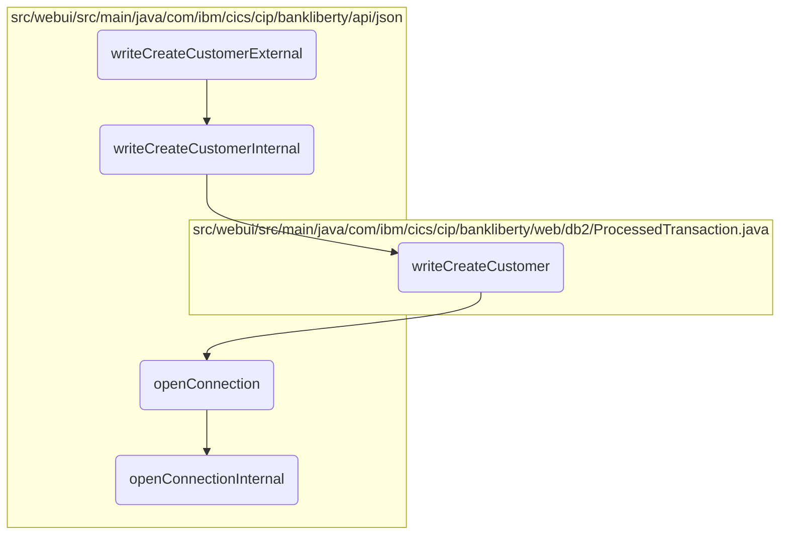

# Creating a New Customer Flow

In this document, we will explain the process of creating a new customer. The process involves the following steps: initiating the customer creation, processing the customer data, writing the data to the database, and establishing a database connection.

The flow starts with initiating the customer creation process by receiving customer data in JSON format. This data is then processed internally and prepared for database insertion. The system ensures that a connection to the database is established, and if not, it creates a new one. Finally, the customer data is written to the database.

## Flow drill down



<SwmSnippet path="/src/webui/src/main/java/com/ibm/cics/cip/bankliberty/api/json/ProcessedTransactionResource.java" line="375">

---

### <SwmToken path="src/webui/src/main/java/com/ibm/cics/cip/bankliberty/api/json/ProcessedTransactionResource.java" pos="379:5:5" line-data="	public Response writeCreateCustomerExternal(">`writeCreateCustomerExternal`</SwmToken>

First, the <SwmToken path="src/webui/src/main/java/com/ibm/cics/cip/bankliberty/api/json/ProcessedTransactionResource.java" pos="379:5:5" line-data="	public Response writeCreateCustomerExternal(">`writeCreateCustomerExternal`</SwmToken> method is called to initiate the customer creation process. It receives the customer data in JSON format and calls the <SwmToken path="src/webui/src/main/java/com/ibm/cics/cip/bankliberty/api/json/ProcessedTransactionResource.java" pos="382:7:7" line-data="		Response myResponse = writeCreateCustomerInternal(myCreatedCustomer);">`writeCreateCustomerInternal`</SwmToken> method to handle the internal processing.

```java
	@POST
	@Produces("application/json")
	@Consumes(MediaType.APPLICATION_JSON)
	@Path("/createCustomer")
	public Response writeCreateCustomerExternal(
			ProcessedTransactionCreateCustomerJSON myCreatedCustomer)
	{
		Response myResponse = writeCreateCustomerInternal(myCreatedCustomer);
		HBankDataAccess myHBankDataAccess = new HBankDataAccess();
		myHBankDataAccess.terminate();
		return myResponse;
	}
```

---

</SwmSnippet>

<SwmSnippet path="/src/webui/src/main/java/com/ibm/cics/cip/bankliberty/api/json/ProcessedTransactionResource.java" line="389">

---

### <SwmToken path="src/webui/src/main/java/com/ibm/cics/cip/bankliberty/api/json/ProcessedTransactionResource.java" pos="389:5:5" line-data="	public Response writeCreateCustomerInternal(">`writeCreateCustomerInternal`</SwmToken>

Next, the <SwmToken path="src/webui/src/main/java/com/ibm/cics/cip/bankliberty/api/json/ProcessedTransactionResource.java" pos="389:5:5" line-data="	public Response writeCreateCustomerInternal(">`writeCreateCustomerInternal`</SwmToken> method processes the customer data and attempts to write it to the database. It calls the <SwmToken path="src/webui/src/main/java/com/ibm/cics/cip/bankliberty/api/json/ProcessedTransactionResource.java" pos="395:6:6" line-data="		if (myProcessedTransactionDB2.writeCreateCustomer(">`writeCreateCustomer`</SwmToken> method to perform the actual database insertion.

```java
	public Response writeCreateCustomerInternal(
			ProcessedTransactionCreateCustomerJSON myCreatedCustomer)
	{
		com.ibm.cics.cip.bankliberty.web.db2.ProcessedTransaction myProcessedTransactionDB2 = new com.ibm.cics.cip.bankliberty.web.db2.ProcessedTransaction();
		

		if (myProcessedTransactionDB2.writeCreateCustomer(
				myCreatedCustomer.getSortCode(),
				myCreatedCustomer.getAccountNumber(), 0.00,
				myCreatedCustomer.getCustomerDOB(),
				myCreatedCustomer.getCustomerName(),
				myCreatedCustomer.getCustomerNumber()))
		{
			return Response.ok().build();
		}
		else
		{
			return Response.serverError().build();
		}

	}
```

---

</SwmSnippet>

<SwmSnippet path="/src/webui/src/main/java/com/ibm/cics/cip/bankliberty/web/db2/ProcessedTransaction.java" line="693">

---

### <SwmToken path="src/webui/src/main/java/com/ibm/cics/cip/bankliberty/web/db2/ProcessedTransaction.java" pos="693:5:5" line-data="	public boolean writeCreateCustomer(String sortCode2, String accountNumber,">`writeCreateCustomer`</SwmToken>

Then, the <SwmToken path="src/webui/src/main/java/com/ibm/cics/cip/bankliberty/web/db2/ProcessedTransaction.java" pos="693:5:5" line-data="	public boolean writeCreateCustomer(String sortCode2, String accountNumber,">`writeCreateCustomer`</SwmToken> method prepares the customer data for insertion into the database. It formats the data, opens a database connection, and executes the SQL insert statement.

```java
	public boolean writeCreateCustomer(String sortCode2, String accountNumber,
			double amountWhichWillBeZero, Date customerDOB, String customerName,
			String customerNumber)
	{
		logger.entering(this.getClass().getName(), WRITE_CREATE_CUSTOMER);
		sortOutDateTimeTaskString();
		String createCustomerDescription = "";
		createCustomerDescription = createCustomerDescription
				.concat(padSortCode(Integer.parseInt(sortCode2)));

		createCustomerDescription = createCustomerDescription
				.concat(padCustomerNumber(customerNumber));
		StringBuilder myStringBuilder = new StringBuilder();
		for (int z = customerName.length(); z < 14; z++)
		{
			myStringBuilder.append("0");
		}
		myStringBuilder.append(customerName);
		createCustomerDescription = createCustomerDescription
				.concat(myStringBuilder.substring(0, 14));

```

---

</SwmSnippet>

<SwmSnippet path="/src/webui/src/main/java/com/ibm/cics/cip/bankliberty/api/json/HBankDataAccess.java" line="69">

---

### <SwmToken path="src/webui/src/main/java/com/ibm/cics/cip/bankliberty/api/json/HBankDataAccess.java" pos="69:5:5" line-data="	protected void openConnection()">`openConnection`</SwmToken>

Moving to the <SwmToken path="src/webui/src/main/java/com/ibm/cics/cip/bankliberty/api/json/HBankDataAccess.java" pos="69:5:5" line-data="	protected void openConnection()">`openConnection`</SwmToken> method, it ensures that a connection to the <SwmToken path="src/webui/src/main/java/com/ibm/cics/cip/bankliberty/api/json/HBankDataAccess.java" pos="71:13:13" line-data="		// Open a connection to the DB2 database">`DB2`</SwmToken> database is established. If a connection is not already available, it calls the <SwmToken path="src/webui/src/main/java/com/ibm/cics/cip/bankliberty/api/json/HBankDataAccess.java" pos="87:1:1" line-data="			openConnectionInternal();">`openConnectionInternal`</SwmToken> method to create a new one.

```java
	protected void openConnection()
	{
		// Open a connection to the DB2 database
		logger.entering(this.getClass().getName(), "openConnection()");

		Integer taskNumberInteger = Task.getTask().getTaskNumber();
		String db2ConnString = DB2CONN.concat(taskNumberInteger.toString());
		logger.log(Level.FINE,
				() -> "Attempting to get DB2CONN for task number "
						+ taskNumberInteger.toString());
		this.conn = (Connection) cornedBeef.get(db2ConnString);
		if (this.conn == null)
		{
			HBankDataAccess.incrementConnCount();
			logger.log(Level.FINE,
					() -> "Attempting to create DB2CONN for task number "
							+ taskNumberInteger.toString());
			// Attempt to open a connection
			openConnectionInternal();
			logger.log(Level.FINE,
					() -> "Creation succcessful for DB2CONN for task number "
```

---

</SwmSnippet>

<SwmSnippet path="/src/webui/src/main/java/com/ibm/cics/cip/bankliberty/api/json/HBankDataAccess.java" line="162">

---

### <SwmToken path="src/webui/src/main/java/com/ibm/cics/cip/bankliberty/api/json/HBankDataAccess.java" pos="163:3:3" line-data="	void openConnectionInternal()">`openConnectionInternal`</SwmToken>

Finally, the <SwmToken path="src/webui/src/main/java/com/ibm/cics/cip/bankliberty/api/json/HBankDataAccess.java" pos="163:3:3" line-data="	void openConnectionInternal()">`openConnectionInternal`</SwmToken> method attempts to establish a new database connection using the JNDI lookup. If successful, it stores the connection for reuse and increments the connection count.

```java
	@SuppressWarnings("unchecked")
	void openConnectionInternal()
	{
		logger.entering(this.getClass().getName(), "openConnectionInternal");
		String jndiString = "jdbc/defaultCICSDataSource";
		Context ctx;

		try
		{
			ctx = new InitialContext();
			DataSource ds = (DataSource) ctx.lookup(jndiString);
			logger.log(Level.FINE, () -> "jndi string is " + jndiString);
			// If there is no current connection
			if (this.conn == null)
			{
				logger.log(Level.FINE,
						() -> "About to attempt to get DB2 connection");
				// Try and get a connection
				this.conn = ds.getConnection();
				this.conn.setTransactionIsolation(
						Connection.TRANSACTION_READ_UNCOMMITTED);
```

---

</SwmSnippet>

&nbsp;

*This is an auto-generated document by Swimm 🌊 and has not yet been verified by a human*

<SwmMeta version="3.0.0" repo-id="Z2l0aHViJTNBJTNBY2ljcy1iYW5raW5nLXNhbXBsZS1hcHBsaWNhdGlvbi1jYnNhLUlCTS1EZW1vJTNBJTNBU3dpbW0tRGVtbw==" repo-name="cics-banking-sample-application-cbsa-IBM-Demo"></SwmMeta>
