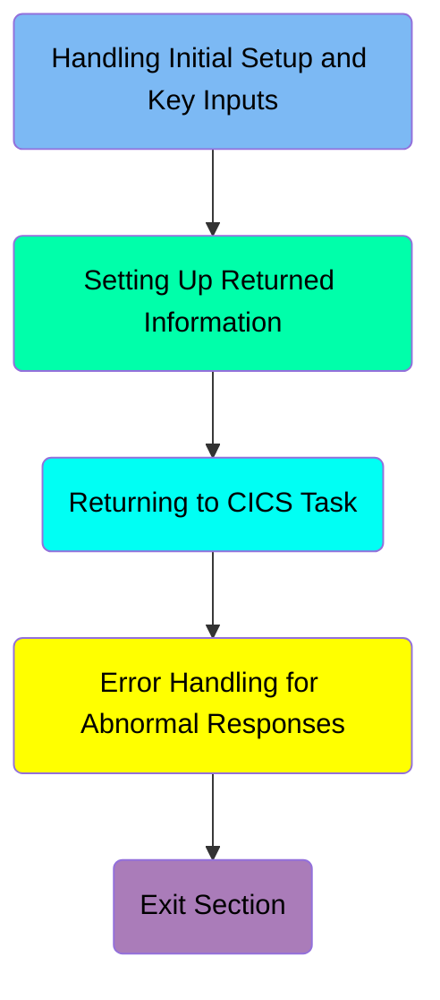
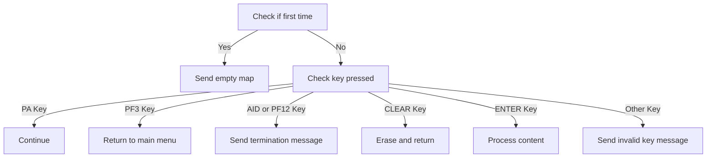
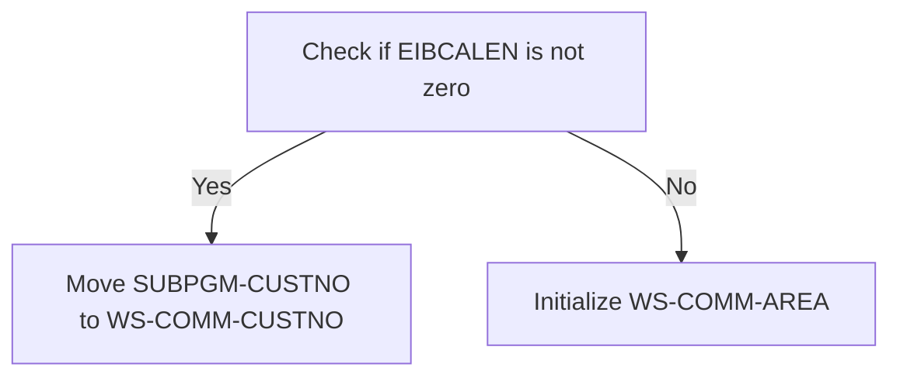
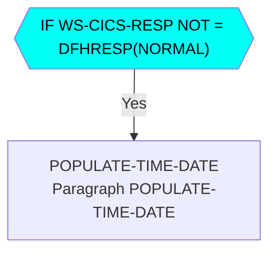

# Creating Account (BNK1CAC)

The Creating Account (BNK1CAC) program involves verifying input data and linking to the `CREACC` program to add the new account to the account datastore.

The <SwmToken path="src/base/cobol_src/BNK1CAC.cbl" pos="258:4:4" line-data="              MOVE &#39;BNK1CAC - A010 - RETURN TRANSID(OCAC) FAIL&#39; TO">`BNK1CAC`</SwmToken> program starts by checking if it's the first time the user is interacting with the application. It then handles different key inputs like PA keys, PF3 key, AID key, PF12 key, CLEAR key, and ENTER key. Depending on the key pressed, it performs actions like sending an empty map, returning to the main menu, sending a termination message, erasing the screen, processing user input, or sending an invalid key message. The program also sets up returned information by checking the communication area length and moving customer information or initializing the communication area. Finally, it handles transaction returns and error responses, ensuring proper communication with the CICS system.

Here is a high level diagram of the program:



## Handling Initial Setup and Key Inputs



<SwmSnippet path="/src/base/cobol_src/BNK1CAC.cbl" line="163">

---

### Checking if it's the first time

First, the code checks if it's the first time through by evaluating if <SwmToken path="src/base/cobol_src/BNK1CAC.cbl" pos="169:3:3" line-data="              WHEN EIBCALEN = ZERO">`EIBCALEN`</SwmToken> is zero. If it is, it initializes the map with empty data fields and sets the <SwmToken path="src/base/cobol_src/BNK1CAC.cbl" pos="172:3:5" line-data="                 SET SEND-ERASE TO TRUE">`SEND-ERASE`</SwmToken> flag to true. This ensures that the user sees a blank form when they first interact with the application.

```cobol
           EVALUATE TRUE

      *
      *       Is it the first time through? If so, send the map
      *       with erased (empty) data fields.
      *
              WHEN EIBCALEN = ZERO
                 MOVE LOW-VALUE TO BNK1CAO
                 MOVE -1 TO CUSTNOL
                 SET SEND-ERASE TO TRUE
                 MOVE SPACES TO MESSAGEO
                 PERFORM SEND-MAP
```

---

</SwmSnippet>

<SwmSnippet path="/src/base/cobol_src/BNK1CAC.cbl" line="177">

---

### Handling PA keys

Moving to the next condition, if a PA key (Program Attention key) is pressed, the program simply continues without taking any specific action. This allows the user to press these keys without disrupting the flow.

```cobol
      *       If a PA key is pressed, just carry on
      *
              WHEN EIBAID = DFHPA1 OR DFHPA2 OR DFHPA3
                 CONTINUE
```

---

</SwmSnippet>

<SwmSnippet path="/src/base/cobol_src/BNK1CAC.cbl" line="183">

---

### Returning to the main menu

Next, if the PF3 key is pressed, the program returns to the main menu by executing a CICS RETURN command with the transaction ID 'OMEN'. This provides a way for the user to navigate back to the main menu.

```cobol
      *       When Pf3 is pressed, return to the main menu
      *
              WHEN EIBAID = DFHPF3
                 EXEC CICS RETURN
                    TRANSID('OMEN')
                    IMMEDIATE
                    RESP(WS-CICS-RESP)
                    RESP2(WS-CICS-RESP2)
                 END-EXEC
```

---

</SwmSnippet>

<SwmSnippet path="/src/base/cobol_src/BNK1CAC.cbl" line="194">

---

### Sending termination message

Then, if either the AID key or PF12 key is pressed, the program performs the <SwmToken path="src/base/cobol_src/BNK1CAC.cbl" pos="198:3:7" line-data="                 PERFORM SEND-TERMINATION-MSG">`SEND-TERMINATION-MSG`</SwmToken> routine and returns control to CICS. This is used to send a termination message to the user.

```cobol
      *       If the aid or Pf12 is pressed, then send a termination
      *       message.
      *
              WHEN EIBAID = DFHAID OR DFHPF12
                 PERFORM SEND-TERMINATION-MSG
                 EXEC CICS
                    RETURN
                 END-EXEC
```

---

</SwmSnippet>

<SwmSnippet path="/src/base/cobol_src/BNK1CAC.cbl" line="204">

---

### Handling CLEAR key

When the CLEAR key is pressed, the program sends a control command to erase the screen and free the keyboard, then returns control to CICS. This clears the current screen for the user.

```cobol
      *       When CLEAR is pressed
      *
              WHEN EIBAID = DFHCLEAR
                 EXEC CICS SEND CONTROL
                          ERASE
                          FREEKB
                 END-EXEC

                 EXEC CICS RETURN
                 END-EXEC
```

---

</SwmSnippet>

<SwmSnippet path="/src/base/cobol_src/BNK1CAC.cbl" line="216">

---

### Processing content on ENTER key

When the ENTER key is pressed, the program performs the <SwmToken path="src/base/cobol_src/BNK1CAC.cbl" pos="219:3:5" line-data="                 PERFORM PROCESS-MAP">`PROCESS-MAP`</SwmToken> routine to process the content entered by the user. This is where the main processing of user input occurs.

```cobol
      *       When enter is pressed then process the content
      *
              WHEN EIBAID = DFHENTER
                 PERFORM PROCESS-MAP

```

---

</SwmSnippet>

<SwmSnippet path="/src/base/cobol_src/BNK1CAC.cbl" line="222">

---

### Handling invalid keys

Finally, if any other key is pressed, the program sends an invalid key message to the user by setting the <SwmToken path="src/base/cobol_src/BNK1CAC.cbl" pos="228:3:7" line-data="                 SET SEND-DATAONLY-ALARM TO TRUE">`SEND-DATAONLY-ALARM`</SwmToken> flag to true and performing the <SwmToken path="src/base/cobol_src/BNK1CAC.cbl" pos="229:3:5" line-data="                 PERFORM SEND-MAP">`SEND-MAP`</SwmToken> routine. This informs the user that an invalid key was pressed.

```cobol
      *       When anything else happens, send the invalid key message
      *
              WHEN OTHER
                 MOVE LOW-VALUES TO BNK1CAO
                 MOVE SPACES TO MESSAGEO
                 MOVE 'Invalid key pressed.' TO MESSAGEO
                 SET SEND-DATAONLY-ALARM TO TRUE
                 PERFORM SEND-MAP

```

---

</SwmSnippet>

## Setting Up Returned Information

This is the next section of the flow.



<SwmSnippet path="/src/base/cobol_src/BNK1CAC.cbl" line="239">

---

### Checking EIBCALEN

First, we check if <SwmToken path="src/base/cobol_src/BNK1CAC.cbl" pos="239:3:3" line-data="            IF EIBCALEN NOT = 0">`EIBCALEN`</SwmToken> (which indicates the length of the communication area) is not zero. This helps determine if this is the first time through the process or not.

```cobol
            IF EIBCALEN NOT = 0
```

---

</SwmSnippet>

<SwmSnippet path="/src/base/cobol_src/BNK1CAC.cbl" line="240">

---

### Moving Customer Information

If <SwmToken path="src/base/cobol_src/BNK1CAC.cbl" pos="169:3:3" line-data="              WHEN EIBCALEN = ZERO">`EIBCALEN`</SwmToken> is not zero, we move the customer number from <SwmToken path="src/base/cobol_src/BNK1CAC.cbl" pos="240:3:5" line-data="               MOVE SUBPGM-CUSTNO     TO WS-COMM-CUSTNO">`SUBPGM-CUSTNO`</SwmToken> to <SwmToken path="src/base/cobol_src/BNK1CAC.cbl" pos="240:9:13" line-data="               MOVE SUBPGM-CUSTNO     TO WS-COMM-CUSTNO">`WS-COMM-CUSTNO`</SwmToken>, the account type from <SwmToken path="src/base/cobol_src/BNK1CAC.cbl" pos="241:3:7" line-data="               MOVE SUBPGM-ACC-TYPE   TO WS-COMM-ACCTYPE">`SUBPGM-ACC-TYPE`</SwmToken> to <SwmToken path="src/base/cobol_src/BNK1CAC.cbl" pos="241:11:15" line-data="               MOVE SUBPGM-ACC-TYPE   TO WS-COMM-ACCTYPE">`WS-COMM-ACCTYPE`</SwmToken>, the interest rate from <SwmToken path="src/base/cobol_src/BNK1CAC.cbl" pos="242:3:7" line-data="               MOVE SUBPGM-INT-RT     TO WS-COMM-INTRT">`SUBPGM-INT-RT`</SwmToken> to <SwmToken path="src/base/cobol_src/BNK1CAC.cbl" pos="242:11:15" line-data="               MOVE SUBPGM-INT-RT     TO WS-COMM-INTRT">`WS-COMM-INTRT`</SwmToken>, and the overdraft limit from <SwmToken path="src/base/cobol_src/BNK1CAC.cbl" pos="243:3:7" line-data="               MOVE SUBPGM-OVERDR-LIM TO WS-COMM-OVERDR">`SUBPGM-OVERDR-LIM`</SwmToken> to <SwmToken path="src/base/cobol_src/BNK1CAC.cbl" pos="243:11:15" line-data="               MOVE SUBPGM-OVERDR-LIM TO WS-COMM-OVERDR">`WS-COMM-OVERDR`</SwmToken>. This updates the working storage communication area with the relevant customer information.

```cobol
               MOVE SUBPGM-CUSTNO     TO WS-COMM-CUSTNO
               MOVE SUBPGM-ACC-TYPE   TO WS-COMM-ACCTYPE
               MOVE SUBPGM-INT-RT     TO WS-COMM-INTRT
               MOVE SUBPGM-OVERDR-LIM TO WS-COMM-OVERDR
```

---

</SwmSnippet>

<SwmSnippet path="/src/base/cobol_src/BNK1CAC.cbl" line="244">

---

### Initializing Communication Area

If <SwmToken path="src/base/cobol_src/BNK1CAC.cbl" pos="169:3:3" line-data="              WHEN EIBCALEN = ZERO">`EIBCALEN`</SwmToken> is zero, we initialize the <SwmToken path="src/base/cobol_src/BNK1CAC.cbl" pos="245:3:7" line-data="               INITIALIZE WS-COMM-AREA">`WS-COMM-AREA`</SwmToken>. This sets up the communication area for the first time, ensuring that all fields are properly initialized.

```cobol
            ELSE
               INITIALIZE WS-COMM-AREA
            END-IF.
```

---

</SwmSnippet>

### Interim Summary

So far, we saw how the program handles various key inputs, including checking if it's the first time, handling PA keys, returning to the main menu, sending termination messages, handling the CLEAR key, processing content on the ENTER key, and handling invalid keys. Now, we will focus on setting up the returned information, including checking EIBCALEN, moving customer information, and initializing the communication area.

## Returning to CICS Task



<SwmSnippet path="/src/base/cobol_src/BNK1CAC.cbl" line="249">

---

### Handling Transaction Return

First, the transaction is returned using the <SwmToken path="src/base/cobol_src/BNK1CAC.cbl" pos="249:1:8" line-data="               RETURN TRANSID(&#39;OCAC&#39;)">`RETURN TRANSID('OCAC')`</SwmToken> statement. This specifies the transaction ID to which control should be returned. The <SwmToken path="src/base/cobol_src/BNK1CAC.cbl" pos="250:1:8" line-data="               COMMAREA(WS-COMM-AREA)">`COMMAREA(WS-COMM-AREA)`</SwmToken> specifies the communication area to be used, and <SwmToken path="src/base/cobol_src/BNK1CAC.cbl" pos="251:1:4" line-data="               LENGTH(32)">`LENGTH(32)`</SwmToken> sets the length of the communication area. The <SwmToken path="src/base/cobol_src/BNK1CAC.cbl" pos="252:1:8" line-data="               RESP(WS-CICS-RESP)">`RESP(WS-CICS-RESP)`</SwmToken> and <SwmToken path="src/base/cobol_src/BNK1CAC.cbl" pos="253:1:8" line-data="               RESP2(WS-CICS-RESP2)">`RESP2(WS-CICS-RESP2)`</SwmToken> are used to capture the primary and secondary response codes from the CICS command.

```cobol
               RETURN TRANSID('OCAC')
               COMMAREA(WS-COMM-AREA)
               LENGTH(32)
               RESP(WS-CICS-RESP)
               RESP2(WS-CICS-RESP2)
            END-EXEC.

```

---

</SwmSnippet>

<SwmSnippet path="/src/base/cobol_src/BNK1CAC.cbl" line="249">

---

### Checking Response Codes

Next, the response code <SwmToken path="src/base/cobol_src/BNK1CAC.cbl" pos="252:3:7" line-data="               RESP(WS-CICS-RESP)">`WS-CICS-RESP`</SwmToken> is checked to see if it is not equal to <SwmToken path="src/base/cobol_src/BNK1CAC.cbl" pos="256:13:16" line-data="           IF WS-CICS-RESP NOT = DFHRESP(NORMAL)">`DFHRESP(NORMAL)`</SwmToken>. If the response is not normal, it indicates that an error has occurred, and further action is required.

```cobol
               RETURN TRANSID('OCAC')
               COMMAREA(WS-COMM-AREA)
               LENGTH(32)
               RESP(WS-CICS-RESP)
               RESP2(WS-CICS-RESP2)
            END-EXEC.

```

---

</SwmSnippet>

<SwmSnippet path="/src/base/cobol_src/BNK1CAC.cbl" line="1283">

---

### Populating Time and Date

Then, the <SwmToken path="src/base/cobol_src/BNK1CAC.cbl" pos="1283:1:5" line-data="       POPULATE-TIME-DATE SECTION.">`POPULATE-TIME-DATE`</SwmToken> section is called if the response is not normal. This section uses the <SwmToken path="src/base/cobol_src/BNK1CAC.cbl" pos="1286:1:5" line-data="           EXEC CICS ASKTIME">`EXEC CICS ASKTIME`</SwmToken> command to get the current time and stores it in <SwmToken path="src/base/cobol_src/BNK1CAC.cbl" pos="1287:3:7" line-data="              ABSTIME(WS-U-TIME)">`WS-U-TIME`</SwmToken>. It then formats the time using <SwmToken path="src/base/cobol_src/BNK1CAC.cbl" pos="1290:1:5" line-data="           EXEC CICS FORMATTIME">`EXEC CICS FORMATTIME`</SwmToken>, storing the formatted date in <SwmToken path="src/base/cobol_src/BNK1CAC.cbl" pos="1292:3:7" line-data="                     DDMMYYYY(WS-ORIG-DATE)">`WS-ORIG-DATE`</SwmToken> and the current time in <SwmToken path="src/base/cobol_src/BNK1CAC.cbl" pos="1293:3:7" line-data="                     TIME(WS-TIME-NOW)">`WS-TIME-NOW`</SwmToken>.

```cobol
       POPULATE-TIME-DATE SECTION.
       PTD010.

           EXEC CICS ASKTIME
              ABSTIME(WS-U-TIME)
           END-EXEC.

           EXEC CICS FORMATTIME
                     ABSTIME(WS-U-TIME)
                     DDMMYYYY(WS-ORIG-DATE)
                     TIME(WS-TIME-NOW)
                     DATESEP
           END-EXEC.

       PTD999.
           EXIT.
```

---

</SwmSnippet>

## Error Handling for Abnormal Responses

<SwmSnippet path="/src/base/cobol_src/BNK1CAC.cbl" line="257">

---

### Initializing Error Handling Information

First, we initialize <SwmToken path="src/base/cobol_src/BNK1CAC.cbl" pos="257:3:7" line-data="              INITIALIZE WS-FAIL-INFO">`WS-FAIL-INFO`</SwmToken> and set up the failure message <SwmToken path="src/base/cobol_src/BNK1CAC.cbl" pos="259:1:7" line-data="                 WS-CICS-FAIL-MSG">`WS-CICS-FAIL-MSG`</SwmToken> to indicate the transaction ID failure. We then move the response codes <SwmToken path="src/base/cobol_src/BNK1CAC.cbl" pos="260:3:7" line-data="              MOVE WS-CICS-RESP  TO WS-CICS-RESP-DISP">`WS-CICS-RESP`</SwmToken> and <SwmToken path="src/base/cobol_src/BNK1CAC.cbl" pos="261:3:7" line-data="              MOVE WS-CICS-RESP2 TO WS-CICS-RESP2-DISP">`WS-CICS-RESP2`</SwmToken> to their respective display fields <SwmToken path="src/base/cobol_src/BNK1CAC.cbl" pos="260:11:17" line-data="              MOVE WS-CICS-RESP  TO WS-CICS-RESP-DISP">`WS-CICS-RESP-DISP`</SwmToken> and <SwmToken path="src/base/cobol_src/BNK1CAC.cbl" pos="261:11:17" line-data="              MOVE WS-CICS-RESP2 TO WS-CICS-RESP2-DISP">`WS-CICS-RESP2-DISP`</SwmToken>.

```cobol
              INITIALIZE WS-FAIL-INFO
              MOVE 'BNK1CAC - A010 - RETURN TRANSID(OCAC) FAIL' TO
                 WS-CICS-FAIL-MSG
              MOVE WS-CICS-RESP  TO WS-CICS-RESP-DISP
              MOVE WS-CICS-RESP2 TO WS-CICS-RESP2-DISP
```

---

</SwmSnippet>

<SwmSnippet path="/src/base/cobol_src/BNK1CAC.cbl" line="269">

---

### Setting Up ABEND Information

Next, we initialize <SwmToken path="src/base/cobol_src/BNK1CAC.cbl" pos="269:3:5" line-data="                INITIALIZE ABNDINFO-REC">`ABNDINFO-REC`</SwmToken> and move the response codes <SwmToken path="src/base/cobol_src/BNK1CAC.cbl" pos="270:3:3" line-data="                MOVE EIBRESP    TO ABND-RESPCODE">`EIBRESP`</SwmToken> and <SwmToken path="src/base/cobol_src/BNK1CAC.cbl" pos="271:3:3" line-data="                MOVE EIBRESP2   TO ABND-RESP2CODE">`EIBRESP2`</SwmToken> to <SwmToken path="src/base/cobol_src/BNK1CAC.cbl" pos="270:7:9" line-data="                MOVE EIBRESP    TO ABND-RESPCODE">`ABND-RESPCODE`</SwmToken> and <SwmToken path="src/base/cobol_src/BNK1CAC.cbl" pos="271:7:9" line-data="                MOVE EIBRESP2   TO ABND-RESP2CODE">`ABND-RESP2CODE`</SwmToken> respectively. This sets up the standard ABEND information.

```cobol
                INITIALIZE ABNDINFO-REC
                MOVE EIBRESP    TO ABND-RESPCODE
                MOVE EIBRESP2   TO ABND-RESP2CODE
```

---

</SwmSnippet>

<SwmSnippet path="/src/base/cobol_src/BNK1CAC.cbl" line="275">

---

### Gathering Supplemental Information

Then, we gather supplemental information by assigning the application ID to <SwmToken path="src/base/cobol_src/BNK1CAC.cbl" pos="275:9:11" line-data="                EXEC CICS ASSIGN APPLID(ABND-APPLID)">`ABND-APPLID`</SwmToken>, and moving the task number <SwmToken path="src/base/cobol_src/BNK1CAC.cbl" pos="278:3:3" line-data="                MOVE EIBTASKN   TO ABND-TASKNO-KEY">`EIBTASKN`</SwmToken> and transaction ID <SwmToken path="src/base/cobol_src/BNK1CAC.cbl" pos="279:3:3" line-data="                MOVE EIBTRNID   TO ABND-TRANID">`EIBTRNID`</SwmToken> to <SwmToken path="src/base/cobol_src/BNK1CAC.cbl" pos="278:7:11" line-data="                MOVE EIBTASKN   TO ABND-TASKNO-KEY">`ABND-TASKNO-KEY`</SwmToken> and <SwmToken path="src/base/cobol_src/BNK1CAC.cbl" pos="279:7:9" line-data="                MOVE EIBTRNID   TO ABND-TRANID">`ABND-TRANID`</SwmToken> respectively.

```cobol
                EXEC CICS ASSIGN APPLID(ABND-APPLID)
                END-EXEC

                MOVE EIBTASKN   TO ABND-TASKNO-KEY
                MOVE EIBTRNID   TO ABND-TRANID

```

---

</SwmSnippet>

<SwmSnippet path="/src/base/cobol_src/BNK1CAC.cbl" line="281">

---

### Populating Date and Time

Moving to the next step, we perform the <SwmToken path="src/base/cobol_src/BNK1CAC.cbl" pos="281:3:7" line-data="                PERFORM POPULATE-TIME-DATE">`POPULATE-TIME-DATE`</SwmToken> routine to get the current date and time. We then move the original date <SwmToken path="src/base/cobol_src/BNK1CAC.cbl" pos="284:3:7" line-data="                MOVE WS-ORIG-DATE TO ABND-DATE">`WS-ORIG-DATE`</SwmToken> to <SwmToken path="src/base/cobol_src/BNK1CAC.cbl" pos="284:11:13" line-data="                MOVE WS-ORIG-DATE TO ABND-DATE">`ABND-DATE`</SwmToken> and construct the time string from <SwmToken path="src/base/cobol_src/BNK1CAC.cbl" pos="285:3:11" line-data="                STRING WS-TIME-NOW-GRP-HH DELIMITED BY SIZE,">`WS-TIME-NOW-GRP-HH`</SwmToken>, <SwmToken path="src/base/cobol_src/BNK1CAC.cbl" pos="287:1:9" line-data="                       WS-TIME-NOW-GRP-MM DELIMITED BY SIZE,">`WS-TIME-NOW-GRP-MM`</SwmToken>, and <SwmToken path="src/base/cobol_src/BNK1CAC.cbl" pos="287:1:9" line-data="                       WS-TIME-NOW-GRP-MM DELIMITED BY SIZE,">`WS-TIME-NOW-GRP-MM`</SwmToken> into <SwmToken path="src/base/cobol_src/BNK1CAC.cbl" pos="290:3:5" line-data="                       INTO ABND-TIME">`ABND-TIME`</SwmToken>.

```cobol
                PERFORM POPULATE-TIME-DATE


                MOVE WS-ORIG-DATE TO ABND-DATE
                STRING WS-TIME-NOW-GRP-HH DELIMITED BY SIZE,
                       ':' DELIMITED BY SIZE,
                       WS-TIME-NOW-GRP-MM DELIMITED BY SIZE,
                       ':' DELIMITED BY SIZE,
                       WS-TIME-NOW-GRP-MM DELIMITED BY SIZE
                       INTO ABND-TIME
                END-STRING
```

---

</SwmSnippet>

<SwmSnippet path="/src/base/cobol_src/BNK1CAC.cbl" line="293">

---

### Finalizing ABEND Information

Next, we move the universal time <SwmToken path="src/base/cobol_src/BNK1CAC.cbl" pos="293:3:7" line-data="                MOVE WS-U-TIME   TO ABND-UTIME-KEY">`WS-U-TIME`</SwmToken> to <SwmToken path="src/base/cobol_src/BNK1CAC.cbl" pos="293:11:15" line-data="                MOVE WS-U-TIME   TO ABND-UTIME-KEY">`ABND-UTIME-KEY`</SwmToken> and set the code <SwmToken path="src/base/cobol_src/BNK1CAC.cbl" pos="294:4:4" line-data="                MOVE &#39;HBNK&#39;      TO ABND-CODE">`HBNK`</SwmToken> to <SwmToken path="src/base/cobol_src/BNK1CAC.cbl" pos="294:9:11" line-data="                MOVE &#39;HBNK&#39;      TO ABND-CODE">`ABND-CODE`</SwmToken>. We assign the program name to <SwmToken path="src/base/cobol_src/BNK1CAC.cbl" pos="296:9:11" line-data="                EXEC CICS ASSIGN PROGRAM(ABND-PROGRAM)">`ABND-PROGRAM`</SwmToken> and set the SQL code to zeros. We then construct a freeform message with the response codes and move it to <SwmToken path="src/base/cobol_src/BNK1CAC.cbl" pos="306:3:5" line-data="                       INTO ABND-FREEFORM">`ABND-FREEFORM`</SwmToken>.

```cobol
                MOVE WS-U-TIME   TO ABND-UTIME-KEY
                MOVE 'HBNK'      TO ABND-CODE

                EXEC CICS ASSIGN PROGRAM(ABND-PROGRAM)
                END-EXEC

                MOVE ZEROS      TO ABND-SQLCODE

                STRING 'A010- RETURN TRANSID(OCAC) ' DELIMITED BY SIZE,
                       ' EIBRESP=' DELIMITED BY SIZE,
                       ABND-RESPCODE DELIMITED BY SIZE,
                       ' RESP2=' DELIMITED BY SIZE,
                       ABND-RESP2CODE DELIMITED BY SIZE
                       INTO ABND-FREEFORM
                END-STRING
```

---

</SwmSnippet>

<SwmSnippet path="/src/base/cobol_src/BNK1CAC.cbl" line="309">

---

### Linking to ABEND Handler

Finally, we link to the ABEND handler program <SwmToken path="src/base/cobol_src/BNK1CAC.cbl" pos="309:9:13" line-data="                EXEC CICS LINK PROGRAM(WS-ABEND-PGM)">`WS-ABEND-PGM`</SwmToken> with the communication area <SwmToken path="src/base/cobol_src/BNK1CAC.cbl" pos="310:3:5" line-data="                          COMMAREA(ABNDINFO-REC)">`ABNDINFO-REC`</SwmToken> and perform the <SwmToken path="src/base/cobol_src/BNK1CAC.cbl" pos="313:3:7" line-data="                PERFORM ABEND-THIS-TASK">`ABEND-THIS-TASK`</SwmToken> routine to handle the abend.

```cobol
                EXEC CICS LINK PROGRAM(WS-ABEND-PGM)
                          COMMAREA(ABNDINFO-REC)
                END-EXEC
```

---

</SwmSnippet>

&nbsp;

*This is an auto-generated document by Swimm 🌊 and has not yet been verified by a human*

<SwmMeta version="3.0.0" repo-id="Z2l0aHViJTNBJTNBY2ljcy1iYW5raW5nLXNhbXBsZS1hcHBsaWNhdGlvbi1jYnNhLUlCTS1EZW1vJTNBJTNBU3dpbW0tRGVtbw==" repo-name="cics-banking-sample-application-cbsa-IBM-Demo"></SwmMeta>
