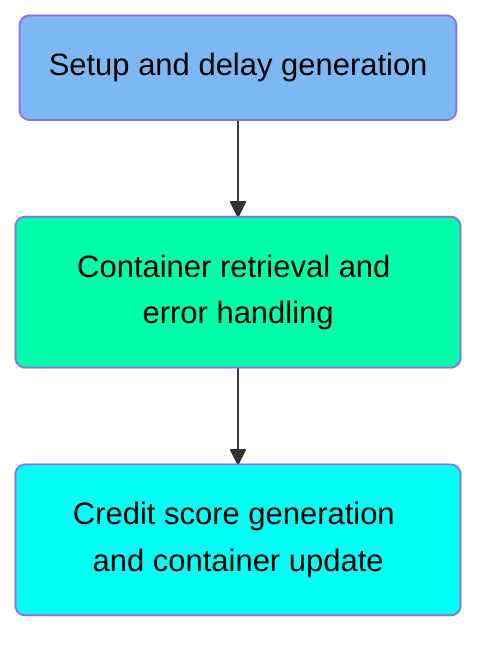
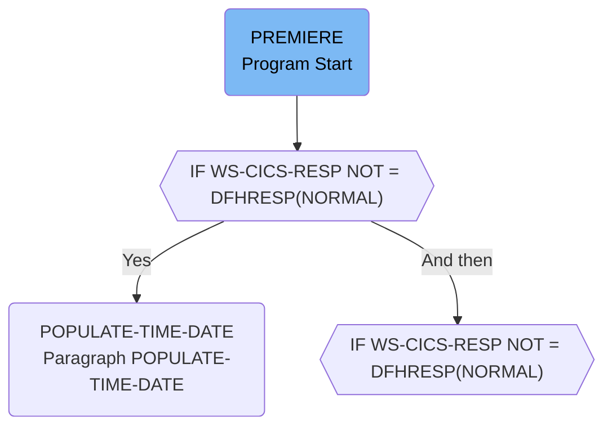
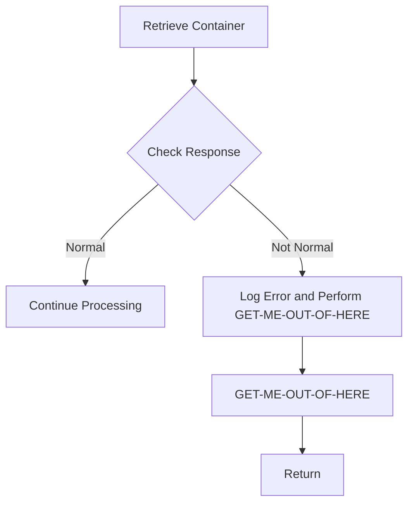
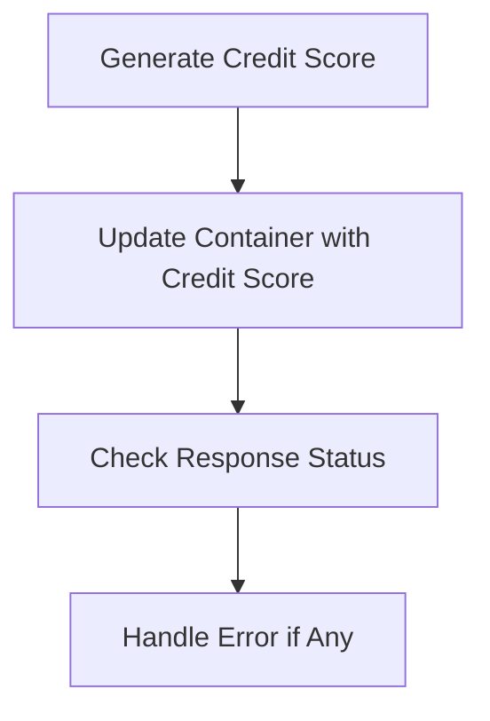

# Credit Score Generation and Update (CRDTAGY4)

The <SwmToken path="src/base/cobol_src/CRDTAGY4.cbl" pos="203:4:4" line-data="              DISPLAY &#39;CRDTAGY4 - UNABLE TO GET CONTAINER. RESP=&#39;">`CRDTAGY4`</SwmToken> program is responsible for generating and updating credit scores. It achieves this by setting up container and channel names, generating a random delay, handling errors, retrieving containers, and updating them with new credit scores. The program ensures accurate logging and graceful error handling.

The flow starts with setting up container and channel names, followed by generating a random delay. If any errors occur, they are logged with accurate timestamps. The program then retrieves the container, generates a new credit score, updates the container with this score, and checks the response status. If any errors are detected, they are handled gracefully.

Here is a high level diagram of the program:



## Setup and delay generation



<SwmSnippet path="/src/base/cobol_src/CRDTAGY4.cbl" line="113">

---

### Handling Delay and Error Management

First, the <SwmToken path="src/base/cobol_src/CRDTAGY4.cbl" pos="113:1:1" line-data="       PREMIERE SECTION.">`PREMIERE`</SwmToken> section starts by setting up the container and channel names, and initializing the seed for generating a random delay amount. This delay is then applied using the <SwmToken path="src/base/cobol_src/CRDTAGY4.cbl" pos="127:1:5" line-data="           EXEC CICS DELAY">`EXEC CICS DELAY`</SwmToken> command. If the response from this command is not normal, it proceeds to handle the error by preserving the response codes and gathering additional information such as application ID, task number, and transaction ID. It then performs the <SwmToken path="src/base/cobol_src/CRDTAGY4.cbl" pos="260:1:5" line-data="       POPULATE-TIME-DATE SECTION.">`POPULATE-TIME-DATE`</SwmToken> paragraph to get the current date and time, and formats this information for error logging.

```cobol
       PREMIERE SECTION.
       A010.
      *
      *    Generate a random  number of seconds between 0 & 3.
      *    This is the delay amount in seconds.
      *

           MOVE 'CIPD            ' TO WS-CONTAINER-NAME.
           MOVE 'CIPCREDCHANN    ' TO WS-CHANNEL-NAME.
           MOVE EIBTASKN           TO WS-SEED.

           COMPUTE WS-DELAY-AMT = ((3 - 1)
                            * FUNCTION RANDOM(WS-SEED)) + 1.

           EXEC CICS DELAY
                FOR SECONDS(WS-DELAY-AMT)
                RESP(WS-CICS-RESP)
                RESP2(WS-CICS-RESP2)
           END-EXEC.

           IF WS-CICS-RESP NOT = DFHRESP(NORMAL)
```

---

</SwmSnippet>

<SwmSnippet path="/src/base/cobol_src/CRDTAGY4.cbl" line="260">

---

#### <SwmToken path="src/base/cobol_src/CRDTAGY4.cbl" pos="260:1:5" line-data="       POPULATE-TIME-DATE SECTION.">`POPULATE-TIME-DATE`</SwmToken>

The <SwmToken path="src/base/cobol_src/CRDTAGY4.cbl" pos="260:1:5" line-data="       POPULATE-TIME-DATE SECTION.">`POPULATE-TIME-DATE`</SwmToken> section is responsible for obtaining the current time and date. It uses the <SwmToken path="src/base/cobol_src/CRDTAGY4.cbl" pos="263:1:5" line-data="           EXEC CICS ASKTIME">`EXEC CICS ASKTIME`</SwmToken> command to get the current time in an absolute format and then formats this time into a more readable date and time format using the <SwmToken path="src/base/cobol_src/CRDTAGY4.cbl" pos="267:1:5" line-data="           EXEC CICS FORMATTIME">`EXEC CICS FORMATTIME`</SwmToken> command. This information is then used in the error handling process to provide accurate timestamps for logging purposes.

```cobol
       POPULATE-TIME-DATE SECTION.
       PTD010.

           EXEC CICS ASKTIME
              ABSTIME(WS-U-TIME)
           END-EXEC.

           EXEC CICS FORMATTIME
                     ABSTIME(WS-U-TIME)
                     DDMMYYYY(WS-ORIG-DATE)
                     TIME(WS-TIME-NOW)
                     DATESEP
           END-EXEC.

       PTD999.
           EXIT.
```

---

</SwmSnippet>

## Container retrieval and error handling



<SwmSnippet path="/src/base/cobol_src/CRDTAGY4.cbl" line="202">

---

### Handling Error Conditions

First, the code checks if the response from the <SwmToken path="src/base/cobol_src/CRDTAGY4.cbl" pos="203:12:14" line-data="              DISPLAY &#39;CRDTAGY4 - UNABLE TO GET CONTAINER. RESP=&#39;">`GET CONTAINER`</SwmToken> command is not normal. If the response is not normal, it logs the error details and performs the <SwmToken path="src/base/cobol_src/CRDTAGY4.cbl" pos="208:3:11" line-data="              PERFORM GET-ME-OUT-OF-HERE">`GET-ME-OUT-OF-HERE`</SwmToken> routine to handle the error gracefully.

```cobol
           IF WS-CICS-RESP NOT = DFHRESP(NORMAL)
              DISPLAY 'CRDTAGY4 - UNABLE TO GET CONTAINER. RESP='
                 WS-CICS-RESP ', RESP2=' WS-CICS-RESP2
              DISPLAY 'CONTAINER=' WS-CONTAINER-NAME ' CHANNEL='
                       WS-CHANNEL-NAME ' FLENGTH='
                       WS-CONTAINER-LEN
              PERFORM GET-ME-OUT-OF-HERE
           END-IF.
```

---

</SwmSnippet>

<SwmSnippet path="/src/base/cobol_src/CRDTAGY4.cbl" line="250">

---

#### <SwmToken path="src/base/cobol_src/CRDTAGY4.cbl" pos="250:1:9" line-data="       GET-ME-OUT-OF-HERE SECTION.">`GET-ME-OUT-OF-HERE`</SwmToken>

The <SwmToken path="src/base/cobol_src/CRDTAGY4.cbl" pos="250:1:9" line-data="       GET-ME-OUT-OF-HERE SECTION.">`GET-ME-OUT-OF-HERE`</SwmToken> section is responsible for returning control to CICS in case of an error. This ensures that the program exits gracefully without causing further issues.

```cobol
       GET-ME-OUT-OF-HERE SECTION.
       GMOFH010.

           EXEC CICS RETURN
           END-EXEC.

       GMOFH999.
           EXIT.
```

---

</SwmSnippet>

### Interim Summary

So far, we saw how the program handles delay and error management, including setting up container and channel names, generating a random delay, and logging errors with accurate timestamps. We also covered the retrieval of containers and the graceful handling of errors using the <SwmToken path="src/base/cobol_src/CRDTAGY4.cbl" pos="208:3:11" line-data="              PERFORM GET-ME-OUT-OF-HERE">`GET-ME-OUT-OF-HERE`</SwmToken> routine. Now, we will focus on generating a new credit score and updating the container with this new score.

## Credit score generation and container update



<SwmSnippet path="/src/base/cobol_src/CRDTAGY4.cbl" line="217">

---

### Generate Credit Score

First, we generate a new credit score between 1 and 999 using the <SwmToken path="src/base/cobol_src/CRDTAGY4.cbl" pos="218:5:5" line-data="                            * FUNCTION RANDOM) + 1.">`RANDOM`</SwmToken> function. This score is stored in <SwmToken path="src/base/cobol_src/CRDTAGY4.cbl" pos="217:3:7" line-data="           COMPUTE WS-NEW-CREDSCORE = ((999 - 1)">`WS-NEW-CREDSCORE`</SwmToken>.

```cobol
           COMPUTE WS-NEW-CREDSCORE = ((999 - 1)
                            * FUNCTION RANDOM) + 1.
```

---

</SwmSnippet>

<SwmSnippet path="/src/base/cobol_src/CRDTAGY4.cbl" line="220">

---

### Update Container with Credit Score

Next, we move the new credit score to <SwmToken path="src/base/cobol_src/CRDTAGY4.cbl" pos="220:11:19" line-data="           MOVE WS-NEW-CREDSCORE TO WS-CONT-IN-CREDIT-SCORE.">`WS-CONT-IN-CREDIT-SCORE`</SwmToken> and then update the container with this new score using the <SwmToken path="src/base/cobol_src/CRDTAGY4.cbl" pos="227:5:7" line-data="           EXEC CICS PUT CONTAINER(WS-CONTAINER-NAME)">`PUT CONTAINER`</SwmToken> command. The container's length is calculated and the data is put back into the container.

```cobol
           MOVE WS-NEW-CREDSCORE TO WS-CONT-IN-CREDIT-SCORE.

      *
      *    Now PUT the data back into a container
      *
           COMPUTE WS-CONTAINER-LEN = LENGTH OF WS-CONT-IN.

           EXEC CICS PUT CONTAINER(WS-CONTAINER-NAME)
                         FROM(WS-CONT-IN)
                         FLENGTH(WS-CONTAINER-LEN)
                         CHANNEL(WS-CHANNEL-NAME)
                         RESP(WS-CICS-RESP)
                         RESP2(WS-CICS-RESP2)
```

---

</SwmSnippet>

<SwmSnippet path="/src/base/cobol_src/CRDTAGY4.cbl" line="235">

---

### Check Response Status

Then, we check the response status using <SwmToken path="src/base/cobol_src/CRDTAGY4.cbl" pos="235:3:7" line-data="           IF WS-CICS-RESP NOT = DFHRESP(NORMAL)">`WS-CICS-RESP`</SwmToken>. If the response is not normal, an error message is displayed, and the <SwmToken path="src/base/cobol_src/CRDTAGY4.cbl" pos="241:3:11" line-data="              PERFORM GET-ME-OUT-OF-HERE">`GET-ME-OUT-OF-HERE`</SwmToken> routine is performed.

```cobol
           IF WS-CICS-RESP NOT = DFHRESP(NORMAL)
              DISPLAY 'CRDTAGY4- UNABLE TO PUT CONTAINER. RESP='
                 WS-CICS-RESP ', RESP2=' WS-CICS-RESP2
              DISPLAY  'CONTAINER='  WS-CONTAINER-NAME
              ' CHANNEL=' WS-CHANNEL-NAME ' FLENGTH='
                    WS-CONTAINER-LEN
              PERFORM GET-ME-OUT-OF-HERE
           END-IF.
```

---

</SwmSnippet>

<SwmSnippet path="/src/base/cobol_src/CRDTAGY4.cbl" line="244">

---

### Handle Error if Any

Finally, the <SwmToken path="src/base/cobol_src/CRDTAGY4.cbl" pos="244:3:11" line-data="           PERFORM GET-ME-OUT-OF-HERE.">`GET-ME-OUT-OF-HERE`</SwmToken> routine is performed to handle any cleanup or exit procedures.

```cobol
           PERFORM GET-ME-OUT-OF-HERE.
```

---

</SwmSnippet>

&nbsp;

*This is an auto-generated document by Swimm 🌊 and has not yet been verified by a human*

<SwmMeta version="3.0.0" repo-id="Z2l0aHViJTNBJTNBY2ljcy1iYW5raW5nLXNhbXBsZS1hcHBsaWNhdGlvbi1jYnNhLUlCTS1EZW1vJTNBJTNBU3dpbW0tRGVtbw==" repo-name="cics-banking-sample-application-cbsa-IBM-Demo"></SwmMeta>
