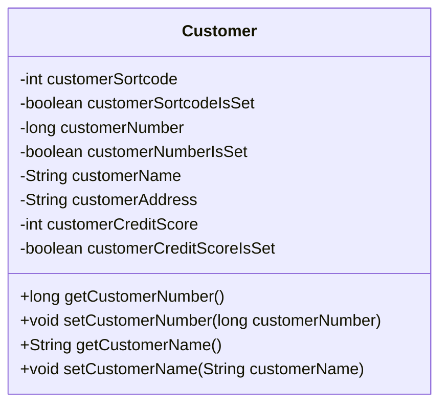

# Customer Data Management Overview

### Overview

Customer data management is a critical aspect of the application, focusing on handling and manipulating customer-related information. The `Customer` class is central to this process, providing a structured way to manage customer data.

### Customer Class

The `Customer` class represents customer data within the application. It includes fields such as customer number, name, address, date of birth, and credit score. These fields are used to store and retrieve customer details.

<SwmSnippet path="/src/webui/src/main/java/com/ibm/cics/cip/bankliberty/datainterfaces/CUSTOMER.java" line="13">

---

The `Customer` class is defined here, representing customer data within the application.

```java
public class CUSTOMER {
	protected static CobolDatatypeFactory factory = new CobolDatatypeFactory();
	static { factory.setStringTrimDefault(false); } 
```

---

</SwmSnippet>

### Customer Fields

The `Customer` class includes several fields that store customer information. These fields are essential for managing customer data effectively.

<SwmSnippet path="/src/webui/src/main/java/com/ibm/cics/cip/bankliberty/datainterfaces/CUSTOMER.java" line="129">

---

This section shows the fields of the `Customer` class, including customer number, name, address, and credit score.

```java
	protected int customerSortcode;
	protected boolean customerSortcodeIsSet;
	protected long customerNumber;
	protected boolean customerNumberIsSet;
	protected String customerName;
	protected String customerAddress;
	protected int customerCreditScore;
	protected boolean customerCreditScoreIsSet;
```

---

</SwmSnippet>

### Customer Methods

The `Customer` class provides methods to get and set the fields, allowing for the manipulation of customer data. These methods ensure that the data is correctly formatted and aligned.

<SwmSnippet path="/src/webui/src/main/java/com/ibm/cics/cip/bankliberty/datainterfaces/CUSTOMER.java" line="188">

---

The <SwmToken path="src/webui/src/main/java/com/ibm/cics/cip/bankliberty/datainterfaces/CUSTOMER.java" pos="188:5:5" line-data="	public long getCustomerNumber() {">`getCustomerNumber`</SwmToken> method is used to retrieve the customer number.

```java
	public long getCustomerNumber() {
		if (!customerNumberIsSet) {
			customerNumber = CUSTOMER_NUMBER.getLong(byteBuffer);
			customerNumberIsSet = true;
		}
		return customerNumber;
	}
```

---

</SwmSnippet>

<SwmSnippet path="/src/webui/src/main/java/com/ibm/cics/cip/bankliberty/datainterfaces/CUSTOMER.java" line="196">

---

The <SwmToken path="src/webui/src/main/java/com/ibm/cics/cip/bankliberty/datainterfaces/CUSTOMER.java" pos="196:5:5" line-data="	public void setCustomerNumber(long customerNumber) {">`setCustomerNumber`</SwmToken> method is used to set the customer number.

```java
	public void setCustomerNumber(long customerNumber) {
		if (customerNumberIsSet && CUSTOMER_NUMBER.equals(this.customerNumber, customerNumber)) {
			return;
		}
		CUSTOMER_NUMBER.putLong(customerNumber, byteBuffer);
		this.customerNumber = customerNumber;
		customerNumberIsSet = true;
	}
```

---

</SwmSnippet>

<SwmSnippet path="/src/webui/src/main/java/com/ibm/cics/cip/bankliberty/datainterfaces/CUSTOMER.java" line="205">

---

The <SwmToken path="src/webui/src/main/java/com/ibm/cics/cip/bankliberty/datainterfaces/CUSTOMER.java" pos="205:5:5" line-data="	public String getCustomerName() {">`getCustomerName`</SwmToken> method is used to retrieve the customer name.

```java
	public String getCustomerName() {
		if (customerName == null) {
			customerName = CUSTOMER_NAME.getString(byteBuffer);
		}
		return customerName;
	}
```

---

</SwmSnippet>

<SwmSnippet path="/src/webui/src/main/java/com/ibm/cics/cip/bankliberty/datainterfaces/CUSTOMER.java" line="212">

---

The <SwmToken path="src/webui/src/main/java/com/ibm/cics/cip/bankliberty/datainterfaces/CUSTOMER.java" pos="212:5:5" line-data="	public void setCustomerName(String customerName) {">`setCustomerName`</SwmToken> method is used to set the customer name.

```java
	public void setCustomerName(String customerName) {
		if (CUSTOMER_NAME.equals(this.customerName, customerName)) {
			return;
		}
		CUSTOMER_NAME.putString(customerName, byteBuffer);
		this.customerName = customerName;
	}
```

---

</SwmSnippet>



&nbsp;

*This is an auto-generated document by Swimm 🌊 and has not yet been verified by a human*

<SwmMeta version="3.0.0" repo-id="Z2l0aHViJTNBJTNBY2ljcy1iYW5raW5nLXNhbXBsZS1hcHBsaWNhdGlvbi1jYnNhLUlCTS1EZW1vJTNBJTNBU3dpbW0tRGVtbw==" repo-name="cics-banking-sample-application-cbsa-IBM-Demo"></SwmMeta>
