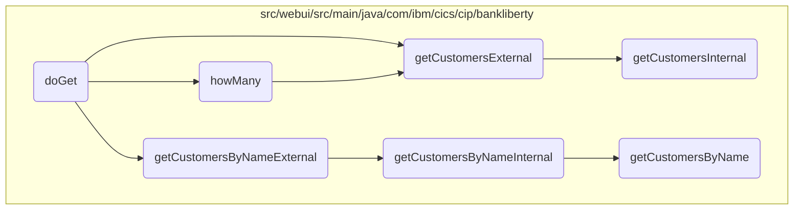

# Customer Data Retrieval Flow

In this document, we will explain the process of retrieving customer data based on various filters. The process involves checking if the filter is empty, retrieving all customers, retrieving customers by number, and retrieving customers by name.

The flow is straightforward and involves checking if the filter is empty, retrieving all customers if it is, retrieving customers by number if the filter specifies a customer number, and retrieving customers by name if the filter specifies a customer name.

## Flow drill down



<SwmSnippet path="/src/webui/src/main/java/com/ibm/cics/cip/bankliberty/webui/data_access/CustomerList.java" line="149">

---

### Handling customer data retrieval based on different filters

The <SwmToken path="src/webui/src/main/java/com/ibm/cics/cip/bankliberty/webui/data_access/CustomerList.java" pos="149:5:5" line-data="	public void doGet(int limit, int offset, String filter) throws IOException">`doGet`</SwmToken> method handles customer data retrieval based on different filters. It first checks if the filter is empty, then retrieves all customers. If the filter specifies a customer number, it retrieves the customer with that number. If the filter specifies a customer name, it retrieves customers matching that name. Finally, it processes the response to extract customer details and adds them to the list of customers.

```java
	public void doGet(int limit, int offset, String filter) throws IOException
	{

		CustomerResource myCustomerResource = new CustomerResource();

		Response myCustomerResponse = null;

		String myCustomerString = null;

		try
		{
			if (filter.length() == 0)
			{

				myCustomerResponse = myCustomerResource
						.getCustomersExternal(limit, offset, false);

			}
			if (filter.startsWith(" AND CUSTOMER_NUMBER = "))
			{

```

---

</SwmSnippet>

<SwmSnippet path="/src/webui/src/main/java/com/ibm/cics/cip/bankliberty/webui/data_access/CustomerList.java" line="67">

---

#### Counting customers based on filter

The <SwmToken path="src/webui/src/main/java/com/ibm/cics/cip/bankliberty/webui/data_access/CustomerList.java" pos="67:5:5" line-data="	private void howMany(String filter)">`howMany`</SwmToken> method counts the number of customers based on the provided filter. It checks if the filter specifies a customer name or number and retrieves the count accordingly. If no filter is provided, it retrieves the total count of customers.

```java
	private void howMany(String filter)
	{

		CustomerResource myCustomerResource = new CustomerResource();
		Response myCustomerResponse = null;

		// 0123456789012345678901234

		try
		{
			if (filter.startsWith(" AND CUSTOMER_NAME like '"))
			{

				String customerNameFilter = filter.substring(25);
				customerNameFilter = customerNameFilter.substring(0,
						customerNameFilter.length() - 1);

				myCustomerResponse = myCustomerResource
						.getCustomersByNameExternal(customerNameFilter, 0, 0,
								true);
				String myCustomersString = myCustomerResponse.getEntity()
```

---

</SwmSnippet>

<SwmSnippet path="/src/webui/src/main/java/com/ibm/cics/cip/bankliberty/api/json/CustomerResource.java" line="940">

---

#### Retrieving customers externally

The <SwmToken path="src/webui/src/main/java/com/ibm/cics/cip/bankliberty/api/json/CustomerResource.java" pos="942:5:5" line-data="	public Response getCustomersExternal(@QueryParam(&quot;limit&quot;) Integer limit,">`getCustomersExternal`</SwmToken> method retrieves customer data externally. It calls the <SwmToken path="src/webui/src/main/java/com/ibm/cics/cip/bankliberty/api/json/CustomerResource.java" pos="954:7:7" line-data="		Response myResponse = getCustomersInternal(limit, offset,">`getCustomersInternal`</SwmToken> method to fetch the data and then terminates the data access session.

```java
	@GET
	@Produces(MediaType.APPLICATION_JSON)
	public Response getCustomersExternal(@QueryParam("limit") Integer limit,
			@QueryParam("offset") Integer offset,
			@QueryParam("countOnly") Boolean countOnly)
	{
		logger.entering(this.getClass().getName(),
				"getCustomersExternal(Integer limit, Integer offset, Boolean countOnly) "
						+ limit + " " + offset + " " + countOnly);
		boolean countOnlyReal = false;
		if (countOnly != null)
		{
			countOnlyReal = countOnly.booleanValue();
		}
		Response myResponse = getCustomersInternal(limit, offset,
				countOnlyReal);
		HBankDataAccess myHBankDataAccess = new HBankDataAccess();
		myHBankDataAccess.terminate();
		logger.exiting(this.getClass().getName(),
				"getCustomersExternal(Integer limit, Integer offset, Boolean countOnly)",
				myResponse);
```

---

</SwmSnippet>

<SwmSnippet path="/src/webui/src/main/java/com/ibm/cics/cip/bankliberty/api/json/CustomerResource.java" line="1057">

---

#### Retrieving customers by name externally

The <SwmToken path="src/webui/src/main/java/com/ibm/cics/cip/bankliberty/api/json/CustomerResource.java" pos="1060:5:5" line-data="	public Response getCustomersByNameExternal(@QueryParam(&quot;name&quot;) String name,">`getCustomersByNameExternal`</SwmToken> method retrieves customers by name externally. It calls the <SwmToken path="src/webui/src/main/java/com/ibm/cics/cip/bankliberty/api/json/CustomerResource.java" pos="1099:5:5" line-data="	public Response getCustomersByNameInternal(@QueryParam(&quot;name&quot;) String name,">`getCustomersByNameInternal`</SwmToken> method to fetch the data based on the provided name, limit, and offset.

```java
	@GET
	@Path("/name")
	@Produces(MediaType.APPLICATION_JSON)
	public Response getCustomersByNameExternal(@QueryParam("name") String name,
			@QueryParam("limit") Integer limit,
			@QueryParam("offset") Integer offset,
			@QueryParam("countOnly") Boolean countOnly)
	{
		logger.entering(this.getClass().getName(),
				"getCustomersByNameExternal(String name, Integer limit, Integer offset, Boolean countOnly) "
						+ name + " " + limit + " " + offset + " " + countOnly);

		boolean countOnlyReal = false;
		if (countOnly != null)
		{
			countOnlyReal = countOnly.booleanValue();
		}
		if (offset == null)
		{
			offset = 0;
		}
```

---

</SwmSnippet>

<SwmSnippet path="/src/webui/src/main/java/com/ibm/cics/cip/bankliberty/api/json/CustomerResource.java" line="1099">

---

#### Retrieving customers by name internally

The <SwmToken path="src/webui/src/main/java/com/ibm/cics/cip/bankliberty/api/json/CustomerResource.java" pos="1099:5:5" line-data="	public Response getCustomersByNameInternal(@QueryParam(&quot;name&quot;) String name,">`getCustomersByNameInternal`</SwmToken> method retrieves customers by name internally. It fetches the data from the VSAM customer database and constructs a JSON response with the customer details.

```java
	public Response getCustomersByNameInternal(@QueryParam("name") String name,
			@QueryParam("limit") int limit, @QueryParam("offset") int offset,
			boolean countOnly)
	{
		logger.entering(this.getClass().getName(),
				"getCustomersByNameInternal(String name, Integer limit, Integer offset, Boolean countOnly) "
						+ name + " " + limit + " " + offset + " " + countOnly);
		Integer sortCode = this.getSortCode();

		JSONObject response = new JSONObject();
		JSONArray customers = null;

		if (countOnly)
		{
			com.ibm.cics.cip.bankliberty.web.vsam.Customer vsamCustomer = new com.ibm.cics.cip.bankliberty.web.vsam.Customer();
			long numberOfCustomers = 0;
			numberOfCustomers = vsamCustomer
					.getCustomersByNameCountOnly(sortCode.intValue(), name);
			response.put(JSON_NUMBER_OF_CUSTOMERS, numberOfCustomers);
		}
		else
```

---

</SwmSnippet>

<SwmSnippet path="/src/webui/src/main/java/com/ibm/cics/cip/bankliberty/api/json/CustomerResource.java" line="965">

---

#### Retrieving customers internally

The <SwmToken path="src/webui/src/main/java/com/ibm/cics/cip/bankliberty/api/json/CustomerResource.java" pos="965:5:5" line-data="	public Response getCustomersInternal(@QueryParam(&quot;limit&quot;) Integer limit,">`getCustomersInternal`</SwmToken> method retrieves customer data internally. It fetches the data from the VSAM customer database and constructs a JSON response with the customer details.

```java
	public Response getCustomersInternal(@QueryParam("limit") Integer limit,
			@QueryParam("offset") Integer offset, boolean countOnly)
	{
		logger.entering(this.getClass().getName(),
				"getCustomersInternal(Integer limit, Integer offset, Boolean countOnly) "
						+ limit + " " + offset + " " + countOnly);
		Integer sortCode = this.getSortCode();

		JSONObject response = new JSONObject();
		JSONArray customers = null;

		if (offset == null)
		{
			offset = 0;
		}

		if (limit == null)
		{
			limit = 250000;
		}

```

---

</SwmSnippet>

<SwmSnippet path="/src/webui/src/main/java/com/ibm/cics/cip/bankliberty/web/vsam/Customer.java" line="1118">

---

#### Retrieving customers by name from VSAM

The <SwmToken path="src/webui/src/main/java/com/ibm/cics/cip/bankliberty/web/vsam/Customer.java" pos="1118:7:7" line-data="	public Customer[] getCustomersByName(int sortCode, int limit, int offset,">`getCustomersByName`</SwmToken> method retrieves customers by name from the VSAM customer database. It iterates through the records, filters them based on the provided name, and constructs an array of customer objects.

```java
	public Customer[] getCustomersByName(int sortCode, int limit, int offset,
			String name)
	{
		logger.entering(this.getClass().getName(),
				GET_CUSTOMERS_BY_NAME_WITH_OFFSET_AND_LIMIT);
		Customer[] temp = new Customer[1000000];

		int stored = 0;

		customerFile.setName(FILENAME);

		myCustomer = new CUSTOMER();

		holder = new RecordHolder();
		keyHolder = new KeyHolder();
		byte[] key = buildKey(sortCode, 0);

		// We need to convert the key to EBCDIC
		String keyString = new String(key);
		try
		{
```

---

</SwmSnippet>

&nbsp;

*This is an auto-generated document by Swimm 🌊 and has not yet been verified by a human*

<SwmMeta version="3.0.0" repo-id="Z2l0aHViJTNBJTNBY2ljcy1iYW5raW5nLXNhbXBsZS1hcHBsaWNhdGlvbi1jYnNhLUlCTS1EZW1vJTNBJTNBU3dpbW0tRGVtbw==" repo-name="cics-banking-sample-application-cbsa-IBM-Demo"></SwmMeta>
