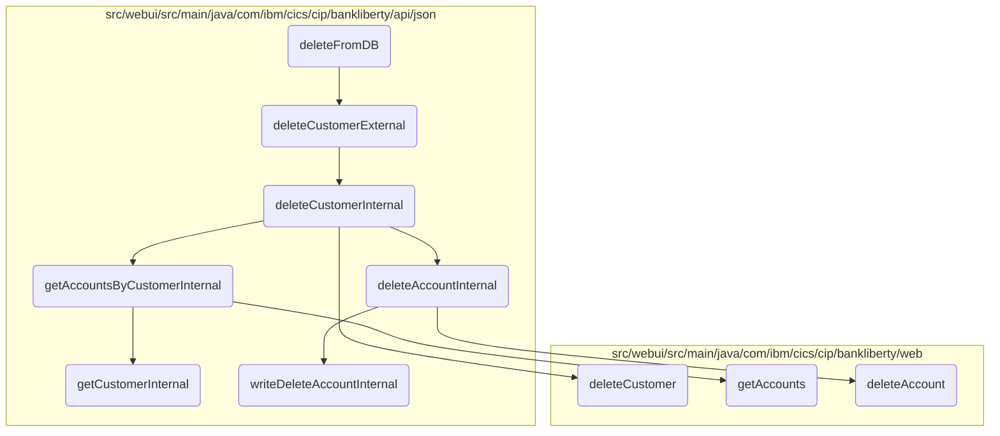

# Customer Deletion Process

In this document, we will explain the process of deleting a customer and their associated accounts from the database. The process involves multiple steps, including initiating the deletion, handling external and internal requests, and ensuring all associated accounts are properly deleted.

The flow starts with initiating the customer deletion process. This involves calling an external function to handle the deletion request. The external function then calls an internal function to perform the actual deletion. The internal function first deletes all associated accounts by calling another function for each account. Once all accounts are deleted, the customer record is deleted, and the transaction is logged.

## Flow drill down



<SwmSnippet path="/src/webui/src/main/java/com/ibm/cics/cip/bankliberty/webui/data_access/Customer.java" line="220">

---

### <SwmToken path="src/webui/src/main/java/com/ibm/cics/cip/bankliberty/webui/data_access/Customer.java" pos="220:5:5" line-data="	public boolean deleteFromDB()">`deleteFromDB`</SwmToken> Function

Diving into the <SwmToken path="src/webui/src/main/java/com/ibm/cics/cip/bankliberty/webui/data_access/Customer.java" pos="220:5:5" line-data="	public boolean deleteFromDB()">`deleteFromDB`</SwmToken> function, it initiates the customer deletion process by calling <SwmToken path="src/webui/src/main/java/com/ibm/cics/cip/bankliberty/webui/data_access/Customer.java" pos="224:9:9" line-data="		Response myCustomerResponse = myCustomerResource.deleteCustomerExternal(">`deleteCustomerExternal`</SwmToken> and handles the response to update the customer details if the deletion is successful.

```java
	public boolean deleteFromDB()
	{
		CustomerResource myCustomerResource = new CustomerResource();

		Response myCustomerResponse = myCustomerResource.deleteCustomerExternal(
				Long.parseLong(this.getCustomerNumber()));

		String myCustomerString = null;
		JSONObject myCustomer = null;

		if (myCustomerResponse.getStatus() == 200)
		{
			myCustomerString = myCustomerResponse.getEntity().toString();
			try
			{
				myCustomer = JSONObject.parse(myCustomerString);
			}
			catch (IOException e)
			{
				logger.log(Level.SEVERE, e::toString);

```

---

</SwmSnippet>

<SwmSnippet path="/src/webui/src/main/java/com/ibm/cics/cip/bankliberty/api/json/CustomerResource.java" line="547">

---

### <SwmToken path="src/webui/src/main/java/com/ibm/cics/cip/bankliberty/api/json/CustomerResource.java" pos="550:5:5" line-data="	public Response deleteCustomerExternal(@PathParam(JSON_ID) Long id)">`deleteCustomerExternal`</SwmToken> Function

The <SwmToken path="src/webui/src/main/java/com/ibm/cics/cip/bankliberty/api/json/CustomerResource.java" pos="550:5:5" line-data="	public Response deleteCustomerExternal(@PathParam(JSON_ID) Long id)">`deleteCustomerExternal`</SwmToken> function is responsible for handling the external request to delete a customer. It calls <SwmToken path="src/webui/src/main/java/com/ibm/cics/cip/bankliberty/api/json/CustomerResource.java" pos="554:7:7" line-data="		Response myResponse = deleteCustomerInternal(id);">`deleteCustomerInternal`</SwmToken> to perform the actual deletion and then terminates the data access session.

```java
	@DELETE
	@Path("/{id}")
	@Produces(MediaType.APPLICATION_JSON)
	public Response deleteCustomerExternal(@PathParam(JSON_ID) Long id)
	{
		logger.entering(this.getClass().getName(),
				"deleteCustomerExtnernal(Long id) for customerNumber " + id);
		Response myResponse = deleteCustomerInternal(id);
		HBankDataAccess myHBankDataAccess = new HBankDataAccess();
		myHBankDataAccess.terminate();
		logger.exiting(this.getClass().getName(),
				"deleteCustomerExternal(Long id)", myResponse);
		return myResponse;
	}
```

---

</SwmSnippet>

<SwmSnippet path="/src/webui/src/main/java/com/ibm/cics/cip/bankliberty/api/json/CustomerResource.java" line="563">

---

### <SwmToken path="src/webui/src/main/java/com/ibm/cics/cip/bankliberty/api/json/CustomerResource.java" pos="563:5:5" line-data="	public Response deleteCustomerInternal(Long id)">`deleteCustomerInternal`</SwmToken> Function

The <SwmToken path="src/webui/src/main/java/com/ibm/cics/cip/bankliberty/api/json/CustomerResource.java" pos="563:5:5" line-data="	public Response deleteCustomerInternal(Long id)">`deleteCustomerInternal`</SwmToken> function performs the core logic of deleting a customer. It first deletes all associated accounts by calling <SwmToken path="src/webui/src/main/java/com/ibm/cics/cip/bankliberty/api/json/AccountsResource.java" pos="1241:5:5" line-data="	public Response deleteAccountInternal(Long accountNumber)">`deleteAccountInternal`</SwmToken> for each account. If successful, it proceeds to delete the customer record and logs the transaction.

```java
	public Response deleteCustomerInternal(Long id)
	{
		logger.entering(this.getClass().getName(),
				"deleteCustomerInternal(Long id) for customerNumber " + id);

		Integer sortCode = this.getSortCode();

		JSONObject response = new JSONObject();

		if (id.longValue() < 0)
		{
			// Customer number cannot be negative
			response.put(JSON_ERROR_MSG, "Customer number cannot be negative");
			Response myResponse = Response.status(404)
					.entity(response.toString()).build();
			logger.log(Level.WARNING,
					() -> "Customer number supplied was negative in deleteCustomerInternal()");
			logger.exiting(this.getClass().getName(),
					DELETE_CUSTOMER_INTERNAL_EXIT, myResponse);
			return myResponse;
		}
```

---

</SwmSnippet>

<SwmSnippet path="/src/webui/src/main/java/com/ibm/cics/cip/bankliberty/api/json/AccountsResource.java" line="1241">

---

### <SwmToken path="src/webui/src/main/java/com/ibm/cics/cip/bankliberty/api/json/AccountsResource.java" pos="1241:5:5" line-data="	public Response deleteAccountInternal(Long accountNumber)">`deleteAccountInternal`</SwmToken> Function

The <SwmToken path="src/webui/src/main/java/com/ibm/cics/cip/bankliberty/api/json/AccountsResource.java" pos="1241:5:5" line-data="	public Response deleteAccountInternal(Long accountNumber)">`deleteAccountInternal`</SwmToken> function handles the deletion of individual accounts associated with the customer. It ensures that each account is properly deleted and logs the transaction.

```java
	public Response deleteAccountInternal(Long accountNumber)
	{
		logger.entering(this.getClass().getName(), DELETE_ACCOUNT);
		Response myResponse = null;

		JSONObject response = new JSONObject();

		Integer sortCode = this.getSortCode();

		com.ibm.cics.cip.bankliberty.web.db2.Account db2Account = new Account();

		db2Account = db2Account.deleteAccount(accountNumber.intValue(),
				sortCode.intValue());
		if (db2Account != null)
		{
			response.put(JSON_SORT_CODE, db2Account.getSortcode().trim());
			response.put("id", db2Account.getAccountNumber());
			response.put(JSON_CUSTOMER_NUMBER, db2Account.getCustomerNumber());
			response.put(JSON_ACCOUNT_TYPE, db2Account.getType().trim());
			response.put(JSON_AVAILABLE_BALANCE,
					BigDecimal.valueOf(db2Account.getAvailableBalance()));
```

---

</SwmSnippet>

&nbsp;

*This is an auto-generated document by Swimm 🌊 and has not yet been verified by a human*

<SwmMeta version="3.0.0" repo-id="Z2l0aHViJTNBJTNBY2ljcy1iYW5raW5nLXNhbXBsZS1hcHBsaWNhdGlvbi1jYnNhLUlCTS1EZW1vJTNBJTNBU3dpbW0tRGVtbw==" repo-name="cics-banking-sample-application-cbsa-IBM-Demo"></SwmMeta>
