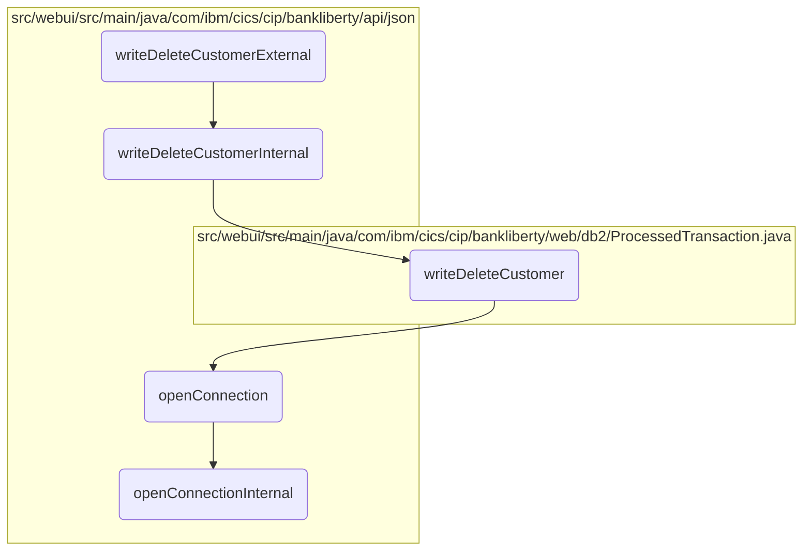

# Deleting a Customer Record Flow

In this document, we will explain the process of deleting a customer record. The process involves several steps including initiating the deletion, handling internal logic, performing the actual deletion in the database, and ensuring a connection to the database is established.

The flow starts with initiating the deletion process by receiving customer details. Then, the internal logic processes these details and calls the method to perform the actual deletion in the database. Before executing the deletion query, a connection to the database is established. If a new connection is needed, it retrieves the data source and sets up the connection parameters.

## Flow drill down



<SwmSnippet path="/src/webui/src/main/java/com/ibm/cics/cip/bankliberty/api/json/ProcessedTransactionResource.java" line="339">

---

### Deleting a Customer Record

First, the <SwmToken path="src/webui/src/main/java/com/ibm/cics/cip/bankliberty/api/json/ProcessedTransactionResource.java" pos="343:5:5" line-data="	public Response writeDeleteCustomerExternal(">`writeDeleteCustomerExternal`</SwmToken> method is called to initiate the deletion process. It receives the customer details and calls <SwmToken path="src/webui/src/main/java/com/ibm/cics/cip/bankliberty/api/json/ProcessedTransactionResource.java" pos="346:7:7" line-data="		Response myResponse = writeDeleteCustomerInternal(myDeletedCustomer);">`writeDeleteCustomerInternal`</SwmToken> to handle the internal logic.

```java
	@POST
	@Produces("application/json")
	@Consumes(MediaType.APPLICATION_JSON)
	@Path("/deleteCustomer")
	public Response writeDeleteCustomerExternal(
			ProcessedTransactionDeleteCustomerJSON myDeletedCustomer)
	{
		Response myResponse = writeDeleteCustomerInternal(myDeletedCustomer);
		HBankDataAccess myHBankDataAccess = new HBankDataAccess();
		myHBankDataAccess.terminate();
		return myResponse;
	}
```

---

</SwmSnippet>

<SwmSnippet path="/src/webui/src/main/java/com/ibm/cics/cip/bankliberty/api/json/ProcessedTransactionResource.java" line="353">

---

#### Internal Deletion Logic

Next, the <SwmToken path="src/webui/src/main/java/com/ibm/cics/cip/bankliberty/api/json/ProcessedTransactionResource.java" pos="353:5:5" line-data="	public Response writeDeleteCustomerInternal(">`writeDeleteCustomerInternal`</SwmToken> method processes the customer details and calls the <SwmToken path="src/webui/src/main/java/com/ibm/cics/cip/bankliberty/api/json/ProcessedTransactionResource.java" pos="358:6:6" line-data="		if (myProcessedTransactionDB2.writeDeleteCustomer(">`writeDeleteCustomer`</SwmToken> method to perform the actual deletion in the database.

```java
	public Response writeDeleteCustomerInternal(
			ProcessedTransactionDeleteCustomerJSON myDeletedCustomer)
	{
		com.ibm.cics.cip.bankliberty.web.db2.ProcessedTransaction myProcessedTransactionDB2 = new com.ibm.cics.cip.bankliberty.web.db2.ProcessedTransaction();

		if (myProcessedTransactionDB2.writeDeleteCustomer(
				myDeletedCustomer.getSortCode(),
				myDeletedCustomer.getAccountNumber(), 0.00,
				myDeletedCustomer.getCustomerDOB(),
				myDeletedCustomer.getCustomerName(),
				myDeletedCustomer.getCustomerNumber()))
		{
			return Response.ok().build();
		}
		else
		{
			return Response.serverError().build();
		}

	}
```

---

</SwmSnippet>

<SwmSnippet path="/src/webui/src/main/java/com/ibm/cics/cip/bankliberty/web/db2/ProcessedTransaction.java" line="628">

---

#### Database Deletion

Then, the <SwmToken path="src/webui/src/main/java/com/ibm/cics/cip/bankliberty/web/db2/ProcessedTransaction.java" pos="628:5:5" line-data="	public boolean writeDeleteCustomer(String sortCode2, String accountNumber,">`writeDeleteCustomer`</SwmToken> method constructs the SQL query to delete the customer record from the database. It formats the customer details and executes the query.

```java
	public boolean writeDeleteCustomer(String sortCode2, String accountNumber,
			double amountWhichWillAlwaysBeZero, Date customerDOB,
			String customerName, String customerNumber)
	{
		logger.entering(this.getClass().getName(), WRITE_DELETE_CUSTOMER);

		sortOutDateTimeTaskString();
		String customerDOBString = sortOutCustomerDOB(customerDOB);
		String deleteCustomerDescription = "";

		StringBuilder myStringBuilder = new StringBuilder();
		for (int z = sortCode2.length(); z < 6; z++)
		{
			myStringBuilder = myStringBuilder.append("0");
		}
		myStringBuilder.append(sortCode2);

		
		deleteCustomerDescription = deleteCustomerDescription.concat(myStringBuilder.toString());
		
		deleteCustomerDescription = deleteCustomerDescription
```

---

</SwmSnippet>

<SwmSnippet path="/src/webui/src/main/java/com/ibm/cics/cip/bankliberty/api/json/HBankDataAccess.java" line="69">

---

#### Opening Database Connection

Moving to the <SwmToken path="src/webui/src/main/java/com/ibm/cics/cip/bankliberty/api/json/HBankDataAccess.java" pos="69:5:5" line-data="	protected void openConnection()">`openConnection`</SwmToken> method, it ensures that a connection to the <SwmToken path="src/webui/src/main/java/com/ibm/cics/cip/bankliberty/api/json/HBankDataAccess.java" pos="71:13:13" line-data="		// Open a connection to the DB2 database">`DB2`</SwmToken> database is established before executing the deletion query.

```java
	protected void openConnection()
	{
		// Open a connection to the DB2 database
		logger.entering(this.getClass().getName(), "openConnection()");

		Integer taskNumberInteger = Task.getTask().getTaskNumber();
		String db2ConnString = DB2CONN.concat(taskNumberInteger.toString());
		logger.log(Level.FINE,
				() -> "Attempting to get DB2CONN for task number "
						+ taskNumberInteger.toString());
		this.conn = (Connection) cornedBeef.get(db2ConnString);
		if (this.conn == null)
		{
			HBankDataAccess.incrementConnCount();
			logger.log(Level.FINE,
					() -> "Attempting to create DB2CONN for task number "
							+ taskNumberInteger.toString());
			// Attempt to open a connection
			openConnectionInternal();
			logger.log(Level.FINE,
					() -> "Creation succcessful for DB2CONN for task number "
```

---

</SwmSnippet>

<SwmSnippet path="/src/webui/src/main/java/com/ibm/cics/cip/bankliberty/api/json/HBankDataAccess.java" line="162">

---

#### Establishing Internal Connection

Finally, the <SwmToken path="src/webui/src/main/java/com/ibm/cics/cip/bankliberty/api/json/HBankDataAccess.java" pos="163:3:3" line-data="	void openConnectionInternal()">`openConnectionInternal`</SwmToken> method is called if a new connection needs to be established. It retrieves the data source and sets up the connection parameters.

```java
	@SuppressWarnings("unchecked")
	void openConnectionInternal()
	{
		logger.entering(this.getClass().getName(), "openConnectionInternal");
		String jndiString = "jdbc/defaultCICSDataSource";
		Context ctx;

		try
		{
			ctx = new InitialContext();
			DataSource ds = (DataSource) ctx.lookup(jndiString);
			logger.log(Level.FINE, () -> "jndi string is " + jndiString);
			// If there is no current connection
			if (this.conn == null)
			{
				logger.log(Level.FINE,
						() -> "About to attempt to get DB2 connection");
				// Try and get a connection
				this.conn = ds.getConnection();
				this.conn.setTransactionIsolation(
						Connection.TRANSACTION_READ_UNCOMMITTED);
```

---

</SwmSnippet>

&nbsp;

*This is an auto-generated document by Swimm 🌊 and has not yet been verified by a human*

<SwmMeta version="3.0.0" repo-id="Z2l0aHViJTNBJTNBY2ljcy1iYW5raW5nLXNhbXBsZS1hcHBsaWNhdGlvbi1jYnNhLUlCTS1EZW1vJTNBJTNBU3dpbW0tRGVtbw==" repo-name="cics-banking-sample-application-cbsa-IBM-Demo"></SwmMeta>
