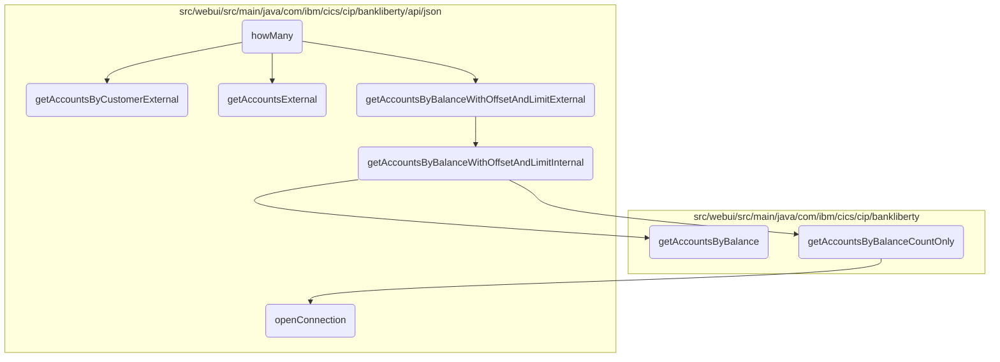
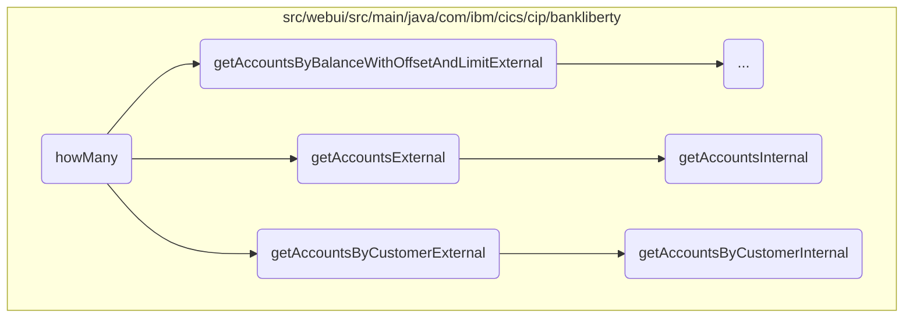
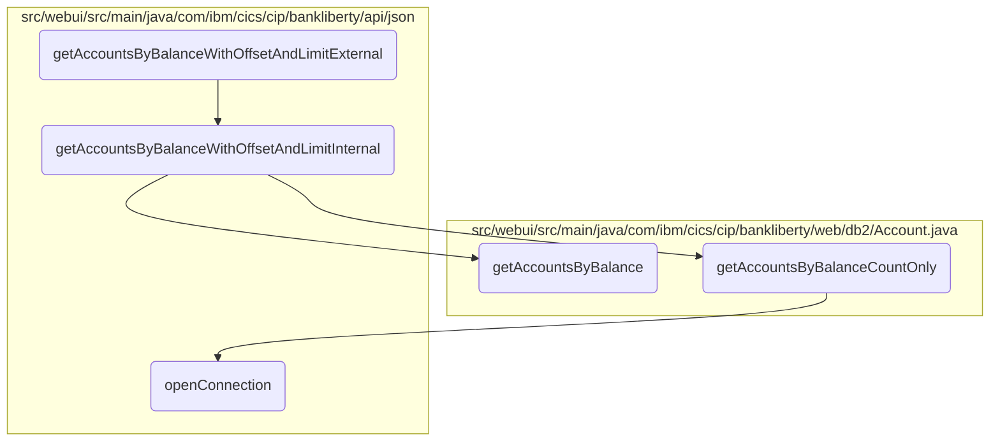
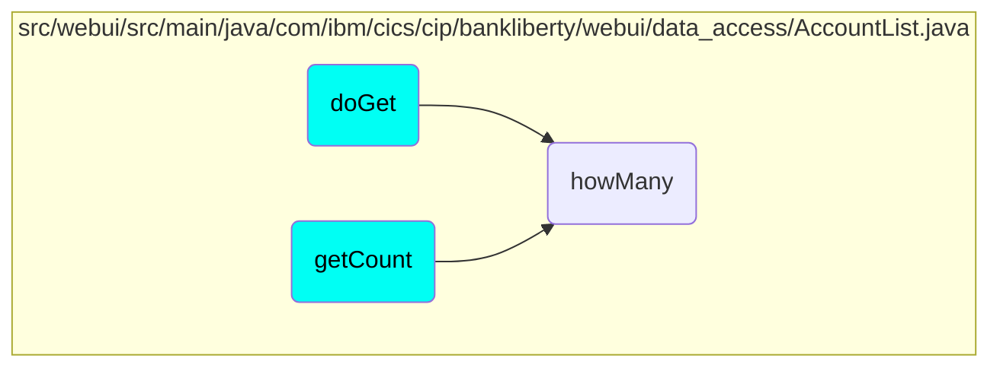

# Determining the Number of Accounts

In this document, we will explain the process of determining the number of accounts based on various filters. The process involves initializing an <SwmToken path="src/webui/src/main/java/com/ibm/cics/cip/bankliberty/webui/data_access/AccountList.java" pos="81:1:1" line-data="		AccountsResource myAccountsResource = new AccountsResource();">`AccountsResource`</SwmToken> object, calling different methods depending on the provided filter, and parsing the response to count the number of accounts.

The flow starts by initializing an <SwmToken path="src/webui/src/main/java/com/ibm/cics/cip/bankliberty/webui/data_access/AccountList.java" pos="81:1:1" line-data="		AccountsResource myAccountsResource = new AccountsResource();">`AccountsResource`</SwmToken> object. Depending on the filter provided, different methods are called to retrieve account details. For example, if the filter contains <SwmToken path="src/webui/src/main/java/com/ibm/cics/cip/bankliberty/webui/data_access/AccountList.java" pos="87:11:11" line-data="			if (filter.contains(&quot;AND ACCOUNT_AVAILABLE_BALANCE&quot;))">`ACCOUNT_AVAILABLE_BALANCE`</SwmToken>, it retrieves accounts based on balance. If the filter contains <SwmToken path="src/webui/src/main/java/com/ibm/cics/cip/bankliberty/webui/data_access/AccountList.java" pos="78:5:5" line-data="		// AND ACCOUNT_NUMBER = 0000000024">`ACCOUNT_NUMBER`</SwmToken>, it retrieves accounts based on account number. If the filter contains <SwmToken path="src/webui/src/main/java/com/ibm/cics/cip/bankliberty/webui/data_access/AccountList.java" pos="79:5:5" line-data="		// AND ACCOUNT_CUSTOMER_NUMBER">`ACCOUNT_CUSTOMER_NUMBER`</SwmToken>, it retrieves accounts based on customer number. If no filter is provided, it retrieves all accounts. Finally, the response is parsed to count the number of accounts.

Here is a high level diagram of the flow, showing only the most important functions:



## Flow drill down

First, we'll zoom into this section of the flow:



<SwmSnippet path="/src/webui/src/main/java/com/ibm/cics/cip/bankliberty/webui/data_access/AccountList.java" line="75">

---

### <SwmToken path="src/webui/src/main/java/com/ibm/cics/cip/bankliberty/webui/data_access/AccountList.java" pos="75:5:5" line-data="	public int howMany(String filter)">`howMany`</SwmToken> function

The <SwmToken path="src/webui/src/main/java/com/ibm/cics/cip/bankliberty/webui/data_access/AccountList.java" pos="75:5:5" line-data="	public int howMany(String filter)">`howMany`</SwmToken> function determines the number of accounts based on various filters. It initializes an <SwmToken path="src/webui/src/main/java/com/ibm/cics/cip/bankliberty/webui/data_access/AccountList.java" pos="81:1:1" line-data="		AccountsResource myAccountsResource = new AccountsResource();">`AccountsResource`</SwmToken> object and uses it to call different methods depending on the filter provided. For example, if the filter contains <SwmToken path="src/webui/src/main/java/com/ibm/cics/cip/bankliberty/webui/data_access/AccountList.java" pos="87:11:11" line-data="			if (filter.contains(&quot;AND ACCOUNT_AVAILABLE_BALANCE&quot;))">`ACCOUNT_AVAILABLE_BALANCE`</SwmToken>, it calls <SwmToken path="src/webui/src/main/java/com/ibm/cics/cip/bankliberty/api/json/AccountsResource.java" pos="1465:5:5" line-data="	public Response getAccountsByBalanceWithOffsetAndLimitExternal(">`getAccountsByBalanceWithOffsetAndLimitExternal`</SwmToken>. If the filter contains <SwmToken path="src/webui/src/main/java/com/ibm/cics/cip/bankliberty/webui/data_access/AccountList.java" pos="78:5:5" line-data="		// AND ACCOUNT_NUMBER = 0000000024">`ACCOUNT_NUMBER`</SwmToken>, it calls <SwmToken path="src/webui/src/main/java/com/ibm/cics/cip/bankliberty/webui/data_access/AccountList.java" pos="112:2:2" line-data="						.getAccountExternal(accountNumberFilterLong);">`getAccountExternal`</SwmToken>. If the filter contains <SwmToken path="src/webui/src/main/java/com/ibm/cics/cip/bankliberty/webui/data_access/AccountList.java" pos="79:5:5" line-data="		// AND ACCOUNT_CUSTOMER_NUMBER">`ACCOUNT_CUSTOMER_NUMBER`</SwmToken>, it calls <SwmToken path="src/webui/src/main/java/com/ibm/cics/cip/bankliberty/api/json/AccountsResource.java" pos="474:5:5" line-data="	public Response getAccountsByCustomerExternal(">`getAccountsByCustomerExternal`</SwmToken>. If no filter is provided, it calls <SwmToken path="src/webui/src/main/java/com/ibm/cics/cip/bankliberty/api/json/AccountsResource.java" pos="1344:5:5" line-data="	public Response getAccountsExternal(@QueryParam(&quot;limit&quot;) Integer limit,">`getAccountsExternal`</SwmToken> to get all accounts. The function then parses the response to count the number of accounts.

```java
	public int howMany(String filter)
	{

		// AND ACCOUNT_NUMBER = 0000000024
		// AND ACCOUNT_CUSTOMER_NUMBER

		AccountsResource myAccountsResource = new AccountsResource();
		Response myAccountsResponse = null;
		this.count = 0;

		try
		{
			if (filter.contains("AND ACCOUNT_AVAILABLE_BALANCE"))
			{
				// 01234567890123456789012345678901234567890
				// AND ACCOUNT_AVAILABLE_BALANCE <= 33558.0

				String operator = filter.substring(31, 32);
				BigDecimal balance = BigDecimal
						.valueOf(Double.parseDouble(filter.substring(34)));

```

---

</SwmSnippet>

<SwmSnippet path="/src/webui/src/main/java/com/ibm/cics/cip/bankliberty/api/json/AccountsResource.java" line="471">

---

### <SwmToken path="src/webui/src/main/java/com/ibm/cics/cip/bankliberty/api/json/AccountsResource.java" pos="474:5:5" line-data="	public Response getAccountsByCustomerExternal(">`getAccountsByCustomerExternal`</SwmToken> function

The <SwmToken path="src/webui/src/main/java/com/ibm/cics/cip/bankliberty/api/json/AccountsResource.java" pos="474:5:5" line-data="	public Response getAccountsByCustomerExternal(">`getAccountsByCustomerExternal`</SwmToken> function retrieves accounts owned by a specified customer. It calls the <SwmToken path="src/webui/src/main/java/com/ibm/cics/cip/bankliberty/api/json/AccountsResource.java" pos="482:7:7" line-data="		Response myResponse = getAccountsByCustomerInternal(customerNumber);">`getAccountsByCustomerInternal`</SwmToken> function to get the account details and then terminates the <SwmToken path="src/webui/src/main/java/com/ibm/cics/cip/bankliberty/api/json/AccountsResource.java" pos="483:1:1" line-data="		HBankDataAccess myHBankDataAccess = new HBankDataAccess();">`HBankDataAccess`</SwmToken> object before returning the response.

```java
	@GET
	@Path("/retrieveByCustomerNumber/{customerNumber}")
	@Produces("application/json")
	public Response getAccountsByCustomerExternal(
			@PathParam(JSON_CUSTOMER_NUMBER) Long customerNumber,
			@QueryParam("countOnly") Boolean countOnly)
	{
		/** This will list accounts owned by a specified customer */
		logger.entering(this.getClass().getName(),
				"getAccountsByCustomerExternal(Long customerNumber, Boolean countOnly)");

		Response myResponse = getAccountsByCustomerInternal(customerNumber);
		HBankDataAccess myHBankDataAccess = new HBankDataAccess();
		myHBankDataAccess.terminate();
		logger.exiting(this.getClass().getName(),
				"getAccountsByCustomerExternal(Long customerNumber, Boolean countOnly)",
				myResponse);
		return myResponse;
	}
```

---

</SwmSnippet>

<SwmSnippet path="/src/webui/src/main/java/com/ibm/cics/cip/bankliberty/api/json/AccountsResource.java" line="1342">

---

### <SwmToken path="src/webui/src/main/java/com/ibm/cics/cip/bankliberty/api/json/AccountsResource.java" pos="1344:5:5" line-data="	public Response getAccountsExternal(@QueryParam(&quot;limit&quot;) Integer limit,">`getAccountsExternal`</SwmToken> function

The <SwmToken path="src/webui/src/main/java/com/ibm/cics/cip/bankliberty/api/json/AccountsResource.java" pos="1344:5:5" line-data="	public Response getAccountsExternal(@QueryParam(&quot;limit&quot;) Integer limit,">`getAccountsExternal`</SwmToken> function returns a fixed number of accounts based on the provided limit and offset. It calls the <SwmToken path="src/webui/src/main/java/com/ibm/cics/cip/bankliberty/api/json/AccountsResource.java" pos="1357:7:7" line-data="		Response myResponse = getAccountsInternal(limit, offset, countOnlyReal);">`getAccountsInternal`</SwmToken> function to get the account details and then terminates the <SwmToken path="src/webui/src/main/java/com/ibm/cics/cip/bankliberty/api/json/AccountsResource.java" pos="1358:1:1" line-data="		HBankDataAccess myHBankDataAccess = new HBankDataAccess();">`HBankDataAccess`</SwmToken> object before returning the response.

```java
	@GET
	@Produces("application/json")
	public Response getAccountsExternal(@QueryParam("limit") Integer limit,
			@QueryParam("offset") Integer offset,
			@QueryParam("countOnly") Boolean countOnly)
	{
		// This method returns a fixed number of accounts, up to limit "limit",
		// starting at offset "offset"
		logger.entering(this.getClass().getName(),
				"getAccountsExternal(Integer limit, Integer offset,Boolean countOnly)");
		boolean countOnlyReal = false;
		if (countOnly != null)
		{
			countOnlyReal = countOnly.booleanValue();
		}
		Response myResponse = getAccountsInternal(limit, offset, countOnlyReal);
		HBankDataAccess myHBankDataAccess = new HBankDataAccess();
		myHBankDataAccess.terminate();
		logger.exiting(this.getClass().getName(),
				"getAccountsExternal(Integer limit, Integer offset,Boolean countOnly)",
				myResponse);
```

---

</SwmSnippet>

<SwmSnippet path="/src/webui/src/main/java/com/ibm/cics/cip/bankliberty/api/json/AccountsResource.java" line="1367">

---

### <SwmToken path="src/webui/src/main/java/com/ibm/cics/cip/bankliberty/api/json/AccountsResource.java" pos="1367:5:5" line-data="	public Response getAccountsInternal(Integer limit, Integer offset,">`getAccountsInternal`</SwmToken> function

The <SwmToken path="src/webui/src/main/java/com/ibm/cics/cip/bankliberty/api/json/AccountsResource.java" pos="1367:5:5" line-data="	public Response getAccountsInternal(Integer limit, Integer offset,">`getAccountsInternal`</SwmToken> function retrieves account details from the database. It checks if only the count of accounts is needed or if the actual account details are required. If the count is needed, it calls <SwmToken path="src/webui/src/main/java/com/ibm/cics/cip/bankliberty/api/json/AccountsResource.java" pos="1398:2:2" line-data="					.getAccountsCountOnly(sortCode.intValue());">`getAccountsCountOnly`</SwmToken>. Otherwise, it retrieves the account details and constructs a JSON response with the account information.

```java
	public Response getAccountsInternal(Integer limit, Integer offset,
			boolean countOnly)
	{
		logger.entering(this.getClass().getName(),
				"getAccountsInternal(Integer limit, Integer offset,boolean countOnly)");
		Response myResponse = null;

		com.ibm.cics.cip.bankliberty.web.db2.Account db2Account = null;
		JSONObject response = new JSONObject();
		JSONArray accounts = null;
		int numberOfAccounts = 0;
		Integer sortCode = this.getSortCode();
		// We want to set a limit to try to avoid OutOfMemory Exceptions.
		// 250,000 seems a bit large
		if (limit == null)
		{
			limit = 250000;
		}
		if (limit == 0)
		{
			limit = 250000;
```

---

</SwmSnippet>

<SwmSnippet path="/src/webui/src/main/java/com/ibm/cics/cip/bankliberty/api/json/AccountsResource.java" line="492">

---

### <SwmToken path="src/webui/src/main/java/com/ibm/cics/cip/bankliberty/api/json/AccountsResource.java" pos="492:5:5" line-data="	public Response getAccountsByCustomerInternal(">`getAccountsByCustomerInternal`</SwmToken> function

The <SwmToken path="src/webui/src/main/java/com/ibm/cics/cip/bankliberty/api/json/AccountsResource.java" pos="492:5:5" line-data="	public Response getAccountsByCustomerInternal(">`getAccountsByCustomerInternal`</SwmToken> function retrieves accounts for a specific customer from the database. It first checks if the customer exists by calling <SwmToken path="src/webui/src/main/java/com/ibm/cics/cip/bankliberty/api/json/AccountsResource.java" pos="507:2:2" line-data="				.getCustomerInternal(customerNumber);">`getCustomerInternal`</SwmToken>. If the customer exists, it retrieves the account details and constructs a JSON response with the account information.

```java
	public Response getAccountsByCustomerInternal(
			@PathParam(JSON_CUSTOMER_NUMBER) Long customerNumber)
	{
		logger.entering(this.getClass().getName(),
				GET_ACCOUNTS_BY_CUSTOMER_INTERNAL);

		JSONArray accounts = null;
		Response myResponse = null;

		JSONObject response = new JSONObject();
		Integer sortCode = this.getSortCode();
		int numberOfAccounts = 0;

		CustomerResource myCustomer = new CustomerResource();
		Response customerResponse = myCustomer
				.getCustomerInternal(customerNumber);

		if (customerResponse.getStatus() != 200)
		{
			if (customerResponse.getStatus() == 404)
			{
```

---

</SwmSnippet>

Now, lets zoom into this section of the flow:



<SwmSnippet path="/src/webui/src/main/java/com/ibm/cics/cip/bankliberty/api/json/AccountsResource.java" line="1462">

---

### Handling account retrieval based on balance

First, the <SwmToken path="src/webui/src/main/java/com/ibm/cics/cip/bankliberty/api/json/AccountsResource.java" pos="1465:5:5" line-data="	public Response getAccountsByBalanceWithOffsetAndLimitExternal(">`getAccountsByBalanceWithOffsetAndLimitExternal`</SwmToken> method is called to handle the external request for retrieving accounts based on balance. It logs the entry, processes the <SwmToken path="src/webui/src/main/java/com/ibm/cics/cip/bankliberty/api/json/AccountsResource.java" pos="1470:5:5" line-data="			@QueryParam(&quot;countOnly&quot;) Boolean countOnly)">`countOnly`</SwmToken> parameter, and delegates the main logic to <SwmToken path="src/webui/src/main/java/com/ibm/cics/cip/bankliberty/api/json/AccountsResource.java" pos="1481:7:7" line-data="		Response myResponse = getAccountsByBalanceWithOffsetAndLimitInternal(">`getAccountsByBalanceWithOffsetAndLimitInternal`</SwmToken>.

```java
	@GET
	@Path("/balance")
	@Produces("application/json")
	public Response getAccountsByBalanceWithOffsetAndLimitExternal(
			@QueryParam("balance") BigDecimal balance,
			@QueryParam("operator") String operator,
			@QueryParam("offset") Integer offset,
			@QueryParam("limit") Integer limit,
			@QueryParam("countOnly") Boolean countOnly)
	{
		// return only accounts with a certain balance
		logger.entering(this.getClass().getName(),
				"getAccountsByBalanceWithOffsetAndLimitExternal(BigDecimal balance, String operator, Integer offset, Integer limit, Boolean countOnly");
		boolean countOnlyReal = false;
		if (countOnly != null)
		{
			countOnlyReal = countOnly.booleanValue();
		}

		Response myResponse = getAccountsByBalanceWithOffsetAndLimitInternal(
				balance, operator, offset, limit, countOnlyReal);
```

---

</SwmSnippet>

<SwmSnippet path="/src/webui/src/main/java/com/ibm/cics/cip/bankliberty/api/json/AccountsResource.java" line="1492">

---

Next, the <SwmToken path="src/webui/src/main/java/com/ibm/cics/cip/bankliberty/api/json/AccountsResource.java" pos="1492:5:5" line-data="	public Response getAccountsByBalanceWithOffsetAndLimitInternal(">`getAccountsByBalanceWithOffsetAndLimitInternal`</SwmToken> method validates the operator, sets default values for offset and limit, and decides whether to count only or retrieve full account details. It then calls the appropriate method in the <SwmToken path="src/webui/src/main/java/com/ibm/cics/cip/bankliberty/api/json/AccountsResource.java" pos="1374:15:15" line-data="		com.ibm.cics.cip.bankliberty.web.db2.Account db2Account = null;">`Account`</SwmToken> class to fetch the data.

```java
	public Response getAccountsByBalanceWithOffsetAndLimitInternal(
			@QueryParam("balance") BigDecimal balance,
			@QueryParam("operator") String operator,
			@QueryParam("offset") Integer offset,
			@QueryParam("limit") Integer limit, boolean countOnly)
	{
		// return only accounts with a certain balance
		logger.entering(this.getClass().getName(),
				GET_ACCOUNTS_BY_BALANCE_WITH_OFFSET_AND_LIMIT_INTERNAL);
		Response myResponse = null;
		boolean lessThan;
		if (!operator.startsWith("<") && !(operator.startsWith(">")))
		{
			JSONObject error = new JSONObject();
			error.put(JSON_ERROR_MSG, "Invalid operator, '" + operator
					+ "' only <= or >= allowed");
			logger.log(Level.WARNING, () -> "Invalid operator, '" + operator
					+ "' only <= or >= allowed");
			logger.exiting(this.getClass().getName(),
					GET_ACCOUNTS_BY_BALANCE_WITH_OFFSET_AND_LIMIT_INTERNAL,
					myResponse);
```

---

</SwmSnippet>

<SwmSnippet path="/src/webui/src/main/java/com/ibm/cics/cip/bankliberty/web/db2/Account.java" line="1084">

---

Then, the <SwmToken path="src/webui/src/main/java/com/ibm/cics/cip/bankliberty/web/db2/Account.java" pos="1084:7:7" line-data="	public Account[] getAccountsByBalance(Integer sortCode2, BigDecimal balance,">`getAccountsByBalance`</SwmToken> method in the <SwmToken path="src/webui/src/main/java/com/ibm/cics/cip/bankliberty/web/db2/Account.java" pos="1084:3:3" line-data="	public Account[] getAccountsByBalance(Integer sortCode2, BigDecimal balance,">`Account`</SwmToken> class constructs and executes the SQL query to retrieve account details based on the balance criteria. It processes the result set and returns the account data.

```java
	public Account[] getAccountsByBalance(Integer sortCode2, BigDecimal balance,
			boolean lessThan)
	{
		logger.entering(this.getClass().getName(), GET_ACCOUNTS_BY_BALANCE);
		openConnection();
		Account[] temp = new Account[250000];
		int i = 0;
		StringBuilder myStringBuilder = new StringBuilder();

		for (i = sortCode2.toString().length(); i < SORT_CODE_LENGTH; i++)
		{
			myStringBuilder.append('0');
		}

		myStringBuilder.append(sortCode2.toString());

		String sortCodeString = myStringBuilder.toString();
		String sql = "SELECT * from ACCOUNT where ACCOUNT_EYECATCHER LIKE 'ACCT' AND ACCOUNT_SORTCODE like ? ";
		if (lessThan)
		{
			sql = sql.concat(SQL_LESS_THAN);
```

---

</SwmSnippet>

<SwmSnippet path="/src/webui/src/main/java/com/ibm/cics/cip/bankliberty/web/db2/Account.java" line="1314">

---

Alternatively, if only the count of accounts is needed, the <SwmToken path="src/webui/src/main/java/com/ibm/cics/cip/bankliberty/web/db2/Account.java" pos="1314:5:5" line-data="	public int getAccountsByBalanceCountOnly(Integer sortCode2,">`getAccountsByBalanceCountOnly`</SwmToken> method constructs and executes a SQL query to count the accounts matching the balance criteria and returns the count.

```java
	public int getAccountsByBalanceCountOnly(Integer sortCode2,
			BigDecimal balance, boolean lessThan)
	{
		logger.entering(this.getClass().getName(),
				GET_ACCOUNTS_BY_BALANCE_COUNT_ONLY);

		int accountCount = 0;
		openConnection();

		String sortCodeString = padSortCode(sortCode2);
		String sql = "SELECT COUNT(*) AS ACCOUNT_COUNT from ACCOUNT where ACCOUNT_EYECATCHER LIKE 'ACCT' AND ACCOUNT_SORTCODE like ?";
		if (lessThan)
		{
			sql = sql.concat(SQL_LESS_THAN);
		}
		else
		{
			sql = sql.concat(SQL_MORE_THAN);
		}

		try (PreparedStatement stmt = conn.prepareStatement(sql);)
```

---

</SwmSnippet>

<SwmSnippet path="/src/webui/src/main/java/com/ibm/cics/cip/bankliberty/api/json/HBankDataAccess.java" line="69">

---

Finally, the <SwmToken path="src/webui/src/main/java/com/ibm/cics/cip/bankliberty/api/json/HBankDataAccess.java" pos="69:5:5" line-data="	protected void openConnection()">`openConnection`</SwmToken> method in <SwmToken path="src/webui/src/main/java/com/ibm/cics/cip/bankliberty/api/json/HBankDataAccess.java" pos="82:1:1" line-data="			HBankDataAccess.incrementConnCount();">`HBankDataAccess`</SwmToken> ensures a connection to the <SwmToken path="src/webui/src/main/java/com/ibm/cics/cip/bankliberty/api/json/HBankDataAccess.java" pos="71:13:13" line-data="		// Open a connection to the DB2 database">`DB2`</SwmToken> database is established, either by reusing an existing connection or creating a new one if necessary.

```java
	protected void openConnection()
	{
		// Open a connection to the DB2 database
		logger.entering(this.getClass().getName(), "openConnection()");

		Integer taskNumberInteger = Task.getTask().getTaskNumber();
		String db2ConnString = DB2CONN.concat(taskNumberInteger.toString());
		logger.log(Level.FINE,
				() -> "Attempting to get DB2CONN for task number "
						+ taskNumberInteger.toString());
		this.conn = (Connection) cornedBeef.get(db2ConnString);
		if (this.conn == null)
		{
			HBankDataAccess.incrementConnCount();
			logger.log(Level.FINE,
					() -> "Attempting to create DB2CONN for task number "
							+ taskNumberInteger.toString());
			// Attempt to open a connection
			openConnectionInternal();
			logger.log(Level.FINE,
					() -> "Creation succcessful for DB2CONN for task number "
```

---

</SwmSnippet>

## Where is this flow used?

This flow is used multiple times in the codebase as represented in the following diagram:



&nbsp;

*This is an auto-generated document by Swimm 🌊 and has not yet been verified by a human*

<SwmMeta version="3.0.0" repo-id="Z2l0aHViJTNBJTNBY2ljcy1iYW5raW5nLXNhbXBsZS1hcHBsaWNhdGlvbi1jYnNhLUlCTS1EZW1vJTNBJTNBU3dpbW0tRGVtbw==" repo-name="cics-banking-sample-application-cbsa-IBM-Demo"></SwmMeta>
