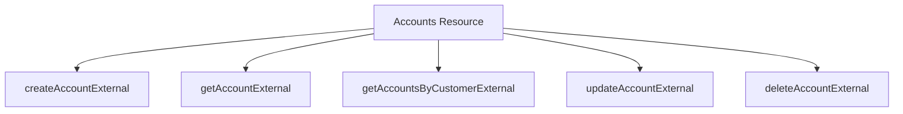

# Exploring Accounts Resource in API

## Overview

The Accounts resource is a RESTful API endpoint responsible for handling various account-related operations. It provides methods to create, retrieve, update, and delete account information. The resource is annotated with the path "/account" and extends the <SwmToken path="src/webui/src/main/java/com/ibm/cics/cip/bankliberty/api/json/AccountsResource.java" pos="372:1:1" line-data="		HBankDataAccess myHBankDataAccess = new HBankDataAccess();">`HBankDataAccess`</SwmToken> class.

## Creating an Account

The <SwmToken path="src/webui/src/main/java/com/ibm/cics/cip/bankliberty/api/json/AccountsResource.java" pos="59:14:14" line-data="	private static final String CREATE_ACCOUNT_EXTERNAL = &quot;createAccountExternal(AccountJSON account)&quot;;">`createAccountExternal`</SwmToken> method allows for the creation of new accounts by consuming and producing JSON data. This method ensures that new accounts can be added to the system efficiently.

## Retrieving Account Details

The <SwmToken path="src/webui/src/main/java/com/ibm/cics/cip/bankliberty/api/json/AccountsResource.java" pos="365:5:5" line-data="	public Response getAccountExternal(">`getAccountExternal`</SwmToken> method retrieves account details based on the account number provided in the path parameter. This method is essential for fetching specific account information.

<SwmSnippet path="/src/webui/src/main/java/com/ibm/cics/cip/bankliberty/api/json/AccountsResource.java" line="362">

---

The <SwmToken path="src/webui/src/main/java/com/ibm/cics/cip/bankliberty/api/json/AccountsResource.java" pos="365:5:5" line-data="	public Response getAccountExternal(">`getAccountExternal`</SwmToken> method is defined to retrieve account details. It uses the <SwmToken path="src/webui/src/main/java/com/ibm/cics/cip/bankliberty/api/json/AccountsResource.java" pos="362:1:2" line-data="	@GET">`@GET`</SwmToken> annotation and the <SwmToken path="src/webui/src/main/java/com/ibm/cics/cip/bankliberty/api/json/AccountsResource.java" pos="363:1:2" line-data="	@Path(&quot;/{accountNumber}&quot;)">`@Path`</SwmToken> annotation to specify the account number as a path parameter. The method logs the entry and exit points and calls <SwmToken path="src/webui/src/main/java/com/ibm/cics/cip/bankliberty/api/json/AccountsResource.java" pos="371:7:7" line-data="		Response myResponse = getAccountInternal(accountNumber);">`getAccountInternal`</SwmToken> to fetch the account details.

```java
	@GET
	@Path("/{accountNumber}")
	@Produces("application/json")
	public Response getAccountExternal(
			@PathParam("accountNumber") Long accountNumber)
	{
		/** This will list one single account of the specified number. */
		logger.entering(this.getClass().getName(),
				"getAccountExternal(Long accountNumber)");
		Response myResponse = getAccountInternal(accountNumber);
		HBankDataAccess myHBankDataAccess = new HBankDataAccess();
		myHBankDataAccess.terminate();
		logger.exiting(this.getClass().getName(),
				"getAccountExternal(Long accountNumber)", myResponse);
		return myResponse;
	}
```

---

</SwmSnippet>

## Listing Accounts by Customer

The <SwmToken path="src/webui/src/main/java/com/ibm/cics/cip/bankliberty/api/json/AccountsResource.java" pos="474:5:5" line-data="	public Response getAccountsByCustomerExternal(">`getAccountsByCustomerExternal`</SwmToken> method lists all accounts owned by a specified customer. This method is useful for retrieving all accounts associated with a particular customer.

## Updating Account Details

The <SwmToken path="src/webui/src/main/java/com/ibm/cics/cip/bankliberty/api/json/AccountsResource.java" pos="623:5:5" line-data="	public Response updateAccountExternal(@PathParam(&quot;id&quot;) Long id,">`updateAccountExternal`</SwmToken> method updates account details such as interest rates, types, and overdraft limits. This method ensures that account information remains current and accurate.

## Deleting an Account

The <SwmToken path="src/webui/src/main/java/com/ibm/cics/cip/bankliberty/api/json/AccountsResource.java" pos="1227:5:5" line-data="	public Response deleteAccountExternal(">`deleteAccountExternal`</SwmToken> method deletes an account based on the account number provided in the path parameter. This method is crucial for removing accounts from the system when they are no longer needed.



&nbsp;

*This is an auto-generated document by Swimm 🌊 and has not yet been verified by a human*

<SwmMeta version="3.0.0" repo-id="Z2l0aHViJTNBJTNBY2ljcy1iYW5raW5nLXNhbXBsZS1hcHBsaWNhdGlvbi1jYnNhLUlCTS1EZW1vJTNBJTNBU3dpbW0tRGVtbw==" repo-name="cics-banking-sample-application-cbsa-IBM-Demo"></SwmMeta>
