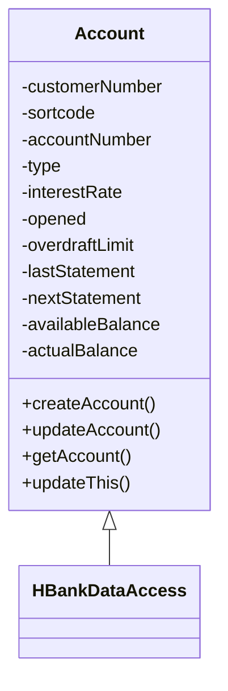

# Exploring the Account Class

## Account Class Overview

The <SwmToken path="src/webui/src/main/java/com/ibm/cics/cip/bankliberty/web/db2/Account.java" pos="23:4:4" line-data="public class Account extends HBankDataAccess">`Account`</SwmToken> class represents a bank account and extends the <SwmToken path="src/webui/src/main/java/com/ibm/cics/cip/bankliberty/web/db2/Account.java" pos="19:16:16" line-data="import com.ibm.cics.cip.bankliberty.api.json.HBankDataAccess;">`HBankDataAccess`</SwmToken> class, which provides database access functionality. It includes various fields such as <SwmToken path="src/webui/src/main/java/com/ibm/cics/cip/bankliberty/web/db2/Account.java" pos="99:5:5" line-data="	private String customerNumber;">`customerNumber`</SwmToken>, <SwmToken path="src/webui/src/main/java/com/ibm/cics/cip/bankliberty/web/db2/Account.java" pos="392:10:10" line-data="			stmt.setString(9, this.sortcode);">`sortcode`</SwmToken>, <SwmToken path="src/webui/src/main/java/com/ibm/cics/cip/bankliberty/web/db2/Account.java" pos="391:10:10" line-data="			stmt.setString(8, this.accountNumber);">`accountNumber`</SwmToken>, <SwmToken path="src/webui/src/main/java/com/ibm/cics/cip/bankliberty/web/db2/Account.java" pos="384:10:10" line-data="			stmt.setString(1, this.type);">`type`</SwmToken>, <SwmToken path="src/webui/src/main/java/com/ibm/cics/cip/bankliberty/web/db2/Account.java" pos="385:10:10" line-data="			stmt.setDouble(2, this.interestRate);">`interestRate`</SwmToken>, <SwmToken path="src/webui/src/main/java/com/ibm/cics/cip/bankliberty/web/db2/Account.java" pos="109:5:5" line-data="	private Date opened;">`opened`</SwmToken>, <SwmToken path="src/webui/src/main/java/com/ibm/cics/cip/bankliberty/web/db2/Account.java" pos="386:10:10" line-data="			stmt.setInt(3, this.overdraftLimit);">`overdraftLimit`</SwmToken>, <SwmToken path="src/webui/src/main/java/com/ibm/cics/cip/bankliberty/web/db2/Account.java" pos="387:10:10" line-data="			stmt.setString(4, this.lastStatement.toString());">`lastStatement`</SwmToken>, <SwmToken path="src/webui/src/main/java/com/ibm/cics/cip/bankliberty/web/db2/Account.java" pos="388:10:10" line-data="			stmt.setString(5, this.nextStatement.toString());">`nextStatement`</SwmToken>, <SwmToken path="src/webui/src/main/java/com/ibm/cics/cip/bankliberty/web/db2/Account.java" pos="389:10:10" line-data="			stmt.setDouble(6, this.availableBalance);">`availableBalance`</SwmToken>, and <SwmToken path="src/webui/src/main/java/com/ibm/cics/cip/bankliberty/web/db2/Account.java" pos="390:10:10" line-data="			stmt.setDouble(7, this.actualBalance);">`actualBalance`</SwmToken> to store account-related information.

## Constants and SQL Queries

The class defines several constants for SQL queries and account attributes, such as <SwmToken path="src/webui/src/main/java/com/ibm/cics/cip/bankliberty/web/db2/Account.java" pos="30:9:9" line-data="	private static final String GET_ACCOUNT = &quot;getAccount(int accountNumber, int sortCode) for account &quot;;">`GET_ACCOUNT`</SwmToken>, <SwmToken path="src/webui/src/main/java/com/ibm/cics/cip/bankliberty/web/db2/Account.java" pos="34:9:9" line-data="	private static final String GET_ACCOUNTS = &quot;getAccounts(int sortCode)&quot;;">`GET_ACCOUNTS`</SwmToken>, <SwmToken path="src/webui/src/main/java/com/ibm/cics/cip/bankliberty/web/db2/Account.java" pos="381:64:64" line-data="		String sql = &quot;UPDATE ACCOUNT SET ACCOUNT_TYPE = ? ,ACCOUNT_INTEREST_RATE = ? ,ACCOUNT_OVERDRAFT_LIMIT = ? ,ACCOUNT_LAST_STATEMENT = ? ,ACCOUNT_NEXT_STATEMENT = ? ,ACCOUNT_AVAILABLE_BALANCE = ? ,ACCOUNT_ACTUAL_BALANCE = ? WHERE ACCOUNT_NUMBER like ? AND ACCOUNT_SORTCODE like ?&quot;;">`ACCOUNT_NUMBER`</SwmToken>, and <SwmToken path="src/webui/src/main/java/com/ibm/cics/cip/bankliberty/web/db2/Account.java" pos="381:14:14" line-data="		String sql = &quot;UPDATE ACCOUNT SET ACCOUNT_TYPE = ? ,ACCOUNT_INTEREST_RATE = ? ,ACCOUNT_OVERDRAFT_LIMIT = ? ,ACCOUNT_LAST_STATEMENT = ? ,ACCOUNT_NEXT_STATEMENT = ? ,ACCOUNT_AVAILABLE_BALANCE = ? ,ACCOUNT_ACTUAL_BALANCE = ? WHERE ACCOUNT_NUMBER like ? AND ACCOUNT_SORTCODE like ?&quot;;">`ACCOUNT_TYPE`</SwmToken>. These constants are used in the methods to perform database operations related to accounts.

## Methods for Account Operations

The <SwmToken path="src/webui/src/main/java/com/ibm/cics/cip/bankliberty/web/db2/Account.java" pos="23:4:4" line-data="public class Account extends HBankDataAccess">`Account`</SwmToken> class provides multiple methods to perform operations on accounts, including creating, updating, deleting, and retrieving account information. For example, the <SwmToken path="src/webui/src/main/java/com/ibm/cics/cip/bankliberty/web/db2/Account.java" pos="40:14:14" line-data="	private static final String CREATE_ACCOUNT = &quot;createAccount(AccountJSON account, Integer sortcode, boolean use NamedCounter)&quot;;">`createAccount`</SwmToken> method is used to create a new account, the <SwmToken path="src/webui/src/main/java/com/ibm/cics/cip/bankliberty/web/db2/Account.java" pos="42:14:14" line-data="	private static final String UPDATE_ACCOUNT = &quot;updateAccount(AccountJSON account)&quot;;">`updateAccount`</SwmToken> method updates existing account information, and the <SwmToken path="src/webui/src/main/java/com/ibm/cics/cip/bankliberty/web/db2/Account.java" pos="30:14:14" line-data="	private static final String GET_ACCOUNT = &quot;getAccount(int accountNumber, int sortCode) for account &quot;;">`getAccount`</SwmToken> method retrieves account details.

## Example: Updating Account Information

The <SwmToken path="src/webui/src/main/java/com/ibm/cics/cip/bankliberty/web/db2/Account.java" pos="377:5:5" line-data="	public void updateThis()">`updateThis`</SwmToken> method updates the account details in the database. This method opens a connection to the database, prepares an SQL update statement, and executes it to update the account information based on the current state of the <SwmToken path="src/webui/src/main/java/com/ibm/cics/cip/bankliberty/web/db2/Account.java" pos="23:4:4" line-data="public class Account extends HBankDataAccess">`Account`</SwmToken> object.

<SwmSnippet path="/src/webui/src/main/java/com/ibm/cics/cip/bankliberty/web/db2/Account.java" line="377">

---

The <SwmToken path="src/webui/src/main/java/com/ibm/cics/cip/bankliberty/web/db2/Account.java" pos="377:5:5" line-data="	public void updateThis()">`updateThis`</SwmToken> method in the <SwmToken path="src/webui/src/main/java/com/ibm/cics/cip/bankliberty/web/db2/Account.java" pos="23:4:4" line-data="public class Account extends HBankDataAccess">`Account`</SwmToken> class demonstrates how to update account details in the database. It prepares an SQL update statement and executes it to update the account information based on the current state of the <SwmToken path="src/webui/src/main/java/com/ibm/cics/cip/bankliberty/web/db2/Account.java" pos="23:4:4" line-data="public class Account extends HBankDataAccess">`Account`</SwmToken> object.

```java
	public void updateThis()
	{
		openConnection();

		String sql = "UPDATE ACCOUNT SET ACCOUNT_TYPE = ? ,ACCOUNT_INTEREST_RATE = ? ,ACCOUNT_OVERDRAFT_LIMIT = ? ,ACCOUNT_LAST_STATEMENT = ? ,ACCOUNT_NEXT_STATEMENT = ? ,ACCOUNT_AVAILABLE_BALANCE = ? ,ACCOUNT_ACTUAL_BALANCE = ? WHERE ACCOUNT_NUMBER like ? AND ACCOUNT_SORTCODE like ?";
		try (PreparedStatement stmt = conn.prepareStatement(sql);)
		{
			stmt.setString(1, this.type);
			stmt.setDouble(2, this.interestRate);
			stmt.setInt(3, this.overdraftLimit);
			stmt.setString(4, this.lastStatement.toString());
			stmt.setString(5, this.nextStatement.toString());
			stmt.setDouble(6, this.availableBalance);
			stmt.setDouble(7, this.actualBalance);
			stmt.setString(8, this.accountNumber);
			stmt.setString(9, this.sortcode);
			stmt.executeUpdate();
		}
		catch (SQLException e)
		{
			logger.severe(e.toString());
```

---

</SwmSnippet>



&nbsp;

*This is an auto-generated document by Swimm 🌊 and has not yet been verified by a human*

<SwmMeta version="3.0.0" repo-id="Z2l0aHViJTNBJTNBY2ljcy1iYW5raW5nLXNhbXBsZS1hcHBsaWNhdGlvbi1jYnNhLUlCTS1EZW1vJTNBJTNBU3dpbW0tRGVtbw==" repo-name="cics-banking-sample-application-cbsa-IBM-Demo"></SwmMeta>
