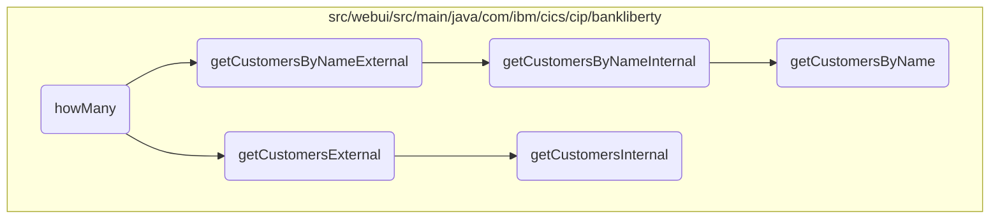
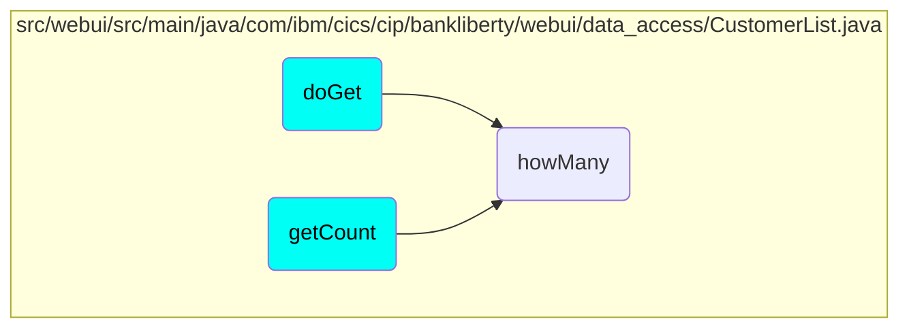

# Filtering and Counting Customers

In this document, we will explain the process of filtering and counting customers based on different criteria. The process involves checking if the filter is based on customer name, customer number, or if no filter is provided, retrieving all customers.

The flow is simple and involves three steps: filtering by customer name, filtering by customer number, and retrieving all customers if no filter is provided.

## Flow drill down



<SwmSnippet path="/src/webui/src/main/java/com/ibm/cics/cip/bankliberty/webui/data_access/CustomerList.java" line="67">

---

### Filtering and Counting Customers

The <SwmToken path="src/webui/src/main/java/com/ibm/cics/cip/bankliberty/webui/data_access/CustomerList.java" pos="67:5:5" line-data="	private void howMany(String filter)">`howMany`</SwmToken> method filters and counts customers based on the provided filter criteria. It checks if the filter is based on customer name, customer number, or if no filter is provided, it retrieves all customers.

```java
	private void howMany(String filter)
	{

		CustomerResource myCustomerResource = new CustomerResource();
		Response myCustomerResponse = null;

		// 0123456789012345678901234

		try
		{
			if (filter.startsWith(" AND CUSTOMER_NAME like '"))
			{

				String customerNameFilter = filter.substring(25);
				customerNameFilter = customerNameFilter.substring(0,
						customerNameFilter.length() - 1);

				myCustomerResponse = myCustomerResource
						.getCustomersByNameExternal(customerNameFilter, 0, 0,
								true);
				String myCustomersString = myCustomerResponse.getEntity()
```

---

</SwmSnippet>

<SwmSnippet path="/src/webui/src/main/java/com/ibm/cics/cip/bankliberty/webui/data_access/CustomerList.java" line="77">

---

#### Filtering by Customer Name

If the filter starts with 'AND <SwmToken path="src/webui/src/main/java/com/ibm/cics/cip/bankliberty/webui/data_access/CustomerList.java" pos="77:12:12" line-data="			if (filter.startsWith(&quot; AND CUSTOMER_NAME like &#39;&quot;))">`CUSTOMER_NAME`</SwmToken> like', the method extracts the customer name from the filter and calls <SwmToken path="src/webui/src/main/java/com/ibm/cics/cip/bankliberty/webui/data_access/CustomerList.java" pos="85:2:2" line-data="						.getCustomersByNameExternal(customerNameFilter, 0, 0,">`getCustomersByNameExternal`</SwmToken> to get the count of customers matching the name.

```java
			if (filter.startsWith(" AND CUSTOMER_NAME like '"))
			{

				String customerNameFilter = filter.substring(25);
				customerNameFilter = customerNameFilter.substring(0,
						customerNameFilter.length() - 1);

				myCustomerResponse = myCustomerResource
						.getCustomersByNameExternal(customerNameFilter, 0, 0,
								true);
				String myCustomersString = myCustomerResponse.getEntity()
						.toString();
				JSONObject myCustomersJSON;
				myCustomersJSON = JSONObject.parse(myCustomersString);
				long customerCount = (Long) myCustomersJSON
						.get(JSON_NUMBER_OF_CUSTOMERS);
				this.count = (int) customerCount;
			}
```

---

</SwmSnippet>

<SwmSnippet path="/src/webui/src/main/java/com/ibm/cics/cip/bankliberty/webui/data_access/CustomerList.java" line="97">

---

#### Filtering by Customer Number

If the filter starts with 'AND <SwmToken path="src/webui/src/main/java/com/ibm/cics/cip/bankliberty/webui/data_access/CustomerList.java" pos="97:12:12" line-data="			if (filter.startsWith(&quot; AND CUSTOMER_NUMBER = &quot;))">`CUSTOMER_NUMBER`</SwmToken> =', the method extracts the customer number from the filter and calls <SwmToken path="src/webui/src/main/java/com/ibm/cics/cip/bankliberty/webui/data_access/CustomerList.java" pos="103:2:2" line-data="						.getCustomerExternal(customerNumber);">`getCustomerExternal`</SwmToken> to check if a customer with that number exists.

```java
			if (filter.startsWith(" AND CUSTOMER_NUMBER = "))
			{
				String customerNumberFilter = filter.substring(23);
				Long customerNumber = Long.parseLong(customerNumberFilter);

				myCustomerResponse = myCustomerResource
						.getCustomerExternal(customerNumber);
				String myCustomersString = myCustomerResponse.getEntity()
						.toString();
				JSONObject myCustomerJSON;
				this.count = 0;
				if (myCustomerResponse.getStatus() == 200)
				{
					myCustomerJSON = JSONObject.parse(myCustomersString);
					String id = (String) myCustomerJSON.get(JSON_ID);
					if (id != null)
					{
						this.count = 1;
					}
				}
			}
```

---

</SwmSnippet>

<SwmSnippet path="/src/webui/src/main/java/com/ibm/cics/cip/bankliberty/webui/data_access/CustomerList.java" line="119">

---

#### Retrieving All Customers

If no filter is provided, the method calls <SwmToken path="src/webui/src/main/java/com/ibm/cics/cip/bankliberty/webui/data_access/CustomerList.java" pos="123:2:2" line-data="						.getCustomersExternal(250000, 0, true);">`getCustomersExternal`</SwmToken> to retrieve all customers and count them.

```java
			if (filter.length() == 0)
			{

				myCustomerResponse = myCustomerResource
						.getCustomersExternal(250000, 0, true);
				String myCustomersString = myCustomerResponse.getEntity()
						.toString();
				if (myCustomerResponse.getStatus() == 200)
				{
					JSONObject myCustomersJSON;
					myCustomersJSON = JSONObject.parse(myCustomersString);
					long customerCount = (Long) myCustomersJSON
							.get(JSON_NUMBER_OF_CUSTOMERS);
					this.count = (int) customerCount;

				}
				else
				{
					logger.log(Level.SEVERE, () -> "Error getting customers");
				}
			}
```

---

</SwmSnippet>

<SwmSnippet path="/src/webui/src/main/java/com/ibm/cics/cip/bankliberty/api/json/CustomerResource.java" line="940">

---

### External Customer Retrieval

The <SwmToken path="src/webui/src/main/java/com/ibm/cics/cip/bankliberty/api/json/CustomerResource.java" pos="942:5:5" line-data="	public Response getCustomersExternal(@QueryParam(&quot;limit&quot;) Integer limit,">`getCustomersExternal`</SwmToken> method retrieves customers based on the provided limit, offset, and <SwmToken path="src/webui/src/main/java/com/ibm/cics/cip/bankliberty/api/json/CustomerResource.java" pos="944:5:5" line-data="			@QueryParam(&quot;countOnly&quot;) Boolean countOnly)">`countOnly`</SwmToken> parameters. It calls <SwmToken path="src/webui/src/main/java/com/ibm/cics/cip/bankliberty/api/json/CustomerResource.java" pos="954:7:7" line-data="		Response myResponse = getCustomersInternal(limit, offset,">`getCustomersInternal`</SwmToken> to perform the actual retrieval.

```java
	@GET
	@Produces(MediaType.APPLICATION_JSON)
	public Response getCustomersExternal(@QueryParam("limit") Integer limit,
			@QueryParam("offset") Integer offset,
			@QueryParam("countOnly") Boolean countOnly)
	{
		logger.entering(this.getClass().getName(),
				"getCustomersExternal(Integer limit, Integer offset, Boolean countOnly) "
						+ limit + " " + offset + " " + countOnly);
		boolean countOnlyReal = false;
		if (countOnly != null)
		{
			countOnlyReal = countOnly.booleanValue();
		}
		Response myResponse = getCustomersInternal(limit, offset,
				countOnlyReal);
		HBankDataAccess myHBankDataAccess = new HBankDataAccess();
		myHBankDataAccess.terminate();
		logger.exiting(this.getClass().getName(),
				"getCustomersExternal(Integer limit, Integer offset, Boolean countOnly)",
				myResponse);
```

---

</SwmSnippet>

<SwmSnippet path="/src/webui/src/main/java/com/ibm/cics/cip/bankliberty/api/json/CustomerResource.java" line="1057">

---

### External Customer Retrieval by Name

The <SwmToken path="src/webui/src/main/java/com/ibm/cics/cip/bankliberty/api/json/CustomerResource.java" pos="1060:5:5" line-data="	public Response getCustomersByNameExternal(@QueryParam(&quot;name&quot;) String name,">`getCustomersByNameExternal`</SwmToken> method retrieves customers by name based on the provided limit, offset, and <SwmToken path="src/webui/src/main/java/com/ibm/cics/cip/bankliberty/api/json/CustomerResource.java" pos="1063:5:5" line-data="			@QueryParam(&quot;countOnly&quot;) Boolean countOnly)">`countOnly`</SwmToken> parameters. It calls <SwmToken path="src/webui/src/main/java/com/ibm/cics/cip/bankliberty/api/json/CustomerResource.java" pos="1099:5:5" line-data="	public Response getCustomersByNameInternal(@QueryParam(&quot;name&quot;) String name,">`getCustomersByNameInternal`</SwmToken> to perform the actual retrieval.

```java
	@GET
	@Path("/name")
	@Produces(MediaType.APPLICATION_JSON)
	public Response getCustomersByNameExternal(@QueryParam("name") String name,
			@QueryParam("limit") Integer limit,
			@QueryParam("offset") Integer offset,
			@QueryParam("countOnly") Boolean countOnly)
	{
		logger.entering(this.getClass().getName(),
				"getCustomersByNameExternal(String name, Integer limit, Integer offset, Boolean countOnly) "
						+ name + " " + limit + " " + offset + " " + countOnly);

		boolean countOnlyReal = false;
		if (countOnly != null)
		{
			countOnlyReal = countOnly.booleanValue();
		}
		if (offset == null)
		{
			offset = 0;
		}
```

---

</SwmSnippet>

<SwmSnippet path="/src/webui/src/main/java/com/ibm/cics/cip/bankliberty/api/json/CustomerResource.java" line="1099">

---

### Internal Customer Retrieval by Name

The <SwmToken path="src/webui/src/main/java/com/ibm/cics/cip/bankliberty/api/json/CustomerResource.java" pos="1099:5:5" line-data="	public Response getCustomersByNameInternal(@QueryParam(&quot;name&quot;) String name,">`getCustomersByNameInternal`</SwmToken> method performs the actual retrieval of customers by name. It checks if only the count is needed or retrieves the full customer details.

```java
	public Response getCustomersByNameInternal(@QueryParam("name") String name,
			@QueryParam("limit") int limit, @QueryParam("offset") int offset,
			boolean countOnly)
	{
		logger.entering(this.getClass().getName(),
				"getCustomersByNameInternal(String name, Integer limit, Integer offset, Boolean countOnly) "
						+ name + " " + limit + " " + offset + " " + countOnly);
		Integer sortCode = this.getSortCode();

		JSONObject response = new JSONObject();
		JSONArray customers = null;

		if (countOnly)
		{
			com.ibm.cics.cip.bankliberty.web.vsam.Customer vsamCustomer = new com.ibm.cics.cip.bankliberty.web.vsam.Customer();
			long numberOfCustomers = 0;
			numberOfCustomers = vsamCustomer
					.getCustomersByNameCountOnly(sortCode.intValue(), name);
			response.put(JSON_NUMBER_OF_CUSTOMERS, numberOfCustomers);
		}
		else
```

---

</SwmSnippet>

<SwmSnippet path="/src/webui/src/main/java/com/ibm/cics/cip/bankliberty/api/json/CustomerResource.java" line="965">

---

### Internal Customer Retrieval

The <SwmToken path="src/webui/src/main/java/com/ibm/cics/cip/bankliberty/api/json/CustomerResource.java" pos="965:5:5" line-data="	public Response getCustomersInternal(@QueryParam(&quot;limit&quot;) Integer limit,">`getCustomersInternal`</SwmToken> method performs the actual retrieval of customers based on the provided limit, offset, and <SwmToken path="src/webui/src/main/java/com/ibm/cics/cip/bankliberty/api/json/CustomerResource.java" pos="966:16:16" line-data="			@QueryParam(&quot;offset&quot;) Integer offset, boolean countOnly)">`countOnly`</SwmToken> parameters. It checks if only the count is needed or retrieves the full customer details.

```java
	public Response getCustomersInternal(@QueryParam("limit") Integer limit,
			@QueryParam("offset") Integer offset, boolean countOnly)
	{
		logger.entering(this.getClass().getName(),
				"getCustomersInternal(Integer limit, Integer offset, Boolean countOnly) "
						+ limit + " " + offset + " " + countOnly);
		Integer sortCode = this.getSortCode();

		JSONObject response = new JSONObject();
		JSONArray customers = null;

		if (offset == null)
		{
			offset = 0;
		}

		if (limit == null)
		{
			limit = 250000;
		}

```

---

</SwmSnippet>

<SwmSnippet path="/src/webui/src/main/java/com/ibm/cics/cip/bankliberty/web/vsam/Customer.java" line="1118">

---

### Customer Retrieval by Name

The <SwmToken path="src/webui/src/main/java/com/ibm/cics/cip/bankliberty/web/vsam/Customer.java" pos="1118:7:7" line-data="	public Customer[] getCustomersByName(int sortCode, int limit, int offset,">`getCustomersByName`</SwmToken> method retrieves customers by name from the VSAM file. It iterates through the file and filters customers based on the provided name, limit, and offset.

```java
	public Customer[] getCustomersByName(int sortCode, int limit, int offset,
			String name)
	{
		logger.entering(this.getClass().getName(),
				GET_CUSTOMERS_BY_NAME_WITH_OFFSET_AND_LIMIT);
		Customer[] temp = new Customer[1000000];

		int stored = 0;

		customerFile.setName(FILENAME);

		myCustomer = new CUSTOMER();

		holder = new RecordHolder();
		keyHolder = new KeyHolder();
		byte[] key = buildKey(sortCode, 0);

		// We need to convert the key to EBCDIC
		String keyString = new String(key);
		try
		{
```

---

</SwmSnippet>

## Where is this flow used?

This flow is used multiple times in the codebase as represented in the following diagram:



&nbsp;

*This is an auto-generated document by Swimm 🌊 and has not yet been verified by a human*

<SwmMeta version="3.0.0" repo-id="Z2l0aHViJTNBJTNBY2ljcy1iYW5raW5nLXNhbXBsZS1hcHBsaWNhdGlvbi1jYnNhLUlCTS1EZW1vJTNBJTNBU3dpbW0tRGVtbw==" repo-name="cics-banking-sample-application-cbsa-IBM-Demo"></SwmMeta>
