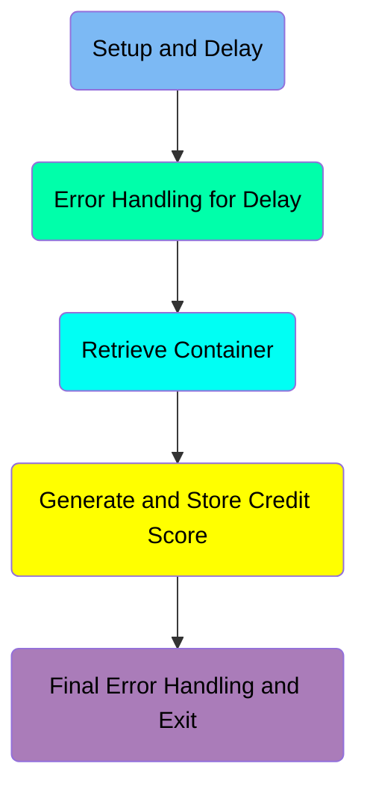
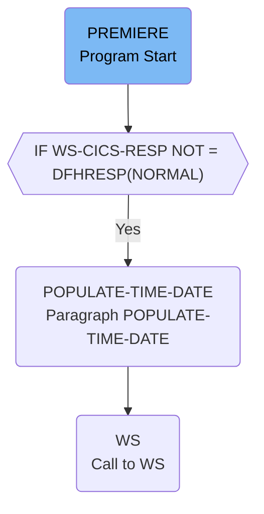
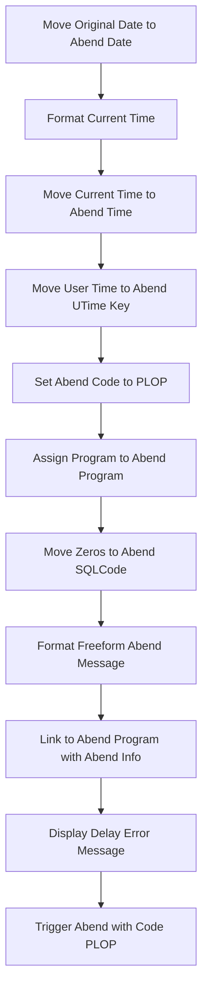
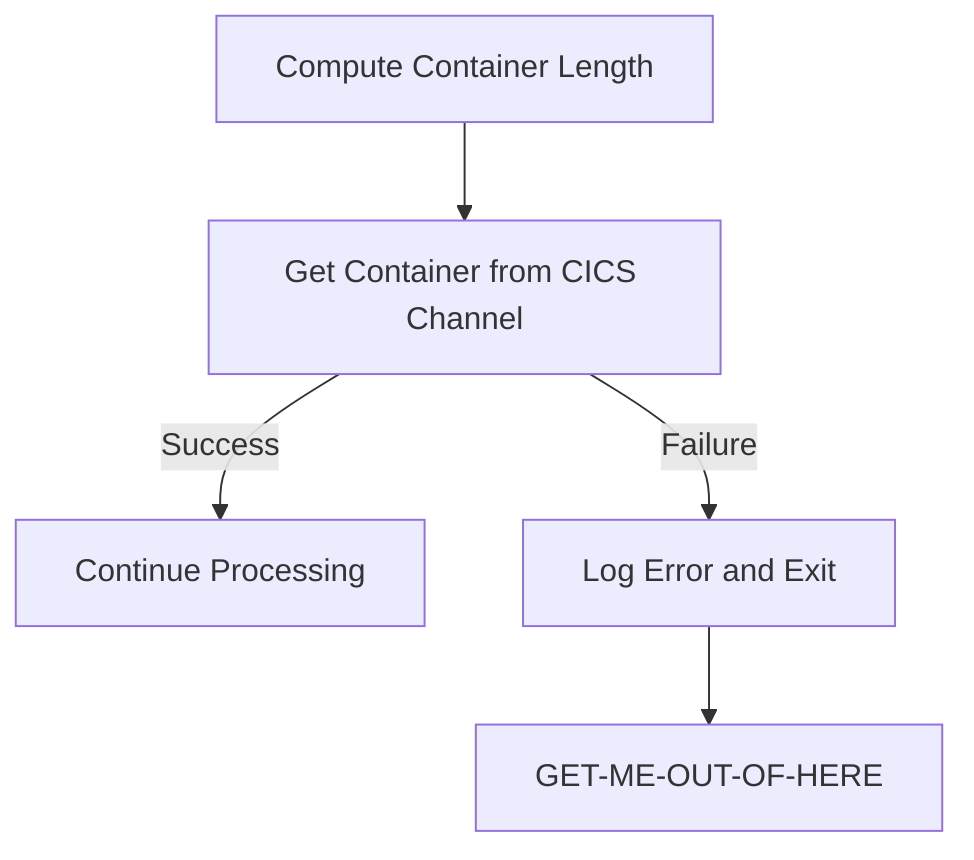
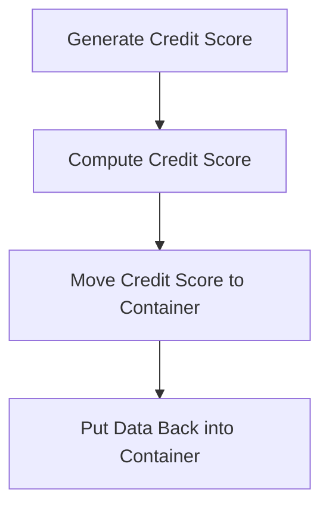
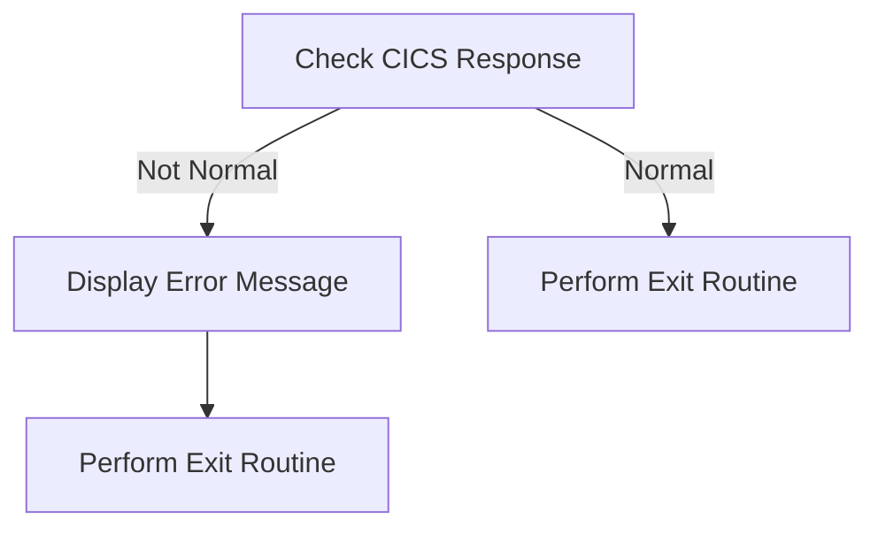

# Generating and Storing Credit Scores (CRDTAGY1)

The <SwmToken path="src/base/cobol_src/CRDTAGY1.cbl" pos="201:4:4" line-data="              DISPLAY &#39;CRDTAGY1 - UNABLE TO GET CONTAINER. RESP=&#39;">`CRDTAGY1`</SwmToken> program is responsible for generating and storing credit scores in a simulated banking application. It achieves this by setting up a delay, handling potential errors, retrieving data from a CICS container, generating a random credit score, and storing the updated data back into the container.

The <SwmToken path="src/base/cobol_src/CRDTAGY1.cbl" pos="201:4:4" line-data="              DISPLAY &#39;CRDTAGY1 - UNABLE TO GET CONTAINER. RESP=&#39;">`CRDTAGY1`</SwmToken> program starts by setting up a delay and handling any errors that might occur during this delay. It then retrieves data from a CICS container, generates a random credit score, and stores this new credit score back into the container. Finally, it checks for any errors during the storage process and exits the program gracefully.

Here is a high level diagram of the program:



## Setup and Delay



<SwmSnippet path="/src/base/cobol_src/CRDTAGY1.cbl" line="113">

---

### Generating Delay

First, the program sets up the container and channel names, and initializes the seed for the random number generator. It then computes a random delay amount between 1 and 3 seconds and executes a CICS DELAY command to introduce this delay.

```cobol
       PREMIERE SECTION.
       A010.
      *
      *    Generate a random  number of seconds between 0 & 3.
      *    This is the delay amount in seconds.
      *

           MOVE 'CIPA            ' TO WS-CONTAINER-NAME.
           MOVE 'CIPCREDCHANN    ' TO WS-CHANNEL-NAME.
           MOVE EIBTASKN           TO WS-SEED.

           COMPUTE WS-DELAY-AMT = ((3 - 1)
                            * FUNCTION RANDOM(WS-SEED)) + 1.

           EXEC CICS DELAY
                FOR SECONDS(WS-DELAY-AMT)
                RESP(WS-CICS-RESP)
                RESP2(WS-CICS-RESP2)
           END-EXEC.
```

---

</SwmSnippet>

<SwmSnippet path="/src/base/cobol_src/CRDTAGY1.cbl" line="133">

---

### Handling Delay Response

Next, the program checks if the delay response is not normal. If the response is not normal, it initializes the <SwmToken path="src/base/cobol_src/CRDTAGY1.cbl" pos="140:3:5" line-data="              INITIALIZE ABNDINFO-REC">`ABNDINFO-REC`</SwmToken> structure, moves the response codes to the appropriate fields, and performs the <SwmToken path="src/base/cobol_src/CRDTAGY1.cbl" pos="152:3:7" line-data="              PERFORM POPULATE-TIME-DATE">`POPULATE-TIME-DATE`</SwmToken> paragraph to gather additional information.

```cobol
           IF WS-CICS-RESP NOT = DFHRESP(NORMAL)
      *
      *       Preserve the RESP and RESP2, then set up the
      *       standard ABEND info before getting the applid,
      *       date/time etc. and linking to the Abend Handler
      *       program.
      *
              INITIALIZE ABNDINFO-REC
              MOVE EIBRESP    TO ABND-RESPCODE
              MOVE EIBRESP2   TO ABND-RESP2CODE
      *
      *       Get supplemental information
      *
              EXEC CICS ASSIGN APPLID(ABND-APPLID)
              END-EXEC

              MOVE EIBTASKN   TO ABND-TASKNO-KEY
              MOVE EIBTRNID   TO ABND-TRANID

              PERFORM POPULATE-TIME-DATE

```

---

</SwmSnippet>

<SwmSnippet path="/src/base/cobol_src/CRDTAGY1.cbl" line="258">

---

#### <SwmToken path="src/base/cobol_src/CRDTAGY1.cbl" pos="258:1:5" line-data="       POPULATE-TIME-DATE SECTION.">`POPULATE-TIME-DATE`</SwmToken>

The <SwmToken path="src/base/cobol_src/CRDTAGY1.cbl" pos="258:1:5" line-data="       POPULATE-TIME-DATE SECTION.">`POPULATE-TIME-DATE`</SwmToken> paragraph retrieves the current time and formats it into a human-readable date and time. This information is then used to populate the <SwmToken path="src/base/cobol_src/CRDTAGY1.cbl" pos="140:3:5" line-data="              INITIALIZE ABNDINFO-REC">`ABNDINFO-REC`</SwmToken> structure for error handling.

```cobol
       POPULATE-TIME-DATE SECTION.
       PTD010.

           EXEC CICS ASKTIME
              ABSTIME(WS-U-TIME)
           END-EXEC.

           EXEC CICS FORMATTIME
                     ABSTIME(WS-U-TIME)
                     DDMMYYYY(WS-ORIG-DATE)
                     TIME(WS-TIME-NOW)
                     DATESEP
           END-EXEC.

       PTD999.
           EXIT.
```

---

</SwmSnippet>

## Error Handling for Delay



<SwmSnippet path="/src/base/cobol_src/CRDTAGY1.cbl" line="154">

---

### Move Original Date to Abend Date

First, the original date is moved to the abend date field to record when the delay occurred.

```cobol
              MOVE WS-ORIG-DATE TO ABND-DATE
```

---

</SwmSnippet>

<SwmSnippet path="/src/base/cobol_src/CRDTAGY1.cbl" line="155">

---

### Format Current Time

Next, the current time is formatted into a string with hours, minutes, and seconds, and stored in the abend time field.

```cobol
              STRING WS-TIME-NOW-GRP-HH DELIMITED BY SIZE,
                      ':' DELIMITED BY SIZE,
                       WS-TIME-NOW-GRP-MM DELIMITED BY SIZE,
                       ':' DELIMITED BY SIZE,
                       WS-TIME-NOW-GRP-MM DELIMITED BY SIZE
                       INTO ABND-TIME
```

---

</SwmSnippet>

<SwmSnippet path="/src/base/cobol_src/CRDTAGY1.cbl" line="160">

---

### Move Current Time to Abend Time

Then, the formatted current time is moved into the abend time field.

```cobol
                       INTO ABND-TIME
```

---

</SwmSnippet>

<SwmSnippet path="/src/base/cobol_src/CRDTAGY1.cbl" line="163">

---

### Move User Time to Abend UTime Key

Moving to the next step, the user time is moved to the abend UTime key field.

```cobol
              MOVE WS-U-TIME   TO ABND-UTIME-KEY
```

---

</SwmSnippet>

<SwmSnippet path="/src/base/cobol_src/CRDTAGY1.cbl" line="164">

---

### Set Abend Code to PLOP

The abend code is set to 'PLOP' to indicate the type of error.

```cobol
              MOVE 'PLOP'      TO ABND-CODE
```

---

</SwmSnippet>

<SwmSnippet path="/src/base/cobol_src/CRDTAGY1.cbl" line="166">

---

### Assign Program to Abend Program

The current program is assigned to the abend program field for tracking purposes.

```cobol
              EXEC CICS ASSIGN PROGRAM(ABND-PROGRAM)
              END-EXEC
```

---

</SwmSnippet>

<SwmSnippet path="/src/base/cobol_src/CRDTAGY1.cbl" line="169">

---

### Move Zeros to Abend SQLCode

Zeros are moved to the abend SQL code field to reset any previous SQL error codes.

```cobol
              MOVE ZEROS      TO ABND-SQLCODE
```

---

</SwmSnippet>

<SwmSnippet path="/src/base/cobol_src/CRDTAGY1.cbl" line="171">

---

### Format Freeform Abend Message

A freeform abend message is formatted with specific error details including response codes.

```cobol
              STRING 'A010  - *** The delay messed up! ***'
                      DELIMITED BY SIZE,
                      ' EIBRESP=' DELIMITED BY SIZE,
                      ABND-RESPCODE DELIMITED BY SIZE,
                      ' RESP2=' DELIMITED BY SIZE,
                      ABND-RESP2CODE DELIMITED BY SIZE
                      INTO ABND-FREEFORM
```

---

</SwmSnippet>

<SwmSnippet path="/src/base/cobol_src/CRDTAGY1.cbl" line="180">

---

### Link to Abend Program with Abend Info

The abend program is linked with the abend information record to handle the error.

```cobol
              EXEC CICS LINK PROGRAM(WS-ABEND-PGM)
                          COMMAREA(ABNDINFO-REC)
              END-EXEC
```

---

</SwmSnippet>

<SwmSnippet path="/src/base/cobol_src/CRDTAGY1.cbl" line="184">

---

### Display Delay Error Message

An error message is displayed to indicate that the delay caused an issue.

```cobol
              DISPLAY '*** The delay messed up ! ***'
```

---

</SwmSnippet>

<SwmSnippet path="/src/base/cobol_src/CRDTAGY1.cbl" line="185">

---

### Trigger Abend with Code PLOP

Finally, the abend is triggered with the code 'PLOP' to terminate the process due to the error.

```cobol
              EXEC CICS ABEND
                 ABCODE('PLOP')
              END-EXEC
```

---

</SwmSnippet>

### Interim Summary

So far, we saw how the program handles the delay response, including setting up the <SwmToken path="src/base/cobol_src/CRDTAGY1.cbl" pos="140:3:5" line-data="              INITIALIZE ABNDINFO-REC">`ABNDINFO-REC`</SwmToken> structure and gathering additional information. We also covered the steps involved in formatting and moving the current time and date to the appropriate fields for error handling. Now, we will focus on retrieving the container from the CICS channel and handling any potential errors during this process.

## Retrieve Container



<SwmSnippet path="/src/base/cobol_src/CRDTAGY1.cbl" line="190">

---

### Compute Container Length

First, the length of the container <SwmToken path="src/base/cobol_src/CRDTAGY1.cbl" pos="190:15:19" line-data="           COMPUTE WS-CONTAINER-LEN = LENGTH OF WS-CONT-IN.">`WS-CONT-IN`</SwmToken> is computed and stored in <SwmToken path="src/base/cobol_src/CRDTAGY1.cbl" pos="190:3:7" line-data="           COMPUTE WS-CONTAINER-LEN = LENGTH OF WS-CONT-IN.">`WS-CONTAINER-LEN`</SwmToken>. This length is necessary for the subsequent retrieval of the container from the CICS channel.

```cobol
           COMPUTE WS-CONTAINER-LEN = LENGTH OF WS-CONT-IN.
```

---

</SwmSnippet>

<SwmSnippet path="/src/base/cobol_src/CRDTAGY1.cbl" line="192">

---

### Get Container from CICS Channel

Next, the container is retrieved from the CICS channel using the <SwmToken path="src/base/cobol_src/CRDTAGY1.cbl" pos="192:1:7" line-data="           EXEC CICS GET CONTAINER(WS-CONTAINER-NAME)">`EXEC CICS GET CONTAINER`</SwmToken> command. The container name is specified by <SwmToken path="src/base/cobol_src/CRDTAGY1.cbl" pos="192:9:13" line-data="           EXEC CICS GET CONTAINER(WS-CONTAINER-NAME)">`WS-CONTAINER-NAME`</SwmToken>, and the channel name is specified by <SwmToken path="src/base/cobol_src/CRDTAGY1.cbl" pos="193:3:7" line-data="                     CHANNEL(WS-CHANNEL-NAME)">`WS-CHANNEL-NAME`</SwmToken>. The retrieved data is stored in <SwmToken path="src/base/cobol_src/CRDTAGY1.cbl" pos="194:3:7" line-data="                     INTO(WS-CONT-IN)">`WS-CONT-IN`</SwmToken>, and the length of the data is specified by <SwmToken path="src/base/cobol_src/CRDTAGY1.cbl" pos="195:3:7" line-data="                     FLENGTH(WS-CONTAINER-LEN)">`WS-CONTAINER-LEN`</SwmToken>. The response codes are stored in <SwmToken path="src/base/cobol_src/CRDTAGY1.cbl" pos="196:3:7" line-data="                     RESP(WS-CICS-RESP)">`WS-CICS-RESP`</SwmToken> and <SwmToken path="src/base/cobol_src/CRDTAGY1.cbl" pos="197:3:7" line-data="                     RESP2(WS-CICS-RESP2)">`WS-CICS-RESP2`</SwmToken>.

```cobol
           EXEC CICS GET CONTAINER(WS-CONTAINER-NAME)
                     CHANNEL(WS-CHANNEL-NAME)
                     INTO(WS-CONT-IN)
                     FLENGTH(WS-CONTAINER-LEN)
                     RESP(WS-CICS-RESP)
                     RESP2(WS-CICS-RESP2)
           END-EXEC.
```

---

</SwmSnippet>

<SwmSnippet path="/src/base/cobol_src/CRDTAGY1.cbl" line="200">

---

### Check Response Code

Then, the response code <SwmToken path="src/base/cobol_src/CRDTAGY1.cbl" pos="200:3:7" line-data="           IF WS-CICS-RESP NOT = DFHRESP(NORMAL)">`WS-CICS-RESP`</SwmToken> is checked to determine if the container retrieval was successful. If the response code is not <SwmToken path="src/base/cobol_src/CRDTAGY1.cbl" pos="200:13:16" line-data="           IF WS-CICS-RESP NOT = DFHRESP(NORMAL)">`DFHRESP(NORMAL)`</SwmToken>, an error message is displayed, including the response codes, container name, channel name, and container length.

```cobol
           IF WS-CICS-RESP NOT = DFHRESP(NORMAL)
              DISPLAY 'CRDTAGY1 - UNABLE TO GET CONTAINER. RESP='
                 WS-CICS-RESP ', RESP2=' WS-CICS-RESP2
              DISPLAY 'CONTAINER=' WS-CONTAINER-NAME ' CHANNEL='
                       WS-CHANNEL-NAME ' FLENGTH='
                       WS-CONTAINER-LEN
```

---

</SwmSnippet>

<SwmSnippet path="/src/base/cobol_src/CRDTAGY1.cbl" line="248">

---

### Handle Error

If an error occurs during the container retrieval, the <SwmToken path="src/base/cobol_src/CRDTAGY1.cbl" pos="248:1:9" line-data="       GET-ME-OUT-OF-HERE SECTION.">`GET-ME-OUT-OF-HERE`</SwmToken> section is called. This section executes the <SwmToken path="src/base/cobol_src/CRDTAGY1.cbl" pos="251:1:5" line-data="           EXEC CICS RETURN">`EXEC CICS RETURN`</SwmToken> command to terminate the current task and exit gracefully.

```cobol
       GET-ME-OUT-OF-HERE SECTION.
       GMOFH010.

           EXEC CICS RETURN
           END-EXEC.

       GMOFH999.
           EXIT.
```

---

</SwmSnippet>

## Generate and Store Credit Score

This is the next section of the flow.



<SwmSnippet path="/src/base/cobol_src/CRDTAGY1.cbl" line="215">

---

### Generate Credit Score

First, we generate a new credit score for the customer. The credit score is computed using the <SwmToken path="src/base/cobol_src/CRDTAGY1.cbl" pos="216:5:5" line-data="                            * FUNCTION RANDOM) + 1.">`RANDOM`</SwmToken> function to get a value between 1 and 999. This ensures that each customer gets a unique and random credit score.

```cobol
           COMPUTE WS-NEW-CREDSCORE = ((999 - 1)
                            * FUNCTION RANDOM) + 1.
```

---

</SwmSnippet>

<SwmSnippet path="/src/base/cobol_src/CRDTAGY1.cbl" line="218">

---

### Move Credit Score to Container

Next, we move the newly generated credit score (<SwmToken path="src/base/cobol_src/CRDTAGY1.cbl" pos="218:3:7" line-data="           MOVE WS-NEW-CREDSCORE TO WS-CONT-IN-CREDIT-SCORE.">`WS-NEW-CREDSCORE`</SwmToken>) to the container variable (<SwmToken path="src/base/cobol_src/CRDTAGY1.cbl" pos="218:11:19" line-data="           MOVE WS-NEW-CREDSCORE TO WS-CONT-IN-CREDIT-SCORE.">`WS-CONT-IN-CREDIT-SCORE`</SwmToken>). This step prepares the credit score data to be stored back into the container.

```cobol
           MOVE WS-NEW-CREDSCORE TO WS-CONT-IN-CREDIT-SCORE.
```

---

</SwmSnippet>

<SwmSnippet path="/src/base/cobol_src/CRDTAGY1.cbl" line="223">

---

### Put Data Back into Container

Then, we compute the length of the container data (<SwmToken path="src/base/cobol_src/CRDTAGY1.cbl" pos="223:3:7" line-data="           COMPUTE WS-CONTAINER-LEN = LENGTH OF WS-CONT-IN.">`WS-CONTAINER-LEN`</SwmToken>) and use the <SwmToken path="src/base/cobol_src/CRDTAGY1.cbl" pos="225:1:7" line-data="           EXEC CICS PUT CONTAINER(WS-CONTAINER-NAME)">`EXEC CICS PUT CONTAINER`</SwmToken> command to store the updated data back into the container. This step ensures that the new credit score is saved and can be accessed by other parts of the application.

```cobol
           COMPUTE WS-CONTAINER-LEN = LENGTH OF WS-CONT-IN.

           EXEC CICS PUT CONTAINER(WS-CONTAINER-NAME)
                         FROM(WS-CONT-IN)
                         FLENGTH(WS-CONTAINER-LEN)
                         CHANNEL(WS-CHANNEL-NAME)
                         RESP(WS-CICS-RESP)
                         RESP2(WS-CICS-RESP2)
           END-EXEC.
```

---

</SwmSnippet>

## Final Error Handling and Exit



<SwmSnippet path="/src/base/cobol_src/CRDTAGY1.cbl" line="233">

---

### Check CICS Response

First, the code checks if the CICS response (<SwmToken path="src/base/cobol_src/CRDTAGY1.cbl" pos="233:3:7" line-data="           IF WS-CICS-RESP NOT = DFHRESP(NORMAL)">`WS-CICS-RESP`</SwmToken>) is not equal to <SwmToken path="src/base/cobol_src/CRDTAGY1.cbl" pos="233:13:16" line-data="           IF WS-CICS-RESP NOT = DFHRESP(NORMAL)">`DFHRESP(NORMAL)`</SwmToken>. This condition determines if there was an error when attempting to put the container.

```cobol
           IF WS-CICS-RESP NOT = DFHRESP(NORMAL)
```

---

</SwmSnippet>

<SwmSnippet path="/src/base/cobol_src/CRDTAGY1.cbl" line="234">

---

### Display Error Message

If the CICS response is not normal, the code displays an error message. This message includes the response codes (<SwmToken path="src/base/cobol_src/CRDTAGY1.cbl" pos="235:1:5" line-data="                 WS-CICS-RESP &#39;, RESP2=&#39; WS-CICS-RESP2">`WS-CICS-RESP`</SwmToken> and <SwmToken path="src/base/cobol_src/CRDTAGY1.cbl" pos="235:14:18" line-data="                 WS-CICS-RESP &#39;, RESP2=&#39; WS-CICS-RESP2">`WS-CICS-RESP2`</SwmToken>), the container name (<SwmToken path="src/base/cobol_src/CRDTAGY1.cbl" pos="236:8:12" line-data="              DISPLAY  &#39;CONTAINER=&#39;  WS-CONTAINER-NAME">`WS-CONTAINER-NAME`</SwmToken>), the channel name (<SwmToken path="src/base/cobol_src/CRDTAGY1.cbl" pos="237:7:11" line-data="              &#39; CHANNEL=&#39; WS-CHANNEL-NAME &#39; FLENGTH=&#39;">`WS-CHANNEL-NAME`</SwmToken>), and the container length (<SwmToken path="src/base/cobol_src/CRDTAGY1.cbl" pos="238:1:5" line-data="                    WS-CONTAINER-LEN">`WS-CONTAINER-LEN`</SwmToken>). This helps in diagnosing the issue.

```cobol
              DISPLAY 'CRDTAGY1 - UNABLE TO PUT CONTAINER. RESP='
                 WS-CICS-RESP ', RESP2=' WS-CICS-RESP2
              DISPLAY  'CONTAINER='  WS-CONTAINER-NAME
              ' CHANNEL=' WS-CHANNEL-NAME ' FLENGTH='
                    WS-CONTAINER-LEN
```

---

</SwmSnippet>

<SwmSnippet path="/src/base/cobol_src/CRDTAGY1.cbl" line="239">

---

### Perform Exit Routine on Error

Next, the code performs the <SwmToken path="src/base/cobol_src/CRDTAGY1.cbl" pos="239:3:11" line-data="              PERFORM GET-ME-OUT-OF-HERE">`GET-ME-OUT-OF-HERE`</SwmToken> routine if there was an error. This routine likely handles the cleanup and exit procedures to safely terminate the program.

```cobol
              PERFORM GET-ME-OUT-OF-HERE
           END-IF.
```

---

</SwmSnippet>

<SwmSnippet path="/src/base/cobol_src/CRDTAGY1.cbl" line="242">

---

### Perform Exit Routine

Finally, the code performs the <SwmToken path="src/base/cobol_src/CRDTAGY1.cbl" pos="242:3:11" line-data="           PERFORM GET-ME-OUT-OF-HERE.">`GET-ME-OUT-OF-HERE`</SwmToken> routine again to ensure the program exits properly, regardless of whether there was an error or not.

```cobol
           PERFORM GET-ME-OUT-OF-HERE.
```

---

</SwmSnippet>

&nbsp;

*This is an auto-generated document by Swimm 🌊 and has not yet been verified by a human*

<SwmMeta version="3.0.0" repo-id="Z2l0aHViJTNBJTNBY2ljcy1iYW5raW5nLXNhbXBsZS1hcHBsaWNhdGlvbi1jYnNhLUlCTS1EZW1vJTNBJTNBU3dpbW0tRGVtbw==" repo-name="cics-banking-sample-application-cbsa-IBM-Demo"></SwmMeta>
