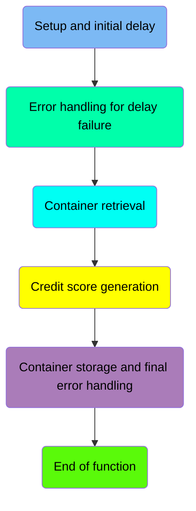
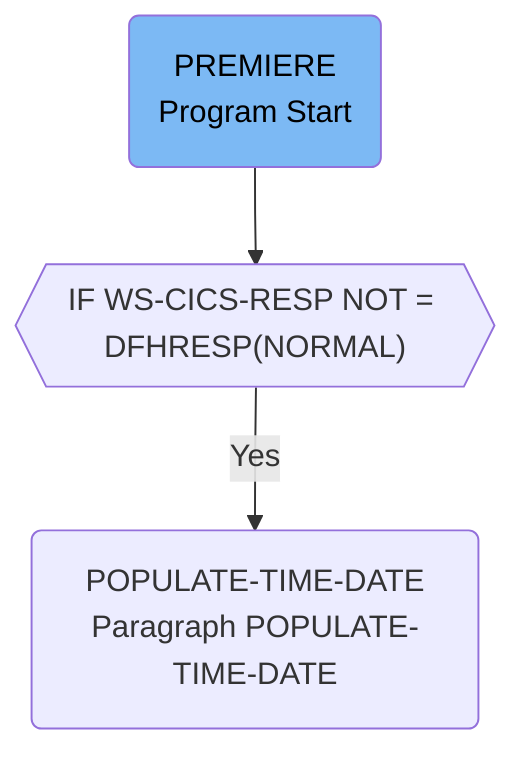
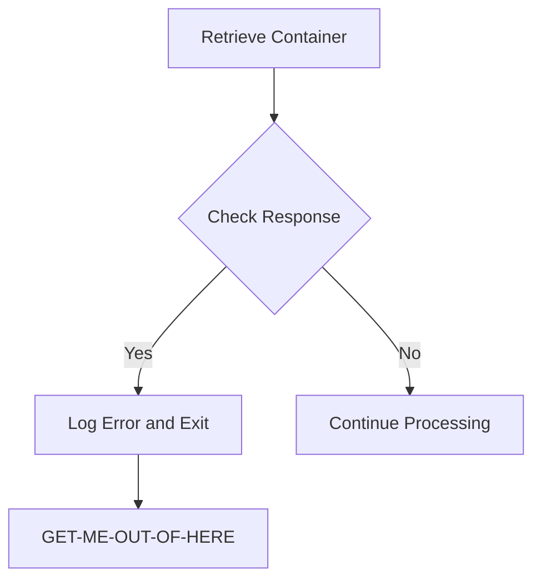
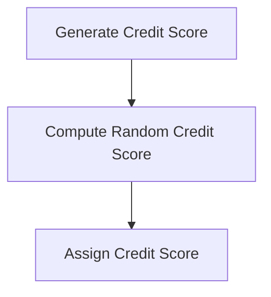
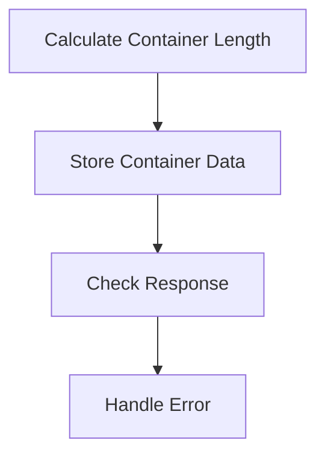
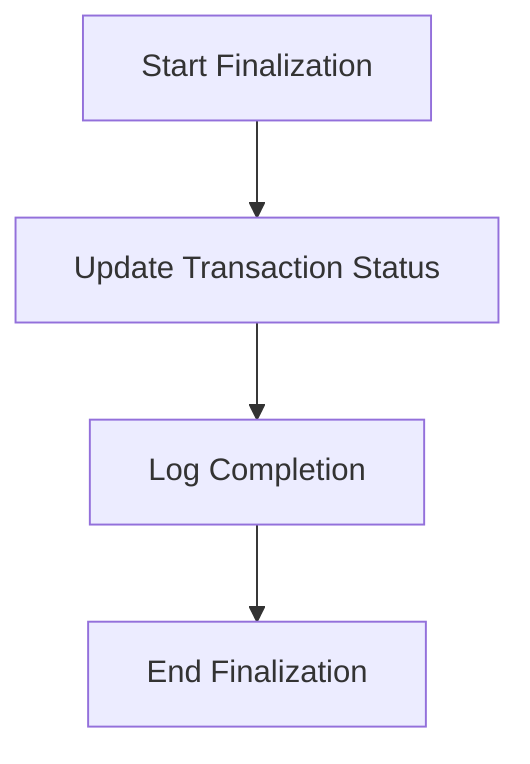

# Generating Credit Score (CRDTAGY3)

The <SwmToken path="src/base/cobol_src/CRDTAGY3.cbl" pos="200:4:4" line-data="              DISPLAY &#39;CRDTAGY3- UNABLE TO GET CONTAINER. RESP=&#39;">`CRDTAGY3`</SwmToken> program is responsible for generating a credit score. This process involves setting up an initial delay, handling any errors that occur during the delay, retrieving and storing containers, and finally generating and assigning a random credit score.

The flow starts with setting up an initial delay to simulate wait time. If an error occurs during this delay, it is handled appropriately. The program then retrieves a container from a CICS channel, generates a random credit score, and stores the container data. Finally, the program assigns the generated credit score to the appropriate variable.

Here is a high level diagram of the program:



## Setup and initial delay



<SwmSnippet path="/src/base/cobol_src/CRDTAGY3.cbl" line="112">

---

### Generating Delay

First, the program generates a random delay amount in seconds between 0 and 3. This delay is used to simulate a wait time in the application. The delay amount is computed using a random function seeded with the task number.

```cobol
       PREMIERE SECTION.
       A010.
      *
      *    Generate a random  number of seconds between 0 & 3.
      *    This is the delay amount in seconds.
      *

           MOVE 'CIPC            ' TO WS-CONTAINER-NAME.
           MOVE 'CIPCREDCHANN    ' TO WS-CHANNEL-NAME.
           MOVE EIBTASKN           TO WS-SEED.

           COMPUTE WS-DELAY-AMT = ((3 - 1)
                            * FUNCTION RANDOM(WS-SEED)) + 1.

```

---

</SwmSnippet>

<SwmSnippet path="/src/base/cobol_src/CRDTAGY3.cbl" line="126">

---

### Executing Delay

Next, the program executes the delay using the CICS DELAY command. The delay is for the number of seconds computed in the previous step. The response codes are stored in <SwmToken path="src/base/cobol_src/CRDTAGY3.cbl" pos="128:3:7" line-data="                RESP(WS-CICS-RESP)">`WS-CICS-RESP`</SwmToken> and <SwmToken path="src/base/cobol_src/CRDTAGY3.cbl" pos="129:3:7" line-data="                RESP2(WS-CICS-RESP2)">`WS-CICS-RESP2`</SwmToken>.

```cobol
           EXEC CICS DELAY
                FOR SECONDS(WS-DELAY-AMT)
                RESP(WS-CICS-RESP)
                RESP2(WS-CICS-RESP2)
           END-EXEC.
```

---

</SwmSnippet>

<SwmSnippet path="/src/base/cobol_src/CRDTAGY3.cbl" line="132">

---

### Handling Delay Response

Then, the program checks if the response from the delay command is not normal. If the response is not normal, it initializes the abend information record, gets supplemental information, and links to the abend handler program. The <SwmToken path="src/base/cobol_src/CRDTAGY3.cbl" pos="151:3:7" line-data="              PERFORM POPULATE-TIME-DATE">`POPULATE-TIME-DATE`</SwmToken> paragraph is performed to get the current date and time.

```cobol
           IF WS-CICS-RESP NOT = DFHRESP(NORMAL)
      *
      *       Preserve the RESP and RESP2, then set up the
      *       standard ABEND info before getting the applid,
      *       date/time etc. and linking to the Abend Handler
      *       program.
      *
              INITIALIZE ABNDINFO-REC
              MOVE EIBRESP    TO ABND-RESPCODE
              MOVE EIBRESP2   TO ABND-RESP2CODE
      *
      *       Get supplemental information
      *
              EXEC CICS ASSIGN APPLID(ABND-APPLID)
              END-EXEC

              MOVE EIBTASKN   TO ABND-TASKNO-KEY
              MOVE EIBTRNID   TO ABND-TRANID

              PERFORM POPULATE-TIME-DATE

```

---

</SwmSnippet>

<SwmSnippet path="/src/base/cobol_src/CRDTAGY3.cbl" line="257">

---

#### Populating Time and Date

The <SwmToken path="src/base/cobol_src/CRDTAGY3.cbl" pos="257:1:5" line-data="       POPULATE-TIME-DATE SECTION.">`POPULATE-TIME-DATE`</SwmToken> paragraph gets the current time and date using the CICS ASKTIME and FORMATTIME commands. This information is used to populate the abend information record.

```cobol
       POPULATE-TIME-DATE SECTION.
       PTD010.

           EXEC CICS ASKTIME
              ABSTIME(WS-U-TIME)
           END-EXEC.

           EXEC CICS FORMATTIME
                     ABSTIME(WS-U-TIME)
                     DDMMYYYY(WS-ORIG-DATE)
                     TIME(WS-TIME-NOW)
                     DATESEP
           END-EXEC.

       PTD999.
           EXIT.
```

---

</SwmSnippet>

## Error handling for delay failure

```mermaid
graph TD
  A[Initialize ABNDINFO-REC] --> B[Move EIBRESP to ABND-RESPCODE]
  B --> C[Move EIBRESP2 to ABND-RESP2CODE]
  C --> D[Assign APPLID to ABND-APPLID]
  D --> E[Move EIBTASKN to ABND-TASKNO-KEY]
  E --> F[Move EIBTRNID to ABND-TRANID]
  F --> G[Perform POPULATE-TIME-DATE]
  G --> H[Move WS-ORIG-DATE to ABND-DATE]
  H --> I[String WS-TIME-NOW-GRP-HH to ABND-TIME]
  I --> J[Move WS-U-TIME to ABND-UTIME-KEY]
  J --> K[Move 'PLOP' to ABND-CODE]
  K --> L[Assign PROGRAM to ABND-PROGRAM]
  L --> M[Move ZEROS to ABND-SQLCODE]
  M --> N[String 'A010 - *** The delay messed up! ***' to ABND-FREEFORM]
  N --> O[Link to WS-ABEND-PGM]
  O --> P[Display '*** The delay messed up ! ***']
  P --> Q[ABEND with ABCODE 'PLOP']

%% Swimm:
%% graph TD
%%   A[Initialize ABNDINFO-REC] --> B[Move EIBRESP to ABND-RESPCODE]
%%   B --> C[Move <SwmToken path="src/base/cobol_src/CRDTAGY3.cbl" pos="141:3:3" line-data="              MOVE EIBRESP2   TO ABND-RESP2CODE">`EIBRESP2`</SwmToken> to ABND-RESP2CODE]
%%   C --> D[Assign APPLID to ABND-APPLID]
%%   D --> E[Move EIBTASKN to ABND-TASKNO-KEY]
%%   E --> F[Move EIBTRNID to ABND-TRANID]
%%   F --> G[Perform POPULATE-TIME-DATE]
%%   G --> H[Move <SwmToken path="src/base/cobol_src/CRDTAGY3.cbl" pos="153:3:7" line-data="              MOVE WS-ORIG-DATE TO ABND-DATE">`WS-ORIG-DATE`</SwmToken> to ABND-DATE]
%%   H --> I[String <SwmToken path="src/base/cobol_src/CRDTAGY3.cbl" pos="154:3:11" line-data="              STRING WS-TIME-NOW-GRP-HH DELIMITED BY SIZE,">`WS-TIME-NOW-GRP-HH`</SwmToken> to ABND-TIME]
%%   I --> J[Move <SwmToken path="src/base/cobol_src/CRDTAGY3.cbl" pos="162:3:7" line-data="              MOVE WS-U-TIME   TO ABND-UTIME-KEY">`WS-U-TIME`</SwmToken> to ABND-UTIME-KEY]
%%   J --> K[Move 'PLOP' to ABND-CODE]
%%   K --> L[Assign PROGRAM to ABND-PROGRAM]
%%   L --> M[Move ZEROS to ABND-SQLCODE]
%%   M --> N[String 'A010 - *** The delay messed up! ***' to ABND-FREEFORM]
%%   N --> O[Link to WS-ABEND-PGM]
%%   O --> P[Display '*** The delay messed up ! ***']
%%   P --> Q[ABEND with ABCODE 'PLOP']
```



<SwmSnippet path="/src/base/cobol_src/CRDTAGY3.cbl" line="139">

---

### Initialize <SwmToken path="src/base/cobol_src/CRDTAGY3.cbl" pos="139:3:5" line-data="              INITIALIZE ABNDINFO-REC">`ABNDINFO-REC`</SwmToken>

First, the <SwmToken path="src/base/cobol_src/CRDTAGY3.cbl" pos="139:3:5" line-data="              INITIALIZE ABNDINFO-REC">`ABNDINFO-REC`</SwmToken> record is initialized to ensure all fields are set to their default values before any data is moved into them.

```cobol
              INITIALIZE ABNDINFO-REC
```

---

</SwmSnippet>

<SwmSnippet path="/src/base/cobol_src/CRDTAGY3.cbl" line="140">

---

### Move EIBRESP to <SwmToken path="src/base/cobol_src/CRDTAGY3.cbl" pos="140:7:9" line-data="              MOVE EIBRESP    TO ABND-RESPCODE">`ABND-RESPCODE`</SwmToken>

Next, the response code from the <SwmToken path="src/base/cobol_src/CRDTAGY3.cbl" pos="140:3:3" line-data="              MOVE EIBRESP    TO ABND-RESPCODE">`EIBRESP`</SwmToken> field is moved to <SwmToken path="src/base/cobol_src/CRDTAGY3.cbl" pos="140:7:9" line-data="              MOVE EIBRESP    TO ABND-RESPCODE">`ABND-RESPCODE`</SwmToken> to preserve the response code for later use.

```cobol
              MOVE EIBRESP    TO ABND-RESPCODE
```

---

</SwmSnippet>

<SwmSnippet path="/src/base/cobol_src/CRDTAGY3.cbl" line="141">

---

### Move <SwmToken path="src/base/cobol_src/CRDTAGY3.cbl" pos="141:3:3" line-data="              MOVE EIBRESP2   TO ABND-RESP2CODE">`EIBRESP2`</SwmToken> to <SwmToken path="src/base/cobol_src/CRDTAGY3.cbl" pos="141:7:9" line-data="              MOVE EIBRESP2   TO ABND-RESP2CODE">`ABND-RESP2CODE`</SwmToken>

Then, the secondary response code from the <SwmToken path="src/base/cobol_src/CRDTAGY3.cbl" pos="141:3:3" line-data="              MOVE EIBRESP2   TO ABND-RESP2CODE">`EIBRESP2`</SwmToken> field is moved to <SwmToken path="src/base/cobol_src/CRDTAGY3.cbl" pos="141:7:9" line-data="              MOVE EIBRESP2   TO ABND-RESP2CODE">`ABND-RESP2CODE`</SwmToken> to preserve the secondary response code.

```cobol
              MOVE EIBRESP2   TO ABND-RESP2CODE
```

---

</SwmSnippet>

<SwmSnippet path="/src/base/cobol_src/CRDTAGY3.cbl" line="145">

---

### Assign APPLID to <SwmToken path="src/base/cobol_src/CRDTAGY3.cbl" pos="145:9:11" line-data="              EXEC CICS ASSIGN APPLID(ABND-APPLID)">`ABND-APPLID`</SwmToken>

The application ID is assigned to <SwmToken path="src/base/cobol_src/CRDTAGY3.cbl" pos="145:9:11" line-data="              EXEC CICS ASSIGN APPLID(ABND-APPLID)">`ABND-APPLID`</SwmToken> using the <SwmToken path="src/base/cobol_src/CRDTAGY3.cbl" pos="145:1:5" line-data="              EXEC CICS ASSIGN APPLID(ABND-APPLID)">`EXEC CICS ASSIGN`</SwmToken> command to capture the application identifier.

```cobol
              EXEC CICS ASSIGN APPLID(ABND-APPLID)
              END-EXEC
```

---

</SwmSnippet>

<SwmSnippet path="/src/base/cobol_src/CRDTAGY3.cbl" line="148">

---

### Move EIBTASKN to <SwmToken path="src/base/cobol_src/CRDTAGY3.cbl" pos="148:7:11" line-data="              MOVE EIBTASKN   TO ABND-TASKNO-KEY">`ABND-TASKNO-KEY`</SwmToken>

The task number is moved from <SwmToken path="src/base/cobol_src/CRDTAGY3.cbl" pos="148:3:3" line-data="              MOVE EIBTASKN   TO ABND-TASKNO-KEY">`EIBTASKN`</SwmToken> to <SwmToken path="src/base/cobol_src/CRDTAGY3.cbl" pos="148:7:11" line-data="              MOVE EIBTASKN   TO ABND-TASKNO-KEY">`ABND-TASKNO-KEY`</SwmToken> to store the current task number.

```cobol
              MOVE EIBTASKN   TO ABND-TASKNO-KEY
```

---

</SwmSnippet>

<SwmSnippet path="/src/base/cobol_src/CRDTAGY3.cbl" line="149">

---

### Move EIBTRNID to <SwmToken path="src/base/cobol_src/CRDTAGY3.cbl" pos="149:7:9" line-data="              MOVE EIBTRNID   TO ABND-TRANID">`ABND-TRANID`</SwmToken>

The transaction ID is moved from <SwmToken path="src/base/cobol_src/CRDTAGY3.cbl" pos="149:3:3" line-data="              MOVE EIBTRNID   TO ABND-TRANID">`EIBTRNID`</SwmToken> to <SwmToken path="src/base/cobol_src/CRDTAGY3.cbl" pos="149:7:9" line-data="              MOVE EIBTRNID   TO ABND-TRANID">`ABND-TRANID`</SwmToken> to store the current transaction identifier.

```cobol
              MOVE EIBTRNID   TO ABND-TRANID
```

---

</SwmSnippet>

<SwmSnippet path="/src/base/cobol_src/CRDTAGY3.cbl" line="151">

---

### Perform <SwmToken path="src/base/cobol_src/CRDTAGY3.cbl" pos="151:3:7" line-data="              PERFORM POPULATE-TIME-DATE">`POPULATE-TIME-DATE`</SwmToken>

The <SwmToken path="src/base/cobol_src/CRDTAGY3.cbl" pos="151:3:7" line-data="              PERFORM POPULATE-TIME-DATE">`POPULATE-TIME-DATE`</SwmToken> paragraph is performed to gather the current date and time information.

```cobol
              PERFORM POPULATE-TIME-DATE
```

---

</SwmSnippet>

<SwmSnippet path="/src/base/cobol_src/CRDTAGY3.cbl" line="153">

---

### Move <SwmToken path="src/base/cobol_src/CRDTAGY3.cbl" pos="153:3:7" line-data="              MOVE WS-ORIG-DATE TO ABND-DATE">`WS-ORIG-DATE`</SwmToken> to <SwmToken path="src/base/cobol_src/CRDTAGY3.cbl" pos="153:11:13" line-data="              MOVE WS-ORIG-DATE TO ABND-DATE">`ABND-DATE`</SwmToken>

The original date is moved from <SwmToken path="src/base/cobol_src/CRDTAGY3.cbl" pos="153:3:7" line-data="              MOVE WS-ORIG-DATE TO ABND-DATE">`WS-ORIG-DATE`</SwmToken> to <SwmToken path="src/base/cobol_src/CRDTAGY3.cbl" pos="153:11:13" line-data="              MOVE WS-ORIG-DATE TO ABND-DATE">`ABND-DATE`</SwmToken> to store the date of the event.

```cobol
              MOVE WS-ORIG-DATE TO ABND-DATE
```

---

</SwmSnippet>

<SwmSnippet path="/src/base/cobol_src/CRDTAGY3.cbl" line="154">

---

### String <SwmToken path="src/base/cobol_src/CRDTAGY3.cbl" pos="154:3:11" line-data="              STRING WS-TIME-NOW-GRP-HH DELIMITED BY SIZE,">`WS-TIME-NOW-GRP-HH`</SwmToken> to <SwmToken path="src/base/cobol_src/CRDTAGY3.cbl" pos="159:3:5" line-data="                       INTO ABND-TIME">`ABND-TIME`</SwmToken>

The current time components are concatenated into a single string and moved to <SwmToken path="src/base/cobol_src/CRDTAGY3.cbl" pos="159:3:5" line-data="                       INTO ABND-TIME">`ABND-TIME`</SwmToken> to store the time of the event.

```cobol
              STRING WS-TIME-NOW-GRP-HH DELIMITED BY SIZE,
                      ':' DELIMITED BY SIZE,
                       WS-TIME-NOW-GRP-MM DELIMITED BY SIZE,
                       ':' DELIMITED BY SIZE,
                       WS-TIME-NOW-GRP-MM DELIMITED BY SIZE
                       INTO ABND-TIME
```

---

</SwmSnippet>

<SwmSnippet path="/src/base/cobol_src/CRDTAGY3.cbl" line="162">

---

### Move <SwmToken path="src/base/cobol_src/CRDTAGY3.cbl" pos="162:3:7" line-data="              MOVE WS-U-TIME   TO ABND-UTIME-KEY">`WS-U-TIME`</SwmToken> to <SwmToken path="src/base/cobol_src/CRDTAGY3.cbl" pos="162:11:15" line-data="              MOVE WS-U-TIME   TO ABND-UTIME-KEY">`ABND-UTIME-KEY`</SwmToken>

The universal time is moved from <SwmToken path="src/base/cobol_src/CRDTAGY3.cbl" pos="162:3:7" line-data="              MOVE WS-U-TIME   TO ABND-UTIME-KEY">`WS-U-TIME`</SwmToken> to <SwmToken path="src/base/cobol_src/CRDTAGY3.cbl" pos="162:11:15" line-data="              MOVE WS-U-TIME   TO ABND-UTIME-KEY">`ABND-UTIME-KEY`</SwmToken> to store the universal time key.

```cobol
              MOVE WS-U-TIME   TO ABND-UTIME-KEY
```

---

</SwmSnippet>

<SwmSnippet path="/src/base/cobol_src/CRDTAGY3.cbl" line="163">

---

### Move 'PLOP' to <SwmToken path="src/base/cobol_src/CRDTAGY3.cbl" pos="163:9:11" line-data="              MOVE &#39;PLOP&#39;      TO ABND-CODE">`ABND-CODE`</SwmToken>

The code 'PLOP' is moved to <SwmToken path="src/base/cobol_src/CRDTAGY3.cbl" pos="163:9:11" line-data="              MOVE &#39;PLOP&#39;      TO ABND-CODE">`ABND-CODE`</SwmToken> to set a specific code for the abend event.

```cobol
              MOVE 'PLOP'      TO ABND-CODE
```

---

</SwmSnippet>

<SwmSnippet path="/src/base/cobol_src/CRDTAGY3.cbl" line="165">

---

### Assign PROGRAM to <SwmToken path="src/base/cobol_src/CRDTAGY3.cbl" pos="165:9:11" line-data="              EXEC CICS ASSIGN PROGRAM(ABND-PROGRAM)">`ABND-PROGRAM`</SwmToken>

The current program name is assigned to <SwmToken path="src/base/cobol_src/CRDTAGY3.cbl" pos="165:9:11" line-data="              EXEC CICS ASSIGN PROGRAM(ABND-PROGRAM)">`ABND-PROGRAM`</SwmToken> using the <SwmToken path="src/base/cobol_src/CRDTAGY3.cbl" pos="165:1:5" line-data="              EXEC CICS ASSIGN PROGRAM(ABND-PROGRAM)">`EXEC CICS ASSIGN`</SwmToken> command to capture the program identifier.

```cobol
              EXEC CICS ASSIGN PROGRAM(ABND-PROGRAM)
              END-EXEC
```

---

</SwmSnippet>

<SwmSnippet path="/src/base/cobol_src/CRDTAGY3.cbl" line="168">

---

### Move ZEROS to <SwmToken path="src/base/cobol_src/CRDTAGY3.cbl" pos="168:7:9" line-data="              MOVE ZEROS      TO ABND-SQLCODE">`ABND-SQLCODE`</SwmToken>

Zeros are moved to <SwmToken path="src/base/cobol_src/CRDTAGY3.cbl" pos="168:7:9" line-data="              MOVE ZEROS      TO ABND-SQLCODE">`ABND-SQLCODE`</SwmToken> to initialize the SQL code field.

```cobol
              MOVE ZEROS      TO ABND-SQLCODE
```

---

</SwmSnippet>

<SwmSnippet path="/src/base/cobol_src/CRDTAGY3.cbl" line="170">

---

### String 'A010 - \*\*\* The delay messed up! \*\*\*' to <SwmToken path="src/base/cobol_src/CRDTAGY3.cbl" pos="176:3:5" line-data="                      INTO ABND-FREEFORM">`ABND-FREEFORM`</SwmToken>

A freeform message is constructed and moved to <SwmToken path="src/base/cobol_src/CRDTAGY3.cbl" pos="176:3:5" line-data="                      INTO ABND-FREEFORM">`ABND-FREEFORM`</SwmToken> to provide a detailed error message.

```cobol
              STRING 'A010  - *** The delay messed up! ***'
                      DELIMITED BY SIZE,
                      ' EIBRESP=' DELIMITED BY SIZE,
                      ABND-RESPCODE DELIMITED BY SIZE,
                      ' RESP2=' DELIMITED BY SIZE,
                      ABND-RESP2CODE DELIMITED BY SIZE
                      INTO ABND-FREEFORM
```

---

</SwmSnippet>

<SwmSnippet path="/src/base/cobol_src/CRDTAGY3.cbl" line="179">

---

### Link to <SwmToken path="src/base/cobol_src/CRDTAGY3.cbl" pos="179:9:13" line-data="              EXEC CICS LINK PROGRAM(WS-ABEND-PGM)">`WS-ABEND-PGM`</SwmToken>

The <SwmToken path="src/base/cobol_src/CRDTAGY3.cbl" pos="179:9:13" line-data="              EXEC CICS LINK PROGRAM(WS-ABEND-PGM)">`WS-ABEND-PGM`</SwmToken> program is linked with the <SwmToken path="src/base/cobol_src/CRDTAGY3.cbl" pos="180:3:5" line-data="                          COMMAREA(ABNDINFO-REC)">`ABNDINFO-REC`</SwmToken> communication area to handle the abend event.

```cobol
              EXEC CICS LINK PROGRAM(WS-ABEND-PGM)
                          COMMAREA(ABNDINFO-REC)
              END-EXEC
```

---

</SwmSnippet>

<SwmSnippet path="/src/base/cobol_src/CRDTAGY3.cbl" line="183">

---

### Display '\*\*\* The delay messed up ! \*\*\*'

A message is displayed to indicate that the delay has caused an issue.

```cobol
              DISPLAY '*** The delay messed up ! ***'
```

---

</SwmSnippet>

### Interim Summary

So far, we saw how the program handles the delay response and populates the time and date information for the abend record. Now, we will focus on the process of retrieving a container from a CICS channel and handling any errors that may occur during this retrieval.

## Container retrieval



<SwmSnippet path="/src/base/cobol_src/CRDTAGY3.cbl" line="191">

---

### Retrieve Container

First, the code retrieves a container from a CICS channel using the <SwmToken path="src/base/cobol_src/CRDTAGY3.cbl" pos="191:1:7" line-data="           EXEC CICS GET CONTAINER(WS-CONTAINER-NAME)">`EXEC CICS GET CONTAINER`</SwmToken> command. This command specifies the container name (<SwmToken path="src/base/cobol_src/CRDTAGY3.cbl" pos="191:9:13" line-data="           EXEC CICS GET CONTAINER(WS-CONTAINER-NAME)">`WS-CONTAINER-NAME`</SwmToken>), the channel name (<SwmToken path="src/base/cobol_src/CRDTAGY3.cbl" pos="192:3:7" line-data="                     CHANNEL(WS-CHANNEL-NAME)">`WS-CHANNEL-NAME`</SwmToken>), and the target variable (<SwmToken path="src/base/cobol_src/CRDTAGY3.cbl" pos="193:3:7" line-data="                     INTO(WS-CONT-IN)">`WS-CONT-IN`</SwmToken>). It also captures the length of the container (<SwmToken path="src/base/cobol_src/CRDTAGY3.cbl" pos="194:3:7" line-data="                     FLENGTH(WS-CONTAINER-LEN)">`WS-CONTAINER-LEN`</SwmToken>) and the response codes (<SwmToken path="src/base/cobol_src/CRDTAGY3.cbl" pos="195:3:7" line-data="                     RESP(WS-CICS-RESP)">`WS-CICS-RESP`</SwmToken> and <SwmToken path="src/base/cobol_src/CRDTAGY3.cbl" pos="196:3:7" line-data="                     RESP2(WS-CICS-RESP2)">`WS-CICS-RESP2`</SwmToken>).

```cobol
           EXEC CICS GET CONTAINER(WS-CONTAINER-NAME)
                     CHANNEL(WS-CHANNEL-NAME)
                     INTO(WS-CONT-IN)
                     FLENGTH(WS-CONTAINER-LEN)
                     RESP(WS-CICS-RESP)
                     RESP2(WS-CICS-RESP2)
           END-EXEC.
```

---

</SwmSnippet>

<SwmSnippet path="/src/base/cobol_src/CRDTAGY3.cbl" line="199">

---

### Check Response

Next, the code checks if the response code (<SwmToken path="src/base/cobol_src/CRDTAGY3.cbl" pos="199:3:7" line-data="           IF WS-CICS-RESP NOT = DFHRESP(NORMAL)">`WS-CICS-RESP`</SwmToken>) is not equal to <SwmToken path="src/base/cobol_src/CRDTAGY3.cbl" pos="199:13:16" line-data="           IF WS-CICS-RESP NOT = DFHRESP(NORMAL)">`DFHRESP(NORMAL)`</SwmToken>. If the response is not normal, it logs an error message displaying the response codes, container name, channel name, and container length. It then performs the <SwmToken path="src/base/cobol_src/CRDTAGY3.cbl" pos="205:3:11" line-data="              PERFORM GET-ME-OUT-OF-HERE">`GET-ME-OUT-OF-HERE`</SwmToken> section to handle the error.

```cobol
           IF WS-CICS-RESP NOT = DFHRESP(NORMAL)
              DISPLAY 'CRDTAGY3- UNABLE TO GET CONTAINER. RESP='
                 WS-CICS-RESP ', RESP2=' WS-CICS-RESP2
              DISPLAY 'CONTAINER=' WS-CONTAINER-NAME ' CHANNEL='
                       WS-CHANNEL-NAME ' FLENGTH='
                       WS-CONTAINER-LEN
              PERFORM GET-ME-OUT-OF-HERE
           END-IF.
```

---

</SwmSnippet>

<SwmSnippet path="/src/base/cobol_src/CRDTAGY3.cbl" line="247">

---

### <SwmToken path="src/base/cobol_src/CRDTAGY3.cbl" pos="247:1:9" line-data="       GET-ME-OUT-OF-HERE SECTION.">`GET-ME-OUT-OF-HERE`</SwmToken>

The <SwmToken path="src/base/cobol_src/CRDTAGY3.cbl" pos="247:1:9" line-data="       GET-ME-OUT-OF-HERE SECTION.">`GET-ME-OUT-OF-HERE`</SwmToken> section is executed when there is an error in retrieving the container. This section issues a <SwmToken path="src/base/cobol_src/CRDTAGY3.cbl" pos="250:3:5" line-data="           EXEC CICS RETURN">`CICS RETURN`</SwmToken> command to terminate the transaction.

```cobol
       GET-ME-OUT-OF-HERE SECTION.
       GMOFH010.

           EXEC CICS RETURN
           END-EXEC.

       GMOFH999.
           EXIT.
```

---

</SwmSnippet>

## Credit score generation

This is the next section of the flow.



<SwmSnippet path="/src/base/cobol_src/CRDTAGY3.cbl" line="209">

---

### Generate Credit Score

First, we prepare to generate a new credit score for the customer. The credit score will be a random number between 1 and 999. Because a SEED was used on the first RANDOM function call earlier in the code, it is not necessary to use a SEED again for subsequent RANDOM function calls.

```cobol
      *    Now generate a credit score between 1 and 999. Because we
      *    used a SEED on the first RANDOM (above) we don't need to
      *    use a SEED again when using RANDOM for a subsequent time
```

---

</SwmSnippet>

<SwmSnippet path="/src/base/cobol_src/CRDTAGY3.cbl" line="213">

---

### Compute Random Credit Score

Next, we compute the new credit score using the RANDOM function. The formula `((`<SwmToken path="src/base/cobol_src/CRDTAGY3.cbl" pos="213:13:13" line-data="           COMPUTE WS-NEW-CREDSCORE = ((999 - 1)">`999`</SwmToken>`- 1) *`<SwmToken path="src/base/cobol_src/CRDTAGY3.cbl" pos="214:3:3" line-data="                            * FUNCTION RANDOM) + 1.">`FUNCTION`</SwmToken>` `<SwmToken path="src/base/cobol_src/CRDTAGY3.cbl" pos="214:5:5" line-data="                            * FUNCTION RANDOM) + 1.">`RANDOM`</SwmToken>`) + 1` ensures that the generated credit score is within the range of 1 to 999.

```cobol
           COMPUTE WS-NEW-CREDSCORE = ((999 - 1)
                            * FUNCTION RANDOM) + 1.
```

---

</SwmSnippet>

<SwmSnippet path="/src/base/cobol_src/CRDTAGY3.cbl" line="217">

---

### Assign Credit Score

Finally, we move the newly generated credit score (<SwmToken path="src/base/cobol_src/CRDTAGY3.cbl" pos="217:3:7" line-data="           MOVE WS-NEW-CREDSCORE TO WS-CONT-IN-CREDIT-SCORE.">`WS-NEW-CREDSCORE`</SwmToken>) to the variable <SwmToken path="src/base/cobol_src/CRDTAGY3.cbl" pos="217:11:19" line-data="           MOVE WS-NEW-CREDSCORE TO WS-CONT-IN-CREDIT-SCORE.">`WS-CONT-IN-CREDIT-SCORE`</SwmToken>, which is likely used elsewhere in the program to store the customer's credit score.

```cobol
           MOVE WS-NEW-CREDSCORE TO WS-CONT-IN-CREDIT-SCORE.
```

---

</SwmSnippet>

## Container storage and final error handling



<SwmSnippet path="/src/base/cobol_src/CRDTAGY3.cbl" line="221">

---

### Calculate Container Length

First, the length of the container data is calculated and stored in <SwmToken path="src/base/cobol_src/CRDTAGY3.cbl" pos="222:3:7" line-data="           COMPUTE WS-CONTAINER-LEN = LENGTH OF WS-CONT-IN.">`WS-CONTAINER-LEN`</SwmToken> (which holds the length of the container data). This is essential for specifying the length of the data to be stored in the container.

```cobol
      *
           COMPUTE WS-CONTAINER-LEN = LENGTH OF WS-CONT-IN.
```

---

</SwmSnippet>

<SwmSnippet path="/src/base/cobol_src/CRDTAGY3.cbl" line="224">

---

### Store Container Data

Next, the container data is stored using the <SwmToken path="src/base/cobol_src/CRDTAGY3.cbl" pos="224:1:7" line-data="           EXEC CICS PUT CONTAINER(WS-CONTAINER-NAME)">`EXEC CICS PUT CONTAINER`</SwmToken> command. This command takes the container name (<SwmToken path="src/base/cobol_src/CRDTAGY3.cbl" pos="224:9:13" line-data="           EXEC CICS PUT CONTAINER(WS-CONTAINER-NAME)">`WS-CONTAINER-NAME`</SwmToken>), the data to be stored (<SwmToken path="src/base/cobol_src/CRDTAGY3.cbl" pos="225:3:7" line-data="                         FROM(WS-CONT-IN)">`WS-CONT-IN`</SwmToken>), the length of the data (<SwmToken path="src/base/cobol_src/CRDTAGY3.cbl" pos="226:3:7" line-data="                         FLENGTH(WS-CONTAINER-LEN)">`WS-CONTAINER-LEN`</SwmToken>), and the channel name (<SwmToken path="src/base/cobol_src/CRDTAGY3.cbl" pos="227:3:7" line-data="                         CHANNEL(WS-CHANNEL-NAME)">`WS-CHANNEL-NAME`</SwmToken>). The response codes are stored in <SwmToken path="src/base/cobol_src/CRDTAGY3.cbl" pos="228:3:7" line-data="                         RESP(WS-CICS-RESP)">`WS-CICS-RESP`</SwmToken> and <SwmToken path="src/base/cobol_src/CRDTAGY3.cbl" pos="229:3:7" line-data="                         RESP2(WS-CICS-RESP2)">`WS-CICS-RESP2`</SwmToken>.

```cobol
           EXEC CICS PUT CONTAINER(WS-CONTAINER-NAME)
                         FROM(WS-CONT-IN)
                         FLENGTH(WS-CONTAINER-LEN)
                         CHANNEL(WS-CHANNEL-NAME)
                         RESP(WS-CICS-RESP)
                         RESP2(WS-CICS-RESP2)
           END-EXEC.
```

---

</SwmSnippet>

<SwmSnippet path="/src/base/cobol_src/CRDTAGY3.cbl" line="232">

---

### Check Response

Then, the response from the <SwmToken path="src/base/cobol_src/CRDTAGY3.cbl" pos="233:11:13" line-data="              DISPLAY &#39;CRDTAGY3- UNABLE TO PUT CONTAINER. RESP=&#39;">`PUT CONTAINER`</SwmToken> command is checked. If the response code (<SwmToken path="src/base/cobol_src/CRDTAGY3.cbl" pos="232:3:7" line-data="           IF WS-CICS-RESP NOT = DFHRESP(NORMAL)">`WS-CICS-RESP`</SwmToken>) is not normal (<SwmToken path="src/base/cobol_src/CRDTAGY3.cbl" pos="232:13:16" line-data="           IF WS-CICS-RESP NOT = DFHRESP(NORMAL)">`DFHRESP(NORMAL)`</SwmToken>), an error message is displayed with the response codes, container name, channel name, and data length.

```cobol
           IF WS-CICS-RESP NOT = DFHRESP(NORMAL)
              DISPLAY 'CRDTAGY3- UNABLE TO PUT CONTAINER. RESP='
                 WS-CICS-RESP ', RESP2=' WS-CICS-RESP2
              DISPLAY  'CONTAINER='  WS-CONTAINER-NAME
              ' CHANNEL=' WS-CHANNEL-NAME ' FLENGTH='
                    WS-CONTAINER-LEN
```

---

</SwmSnippet>

<SwmSnippet path="/src/base/cobol_src/CRDTAGY3.cbl" line="238">

---

### Handle Error

Finally, if an error occurred, the <SwmToken path="src/base/cobol_src/CRDTAGY3.cbl" pos="238:3:11" line-data="              PERFORM GET-ME-OUT-OF-HERE">`GET-ME-OUT-OF-HERE`</SwmToken> routine is performed to handle the error and exit the current process.

```cobol
              PERFORM GET-ME-OUT-OF-HERE
           END-IF.
```

---

</SwmSnippet>

## End of function

This is the next section of the flow.



<SwmSnippet path="/src/base/cobol_src/CRDTAGY3.cbl" line="243">

---

### Start Finalization

The label <SwmToken path="src/base/cobol_src/CRDTAGY3.cbl" pos="243:1:1" line-data="       A999.">`A999`</SwmToken> marks the beginning of the finalization section. This is where the transaction process is concluded, ensuring all necessary updates and logs are completed before ending the transaction.

```cobol
       A999.
           EXIT.
```

---

</SwmSnippet>

&nbsp;

*This is an auto-generated document by Swimm 🌊 and has not yet been verified by a human*

<SwmMeta version="3.0.0" repo-id="Z2l0aHViJTNBJTNBY2ljcy1iYW5raW5nLXNhbXBsZS1hcHBsaWNhdGlvbi1jYnNhLUlCTS1EZW1vJTNBJTNBU3dpbW0tRGVtbw==" repo-name="cics-banking-sample-application-cbsa-IBM-Demo"></SwmMeta>
