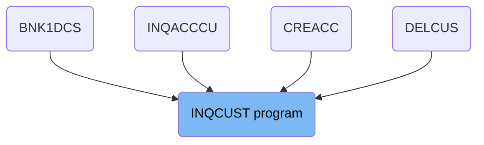

# Get Customer Record (INQCUST)

The INQCUST program is responsible for handling customer inquiries in the banking application. It checks the incoming customer number, retrieves customer information from the VSAM file, and returns the relevant customer data. The program ensures proper handling of abnormal terminations and initializes necessary variables to manage the inquiry process.

The INQCUST program starts by setting up abend handling to manage any abnormal terminations. It then initializes variables and checks the incoming customer number. If the number is all zeros or nines, it retrieves the last customer number in use or generates a random customer number. The program reads customer information from the VSAM file and, if successful, returns the customer data. Finally, it terminates the process.

## Where is this program used?

This program is used multiple times in the codebase as represented in the following diagram:



Lets' zoom into the flow:

```mermaid
graph TD
  premiere["PREMIERE<br>Program Start"]:::a0d8d6d1e --> id-0{{"IF INQCUST-CUSTNO = 0000000000 OR INQCUST-CUSTNO = 9999999999"}}
  id-0 -->|Yes| read-customer-ncs["READ-CUSTOMER-NCS<br>Retrieve last customer number"]
  id-0 -..->|And then| read-customer-vsam["READ-CUSTOMER-VSAM<br>Read customer information"]
  read-customer-vsam --> get-me-out-of-here["GET-ME-OUT-OF-HERE<br>Finish"]
  read-customer-ncs --> id-1{{"IF INQCUST-INQ-SUCCESS = 'Y'"}}
  id-1 -->|No| get-me-out-of-here["GET-ME-OUT-OF-HERE<br>Finish"]
  classDef a0d8d6d1e color:#000000,fill:#7CB9F4

%% Swimm:
%% graph TD
%%   premiere["PREMIERE<br>Program Start"]:::a0d8d6d1e --> id-0{{"IF <SwmToken path="src/base/cobol_src/INQCUST.cbl" pos="179:3:5" line-data="           MOVE INQCUST-CUSTNO TO REQUIRED-CUST-NUMBER.">`INQCUST-CUSTNO`</SwmToken> = 0000000000 OR <SwmToken path="src/base/cobol_src/INQCUST.cbl" pos="179:3:5" line-data="           MOVE INQCUST-CUSTNO TO REQUIRED-CUST-NUMBER.">`INQCUST-CUSTNO`</SwmToken> = 9999999999"}}
%%   id-0 -->|Yes| read-customer-ncs["READ-CUSTOMER-NCS<br>Retrieve last customer number"]
%%   id-0 -..->|And then| read-customer-vsam["READ-CUSTOMER-VSAM<br>Read customer information"]
%%   read-customer-vsam --> get-me-out-of-here["GET-ME-OUT-OF-HERE<br>Finish"]
%%   read-customer-ncs --> id-1{{"IF <SwmToken path="src/base/cobol_src/INQCUST.cbl" pos="175:9:13" line-data="           MOVE &#39;N&#39; TO INQCUST-INQ-SUCCESS">`INQCUST-INQ-SUCCESS`</SwmToken> = 'Y'"}}
%%   id-1 -->|No| get-me-out-of-here["GET-ME-OUT-OF-HERE<br>Finish"]
%%   classDef a0d8d6d1e color:#000000,fill:#7CB9F4
```



<SwmSnippet path="/src/base/cobol_src/INQCUST.cbl" line="169">

---

### Setting Up Abend Handling

First, the program sets up abend handling using the <SwmToken path="src/base/cobol_src/INQCUST.cbl" pos="171:1:7" line-data="           EXEC CICS HANDLE ABEND">`EXEC CICS HANDLE ABEND`</SwmToken> command. This ensures that any abnormal terminations are properly handled.

```cobol
      *    Set up abend handling
      *
           EXEC CICS HANDLE ABEND
              LABEL(ABEND-HANDLING)
           END-EXEC.
```

---

</SwmSnippet>

<SwmSnippet path="/src/base/cobol_src/INQCUST.cbl" line="175">

---

### Initializing Variables

Next, the program initializes several variables. <SwmToken path="src/base/cobol_src/INQCUST.cbl" pos="175:9:13" line-data="           MOVE &#39;N&#39; TO INQCUST-INQ-SUCCESS">`INQCUST-INQ-SUCCESS`</SwmToken> is set to 'N' to indicate that the inquiry has not yet succeeded, and <SwmToken path="src/base/cobol_src/INQCUST.cbl" pos="176:9:15" line-data="           MOVE &#39;0&#39; TO INQCUST-INQ-FAIL-CD">`INQCUST-INQ-FAIL-CD`</SwmToken> is set to '0'. The <SwmToken path="src/base/cobol_src/INQCUST.cbl" pos="178:3:3" line-data="           MOVE SORTCODE TO REQUIRED-SORT-CODE.">`SORTCODE`</SwmToken> and <SwmToken path="src/base/cobol_src/INQCUST.cbl" pos="179:3:5" line-data="           MOVE INQCUST-CUSTNO TO REQUIRED-CUST-NUMBER.">`INQCUST-CUSTNO`</SwmToken> are moved to <SwmToken path="src/base/cobol_src/INQCUST.cbl" pos="178:7:11" line-data="           MOVE SORTCODE TO REQUIRED-SORT-CODE.">`REQUIRED-SORT-CODE`</SwmToken> and <SwmToken path="src/base/cobol_src/INQCUST.cbl" pos="179:9:13" line-data="           MOVE INQCUST-CUSTNO TO REQUIRED-CUST-NUMBER.">`REQUIRED-CUST-NUMBER`</SwmToken> respectively.

```cobol
           MOVE 'N' TO INQCUST-INQ-SUCCESS
           MOVE '0' TO INQCUST-INQ-FAIL-CD

           MOVE SORTCODE TO REQUIRED-SORT-CODE.
           MOVE INQCUST-CUSTNO TO REQUIRED-CUST-NUMBER.
```

---

</SwmSnippet>

<SwmSnippet path="/src/base/cobol_src/INQCUST.cbl" line="181">

---

### Checking Customer Number

The program checks if the incoming customer number is either all zeros or all nines. If it is, it performs the <SwmToken path="src/base/cobol_src/INQCUST.cbl" pos="191:3:7" line-data="              PERFORM READ-CUSTOMER-NCS">`READ-CUSTOMER-NCS`</SwmToken> paragraph to retrieve the last customer number in use. If the inquiry is successful, it moves the retrieved customer number to <SwmToken path="src/base/cobol_src/INQCUST.cbl" pos="194:13:17" line-data="                MOVE NCS-CUST-NO-VALUE TO REQUIRED-CUST-NUMBER">`REQUIRED-CUST-NUMBER`</SwmToken>. Otherwise, it performs the <SwmToken path="src/base/cobol_src/INQCUST.cbl" pos="196:3:11" line-data="                PERFORM GET-ME-OUT-OF-HERE">`GET-ME-OUT-OF-HERE`</SwmToken> paragraph to terminate the process.

```cobol
      *    Is the incoming CUSTOMER number set to 0's, 9's or
      *    an actual value?
      *
      *    If the incoming CUSTOMER number is 0's (random
      *    customer) or the incoming CUSTOMER number is 9's
      *    (the last valid CUSTOMER in use) then access the
      *    named counter server to get the last
      *    CUSTOMER-NUMBER in use.
      *
           IF INQCUST-CUSTNO = 0000000000 OR INQCUST-CUSTNO = 9999999999
              PERFORM READ-CUSTOMER-NCS
      D       DISPLAY 'CUST NO RETURNED FROM NCS=' NCS-CUST-NO-VALUE
              IF INQCUST-INQ-SUCCESS = 'Y'
                MOVE NCS-CUST-NO-VALUE TO REQUIRED-CUST-NUMBER
              ELSE
                PERFORM GET-ME-OUT-OF-HERE
              END-IF
           END-IF.
```

---

</SwmSnippet>

<SwmSnippet path="/src/base/cobol_src/INQCUST.cbl" line="200">

---

### Generating Random Customer Number

If the incoming customer number is all zeros, the program performs the <SwmToken path="src/base/cobol_src/INQCUST.cbl" pos="205:3:7" line-data="              PERFORM GENERATE-RANDOM-CUSTOMER">`GENERATE-RANDOM-CUSTOMER`</SwmToken> paragraph to generate a random customer number that is less than the highest customer number currently in use. The generated number is then moved to <SwmToken path="src/base/cobol_src/INQCUST.cbl" pos="206:9:13" line-data="              MOVE RANDOM-CUSTOMER TO REQUIRED-CUST-NUMBER">`REQUIRED-CUST-NUMBER`</SwmToken>.

```cobol
      * For a random customer generate a CUSTOMER number
      * randomly which is less than the highest CUSTOMER
      * number that is currently in use.
      *
           IF INQCUST-CUSTNO = 0000000000
              PERFORM GENERATE-RANDOM-CUSTOMER
              MOVE RANDOM-CUSTOMER TO REQUIRED-CUST-NUMBER
           END-IF.
```

---

</SwmSnippet>

<SwmSnippet path="/src/base/cobol_src/INQCUST.cbl" line="213">

---

### Reading Customer Information

The program then performs the <SwmToken path="src/base/cobol_src/INQCUST.cbl" pos="215:3:7" line-data="           PERFORM READ-CUSTOMER-VSAM">`READ-CUSTOMER-VSAM`</SwmToken> paragraph in a loop until <SwmToken path="src/base/cobol_src/INQCUST.cbl" pos="216:3:7" line-data="             UNTIL EXIT-VSAM-READ = &#39;Y&#39;.">`EXIT-VSAM-READ`</SwmToken> is set to 'Y'. This reads the customer information from the VSAM file.

```cobol
      *          Get the customer information
      *
           PERFORM READ-CUSTOMER-VSAM
             UNTIL EXIT-VSAM-READ = 'Y'.
```

---

</SwmSnippet>

<SwmSnippet path="/src/base/cobol_src/INQCUST.cbl" line="218">

---

### Returning Customer Data

If the inquiry is successful, the program moves various pieces of customer data from <SwmToken path="src/base/cobol_src/INQCUST.cbl" pos="222:9:11" line-data="             MOVE CUSTOMER-EYECATCHER OF OUTPUT-DATA">`OUTPUT-DATA`</SwmToken> to the corresponding fields in <SwmToken path="src/base/cobol_src/INQCUST.cbl" pos="220:3:3" line-data="           IF INQCUST-INQ-SUCCESS = &#39;Y&#39;">`INQCUST`</SwmToken>. This includes the customer eyecatcher, sort code, customer number, name, address, date of birth, credit score, and credit score review date.

```cobol
      * Return the CUSTOMER data in the commarea.
      *
           IF INQCUST-INQ-SUCCESS = 'Y'
             MOVE '0' TO INQCUST-INQ-FAIL-CD
             MOVE CUSTOMER-EYECATCHER OF OUTPUT-DATA
                TO INQCUST-EYE
             MOVE CUSTOMER-SORTCODE OF OUTPUT-DATA
                TO INQCUST-SCODE
             MOVE CUSTOMER-NUMBER OF OUTPUT-DATA
                TO INQCUST-CUSTNO
             MOVE CUSTOMER-NAME OF OUTPUT-DATA
                TO INQCUST-NAME
             MOVE CUSTOMER-ADDRESS OF OUTPUT-DATA
                TO INQCUST-ADDR
             MOVE CUSTOMER-DATE-OF-BIRTH OF OUTPUT-DATA
                TO INQCUST-DOB
             MOVE CUSTOMER-CREDIT-SCORE OF OUTPUT-DATA
                TO INQCUST-CREDIT-SCORE
             MOVE CUSTOMER-CS-REVIEW-DATE OF OUTPUT-DATA
                TO INQCUST-CS-REVIEW-DT
           END-IF.
```

---

</SwmSnippet>

<SwmSnippet path="/src/base/cobol_src/INQCUST.cbl" line="240">

---

### Terminating the Process

Finally, the program performs the <SwmToken path="src/base/cobol_src/INQCUST.cbl" pos="240:3:11" line-data="           PERFORM GET-ME-OUT-OF-HERE.">`GET-ME-OUT-OF-HERE`</SwmToken> paragraph to terminate the process.

```cobol
           PERFORM GET-ME-OUT-OF-HERE.

```

---

</SwmSnippet>

<SwmSnippet path="/src/base/cobol_src/INQCUST.cbl" line="246">

---

#### <SwmToken path="src/base/cobol_src/INQCUST.cbl" pos="246:1:5" line-data="       READ-CUSTOMER-NCS SECTION.">`READ-CUSTOMER-NCS`</SwmToken>

The <SwmToken path="src/base/cobol_src/INQCUST.cbl" pos="246:1:5" line-data="       READ-CUSTOMER-NCS SECTION.">`READ-CUSTOMER-NCS`</SwmToken> paragraph retrieves the last customer number in use by performing the <SwmToken path="src/base/cobol_src/INQCUST.cbl" pos="251:3:9" line-data="           PERFORM GET-LAST-CUSTOMER-VSAM">`GET-LAST-CUSTOMER-VSAM`</SwmToken> paragraph. If the inquiry is successful, it moves the retrieved customer number to <SwmToken path="src/base/cobol_src/INQCUST.cbl" pos="253:11:17" line-data="             MOVE REQUIRED-CUST-NUMBER2 TO NCS-CUST-NO-VALUE">`NCS-CUST-NO-VALUE`</SwmToken>.

```cobol
       READ-CUSTOMER-NCS SECTION.
       RCN010.
      *
      *    Retrieve the last CUSTOMER number in use
      *
           PERFORM GET-LAST-CUSTOMER-VSAM
           IF INQCUST-INQ-SUCCESS = 'Y'
             MOVE REQUIRED-CUST-NUMBER2 TO NCS-CUST-NO-VALUE
           END-IF.
```

---

</SwmSnippet>

<SwmSnippet path="/src/base/cobol_src/INQCUST.cbl" line="428">

---

#### <SwmToken path="src/base/cobol_src/INQCUST.cbl" pos="428:1:9" line-data="       GET-ME-OUT-OF-HERE SECTION.">`GET-ME-OUT-OF-HERE`</SwmToken>

The <SwmToken path="src/base/cobol_src/INQCUST.cbl" pos="428:1:9" line-data="       GET-ME-OUT-OF-HERE SECTION.">`GET-ME-OUT-OF-HERE`</SwmToken> paragraph simply executes the <SwmToken path="src/base/cobol_src/INQCUST.cbl" pos="433:1:5" line-data="           EXEC CICS RETURN">`EXEC CICS RETURN`</SwmToken> command to finish the process.

```cobol
       GET-ME-OUT-OF-HERE SECTION.
       GMOFH010.
      *
      *    Finish
      *
           EXEC CICS RETURN
           END-EXEC.
```

---

</SwmSnippet>

<SwmSnippet path="/src/base/cobol_src/INQCUST.cbl" line="258">

---

#### <SwmToken path="src/base/cobol_src/INQCUST.cbl" pos="258:1:5" line-data="       READ-CUSTOMER-VSAM SECTION.">`READ-CUSTOMER-VSAM`</SwmToken>

The <SwmToken path="src/base/cobol_src/INQCUST.cbl" pos="258:1:5" line-data="       READ-CUSTOMER-VSAM SECTION.">`READ-CUSTOMER-VSAM`</SwmToken> paragraph reads the customer information from the VSAM file. It initializes the <SwmToken path="src/base/cobol_src/INQCUST.cbl" pos="263:3:5" line-data="           INITIALIZE OUTPUT-DATA.">`OUTPUT-DATA`</SwmToken> and performs a <SwmToken path="src/base/cobol_src/INQCUST.cbl" pos="265:3:5" line-data="           EXEC CICS READ FILE(&#39;CUSTOMER&#39;)">`CICS READ`</SwmToken> command. If the read is successful, it sets <SwmToken path="src/base/cobol_src/INQCUST.cbl" pos="277:9:13" line-data="              MOVE &#39;Y&#39; TO EXIT-VSAM-READ">`EXIT-VSAM-READ`</SwmToken> and <SwmToken path="src/base/cobol_src/INQCUST.cbl" pos="278:9:13" line-data="              MOVE &#39;Y&#39; TO INQCUST-INQ-SUCCESS">`INQCUST-INQ-SUCCESS`</SwmToken> to 'Y'. If the read fails due to a system ID error, it retries up to 100 times. If the customer record is not found and the incoming customer number is all zeros, it generates a new random customer number and retries. If the customer record is not found and the incoming customer number is all nines, it retrieves the last customer number in use and retries. If the customer record is not found for any other reason, it initializes the output data and sets the failure code.

```cobol
       READ-CUSTOMER-VSAM SECTION.
       RCV010.
      *
      *    Read the VSAM CUSTOMER file
      *
           INITIALIZE OUTPUT-DATA.

           EXEC CICS READ FILE('CUSTOMER')
                RIDFLD(CUSTOMER-KY)
                INTO(OUTPUT-DATA)
                RESP(WS-CICS-RESP)
                RESP2(WS-CICS-RESP2)
           END-EXEC.

      *
      *    Check that the READ was successful. If it was
      *    exit this loop
      *
           IF WS-CICS-RESP = DFHRESP(NORMAL)
              MOVE 'Y' TO EXIT-VSAM-READ
              MOVE 'Y' TO INQCUST-INQ-SUCCESS
```

---

</SwmSnippet>

&nbsp;

*This is an auto-generated document by Swimm 🌊 and has not yet been verified by a human*

<SwmMeta version="3.0.0" repo-id="Z2l0aHViJTNBJTNBY2ljcy1iYW5raW5nLXNhbXBsZS1hcHBsaWNhdGlvbi1jYnNhLUlCTS1EZW1vJTNBJTNBU3dpbW0tRGVtbw==" repo-name="cics-banking-sample-application-cbsa-IBM-Demo"></SwmMeta>
