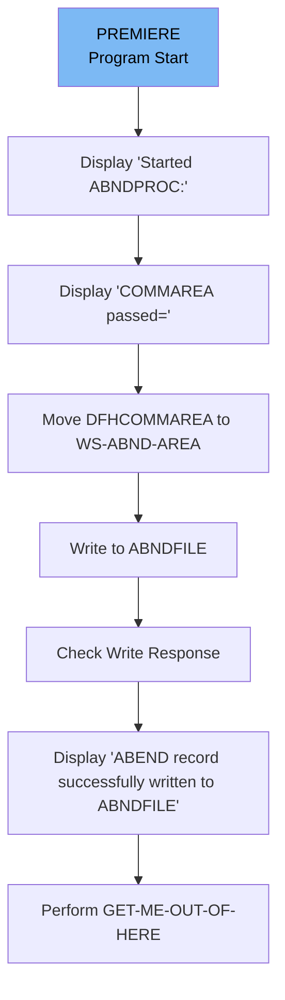

# Handling Abnormal Terminations (ABNDPROC)

The ABNDPROC program is responsible for handling abnormal terminations (ABENDs) in the system. It logs ABEND records to a VSAM file named ABNDFILE. The program starts by displaying a message indicating its initiation, processes the data passed through DFHCOMMAREA, writes the data to ABNDFILE, checks the write response, and finally returns control to CICS.

The ABNDPROC program starts by displaying a start message, then it processes the data passed to it, writes this data to a file, checks if the write was successful, and finally returns control to the system.

Lets' zoom into the flow:



<SwmSnippet path="/src/base/cobol_src/ABNDPROC.cbl" line="135">

---

### Display 'Started ABNDPROC:'

First, the program displays the message 'Started ABNDPROC:' to indicate the start of the ABNDPROC process.

```cobol
      D    DISPLAY 'Started ABNDPROC:'.
```

---

</SwmSnippet>

<SwmSnippet path="/src/base/cobol_src/ABNDPROC.cbl" line="136">

---

### Display 'COMMAREA passed='

Next, it displays the contents of <SwmToken path="src/base/cobol_src/ABNDPROC.cbl" pos="136:12:12" line-data="      D    DISPLAY &#39;COMMAREA passed=&#39; DFHCOMMAREA.">`DFHCOMMAREA`</SwmToken> to show the data passed to the program.

```cobol
      D    DISPLAY 'COMMAREA passed=' DFHCOMMAREA.
```

---

</SwmSnippet>

<SwmSnippet path="/src/base/cobol_src/ABNDPROC.cbl" line="139">

---

### Move DFHCOMMAREA to <SwmToken path="src/base/cobol_src/ABNDPROC.cbl" pos="139:7:11" line-data="           MOVE DFHCOMMAREA TO WS-ABND-AREA.">`WS-ABND-AREA`</SwmToken>

Then, the contents of <SwmToken path="src/base/cobol_src/ABNDPROC.cbl" pos="139:3:3" line-data="           MOVE DFHCOMMAREA TO WS-ABND-AREA.">`DFHCOMMAREA`</SwmToken> are moved to <SwmToken path="src/base/cobol_src/ABNDPROC.cbl" pos="139:7:11" line-data="           MOVE DFHCOMMAREA TO WS-ABND-AREA.">`WS-ABND-AREA`</SwmToken> for further processing.

```cobol
           MOVE DFHCOMMAREA TO WS-ABND-AREA.
```

---

</SwmSnippet>

<SwmSnippet path="/src/base/cobol_src/ABNDPROC.cbl" line="141">

---

### Write to ABNDFILE

The program writes the contents of <SwmToken path="src/base/cobol_src/ABNDPROC.cbl" pos="143:3:7" line-data="              FROM(WS-ABND-AREA)">`WS-ABND-AREA`</SwmToken> to the VSAM file <SwmToken path="src/base/cobol_src/ABNDPROC.cbl" pos="142:4:4" line-data="              FILE(&#39;ABNDFILE&#39;)">`ABNDFILE`</SwmToken>. This step is crucial for logging the ABEND record.

```cobol
           EXEC CICS WRITE
              FILE('ABNDFILE')
              FROM(WS-ABND-AREA)
              RIDFLD(ABND-VSAM-KEY)
              RESP(WS-CICS-RESP)
              RESP2(WS-CICS-RESP2)
           END-EXEC.
```

---

</SwmSnippet>

<SwmSnippet path="/src/base/cobol_src/ABNDPROC.cbl" line="149">

---

### Check Write Response

If the write operation is not successful (<SwmToken path="src/base/cobol_src/ABNDPROC.cbl" pos="149:3:7" line-data="           IF WS-CICS-RESP NOT= DFHRESP(NORMAL)">`WS-CICS-RESP`</SwmToken> is not equal to <SwmToken path="src/base/cobol_src/ABNDPROC.cbl" pos="149:12:15" line-data="           IF WS-CICS-RESP NOT= DFHRESP(NORMAL)">`DFHRESP(NORMAL)`</SwmToken>), an error message is displayed, and the program returns control to CICS.

```cobol
           IF WS-CICS-RESP NOT= DFHRESP(NORMAL)
              DISPLAY '*********************************************'
              DISPLAY '**** Unable to write to the file ABNDFILE !!!'
              DISPLAY 'RESP=' WS-CICS-RESP ' RESP2=' WS-CICS-RESP2
              DISPLAY '*********************************************'

              EXEC CICS RETURN
              END-EXEC

           END-IF.
```

---

</SwmSnippet>

<SwmSnippet path="/src/base/cobol_src/ABNDPROC.cbl" line="160">

---

### Display 'ABEND record successfully written to ABNDFILE'

If the write operation is successful, a success message is displayed along with the contents of <SwmToken path="src/base/cobol_src/ABNDPROC.cbl" pos="161:5:9" line-data="      D    DISPLAY WS-ABND-AREA.">`WS-ABND-AREA`</SwmToken>.

```cobol
      D    DISPLAY 'ABEND record successfully written to ABNDFILE'.
      D    DISPLAY WS-ABND-AREA.
```

---

</SwmSnippet>

<SwmSnippet path="/src/base/cobol_src/ABNDPROC.cbl" line="163">

---

### Perform <SwmToken path="src/base/cobol_src/ABNDPROC.cbl" pos="163:3:11" line-data="           PERFORM GET-ME-OUT-OF-HERE.">`GET-ME-OUT-OF-HERE`</SwmToken>

Finally, the program performs the <SwmToken path="src/base/cobol_src/ABNDPROC.cbl" pos="163:3:11" line-data="           PERFORM GET-ME-OUT-OF-HERE.">`GET-ME-OUT-OF-HERE`</SwmToken> section to return control to CICS.

```cobol
           PERFORM GET-ME-OUT-OF-HERE.
```

---

</SwmSnippet>

&nbsp;

*This is an auto-generated document by Swimm 🌊 and has not yet been verified by a human*

<SwmMeta version="3.0.0" repo-id="Z2l0aHViJTNBJTNBY2ljcy1iYW5raW5nLXNhbXBsZS1hcHBsaWNhdGlvbi1jYnNhLUlCTS1EZW1vJTNBJTNBU3dpbW0tRGVtbw==" repo-name="cics-banking-sample-application-cbsa-IBM-Demo"></SwmMeta>
