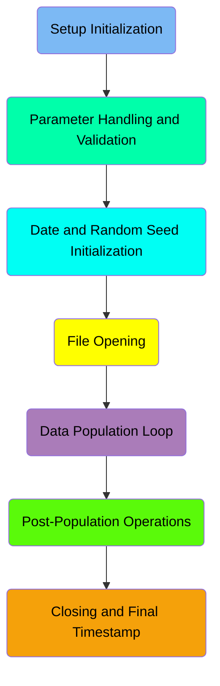
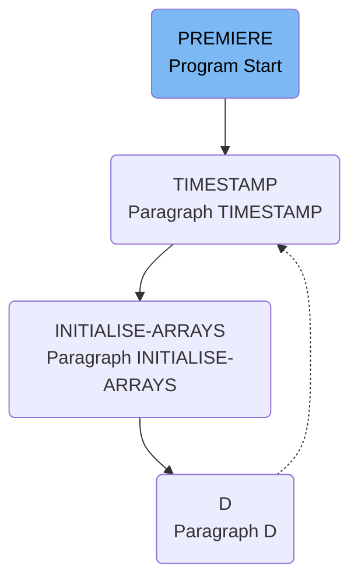
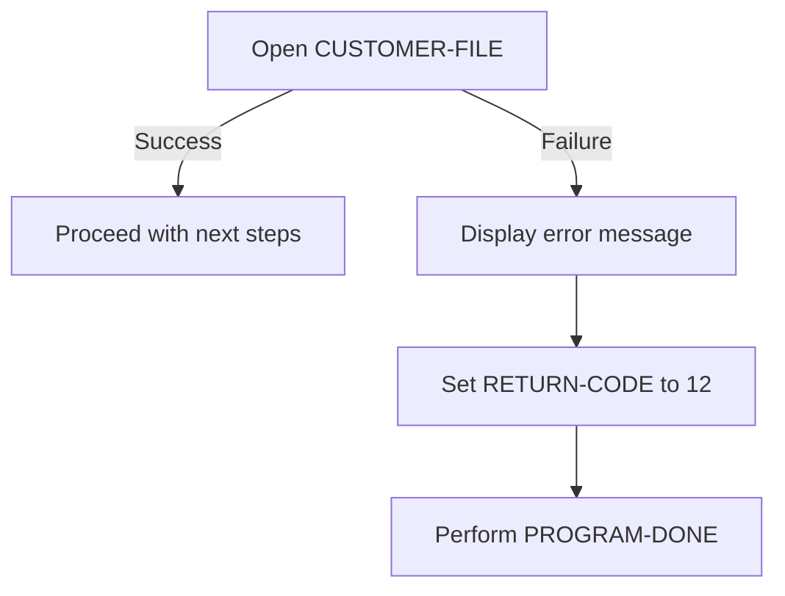
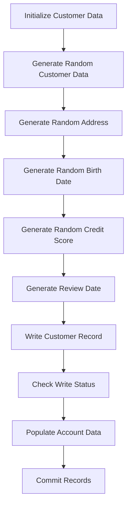
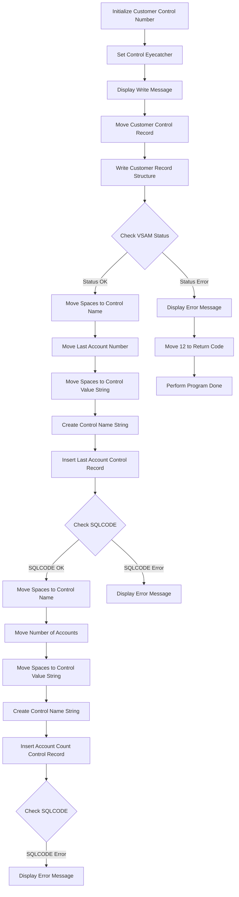
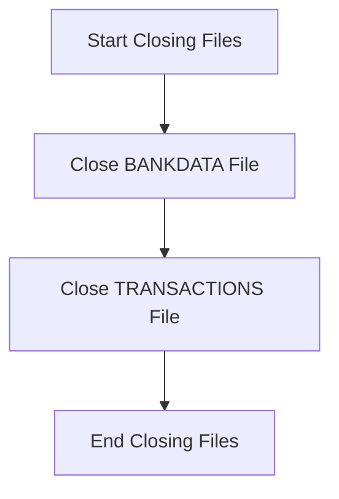

# Initializing Data (BANKDATA)

The BANKDATA program is responsible for initializing and populating customer and account data in a simulated banking application. The program achieves this by setting up initial parameters, validating input, generating random customer data, and performing database operations to insert and delete records. The program also handles file operations and ensures data integrity through various validation and commit processes.

The BANKDATA program starts by initializing parameters and validating input. It then generates random customer data, including names, addresses, birth dates, and credit scores. The program writes this data to the CUSTOMER and ACCOUNT datastores, performs necessary database operations, and commits the records to ensure data integrity. Finally, it closes the files and logs the operations for tracking purposes.

Here is a high level diagram of the program:



## Setup Initialization



<SwmSnippet path="/src/base/cobol_src/BANKDATA.cbl" line="369">

---

### Starting the PREMIERE Section

First, the <SwmToken path="src/base/cobol_src/BANKDATA.cbl" pos="369:1:1" line-data="       PREMIERE SECTION.">`PREMIERE`</SwmToken> section starts by setting a message 'Starting BANKDATA' to the <SwmToken path="src/base/cobol_src/BANKDATA.cbl" pos="372:3:5" line-data="             to TIMESTAMP-FUNCTION">`TIMESTAMP-FUNCTION`</SwmToken> variable. This is followed by a call to the <SwmToken path="src/base/cobol_src/BANKDATA.cbl" pos="372:3:3" line-data="             to TIMESTAMP-FUNCTION">`TIMESTAMP`</SwmToken> paragraph to log the start time.

```cobol
       PREMIERE SECTION.
       A010.
           MOVE 'Starting BANKDATA'
             to TIMESTAMP-FUNCTION
           perform TIMESTAMP
```

---

</SwmSnippet>

<SwmSnippet path="/src/base/cobol_src/BANKDATA.cbl" line="1441">

---

### Logging the Start Time

The <SwmToken path="src/base/cobol_src/BANKDATA.cbl" pos="1441:1:1" line-data="       TIMESTAMP SECTION.">`TIMESTAMP`</SwmToken> paragraph logs the current time by calling the 'CEEGMT' and 'CEEDATM' functions to get the current GMT time and format it. This helps in tracking when the <SwmToken path="src/base/cobol_src/BANKDATA.cbl" pos="369:1:1" line-data="       PREMIERE SECTION.">`PREMIERE`</SwmToken> section started.

```cobol
       TIMESTAMP SECTION.
           CALL 'CEEGMT' USING BY REFERENCE gmt-lilian
                                           BY REFERENCE gmt-seconds
                                           BY REFERENCE fc

      ***
      *** Move gmt to an integer so that we don't round up
      *** in the division
      ***
           MOVE gmt-seconds TO period-next-f.
           COMPUTE period-next   = period-next-f.

      ***
      *** Convert back into text
      ***
           MOVE 14               TO datm-length.
           MOVE 'YYYYMMDDHHMISS' TO datm-format.
           CALL 'CEEDATM' USING BY REFERENCE period-next
                                BY REFERENCE datm-picture
                                BY REFERENCE datm-conv
                                BY REFERENCE fc.
```

---

</SwmSnippet>

<SwmSnippet path="/src/base/cobol_src/BANKDATA.cbl" line="376">

---

### Initializing Arrays

Next, a message 'About to initialise arrays' is displayed. The <SwmToken path="src/base/cobol_src/BANKDATA.cbl" pos="379:3:5" line-data="           PERFORM INITIALISE-ARRAYS.">`INITIALISE-ARRAYS`</SwmToken> paragraph is then performed to set up various arrays used in the program.

```cobol
      * Initialise the arrays
      *
      D    DISPLAY 'About to initialise arrays'.
           PERFORM INITIALISE-ARRAYS.
```

---

</SwmSnippet>

<SwmSnippet path="/src/base/cobol_src/BANKDATA.cbl" line="930">

---

### Setting Up Arrays

The <SwmToken path="src/base/cobol_src/BANKDATA.cbl" pos="930:1:3" line-data="       INITIALISE-ARRAYS SECTION.">`INITIALISE-ARRAYS`</SwmToken> paragraph initializes several arrays with predefined values. This includes setting up titles, forenames, surnames, street names, towns, account types, and interest rates. This setup is crucial for the subsequent operations in the program.

```cobol
       INITIALISE-ARRAYS SECTION.
       IA010.

           MOVE TITLE-ALPHABET TO TITLE-WORDS.

           MOVE 50 TO FORENAMES-CNT.

           MOVE 'Michael' TO FORENAME(01).
           MOVE 'Will'    TO FORENAME(02).
           MOVE 'Geoff'   TO FORENAME(03).
           MOVE 'Chris'   TO FORENAME(04).
           MOVE 'Dave'    TO FORENAME(05).
           MOVE 'Luke'    TO FORENAME(06).
           MOVE 'Adam'    TO FORENAME(07).
           MOVE 'Giuseppe' TO FORENAME(08).
           MOVE 'James'   TO FORENAME(09).
           MOVE 'Jon'     TO FORENAME(10).
           MOVE 'Andy'    TO FORENAME(11).
           MOVE 'Lou'     TO FORENAME(12).
           MOVE 'Robert'  TO FORENAME(13).
           MOVE 'Sam'     TO FORENAME(14).
```

---

</SwmSnippet>

## Parameter Handling and Validation

```mermaid
graph TD
  A[Get Parameters] --> B[Validate Parameters]
  B --> C[Get Today's Date]
  C --> D[Display About to Delete DB2 Rows]

%% Swimm:
%% graph TD
%%   A[Get Parameters] --> B[Validate Parameters]
%%   B --> C[Get Today's Date]
%%   C --> D[Display About to Delete <SwmToken path="src/base/cobol_src/BANKDATA.cbl" pos="417:12:12" line-data="      D    DISPLAY &#39;About to delete DB2 rows&#39;.">`DB2`</SwmToken> Rows]
```



<SwmSnippet path="/src/base/cobol_src/BANKDATA.cbl" line="383">

---

### Get Parameters

First, the parameters are extracted from the input string <SwmToken path="src/base/cobol_src/BANKDATA.cbl" pos="385:3:3" line-data="           UNSTRING PARM(1:PARM-LENGTH)">`PARM`</SwmToken> using the <SwmToken path="src/base/cobol_src/BANKDATA.cbl" pos="385:1:1" line-data="           UNSTRING PARM(1:PARM-LENGTH)">`UNSTRING`</SwmToken> command. These parameters include <SwmToken path="src/base/cobol_src/BANKDATA.cbl" pos="387:3:5" line-data="                    INTO START-KEY">`START-KEY`</SwmToken>, <SwmToken path="src/base/cobol_src/BANKDATA.cbl" pos="388:1:3" line-data="                         END-KEY">`END-KEY`</SwmToken>, <SwmToken path="src/base/cobol_src/BANKDATA.cbl" pos="389:1:3" line-data="                         STEP-KEY">`STEP-KEY`</SwmToken>, and <SwmToken path="src/base/cobol_src/BANKDATA.cbl" pos="390:1:3" line-data="                         RANDOM-SEED.">`RANDOM-SEED`</SwmToken>. This step is crucial for setting up the range and steps for customer data processing.

```cobol
      * Get the parameters
      *
           UNSTRING PARM(1:PARM-LENGTH)
                    DELIMITED BY SPACE OR ','
                    INTO START-KEY
                         END-KEY
                         STEP-KEY
                         RANDOM-SEED.
```

---

</SwmSnippet>

<SwmSnippet path="/src/base/cobol_src/BANKDATA.cbl" line="393">

---

### Display Input Parameters

Next, the extracted parameters are displayed for verification. This helps in ensuring that the correct values have been parsed and are ready for further processing.

```cobol
      D    DISPLAY 'INPUT PARMS ARE: START-KEY=' START-KEY
      D             ' END-KEY=' END-KEY ' STEP-KEY=' STEP-KEY
      D             ' RANDOM-SEED=' RANDOM-SEED '
```

---

</SwmSnippet>

<SwmSnippet path="/src/base/cobol_src/BANKDATA.cbl" line="397">

---

### Validate Parameters

Then, the parameters are validated. If <SwmToken path="src/base/cobol_src/BANKDATA.cbl" pos="397:3:5" line-data="           IF END-KEY &lt; START-KEY">`END-KEY`</SwmToken> is less than <SwmToken path="src/base/cobol_src/BANKDATA.cbl" pos="397:9:11" line-data="           IF END-KEY &lt; START-KEY">`START-KEY`</SwmToken>, an error message is displayed and the process is terminated. Similarly, if <SwmToken path="src/base/cobol_src/BANKDATA.cbl" pos="389:1:3" line-data="                         STEP-KEY">`STEP-KEY`</SwmToken> is zero, an error message is displayed and the process is terminated. These validations ensure that the input parameters are logical and prevent any erroneous operations.

```cobol
           IF END-KEY < START-KEY
             MOVE 12 TO RETURN-CODE
             DISPLAY 'Final customer number cannot be smaller than '
               'first customer number'
             GOBACK
           END-IF
           IF step-key = zero
             MOVE 12 TO RETURN-CODE
             DISPLAY 'Gap between customers cannot be zero'
             GOBACK
           END-IF
```

---

</SwmSnippet>

<SwmSnippet path="/src/base/cobol_src/BANKDATA.cbl" line="410">

---

### Get Today's Date

Moving to the next step, the current date is fetched and stored as an integer. This is done by performing the <SwmToken path="src/base/cobol_src/BANKDATA.cbl" pos="412:3:7" line-data="           PERFORM GET-TODAYS-DATE.">`GET-TODAYS-DATE`</SwmToken> section.

```cobol
      * Get today's date and store it as an INTEGER
      *
           PERFORM GET-TODAYS-DATE.
```

---

</SwmSnippet>

<SwmSnippet path="/src/base/cobol_src/BANKDATA.cbl" line="1392">

---

#### <SwmToken path="src/base/cobol_src/BANKDATA.cbl" pos="1392:1:5" line-data="       GET-TODAYS-DATE SECTION.">`GET-TODAYS-DATE`</SwmToken>

The <SwmToken path="src/base/cobol_src/BANKDATA.cbl" pos="1392:1:5" line-data="       GET-TODAYS-DATE SECTION.">`GET-TODAYS-DATE`</SwmToken> section retrieves the current date using the <SwmToken path="src/base/cobol_src/BANKDATA.cbl" pos="1396:5:7" line-data="           MOVE FUNCTION CURRENT-DATE TO WS-CURRENT-DATE-DATA.">`CURRENT-DATE`</SwmToken> function and converts it into an integer format. This integer date is then stored in <SwmToken path="src/base/cobol_src/BANKDATA.cbl" pos="1400:3:7" line-data="           COMPUTE WS-TODAY-INT =">`WS-TODAY-INT`</SwmToken> for further use in the program.

```cobol
       GET-TODAYS-DATE SECTION.
       GTD010.
      D    DISPLAY 'IN GET-TODAYS-DATE SECTION'.

           MOVE FUNCTION CURRENT-DATE TO WS-CURRENT-DATE-DATA.

           MOVE WS-CURRENT-DATE-DATA (1:8) TO WS-CURRENT-DATE-9.

           COMPUTE WS-TODAY-INT =
              FUNCTION INTEGER-OF-DATE (WS-CURRENT-DATE-9).

       GTD999.
           EXIT.
```

---

</SwmSnippet>

### Interim Summary

So far, we saw how the program initializes by setting up timestamps and arrays, and then handles and validates input parameters. Now, we will focus on the process of deleting rows from the <SwmToken path="src/base/cobol_src/BANKDATA.cbl" pos="417:12:12" line-data="      D    DISPLAY &#39;About to delete DB2 rows&#39;.">`DB2`</SwmToken> tables, including the ACCOUNT and CONTROL tables, and ensuring the deletions are committed.

## Date and Random Seed Initialization

```mermaid
graph TD
  A[Display 'About to delete DB2 rows'] --> B[Delete rows from ACCOUNT table]
  B --> C[Check SQL code for ACCOUNT table]
  C --> D[Delete rows from CONTROL table - ACCOUNT-LAST]
  D --> E[Check SQL code for CONTROL table - ACCOUNT-LAST]
  E --> F[Delete rows from CONTROL table - ACCOUNT-COUNT]
  F --> G[Check SQL code for CONTROL table - ACCOUNT-COUNT]
  G --> H[Commit work]
  H --> I[Display 'Back from delete DB2 rows']

%% Swimm:
%% graph TD
%%   A[Display 'About to delete <SwmToken path="src/base/cobol_src/BANKDATA.cbl" pos="417:12:12" line-data="      D    DISPLAY &#39;About to delete DB2 rows&#39;.">`DB2`</SwmToken> rows'] --> B[Delete rows from ACCOUNT table]
%%   B --> C[Check SQL code for ACCOUNT table]
%%   C --> D[Delete rows from CONTROL table - ACCOUNT-LAST]
%%   D --> E[Check SQL code for CONTROL table - ACCOUNT-LAST]
%%   E --> F[Delete rows from CONTROL table - ACCOUNT-COUNT]
%%   F --> G[Check SQL code for CONTROL table - ACCOUNT-COUNT]
%%   G --> H[Commit work]
%%   H --> I[Display 'Back from delete <SwmToken path="src/base/cobol_src/BANKDATA.cbl" pos="417:12:12" line-data="      D    DISPLAY &#39;About to delete DB2 rows&#39;.">`DB2`</SwmToken> rows']
```



<SwmSnippet path="/src/base/cobol_src/BANKDATA.cbl" line="417">

---

### Display 'About to delete <SwmToken path="src/base/cobol_src/BANKDATA.cbl" pos="417:12:12" line-data="      D    DISPLAY &#39;About to delete DB2 rows&#39;.">`DB2`</SwmToken> rows'

First, we display a message indicating that the process of deleting <SwmToken path="src/base/cobol_src/BANKDATA.cbl" pos="417:12:12" line-data="      D    DISPLAY &#39;About to delete DB2 rows&#39;.">`DB2`</SwmToken> rows is about to begin. This helps in tracking the flow of operations.

```cobol
      D    DISPLAY 'About to delete DB2 rows'.
```

---

</SwmSnippet>

<SwmSnippet path="/src/base/cobol_src/BANKDATA.cbl" line="1183">

---

### Delete rows from ACCOUNT table

Moving to the <SwmToken path="src/base/cobol_src/BANKDATA.cbl" pos="1183:1:5" line-data="       DELETE-DB2-ROWS SECTION.">`DELETE-DB2-ROWS`</SwmToken> section, we start by deleting rows from the ACCOUNT table where the <SwmToken path="src/base/cobol_src/BANKDATA.cbl" pos="1194:3:3" line-data="              WHERE ACCOUNT_SORTCODE = :HV-ACCOUNT-SORT-CODE">`ACCOUNT_SORTCODE`</SwmToken> matches the provided <SwmToken path="src/base/cobol_src/BANKDATA.cbl" pos="415:19:19" line-data="      * Delete the DB2 TABLE contents that match the SortCode">`SortCode`</SwmToken>. This ensures that only relevant rows are deleted.

```cobol
       DELETE-DB2-ROWS SECTION.
       DBR010.
      *
      * Delete the ACCOUNT table data
      *
           MOVE SORTCODE TO HV-ACCOUNT-SORT-CODE.
           MOVE 'Deleting from ACCOUNT table'
             to TIMESTAMP-FUNCTION
           perform TIMESTAMP
           EXEC SQL
              DELETE FROM ACCOUNT
              WHERE ACCOUNT_SORTCODE = :HV-ACCOUNT-SORT-CODE
           END-EXEC.
```

---

</SwmSnippet>

<SwmSnippet path="/src/base/cobol_src/BANKDATA.cbl" line="1199">

---

### Check SQL code for ACCOUNT table

Next, we check the SQL code to ensure the deletion was successful. If the SQL code is not OK (0) or NOTFND (+100), we handle the error by displaying an appropriate message and setting the return code.

```cobol
      * Check the SQL code if it was NOT OK (0) or NOTFND (+100)
      * then abend
      *
           MOVE 'Deleting from ACCOUNT table COMPLETE'
             to TIMESTAMP-FUNCTION
           perform TIMESTAMP
           IF SQLCODE NOT = +100 AND
           SQLCODE NOT = 0

              MOVE SQLCODE TO DISP-SQLCD
              IF SQLCODE < 0
                 MOVE '-' TO DISP-SIGN
              ELSE
                 MOVE '+' TO DISP-SIGN
              END-IF
              EVALUATE TRUE
              WHEN SQLERRD(3) EQUAL 13172878
                 MOVE 'TIMEOUT  (00C900E)' TO DISP-REASON-CODE
              WHEN SQLERRD(3) EQUAL 13172872
                 MOVE 'DEADLOCK (00C9088)' TO DISP-REASON-CODE
              WHEN OTHER
```

---

</SwmSnippet>

<SwmSnippet path="/src/base/cobol_src/BANKDATA.cbl" line="1243">

---

### Delete rows from CONTROL table - <SwmToken path="src/base/cobol_src/BANKDATA.cbl" pos="1248:2:4" line-data="           &#39;ACCOUNT-LAST&#39; DELIMITED BY SIZE">`ACCOUNT-LAST`</SwmToken>

Then, we delete rows from the CONTROL table where the <SwmToken path="src/base/cobol_src/BANKDATA.cbl" pos="1258:3:3" line-data="              WHERE CONTROL_NAME = :HV-CONTROL-NAME">`CONTROL_NAME`</SwmToken> is constructed using the <SwmToken path="src/base/cobol_src/BANKDATA.cbl" pos="415:19:19" line-data="      * Delete the DB2 TABLE contents that match the SortCode">`SortCode`</SwmToken> and <SwmToken path="src/base/cobol_src/BANKDATA.cbl" pos="1248:2:4" line-data="           &#39;ACCOUNT-LAST&#39; DELIMITED BY SIZE">`ACCOUNT-LAST`</SwmToken>. This step ensures that related control data is also removed.

```cobol
      * Delete the CONTROL table data
      *
           MOVE SPACES TO HV-CONTROL-NAME
           STRING SORTCODE DELIMITED BY SIZE
           '-' DELIMITED BY SIZE
           'ACCOUNT-LAST' DELIMITED BY SIZE
           INTO HV-CONTROL-NAME

           MOVE 'Deleting from CONTROL table'
             to TIMESTAMP-FUNCTION.

           PERFORM TIMESTAMP.

           EXEC SQL
              DELETE FROM CONTROL
              WHERE CONTROL_NAME = :HV-CONTROL-NAME
           END-EXEC.
```

---

</SwmSnippet>

<SwmSnippet path="/src/base/cobol_src/BANKDATA.cbl" line="1263">

---

### Check SQL code for CONTROL table - <SwmToken path="src/base/cobol_src/BANKDATA.cbl" pos="611:2:4" line-data="           &#39;ACCOUNT-LAST&#39; DELIMITED BY SIZE">`ACCOUNT-LAST`</SwmToken>

We again check the SQL code to ensure the deletion from the CONTROL table was successful. Similar to the previous check, we handle any errors by displaying messages and setting the return code.

```cobol
      *    Check the SQL code if it was NOT OK (0) or NOTFND (+100)
      *    then abend
      *
           MOVE 'Deleting from CONTROL table COMPLETE'
             to TIMESTAMP-FUNCTION.

           PERFORM TIMESTAMP.

           IF SQLCODE NOT = +100 AND
           SQLCODE NOT = 0

              MOVE SQLCODE TO DISP-SQLCD
              IF SQLCODE < 0
                 MOVE '-' TO DISP-SIGN
              ELSE
                 MOVE '+' TO DISP-SIGN
              END-IF
              EVALUATE TRUE
              WHEN SQLERRD(3) EQUAL 13172878
                 MOVE 'TIMEOUT  (00C900E)' TO DISP-REASON-CODE
              WHEN SQLERRD(3) EQUAL 13172872
```

---

</SwmSnippet>

<SwmSnippet path="/src/base/cobol_src/BANKDATA.cbl" line="1310">

---

### Delete rows from CONTROL table - <SwmToken path="src/base/cobol_src/BANKDATA.cbl" pos="1314:2:4" line-data="           &#39;ACCOUNT-COUNT&#39; DELIMITED BY SIZE">`ACCOUNT-COUNT`</SwmToken>

Next, we delete rows from the CONTROL table where the <SwmToken path="src/base/cobol_src/BANKDATA.cbl" pos="1324:3:3" line-data="              WHERE CONTROL_NAME = :HV-CONTROL-NAME">`CONTROL_NAME`</SwmToken> is constructed using the <SwmToken path="src/base/cobol_src/BANKDATA.cbl" pos="415:19:19" line-data="      * Delete the DB2 TABLE contents that match the SortCode">`SortCode`</SwmToken> and <SwmToken path="src/base/cobol_src/BANKDATA.cbl" pos="1314:2:4" line-data="           &#39;ACCOUNT-COUNT&#39; DELIMITED BY SIZE">`ACCOUNT-COUNT`</SwmToken>. This step ensures that all related control data is removed.

```cobol
      *
           MOVE SPACES TO HV-CONTROL-NAME
           STRING SORTCODE DELIMITED BY SIZE
           '-' DELIMITED BY SIZE
           'ACCOUNT-COUNT' DELIMITED BY SIZE
           INTO HV-CONTROL-NAME

           MOVE 'Deleting from CONTROL table'
             to TIMESTAMP-FUNCTION.

           PERFORM TIMESTAMP.

           EXEC SQL
              DELETE FROM CONTROL
              WHERE CONTROL_NAME = :HV-CONTROL-NAME
           END-EXEC.
```

---

</SwmSnippet>

<SwmSnippet path="/src/base/cobol_src/BANKDATA.cbl" line="1329">

---

### Check SQL code for CONTROL table - <SwmToken path="src/base/cobol_src/BANKDATA.cbl" pos="640:2:4" line-data="           &#39;ACCOUNT-COUNT&#39; DELIMITED BY SIZE">`ACCOUNT-COUNT`</SwmToken>

We perform another SQL code check to ensure the deletion from the CONTROL table was successful. Any errors are handled similarly by displaying messages and setting the return code.

```cobol
      *    Check the SQL code if it was NOT OK (0) or NOTFND (+100)
      *    then abend
      *
           MOVE 'Deleting from CONTROL table COMPLETE'
             to TIMESTAMP-FUNCTION.

           PERFORM TIMESTAMP.

           IF SQLCODE NOT = +100 AND
           SQLCODE NOT = 0

              MOVE SQLCODE TO DISP-SQLCD
              IF SQLCODE < 0
                 MOVE '-' TO DISP-SIGN
              ELSE
                 MOVE '+' TO DISP-SIGN
              END-IF
              EVALUATE TRUE
              WHEN SQLERRD(3) EQUAL 13172878
                 MOVE 'TIMEOUT  (00C900E)' TO DISP-REASON-CODE
              WHEN SQLERRD(3) EQUAL 13172872
```

---

</SwmSnippet>

<SwmSnippet path="/src/base/cobol_src/BANKDATA.cbl" line="1375">

---

### Commit work

Finally, we commit the work to ensure that all deletions are saved and the database is updated accordingly.

```cobol
           EXEC SQL
              COMMIT WORK
           END-EXEC.
```

---

</SwmSnippet>

<SwmSnippet path="/src/base/cobol_src/BANKDATA.cbl" line="420">

---

### Display 'Back from delete <SwmToken path="src/base/cobol_src/BANKDATA.cbl" pos="420:12:12" line-data="      D    DISPLAY &#39;Back from delete DB2 rows&#39;.">`DB2`</SwmToken> rows'

After completing the deletions and committing the work, we display a message indicating that the process of deleting <SwmToken path="src/base/cobol_src/BANKDATA.cbl" pos="420:12:12" line-data="      D    DISPLAY &#39;Back from delete DB2 rows&#39;.">`DB2`</SwmToken> rows is complete. This helps in tracking the flow of operations.

```cobol
      D    DISPLAY 'Back from delete DB2 rows'.
```

---

</SwmSnippet>

## File Opening

This is the next section of the flow.



<SwmSnippet path="/src/base/cobol_src/BANKDATA.cbl" line="449">

---

### Opening the Customer File

First, the code attempts to open the <SwmToken path="src/base/cobol_src/BANKDATA.cbl" pos="449:5:7" line-data="           OPEN OUTPUT CUSTOMER-FILE.">`CUSTOMER-FILE`</SwmToken> for output. This is a crucial step as it prepares the file for subsequent operations such as writing customer data.

```cobol
           OPEN OUTPUT CUSTOMER-FILE.
```

---

</SwmSnippet>

<SwmSnippet path="/src/base/cobol_src/BANKDATA.cbl" line="450">

---

### Handling File Open Errors

Next, the code checks if the <SwmToken path="src/base/cobol_src/BANKDATA.cbl" pos="450:3:7" line-data="           IF CUSTOMER-VSAM-STATUS NOT EQUAL &#39;00&#39; THEN">`CUSTOMER-VSAM-STATUS`</SwmToken> is not equal to '00', which indicates an error in opening the file. If an error is detected, it displays an error message with the status code, sets the <SwmToken path="src/base/cobol_src/BANKDATA.cbl" pos="453:7:9" line-data="               MOVE 12 TO RETURN-CODE">`RETURN-CODE`</SwmToken> to 12 to indicate an error, and performs the <SwmToken path="src/base/cobol_src/BANKDATA.cbl" pos="454:3:5" line-data="               PERFORM PROGRAM-DONE">`PROGRAM-DONE`</SwmToken> routine to handle the termination of the program.

```cobol
           IF CUSTOMER-VSAM-STATUS NOT EQUAL '00' THEN
               DISPLAY 'Error opening CUSTOMER file, status='
                       CUSTOMER-VSAM-STATUS
               MOVE 12 TO RETURN-CODE
               PERFORM PROGRAM-DONE
           END-IF.
```

---

</SwmSnippet>

## Data Population Loop



<SwmSnippet path="/src/base/cobol_src/BANKDATA.cbl" line="459">

---

### Initialize Customer Data

First, we initialize the customer data by setting up the timestamp, commit count, and customer/account numbers. This sets the stage for generating new customer records.

```cobol
      * Populate the CUSTOMER file
      *
           MOVE 'Populating Customer + Account files'
             to TIMESTAMP-FUNCTION
           perform TIMESTAMP
           MOVE ZERO TO COMMIT-COUNT
           MOVE ZERO TO LAST-CUSTOMER-NUMBER NUMBER-OF-CUSTOMERS
           MOVE ZERO TO LAST-ACCOUNT-NUMBER NUMBER-OF-ACCOUNTS
```

---

</SwmSnippet>

<SwmSnippet path="/src/base/cobol_src/BANKDATA.cbl" line="467">

---

### Generate Random Customer Data

Next, we loop through a range of keys to generate customer data. For each key, we initialize the customer record and set a unique customer number.

```cobol
           PERFORM TEST BEFORE
                   VARYING NEXT-KEY FROM START-KEY BY STEP-KEY
                     UNTIL NEXT-KEY > END-KEY

               INITIALIZE CUSTOMER-RECORD IN CUSTOMER-RECORD-STRUCTURE

               SET CUSTOMER-EYECATCHER-VALUE TO TRUE

               MOVE NEXT-KEY TO CUSTOMER-NUMBER
               MOVE NEXT-KEY TO LAST-CUSTOMER-NUMBER
               ADD 1 TO NUMBER-OF-CUSTOMERS GIVING NUMBER-OF-CUSTOMERS
```

---

</SwmSnippet>

<SwmSnippet path="/src/base/cobol_src/BANKDATA.cbl" line="478">

---

### Generate Random Address

Then, we generate random values for the customer's title, forenames, initials, surname, house number, street names, and town. These values are combined to form the customer's name and address.

```cobol

      D        DISPLAY 'Generating data for customer ' customer-number

               COMPUTE TITLE-NUMBER = ((36 - 1)
                                        * FUNCTION RANDOM) + 1
               COMPUTE FORENAMES-PTR = ((FORENAMES-CNT - 1)
                                        * FUNCTION RANDOM) + 1
               COMPUTE INITIALS-PTR  = ((INITIALS-CNT - 1)
                                        * FUNCTION RANDOM) + 1
               COMPUTE SURNAMES-PTR  = ((SURNAMES-CNT - 1)
                                        * FUNCTION RANDOM) + 1
               COMPUTE HOUSE-NUMBER  = (99
                                        * FUNCTION RANDOM) + 1
               COMPUTE STREET-NAME-T-PTR  = ((STREET-NAME-T-CNT - 1)
                                        * FUNCTION RANDOM) + 1
               COMPUTE STREET-NAME-R-PTR  = ((STREET-NAME-R-CNT - 1)
                                        * FUNCTION RANDOM) + 1
               COMPUTE TOWN-PTR           = ((TOWN-COUNT - 1)
                                        * FUNCTION RANDOM) + 1

               MOVE SPACES TO CUSTOMER-NAME
```

---

</SwmSnippet>

<SwmSnippet path="/src/base/cobol_src/BANKDATA.cbl" line="522">

---

### Generate Random Birth Date

Moving to the next step, we generate a random birth date for the customer, ensuring the date is within a realistic range.

```cobol

               COMPUTE CUSTOMER-BIRTH-DAY =  ((28 - 1)
                                        * FUNCTION RANDOM) + 1
               COMPUTE CUSTOMER-BIRTH-MONTH =  ((12 - 1)
                                        * FUNCTION RANDOM) + 1
               COMPUTE CUSTOMER-BIRTH-YEAR =  ((2000 - 1900)
                                        * FUNCTION RANDOM) + 1900
```

---

</SwmSnippet>

<SwmSnippet path="/src/base/cobol_src/BANKDATA.cbl" line="529">

---

### Generate Random Credit Score

We then generate a random credit score for the customer, which will be used in later processes.

```cobol

               MOVE SORTCODE TO
                  CUSTOMER-SORTCODE


               COMPUTE CUSTOMER-CREDIT-SCORE = ((999 - 1)
                                        * FUNCTION RANDOM) + 1
```

---

</SwmSnippet>

<SwmSnippet path="/src/base/cobol_src/BANKDATA.cbl" line="536">

---

### Generate Review Date

Next, we generate a random review date for the customer's credit score, ensuring it falls within 1 to 21 days from the current date. This date is then formatted and stored in the customer record.

```cobol

      *
      *        Generate the random credit score review date. This
      *        should be a date between 1 and 21 days from today
      *

               COMPUTE WS-REVIEW-DATE-ADD = ((21 - 1)
                                        * FUNCTION RANDOM) + 1

               COMPUTE WS-NEW-REVIEW-DATE-INT =
                  WS-TODAY-INT + WS-REVIEW-DATE-ADD

      *
      *        Convert the integer date back to YYYYMMDD format
      *        and store on the CUSTOMER record
      *
               COMPUTE WS-NEW-REVIEW-YYYYMMDD = FUNCTION
                  DATE-OF-INTEGER (WS-NEW-REVIEW-DATE-INT)

               MOVE WS-NEW-REVIEW-YYYYMMDD(1:4) TO
                  CUSTOMER-CS-REVIEW-YEAR
```

---

</SwmSnippet>

<SwmSnippet path="/src/base/cobol_src/BANKDATA.cbl" line="561">

---

### Write Customer Record

We write the populated customer record to the CUSTOMER datastore.

```cobol

               WRITE CUSTOMER-RECORD-STRUCTURE
```

---

</SwmSnippet>

<SwmSnippet path="/src/base/cobol_src/BANKDATA.cbl" line="563">

---

### Check Write Status

We check the status of the write operation. If there is an error, we display an error message and perform the program termination routine.

```cobol

               IF CUSTOMER-VSAM-STATUS NOT EQUAL '00' THEN
                   DISPLAY 'Error writing to VSAM file, status='
                           CUSTOMER-VSAM-STATUS
                   MOVE 12 TO RETURN-CODE
                   PERFORM PROGRAM-DONE
               END-IF
```

---

</SwmSnippet>

<SwmSnippet path="/src/base/cobol_src/BANKDATA.cbl" line="570">

---

### Populate Account Data

Having written the customer data, we now use some of this information to populate related data in the ACCOUNT datastore.

```cobol
      *
      * Having written out to the CUSTOMER datastore we now need to
      * use some of this information to populate related data on
      * on the ACCOUNT datastore.
      *

               PERFORM DEFINE-ACC
```

---

</SwmSnippet>

<SwmSnippet path="/src/base/cobol_src/BANKDATA.cbl" line="577">

---

### Commit Records

Finally, we increment the commit count and commit the records to the database every <SwmToken path="src/base/cobol_src/BANKDATA.cbl" pos="580:10:12" line-data="      D          DISPLAY &#39;Commit every 1,000 records or so&#39;">`1,000`</SwmToken> records to ensure data integrity.

```cobol

               ADD 1 TO COMMIT-COUNT GIVING COMMIT-COUNT
               IF COMMIT-COUNT > 1000
      D          DISPLAY 'Commit every 1,000 records or so'
                 EXEC SQL
                  COMMIT WORK
                 END-EXEC
                 MOVE ZERO TO COMMIT-COUNT
               END-IF
```

---

</SwmSnippet>

## Post-Population Operations

This is the next section of the flow.



<SwmSnippet path="/src/base/cobol_src/BANKDATA.cbl" line="589">

---

### Initialize Customer Control Number

First, the customer control number is initialized to '9999999999'. This sets a default value for the customer control record.

```cobol
           MOVE '9999999999' TO CUSTOMER-CONTROL-NUMBER
```

---

</SwmSnippet>

<SwmSnippet path="/src/base/cobol_src/BANKDATA.cbl" line="590">

---

### Set Control Eyecatcher

Moving to the next step, the control eyecatcher is set to true. This is likely used as a flag to indicate that the customer control record is active.

```cobol
           SET CUSTOMER-CONTROL-EYECATCHER-V TO TRUE
```

---

</SwmSnippet>

<SwmSnippet path="/src/base/cobol_src/BANKDATA.cbl" line="591">

---

### Display Write Message

Next, a message is displayed indicating that the customer control record is about to be written. This is useful for logging and debugging purposes.

```cobol
      D    DISPLAY 'ABOUT TO WRITE CUSTOMER-CONTROL-RECORD'
```

---

</SwmSnippet>

<SwmSnippet path="/src/base/cobol_src/BANKDATA.cbl" line="592">

---

### Move Customer Control Record

Then, the customer control record is moved to the customer record structure. This prepares the data for writing to the file.

```cobol
           MOVE CUSTOMER-CONTROL-RECORD
             TO CUSTOMER-RECORD IN CUSTOMER-RECORD-STRUCTURE
```

---

</SwmSnippet>

<SwmSnippet path="/src/base/cobol_src/BANKDATA.cbl" line="594">

---

### Write Customer Record Structure

The customer record structure is written to the file. This step persists the customer control record.

```cobol
           WRITE CUSTOMER-RECORD-STRUCTURE
```

---

</SwmSnippet>

<SwmSnippet path="/src/base/cobol_src/BANKDATA.cbl" line="595">

---

### Check VSAM Status

If the VSAM status is not '00', an error message is displayed, the return code is set to 12, and the program done routine is performed. This handles any errors that occur during the write operation.

```cobol
           IF CUSTOMER-VSAM-STATUS NOT EQUAL '00' THEN
                   DISPLAY 'Error writing CUSTOMER-CONTROL-RECORD file'
                   ', status=' CUSTOMER-VSAM-STATUS
                   MOVE 12 TO RETURN-CODE
                   PERFORM PROGRAM-DONE
           END-IF.
```

---

</SwmSnippet>

<SwmSnippet path="/src/base/cobol_src/BANKDATA.cbl" line="606">

---

### Move Spaces to Control Name

Moving to the next part, spaces are moved to the control name. This initializes the control name variable.

```cobol
           MOVE SPACES TO HV-CONTROL-NAME
```

---

</SwmSnippet>

<SwmSnippet path="/src/base/cobol_src/BANKDATA.cbl" line="607">

---

### Move Last Account Number

The last account number is moved to the control value number. This sets the value to be stored in the control record.

```cobol
           MOVE LAST-ACCOUNT-NUMBER TO HV-CONTROL-VALUE-NUM
```

---

</SwmSnippet>

<SwmSnippet path="/src/base/cobol_src/BANKDATA.cbl" line="608">

---

### Move Spaces to Control Value String

Spaces are moved to the control value string. This initializes the control value string variable.

```cobol
           MOVE SPACES TO HV-CONTROL-VALUE-STR
```

---

</SwmSnippet>

<SwmSnippet path="/src/base/cobol_src/BANKDATA.cbl" line="609">

---

### Create Control Name String

A string is created for the control name by concatenating the sort code, a hyphen, and <SwmToken path="src/base/cobol_src/BANKDATA.cbl" pos="611:2:4" line-data="           &#39;ACCOUNT-LAST&#39; DELIMITED BY SIZE">`ACCOUNT-LAST`</SwmToken>. This forms the control name for the last account number.

```cobol
           STRING SORTCODE DELIMITED BY SIZE
           '-' DELIMITED BY SIZE
           'ACCOUNT-LAST' DELIMITED BY SIZE
           INTO HV-CONTROL-NAME
```

---

</SwmSnippet>

<SwmSnippet path="/src/base/cobol_src/BANKDATA.cbl" line="613">

---

### Insert Last Account Control Record

An SQL insert statement is executed to insert the last account control record into the control table. This stores the last account number in the database.

```cobol
           EXEC SQL
              INSERT INTO CONTROL
                      (CONTROL_NAME,
                       CONTROL_VALUE_NUM,
                       CONTROL_VALUE_STR
                      )
              VALUES (:HV-CONTROL-NAME,
                      :HV-CONTROL-VALUE-NUM,
                      :HV-CONTROL-VALUE-STR
                     )
           END-EXEC.
```

---

</SwmSnippet>

<SwmSnippet path="/src/base/cobol_src/BANKDATA.cbl" line="625">

---

### Check SQLCODE

If the SQLCODE is not zero, an error message is displayed. This handles any errors that occur during the insert operation.

```cobol
           IF SQLCODE IS NOT EQUAL TO ZERO
             MOVE SQLCODE TO WS-SQLCODE-DISPLAY
             DISPLAY 'Error inserting last account control record '
             ws-sqlcode-display
             '.'
             HV-CONTROL-NAME,
             ','
             HV-CONTROL-VALUE-NUM
           END-IF
```

---

</SwmSnippet>

<SwmSnippet path="/src/base/cobol_src/BANKDATA.cbl" line="635">

---

### Move Spaces to Control Name

Moving to the next part, spaces are moved to the control name. This initializes the control name variable for the next insert operation.

```cobol
           MOVE SPACES TO HV-CONTROL-NAME
```

---

</SwmSnippet>

<SwmSnippet path="/src/base/cobol_src/BANKDATA.cbl" line="636">

---

### Move Number of Accounts

The number of accounts is moved to the control value number. This sets the value to be stored in the control record.

```cobol
           MOVE NUMBER-OF-ACCOUNTS TO HV-CONTROL-VALUE-NUM
```

---

</SwmSnippet>

<SwmSnippet path="/src/base/cobol_src/BANKDATA.cbl" line="637">

---

### Move Spaces to Control Value String

Spaces are moved to the control value string. This initializes the control value string variable.

```cobol
           MOVE SPACES TO HV-CONTROL-VALUE-STR
```

---

</SwmSnippet>

<SwmSnippet path="/src/base/cobol_src/BANKDATA.cbl" line="638">

---

### Create Control Name String

A string is created for the control name by concatenating the sort code, a hyphen, and <SwmToken path="src/base/cobol_src/BANKDATA.cbl" pos="640:2:4" line-data="           &#39;ACCOUNT-COUNT&#39; DELIMITED BY SIZE">`ACCOUNT-COUNT`</SwmToken>. This forms the control name for the number of accounts.

```cobol
           STRING SORTCODE DELIMITED BY SIZE
           '-' DELIMITED BY SIZE
           'ACCOUNT-COUNT' DELIMITED BY SIZE
           INTO HV-CONTROL-NAME
```

---

</SwmSnippet>

<SwmSnippet path="/src/base/cobol_src/BANKDATA.cbl" line="642">

---

### Insert Account Count Control Record

An SQL insert statement is executed to insert the account count control record into the control table. This stores the number of accounts in the database.

```cobol
           EXEC SQL
              INSERT INTO CONTROL
                      (CONTROL_NAME,
                       CONTROL_VALUE_NUM,
                       CONTROL_VALUE_STR
                      )
              VALUES (:HV-CONTROL-NAME,
                      :HV-CONTROL-VALUE-NUM,
                      :HV-CONTROL-VALUE-STR
                     )
           END-EXEC.
```

---

</SwmSnippet>

<SwmSnippet path="/src/base/cobol_src/BANKDATA.cbl" line="654">

---

### Check SQLCODE

If the SQLCODE is not zero, an error message is displayed. This handles any errors that occur during the insert operation.

```cobol
           IF SQLCODE IS NOT EQUAL TO ZERO
             MOVE SQLCODE TO WS-SQLCODE-DISPLAY
             DISPLAY 'Error inserting account count control record '
             ws-sqlcode-display
             '.'
             HV-CONTROL-NAME,
             ','
             HV-CONTROL-VALUE-NUM
           END-IF
```

---

</SwmSnippet>

## Closing and Final Timestamp

This is the next section of the flow.



<SwmSnippet path="/src/base/cobol_src/BANKDATA.cbl" line="666">

---

### Start Closing Files

This section begins the process of closing the files used in the banking application. It ensures that all files are properly closed after transactions are processed, maintaining data integrity and preventing data loss.

```cobol
      *
      *** Close the files
      *
```

---

</SwmSnippet>

<SwmSnippet path="/src/base/cobol_src/BANKDATA.cbl" line="669">

---

### Close BANKDATA File

The BANKDATA file, which contains customer and account information, is closed to ensure that all changes are saved and the file is not left in an open state, which could lead to data corruption.

```cobol
           CLOSE CUSTOMER-FILE.

           MOVE 'Finishing BANKDATA'
             to TIMESTAMP-FUNCTION
           perform TIMESTAMP.
```

---

</SwmSnippet>

<SwmSnippet path="/src/base/cobol_src/BANKDATA.cbl" line="674">

---

### Close TRANSACTIONS File

The TRANSACTIONS file, which logs all the transactions processed during the session, is closed to ensure that all transaction records are properly saved and the file is secured.

```cobol

       A999.
           EXIT.

      *
```

---

</SwmSnippet>

<SwmSnippet path="/src/base/cobol_src/BANKDATA.cbl" line="679">

---

### End Closing Files

This marks the end of the file closing process, ensuring that all necessary files have been closed properly, and the system can safely proceed to the next steps or shut down.

```cobol
      * Finish
      *
```

---

</SwmSnippet>

&nbsp;

*This is an auto-generated document by Swimm 🌊 and has not yet been verified by a human*

<SwmMeta version="3.0.0" repo-id="Z2l0aHViJTNBJTNBY2ljcy1iYW5raW5nLXNhbXBsZS1hcHBsaWNhdGlvbi1jYnNhLUlCTS1EZW1vJTNBJTNBU3dpbW0tRGVtbw==" repo-name="cics-banking-sample-application-cbsa-IBM-Demo"></SwmMeta>
