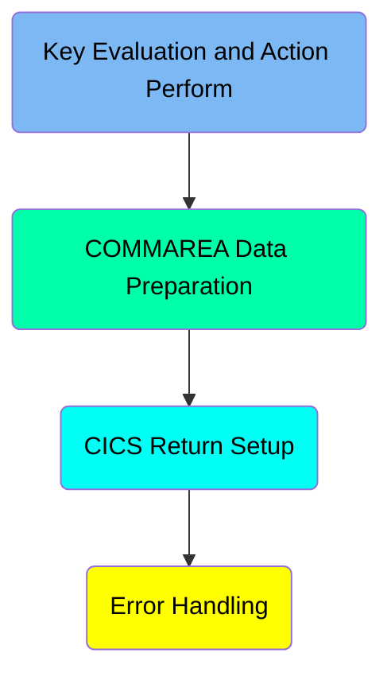
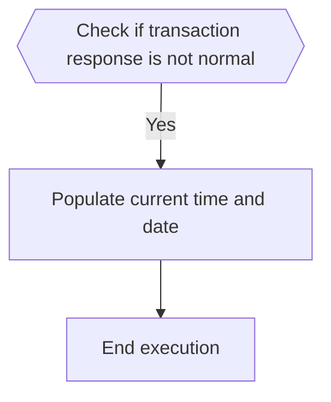

# Managing Account (BNK1DAC)

The <SwmToken path="src/base/cobol_src/BNK1DAC.cbl" pos="355:4:4" line-data="              MOVE &#39;BNK1DAC - A010 - RETURN TRANSID(ODAC) FAIL&#39; TO">`BNK1DAC`</SwmToken> program is responsible for handling various key presses and preparing data for communication in the CICS Bank Sample Application. It evaluates key inputs, performs corresponding actions, and manages the communication area (COMMAREA) data. The program ensures that the correct data is prepared and returned based on the key pressed by the user.

The <SwmToken path="src/base/cobol_src/BNK1DAC.cbl" pos="355:4:4" line-data="              MOVE &#39;BNK1DAC - A010 - RETURN TRANSID(ODAC) FAIL&#39; TO">`BNK1DAC`</SwmToken> program starts by checking if it is the first time through and sends a map with erased data fields if true. It then handles different key presses such as PA, PF3, <SwmToken path="src/base/cobol_src/BNK1DAC.cbl" pos="693:21:21" line-data="           STRING &#39;If you wish to delete the Account press &lt;PF5&gt;.&#39;">`PF5`</SwmToken>, PF12, CLEAR, ENTER, and invalid keys by performing specific actions like continuing, returning to the main menu, processing the map, sending termination messages, erasing the screen, and sending invalid key messages. The program also prepares the COMMAREA data by transferring account information or initializing the communication area based on the account type. Finally, it handles the response of a transaction initiation and performs error handling by capturing and logging relevant information.

Here is a high level diagram of the program:



## Key Evaluation and Action Perform

```mermaid
graph TD
  A[Start] --> B{Is it the first time through?}
  B -- Yes --> C[Send map with erased data fields]
  B -- No --> D{Which key is pressed?}
  D -- PA Key --> E[Continue]
  D -- PF3 --> F[Return to main menu]
  D -- PF5 --> G[Process map]
  D -- PF12 --> H[Send termination message]
  D -- CLEAR --> I[Erase and free keyboard]
  D -- ENTER --> J[Process map]
  D -- Other --> K[Send invalid key message]
  F --> L[End]
  G --> L
  H --> L
  I --> L
  J --> L
  K --> L

%% Swimm:
%% graph TD
%%   A[Start] --> B{Is it the first time through?}
%%   B -- Yes --> C[Send map with erased data fields]
%%   B -- No --> D{Which key is pressed?}
%%   D -- PA Key --> E[Continue]
%%   D -- PF3 --> F[Return to main menu]
%%   D -- <SwmToken path="src/base/cobol_src/BNK1DAC.cbl" pos="693:21:21" line-data="           STRING &#39;If you wish to delete the Account press &lt;PF5&gt;.&#39;">`PF5`</SwmToken> --> G[Process map]
%%   D -- PF12 --> H[Send termination message]
%%   D -- CLEAR --> I[Erase and free keyboard]
%%   D -- ENTER --> J[Process map]
%%   D -- Other --> K[Send invalid key message]
%%   F --> L[End]
%%   G --> L
%%   H --> L
%%   I --> L
%%   J --> L
%%   K --> L
```



<SwmSnippet path="/src/base/cobol_src/BNK1DAC.cbl" line="191">

---

### Handling First Time Through

First, the code checks if it is the first time through by evaluating if <SwmToken path="src/base/cobol_src/BNK1DAC.cbl" pos="196:3:3" line-data="              WHEN EIBCALEN = ZERO">`EIBCALEN`</SwmToken> is zero. If it is, it moves low values to <SwmToken path="src/base/cobol_src/BNK1DAC.cbl" pos="197:9:9" line-data="                 MOVE LOW-VALUE TO BNK1DAO">`BNK1DAO`</SwmToken>, sets <SwmToken path="src/base/cobol_src/BNK1DAC.cbl" pos="198:8:8" line-data="                 MOVE -1 TO ACCNOL">`ACCNOL`</SwmToken> to -1, sets <SwmToken path="src/base/cobol_src/BNK1DAC.cbl" pos="199:3:5" line-data="                 SET SEND-ERASE TO TRUE">`SEND-ERASE`</SwmToken> to true, initializes <SwmToken path="src/base/cobol_src/BNK1DAC.cbl" pos="200:3:7" line-data="                 INITIALIZE WS-COMM-AREA">`WS-COMM-AREA`</SwmToken>, and performs <SwmToken path="src/base/cobol_src/BNK1DAC.cbl" pos="201:3:5" line-data="                 PERFORM SEND-MAP">`SEND-MAP`</SwmToken> to send the map with erased data fields.

```cobol
           EVALUATE TRUE
      *
      *       Is it the first time through? If so, send the map
      *       with erased (empty) data fields.
      *
              WHEN EIBCALEN = ZERO
                 MOVE LOW-VALUE TO BNK1DAO
                 MOVE -1 TO ACCNOL
                 SET SEND-ERASE TO TRUE
                 INITIALIZE WS-COMM-AREA
                 PERFORM SEND-MAP
```

---

</SwmSnippet>

<SwmSnippet path="/src/base/cobol_src/BNK1DAC.cbl" line="204">

---

### Handling PA Key Press

Next, if a PA key (<SwmToken path="src/base/cobol_src/BNK1DAC.cbl" pos="206:7:7" line-data="              WHEN EIBAID = DFHPA1 OR DFHPA2 OR DFHPA3">`DFHPA1`</SwmToken>, <SwmToken path="src/base/cobol_src/BNK1DAC.cbl" pos="206:11:11" line-data="              WHEN EIBAID = DFHPA1 OR DFHPA2 OR DFHPA3">`DFHPA2`</SwmToken>, or <SwmToken path="src/base/cobol_src/BNK1DAC.cbl" pos="206:15:15" line-data="              WHEN EIBAID = DFHPA1 OR DFHPA2 OR DFHPA3">`DFHPA3`</SwmToken>) is pressed, the code simply continues without any additional actions.

```cobol
      *       If a PA key is pressed, just carry on
      *
              WHEN EIBAID = DFHPA1 OR DFHPA2 OR DFHPA3
                 CONTINUE
```

---

</SwmSnippet>

<SwmSnippet path="/src/base/cobol_src/BNK1DAC.cbl" line="210">

---

### Handling PF3 Key Press

When the PF3 key is pressed, the code executes a CICS RETURN command to return to the main menu by setting the transaction ID to 'OMEN' and handling the response codes.

```cobol
      *       When Pf3 is pressed, return to the main menu
      *
              WHEN EIBAID = DFHPF3
                 EXEC CICS RETURN
                    TRANSID('OMEN')
                    IMMEDIATE
                    RESP(WS-CICS-RESP)
                    RESP2(WS-CICS-RESP2)
                 END-EXEC
```

---

</SwmSnippet>

<SwmSnippet path="/src/base/cobol_src/BNK1DAC.cbl" line="221">

---

### Handling <SwmToken path="src/base/cobol_src/BNK1DAC.cbl" pos="693:21:21" line-data="           STRING &#39;If you wish to delete the Account press &lt;PF5&gt;.&#39;">`PF5`</SwmToken> Key Press

When the <SwmToken path="src/base/cobol_src/BNK1DAC.cbl" pos="693:21:21" line-data="           STRING &#39;If you wish to delete the Account press &lt;PF5&gt;.&#39;">`PF5`</SwmToken> key is pressed, the code performs the <SwmToken path="src/base/cobol_src/BNK1DAC.cbl" pos="224:3:5" line-data="                 PERFORM PROCESS-MAP">`PROCESS-MAP`</SwmToken> routine to process the map.

```cobol
      *       When Pf5 is pressed, process the map
      *
              WHEN EIBAID = DFHPF5
                 PERFORM PROCESS-MAP
```

---

</SwmSnippet>

<SwmSnippet path="/src/base/cobol_src/BNK1DAC.cbl" line="227">

---

### Handling PF12 Key Press

When the PF12 key is pressed, the code performs the <SwmToken path="src/base/cobol_src/BNK1DAC.cbl" pos="231:3:7" line-data="                 PERFORM SEND-TERMINATION-MSG">`SEND-TERMINATION-MSG`</SwmToken> routine to send a termination message and then executes a CICS RETURN command.

```cobol
      *       When Pf12 is pressed, send a termination
      *       message.
      *
              WHEN EIBAID = DFHPF12
                 PERFORM SEND-TERMINATION-MSG

                 EXEC CICS
                    RETURN
                 END-EXEC
```

---

</SwmSnippet>

<SwmSnippet path="/src/base/cobol_src/BNK1DAC.cbl" line="238">

---

### Handling CLEAR Key Press

When the CLEAR key is pressed, the code sends a control command to erase the screen and free the keyboard, followed by a CICS RETURN command.

```cobol
      *       When CLEAR is pressed
      *
              WHEN EIBAID = DFHCLEAR
                EXEC CICS SEND CONTROL
                          ERASE
                          FREEKB
                END-EXEC

                EXEC CICS RETURN
                END-EXEC
```

---

</SwmSnippet>

<SwmSnippet path="/src/base/cobol_src/BNK1DAC.cbl" line="250">

---

### Handling ENTER Key Press

When the ENTER key is pressed, the code performs the <SwmToken path="src/base/cobol_src/BNK1DAC.cbl" pos="253:3:5" line-data="                 PERFORM PROCESS-MAP">`PROCESS-MAP`</SwmToken> routine to process the map.

```cobol
      *       When enter is pressed then process the content
      *
              WHEN EIBAID = DFHENTER
                 PERFORM PROCESS-MAP

```

---

</SwmSnippet>

<SwmSnippet path="/src/base/cobol_src/BNK1DAC.cbl" line="256">

---

### Handling Invalid Key Press

When any other key is pressed, the code moves low values to <SwmToken path="src/base/cobol_src/BNK1DAC.cbl" pos="259:9:9" line-data="                 MOVE LOW-VALUES TO BNK1DAO">`BNK1DAO`</SwmToken>, sets an 'Invalid key pressed.' message to <SwmToken path="src/base/cobol_src/BNK1DAC.cbl" pos="260:14:14" line-data="                 MOVE &#39;Invalid key pressed.&#39; TO MESSAGEO">`MESSAGEO`</SwmToken>, sets <SwmToken path="src/base/cobol_src/BNK1DAC.cbl" pos="261:8:8" line-data="                 MOVE -1 TO ACCNOL">`ACCNOL`</SwmToken> to -1, sets <SwmToken path="src/base/cobol_src/BNK1DAC.cbl" pos="262:3:7" line-data="                 SET SEND-DATAONLY-ALARM TO TRUE">`SEND-DATAONLY-ALARM`</SwmToken> to true, and performs <SwmToken path="src/base/cobol_src/BNK1DAC.cbl" pos="264:3:5" line-data="                 PERFORM SEND-MAP">`SEND-MAP`</SwmToken> to send the invalid key message.

```cobol
      *       When anything else happens, send the invalid key message
      *
              WHEN OTHER
                 MOVE LOW-VALUES TO BNK1DAO
                 MOVE 'Invalid key pressed.' TO MESSAGEO
                 MOVE -1 TO ACCNOL
                 SET SEND-DATAONLY-ALARM TO TRUE

                 PERFORM SEND-MAP

```

---

</SwmSnippet>

## COMMAREA Data Preparation

This is the next section of the flow.

```mermaid
graph TD
  A[Check if INQACC-EYE is 'ACCT'] -->|Yes| B[Move INQACC fields to WS-COMM fields]
  A -->|No| C[Initialize WS-COMM-AREA]

%% Swimm:
%% graph TD
%%   A[Check if <SwmToken path="src/base/cobol_src/BNK1DAC.cbl" pos="275:3:5" line-data="              IF INQACC-EYE = &#39;ACCT&#39;">`INQACC-EYE`</SwmToken> is 'ACCT'] -->|Yes| B[Move INQACC fields to <SwmToken path="src/base/cobol_src/BNK1DAC.cbl" pos="200:3:5" line-data="                 INITIALIZE WS-COMM-AREA">`WS-COMM`</SwmToken> fields]
%%   A -->|No| C[Initialize WS-COMM-AREA]
```



<SwmSnippet path="/src/base/cobol_src/BNK1DAC.cbl" line="275">

---

### Checking Account Type

First, we check if <SwmToken path="src/base/cobol_src/BNK1DAC.cbl" pos="275:3:5" line-data="              IF INQACC-EYE = &#39;ACCT&#39;">`INQACC-EYE`</SwmToken> (which holds the account type) is equal to 'ACCT'. This condition determines if the subsequent account information transfer should occur.

```cobol
              IF INQACC-EYE = 'ACCT'
```

---

</SwmSnippet>

<SwmSnippet path="/src/base/cobol_src/BNK1DAC.cbl" line="276">

---

### Transferring Account Information

Moving to the next step, if the account type is 'ACCT', we transfer various fields from <SwmToken path="src/base/cobol_src/BNK1DAC.cbl" pos="276:3:3" line-data="                 MOVE INQACC-EYE          TO WS-COMM-EYE">`INQACC`</SwmToken> (which holds the inquiry account details) to <SwmToken path="src/base/cobol_src/BNK1DAC.cbl" pos="276:9:11" line-data="                 MOVE INQACC-EYE          TO WS-COMM-EYE">`WS-COMM`</SwmToken> (which is the working storage communication area). This includes customer number, account number, account type, interest rate, and balance details. This transfer ensures that the working storage area has the latest account information for further processing.

```cobol
                 MOVE INQACC-EYE          TO WS-COMM-EYE
                 MOVE INQACC-CUSTNO       TO WS-COMM-CUSTNO
                 MOVE INQACC-SCODE        TO WS-COMM-SCODE
                 MOVE INQACC-ACCNO        TO WS-COMM-ACCNO
                 MOVE INQACC-ACC-TYPE     TO WS-COMM-ACC-TYPE
                 MOVE INQACC-INT-RATE     TO WS-COMM-INT-RATE
                 MOVE INQACC-OPENED       TO WS-COMM-OPENED
                 MOVE INQACC-OVERDRAFT    TO WS-COMM-OVERDRAFT
                 MOVE INQACC-LAST-STMT-DT TO WS-COMM-LAST-STMT-DT
                 MOVE INQACC-NEXT-STMT-DT TO WS-COMM-NEXT-STMT-DT
                 MOVE INQACC-AVAIL-BAL    TO WS-COMM-AVAIL-BAL
                 MOVE INQACC-ACTUAL-BAL   TO WS-COMM-ACTUAL-BAL
                 MOVE INQACC-SUCCESS      TO WS-COMM-SUCCESS
```

---

</SwmSnippet>

<SwmSnippet path="/src/base/cobol_src/BNK1DAC.cbl" line="289">

---

### Initializing Communication Area

Then, if the account type is not 'ACCT', we initialize <SwmToken path="src/base/cobol_src/BNK1DAC.cbl" pos="290:3:7" line-data="                 INITIALIZE WS-COMM-AREA">`WS-COMM-AREA`</SwmToken> to reset any previous data. This ensures that no outdated or irrelevant data is carried forward.

```cobol
              ELSE
                 INITIALIZE WS-COMM-AREA
              END-IF
```

---

</SwmSnippet>

### Interim Summary

So far, we saw how different key presses are handled in the CICS Bank Sample Application, including actions for PA, PF3, <SwmToken path="src/base/cobol_src/BNK1DAC.cbl" pos="693:21:21" line-data="           STRING &#39;If you wish to delete the Account press &lt;PF5&gt;.&#39;">`PF5`</SwmToken>, PF12, CLEAR, ENTER, and invalid keys. Now, we will focus on the preparation of the COMMAREA data.

## CICS Return Setup



<SwmSnippet path="/src/base/cobol_src/BNK1DAC.cbl" line="296">

---

### Handling the Response of a Transaction Initiation

First, the transaction is initiated with the <SwmToken path="src/base/cobol_src/BNK1DAC.cbl" pos="296:1:8" line-data="              RETURN TRANSID(&#39;ODAC&#39;)">`RETURN TRANSID('ODAC')`</SwmToken> command, which specifies the transaction ID. The <SwmToken path="src/base/cobol_src/BNK1DAC.cbl" pos="297:1:1" line-data="              COMMAREA(WS-COMM-AREA)">`COMMAREA`</SwmToken> is set to <SwmToken path="src/base/cobol_src/BNK1DAC.cbl" pos="297:3:7" line-data="              COMMAREA(WS-COMM-AREA)">`WS-COMM-AREA`</SwmToken>, which is the communication area for passing data. The <SwmToken path="src/base/cobol_src/BNK1DAC.cbl" pos="298:1:1" line-data="              LENGTH(102)">`LENGTH`</SwmToken> is set to 102, indicating the length of the communication area. The <SwmToken path="src/base/cobol_src/BNK1DAC.cbl" pos="299:1:1" line-data="              RESP(WS-CICS-RESP)">`RESP`</SwmToken> and <SwmToken path="src/base/cobol_src/BNK1DAC.cbl" pos="300:1:1" line-data="              RESP2(WS-CICS-RESP2)">`RESP2`</SwmToken> fields are used to capture the primary and secondary response codes from the transaction initiation.

```cobol
              RETURN TRANSID('ODAC')
              COMMAREA(WS-COMM-AREA)
              LENGTH(102)
              RESP(WS-CICS-RESP)
              RESP2(WS-CICS-RESP2)
           END-EXEC.

```

---

</SwmSnippet>

<SwmSnippet path="/src/base/cobol_src/BNK1DAC.cbl" line="296">

---

### Checking the Transaction Response

Next, the response of the transaction initiation is checked. If <SwmToken path="src/base/cobol_src/BNK1DAC.cbl" pos="299:3:7" line-data="              RESP(WS-CICS-RESP)">`WS-CICS-RESP`</SwmToken> is not equal to <SwmToken path="src/base/cobol_src/BNK1DAC.cbl" pos="303:13:16" line-data="           IF WS-CICS-RESP NOT = DFHRESP(NORMAL)">`DFHRESP(NORMAL)`</SwmToken>, it indicates that the transaction did not complete successfully. In this case, the <SwmToken path="src/base/cobol_src/BNK1DAC.cbl" pos="322:3:7" line-data="              PERFORM POPULATE-TIME-DATE">`POPULATE-TIME-DATE`</SwmToken> section is called to log the current time and date.

```cobol
              RETURN TRANSID('ODAC')
              COMMAREA(WS-COMM-AREA)
              LENGTH(102)
              RESP(WS-CICS-RESP)
              RESP2(WS-CICS-RESP2)
           END-EXEC.

```

---

</SwmSnippet>

<SwmSnippet path="/src/base/cobol_src/BNK1DAC.cbl" line="1142">

---

### Populating the Current Time and Date

The <SwmToken path="src/base/cobol_src/BNK1DAC.cbl" pos="1142:1:5" line-data="       POPULATE-TIME-DATE SECTION.">`POPULATE-TIME-DATE`</SwmToken> section is responsible for capturing the current time and date. It first displays a message indicating that the section is being executed. Then, it uses the <SwmToken path="src/base/cobol_src/BNK1DAC.cbl" pos="1146:1:5" line-data="           EXEC CICS ASKTIME">`EXEC CICS ASKTIME`</SwmToken> command to get the current time in <SwmToken path="src/base/cobol_src/BNK1DAC.cbl" pos="1147:3:7" line-data="              ABSTIME(WS-U-TIME)">`WS-U-TIME`</SwmToken>. This is followed by the <SwmToken path="src/base/cobol_src/BNK1DAC.cbl" pos="1150:1:5" line-data="           EXEC CICS FORMATTIME">`EXEC CICS FORMATTIME`</SwmToken> command, which formats the time into a readable date (<SwmToken path="src/base/cobol_src/BNK1DAC.cbl" pos="1152:3:7" line-data="                     DDMMYYYY(WS-ORIG-DATE)">`WS-ORIG-DATE`</SwmToken>) and time (<SwmToken path="src/base/cobol_src/BNK1DAC.cbl" pos="1153:3:7" line-data="                     TIME(WS-TIME-NOW)">`WS-TIME-NOW`</SwmToken>).

```cobol
       POPULATE-TIME-DATE SECTION.
       PTD010.
      D    DISPLAY 'POPULATE-TIME-DATE SECTION'.

           EXEC CICS ASKTIME
              ABSTIME(WS-U-TIME)
           END-EXEC.

           EXEC CICS FORMATTIME
                     ABSTIME(WS-U-TIME)
                     DDMMYYYY(WS-ORIG-DATE)
                     TIME(WS-TIME-NOW)
                     DATESEP
           END-EXEC.

       PTD999.
           EXIT.
```

---

</SwmSnippet>

*This is an auto-generated document by Swimm 🌊 and has not yet been verified by a human*

<SwmMeta version="3.0.0" repo-id="Z2l0aHViJTNBJTNBY2ljcy1iYW5raW5nLXNhbXBsZS1hcHBsaWNhdGlvbi1jYnNhLUlCTS1EZW1vJTNBJTNBU3dpbW0tRGVtbw==" repo-name="cics-banking-sample-application-cbsa-IBM-Demo"></SwmMeta>
