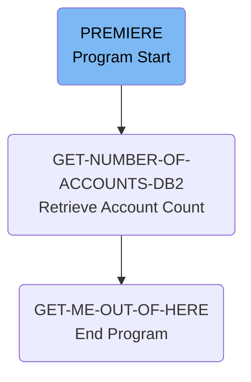

# Managing Account Control Operations (ACCTCTRL)

The ACCTCTRL program is responsible for managing account control operations. It starts by initializing necessary variables and retrieving the number of accounts associated with a given sort code. The program then displays the output data and ends the process.

The flow begins with the <SwmToken path="src/base/cobol_src/ACCTCTRL.cbl" pos="133:1:1" line-data="       PREMIERE SECTION.">`PREMIERE`</SwmToken> section, which initializes the process and retrieves the number of accounts. Next, the <SwmToken path="src/base/cobol_src/ACCTCTRL.cbl" pos="141:3:11" line-data="           PERFORM GET-NUMBER-OF-ACCOUNTS-DB2">`GET-NUMBER-OF-ACCOUNTS-DB2`</SwmToken> section executes an SQL query to count the accounts and sets a success flag based on the query result. Finally, the <SwmToken path="src/base/cobol_src/ACCTCTRL.cbl" pos="148:3:11" line-data="           PERFORM GET-ME-OUT-OF-HERE.">`GET-ME-OUT-OF-HERE`</SwmToken> section ends the program.

Lets' zoom into the flow:



<SwmSnippet path="/src/base/cobol_src/ACCTCTRL.cbl" line="133">

---

### PREMIERE Section

The <SwmToken path="src/base/cobol_src/ACCTCTRL.cbl" pos="133:1:1" line-data="       PREMIERE SECTION.">`PREMIERE`</SwmToken> section initiates the process by moving the <SwmToken path="src/base/cobol_src/ACCTCTRL.cbl" pos="138:3:3" line-data="           MOVE SORTCODE TO">`SORTCODE`</SwmToken> to <SwmToken path="src/base/cobol_src/ACCTCTRL.cbl" pos="139:1:5" line-data="              REQUIRED-SORT-CODE.">`REQUIRED-SORT-CODE`</SwmToken>, then performs the <SwmToken path="src/base/cobol_src/ACCTCTRL.cbl" pos="141:3:11" line-data="           PERFORM GET-NUMBER-OF-ACCOUNTS-DB2">`GET-NUMBER-OF-ACCOUNTS-DB2`</SwmToken> section to retrieve the number of accounts associated with the sort code, displays the output data, and finally performs the <SwmToken path="src/base/cobol_src/ACCTCTRL.cbl" pos="148:3:11" line-data="           PERFORM GET-ME-OUT-OF-HERE.">`GET-ME-OUT-OF-HERE`</SwmToken> section to end the program.

```cobol
       PREMIERE SECTION.
       P010.


           MOVE SORTCODE TO
              REQUIRED-SORT-CODE.

           PERFORM GET-NUMBER-OF-ACCOUNTS-DB2


      D    DISPLAY 'OUTPUT DATA IS='
      D       DFHCOMMAREA.


           PERFORM GET-ME-OUT-OF-HERE.

       P999.
           EXIT.
```

---

</SwmSnippet>

<SwmSnippet path="/src/base/cobol_src/ACCTCTRL.cbl" line="157">

---

### <SwmToken path="src/base/cobol_src/ACCTCTRL.cbl" pos="157:1:9" line-data="       GET-NUMBER-OF-ACCOUNTS-DB2 SECTION.">`GET-NUMBER-OF-ACCOUNTS-DB2`</SwmToken> Section

The <SwmToken path="src/base/cobol_src/ACCTCTRL.cbl" pos="157:1:9" line-data="       GET-NUMBER-OF-ACCOUNTS-DB2 SECTION.">`GET-NUMBER-OF-ACCOUNTS-DB2`</SwmToken> section initializes the <SwmToken path="src/base/cobol_src/ACCTCTRL.cbl" pos="160:3:3" line-data="           INITIALIZE DFHCOMMAREA.">`DFHCOMMAREA`</SwmToken>, moves the <SwmToken path="src/base/cobol_src/ACCTCTRL.cbl" pos="163:3:7" line-data="           MOVE REQUIRED-SORT-CODE TO HV-ACCOUNT-SORTCODE">`REQUIRED-SORT-CODE`</SwmToken> to <SwmToken path="src/base/cobol_src/ACCTCTRL.cbl" pos="163:11:15" line-data="           MOVE REQUIRED-SORT-CODE TO HV-ACCOUNT-SORTCODE">`HV-ACCOUNT-SORTCODE`</SwmToken>, and executes an SQL query to count the number of accounts with the given sort code. If the SQL query is successful, it sets the <SwmToken path="src/base/cobol_src/ACCTCTRL.cbl" pos="173:9:15" line-data="             MOVE &#39;Y&#39; TO ACCOUNT-CONTROL-SUCCESS-FLAG">`ACCOUNT-CONTROL-SUCCESS-FLAG`</SwmToken> to 'Y' and moves the count to <SwmToken path="src/base/cobol_src/ACCTCTRL.cbl" pos="157:3:7" line-data="       GET-NUMBER-OF-ACCOUNTS-DB2 SECTION.">`NUMBER-OF-ACCOUNTS`</SwmToken>. Otherwise, it sets the flag to 'N' and moves the <SwmToken path="src/base/cobol_src/ACCTCTRL.cbl" pos="172:3:3" line-data="           IF SQLCODE = ZERO">`SQLCODE`</SwmToken> to <SwmToken path="src/base/cobol_src/ACCTCTRL.cbl" pos="177:7:9" line-data="             MOVE SQLCODE TO SQLCODE-DISPLAY">`SQLCODE-DISPLAY`</SwmToken>.

```cobol
       GET-NUMBER-OF-ACCOUNTS-DB2 SECTION.
       WCD010.

           INITIALIZE DFHCOMMAREA.


           MOVE REQUIRED-SORT-CODE TO HV-ACCOUNT-SORTCODE

           EXEC SQL
              SELECT COUNT(*)
              INTO  :HV-NUMBER-OF-ACCOUNTS
              FROM ACCOUNT
              WHERE ACCOUNT_SORTCODE = :HV-ACCOUNT-SORTCODE
           END-EXEC.

           IF SQLCODE = ZERO
             MOVE 'Y' TO ACCOUNT-CONTROL-SUCCESS-FLAG
             MOVE HV-NUMBER-OF-ACCOUNTS TO NUMBER-OF-ACCOUNTS
           ELSE
             MOVE 'N' TO ACCOUNT-CONTROL-SUCCESS-FLAG
             MOVE SQLCODE TO SQLCODE-DISPLAY
```

---

</SwmSnippet>

<SwmSnippet path="/src/base/cobol_src/ACCTCTRL.cbl" line="205">

---

### <SwmToken path="src/base/cobol_src/ACCTCTRL.cbl" pos="205:1:9" line-data="       GET-ME-OUT-OF-HERE SECTION.">`GET-ME-OUT-OF-HERE`</SwmToken> Section

The <SwmToken path="src/base/cobol_src/ACCTCTRL.cbl" pos="205:1:9" line-data="       GET-ME-OUT-OF-HERE SECTION.">`GET-ME-OUT-OF-HERE`</SwmToken> section simply executes a CICS RETURN command to end the program.

```cobol
       GET-ME-OUT-OF-HERE SECTION.
       GMOFH010.

           EXEC CICS RETURN
           END-EXEC.

       GMOFH999.
           EXIT.
```

---

</SwmSnippet>

&nbsp;

*This is an auto-generated document by Swimm 🌊 and has not yet been verified by a human*

<SwmMeta version="3.0.0" repo-id="Z2l0aHViJTNBJTNBY2ljcy1iYW5raW5nLXNhbXBsZS1hcHBsaWNhdGlvbi1jYnNhLUlCTS1EZW1vJTNBJTNBU3dpbW0tRGVtbw==" repo-name="cics-banking-sample-application-cbsa-IBM-Demo"></SwmMeta>
