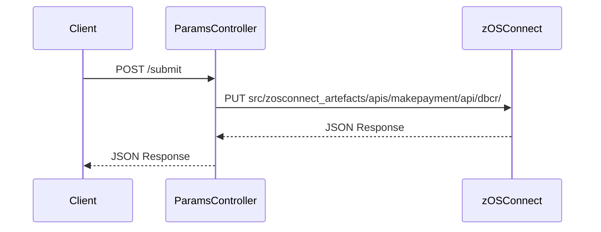

# Payment Interface Overview

## Payment Interface Overview

The Payment Interface is a Spring Boot application designed to handle backend banking data through a series of RESTful API calls. These API calls are made to a zOS Connect server, which then routes the requests to a CICS region.

## Accessing the Payment Interface

The interface can be accessed via a specific URL, which is structured based on the host name and port number assigned during the installation process.

## Payment Landing Page

The Payment Interface consists of a single landing page where companies can request payments or issue refunds. The functionality provided by the Payment Interface mimics the functions available in the BMS and Liberty UI interfaces used by the Bank Teller.

<SwmSnippet path="/src/Z-OS-Connect-Payment-Interface/src/main/java/com/ibm/cics/cip/bank/springboot/paymentinterface/controllers/WebController.java" line="50">

---

The <SwmToken path="src/Z-OS-Connect-Payment-Interface/src/main/java/com/ibm/cics/cip/bank/springboot/paymentinterface/controllers/WebController.java" pos="52:5:5" line-data="	public String showForm(TransferForm personForm)">`showForm`</SwmToken> method in the <SwmToken path="src/Z-OS-Connect-Payment-Interface/src/main/java/com/ibm/cics/cip/bank/springboot/paymentinterface/controllers/WebController.java" pos="34:4:4" line-data="public class WebController implements WebMvcConfigurer">`WebController`</SwmToken> class is used to display the payment interface form.

```java
	// Payment Interface
	@GetMapping(value={"/",""})
	public String showForm(TransferForm personForm)
	{
		return FORM_NAME;
	}
```

---

</SwmSnippet>

<SwmSnippet path="/src/Z-OS-Connect-Payment-Interface/src/main/java/com/ibm/cics/cip/bank/springboot/paymentinterface/controllers/WebController.java" line="58">

---

The <SwmToken path="src/Z-OS-Connect-Payment-Interface/src/main/java/com/ibm/cics/cip/bank/springboot/paymentinterface/controllers/WebController.java" pos="59:5:5" line-data="	public String checkPersonInfo(@Valid TransferForm transferForm,">`checkPersonInfo`</SwmToken> method in the <SwmToken path="src/Z-OS-Connect-Payment-Interface/src/main/java/com/ibm/cics/cip/bank/springboot/paymentinterface/controllers/WebController.java" pos="34:4:4" line-data="public class WebController implements WebMvcConfigurer">`WebController`</SwmToken> class handles the form submission for processing payments or issuing refunds.

```java
	@PostMapping("/paydbcr")
	public String checkPersonInfo(@Valid TransferForm transferForm,
			BindingResult bindingResult, Model model)
			throws JsonProcessingException
	{

		// The same page is returned, this time with the errors given as an
		// object.
		if (bindingResult.hasErrors())
		{
			return FORM_NAME;
		}

		PaymentInterfaceJson transferjson = new PaymentInterfaceJson(
				transferForm);

		// Serialise the object to JSON
		log.info("{}", transferjson);
		String jsonString = new ObjectMapper().writeValueAsString(transferjson);
		log.info(jsonString);
```

---

</SwmSnippet>

## Payment Interface Endpoints

The Payment Interface provides several endpoints to handle different payment-related operations.

### Submit Endpoint

The <SwmToken path="src/Z-OS-Connect-Payment-Interface/src/main/java/com/ibm/cics/cip/bank/springboot/paymentinterface/controllers/ParamsController.java" pos="35:6:6" line-data="	@PostMapping(&quot;/submit&quot;)">`submit`</SwmToken> endpoint is a POST request that handles payment submissions. It takes parameters such as account number, amount, and organization, and processes the payment by making a call to the zOS Connect server. The response is returned as a <SwmToken path="src/Z-OS-Connect-Payment-Interface/src/main/java/com/ibm/cics/cip/bank/springboot/paymentinterface/controllers/WebController.java" pos="71:1:1" line-data="		PaymentInterfaceJson transferjson = new PaymentInterfaceJson(">`PaymentInterfaceJson`</SwmToken> object.

<SwmSnippet path="/src/Z-OS-Connect-Payment-Interface/src/main/java/com/ibm/cics/cip/bank/springboot/paymentinterface/controllers/ParamsController.java" line="35">

---

The <SwmToken path="src/Z-OS-Connect-Payment-Interface/src/main/java/com/ibm/cics/cip/bank/springboot/paymentinterface/controllers/ParamsController.java" pos="35:6:6" line-data="	@PostMapping(&quot;/submit&quot;)">`submit`</SwmToken> method in the <SwmToken path="src/Z-OS-Connect-Payment-Interface/src/main/java/com/ibm/cics/cip/bank/springboot/paymentinterface/controllers/ParamsController.java" pos="23:4:4" line-data="public class ParamsController">`ParamsController`</SwmToken> class processes the payment submission and communicates with the zOS Connect server.

```java
	@PostMapping("/submit")
	public PaymentInterfaceJson submit(
			@RequestParam(name = "acctnum", required = true) String acctNumber,
			@RequestParam(name = "amount", required = true) float amount,
			@RequestParam(name = "organisation", required = true) String organisation)
			throws JsonProcessingException
	{
		log.info("AcctNumber: {}, Amount {}, Organisation {}", acctNumber,
				amount, organisation);
		TransferForm transferForm = new TransferForm(acctNumber, amount,
				organisation);

		PaymentInterfaceJson transferJson = new PaymentInterfaceJson(
				transferForm);

		String jsonString = new ObjectMapper().writeValueAsString(transferJson);
		log.info(jsonString);

		WebClient client = WebClient.create(
				ConnectionInfo.getAddressAndPort() + "/makepayment/dbcr");
		PaymentInterfaceJson responseObj;
```

---

</SwmSnippet>



&nbsp;

*This is an auto-generated document by Swimm 🌊 and has not yet been verified by a human*

<SwmMeta version="3.0.0" repo-id="Z2l0aHViJTNBJTNBY2ljcy1iYW5raW5nLXNhbXBsZS1hcHBsaWNhdGlvbi1jYnNhLUlCTS1EZW1vJTNBJTNBU3dpbW0tRGVtbw==" repo-name="cics-banking-sample-application-cbsa-IBM-Demo"></SwmMeta>
